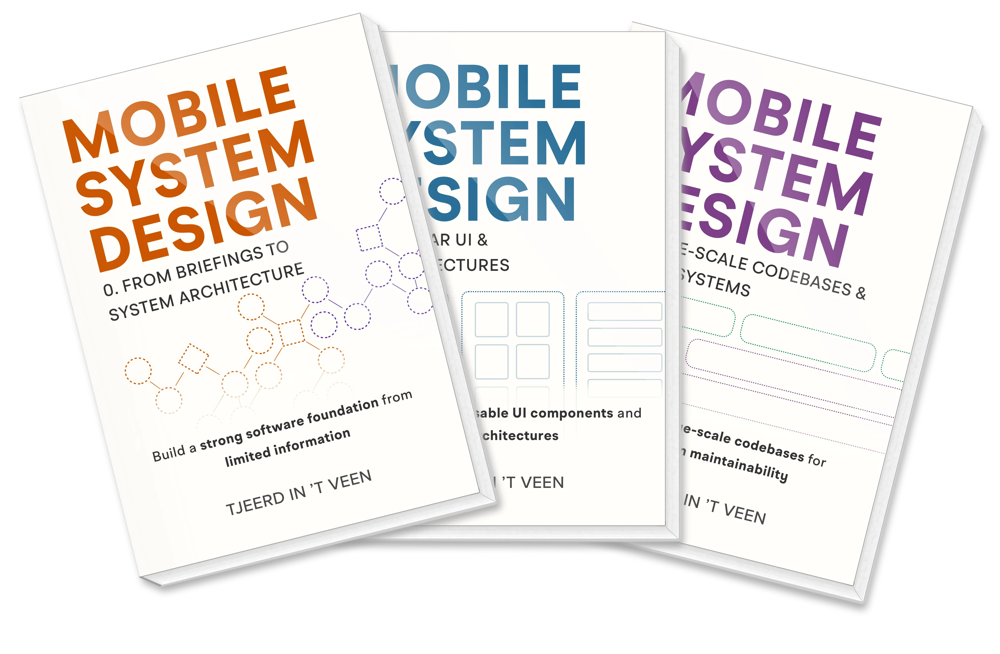

# 📚 Mobile System Design 서적 스터디

## 🙌 목표

<div align="center">
  
</div>

- [Mobile System Design](https://www.mobilesystemdesign.com/book/) 서적 완독

## 📌 진행 방식

- 매주 수요일 오후 9시 30분 진행
- 매주 지정된 범위까지 독서 후 주요 내용 요약 및 정리
- 매주 퀴즈 출제자를 랜덤으로 선정하여, 해당 주차 학습 내용 기반의 퀴즈를 진행
- 퀴즈 진행 후 토론 및 질의 진행

## 📌 기타

### PR

- 제목 : [WEEK `${02d}`] `닉네임`
- e.g. : [WEEK 01] hoyahozz

### 패키지 구조

- `week${%02d} / ${닉네임}.md`

```
📂week01
  - 📃DongChyeon.md
  - 📃hoyahozz.md
📂week02
  - 📃jihee-dev.md
  - 📃jinukeu.md
📂week03
  - 📃SeonJeongk.md
  - 📃sksowk156.md

...TOBE...
```

## 👥 멤버

<div align="center">
  <table style="font-weight: bold">
      <tr>
          <td align="center">
              <a href="https://github.com/DongChyeon">
                  
              </a>
          </td>
          <td align="center">
              <a href="https://github.com/hoyahozz">
                  
              </a>
          </td>
          <td align="center">
              <a href="https://github.com/jihee-dev">
                  
              </a>
          </td>
          <td align="center">
              <a href="https://github.com/jinukeu">
                  
              </a>
          </td>
          <td align="center">
              <a href="https://github.com/SeonJeongk">
                  
              </a>
          </td>
          <td align="center">
              <a href="https://github.com/sksowk156">
                  
              </a>
          </td>
      </tr>
      <tr>
          <td align="center"><a href="https://github.com/DongChyeon">DongChyeon</a></td>
          <td align="center"><a href="https://github.com/hoyahozz">hoyahozz</a></td>
          <td align="center"><a href="https://github.com/jihee-dev">jihee-dev</a></td>
          <td align="center"><a href="https://github.com/jinukeu">jinukeu</a></td>
          <td align="center"><a href="https://github.com/SeonJeongk">SeonJeongk</a></td>
          <td align="center"><a href="https://github.com/sksowk156">sksowk156</a></td>
      </tr>
  </table>
</div>
