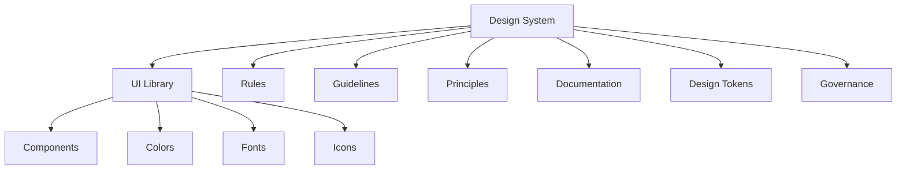
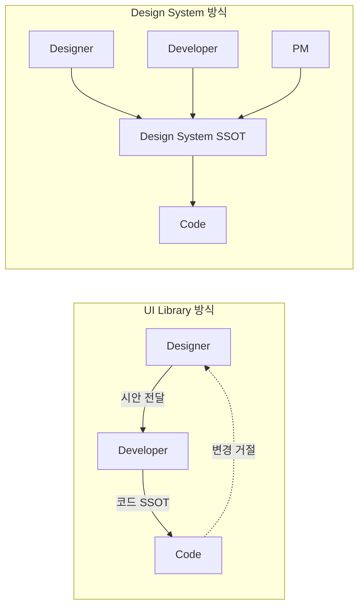
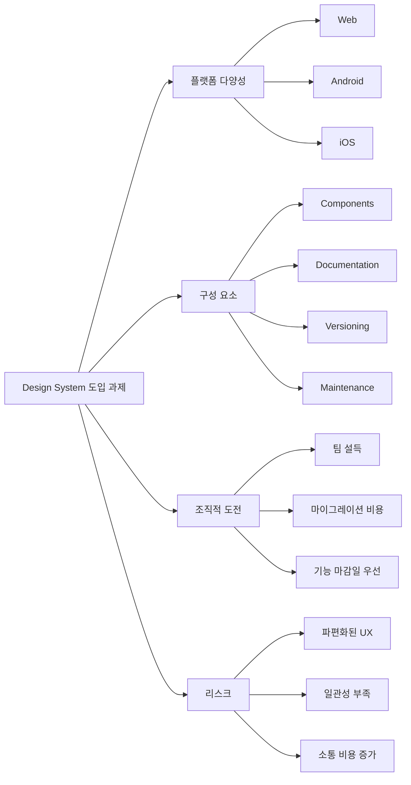
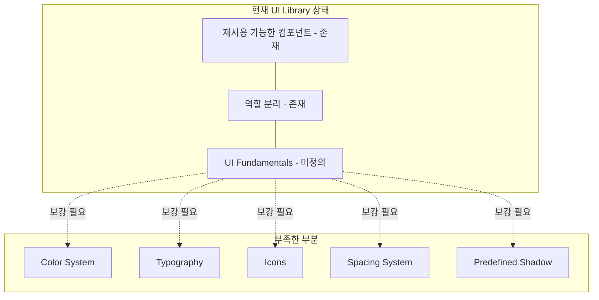
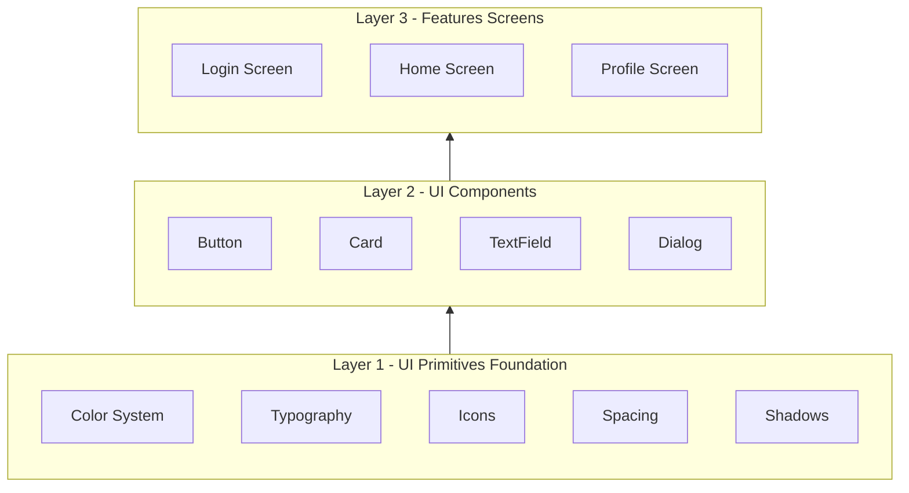
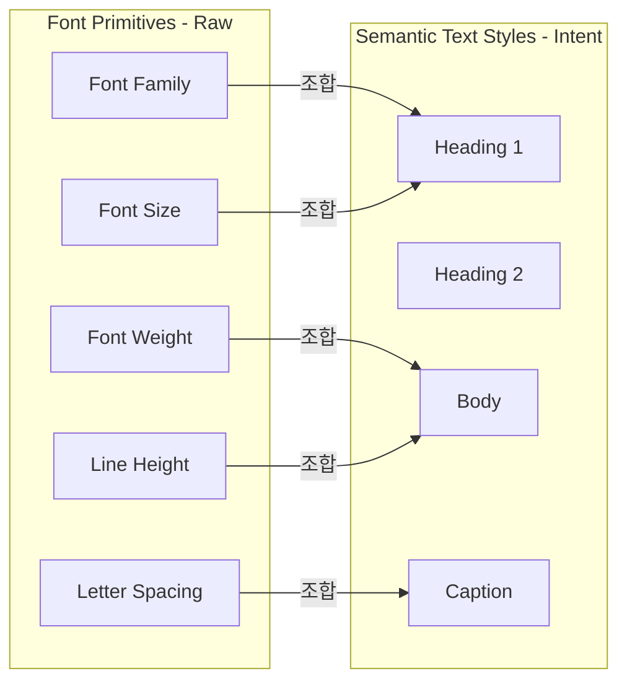
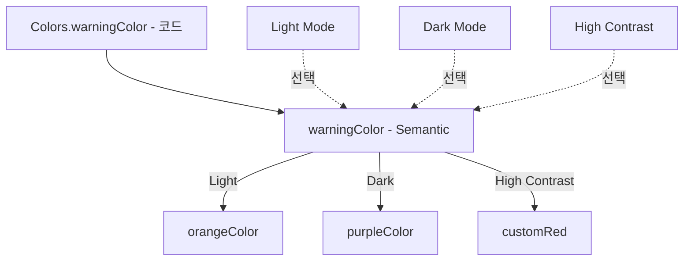
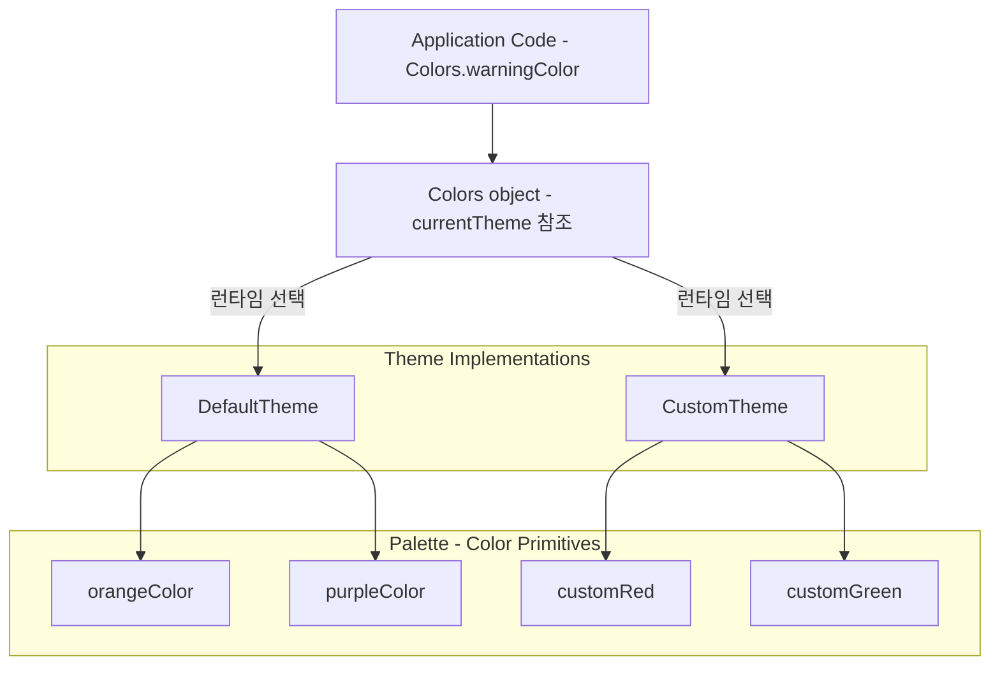

# Design Systems or Not: How a UI Library Lays the Groundwork

### What is a design system?

- 디자인 시스템의 보편적인 의미는 재사용가능한 컴포넌트, 가이드라인, 그리고 동일한 UX를 제공하는 UI 모음집이라고 생각한다
- 간단하게는, 플랫폼 간에 프로덕트가 일관성 있는 외관을 보여주도록 만드는 것이다.
- 디자인 시스템은 디자이너, 개발자, 기획자, 그리고 다른 이해관계자들 사이의 우리가 만드는 제품의 UI를 어떻게 정의할지에 대한 공식적이고 공유된 언어이다.
- 모바일 앱에서는 디자인 시스템은 재사용 가능한 컴포넌트들과 코드베이스에 중앙화된 스타일로 표현된다.

### Differences between design systems and UI libraries



- UI 라이브러리는 독립적으로 존재할 수 있지만, 디자인 시스템의 일부이기도 하다
- UI 라이브러리는 색상, 폰트, 아이콘, 재사용 가능한 컴포넌트를 포함한다.
- 반면에, 디자인 시스템은 컬러, 폰트, 아이콘, 컴포넌트들 뿐만 아니라 이를 사용하기 위한 룰, 가이드라인, 원칙 등도 제공한다.
- 예를 들어
    - UI 라이브러리가 재사용 가능한 버튼 컴포넌트를 제공하면
    - 디자인 시스템은 primary 버튼을 언제 사용해야 할지
    - 접근성을 어떻게 보장할지, 시각 계층을 유지하기 위해 공간을 얼마나 둘지도 알려준다.

### Ownership in UI libraries

- 디자이너가 UI와 컴포넌트를 만들면, 개발자는 빠르게 재사용 가능한 UI 라이브러리를 만든다.
- 개발한 UI 라이브러리를 SSOT로 하게된다면 조직적으로 문제가 되는 부분이 많다.
    - 만약, 디자이너가 컴포넌트를 변경하면 개발자는 이 컴포넌트는 해당 변경을 염두해주지 않았어요. 이런식으로 방어를 할 것이다.
    - 유연한 개발자라도 일정 압박과 시스템 압박 때문에 어쩔수없이 디자이너의 수정을 거절하는 경우가 있다.

#### Shared ownership in design systems



- UI 라이브러리와는 다르게 디자인 시스템은 팀차원에서 공유되어 있고 좀 더 공식적이다.
- 컴포넌트들을 개발자가 만든 SSOT에 의존시키지 않고, 전체 팀에게 디자인시스템이 SSOT가 되면서, 컴포넌트의 구현뿐만 아니라 가이드라인, 룰, 의도를 전달한다.
- 디자인 시스템은
    - `이 컴포넌트는 그걸 염두해두고 만들지 않았어요.` 를
    - `이 컴포넌트를 어떻게 일관성을 유지하며 새 요구에 맞게 발전시킬 수 있을까` 라는 대화로 바꿔준다.
- UI 라이브러리에서 SSOT는 개발자의 코드에, 디자인 시스템에서는 팀간의 문서에 존재한다.

### Why a design system matters to developers

- 디자이너가 이미 완성된 시안을 넘겨주는데도 굳이 디자인 시스템이 필요할까 생각이 들 수 있어도
- 디자인 시스템은 디자이너 편하자고 만드는 것이 아닌, 개발자도 편하게 해주고 프로젝트가 점점 커지고 복잡해질 때 대형 사고를 막고 성공하도록 도와준다.

#### A better working culture

- 몇몇 개발자들은 모든 UI 결정이 디자이너로부터 이루어진다고 생각한다.
    - 빈 상태, 에러 상태, 다크 모드, 태블릿 버전 등등
    - 모든 디테일들을 디자이너가 정해주는 것으로 생각한다.
- 버튼이 너무 작아서 태블릿에서 보이지 않거나 마진이 일관되지 않을 경우 개발자는 디자이너에게 `이 버튼 더 넓어져야하지 않나요?`, `여기 패딩 왜 달라요` 라고 할 수 있다.
    - 의도적이지 않더라도, 개발자가 비평가가 되어 디자이너에게 부담을 주게 된다.
- 반면에, 협업가 스타일의 개발자는 이 상황을 다르게 접근한다.
    - 넘겨준 시안을 최종 완성본이 아닌 작업의 시작점으로 여겨 디자이너의 의도를 이해하려고 노력하고, 디자인이 소통의 수단임을 명심한다.
    - 빠진 상태나 다른 플랫폼에 어떻게 적용이 될지, 디자인 시스템을 참고하며 빈틈을 채워간다.
- 그 결과, 디자인 시스템은 디자이너를 사사건건 모든 세부 사항을 설명하거나 개발자가 알아서 추측해서 만들도록 디자인을 던져주어야 하는 `UI 수문장` 이 되지 않도록 막아준다. 대신에, 개발자들도 UI에 대한 책임을 함께 나누어 가지게 된다.

#### Unspoken decisions aren't always in the design

- 디자이너는 모든 동적인 상황과 인터랙션에 대해서 담을 수 없다.
- 개발자로서, 이 갭을 채워야 한다.
    - 이때 디자인 시스템은 개발자가 내린 결정을 감으로 맞춘 것이 아닌
    - 전체적인 디자인 철학과 일치하도록 보장해 주는 원칙을 제공한다.
- 예를 들어, 똑같은 기능에 대해 디자이너가 다크 모드 버전을 따로 만들어 줄 필요가 없다. UI가 디자인 시스템 규칙에 맞게만 되어있다면 라이트 모드를 구현하는 것만으로도 다크 모드 버전은 구현된다.
- 글자 크기 이슈가 생기더라도 디자인 시스템을 통해 어떻게 미세 조정할지 개발자가 스스로 판단할 수 있다.

#### Developers gain autonomy

- 디자인 시스템이 있으면, 개발자는 디자이너가 플랫폼의 모든 것을 파악할 때까지 기다리지 않아도 된다.
- 대신에, 시스템이 명확한 룰과 재사용 가능한 컴포넌트를 제공함으로써 개발자가 독립적으로 일할 수 있도록 도와준다.
- 디자인 시스템은 협업에 있어 좀 더 높은 레벨의 챌린지에 효율적으로 집중할 수 있도록 해준다. (여러 미세 디테일을 하나하나 챙기기보단)

#### Adapting features from other platforms

- 만약 이미 웹에서 구현된 기능을 앱에서 구현하게 된다면 디자이너가 해당 플랫폼에 대응하기 위한 모든 디자인을 제공해줄 필요는 없다.
- 디자인 시스템은 플랫폼에 맞게 기능을 이식하는 데 필요한 규칙 그리고 패턴을 제공해준다.
- 그렇다고 혼자 일하라는 것이 아닌, 디자이너는 핵심 화면의 큰 틀의 방향성에 집중하고, 개발자는 자잘한 디테일을 처리하도록 한다.

#### Experienced developers and design systems

- 만약 숙련된 개발자라면, 반쯤 나온 디자인 스케치를 통해서도 디자이너의 큰 도움이나 성숙한 디자인 시스템 없이 기능을 구현할 수 있다.
- 하지만 제품이 성장하면서 작은 불일치가 계속 발생하게 된다. (통일된 표준의 부재)
    - 한 화면에서 마진을 변경하면 다른 화면에서 전부 변경해야 할지…. 등등
- 디자인 시스템은 내리는 모든 결정을 앱 전체에서 재사용 가능하고 일관되게 만들어 줌으로써 이 문제를 방지한다. 확장성을 부여하는 역할을 한다.

#### Design systems help new and onboarding developers

- 새로운 개발자에게 있어 디자인 시스템의 가치는 더 빛을 발한다.
- 디자인 시스템이 없다면 새로 온 개발자는 자그만한 변경에도 그와 유사한 컴포넌트의 구현을 찾아보는 데 시간을 보낸다.
- 디자인 시스템이 있다면 새로온 개발자도 미리 만들어진 컴포넌트나 레이아웃 패턴을 참고할 수 있다.

### Challenges when introducing a design system



- 디자인 시스템은 여러 요소들을 포함한다.
- 모든 feature 팀이 따라야 할 새로운 규칙과 가이드, UI 요소를 정의하는 건 힘든 일이다.
- 웹, 안드로이드, iOS 등 많은 플랫폼을 다룰수록 이 도전은 힘들어진다.

#### Migrating to a design system is challenging

- 만약 열정 넘치는 디자이너가 디자인 시스템을 만들었더라도, 개발자들에게 이 디자인 시스템으로 마이그레이션하도록 설득할 만한 친분과 권한이 없다.
- 성숙한 디자인 시스템은 그 자체로 모두가 참여해야하는 큰 프로젝트다.
    - 컴포넌트, 문서, 유지보수, 버저닝 등등이 필요하다.
- 만약 다른 팀들도 디자인 시스템의 필요성을 이해하더라도, 모든 UI를 새 디자인 시스템으로 옮기는 것보다 당장 눈앞의 기능 마감일을 우선시할 수 밖에 없다.
- 그렇다고 포기하게 되면 각기 다른 컴포넌트와 색상, UI 패턴들로 파편화된 UX를 제공하게 된다.
- 결국에는 하나의 중앙 디자인 시스템으로 합쳐야만 하는 순간이 오기 마련이다.

### Gradually building a design system

- 완벽한 디자인 시스템으로 시작하지 마라.

#### Focusing on a UI library

- UI 라이브러리를 확장하여 디자인 시스템의 일부가 되는 것부터 시작하라
- UI 라이브러리부터 집중하면 팀이 점진적으로 적용할 수 있도록 할 수 있다.
- 앱을 만들 때 우리는 일단 기능부터 만들고, 그 과정에서 재사용할 수 있는 뷰를 추출하는 방식을 택한다. 디자인 시스템을 추가할 때도 동일하게 이미 존재하는 프로젝트에 디자인 시스템을 자연스럽게 통합하라

#### Matching the current way of working

- UI 라이브러리를 확장하는 방식은 기존 개발자들의 작업 방식과 일치한다.
- 일상적인 업무에서 개발자는 기능을 만들기 위해 UI 라이브러리에 버튼을 가져와 화면에 배치한다.
- UI 라이브러리가 디자인 시스템을 지원하게 되면 버튼은 여백, 색상, 타이포, 접근성 등 합의된 결정사항들을 반영하게 된다.
- 이러한 접근은 마찰을 최소화한다. 라이브러리 업데이트를 통해 변경사항이 적용되며, 다른 팀의 반발이 훨씬 줄어든다.
- 사람들의 기존 작업 방식에 맞는 변화를 채택하는 것이 새로운 시스템을 도입하는 가장 쉬운 방법이다.

### The current UI library



책에서 써왔던 예시에 따르면

- 몇몇 기능을 만들고 UI 라이브러리에 재사용 가능한 컴포넌트를 두고 역할도 분리하였지만
- 색상과 같은 모든 UI Fundamentals을 정의하진 않았다.

#### What our UI library is lacking

- 현재 방식대로 가면 시간이 흐를수록 사방에 흩어진 파편들만 남는다.
- UI 라이브러리가 당장 잘 작동하더라도, 일관성을 유지하거나 확장을 가로막는 미세한 문제가 계속 발생할 수 있다.
- 글꼴, 색상, 타이포, 아이콘들을 미리 정의해두지 않으면 각기 다른 것을 적용하여 일관된 시각적 경험을 주는데 방해가 될 뿐만 아니라 개발자 간의 소통 비용도 증가한다.
- 기초에 대한 단단한 기반이 없다면, UI 라이브러리가 당장은 굴러갈지언정 구조가 취약해져서 제품의 확장에 방해가 된다.

#### Filling the gaps with UI primitives

- UI primitives는 UI 라이브러리의 일관성과 구조를 유지하는데 필요한 기초이다.
    - Color System, typography, icon, spacing system, predefined shadow
- 이러한 기반이 다져지면, UI 라이브러리의 통일성이 증가하게 된다.



- UI primitives는 UI를 구축하는 데 있어서 가장 기초가 된다.

### Conclusion

- 디자인 시스템이 iOS와 Android의 어쩔 수 없는 플랫폼에서 오는 차이를 없앨 수는 없다.
- 대신에 색상, 타이포, 스페이싱과 같은 공유 요소를 표준화함으로써 각 플랫폼 고유의 환경에 맞춘 적용이 가능하도록 여지를 남겨둔다.
- 우리의 목표는 완벽한 형태의 획일성이 아닌, 플랫폼의 고유 특성을 존중하면서 중요한 부분에서 일관성을 유지하는 것이다.
- 잘 통합된 UI 라이브러리는 개발자에게 많은 이점을 제공한다. 하지만 디자인 시스템을 적용하려면 기존 기능을 새 시스템에 맞게 마이그레이션해야 한다.
- 진행하다보면, 애초에 완벽한 디자인 시스템까지는 필요없고 잘 관리된 UI 라이브러리 하나로도 충분하다는 것을 느낄 수도 있다.
- UI 컴포넌트를 하나로 모으고 간단한 문서를 추가하는 것만으로도 메리트가 된다.
- 전체 디자인 시스템 구축이든 강력한 UI 라이브러리 구축이든 시작점은 잘 다져진 UI 라이브러리이다.

### What we covered

- 디자인 시스템은 제품 간 플랫폼 간에 일관된 비주얼을 제공해준다.
- UI 라이브러리는 혼자서도 존재할 수 있지만 디자인 시스템의 일부기도 하다.
- UI 라이브러리는 재사용 가능한 뷰나 컴포넌트 (what) 에 집중하는 반면
- 디자인 시스템은 이러한 것들은 언제 어디에 써야 하는지 why와 how를 제공한다.
- 디자인 시스템은 다음을 포함할 수 있다.
    - UI 라이브러리
    - 디자인 토큰
    - 문서
    - 디자인 에셋
    - 관리 체계 (Governance)
- 개발자에게 디자인 시스템의 가치
    - 공유된 시스템으로 디자이너와 개발자의 협업을 발전시킨다.
    - 디자인에서 의논하지 않았던 결정이나 갭을 명확히 한다.
    - 최소한의 디자인 제공만(e.g., 웹 기능을 모바일로 이식)으로도 개발자가 기능을 만들 수 있도록 한다.
    - 구현 디테일에 대한 디자이너의 의존성을 줄임으로써 개발자에게 자율성을 준다.
    - 새로온 개발자에게 좋은 온보딩이 된다.
- UI 라이브러리부터 시작하라
    - 디자인 시스템을 구현하는 것은 밤만 샌다고 적용할 수 있도록 간단하지 않다.
    - 실용적인 접근법은 UI 라이브러리 먼저 집중하는 것이다.
    - UI 라이브러리는 디자인 시스템의 핵심 부분이기 때문에, 좋은 기반을 제공해준다.
    - 만약 UI 라이브러리만으로도 충분하다고 생각하면, 완벽한 디자인 시스템을 만들 필요는 없다.

---

# UI Library Fundamentals, Part I: Typography and Colors

### Typography



- Font primitives 는 확장 가능하고 일관성 있는 타이포그래피의 토대가 된다.
- Font Family, Font Size, Font Weight, Line Height, Letter Spacing 등등

#### Using font primitives in code

- 시스템이 기본으로 제공하는 폰트 외에 사용할 일이 발생할 수 있다.
- 만약 이를 변수화하지 않고 사용한다면 오타로 인한 휴먼 에러가 발생할 수 있다.
- 디테일에 집중하기보다는 의도에 집중하자. semantic text style을 사용해서 이를 추상화할 수 있다.

#### Semantic text styles

- semantic은 그들의 실제 값이나 모습보다는 목적이나 역할에 따라 이름이 붙는 걸 의미한다.
- font primitives는 semantic text styles를 만드는 데 사용되며, semantic text styles는 의도를 부여하는 데 사용된다.
    - e.g., headings, body text, captions

#### Semantic text styles in code

- semantic text styles를 변수화 시켜두면 개발자는 텍스트의 실제 속성에 대해 크게 생각하지 않아도 된다. 오직 어떤 스타일을 사용할지 알면 된다.

#### A look behind the scenes

- 확장 가능한 형태로 만드는 것도 좋은 방식이다
    - 우리가 composable로써 제공하는 값을 copy 해서 일부만 커스텀하는 것처럼
- 확장 가능한 값을 반환해주면 사용자가 modifier를 통해 추가 수정이 가능하다.

#### Considering alternative approaches

- 변경이 불가능한 커스텀 타입으로 제공하는 경우 안전성을 더 보장해주는 장점이 있다.
    - 개발자가 기존 폰트 스타일을 깨기 힘들도록 함으로써

#### The implementation is a detail

- 플랫폼마다 구현할 수 있는 방향은 다르므로 semantic text styles을 어떻게 구현하는가는 중요하지 않다.
- 표준화되고 헷갈리지 않도록 설계된 API 이기만 하면 상관없다.
    - 개발자에게 강제성이 아닌, 자연스럽게 따라오도록 유도해야한다.

#### Do you always need semantic text styles?

- 앱 안의 모든 텍스트 안에 semantic text style을 적용한다면 끝도 없이 불어날 것이다.
- 그럴때는 위의 내용처럼 정의된 스타일을 확장하거나 조금 수정해서 사용할 수 있도록 여지를 남기는 것이 좋다.

### Colors

- Font와 동일하게 Color Primitives와 Semantic Colors로 구성한다.

#### How to extract colors

- 일일히 색상을 추출해내는 것이 아닌 디자이너가 정해둔 컬러 팔레트를 사용하게 한다면
- 일관성을 유지하기 쉽고 색상을 추가하거나 수정하는 것을 어렵게 할 수 있다.
- 개발하는 과정에서도 컬러 팔레트에 정의되지 않은 색상을 본다면 잘못됐음을 쉽게 알아차릴 수 있다.

#### Defining colors in code

- 폰트 때와 비슷하게 color의 hex 값을 변수화함으로써 color primitives를 만들 수 있다.
- 이 색상들은 가능한 색상들의 raw 값을 제공해준다.
- 하지만 이 색상들은 다크 모드나, 테마나 고대비 모드 등에 대한 정보는 알지 못한다.

#### A naive use of colors

- 코드에서 color primitives 값을 그대로 가져다 쓴다면 색상 교체에 있어 난항을 겪을 수 있다.
    - 만약 브랜딩 컬러 수정을 위해 Orange를 사용하던 부분을 전부 brown으로 교체한다면 전부 find-and-replace 해야 한다.
    - 전부 바꾸는 게 아닌 일부만 바꾸는 실수를 할 수도 있다.
    - 다크 모드도 지원 못한다.

#### Semantic colors

- 여기에 semantic colors 라는 추상화를 얹을 것이다.
- font와 비슷하게 색상 값에 의도나 의미를 부여한다.
- 만약 위의 사례에서 brandingColor라는 semantic color를 선언해두었다면 그에 매칭하는 color primitive만 변경하면 된다.

#### Defining semantic colors

- 만약 warningColor에 orangeColor를 매핑한다면
- 단순히 오렌지 컬러를 써야지~~ 가 아니라 컬러값의 의도에 대해 생각하게 한다. (아 이 색은 경고용이구나…)

#### Benefits

- 색상값을 변경함에 있어서 전보다 큰 이점을 가진다.
- warningColor를 orange에서 brown으로 바꾸고 싶다면 단순히 매핑되는 color primitive만 변경하면 된다.

#### Upgrading to dynamic colors



- semantic colors는 동적 색상 변경을 할 수 있다. (테마, 다크모드 등)
- 고해상도 모드를 쓰거나 다크 모드를 적용하더라도 semantic colors에 해당 색들을 적용해둔다면 쉽게 적용할 수 있다.
- 예를 들어, warningColor를 다크모드에서도 작동하게 하려면 한 색상만 두는 것이 아닌 런타임에 동적으로 변경되도록 해야 한다.

#### Updating a semantic color

- semantic color를 사용하면
    - semantic color를 통해 더 많은 의미를 만들 수 있고 (목적을 단박에 이해)
    - 쉽게 색상을 교체할 수 있다. (매핑되는 color primitive만 변경하면 된다.)
    - 런타임에 동적으로 색상이 바뀌도록 지원할 수 있다. (다크 모드, 고해상도 모드 등등)

#### A short thought on modern color variations

- 소규모 앱이라면 기본으로 제공해주는 semantic color 만으로도 충분하다.
- 만약 규모가 계속해서 커진다면 색상값이 중앙화되지 않았다면 계속해서 파편화가 심해질 것이다.
- Server-Driven UI를 할 때도 semantic color는 유용하다.

### Understanding color abstractions

- 단순히 semantic color를 Colors enum으로 만든다면
    - 사용할 때 Colors. 를 치고 자동완성을 찾을 것이고
    - 실수로 Colors.warningColor 대신 Colors.orangeColor를 사용할 수도 있다.
    - 이와 같은 실수는 다크 모드 지원 시 치명적이다.
- 따라서 color primitive를 직접 사용하지 못하도록 제한해야 한다.
- 최대한 semantic color를 많이 사용하도록 설계해야 한다.

#### When to use a palette, then?

- color primitive는 semantic color를 추가하거나 바꾸는 데 사용된다.
- UI 라이브러리에 새 semantic color를 보여주는 데도 유용하다.

#### Escape hatches for colors

- 때로는 예외 상황을 위해 custom semantic color를 사용해야 할 수도 있다.
- 만약, borderColor를 라이트/다크 모드에서 다르게 했는데 다크 모드에서 눈에 잘 띄지 않는다면
- 디자이너와 상의하에 전체 UI 라이브러리 수정 대신 오직 그 기능만을 위해 새 semantic color를 선언할 수도 있다.

### Supporting custom themes



- semantic color를 사용하면 개발자가 코드를 짤 때 색상을 참조하는 방식을 전혀 바꾸지 않고도 커스텀 테마를 구현할 수 있게 해준다.
- 대규모 마이그레이션 없이 기존에 쓰던 Colors.warningColor를 그대로 유지하면서 내부적으로 테마 기능을 구현할 수 있다.

#### Theming in code

- 내부적으로 테마를 처리해 주면 코드 마이그레이션을 막을 수 있다.

```kotlin
import androidx.compose.ui.graphics.Color

// 1. 기존의 'Theme' 인터페이스 정의
interface AppTheme {
    val warningColor: Color
    val backgroundColor: Color
}

// 2. DefaultTheme 구현
class DefaultTheme(private val isDark: Boolean) : AppTheme {
    override val warningColor: Color
        get() = if (isDark) Palette.purpleColor else Palette.orangeColor

    override val backgroundColor: Color
        get() = if (isDark) Palette.blackColor else Palette.whiteColor
}

// 3. CustomTheme 구현
class CustomTheme(private val isDark: Boolean) : AppTheme {
    override val warningColor: Color
        get() = if (isDark) Palette.customRed else Palette.customGreen

    override val backgroundColor: Color
        get() = if (isDark) Palette.darkBlue else Palette.lightBlue
}

// 가상의 Palette 오브젝트 (색상 값 정의)
object Palette {
    val purpleColor = Color(0xFF800080)
    val orangeColor = Color(0xFFFFA500)
    val blackColor = Color(0xFF000000)
    val whiteColor = Color(0xFFFFFFFF)

    val customRed = Color(0xFFFF3333)
    val customGreen = Color(0xFF33FF33)
    val darkBlue = Color(0xFF000055)
    val lightBlue = Color(0xFFADD8E6)
}
```

#### Updating the colors

- 지금 사용하고 있는 테마가 어떤 것인지 정의함으로써 색상값에 더 쉽게 접근할 수 있다.
- 테마를 정적으로 저장해 두면 색상에 더 쉽게 접근할 수 있으며, 기존에 색상을 가져다 쓰는 코드에 영향을 주지 않는다.

```kotlin
import androidx.compose.ui.graphics.Color

object Colors {
    // 1. 현재 테마를 전역(static)으로 저장할 공간 (기본값은 DefaultTheme)
    var currentTheme: AppTheme = DefaultTheme(isDark = false)

    // 2. Before (기존 방식: 직접 분기 처리해서 넘겨주던 시절)
    // val warningColor = Color(0xFFFFA500)

    // 3. After (연산 프로퍼티: 프로퍼티처럼 보이지만 실제로는 함수처럼 현재 테마의 색을 런타임에 뱉어냄)
    val warningColor: Color
        get() = currentTheme.warningColor

    val backgroundColor: Color
        get() = currentTheme.backgroundColor
}
```

- 이것도 하나의 해결책에 불과하며 실제 구현 방식이 어떤지는 중요하지 않다.
- semantic color를 사용함으로써 확장의 가능성을 열 수 있다.

### Granular color control

- 색상에 대한 여러 변형을 제공함으로써 더 유연한 제어권을 가져갈 수 있다.
- 예를 들어, Palette.redColor 대신 다음과 같이 선언할 수 있다:

    ```kotlin
    Palette.red.lightest
    Palette.red.lighter
    Palette.red.base // Default color
    Palette.red.dark
    Palette.red.darker
    Palette.red.darkest
    ```

```kotlin
import androidx.compose.ui.graphics.Color

object Palette {

    // Before
    // val redColor = Color(0xFFFF6464)

    object Red {
        val lightest = Color(0xFFFFD4D4)
        val lighter = Color(0xFFFFA5A5)
        val base = Color(0xFFFF6464)
        val dark = Color(0xFFCC3232)
        val darker = Color(0xFF991E1E)
        val darkest = Color(0xFF661414)
    }
}
```

- 위와 같이 내부에 중첩된 구조로 구현할 수도 있으며
- 이는 많은 해결책 중 하나이며, 모든 해결책은 각각의 트레이드오프를 가지고 있다.
- Palette.red.200, Palette.red.600 처럼 밝기를 숫자로 붙이는 것도 방법이다.

#### Avoiding a migration

- 이제 중첩된 구조로 만들었다면 Palette.redColor가 아닌 Palette.red.base를 사용해야 한다.
- 하지만 이미 일반 팔레트 색상 대신 Semantic Color를 사용하도록 하고 있기 때문에
- 대부분의 코드는 Palette.redColor를 직접 참조하고 있지 않다.
- 따라서 UI 라이브러리 내의 색상 참조만 변경하면 된다.
- 이미 Palette.redColor를 참조하는 코드가 많다면 확장해서 다양한 변형을 지원하는 것도 방법이다.

#### Granular control of semantic colors

- 마찬가지로 semantic color에도 적용이 가능하다.

```kotlin
Colors.primaryBackgroundColor
Colors.secondaryBackgroundColor
Colors.tertiaryBackgroundColor
Colors.quaternaryBackgroundColor
```

- 그룹핑을 해서 자동완성을 용이하게 할 수도 있다.

```kotlin
Colors.background.primary
Colors.background.secondary
Colors.background.tertiary
Colors.background.quaternary
```

### Conclusion

- 우리는 이미 재사용 가능한 UI 라이브러리로 시작하고, 기초 UI (토큰) 들을 사후에 추가했다.
- 순서가 뒤바뀐 것처럼 보이지만, 이상적인 방향은 컴포넌트, 폰트, 컬러로 구성된 탄탄한 라이브러리를 가지고 있는 것이다.
- 앱을 맨 처음 만들 때는 UI 시스템이나 성숙한 UI 라이브러리 구축보다 출시하고 기능을 전달하는 것이 더 높은 우선순위이기 때문에 실무에서 흔히 벌어지는 사항을 반영했다.
- Primitive를 사용할 때는 실제 컬러 값이나 실제 폰트 속성 같은 실제 요소를 다루고
- Semantics는 이를 한 단계 추상화하여 코드베이스에 자유도와 더 쉬운 유지보수성을 제공한다.

### What we covered

- **Typography**
    - font weight, size, typeface 같은 재사용 가능한 font primitive를 만들 수 있다.
    - semantic text style을 만듦으로써 일관성을 유지하고 실수를 줄일 수 있다.
    - semantic text style을 통해 폰트를 수정하면 변경사항을 앱 전체에 전파하여 유지보수를 용이하도록 할 수 있다.
    - 어떻게 구현하든 간에 사용하기 쉽고 일관성을 유지하도록 만들어라.
    - 모든 폰트 스타일을 semantic text style로 만들 필요는 없다.
- **Colors**
    - 디자이너로부터 사용할 색상 팔레트를 제공받으면 디자이너가 해당 색상들 중에 사용하도록 유도할 수 있다.
    - semantic color는 한 단계 높은 추상화를 제공한다.
        - 색상에 의미를 부여한다.
        - 실제 어떤 색상이기보다는 의미를 보여줌으로써 목적에 따라 쓰도록 유도한다.
        - semantic color는 하나 이상의 color primitive와 대응된다.
    - semantic color를 사용하면 동적 색상 변경 (다크 모드, 테마, 접근성) 에 용이하며 쉽게 색상값을 변경할 수 있다.
    - 새 semantic color를 선언할 때 color primitive를 직접 사용해라
        - 모든 팀이 사용하는 공통 색상이 될 수 있다.
        - 특정 기능이나 유스케이스에만 쓰이는 로컬 색상이 될 수 있다.
        - color primitive를 사용해서 자체 semantic color를 정의하면, 디자인 시스템에 당장 없는 색상이 필요할 때 임시 방편이 될 수 있다.
- **Theming**
    - semantic color는 강력한 커스터마이징을 가능케 한다.
        - Color.primaryBackground를 사용한다면 커스텀 테마에 접근할 수도 일반 팔레트에 접근할 수도 있다.
    - semantic color를 사용함으로써, 시스템 내부에서 테마를 바꿈으로써 코드 마이그레이션을 피할 수 있다.
- **Granular Colors**
    - 더 세밀한 제어가 필요하다면 Palette.red.lighter나 Palette.blue.darkest와 같은 세부 서브타입을 정의할 수 있다.
    - semantic color에도 마찬가지로 (e.g., Colors.background.secondary) 색상을 논리적으로 그룹화시킬 수 있다.
