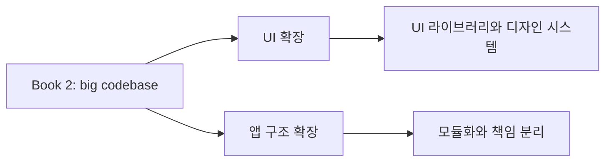
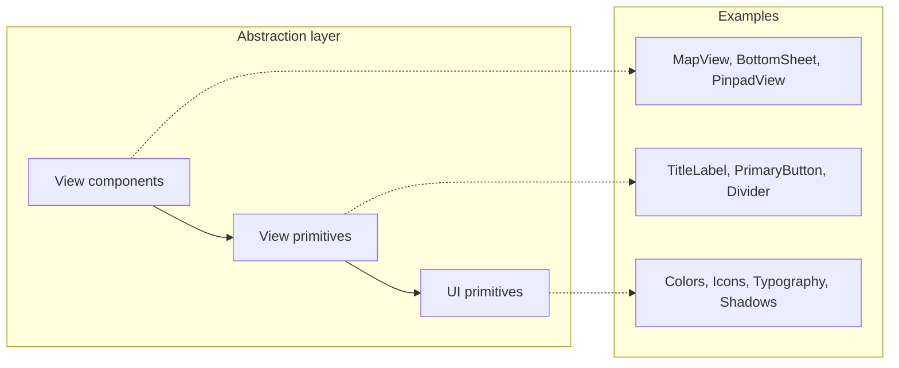
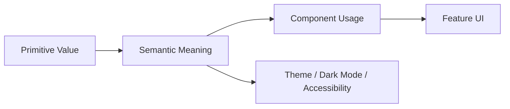

# [WEEK 01] Where We Left Off, Chapter 1, Chapter 2
📖 Mobile System Design 2. Large-Scale Codebases & Design Systems  

<br>

## 0. Where We Left Off
> Book 2는 개별 기능 구현에서 벗어나, 큰 코드베이스와 여러 팀이 함께 일하는 환경으로 시야를 확장한다.  

### Scaling Up UI

- 기존에 만든 UI 라이브러리를 기반으로, 디자인 시스템이 필요한지 판단한다.  
- 디자인 시스템을 만들지 않더라도 `typography, icons, shadows, spacing` 같은 기초 요소를 정리하면 UI 일관성을 높일 수 있다.
- 디자인 시스템이 필수는 아니지만 간결한 UI, 멀티 플랫폼 앱, 여러 팀 간 협업이 중요해질수록 필요성은 커진다.  

### Scaling Up the Entire App

- 팀과 코드베이스가 커질수록 복잡도 관리가 중요해진다.  
- 따라서 모놀리식 코드베이스를 모듈화된 구조로 바꾸는 전략이 필요하다.
- 핵심은 모듈 추출, 인터페이스 설계, 모듈 역할 정의, 팀 간 책임 분리이다.



<br>

## 1. Design System or Not
> 디자인 시스템은 UI 의사결정을 한곳에 모아 팀과 플랫폼 간 일관성을 유지하게 하는 공유 언어이다.  

### 1.1 The design system chapters

| 범위     | 성격     | 역할                                            |
| ------ | ------ | --------------------------------------------- |
| Ch 1   | 개념     | 디자인 시스템의 역할과 도입 판단                            |
| Ch 2~3 | 실습     | color, typography, spacing, icons, shadows 정리 |
| Ch 4   | 마이그레이션 | 기존 UI를 semantic UI로 옮김                        |
| Ch 5   | 확장     | token으로 디자인 결정을 표준화                           |
| Ch 6   | 운영     | 여러 플랫폼과 팀 사이에서 token을 동기화                     |
> **token** 예시: `#007AFF` 대신 `color.primary`로 표현  

---

### 1.2 What is a design system?

- 디자인 시스템은 system design과 다르다.
	- system design은 기술 아키텍처를 다룬다.
- 디자인 시스템은 `UI의 시각적, 상호작용적 일관성`을 다룬다.

> [!NOTE] 
> **디자인 시스템**  
> 제품과 플랫폼 전반에서 **일관된 시각적 경험을 보장**하는 공유 언어이다.  
> 웹사이트 외에 README, wiki, Figma•Sketch, SwiftUI•Jetpack Compose 컴포넌트, 코드베이스의 중앙화된 스타일도 디자인 시스템의 형태가 될 수 있다.  

---

### 1.3 Differences between design systems and UI libraries

| 구분    | UI 라이브러리    | 디자인 시스템                    |
| ----- | ----------- | -------------------------- |
| 중심    | 무엇을 제공하는가   | 왜, 어떻게 사용하는가               |
| 예시    | Button 컴포넌트 | primary/secondary 버튼 사용 기준 |
| 소유권   | 주로 개발자      | 디자이너와 개발자의 공동 소유           |
| 기준 위치 | 코드          | 문서와 팀 합의                   |

#### UI 라이브러리
- colors, fonts, icons, 재사용 가능한 컴포넌트들이 포함된다.
- 컴포넌트가 **개발자 중심의 기준**이 되기 쉽다.

#### 디자인 시스템
- 컴포넌트의 모양, 사용 규칙, 의도까지 문서화되어 **팀 전체가 함께 관리**한다.
- 모두를 위한 "sources of truth" 제공

이 차이는 협업 방식도 바꾼다.  
UI 라이브러리만 있으면 "이 컴포넌트는 그걸 고려해서 만든 것이 아니다, 테두리 색상만 바꿀 수 있다"라는 대화가 나오기 쉽다.  
디자인 시스템이 있으면 "일관성을 유지하면서 이 요구를 어떻게 반영할 것인가"라는 대화로 바뀐다.  

> [!IMPORTANT]
> - UI libraries는 재사용 가능한 컴포넌트와 구현을 제공한다. 
> - 디자인 시스템는 더해서 그 컴포넌트를 `언제, 왜, 어떻게 써야 하는지`까지 설명한다.

---

### 1.4 Why a design system matters to developers

디자인 시스템은 단순히 디자이너의 반복 설명을 줄이기 위한 도구가 아니라, 개발자가 더 일관되고 자율적으로 UI를 구현하기 위한 기준이기도 하다.  

- 디자인 핸드오프를 완성된 명세가 아니라 `출발점`으로 보게 한다.
- empty 상태, error 처리, 다크 모드, RTL 텍스트 등과 같은 **누락된 상태를 일관되게 채울 수 있게 한다.**
- 디자이너의 모든 세부 결정을 기다리지 않고 구현할 수 있게 한다❗️ 
	- 디자인 시스템 규칙을 반영한 UI 라이브러리를 기준으로 누락된 상태 보완 가능
- 다른 플랫폼의 기능을 모바일로 옮길 때 필요한 규칙과 패턴을 제공해 바로 개발이 가능하다.
- 앱 전반에서 재사용 가능하고 일관되도록 보장해 작은 UI 불일치가 누적되는 문제를 줄인다.
- 신규 개발자의 온보딩 비용을 낮춘다.

> [!Note]
> 디자인은 최종 산출물이 아니라 의사소통 도구이다.  
> 개발자는 디자인 파일에 없는 상태와 제약을 구현 과정에서 반드시 마주한다.  
> 디자인 시스템은 이때 임의 판단이 아니라 **합의된 원칙을 따르게 해준다.**  

---

### 1.5 Challenges when introducing a design system

디자인 시스템은 단순한 컴포넌트 모음이 아니다. 다음 요소가 함께 필요하다.  

#### 디자인 시스템 구성요소
- UI 라이브러리
- token
- 문서
- Design Assets
- Governance (Versioning / Contribution)
- Tooling & automation (Token Management / Component Explorers)

> Governance: 디자인 시스템을 보호하기 위한 규칙과 프로세스  

이미 운영 중인 앱에 디자인 시스템을 도입하는 것은 어렵다. (각 팀은 기능 마감일을 우선시 할 수도 있다)  
새 시스템으로 마이그레이션하는 작업은 조직적 설득과 지속적인 유지보수를 필요로 한다.  

그렇다고 각 팀이 각자의 컴포넌트, 색상, 패턴을 따로 만들면 앱 전체 경험은 점점 분열된다.  
결국 어느 시점에는 중앙 기준으로 모으는 더 큰 마이그레이션이 필요해진다.  

---

### 1.6 Gradually building a design system

처음부터 완전한 디자인 시스템을 만들기 보다는, 먼저 **UI 라이브러리를 확장**하는 것이 현실적인 시작점이다.  

```
UI 라이브러리 --확장--> 디자인 시스템
```

개발자는 이미 UI 라이브러리에서 컴포넌트를 가져와 사용한다.  
따라서 spacing, color, typography, accessibility 같은 공유 결정을 UI 라이브러리에 반영하면, 시스템을 새로 학습하지 않아도 **기존 작업 흐름 안에서 일관성을 높일 수 있다**.  

즉, 디자인 시스템을 별도의 대규모 프로젝트로 시작하지 않고 기존 UI 라이브러리를 더 일관된 기반으로 개선하면서 디자인 시스템의 일부가 될 수 있는 구조를 만든다.  

---

### 1.7 The current UI library

기존 UI 라이브러리는 재사용 컴포넌트를 제공하지만, 모든 UI 기본 요소(colors 등)가 아직 정의되지 않았다.  

따라서 제대로 작동하는 UI 라이브러리가 있다 하더라도, 일관성과 확장 가능성을 보장하는데 방해가 되는 미묘한 문제들이 여전히 발생할 수 있다.  
> 문제: `Color` 하드코딩된 hex color, `Typhography`제각각의 font size, `icon` 흩어진 icon, `spacing` 임의의 spacing 누적  


#### UI primitive

| UI primitive       | 역할                              |
| ------------------ | ------------------------------- |
| Color system       | 브랜드 색상을 중앙화하고 의미 있는 언어로 정리한다    |
| Typography scale   | font family, size, style을 표준화한다 |
| Unified icon set   | 아이콘 중복과 변형을 줄인다                 |
| Spacing system     | margin과 padding의 일관된 기준을 만든다    |
| Predefined shadows | 화면 깊이 표현을 표준화한다                 |

> [!Note]
> UI primitive는 UI를 구성하는 가장 낮은 수준의 기본 요소  
> → 재사용 컴포넌트를 만들기 전에 먼저 정해져 있어야 하는 값들  

UI primitive는 아래와 같이 view primitive보다 낮은 추상화이다.  
Text 같은 view primitive도 color, font, spacing 같은 UI primitive 기반으로 만들어진다.  



---

### 1.8 Conclusion

디자인 시스템의 목표는 iOS와 Android를 완전히 똑같이 만드는 것이 아니다.  
공유되어야 할 요소는 표준화해 일관성을 지키고, 각 플랫폼의 고유성은 남기는 것이다.  

많은 회사에는 완전한 디자인 시스템보다 잘 관리되는 UI 라이브러리만으로도 충분할 수 있다.  
중요한 것은 모든 요소를 갖춘 디자인 시스템을 만들지 여부가 아니라, **탄탄한 UI 라이브러리**를 토대로 삼는 것이다.  

---

### 1.9 What we covered

- 디자인 시스템은 제품과 플랫폼 전반의 일관된 시각적 경험을 보장한다.
- UI 라이브러리는 독립적으로 존재할 수도 있고, 디자인 시스템의 일부가 될 수도 있다.
- UI 라이브러리는 재사용 가능한 view와 component라는 "무엇"에 집중한다.
- 디자인 시스템은 그것을 "왜", "어떻게" 쓰는지까지 안내한다.
- 디자인 시스템은 공유 시스템을 만들어 개발자와 디자이너 사이의 협업 방식을 개선한다.
- 디자인 시스템은 설계에 명시되지 않은 상태와 결정을 채우는 기준이 된다.
- 디자인 시스템을 조직에 한 번에 도입하기는 어렵다.
- 실용적인 출발점은 UI 라이브러리를 정비하는 것이다.

<br>

## 2. UI Library Fundamentals, Part I
> UI 라이브러리는 컴파일되는 스타일 가이드이다.  

### 2.1 Typography

Typography는 `font primitives`와 `semantic text styles` 두 계층으로 나눌 수 있다.  

#### Font primitives
`font primitive`는 글꼴을 표현하는 실제 속성이다.  
이를 직접 사용하면 모든 개발자가 font name, size, weight를 매번 맞춰야 하므로 오타와 임의 판단이 생기기 쉽다.  

| Font primitive | 의미       | 예시                                       |
| -------------- | -------- | ---------------------------------------- |
| Font Family    | 사용할 글꼴   | `Helvetica`, `Roboto`, `SF Pro`, `Arial` |
| Font Size      | 글자 크기    | `16px`, `20px`                           |
| Font Weight    | 글자 두께    | `400`, `700`                             |
| Line Height    | 줄 사이 간격  | `1.5`, `24px`                            |
| Letter Spacing | 글자 사이 간격 | `0.5px`                                  |

#### Semantic text styles
`semantic text style`은 **`font primitive`를 의미 단위로 묶은 스타일**이다.  
개발자는 세부 속성 대신 이 텍스트가 본문인지, 제목인지, 캡션인지 같은 목적을 선택한다.  

| 계층 | 예시 | 역할 |
|---|---|---|
| Font primitives | `fontSize = 16`, `fontWeight = 700` | 실제 font 속성 |
| Semantic text styles | `body`, `h1`, `caption`, `button` | UI에서의 의미와 용도 |

- 장점
	- 일관성과 유지보수성이다.
	- `body`의 크기나 line height를 바꿔야 하면 UI 라이브러리의 정의만 수정하면 된다.

책의 SwiftUI 예시는 Compose에서 다음처럼 대응해서 볼 수 있다.  

| 책의 SwiftUI 예시 | Compose 관점 |
|---|---|
| `CompanyFontStyle` enum | `AppTypography` 또는 `MaterialTheme.typography` |
| `Text.companyFont(.h1)` | `Text(style = AppTypography.h1)` |
| `CompanyText("...", type: .body)` | `AppText(text = "...", style = AppTypography.body)` |
| `.bold()`, `.italic()` modifier | `fontWeight`, `fontStyle` 파라미터 |

Compose에서는 `TextStyle`을 `semantic style`로 정의하고, `Text`에 전달하는 방식이 자연스럽다.  

```kotlin
Text(
    text = "Course title",
    style = AppTypography.h1
)
```

전용 컴포저블로 감싸는 방식도 가능하다.  
Compose 예시에서는 팀에서 만든 커스텀 Text 래퍼 `AppText`를 사용한다.  

```kotlin
@Composable
fun AppText(
    text: String,
    style: TextStyle,
    modifier: Modifier = Modifier,
    maxLines: Int = Int.MAX_VALUE,
    overflow: TextOverflow = TextOverflow.Clip,
) {
    Text(
        text = text,
        style = style,
        modifier = modifier,
        maxLines = maxLines,
        overflow = overflow,
    )
}

AppText(
    text = "Course title",
    style = AppTypography.h1,
    maxLines = 1,
    overflow = TextOverflow.Ellipsis,
)
```

이 방식은 사용을 강하게 제한할 수 있다.  
하지만 `maxLines`, `overflow`, `textAlign` 같은 `Text`의 기존 API를 다시 노출해야 해서 유지보수 비용이 커질 수 있다.  

> [!Note]
> 모든 텍스트 변형을 `semantic text style`로 만들 필요는 없다.  
> 기본은 `semantic style`을 사용하고, 일부 변형(size나 weight)은 `fontWeight = FontWeight.Bold`처럼 Compose의 기본 파라미터로 처리할 수 있다.  

---

### 2.2 Colors
> 색상은 디자이너를 통해 Color Palette를 정의하여 일관성을 유지한다.  

Color도 `primitive`와 `semantic`으로 나눌 수 있다.  

#### color primitive
palette에 있는 실제 색상 값이다.  
예를 들어 `orangeColor = #FFA500`처럼 고정된 색상 정의이다.  

- 이 값을 view에서 직접 쓰면 생기는 문제점
	-  색상 이름만으로는 사용 의도를 알 수 없다.
	- 브랜드 색상이 바뀌면 여러 feature code를 수정해야 한다.
	-  다크 모드, 테마, 접근성 설정에 대응하기 어렵다.

#### semantic color
색상의 실제 값이 아니라 **사용 목적**을 나타내는 이름이다.  
예를 들어 `warningColor`, `primaryBackgroundColor`, `accentColor`가 있다.  

| semantic color | light mode | dark mode |
|---|---|---|
| warningColor | orangeColor | purpleColor |
| primaryBackgroundColor | whiteColor | lightGreyColor |
| accentColor | purpleColor | lightPurpleColor |
- 장점
	- 이름에 의도가 드러난다.
	- 색상 변경 시 한 곳만 수정하면 된다.
	- 다크 모드, theme, accessibility 같은 dynamic color를 지원할 수 있다.

> [!Important]
> 개발자는 실제 색보다 **의도**를 고려해 정의해야 한다.  
> `warningColor`가 orange에서 red가 되더라도, feature code는 바뀌지 않아야 한다.  

---

### 2.3 Understanding color abstractions
> color primitive를 `Palette`로, semantic color를 `Colors`로 분리한다.  

color primitive와 semantic color를 같은 `Colors` 안에 두면 추상화가 섞인다.  

예를 들어 개발자가 자동완성에서 `Colors.warningColor` 대신 `Colors.orangeColor`를 선택할 수 있다.  
`orangeColor`는 고정된 색상 값이므로 dark mode, theme, accessibility 대응을 놓칠 수 있다.  

따라서 이를 피하기 위해 `color primitive`와 `semantic color`를 분리한다.  

| 구조                              | 의미      | 사용 위치                 |
| ------------------------------- | ------- | --------------------- |
| `Palette.orangeColor`           | 실제 색상 값 | semantic color를 정의할 때 |
| `Colors.warningColor`           | 사용 목적   | 일반 feature code       |
| `Colors.primaryBackgroundColor` | 사용 목적   | 일반 feature code       |

- `Palette`는 color primitive의 모음이다.  
- `Colors`는 semantic color의 모음이다.

#### Palette 사용
- `Palette`를 직접 사용하지 않는 것이 좋다.
- `semantic color`를 정의하거나 수정할 때 사용한다. 
- 일반 view 코드에서는 **`Colors(semantic color)`를 우선 사용**한다.

#### 예외
- 특정 feature에서만 필요한 색상이 있을 때, 전역 color system에 무리하게 추가하지 않고 전용 `semantic color`를 둘 수 있다. 
- 이 경우에도 `primitive color`를 직접 노출하기보다 **의미 있는 이름**을 붙이는 것이 좋다.

---

### 2.4 Supporting custom themes

`semantic color`를 사용하면 feature code를 바꾸지 않고 theme을 바꿀 수 있다.  
view는 계속 `Colors.warningColor`처럼 의미 기반 색상을 사용한다.  

바뀌는 것은 내부 구현이다.  `Colors.warningColor`가 직접 색상 값을 들고 있는 대신, 현재 theme의 `warningColor`를 참조하도록 만들 수 있다.  

| 호출부            | theme                     | 실제 적용되는 색 |
| -------------- | ------------------------- | --------- |
| `warningColor` | `DefaultThemeColors`      | `Orange`  |
| `warningColor` | `DarkThemeColors`         | `Purple`  |
| `warningColor` | `HighContrastThemeColors` | `Red`     |

이 구조의 장점은 migration 비용을 줄인다는 점이다.  
- feature code는 theme 전환 방식이나 실제 색상 값을 몰라도 된다.
- `warningColor`라는 의미만 선택하고, 실제 색상 값은 현재 theme이 결정한다.

다크 모드, 브랜드 테마, 접근성용 고대비 테마 같은 차이를 theme 내부로 숨길 수 있다.  
단, 런타임 중 theme을 바꾸는 경우에는 이미 그려진 view를 다시 구성해야 할 수 있다.  

---

### 2.5 Granular color control

#### shade
색상을 더 세밀하게 제어하려면 palette의 한 색상에 여러 shade를 둘 수 있다.  

```swift
Palette.red.lightest
Palette.red.lighter
Palette.red.base
Palette.red.dark
Palette.red.darker
Palette.red.darkest
```

이름 기반 shade  
- 의미가 명확하다.  
- 하지만 단계를 더 추가해야 할 때 이름이 어색해질 수 있다.

이 경우 숫자 기반 shade가 대안이 될 수 있다.  

```swift
Palette.red.200
Palette.red.600
```

숫자 기반 shade  
- 의미는 약하지만 확장성이 좋다.  
- 예를 들어 중간 색상을 추가해야 할 때 새 이름을 억지로 만들지 않아도 된다.

#### Avoiding a migration
shade 구조를 도입하면 migration이 생길 수 있다.  
예를 들어 기존 코드가 `Palette.redColor`를 많이 쓰고 있었다면, 새 구조에서는 `Palette.red.base`로 옮겨야 한다.  

책의 핵심은 feature code가 palette에 직접 많이 의존하지 않게 하는 것이다.  
feature code가 `semantic color`를 사용하고 있다면, palette 구조 변경은 주로 UI 라이브러리 내부에 머문다.  

#### Granular control for semantic colors
semantic color도 그룹화할 수 있다.  

```swift
Colors.background.primary
Colors.background.secondary
Colors.background.tertiary
Colors.background.quaternary
```

이 방식은 초기 설계 비용이 들지만, 색상이 많아질수록 자동완성과 탐색성이 좋아진다.  

> [!Note]
> Kotlin에서는 책의 `Palette.red.200` 같은 표현을 그대로 쓰기 어렵다.  
> Compose 코드로 옮긴다면 `Palette.Red.v200`, `Palette.Red200`처럼 팀 규칙에 맞는 이름을 정해야 한다.  

---

### 2.6 Conclusion

이 장에서는 이미 재사용 가능한 컴포넌트가 포함된 UI 라이브러리를 개발하기 시작했음에도 불구하고,  
사후적으로 기초적인 UI 기능을 추가했다.  

처음부터 완성된 UI 시스템을 갖추고 시작하는 것이 이상적이지만,  
실제 앱 개발에서는 기능을 먼저 만들고 나중에 UI 기반을 정리하는 경우가 많다.  

핵심은 font와 color를 `primitive`와 `semantic` 두 계층으로 분리하는 것이다.  
primitive는 실제 값이고, semantic은 목적과 의미이다.  

semantic 계층을 만들면 UI 변경이 쉬워진다.  
색상이나 폰트를 바꿀 때 모든 feature code를 수정하지 않고, UI 라이브러리의 한 지점만 바꾸면 된다.  



---

### 2.7 What we covered

#### Typography
- `font primitive`는 size, weight, typeface, line height 같은 실제 font 속성이다.
- `semantic text style`은 `body`, `caption`, `h1`처럼 의미 중심으로 typography를 사용하게 한다.
- semantic text style은 반복을 줄이고, 오타와 임의 결정을 줄인다.
- 모든 변형을 semantic style로 만들면 style이 과도하게 늘어날 수 있다.

#### Colors
- `color primitive`는 palette의 실제 색상 값이다.
- 디자이너가 정의한 color palette를 기준으로 삼으면 색상 사용을 일관되게 관리할 수 있다.
- view에서는 color primitive보다 semantic color를 우선 사용한다.
- `semantic color`는 의미를 제공하고, 색상 교체와 dynamic color 대응을 쉽게 만든다.
- Palette와 Colors를 분리하면 color primitive와 semantic color의 책임이 명확해진다.
- color primitive는 semantic color를 정의하거나 수정할 때 사용한다.

#### Theming and granular control
- semantic color는 theme, dark mode, accessibility 대응의 기반이 된다.
- semantic color를 사용하면 theme 변경을 내부 구현으로 흡수해 feature code migration을 줄일 수 있다.
- granular color는 palette와 semantic color 양쪽에서 사용할 수 있다.
