# UI Library Fundamentals, Part II: Spacing, Icons and Shadows

### Spacing

- UI 요소 간의 간격을 정할 때 임의의 값을 넣곤 한다. (매직 넘버)
- 하지만 이 경우 일관성 있는 Spacing을 유지하기 어렵다.
- 만약에 디자이너가 Spacing 값을 수정할 경우 이 값을 일일히 수정해야 한다.
- 태블릿과 같은 더 큰 화면에서는 12px 라는 간격 값이 다르게 느껴질 수도 있다.

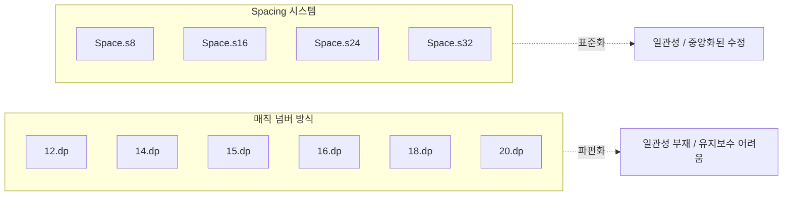

#### Defining spacing primitives

- spacing primitives와 이를 사용하는 semantic spacing을 활용하여 해결할 수 있다.
- 선택할 수 있는 spacing 값을 제한함으로써 임의적인 결정을 줄이고 일관성을 높일 수 있다.
- 세밀한 제어를 위해 10이나 12 같은 수치를 추가하면 그 차이를 눈으로 알아차리기 어려워서 일관성 없는 여백 선택과 시각적 난잡함으로 이어질 수 있다.
- 이 부분을 디자이너와 협업하여 균형점을 찾는 것이 중요하다.

#### Applying spacing primitives

```kotlin
import androidx.compose.ui.unit.dp

object Space {
    val s4 = 4.dp
    val s8 = 8.dp
    val s16 = 16.dp
    val s24 = 24.dp
    val s32 = 32.dp
    val s40 = 40.dp
    val s48 = 48.dp
    val s64 = 64.dp
    val s80 = 80.dp
}
```

- 만약에 12.dp의 여백이 필요하다면 가까운 값인 16이나 24를 선택할 수 있다.
- 이러한 primitive 값은 padding, margin, gap 과 같이 전체 앱의 spacing에 적용된다.

#### Semantic spacing

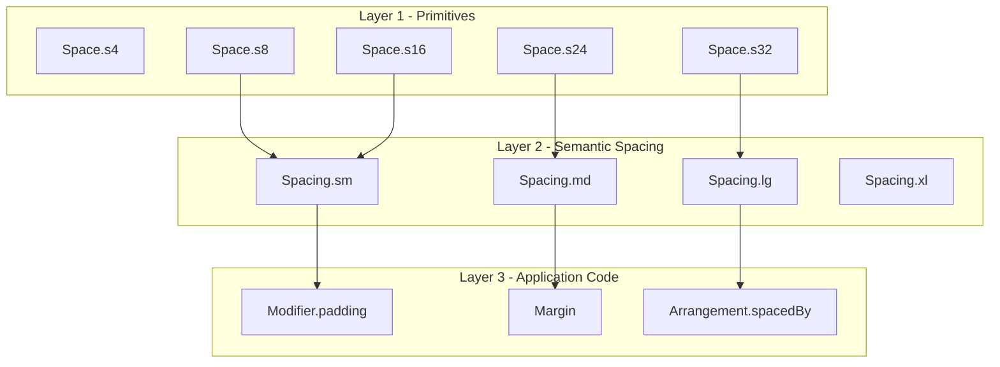

- Semantic spacing을 도입해 코드에 의미를 더하고 유지보수를 더 쉽게 만들 수 있다.
- 또한 모든 변경 사항이 한곳으로 집중되기 때문에 값을 업데이트하기가 훨씬 간단해진다.
    - Spacing.s24를 Space.s22로 교체해야한다면, Spacing.s24를 쓰고 있는 semantic color가 참조하는 값을 변경하면 된다.

#### Dynamic spacing

- 폰이냐 태블릿에 따라서 동적인 spacing이 필요할 수도 있다.

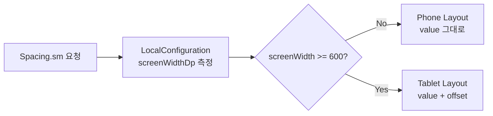

```kotlin
import androidx.compose.foundation.background
import androidx.compose.foundation.layout.Box
import androidx.compose.foundation.layout.Column
import androidx.compose.foundation.layout.padding
import androidx.compose.material3.Text
import androidx.compose.runtime.Composable
import androidx.compose.ui.Modifier
import androidx.compose.ui.graphics.Color
import androidx.compose.ui.platform.LocalConfiguration
import androidx.compose.ui.unit.Dp
import androidx.compose.ui.unit.dp

@Composable
fun AdaptivePaddingView() {
    val configuration = LocalConfiguration.current
    val screenWidth = configuration.screenWidthDp

    // 가로 크기에 따라 패딩 값을 다르게 연산 (기준점: 600dp)
    val adaptivePadding: Dp = if (screenWidth < 600) {
        Spacing.sm  // 폰 크기일 때 (SwiftUI의 .compact)
    } else {
        Spacing.md  // 태블릿 등 큰 화면일 때 (SwiftUI의 .regular)
    }

    Column {
        Text(
            text = "Adaptive Spacing",
            modifier = Modifier
                .background(Color.LightGray) // 여백 변화를 눈으로 보려고 넣은 배경색
                .padding(adaptivePadding)    // 계산된 가변 패딩 적용
        )
    }
}

// 앞 절에서 정의했던 시맨틱 스패이싱 가상 데이터
object Spacing {
    val sm = 16.dp
    val md = 24.dp
}
```

#### Implementing dynamic spacing

```kotlin
import androidx.compose.ui.unit.Dp
import androidx.compose.ui.unit.dp

// 값과 보정값을 담는 Spacing 데이터 클래스 정의
data class Spacing(
    val value: Dp,
    val offset: Dp = 0.dp // 기본값은 0으로 세팅해서 보정값 없는 정적 여백도 지원
) {
    // 가로 너비(dp)를 주입받아 동적 여백을 리턴하는 메서드
    // 안드로이드 기준점인 600dp(태블릿/폴더블) 이상일 때 offset을 더해줌
    fun dynamic(screenWidthDp: Int): Dp {
        return if (screenWidthDp >= 600) value + offset else value
    }
}

// 프리미티브(Space) 기반으로 시맨틱 스패이싱 인스턴스들을 정의한 싱글톤 오브젝트
object AppSpacing {
    val xxs = Spacing(value = Space.s4, offset = Space.s4)
    val xs  = Spacing(value = Space.s8, offset = Space.s8)
    val sm  = Spacing(value = Space.s16, offset = Space.s8)
    val md  = Spacing(value = Space.s24, offset = Space.s8)
    val lg  = Spacing(value = Space.s32, offset = Space.s8)
    val xl  = Spacing(value = Space.s40, offset = Space.s8)
    val xxl = Spacing(value = Space.s48, offset = Space.s16)
    val x3l = Spacing(value = Space.s64, offset = Space.s16)
    val x4l = Spacing(value = Space.s80, offset = Space.s16)
}

// 가상의 최하위 프리미티브 수치
object Space {
    val s4 = 4.dp
    val s8 = 8.dp
    val s16 = 16.dp
    val s24 = 24.dp
    val s32 = 32.dp
    val s40 = 40.dp
    val s48 = 48.dp
    val s64 = 64.dp
    val s80 = 80.dp
}
```

```kotlin
val Spacing.dynamic: Dp
    @Composable
    get() {
        val screenWidth = LocalConfiguration.current.screenWidthDp
        return if (screenWidth >= 600) value + offset else value
    }
```

- 특정 화면 크기를 넘겼을 때 추가 커스텀 offset을 주는 것도 가능

### Icons

- primitive icons는 raw한 asset 그 자체를 의미

```kotlin
val primitiveIcon = Icon(contentDescription = "cross")
```

- 다음과 같이 아이콘의 의미보다 모양을 설명으로 해놓는다면
- 여러 가지 목적으로 중복 사용될 수 있음…
- 뷰 내부에 아이콘 정보를 깊숙히 박아버리면 향후 수정하기가 더 까다로움

#### Semantic icons

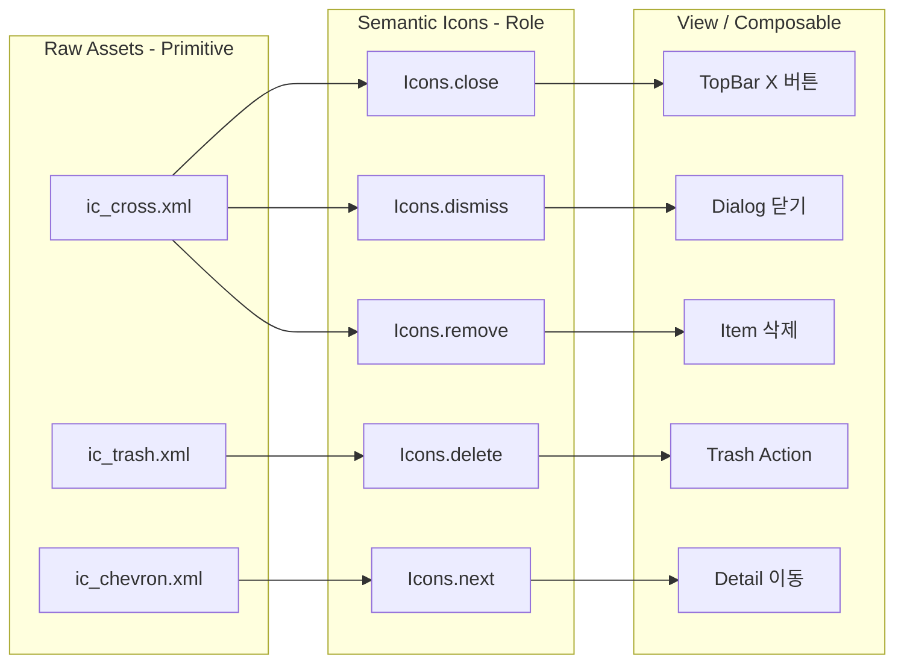

```kotlin
import androidx.compose.runtime.Composable
import androidx.compose.ui.graphics.painter.Painter
import androidx.compose.ui.res.painterResource
import com.example.myapp.R

object Icons {
    // 실제 드로어블 에셋은 R.drawable.ic_cross 하나를 공유하지만,
    // 외부(UI 코드)에는 철저하게 '역할'만 노출한다!

    val close: Painter
        @Composable
        get() = painterResource(id = R.drawable.ic_cross)

    val dismiss: Painter
        @Composable
        get() = painterResource(id = R.drawable.ic_cross)

    val remove: Painter
        @Composable
        get() = painterResource(id = R.drawable.ic_cross)
}
```

- semantic icons을 통해 아이콘을 의미적 역할에 매핑 가능
- 만약 close 에 대한 아이콘을 변경한다면 기존 다른 아이콘에 영향 없이 쉽게 변경 가능

#### Mixing semantic and primitive icons

- 모든 아이콘에 역할을 부여하는 것은 힘듦
- 아이콘에 모든 semantic use case를 예측하는 것이 어려우므로 혼용해도 문제 없음

### Shadows

- 체계적인 접근 방식이 없다면 앱의 모든 그림자가 아주 미세하게 제각각인 결과를 초래할 수 있음
- 앱 전체가 동일한 시스템을 사용하면 향후 그림자를 수정하는 것이 수월해짐

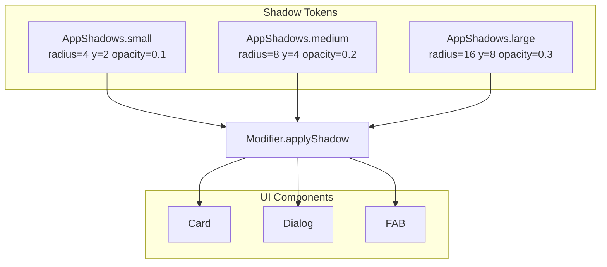

```kotlin
import androidx.compose.ui.unit.Dp
import androidx.compose.ui.unit.dp

// 그림자의 속성들을 정의한 데이터 클래스
data class ShadowStyle(
    val radius: Dp,
    val x: Dp,
    val y: Dp,
    val opacity: Float // 컴포즈에서는 불투명도를 주로 Float(0f ~ 1f)으로 표현해
)

// 2소, 중, 대 세 가지 시맨틱 스타일을 제공하는 싱글톤 오브젝트
object AppShadows {
    val small  = ShadowStyle(radius = 4.dp,  x = 0.dp, y = 2.dp, opacity = 0.1f)
    val medium = ShadowStyle(radius = 8.dp,  x = 0.dp, y = 4.dp, opacity = 0.2f)
    val large  = ShadowStyle(radius = 16.dp, x = 0.dp, y = 8.dp, opacity = 0.3f)
}
```

- 이를 applyShadow 와 같은 커스텀 메서드를 통해 적용할 수 있음

```kotlin
Text(
    "I contain a small shadow",
    modifier = Modifier.applyShadow(ShadowStyle.small)
)
```

### Defining a custom shadow method

```kotlin
import androidx.compose.ui.Modifier
import androidx.compose.ui.draw.shadow
import androidx.compose.ui.graphics.Color
import androidx.compose.ui.graphics.graphicsLayer

// Modifier에 확장 함수를 선언해서 모든 컴포저블에서 쓸 수 있게 만듦
fun Modifier.applyShadow(style: ShadowStyle): Modifier = this.then(
    // graphicsLayer를 사용하면 x, y 오프셋과 섀도우 핀트를 다이렉트로 제어할 수 있어
    graphicsLayer {
        shadowElevation = style.radius.toPx()
        translationX = style.x.toPx()
        translationY = style.y.toPx()
        // 주의: 안드로이드 네이티브 특성상 섀도우 알파값은 ambientShadowColor나 spotShadowColor로 매핑되거나
        // 하위 캔버스 드로잉으로 세밀하게 조절해야 할 수 있어. 여기선 기본 구조 매핑에 집중할게!
    }
)
```

- 다음과 같이 커스텀 메서드를 통해 지정한 ShadowStyle을 사용하도록 할 수 있음
- 사용자는 기존 Shadow와 applyShadow 두 가지를 선택할 수 있지만
- 린팅과 같은 툴을 통해서 applyShadow만 사용하도록 강제성 부여 가능

#### Shadows and dark mode

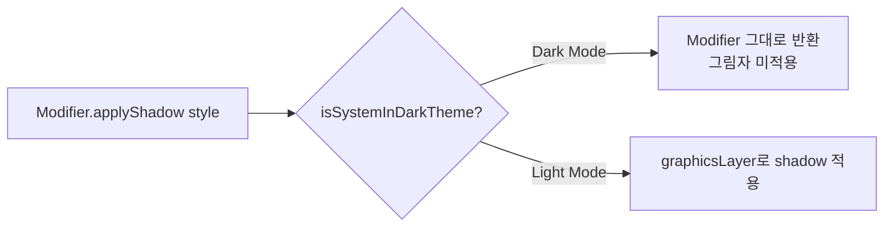

- 그림자 시스템을 중앙화하면 다크 모드에 대해서도 유연하게 대응 가능

```kotlin
import androidx.compose.foundation.isSystemInDarkTheme
import androidx.compose.runtime.Composable
import androidx.compose.ui.Modifier
import androidx.compose.ui.graphics.graphicsLayer

// 다크 모드를 지원하는 커스텀 그림자 Modifier 확장 함수
fun Modifier.applyShadow(style: ShadowStyle): Modifier = this.then(
    // 컴포즈에서 환경 상태를 읽거나 컴포저블을 조합할 때 제공되는 인라인 팩토리 함수야
    Modifier.composed {
        // 현재 시스템이 다크 모드인지 감지 (SwiftUI의 colorScheme 체크와 동일)
        val isDarkMode = isSystemInDarkTheme()

        if (isDarkMode) {
            // 다크 모드라면? 그림자를 그리지 않고 자기 자신(기본 Modifier)을 그대로 반환!
            Modifier
        } else {
            // 라이트 모드라면? 원래대로 오프셋과 반지름을 계산해서 그림자를 렌더링!
            graphicsLayer {
                shadowElevation = style.radius.toPx()
                translationX = style.x.toPx()
                translationY = style.y.toPx()
            }
        }
    }
)
```

#### No primitives needed

- 이미 semantic shadow를 사용하기 때문에 primitive 값이 필요 없음
- 여전히 어쩔수 없는 경우 임의의 값으로 shadow 설정 가능
- 하지만 정해진 값을 쓰는 것이 다크모드나 추후 수정에 있어서 이점을 가짐

#### Heuristic

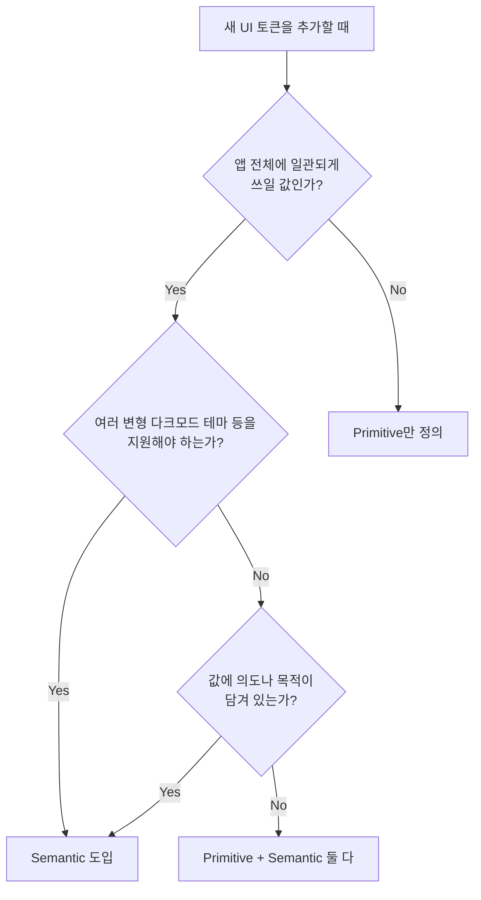

### What we covered

- UI 요소 (UI elements)
    - primitive와 semantic으로 분리하면 훨씬 더 세밀하게 요소들을 판단하고 다를 수 있음
    - primitive는 색상, 크기, 폰트 두께와 같은 UI 요소의 단순한 정의
    - semantic은 UI 요소에 '의미'를 더한 것
        - semantic을 사용하면 primitive를 교체하더라도 이를 사용하는 호출부의 코드에는 아무런 영향을 주지 않음
    - 모든 요소를 반드시 이 두가지 카테고리로 쪼갤 필요는 없음
        - 더 세밀한 제어권과 유연성이 필요하다면 UI primitive 제공
        - 더 강력한 일관성을 원한다면 semantic UI 요소만 제공
- 여백 (Spacing)
    - 일관성을 위해 2, 4, 8, 16과 같이 미리 정의된 여백 primitive 활용 가능
    - 원하는 값이 정의된 목록에 없다면 가장 가까운 값 선택
    - 더 나은 일관성과 유지보수를 위해, 특정 여백 수치에 매핑되는 small, medium, large, extraLarge와 같은 semantic spacing 도입 가능
    - 동적 여백을 사용하면 화면 크기에 따라 같은 small 이라는 semantic spacing이라도 더 좁게 또는 더 넓게 자동 조절 가능
- 아이콘 (Icons)
    - 뷰 코드에서 원본 asset 이름을 직접 참조하면 유지보수가 어려워짐
    - asset 파일 업데이트 시 원치 않는 변경을 주지 않도록 주의해야 함
    - primitive asset의 이름은 용도가 아니라 시각적인 모양을 따라 지어야 함. 그래야 아이콘을 여기저기서 재사용 가능
    - semantic icon은 의미와 목적을 추상화하여 담아냄
    - semantic icon을 사용하면 호출부의 코드를 수정할 일이 거의 없어 아이콘을 업데이트하기가 훨씬 쉬어짐
    - 처음부터 모든 semantic한 use case를 알수 없으므로, primitive와 semantic을 혼용 하는 것도 좋은 방법
- 그림자 (Shadows)
    - 그림자의 경우 primitive 값이 굳이 필요한 경우가 적음
    - 관리를 한곳에서 하면, 다크 모드에서 그림자를 아예 숨기는 것과 같은 다양한 변형 기능을 쉽게 제공 가능

---

# Migrating from Legacy UI to Semantic UI

### Why other engineers aren't always excited about new libraries

- 만약 당신이 새 기능을 개발하고 있고 몇주간 이를 위해 노력하고 있는 상황이다.
- 이 상태에서 새로운 UI 시스템이 나왔다면, 이미 개발중인 기능이 레거시 코드가 되었기 때문에 새 UI로 마이그레이션을 해야 한다.
- 운이 좋다면 한두 스프린트 정도를 새 UI로 마이그레이션할 수 있겠지만, 대부분의 경우 원래 일정대로 신 기능을 출시하되, 알아서 틈틈이 새 UI 마이그레이션까지 하기를 원할 것이다.

### What the migration looks like

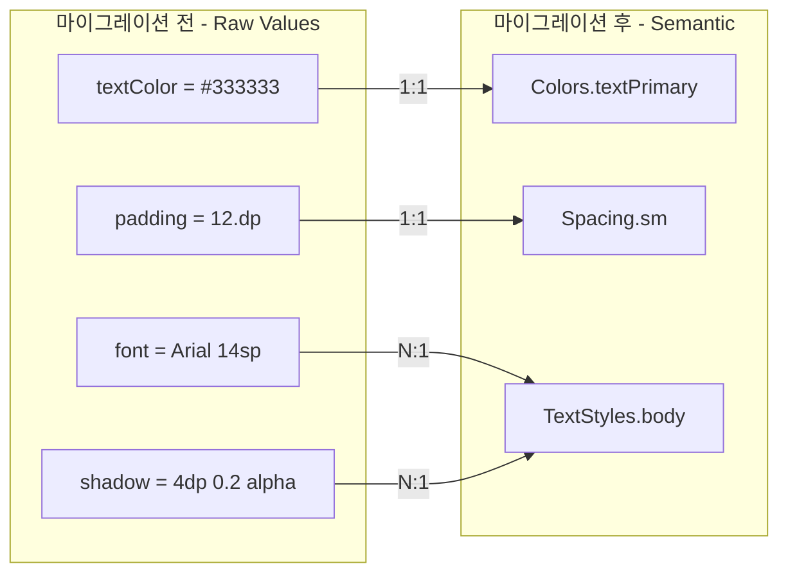

- 원래 임의의 값으로 설정된 값들을 semantic 값으로 교체해야 한다.
- 1:1 라인 대응이 될 수도 있지만 semantic 값이 여러 속성에 대한 값을 내포하고 있다면 여러 라인을 하나의 semantic 값으로 교체하기도 해야 한다.

### Preparing the team

- 마이그레이션을 할 때 유용한 마인드셋은 현재의 코드와 새로운 코드를 완전히 다르게 취급하는 것이다.
- 새로운 코드에 레거시 UI가 추가로 도입되는 것을 차단하는 것이 중요하다.
- 기존의 레거시 UI를 semantic UI로 마이그레이션하기 전에 계속해서 레거시 UI를 사용하는 것을 차단해야 한다.

#### Educating the team

- 팀원들에게 기존의 UI 시스템을 사용해도 좋지만, 계속해서 새로운 semantic 시스템을 사용하도록 습관을 형성해주는 것이 중요하다.
- 조금씩 새로운 sematantic color나 font, shadow를 쓰게 하라

#### Be approachable and helpful

- 마이그레이션 가이드와 실제 사용 예시를 보여주어 다른 사람들이 쉽게 접근할 수 있도록 해라
- 슬랙 채널을 통해서 질문을 받는 것도 좋은 방법
- 해당 과정에서 버그나 고려하지 못한 요소가 생기기도 해서 계속 발전시켜나가야 함

### Ensuring new code uses new UI

- 새 코드에서 대해 새로운 UI 시스템을 사용하도록 linter와 같은 툴을 사용하면
- PR에서 하나하나 지적할 필요가 없어짐

#### Using a linter

- linter를 사용하면 미리 정의해둔 규칙을 바탕으로 경고나 에러를 발생시킴
- 단순히 안된다가 아닌, 관련 문서나 사용 예시를 보여주도록 해야 함

#### Soft rollout

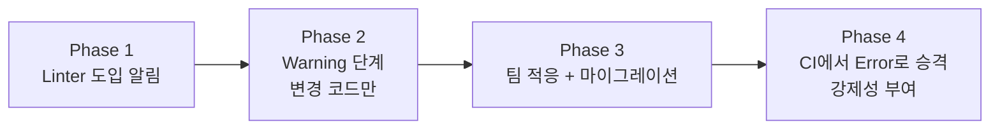

- 팀원들에게 레거시 UI를 탐지하는 linter가 도입된다 알리고, 처음에는 경고만 하도록 제공
- 나중에 팀원이 시스템에 익숙해지고 마이그레이션이 본 궤도에 오르면 CI에서 경고를 에러로 전환함으로써 더 엄격하게 규칙을 강제할 수 있음

#### Lint UI rules for new code only

- 전체 코드 베이스에 대해 linter를 적용하는 것은 무의미하고 시끄러운 것으로 느껴지게 함
- 새로 추가되거나 변경된 코드에 대해서만 linter를 실행하도록 할 수 있음
- PR 시 전 후 차이점에 대해서만 linter를 돌림

#### Preventing regressions

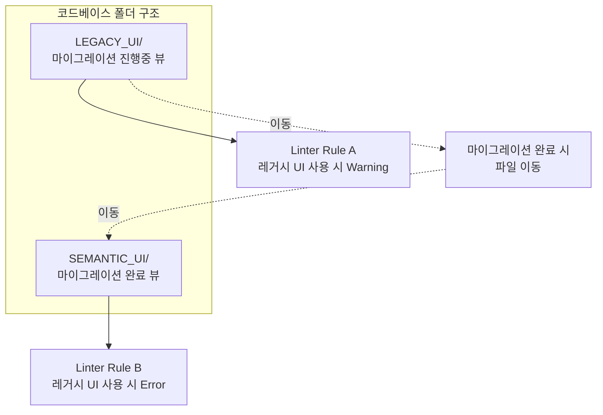

- 이러한 점진적 도입에도 새 코드에 레거시 UI를 사용하는 문제가 여전히 발생할 수 있음
- 마감에 쫓기는 개발자가 옛날 방식에 더 익숙하다는 이유로 레거시 시스템을 사용하면, 마이그레이션을 끝내두었던 기능이 다시 퇴보함
- 폴더별로 다른 linting rule을 제공하여 회귀를 방지할 수 있음
- 예를 들어, LEGACY_UI와 SEMANTIC_UI로 폴더를 나누어서 LEGACY_UI에는 린트에 대한 경고만, SEMANTIC_UI에서는 에러를 발생시키면
- 마이그레이션 중인 뷰는 LEGACY_UI에 두고 마이그레이션이 끝나면 SEMANTIC_UI에 이동시키면 됨

### Migrating preexisting features

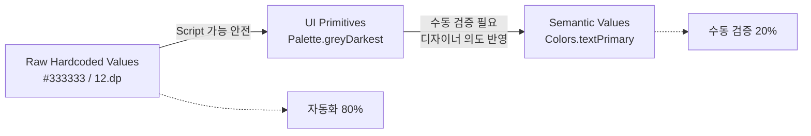

#### Start by doing some work yourself

- 마이그레이션 작업에 동참시키는 가장 빠른 방법은 혼자 마이그레이션을 진행해보는 것이다.
- 다른 사람의 업무를 방해하지 않고 어디까지 해낼 수 있는지 확인해보라.

#### Locally lint the legacy files

- 전체 코드베이스나 마이그레이션할 기능에 대해 linter를 사용하면 수많은 경고가 뜬다.
- 로컬에서 미리 linter를 사용해보라.

#### Migrating to primitives via scripting

- semantic 값이 아닌 1:1 대응이 되는 primitive 값에 대해 스크립트를 통해 마이그레이션을 진행할 수 있다.
- e.g., label.textColor = UIColor.darkGray → label.textColor = Palette.greyDarkest

#### When to migrate to primitives vs semantic values

- 중간 단계로 기존 값들을 정의된 primitve 값들로 바꾸고 그 후에 semantic value로 변경한다.

#### Migrating to semantic UI

- 모든 raw value를 semantic value로 바꾸는 건 실전에서 쉽지 않다.
- 스크립트만으로는 디자이너의 의도를 반영할 수 없기 때문에 직접 체크하며 마이그레이션해야 한다.
- 전부 자동화할 순 없더라도 스크립트를 여전히 사용할 순 있다.

#### Script and undo workflow

- 대부분의 경우 단순히 치환만 해도 80%는 맞고 20% 정도가 틀릴 것이다.
- 그 20% 정도를 커밋 전에 직접 검사해라
- 스크립트를 통해서 직접 다 옮기는 비용을 줄여라.

```kotlin
// 절대 따라 하지 마세요! (글쓴이가 말하는 최악의 "Smart" Code 예시)
fun MyCustomColor(hex: Long): Color {
    val isDarkMode = checkIsSystemInDarkTheme() // 런타임에 다크모드 체크

    return if (isDarkMode) {
        // 런타임에 하드코딩된 특정 흰색을 감지하면 강제로 어두운 색으로 바꿔치기함
        if (hex == 0xFFFFFFFF) Color(0xFF121212)
        else Color(hex)
    } else {
        Color(hex)
    }
}
```

- 이러한 방법으로는 semantic한 의미를 담을 수 없다.

#### Migrating via an intermediate step

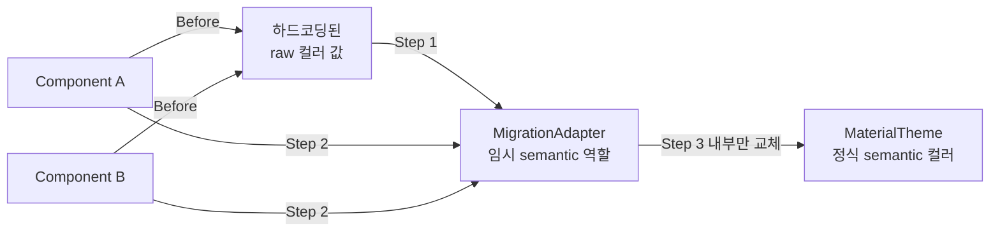

- UI primitive 값이 어떤 것이 될지는 알아도, UI semantic이 어떤 값이 될지는 모르는 경우가 있다.
- 만약 단순히 하드코딩된 컬러 값을 primitive 값으로 바꾸면 의미는 담지 못하고 단지 색상만 보여줄 뿐이다.

```kotlin
// 1단계: 임시 어댑터 선언 (둘 다 일단 같은 연한 파란색을 보게 함)
object MigrationAdapter {
    val backgroundColor = Palette.lightBlue
    val selectedColor = Palette.lightBlue
}

// 2단계: 일단 컴포넌트들에서 하드코딩을 걷어내고 어댑터를 바라보게 수정
Box(modifier = Modifier.background(MigrationAdapter.backgroundColor))
Box(modifier = Modifier.background(MigrationAdapter.selectedColor))

// 3단계: 나중에 디자인 시스템이 확정되면, 컴포넌트 코드는 건드릴 필요 없이
// 어댑터 내부의 값만 정식 MaterialTheme 컬러로 쏙 바꿔주면 끝!
```

- Adapter를 도입하면 이 상황에 도움이 될 수 있다.
    - 임시 semantic 상태를 제공하므로, 나중에 확정되면 그것으로 교체하면 된다.
    - 나중에 실제로 해당 값들이 어떤 용도로 사용되는지 확실히 파악되면 이때 교체할 수 있다.
- Adapter가 유용한 상황
    - 아직 semantic 색상 이름이 명확히 정의되지 않았을 때
    - 하나의 raw 색상 값이 여러 가지 역할로 혼용되어 쓰이고 있을 때
    - 잘못된 semantic 추측을 하지 않으면서도, 코드를 깔끔하게 정리하고 싶을 때

#### Preparing for manual labor

- 자동화 스크립트가 끝나면 수동 작업이 남게 된다.
- 여러 줄짜리 설정을 한 줄짜리 코드로 대체하거나, 레이아웃 전체 구조를 바꾸거나, 기존 뷰를 새로운 컴포넌트로 교체해야 한다.
- 이 지점에서 다른 사람들의 도움이 피룡하다.

### Turning Migration into Adoption

- 단순히 값을 치환하는 것이 아닌 완전한 마이그레이션을 위해서는 다른 사람의 도움이 필요하다.
- 마이그레이션을 그들의 workflow의 한 부분이 되도록 하는 것이 중요하다.

#### Start with migrating components

- UI 라이브러리의 코드를 업데이트하는 것이 가장 효율이 좋은 방법이다.
- 여러 줄의 코드를 컴포넌트로 바꾼다면 전체를 마이그레이션하지 않았더라도, 새 디자인 시스템에 가까워진다.
    - 커스텀 스타일의 버튼을 PrimaryButton 컴포넌트로 바꾼다던가…

#### Status quo bias (현상 유지 편향)

- 사람들은 이미 알고 있는 것을 쓰는 것을 선호한다.
- 만약 마이그레이션을 하려면 새로운 것에 익숙해져야 하기 때문에
- 새로운 디자인 시스템이 덜 부담스럽게 느껴지게 만드는 것이 중요하다.
- 그렇게 하는 한가지 방법은 예전 코드를 새 코드와 비교하여 어떻게 변경되는지 보도록 하거나
- 기존의 익숙한 유스케이스를 새로운 디자인시스템이 어떻게 지원하고 있는지 강조해서 보여주는 것이다.

#### New rule: Touch a view? Migrate it.

- 한 번에 모든 것을 마이그레이션하기보다는 UI를 건드릴 때마다 점진적으로 마이그레이션하도록 해라.
- 수정되는 화면에 대해 linter를 적용했다면 마이그레이션 경고가 뜰것이고, 몇분후에 마이그레이션을 하게 된다면 해당 부분은 최신 코드가 될 것이다.
- Workflow의 일부분에 녹아들기 때문에 좋은 방법 중 하나이다. 병합 전 체크 리스트로 두는 것도 좋은 선택이다.

#### Loss aversion (손실 혐오)

- 마이그레이션을 함에 있어 하지 않았을 때 가지는 단점들을 설명하라.
    - 다크 모드나 접근성 설정을 지원하기가 더 까다로워진다.
    - 온보딩 과정이 계속 느리고 힘들 것이다.
    - 공통 라이브러리에서의 수정을 그대로 반영하지 못한다. 등등

#### Make them take a small step

- LoginButton을 PrimaryButton으로 바꾸는 건 어때요?
- 페어 프로그래밍… 또는 칭찬 등등

#### Social proof

- 사람들은 첫 테스터가 되는 것도 가장 마지막에 적용하는 사람이 되는 것도 싫어한다.
- 이미 성공적으로 적용한 사레를 소개해주자.

#### Using Self-Determination Theory to motivate migration

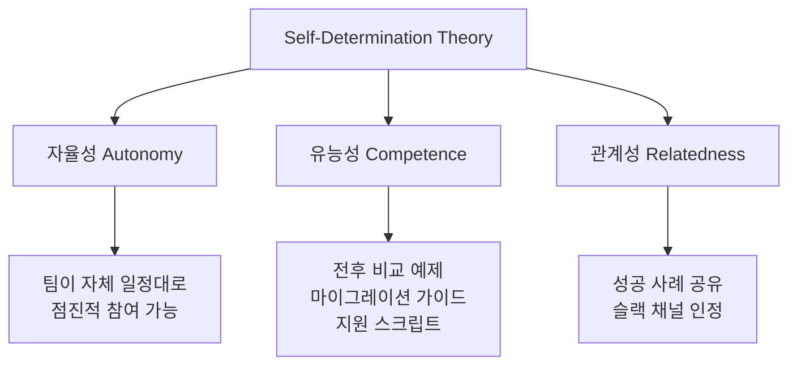

- 자기 결정성 이론에 따르면, 사람은 3가지 기본 욕구가 충족될 때 강한 동기를 부여받는다.
    - 자율성, 유능성, 관계성
- 자율성 : 각 팀이 점진적으로 참여할 수 있도록 유도하라.
- 유능성: 명확한 에시, 전/후, 마이그레이션 가이드를 제공해라.
- 관계성 : 이미 새로운 디자인 시스템으로 마이그레이션한 다른 팀의 성공 사례를 공유해라.

#### The IKEA effect

- 사람들은 조금이라도 만드는 데 기여한 것에 애착을 느낀다.
- 처음 적용해보는 사람들에게 새 디자인 시스템에 기여할 수 있도록 하자.

#### Reward & recognize teams that migrate

- 먼저 도입하는 팀의 작업을 응원하거나 슬랙 채널에 멘션하거나 회의에서 작업물을 하이라이팅하자.
- 그렇게 새 시스템을 적용해서 얼마만큼 코드가 깔끔해지고 얼마만큼의 시간이 절약되는지 보여주자.
- 사람들은 자신의 노력이 가치 있기를 바라므로, 마이그레이션 작업을 단순한 추가 노동이 아니라 진보로 느끼게 만들자.
- 노력이 실제로 결실을 맺은 사례를 보면 다른 팀도 따라오게 된다.

#### Helping people want the new system

- 단순히 기술 문서를 제공하는 것을 넘어, 변화가 사람들에게 어떻게 느껴질지를 고민하는 것이 큰 도움이 된다.
- 새로운 시스텡이 안전하고 너무나도 당연한 다음 단계처럼 느껴지게 만드는 것이 중요하다.

### App-wide migrations

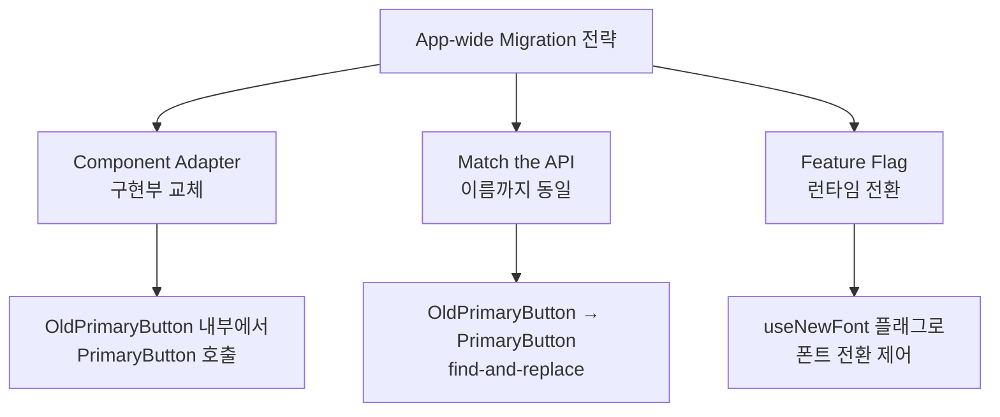

- 한번에 마이그레이션을 할 수는 없어 레거시와 새 UI가 섞여있는 상황이 종종 발생한다.
- 하지만 시각적 일관성이 매우 중요할 경우, 특정 컴포넌트에 대해서는 앱 전체를 한번에 마이그레이션하는 것이 더 선호될 수도 있다.

#### Component adapters

- 만약에 OldPrimaryButton을 PrimaryButton으로 마이그레이션하고 싶다면
- OldPrimaryButton을 호출하는 모든 곳을 수정하기보다는, OldPrimaryButton의 구현을 PrimaryButton을 사용하도록 바꾸기만 하자.
- 이럴 경우 호출자 코드는 전혀 수정이 필요 없다.

#### Match the API

- 똑같은 API를 가진 PrimaryButton을 만든다면
- 단순히 OldPrimaryButton을 PrimaryButton으로 바꾸도록 할 수 있다.

#### Feature flags

- 폰트 변경은 더 광범위하게 일어나기 때문에 Adapter로는 부족할 수 있다.
- 아주 미세한 변화가 전체 레이웃에 큰 영향을 미치기 때문에 Feature flag를 사용하기 적합한 케이스다.
- 모든 곳의 폰트를 바꾸기보다는, 런타임 플래그를 통해 새로운 스타일을 적용하자.

```kotlin
// 1. 임시 피처 플래그 객체 (서버 원격 제어나 로컬 설정으로 관리)
object FeatureFlags {
    var useNewFont: Boolean = false
}

// 2. 공용 텍스트 컴포넌트 내부에서 플래그 처리
@Composable
fun CompanyText(
    text: String,
    style: CompanyTextStyle,
    modifier: Modifier = Modifier
) {
    if (FeatureFlags.useNewFont) {
        // 신규 폰트 스타일 적용 (프로시마 노바 등)
        Text(
            text = text,
            fontFamily = ProximaNova,
            fontSize = if (style == CompanyTextStyle.H1) 32.sp else 14.sp,
            lineHeight = if (style == CompanyTextStyle.H1) 41.sp else 18.sp,
            modifier = modifier
        )
    } else {
        // 기존 레거시 시스템 폰트 적용
        Text(
            text = text,
            fontFamily = FontFamily.Default,
            fontSize = if (style == CompanyTextStyle.H1) 22.sp else 14.sp,
            modifier = modifier
        )
    }
}
```

### What we covered

- Migrating New UI
    - 새 기능을 새 UI만 쓰도록 하자. 아니면 마이그레이션이 더 오래 걸리 것이다.
    - linter를 사용하는 것을 고려하라.
        - 처음에는 경고로 제공하여 마이그레이션할 시간을 주자.
        - 전체 코드베이스가 아닌 변경사항에만 린트를 적용해라
        - 이미 마이그레이션한 뷰들이 레거시 UI를 사용하지 않도록 linter 규칙을 설정하라.
- Migrating Legacy UI
    - 마이그레이션의 책임자로써 단순 반복 작업을 직접 처리하여 팀원들의 부담을 줄여주라.
    - 스크립트를 통해 UI Primitive로 전환하는 것은 대개 안전하다.
    - semantic 값으로 전환하는 것은 수동 검증이 필요하기 떄문에, 스크립트가 교체한 부분을 수동으로 검증하라.
    - 중간 단계가 adapter를 사용하는 것을 고려하라.
        - 아직 모든 semantic 값이 완벽히 준비되지 않았을 때
        - 하나의 raw 컬러 값이 여러 가지 서로 다른 역할로 혼용되고 있을 때
        - 잘못된 semantic 추측을 내리지 않으면서, 일단 코드베이스를 깔끔하게 하고 싶을 때
- Motivating teams to migrate
    - 컴포넌트 중심의 마이그레이션: 공용 컴포넌트를 바꾸면 그것을 쓰는 수많은 UI가 마이그레이션된다.
    - 현상 유지 편향 극복: 풍부한 예시, 친절한 문서, 지원 스크립트를 통해 마이그레이션의 진입 장벽을 낮추라.
    - 건드린 뷰는 무조건 마이그레이션: 수정한 코드는 무조건 마이그레이션하도록 하여 점진적으로 마이그레이션
    - 손실 혐오: 마이그레이션을 안했을 때의 단점을 각인시켜라.
    - 작은 걸음부터 시작: 아주 작은 부분부터 마이그레이션을 시작하도록 해라.
    - 사회적 증거 활용: 이미 마이그레이션한 코드가 얼마나 잘 돌아가는지 보여주라.
    - 자율적 계획 수립: 각 팀이 일정과 상황에 맞춰 자율적으로 마이그레이션 코드를 짜게 하라.
    - 이케아 효과 : 새로운 UI 시스템에 팀원들이 기여하게 하라.
    - 보상과 인정 : 그들의 노고가 주목받고 인정받음을 보여줘라.
- App-wide migrations
    - 실제 구현부를 바꿈으로써 이전 컴포넌트 내부에 새로운 컴포넌트를 집어넣는 방식을 고려해라.
    - 기존 것과 동일한 API를 가진 새 컴포넌트를 만들면 쉽게 갈아 끼울 수 있다.
    - Feature flag 활용: 폰트와 같이 앱 전체에 지대한 영향을 미칠 때에는 런타임에 제어할 수 있는 플래그를 두어라.
