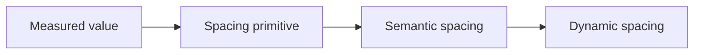
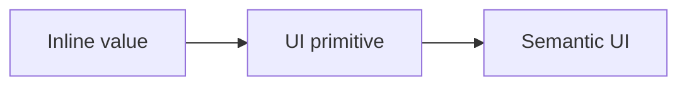

# [WEEK 02] Chapter 3, Chapter 4
📖 Mobile System Design 2. Large-Scale Codebases & Design Systems  

<br>

## 3. UI Library Fundamentals, Part II: Spacing, Icons, and Shadows
> spacing, icons, shadows도 primitive와 semantic 관점으로 정리하면 UI 라이브러리의 일관성이 높아진다.  

### Spacing

#### spacing primitive
> 실제 간격 값
```kotlin
object Space {
    val s4 = 4.dp
    val s8 = 8.dp
    val s16 = 16.dp
    val s24 = 24.dp
    ...
    val s80 = 80.dp
}

// 4, 8, 16, 24, 32, 40, 48, 64, 80
```

scale에 없는 값이 측정되면 가까운 값을 선택한다.  
ex) `14`가 측정되면 `16`을 선택  

80보다 큰 간격은 구조적으로 다루어진다. (중앙 정렬 등)

#### semantic spacing
> primitive 값에 사용 의도가 붙은 간격

```kotlin
object Spacing {
    val xxs = Space.s4
    val xs = Space.s8
    val sm = Space.s16
    val md = Space.s24
    val lg = Space.s32
}
```

**모든 변경이 중앙화** 되기 때문에 업데이트가 훨씬 간단해진다.

- 사용 예시
	```kotlin
	Column(
	    verticalArrangement = Arrangement.spacedBy(Spacing.sm),
	    modifier = Modifier.padding(Spacing.md),
	) {
	    Text("Card title")
	    Text("Card description")
	}
	```

#### dynamic spacing

기기 크기나 화면 조건에 따라 **같은 semantic spacing이 다른 값으로 해석**되게 한다.  
- phone: 더 좁은 간격 사용
- tablet: 더 넓은 간격 사용

```kotlin
val contentPadding = when (windowSizeClass.widthSizeClass) {
    WindowWidthSizeClass.Compact -> Spacing.sm
    else -> Spacing.md
}
```



---

### Icons

| 구분 | 이름 기준 | 예시 |
|---|---|---|
| primitive icon | 모양 | `cross`, `arrowBack` |
| semantic icon | 사용 의도/목적 | `close`, `dismiss`, `remove` | 

#### icon primitive
> raw asset 이름을 직접 참조하는 방식

```kotlin
Icon(painterResource(R.drawable.ic_cross), contentDescription = null)
```

문제점
- `"cross"`가 닫기, 제거, dismiss 등 여러 의미로 쓰일 수 있다.
- asset 이름만으로는 사용 목적을 알 수 없다.  

#### semantic icon
> icon의 모양이 아니라 사용 목적을 드러내는 방식

```kotlin
AppIcons.Close
AppIcons.Dismiss
AppIcons.Remove
```

장점
- 같은 `cross` asset을 쓰더라도 의미는 분리된다.  
- 나중에 디자인이 바뀌면 해당 sementic icon의 매핑만 바꾸면 된다.   

> [!Note]
> 모든 icon의 semantic use case를 미리 정의하기 어렵기 때문에  
> semantic icon과 primitive icon을 함께 제공하는 것이 현실적이다.

---

### Shadows
 
- `small`, `medium`, `large` 같은 `semantic shadow`를 정의해 일관성과 적응성을 보장할 수 있다.
- 그림자는 `primitive` 분리가 불필요하다. 
	- radius, x, y, opacity 같은 shadow primitive를 직접 자주 쓸 일이 적기 때문 
- shadow를 중앙화하면 dark mode 대응도 쉬워진다.  
	- shadow를 제거 또는 glow처럼 다른 방식으로 처리  

---

### Conclusion

- UI 요소 대부분은 `primitive`와 `semantic` 두 계층으로 생각할 수 있다.  
- 이 구분은 border, radius, opacity, motion 같은 요소에도 적용할 수 있다.  
- 모든 요소를 반드시 두 계층으로 나눌 필요는 없다.  
- 더 많은 제어가 필요하면 `primitive`를 제공하고, 일관성이 더 중요하면 `semantic` 요소만 제공할 수 있다.  

#### UI elements
- `primitive`는 color, size, font weight 같은 실제 UI 값이다.
- `semantic`은 UI 요소에 의미를 부여한다.
- semantic을 사용하면 call site를 유지한 채 primitive 매핑을 바꾸기 쉽다.
- 모든 UI 요소를 primitive와 semantic으로 반드시 나눌 필요는 없다.

#### Spacing
- spacing은 magic number 대신 predefined scale을 사용한다.
- `semantic spacing`은 spacing 값에 의미를 붙인다.
- `dynamic spacing`은 화면 크기에 따라 spacing을 다르게 적용한다.

#### Icons
- icon asset은 모양 기준으로 이름 짓는 것이 재사용에 유리하다.
- `semantic icon`은 사용 목적 기준으로 이름 짓는다.
- icon은 **semantic과 primitive를 함께 제공**하는 것이 현실적이다.

#### Shadows
- shadow는 `small`, `medium`, `large` 같은 **semantic shadow** 중심으로 충분할 수 있다.
- shadow를 중앙화하면 dark mode 대응도 쉬워진다.

<br>

## 4. Migrating from Legacy UI to Semantic UI
> 새 UI 시스템을 만드는 것보다 어려운 일은 기존 앱과 팀이 그 시스템을 실제로 쓰게 만드는 것이다.  

### Why other engineers aren’t always excited about new libraries

새 UI 시스템은 만든 사람에게는 개선이지만, feature engineer에게는 추가 작업으로 보일 수 있다.  
이미 마감이 있는 기능을 개발 중인데 새 UI 시스템으로 migration까지 요구받으면 부담이 된다.  

따라서 migration은 기술 문제가 아니라 **심리적 문제**이기도 하다.  
좋은 시스템을 만들었다는 사실만으로 팀이 바로 따라오지는 않는다.  

---

### What the migration looks like

migration의 기본 형태는 `inline value`를 **`semantic value`로 바꾸는 것**이다.  

#### before
```kotlin
Modifier.background(Color.White)
```

#### after
```kotlin
Modifier.background(AppColors.primaryBackground)
```

하지만 모든 migration이 단순 치환은 아니다.  
shadow, font, 복합 style처럼 **여러 줄을 하나의 semantic API로 바꿔야 하는 경우**도 있다.  



---

### Preparing the team

> [!Important]
> new code와 legacy code는 다르게 다뤄야 한다.

먼저 새 코드가 다시 legacy UI를 만들지 않게 막아야 한다.  
새 코드가 계속 legacy UI로 추가되면 migration이 끝나지 않는다.

#### 팀 내 공유 항목
- 새 semantic UI가 왜 필요한지
- 언제부터 사용해야 하는지
- migration guide (before/after 예시)
- 질문할 수 있는 채널

목표는 압박이 아니라 새로운 습관을 만드는 것이다.  

---

### Ensuring new code uses new UI

새 코드에는 `linter`를 적용해 legacy UI 사용을 줄일 수 있다.  
처음부터 error로 막기보다 warning으로 시작하는 것이 좋다.  
warning은 단순 지적보다 도움이 되는 문구 또는 관련 문서로 링크하도록 만든다.

#### 핵심 전략
- 처음에는 soft rollout으로 warning만 보여준다.
- 전체 legacy code가 아니라 PR diff나 changed code만 검사한다.
- 이미 migration된 영역은 다시 legacy UI로 돌아가지 않게 막는다.
- folder별 lint rule을 다르게 적용할 수 있다. (legacy는 경고, 새로운 코드는 에러)

---

### Migrating preexisting features

기존 화면은 이미 동작하고 배포된 코드이므로 더 조심스럽게 다뤄야 한다.  
migration을 이끄는 사람이 가능한 부분을 먼저 직접 처리한다.

<br>

| 단계 | 특징 |
|---|---|
| inline value → UI primitive | 자동화하기 쉽다 |
| UI primitive → semantic UI | 맥락 판단과 수동 검토가 필요하다 |

#### 1. primitive로 migration

inline value를 **primitive**로 바꾸는 `1:1 치환`은 자동화가 가능하다. 

**before**  
```kotlin
Color.DarkGray
```

**after**  
```kotlin
Palette.GreyDarkest
```

#### 2. sementic UI로 migration
> semantic UI로 바로 옮기는 것은 맥락 판단과 수동 검토가 필요하기 때문에 더 어렵다.  

같은 흰색을 쓰더라도 `background`인지 `text`인지 `border`인지 판단해야 한다.  

script는 migration을 도울 수 있지만, semantic 의미까지 완전히 판단하지는 못한다.    
따라서 script 적용 후에는 **사람이 직접 검토하고 잘못된 치환을 되돌리는 과정**이 필요하다.  

---

### Turning Migration into Adoption
> migration은 단순 치환이 아닌, 팀이 새 시스템을 받아들이게 만드는 과정이다.  

기존 view를 업데이트 하기 전에 shared component부터 migration 한다.  
각 컴포넌트 내부를 새 시스템으로 바꾸면 여러 화면이 한 번에 새 UI 기준에 가까워 진다.

```kotlin
PrimaryButton(text = "Delete", onClick = onDelete)
```

migration은 별도 프로젝트가 아니라 기존 작업 흐름 안에 넣는 편이 좋다.  
예를 들어 “view를 수정하면 함께 migration한다”는 규칙을 두면, 별도 sprint 없이도 semantic UI로 조금씩 이동할 수 있다.  

#### 전략
| 전략 | 핵심 |
|---|---|
| Components first | shared component 내부를 먼저 바꿔 새 시스템을 퍼뜨린다 |
| Touch a view? Migrate it. | 수정한 view는 함께 migration한다 |
| Lower the barrier | before/after 예시, 문서, 작은 시작점으로 부담을 낮춘다 |
| Show the cost of staying | dark mode, font size 대응처럼 migration하지 않을 때의 비용을 보여준다 |
| Build momentum | 다른 팀 사례를 공유하고, 기여와 성과를 인정한다 |

<br>

핵심은 top-down으로 밀어붙이는 것이 아니다.  
**새 시스템이 안전하고 명백한 다음 단계**처럼 느껴지게 만들어야 한다.

---

### App-wide migrations

일부 변경은 view 단위 migration보다 app-wide migration이 더 적합하다.  
예를 들어 font 변경은 전체 화면의 줄바꿈과 높이에 영향을 줄 수 있다.  

책이 제안하는 방법은 세 가지이다.  

- component adapter
- matching API
- feature flag

#### Component adapters

old component의 호출부를 그대로 두고 내부 구현만 new component로 바꾸는 방식이다.  
수많은 call site를 수정하지 않고도 old component 내부에서 new component를 사용하게 만들 수 있다.  

```kotlin
OldPrimaryButton(...)
```
> 호출부는 그대로 두고 `OldPrimaryButton`내부에서 `PrimaryButton`을 사용하게 수정  

#### Match the API

old component와 new component의 API 호출 형태가 같으면 이름만 바꾸는 수준으로 교체할 수 있다.  

```kotlin
// Before
OldPrimaryButton(text = "Continue", onClick = onContinue)

// After
PrimaryButton(text = "Continue", onClick = onContinue)
```

#### Feature flags

feature flag는 font처럼 앱 전체에 영향이 큰 변경을 한 번에 켜고 끌 수 있게 한다.  
새 스타일이 충분히 안정화되면 flag를 제거한다. 

---

### Conclusion

UI migration에서 다룬 방식은 다른 migration에도 적용된다.  
analytics, crash logger, networking layer를 바꿀 때도 비슷한 문제가 생긴다.  

핵심은 새 시스템을 만들고 끝내는 것이 아니다.  
새 코드가 새 시스템을 쓰게 하고, 기존 코드를 점진적으로 옮기며, 팀이 그 시스템을 받아들이게 만드는 것이다.  

---

### What we covered

#### Migrating new UI
- 새 UI 시스템은 다른 개발자에게 추가 작업으로 보일 수 있다.
- 새 코드가 legacy UI를 만들지 않게 먼저 막아야 한다.
- linter는 warning부터 시작하고, diff 중심으로 적용하는 것이 좋다.
- 이미 migration된 view가 다시 legacy UI로 돌아가지 않게 막아야 한다.

#### Migrating legacy UI
- 기존 legacy UI는 primitive migration과 semantic migration을 나눠 접근한다.
- primitive migration은 script로 자동화하기 쉽다.
- semantic migration은 맥락 판단이 필요해 수동 검토가 필요하다.
- adapter는 잘못된 semantic 가정을 피하면서 codebase를 정리하는 중간 단계가 될 수 있다.

#### Adoption and app-wide migration
- migration은 adoption 문제이기도 하다.
- 팀이 작은 단계로 참여하게 만들고, 성공 사례를 공유해야 한다.
- app-wide migration에는 adapter, API matching, feature flag가 유용하다.
