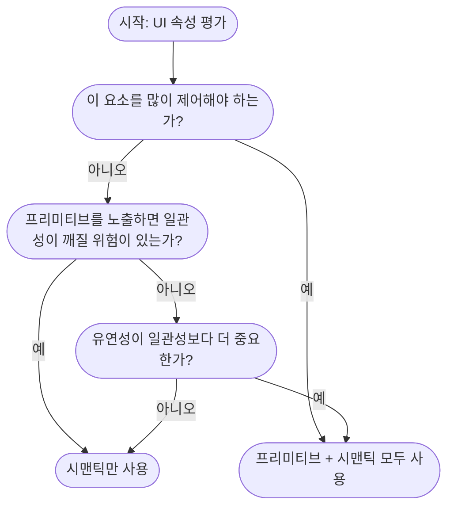

# Scale-03-UI-Library-Fundamentals-II
## Spacing
- 아이콘, 폰트 사이즈와 달리 `Spacing` 은 개발자들 사이에서 간과되는 면이 있다.
	- `spacing` 역시 기기별 동적 사이즈등에서 유용하게 사용되고, 마찬가지로 디자인 시스템의 일종이기에 신경쓰는 것이 좋다.

```kotlin
Column(
	modifier = Modifier.padding(20.dp), 
	verticalArrangement = Arrangement.spacedBy(12.dp) 
) {
	Text(text = "Card title")
	Text(text = "Card description")
}
```
```dart
Padding(
  padding: const EdgeInsets.all(20),
  child: Column(
	crossAxisAlignment: CrossAxisAlignment.start,
	children: const [
	  Text('Card title'),
	  SizedBox(height: 12),
	  Text('Card description'),
	],
  ),
);
```

- 위와 같이 매직 넘버로 `spacing` 을 정의하는 경우, 개발자마다 사용하는 값이 상이해져 문제가 될 수 있다.
	- 어떤 개발자는 `12`, `18` 로 사용할 수 있다.
	- (그런데 피그마 간격보고 개발할텐데, 이런 상황이 생길지 의문스럽긴 하다 '-';;)

- 또한, 디자이너가 앱 전반의 `spacing` 을 조정한 경우, 매직 넘버들을 모두 찾아 교체해주어야 한다.

### Defining spacing primitives
```kotlin
object Space {
    val s4 = 4.dp
    val s8 = 8.dp
    val s16 = 16.dp
    val s24 = 24.dp
    val s32 = 32.dp
    val s40 = 40.dp
    val s48 = 48.dp
    val s64 = 64.dp
    val s80 = 80.dp
}
```
```dart
final class Space {
  static const double s4 = 4;
  static const double s8 = 8;
  static const double s16 = 16;
  static const double s24 = 24;
  static const double s32 = 32;
  static const double s40 = 40;
  static const double s48 = 48;
  static const double s64 = 64;
  static const double s80 = 80;
}
```

- 위와 같이 `Spacing` 을 특정 상수로 정의해두면, 팀이 모두 동일한 상수를 사용하도록 강제되면서 예측 가능한 프로그래밍이 가능해진다.
- `Spacing` 이 변경되더라도, 단순히 상수만 변경하면 되므로 유지보수에도 유리하다.

- 하지만 해당 값은 그저 상수일뿐, 무슨 의도(`Semantic`) 를 가진 값인지에 대한 설명이 전혀 없다.

### Semantic spacing
```kotlin
object Spacing {
    val xxs = Space.s4
    val xs = Space.s8
    val sm = Space.s16
    val md = Space.s24
    val lg = Space.s32
    val xl = Space.s40
    val xxl = Space.s48
    val x3l = Space.s64
    val x4l = Space.s80
}
```

- 그래서, 모두가 이 값의 의도를 파악할 수 있도록 `Spacing` 에 대해 명칭을 부여한다.
	- `xxs` 라면, "매우 작은 간격을 부여한다" 라는 의도를 한 번에 파악할 수 있다.
- 마찬가지로 디자이너에 의해 "매우 작은 간격" 에 대한 조정이 발생하여도 신속하게 대응할 수 있다.

## Dynamic spacing
- 같은 UI라도, 폰에서는 좀 더 간격을 좁게, 태블릿에서는 간격을 더 넓게 지정해야 하는 경우가 있다.
	- 폰에서는 `sm`, 태블릿에서는 `md` 로 설정된 경우 단일 값만 가지고 있는 `semantic spacing` 으로는 대응하기 어렵다.

- 이 대응을 위해 `Dynamic spacing` 이 대두된다.

```kotlin
@Composable
fun adaptiveSpacing(): Dp {
    val configuration = LocalConfiguration.current

    return if (configuration.screenWidthDp < 600) {
        Spacing.sm
    } else {
        Spacing.md
    }
}
```
```dart
class AdaptiveSpacing {
  static double content(BuildContext context) {
    final width = MediaQuery.of(context).size.width;

    if (width < 600) {
      return Spacing.sm;
    } else {
      return Spacing.md;
    }
  }
}
```

- 위와 같이 스크린 너비에 따라 적합한 `Spacing` 을 넘겨주는 것으로 대체 가능하다.

- 다만 실무적으로는 저렇게 처리하면 너무 보일러플레이트 코드가 많아지기 때문에, 일반적으로는 디자인 시스템 내에서 태블릿/폰에 대한 `Spacing` 을 따로 정의하는게 좋을 것 같다.

```kotlin
@Immutable
data class AppSpacing(
    val xs: Dp,
    val sm: Dp,
    val md: Dp,
    val lg: Dp,
)

val CompactSpacing = AppSpacing(
    xs = 4.dp,
    sm = 16.dp,
    md = 24.dp,
    lg = 32.dp,
)

val ExpandedSpacing = AppSpacing(
    xs = 8.dp,
    sm = 24.dp,
    md = 32.dp,
    lg = 40.dp,
)

val LocalSpacing = staticCompositionLocalOf {
    CompactSpacing
}

@Composable
fun AppTheme(
    content: @Composable () -> Unit
) {
    val configuration = LocalConfiguration.current

    val spacing =
        if (configuration.screenWidthDp < 600) {
            CompactSpacing
        } else {
            ExpandedSpacing
        }

    CompositionLocalProvider(
        LocalSpacing provides spacing
    ) {
        content()
    }
}

@Composable
fun ContentCard() {
    val spacing = LocalSpacing.current

    Column(
        modifier = Modifier.padding(spacing.md),
        verticalArrangement = Arrangement.spacedBy(spacing.sm)
    ) {
        Text("Card Title")
        Text("Card Description")
    }
}
```
```dart
@immutable
class AppSpacing extends ThemeExtension<AppSpacing> {
  final double xs;
  final double sm;
  final double md;
  final double lg;

  const AppSpacing({
    required this.xs,
    required this.sm,
    required this.md,
    required this.lg,
  });

  static const compact = AppSpacing(
    xs: 4,
    sm: 16,
    md: 24,
    lg: 32,
  );

  static const expanded = AppSpacing(
    xs: 8,
    sm: 24,
    md: 32,
    lg: 40,
  );

  // copyWith 메소드 . . .
  // lerp 메소드 . . .
}

extension AppSpacingTheme on BuildContext {
  AppSpacing get spacing {
    return Theme.of(this).extension<AppSpacing>()!;
  }
}

class AppTheme extends StatelessWidget {
  final Widget child;

  const AppTheme({
    super.key,
    required this.child,
  });

  @override
  Widget build(BuildContext context) {
    final width = MediaQuery.sizeOf(context).width;

    final spacing =
        width < 600 ? AppSpacing.compact : AppSpacing.expanded;

    return Theme(
      data: Theme.of(context).copyWith(
        extensions: [
          spacing,
        ],
      ),
      child: child,
    );
  }
}

class ContentCard extends StatelessWidget {
  const ContentCard({super.key});

  @override
  Widget build(BuildContext context) {
    final spacing = context.spacing;

    return Padding(
      padding: EdgeInsets.all(spacing.md),
      child: Column(
        crossAxisAlignment: CrossAxisAlignment.start,
        children: [
          const Text('Card Title'),
          SizedBox(height: spacing.sm),
          const Text('Card Description'),
        ],
      ),
    );
  }
}
```

## Icon
- 아이콘 역시 `Spacing` 과 마찬가지로, `Primitive` 하게 선언하는 것은 의도를 드러내지 않으므로 혼란을 초래할 수 있다.
	- `close` 라는 아이콘이 모달 닫기라는 의도인지, 토스트 닫기라는 의도인지 알 수 없다.

```kotlin
object AppIcons {
    // Semantic icons
    val close = Primitive.close
    val dismiss = Primitive.close
    val remove = Primitive.close
    val navigationBack = Primitive.arrowBack

    // Primitive icons
    object Primitive {
        val close = Icons.Default.Close
        val arrowBack = Icons.Default.ArrowBack
    }
}

@Composable
fun Example() {
    Icon(
        imageVector = AppIcons.close,
        contentDescription = "Close"
    )

    Icon(
        imageVector = AppIcons.navigationBack,
        contentDescription = "Back"
    )
}
```

- 마찬가지로 개발자 모두가 일관성 있게 아이콘을 사용할 수 있고, 디자인 변경에도 유연하게 대응 가능하다.

- 다만 아이콘은 `Spacing`, 폰트 사이즈와 달리 의도 자체를 미리 정의하기 어렵다.
	- 일회성 아이콘이나 특수 기능 아이콘 등 예측하지 못한 아이콘이 많이 생긴다.
	- 고로 아이콘은 `Sematnic icon`, `Primitive icon` 의 혼용을 허용한다.

## Shadows
- 그림자는 단순해보이지만, 마찬가지로 체계적으로 정의하면 일관성을 보장할 수 있다.
- 디자인에 따라 다르지만, **세 가지 강도(`small`, `medium`, `large`)** 로 대부분의 기능을 지원할 수 있다.

```kotlin
data class ShadowStyle(
    val radius: Dp,
    val x: Dp,
    val y: Dp,
    val opacity: Float,
)

object AppShadow {
    val small = ShadowStyle(
        radius = 4.dp,
        x = 0.dp,
        y = 2.dp,
        opacity = 0.1f,
    )

    val medium = ShadowStyle(
        radius = 8.dp,
        x = 0.dp,
        y = 4.dp,
        opacity = 0.2f,
    )

    val large = ShadowStyle(
        radius = 16.dp,
        x = 0.dp,
        y = 8.dp,
        opacity = 0.3f,
    )
}
```
```dart
@immutable
class ShadowStyle {
  final double blurRadius;
  final Offset offset;
  final double opacity;

  const ShadowStyle({
    required this.blurRadius,
    required this.offset,
    required this.opacity,
  });
}

class AppShadow {
  static const small = ShadowStyle(
    blurRadius: 4,
    offset: Offset(0, 2),
    opacity: 0.1,
  );

  static const medium = ShadowStyle(
    blurRadius: 8,
    offset: Offset(0, 4),
    opacity: 0.2,
  );

  static const large = ShadowStyle(
    blurRadius: 16,
    offset: Offset(0, 8),
    opacity: 0.3,
  );
}
```

- 정의한 그림자 스타일은, 다음과 같이 사용할 수 있다.

```kotlin
fun Modifier.applyShadow(style: ShadowStyle): Modifier {
    return this.shadow(
        elevation = style.radius,
    )
}

@Composable
fun ShadowExample() {
    Box(
        modifier = Modifier
            .applyShadow(AppShadow.medium)
            .background(Color.White)
            .size(160.dp)
    ) {
        Text("I contain a medium shadow")
    }
}
```
```dart
extension ShadowStyleExtension on ShadowStyle {
  List<BoxShadow> toBoxShadows(BuildContext context) {
    final brightness = Theme.of(context).brightness;

    if (brightness == Brightness.dark) {
      return const [];
    }

    return [
      BoxShadow(
        color: Colors.black.withOpacity(opacity),
        blurRadius: blurRadius,
        offset: offset,
      ),
    ];
  }
}

class ShadowExample extends StatelessWidget {
  const ShadowExample({super.key});

  @override
  Widget build(BuildContext context) {
    return Container(
      width: 160,
      height: 80,
      decoration: BoxDecoration(
        color: Colors.white,
        boxShadow: AppShadow.medium.toBoxShadows(context),
      ),
      child: const Center(
        child: Text('I contain a medium shadow'),
      ),
    );
  }
}
```

- 다만, 프레임워크 차원에서 지원하는 `Shadow` 메소드가 존재할 수 있다.
	- 이 경우 개발자별로 다른 메소드를 사용할 수 있으므로, `Lint` 를 활용하여 방지하는 것이 좋다.

### Shadows and dark mode
- 저자는 다크 모드에서는 그림자가 유의미하지 않다고 생각한다.
	- 다크 모드에 맞는 컬러를 활용하여 렌더링할 수 있긴 하지만, 전혀 렌더링하지 않는 것이 더 나은 솔루션이라고 생각한다.

### No primitives needed
- 이번 챕터에서 디자인 시스템에 대해 `Primitive`, `Semantic`, 두 가지 개념으로 크게 분류했다.
- 그림자에 대해서는 `Primitive` 하게 선언할 필요가 없다.
	- `blur radius`, `x/y offset` 등을 세심하게 조합하는 경우는 거의 없기 때문이다.
- 고로 의도를 가진 `small`, `medium`, `large` 만 가지고 있어도 충분하다.

```kotlin
ShadowStyle(
  radius: 22,
  opacity: 0.14
)
```

- 다만 위와 같이 예외를 처리하기 위해서 개발자가 직접 수치를 지정할 수 있는 수단은 남겨두어야 한다.
- 하지만 이 때도 프레임워크에서 제공하는 `Shadow` 관련 메소드를 사용하기 보다는, 우리가 직접 선언한 커스텀 메소드를 사용하도록 강제한다.
	- 이유는, 디자인 시스템의 변경으로 "그림자를 숨긴다" 등의 정책이 발생했을 때 즉시 대응 가능하기 때문이다.

## 결론
- `Font`, `Color`, `Spacing` 은 그저 디자인 시스템의 일부로, 구현에는 많은 결정에 대한 고민이 수반된다.
- 대부분의 요소에 대해서 `Sematnic`, `Primitive` 로 사고하는 것이 큰 도움이 된다.



# Migrating-To-Semantic-UI
- `Semantic` UI에 대한 장점을 모두 파악했으니, 이제 마이그레이션을 하자고 주장한다.
- 하지만 대부분의 개발자는 많은 기능 개발을 기능해야 하고, 이 와중에 마이그레이션까지 하는 것은 크게 부담된다.
- 그렇다면 어떻게 해야 모두를 납득시키고, 점진적으로 모두가 행복한 마이그레이션을 할 수 있을지 고민해보아야 한다.

- 성공적인 마이그레이션을 위해선, 마이그레이션이 단순히 코드 기반의 기술적 이점만 있는게 아니라는 점을 파악해야 한다.
- 마이그레이션 후에는, 간소화된 UI 시스템으로 일하게 되면서 일관되면서도 견고한 코드를 구성할 수 있는 것은 물론, 작업하기도 더 쉬워진다.

## Preparing team 
- 일단 중요한 것은 새로운 코드가 "레거시" 가 되지 않도록 만드는 것이다.
	- 전환 자체가 필수는 아니더라도, 새로운 방식의 UI 코드를 쓰도록 강력히 권장한다.

- 다만 급진적 변화는 팀원들에게 거부감을 줄 수 있다.
	- 새로운 PR이 올라왔을 때 이전 버전 UI 코드가 있더라도, 당장 병합 자체를 블로킹하진 않는다.
	- 대신 코멘트를 통해 변경사항에 대해 한 번 더 환기시켜주는 정도면 충분하다.

- 새로운 UI 규칙에 대해 언제든 설명할 수 있는 친절한 사람이 되어야 한다.
- 또한 **문서**를 작성하여 모두가 진행 사항에 대해 이해하고, 마이그레이션할 수 있도록 도움을 주어야 한다.
	- `Semantic` UI에 대한 정의, 이점은 물론 변경 전/후 예시를 담은 마이그레이션 가이드 문서를 작성하라.

- 마지막으로, 다른 사람들의 마이그레이션을 돕기 위한 시간을 별도로 할당하라.
	- 사람들을 돕는 과정에서 처음에 의도하지 않았거나 누락된 UI 요소들을 지속적으로 확인해야 한다.

## Ensuring new code
- PR마다 잔소리꾼이 되지 않으려면, 커스텀 `Lint` 를 활용해야 한다.
	- 다만 이미 있던 코드에 `Lint` 를 모두 적용하면 시끄러운(?) 코드가 될 수 있으므로 새로운 코드에 대해서만 적용한다.
- 마찬가지로 급진적 변화는 거부감을 줄 수 있으므로, 처음엔 레거시 코드에 대해 `Warning` 경고정도만 준다.
	- 팀이 시스템에 익숙해지고, 마이그레이션이 어느정도 진행됐다면 `Error` 로 격상시킨다.

- `Lint` 구성 시에는 단순히 메시지만 주는게 아니라, 도움이 되는 관련 문서를 바로 볼 수 있도록 문구를 적어주어야 한다.
	- 이는 하여금 메시지가 단순 처벌이 아니라, 가이드처럼 느껴지게 만든다.

- **마이그레이션 진행 시 "심리" 는 매우 중요하다.**
	- **개발자가 이전에 레거시 UI를 썼던건, 그들의 잘못이 아니다.**

## Migrating preexisting
- 팀을 마이그레이션 작업에 끌어들이는 가장 좋은 방법은 스스로 많은 마이그레이션을 진행시켜두는 것이다.
- 다만 너무 많은 코드 변경은 귀찮음은 물론 위험도 수반하므로, 툴을 적극적으로 사용하는 것이 좋다.

- 로컬 환경에서 레거시 코드에 대한 `Lint` 를 적용하고, `Script` 를 사용하는 것이 권장된다.
	- 하지만 모든 마이그레이션의 자동화는 사실상 불가능하다.
	- 문맥에 따라 개발자의 판단이 필요하기 때문이다.

- 첫 마이그레이션 시에는 하드코딩된 값을 `Primitive` 하게 변경하는 방식이 안전하다.
	- `view.cornerRadius = 8` -> `view.cornerRadius = Radius.r8` 과 같이 변경하는 것은 스크립트를 돌려도 상관없다.

- 이후에는 이제 `Semantic` 컬러 마이그레이션을 진행해야 한다.
	- `view.backgroundColor = UIColor(hex: 0xFFFFFF)` => `Palette.White` 로 변경했더라도, 해당 컬러가 `background` 인지, `surface` 인지는 스스로 파악해야 한다.
	- 틀린다면, 다크 모드에서 문제가 발생할 수 있다.

- 일단 처음에는 동일한 컬러에 대해 모두 동일한 `Semantic` 컬러로 변경시키는 스크립트를 동작시킨다.
	- 일반적으로 당연히 모두 맞지 않으므로, `git status` 를 수동 검토하여 잘못된 부분을 재수정하는 것으로 대응한다.

### Migrating via an intermediate step (Adapter)
- `Primitive` 컬러는 알고 있으나 아직 `Semantic` 컬러에 대한 정의가 없을 땐 `Adapter` 패턴의 도입을 고려해볼 수 있다.

```kotlin
object MigrationAdapter {
    val backgroundColor: Color
        get() = Palette.lightBlue

    val selectedColor: Color
        get() = Palette.lightBlue
}
```

- 같은 `Primitive` 컬러가 여러 역할에 쓰이거나, 아직 정의되지 않은 `Semantic` 컬러에 대해 잘못된 가정없이 코드 베이스를 정리하고 싶을 때 `Adapter` 를 사용하면 좋다.

## Migration into adoption
- **마이그레이션은 기술 도전보다는 심리 도전 영역에 가깝다.**
	- 성공적인 마이그레이션을 위해서는 심리를 안정시켜야 한다.

- 일단 마이그레이션의 첫 시작점으로 가장 좋은 것은 공통 컴포넌트 변경이다.
	- 개발자는 기존처럼 똑같은 컴포넌트를 쓰더라도, 내부에서는 이미 `Semantic` 컬러로 지정되어 있는 상황이 가장 이상적이다.

- 또한 수정한 뷰에 레거시 코드가 존재한다면, 이를 마이그레이션하도록 규칙을 지정하는 것도 좋다.

### Loss aversion
- 사람들은 이미 작동하는 것에 대해 수정하는 것을 두려워한다.
- 하지만 마이그레이션에서, "위험" 이라는 관점은 가치가 없다.
	- 그러니, 뒤집어서 생각하라.
	- **"마이그레이션하지 않으면 무엇을 잃는가?"**

1. 다크 모드나 더 큰 스케일의 텍스트 지원이 어려워진다.
2. 새 팀원들의 온보딩이 느리고, 지저분하게 유지될 것이다.
3. 아이콘이 새롭게 업데이트 되었을 때 변경이 번거롭다.

- **그대로 머무는 비용이 변경 비용보다 비싸게 느껴지도록 만들어야 한다.**

### Using Self-Determination Theory to motivate migration
- 사람은 세 가지 욕구가 충족될 때 동기가 부여된다.
	- 자율성
		- 한 번에 마이그레이션하도록 강제하지 않고, 점진적으로 할 수 있도록 한다.
		- 도구를 제공하고, 규칙은 적게 유지하라.
	- 역량
		- 명확한 예시와 변경 전후를 비교하고, 마이그레이션 가이드를 작성하자.
		- 많은 분량의 문서를 읽지 않고도 마이그레이션을 성공하는 경험을 쥐어주라.
	- 연결성
		- 전환한 다른 팀의 이야기를 공유하라.
		- 혼자하지 않는다는 작은 신호가 큰 도움이 된다.

## App Wide
- 모든 뷰를 한꺼번에 마이그레이션해야 할 땐 어떻게 해야할까?
- 이 때도 컴포넌트 레벨에서 `Adapter` 를 활용하는 것이 좋다.

- `OldPrimaryButton` 을 `PrimaryButton` 으로 마이그레이션하는 경우, 수많은 콜 사이트를 교체하는 대신 `OldPrimaryButton` 을 그대로 두고 내부 구현만 변경하는 방식이다.

```kotlin
@Composable
fun OldPrimaryButton(
    label: String,
    onClick: () -> Unit,
) {
    PrimaryButton(
        onClick = onClick,
    ) {
        Text(label)
    }
}

@Composable
fun PrimaryButton(
    onClick: () -> Unit,
    content: @Composable () -> Unit,
) {
    Button(
        onClick = onClick,
    ) {
        content()
    }
}
```

- 이 때 `PrimaryButton`, `OldPrimaryButton` 의 파라미터(API)를 동일하게 설정하면 마이그레이션이 더 쉬워진다.

### Feature flags
- `Adapter` 는 레이아웃, 컬러, 공유 컴포넌트 마이그레이션에는 유용하지만 폰트는 다른 이야기다.
	- 폰트는 변경 시 거의 모든 화면에 영향이 간다.

- 이 때 `Feature Flag` 를 적용할 수 있다.

```kotlin
object FeatureFlag {
    var useNewFont: Boolean = false
}

enum class CompanyTextStyle {
    H1,
    Body
}

object CompanyTypography {
    fun style(style: CompanyTextStyle): TextStyle {
        return when (style) {
            CompanyTextStyle.H1 -> {
                if (FeatureFlag.useNewFont) {
                    TextStyle(
                        fontFamily = FontFamily.SansSerif, // replace with custom font
                        fontSize = 32.sp,
                        fontWeight = FontWeight.Bold,
                        lineHeight = 42.sp,
                    )
                } else {
                    TextStyle(
                        fontSize = 32.sp,
                        fontWeight = FontWeight.Bold,
                    )
                }
            }

            CompanyTextStyle.Body -> {
                if (FeatureFlag.useNewFont) {
                    TextStyle(
                        fontFamily = FontFamily.SansSerif,
                        fontSize = 16.sp,
                        lineHeight = 22.sp,
                    )
                } else {
                    TextStyle(
                        fontSize = 16.sp,
                    )
                }
            }
        }
    }
}

@Composable
fun Example() {
    Text(
        text = "Title",
        style = CompanyTypography.style(CompanyTextStyle.H1)
    )
}
```

- 적용 후, 런타임에서 정상적으로 실행된 것이 확인되면 `Flag` 를 제거할 수 있다.
