# From Semantic UI to Design System: Standardizing UI Decisions with Tokens

### Revisiting the UI Library: What's missing?

- 이전까지는 UI Library에 신경써왔다면
- 토큰에 대해서 살펴보자.

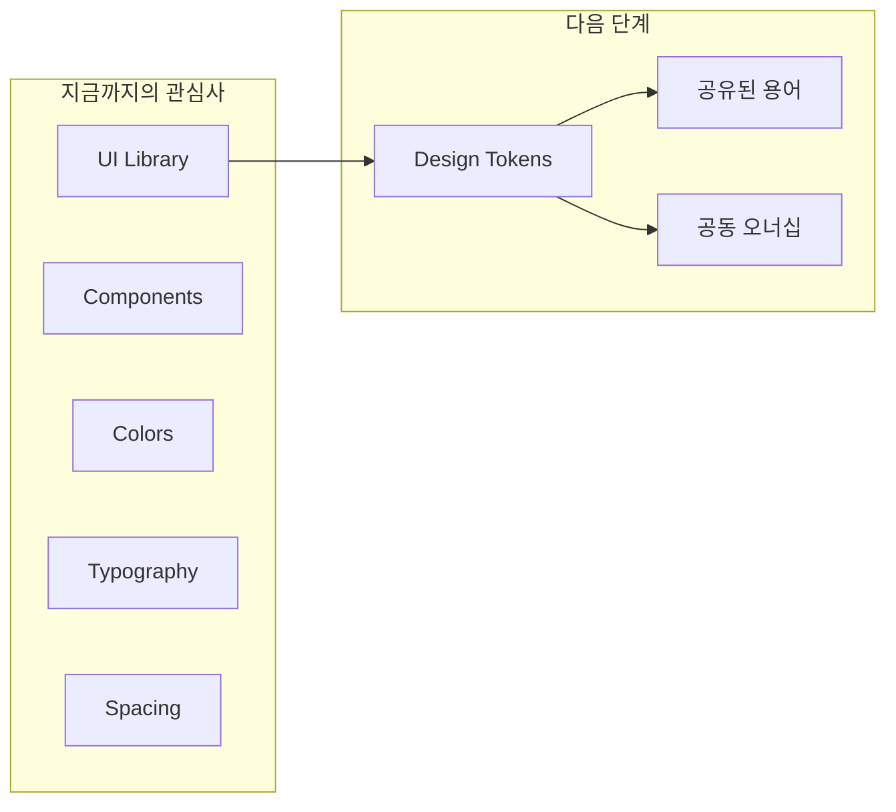

### Transitioning from UI elements to tokens

- 토큰은 디자이너와 개발자 간의 소통에 있어서 일관된 용어를 제공한다.
- 다양한 추상화 단계, 유스케이스, 정의들이 뒤섞여 UI 속성을 이야기하다 보면 대화는 순식간에 난잡해진다.

#### What is a token?

- 토큰은 구조화된 형식으로 저장된, 재사용 가능한 디자인 결정이다.
- 색상, 여백, 타이포그래피와 같은 핵심 디자인 속성들을 캡슐화하여 디자인 시스템 전반에 일관되게 적용할 수 있도록 도와준다.
- 단지 이름과 구조가 부여된 디자인의 `결정 사항` 일 뿐이다.

### Adding tokens to our project

- 굳이 토큰을 정의하지 않았더라도, semantic한 color, font 들도 토큰의 일종이다.

#### Primitive and semantic tokens

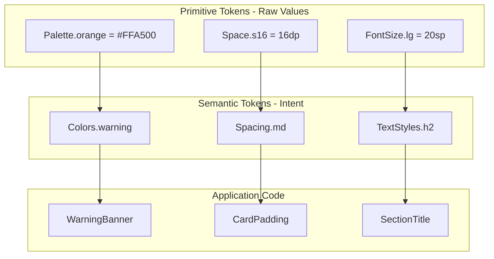

- UI primitive 값은 primitive token이 될 수 있다.
- UI semantic 값도 semantic token이 될 수 있다.

#### Tokens vs Design System

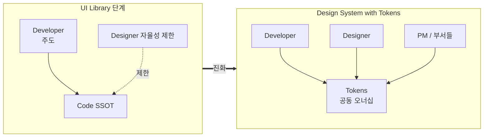

- UI 라이브러리는 개발자 주도로 만들어져 디자이너의 자율성을 제한한다.
- 토큰을 도입하여 디자이너와 개발자가 공동 오너십을 가질 수 있도록 한다.
- 개발 팀 내에만 머물러있는 UI 라이브러리와 달리, 토큰을 도입한 디자인 시스템은 부서의 경계를 넘나든다.

#### Naming Tokens Together

- 같이 토큰의 네이밍을 정하면서 개발자와 디자이너의 언어를 통일할 수 있다.
- 디자이너는 비주얼에 중점을 개발자는 구조와 코드의 확장성에 중점들 둘 것이다. 둘 다 고려해야 한다.
- 정해진 답은 없이 팀간에 혼란 없는 용어를 정하면 된다.
- 좋은 네이밍의 기준: 의미를 잘 나타내는가? 어떻게 생겼는지 잘 나타내는가?

#### Why not start with tokens first?

- 대부분의 팀이 처음부터 완벽한 디자인 시스템부터 시작하지는 않는다.
- 실제로 개발하는 과정에서 기능이 정확히 무엇인지, UI에 필요한 요구사항이 무엇인지, 코드의 어느 부분에서 중복이 발생하는지를 자연스럽게 배우게 된다.
- 디자인 토큰은 앱을 만드는 동안 점진적으로 진화할 수 있다.

### Where and how tokens are defined

- 토큰을 디자이너와 함께 정의하고, 팀으로써 올바른 타이포와 색상, 스페이싱을 합의했다면
- 다음은 이를 공식화하는 것이다. 누가 토큰을 관리할지, 원천을 어디로 할지?, 개발과 디자인간의 토큰 동기화를 어떻게 맞출지.
- 토큰을 관리하기 위해 디자인 툴, 문서, 코드를 사용할 수 있다.
- 두 개 이상을 사용한다면 서로 동기화를 맞출 필요가 생긴다.
- 어떤 시스템을 선택하든간에 디자이너가 명확하고 확인된 워크플로우를 통해 토큰에 영향력을 행사하고 수정할 수 있어야 한다.

#### Tokens live outside a UI library

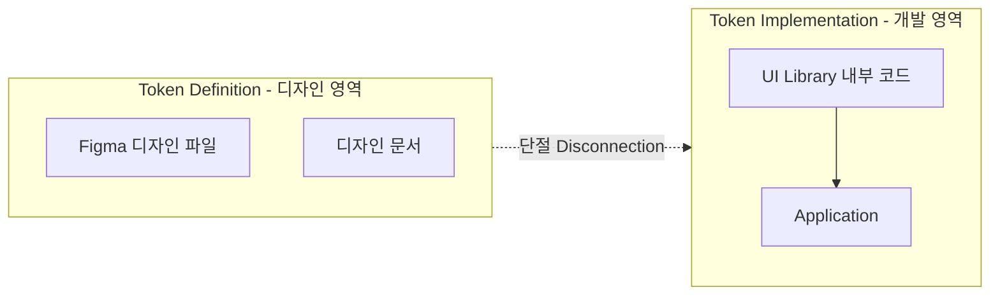

- 토큰은 UI 라이브러리 내부에 작성되어 있지만, 이는 어디까지나 실제 동작을 위한 구현체(Implementation) 역할을 할 뿐이다. 반대로, 그 토큰들의 진짜 정의(Definition)는 대개 디자인 영역에서 처음 시작된다.
- 토큰의 정의(디자인 파일)와 토큰의 구현(개발 코드) 사이에는 단절(Disconnection)이 존재한다.

### Manually syncing tokens for a single platform

- 업데이트가 발생할 때마다 토큰이 항상 동기화되어야 한다.

#### Lightweight workflows

- 만약 한 명의 디자이너와 여러 명의 개발자로 이루어져있다면, 자동화가 아닌 수동 방식이 팀에서 제대로 작동한다면 그것이 가장 빠르게 시작할 수 있는 최선인 방법인 경우가 많다.
- 이러한 접근 방식을 먼저 다루고, 규모가 커지면서 마주하게 될 몇 가지 한계점들을 짚어볼 것이다.

### Design as the source of truth, developers sync

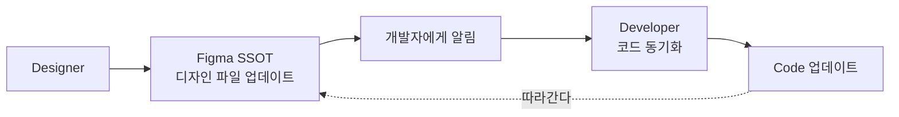

- 디자이너에게 가장 쉬운 방법은 디자인을 업데이트하고 개발자에게 알리는 것이다.
- 디자이너은 코드에 대해 모르기 때문에, 서로 각각의 방식을 유지한채로 작업할 수 있다.
- 디자인 파일이 SSOT이기 때문에, 코드와 디자인의 차이가 생기면 코드가 디자인을 따라가야 한다.
- 하지만 이 방법은 디자인 파일이 어떻게 세팅되어야 하는지에 대한 표준이 없기 때문에, 여러 디자이너가 각각 다른 방법으로 작업하게 될 것이다.
- 이렇게 되면, 개발자가 어떤 토큰을 사용해야할지 유추하는 비용이 추가로 든다.

#### What a designer can do to help

- 필요한 스타일들이 존재하는 별도의 디자인 파일이 있다면 개발자가 토큰으로 만드는 작업이 훨씬 쉬워질 것이다.
- 하지만 이러한 파일로도 무엇이 바뀌었는지 알아차리기는 힘들다. 이를 위해 디자이너가 change log를 관리할 수 있다.

### Designer syncs; Code is source of truth

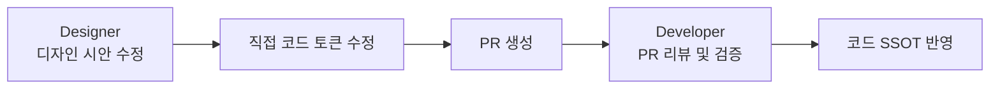

- 개발자는 디자인 파일을 만든 사람이 아니므로 변경을 알아차리는 것이 힘들다.
- 디자이너가 디자인 시안을 업데이트하고, 직접 코드로 토큰을 업데이트하는 방법이 존재한다.
- 디자이너가 토큰 값을 업데이트하고 나면, 개발자 중 한 명이 PR의 담당자가 되어 변경 사항을 검증한다.
- 정석은 아니지만, 규모가 작은 팀에서는 효과적일 수 있다.

#### Code tends to be more centralized

- 개발자는 코드에 연관된 요소를 한 곳에 묶어두는 경향이 있어 더 쉽게 중앙집중화된다.

#### Updating the code

- 디자이너는 파일을 열고, 색상을 수정한 뒤, PR을 올리면 된다.

#### A designer doesn't have to edit code perfectly

- 디자이너가 수정한 코드가 컴파일이 안 되어도 상관 없다.
- 사소한 구문 오류는 개발자나 AI 에이전트가 해결할 수 있다.
- 코드를 변경하는 게 까다롭다면, PR 코멘트로 개발자에게 부탁하는 방법도 있다.

#### Benefits of this approach

- 디자인 파일과 코드 사이에 복잡한 동기화 메커니즘을 도입하지 않아도 된다.
- 공식 디자인 시스템 문서 웹사이트와 같은 제 3의 존재를 만들 필요가 업다.
- 디자이너가 모든 변경 사항을 개발자에게 일일이 말로 설명하며 소통할 필요가 없어진다.

#### Downsides

- 하지만 디자이너에게 수동 동기화의 부담을 전가한다는 단점이 있다.
- 기본적으로 디자이너가 동기화 장치가 되어, 단일 실패 지점이 될 수 있다.
- 토큰을 완전히 삭제하거나 이름을 바꾸는 작업에는 조금 더 많은 공수가 들어갈 수 있다.
- 가장 큰 단점은 디자이너가 코드를 고치고 있을 뿐이므로, 시각적 피드백 루프가 없다는 것이다.

### Recognizing the power imbalance between designers and developers

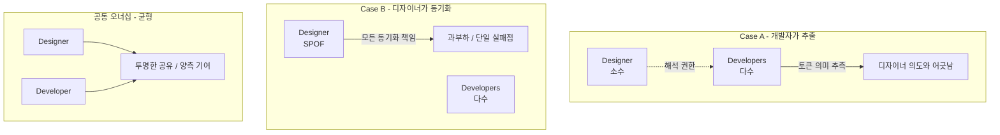

- 토큰과 디자인 파일의 동기화는 협업을 요구하지만, 각각의 책임의 무게가 항상 같은 것은 아니다.
- 위의 방법도 작은 규모에서는 괜찮지만, 나중에는 디자이너에게 지나친 과부하가 발생할 수 있다.
- 또한 대부분의 앱 개발 팀에서 디자이너는 개발자에 비해 소수이다.
- 정반대로, 개발자가 디자인 파일에서 토큰 변경 사항을 수동으로 추출하는 방식 또한 불균형을 만들어낸다.
- 디자이너가 자신이 변경한 사항들이 코드에서 어떻게 해석되고, 이름이 어떻게 바뀌며, 어떤 우선순위로 반영되는지 명확하게 알 수 없는 상태에 놓이게 된다.
- 공동 오너십이란 양측이 책임 역시 공평하게 분담할 때만 제대로 작동한다.

### Using a handoff system

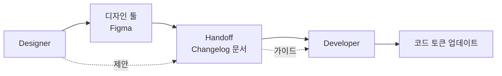

- 디자이너가 개발자들이 변경 사항을 한눈에 명확하게 볼 수 있도록 changelog를 만들면 각각의 세계에 그대로 머물면서도 매끄럽게 일할 수 있다.
- 서로의 환경에 접근할 필요가 없기 때문에 동일한 책임과 권력 균형을 가지게 된다.
- 핸드오프 문서를 통해 각자는 자신의 위치에서 자기몫의 기여를 하게 된다.

#### Token decisions are still shared

- 핸드오프 문서를 작성하더라도 디자이너가 개발자에게 변경하라고 명령하는 것은 아니다.
- 소통의 수단으로서 개발자도 디자인 시스템의 일관성와 유지보수성에 기여하게 된다.
- 핸드오프 문서는 스펙이 아닌 제안서처럼 대해진다.

### Conclusion

- 디자인 시스템은 목적은 툴의 세팅이 아니라, 다양한 팀에게 공유되고 합의된 워크플로우를 만들어 구조화된 방식으로 일할 수 있도록 돕는 것이다.

### What we covered

- Tokens and the transition from UI library to design system
    - 토큰은 디자인과 개발 사이에 공유된 용어를 제공함으로 UI 관련 소통을 단순화한다.
    - primitive 값, semantic 값도 토큰의 일종이다.
- Design system versus token usage
    - 가장 큰 차이는 소유권으로 진짜 디자인 시스템에서는 디자이너와 개발자가 함께 토큰을 정의하고 관리한다.
    - 디자이너는 토큰의 의도를 결정하고 개발자는 이를 코드로 녹여내는 구현을 돕는다.
- Naming tokens together
    - 토큰의 이름을 함께 짓는 과정에서 공유된 용어가 창조된다.
    - 토큰 네이밍을 표준화하기 위해 일정한 규칙을 사용하는 것을 고려하라.
- Why not start with tokens right away
    - 토큰은 대개 개발 과정에서 발생하는 코드 중복과 UI의 불일치를 해결하는 과정에서 자연스럽게 형성된다.
- Where tokens are defined and how they sync
    - 토큰은 코드, 디자인 파일, 공유 라이브러리 등 다양한 곳에 존재한다.
    - SSOT를 정하고, 어떻게 동기화할지 기준을 명확히 해야 한다.
- Manual sync workflows for small teams
    - 2가지 선택지
        - 개발자가 업데이트된 디자인 파일에서 토큰을 수동으로 추출하는 방식
        - 디자이너가 토큰 정의를 직접 수정하고 PR을 날리는 방식
    - 코드는 중앙집중화되는 경향이 있기 때문에, 시간이 흐를수록 코드쪽에서 토큰을 관리하는 것이 수월해진다.
    - 디자이너가 문법을 완벽하게 맞추지 못하더라도 얼마든지 코드에 기여할 수 있다.
    - 가장 큰 장점은, 모든 변경 사항을 개발자에게 구구절절 말로 설명하며 소통할 필요가 없다는 점이다.
- The imbalance between designers and developers
    - 대부분의 앱 개발 팀에서 개발자의 수는 디자이너보다 압도적으로 많으며, 이는 역할적 불균형을 만든다.
    - 디자이너는 시각 디자인 외에도 광범위한 책임을 지지만, 정작 코드가 어떻게 구현되는지에 대해서는 제어권을 거의 가지지 못한다.
    - 공동 오너십은 양측 모두가 진행 사항을 투명하게 볼 수 있고, 의견을 낼 수 있으며, 의미 있는 기여를 할 수 있도록 적절한 지원을 받을 때 제대로 작동한다.
- Using handoff documents
    - Changelog 역할을 하는 구조화된 핸드오프 문서를 사용하는 방법도 있다.
    - 디자이너는 익숙한 디자인 툴에 그대로 머무르면서도, 무엇이 바뀌었는지 문서를 통해 전달한다.
    - 개발자는 이 문서를 가이드 삼아 토큰을 업데이트한다.
    - 이 방식은 작업을 공평하게 분담하고, 혼선을 방지하며, 양측이 완벽하게 한 방향을 바라볼 수 있도록 정렬해준다.

---

# Design Systems at Scale: Token Workflows Across Platforms and Teams

### Manually syncing tokens across multiple platforms

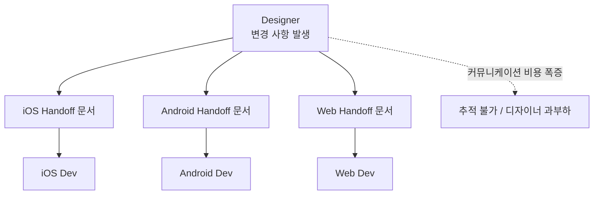

- 지난 장에서 이야기한 디자이너가 changelog를 관리하는 법은 single 플랫폼일때는 효과적이였더라도 mutli-platform으로 가면 이슈가 발생한다.

#### Double the handoffs, double the communication

- 두 개의 플랫폼의 변경 사항에 대해 두 개의 핸드 오프 문서를 전달하는 방법이 있다.
- 작고 변경사항이 잦지 않은 팀에게는 괜찮지만, 점점 추적하기 어려워진다.
- 또한 디자이너가 여러 개의 핸드오프에 대한 커뮤니케이션을 책임져야 한다.

### Introducing a token repository

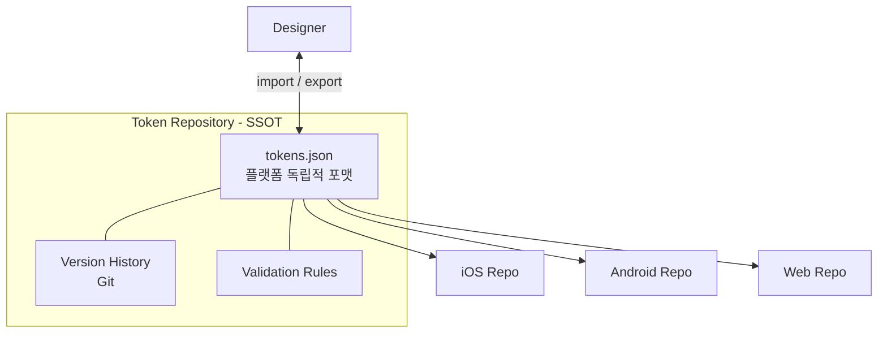

- 토큰 저장소는 JSON과 같이 특정 플랫폼에 종속되지 않는 독립적인 포맷으로 토큰을 저장하는 구조화되고 버전 관리가 가능한 공간을 의미한다.
- 단순한 디자인 파일과 달리, 다음 이점을 가진다:
    - 버전 이력 및 추적 가능성
    - 유효성 검사 및 네이밍 규칙 강제
    - 자동화 기회 창출
    - 디자인과 엔지니어링 간의 더 나은 협업 유도
    - 다양한 제품군과 다중 플랫폼으로 디자인 시스템을 확장할 수 있는 기반 마련

#### A token repository workflow

- 토큰 저장소로 전환하기 위해서는 토큰들을 플랫폼 독립적인 공용 포맷으로 변환해야 한다.
- 가장 널리 쓰이는 선택지는 JSON이며 수많은 툴에서 지원해준다.

#### Why do designers both import and export tokens?

- 디자이너 또한 피그마를 토큰 저장소와 동기화하기 위해 import 해야 한다.
- 여러 개의 디자인 파일을 관리하기 때문에 토큰에 변경사항이 생길 때마다, re-import 해서 최신 버전 토큰을 사용하고 있음을 보장받아야 한다.

#### Versioning and shared history

- 커밋 히스토리를 통해서 변경사항을 추적할 수 있다는 것이 장점이다.

#### What token JSON files look like

- 일반적으로 값들을 카테고리와 목적별로 그룹화한 JSON 구조로 저장된다.

```json
{
  "color": {
    "background": {
      "primary": "#007AFF",
      "secondary": "#F2F2F7"
    },
    "text": {
      "primary": "#000000",
      "secondary": "#666666"
    }
  },
  "spacing": {
    "small": "8",
    "medium": "16",
    "large": "24"
  },
  "font": {
    "header": {
      "size": "20",
      "weight": "regular"
    },
    "body": {
      "size": "16",
      "weight": "light"
    }
  }
}
```

- 특정 플랫폼 전용 문법이나 데이터 타입을 전제하지 않기 때문에 플랫폼 독립적이다.

#### Token aliasing

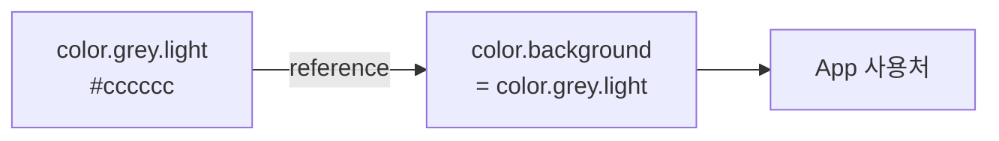

- primitive token, semantic token을 지원하고 싶다면 참조 기능을 사용하면 된다.

```json
{
  "color": {
    "grey": {
      "light": { "value": "#cccccc" }
    },
    "background": {
      "value": "{color.grey.light}"
    }
  }
}
```

- 토큰이 literal 값을 직접 가리키는 대신, 또 다른 토큰을 가리키게 만드는 것을 의미한다.

### Sharing tokens between platforms

- 토큰을 중앙집중화하기에 앞서, 플랫폼별로 다르게 된 토큰 이름을 통일할 필요가 있다.
- 통일된 이름을 사용해야 소통이 쉬워진다. (Spacing.large 를 조절해주세요)

#### Disconnect token names from values

- 플랫폼 간에 토큰을 공유한다는 말이 모든 플랫폼이 동일한 수치를 사용해야 함을 의미하지는 않는다.
- 토큰 이름은 공유된 디자인 의도를 나타내기에 실제 매핑되는 값은 다를 수 있다.

#### Platform-specific override

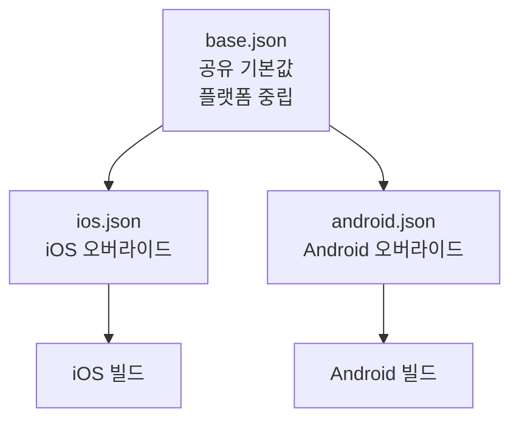

```text
tokens/
|- base.json     # shared defaults
|- ios.json      # iOS-specific values
|- android.json  # Android-specific values
```

- 공유 토큰을 플랫폼 중립적인 상태로 유지하는 동시에
- 각 플랫폼에서 필요한 값들은 오버라이드해서 독립적으로 관리할 수 있다.

#### Platform-specific extensions

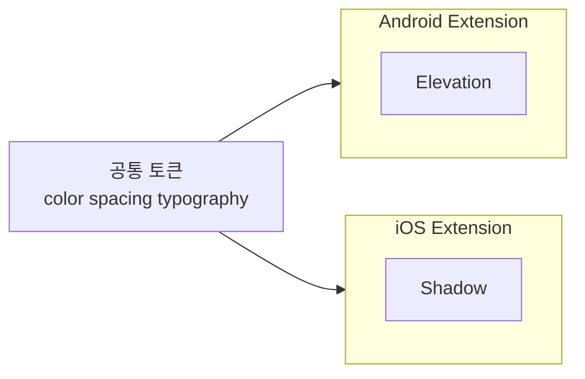

- 앞선 오버라이드 방식은 각 플랫폼이 모든 토큰 종류를 똑같이 공유한다는 것을 전제로 한다.
- 하지만 플랫폼 전용 특성을 위해 extension을 활용할 수 있다.
- Android의 Elevation, iOS의 Shadow가 그 예시이다.

### Introducing documentation

- JSON 에 구조화된 설명을 넣는 것은 어려운 일이다.
- 따라서 디자인 결정에 대해 이해할 수 있도록 도와주는 문서가 필요하다.

#### Where the doc lives

- 처음에는 markdown, notion, google doc 처럼 가벼운 방식으로 시작해도 된다.
- 가장 중요한 건 모두가 해당 문서가 어디에 있는지 알고, 항상 업데이트된 상태로 유지하는 것이다.

#### Who maintains the documentation?

- 디자이너와 개발자 둘 다 기여한다.
- 디자이너가 토큰이 어떻게 작동하는지 초안을 작성하면 개발자는 디테일을 추가한다.

#### What to include in token documentation

- 좋은 토큰 문서는 각 토큰의 목적과 올바른 사용법을 명확하게 사용하는 본질에 집중한다.
- 실제 화면 안에서 이 토큰이 어떻게 쓰이는지 스크린샷이나 목업 같은 '시각적 예시'를 보여주면 좋다.

### Lightweight automation

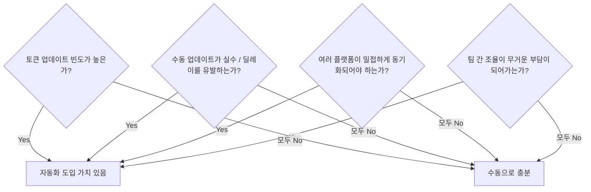

- 먼저 토큰이 동기화가 진짜 문제인지 판단하는 것이 중요하다.
- 자동화는 다음과 같은 상황에서 가치를 지닌다:
    - 토큰이 업데이트 빈도 수가 많을 때
    - 수동 업데이트가 실수나 딜레이를 유발할 때
    - 여러 플랫폼의 토큰이 밀접하게 동기화되어야 할 때
    - 토큰 업데이트를 위한 팀 간의 조율이 점점 무거운 짐이 되어갈 때

#### Starting with lightweight automation

- 완벽한 솔루션보다는 특정 pain point를 해결하는 작고 실용적인 개선부터 도입하라.

#### Adding token validation

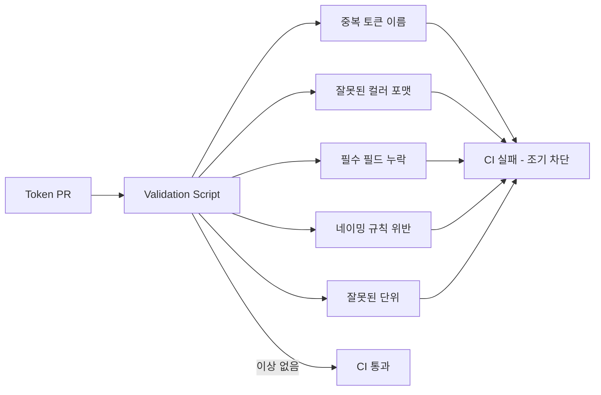

- 자동화의 첫 단추는 유효성 검사로 최우선 단계에서 문제를 조기에 차단해준다.
- 유효성 검사 스크립트가 잡아내는 핵심 에러:
    - 여러 파일에 중복된 토큰 이름이 존재하는지
    - 잘못된 컬러 포맷
    - 필수 필드 누락
    - 일관성 없는 네이밍 규칙
    - 여백이나 타이포그래피 토큰에 잘못된 단위가 들어갔는지

#### Generating platform-specific files

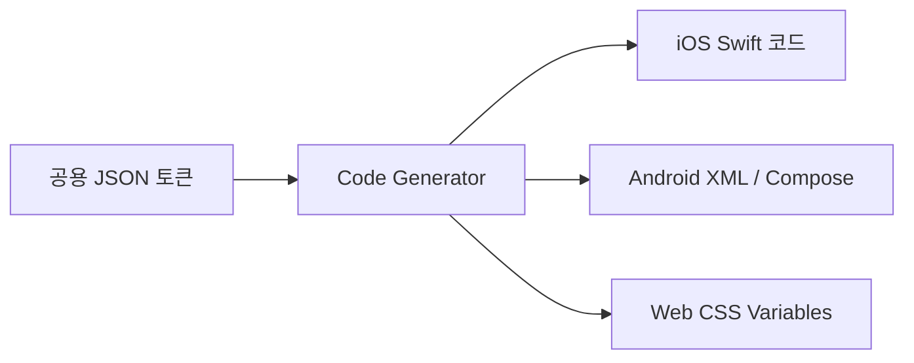

- 검증 시스템이 갖춰지면 공용 JSON 토큰을 각 플랫폼 전용 출력으로 자동 변환하는 과정을 추가한다.
- iOS: Swift 코드 생성 / Android: XML 또는 Compose 코드 생성 / Web : CSS 변수 생성

#### Updated workflow

- CI/CD 검증과 자동 파일 내보내기 기능이 추가된 워크플로우는 다음 이점을 가진다.
- 오류가 CI 검증 단계에서 검출되어 버그가 즉각적으로 감소한다.
- 자동으로 생성된 파일 덕분에 핸드오프가 빨라지고 신뢰도가 높아진다.
- 모든 플랫폼이 동일한 수치를 보장받으므로 UI 일관성이 보장된다.

#### Manual distribution (for now)

- 개발자들은 생성된 파일을 각 플랫폼의 코드베이스로 직접 복사해야 한다.
- 자동화를 이제 막 시작할 때 개발자가 토큰 업데이트를 언제 적용할지 스스로 제어할 수 있는 통제권을 주기 때문에 저장소 간 자동화가 가지는 복잡성을 피할 수 있게 한다.

### Fully integrated automation

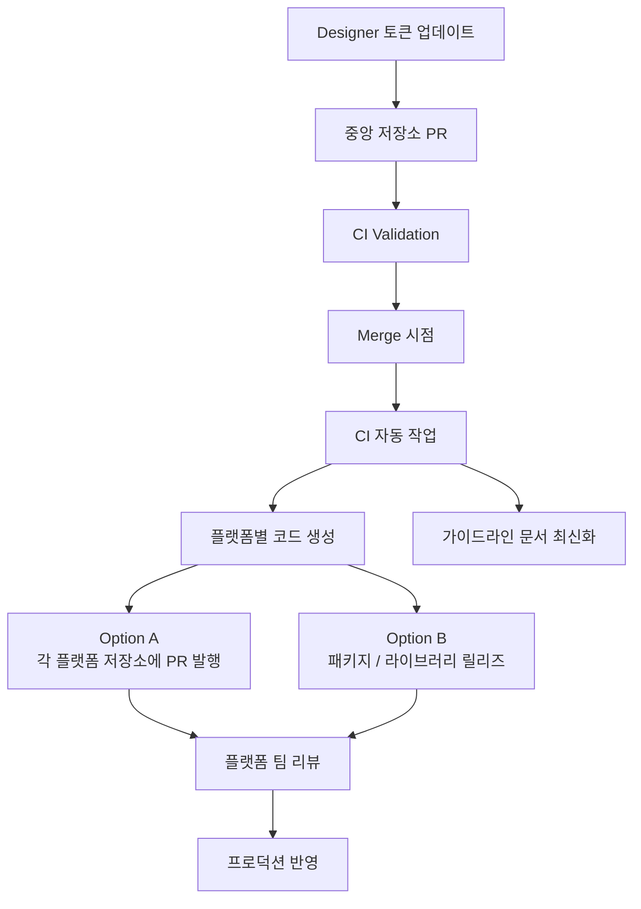

- 완전 통합 자동화는 두가지 방식으로 구현할 수 있다.
    - CI가 업데이트된 토큰 파일을 들고 각 플랫폼의 저장소에서 직접 PR을 생성하는 방식
    - CI가 디자인 토큰을 하나의 패키지/모듈로 배포하고, 앱 팀이 이를 의존성으로 소비하는 방식

#### Opening pull requests automatically

- 누군가 중앙 저장소에서 토큰을 업데이트하면, CI 시스템은
    - 각 플랫폼별 타겟 파일들을 자동으로 생성한다.
    - 각각의 타겟 저장소를 클론한다.
    - 업데이트된 토큰 파일이 담긴 브랜치를 생성한다.
    - 명확한 타이틀과 변경 이력을 채워 PR을 발행한다.
    - 관련 플랫폼 팀원들에게 리뷰 알림을 보낸다.
- 코드 생성에 대한 수동 과정을 거치지 않으면서도, 언제 반영할지 통제권을 쥐고 갈 수 있다.

#### Publishing as packages

- CI가 semantic versioning 규칙에 맞춰 원격 저장소에 라이브러리를 릴리즈하고 팀원이 이를 의존성으로 소비하는 방식이다.
- 하나의 플랫폼 안에서 여러 개의 앱 서비스가 동일한 디자인 시스템을 공유해야할 때 적절하다.

#### Documentation as part of the pipeline

- 완전 자동화 환경에서 CI는 공식 웹사이트 내의 토큰 목록이나 참조 가이드라인까지 업데이트한다.
- 덕분에 가이드라인 문서가 항상 실제 최신 토큰 버전과 완벽하게 일치하게 된다.

#### The complete automated workflow

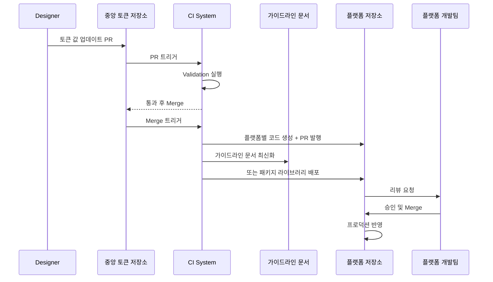

1. 디자이너가 중앙 시스템에서 토큰 값을 업데이트한다.
2. PR이 열리면 CI 유효성 검사가 돌아간다.
3. 리뷰 후 병합되는 순간 CI 가 작동한다.
    1. 플랫폼별 전용 파일을 생성하고
    2. 디자인 시스템 공식 가이드라인 문서를 최신화하고
    3. 하위 앱 저장소들에 변경 사항 PR을 발행하고
    4. 또는 패키지 저장소에 최신 버전의 라이브러리를 배포한다.
4. 개별 플랫폼 개발 팀은 올려둔 PR을 확인하고 리뷰한다.
5. 승인 후 병합하면, 새로운 디자인 시스템이 프로덕션에 반영된다.

### Should web and mobile share tokens?

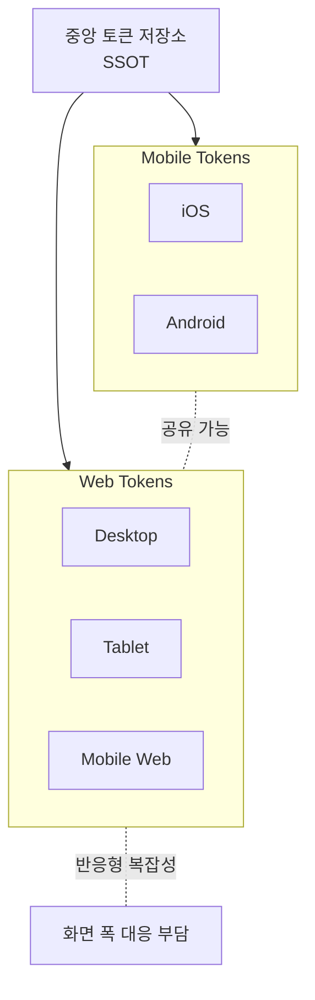

- 모바일과 달리 웹은 폰 화면부터 데스크탑 화면까지 대응해야 하기 때문에 같은 토큰 시스템을 공유하도록 하는 것은 더 많은 복잡성을 야기시킨다.
- 하지만 웹과 모바일이 같은 토큰을 공유하지 않더라도 중앙 토큰 저장소는 다 함께 공유할 수 있다.

### What we covered

- Scaling token workflows beyond single platforms
    - 수동으로 싱크를 맞춘다면 플랫폼마다 별도의 핸드오프 과정을 거치므로, 팀이 커질 수록 소통 비용도 커진다.
- Why a central token repository matters
    - 토큰 저장소는 SSOT 역할을 한다.
    - 버전 관리, 변경 이력 추적, 여러 플랫폼 간의 일관성 유지를 가능하게 한다.
    - JSON은 다양한 도구에서 범용적으로 지원하므로 흔하게 사용되는 데이터 교환 포맷이다.
    - 토큰은 단순히 디자인 툴에서 내보내기만 하는 것이 아닌, 디자이너가 이를 역으로 가져오기도 한다.
    - 디자인 토큰을 토큰 저장소의 최신 상태와 동기화해야만 시각적 일관성이 보장되고 불필요한 재작업을 방지한다.
- Naming conventions and platform-specific overrides
    - 일관성을 유지하기 위해 모든 플랫폼은 토큰 이름을 공유해야 한다.
    - 토큰 이름은 특정 플랫폼에 종속되지 않는 semantic 명명법을 따라야 한다.
    - 플랫폼별 override나 extension을 사용하면 OS 고유의 유연성을 확보할 수 있다.
- Lightweight documentation
    - 독립된 토큰 문서 파일을 작성해 두면 각 토큰의 용도와 디자인 의도를 구성원들에게 설명하는 데 도움이 된다.
    - 처음부터 문서가 완벽하거나 100% 자동화되어 있을 필요는 없다. 내용이 명확하고 누구나 쉽게 접근할 수 있도록 하는 것이 먼저이다.
- From manual to lightweight automation
    - 자동화는 유효성 검사, 파일 동기화, 플랫폼별 파일 생성 등 간단한 단계부터 시작할 수 있다.
    - 초기에 가장 쉽고 확실한 성과를 내는 것은 토큰 유효성 검사이다.
- Full automation and scaling up
    - 자동화 단계가 안정되면, CI 시스템에 코드를 직접 생성하고 PR을 올리는 더 많은 임무를 부과할 수 있다.
    - PR을 올리는 대신, 독립된 패키지/라이브러리 형태로 릴리즈할 수도 있다.
    - 완전 자동화가 이루어지면 디자이너의 토큰 내보내기 → 자동 유효성 검사 → 플랫폼별 코드 생성 → 가이드 라인 문서 최신화 → 변경 사항이 담긴 PR 발행까지의 과정이 매끄럽게 흐른다.
