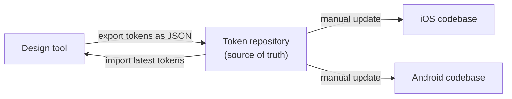
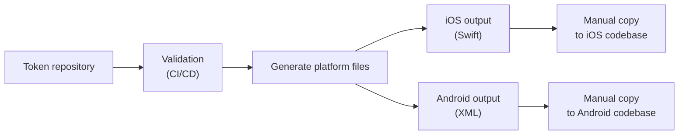

# [WEEK 03] Chapter 5, Chapter 6
📖 Mobile System Design 2. Large-Scale Codebases & Design Systems  

<br>

## 5. From Semantic UI to Design System: Standardizing UI Decisions with Tokens
> semantic UI를 design system으로 확장하려면 UI 결정을 token이라는 공유 단위로 정리해야 한다.  

### Revisiting the UI Library: What’s Missing?

UI library만으로도 앱 안의 기본 UI를 일관되게 만들 수 있다.  
하지만 design system으로 확장하려면 UI library 밖에서 함께 관리할 기준이 필요하다.  

그 역할을 하는 것이 `tokens`이다.  
token은 UI library 내부 구현보다 한 단계 바깥에서 **디자인 결정을 정의하고 공유**한다.  

---

### Transitioning from UI elements to tokens

#### token
token은 재사용 가능한 디자인 결정에 이름과 구조를 부여한 것이다.  
색상, spacing, typography, icon, shadow처럼 반복해서 쓰이는 UI 결정을 하나의 공통 언어로 다룬다.  

color primitive, semantic text style, semantic border처럼 흩어져 있던 용어도 token이라는 이름으로 묶을 수 있다.  

> [!Note]
>token을 통해 UI 결정을 두고 개발자와 디자이너가 서로 다른 단어로 말하는 문제를 줄일 수 있다.

---

### Adding tokens to our project

`Color.primaryBackground`, `Shadow.large` 같은 semantic UI element도 token으로 볼 수 있다.

| 구분              | 의미                  | 예시                                        |
| --------------- | ------------------- | ----------------------------------------- |
| primitive token | raw value에 가까운 기본 값 | `Palette.purple`, `fontSize16`            |
| semantic token  | **사용 의도**를 드러내는 값   | `Color.primaryBackground`, `Icons.delete` |

token을 쓴다고 바로 design system이 되는 것은 아니다.  
UI library는 개발자 중심으로 운영되기 쉽고, design system은 디자이너와 개발자가 token을 함께 소유한다.  

#### Naming 공식 예시
```
<role><type><modifier>
```
- colorBackgroundHighlighted
- shadowLargeElevated
  

> [!Important]
> 개발자와 디자이너는 토큰에 대해 공유 소유권을 가지고 있어야 한다.
> 디자이너와 개발자가 함께 이름, 분류, 의미를 정한다.  

---

### Where and how tokens are defined

token은 design tool, documentation, code 어디에든 정의될 수 있다.  
중요한 것은 source of truth를 명확히 정하고, 디자인과 코드가 같은 기준을 보게 만드는 것이다.  

| source of truth | 장점 | 주의점 |
|---|---|---|
| design tool | 디자이너가 시각적으로 관리하기 쉽다 | 개발자가 변경 사항을 놓치기 쉽다 |
| code | UI library 구현과 가까워 반영 지점이 명확하다 | 디자이너가 값을 바꾸기 어려우면 다시 개발자 중심이 된다 |
| documentation | 합의된 token 이름을 참조하기 쉽다 | UI library, design file과 계속 동기화해야 한다 |

token은 UI library 내부 구현에만 묶이면 안 된다.  
- `UI library`: token을 사용하는 구현체
- `token`: 디자인 시스템의 공유 기준

---

### Manually syncing tokens for a single platform

작은 팀이나 단일 플랫폼에서는 `수동 동기화`로 시작해도 충분하다.  
token 변경이 얼마나 자주 발생하는지 모르는 상태에서 자동화부터 만들 필요는 없다.  

이 단계의 목표는 design과 code의 token을 맞추는 기본 흐름을 이해하는 것이다.  
작은 팀에서 동작하는 수동 방식의 한계를 확인한 뒤, 다음 단계에서 더 큰 규모의 방식을 다룬다.  

---

### Design as the source of truth, developers sync

디자인 파일을 source of truth로 두면 
1. 디자이너가 token을 먼저 바꾼다.  
2. 개발자는 **변경된 token을 확인하고 코드에 반영**한다.  

이 방식은 디자이너의 작업 흐름과 잘 맞는다.  
대신 디자인 파일이 체계적으로 정리되어 있지 않거나 변경 내역이 불분명하면 개발자가 정확한 token을 추출하기 어렵다.  

> [!Note]
> 디자이너가 `visual changelog`를 남기면 개발자가 변경사항을 쉽게 파악하여 token 추출을 수월하게 할 수 있다.
> -  날짜 + 변경 전후의 디자인

---

### Designer syncs; Code is source of truth

code를 source of truth로 두면  
1. token 변경을 code review와 version history 안에서 관리할 수 있다.  
2. 디자이너가 token file을 직접 수정하거나, PR에 필요한 변경을 요청하는 방식으로 동기화한다.  
	> 디자이너가 올바른 token을 수정했다면 문법 오류나 구현 세부사항은 개발자가 PR에서 마무리할 수 있다.  

code는 관련 정의가 한곳에 모이는 경우가 많아 token을 중앙화하기 쉽다.  
디자이너는 IDE를 세팅하지 않아도 Git web client에서 token 값을 바꾸고 PR을 만들 수 있다.  


- `장점`: 별도 sync 도구 없이 변경 이력과 review를 남길 수 있다.
- `단점`: 디자이너가 개발 환경에 들어와야 하고, 변경 결과를 즉시 시각적으로 확인하기 어렵다.

---

### Recognizing the power imbalance between designers and developers

token sync는 협업 문제이지만, 팀이 커질수록 책임이 한쪽에 몰리기 쉽다.  

| 흐름 | 생길 수 있는 문제 |
|---|---|
| 디자이너가 code를 수정 | token 변경, PR 대응, 리뷰 커뮤니케이션 부담이 디자이너에게 몰릴 수 있다 |
| 개발자가 design file에서 추출 | 개발자가 token system의 gatekeeper가 되기 쉽다 |

공유 소유권은 양쪽이 책임을 공유할 때만 성립한다.  
구조화된 handoff 문서는 이 불균형을 줄이기 위한 방법이다.  

---

### Using a handoff system

handoff system은 **각자의 도구 안에서 token 변경을 주고받는 방식**이다.  

| 역할        | 하는 일                            |
| --------- | ------------------------------- |
| Designer  | 변경 전후와 의도를 visual changelog로 정리 |
| Developer | handoff 내용을 기준으로 token을 코드에 반영  |

- 디자이너는 `token exporter`, 개발자는 `token importer`에 가깝다.
- handoff 문서는 source of truth가 아니라 **커뮤니케이션 도구**이다.
	- 사양(spec)이 아니라 제안(proposal)으로 다뤄야 한다.
- token 결정은 여전히 디자이너와 개발자가 함께 맞춘다.

---

### Conclusion

token은 **semantic UI를 design system으로 확장하는 연결점**이다.  
값을 중앙화하는 것보다 중요한 것은 **같은 이름과 의미로 UI 결정을 공유**하는 것이다.  
- 구조화된 방식으로 일 할 수 있게 함
- UI에 일관성을 가져오고 팀이 확장에 더 잘 준비되도록 함

---

### What we covered

- `token`은 재사용 가능한 디자인 결정을 이름 붙인 값이다.
- `primitive token`은 raw value에 가깝고, `semantic token`은 사용 의도를 드러낸다.
- token은 UI library 구현보다 바깥에 있는 공유 결정이다.
- source of truth는 design, code, handoff 중 팀 상황에 맞게 정해야 한다.
- 자동화보다 먼저 필요한 것은 명확한 ownership과 변경 흐름이다.

<br>

## 6. Design Systems at Scale: Token Workflows Across Platforms and Teams
> 여러 플랫폼과 팀이 token을 공유하려면 repository, documentation, automation이 필요하다.  

### Manually syncing tokens across multiple platforms

단일 플랫폼에서는 수동 동기화가 가능하다.  
하지만 iOS, Android, Web처럼 플랫폼이 늘어나면 같은 변경을 여러 번 전달해야 한다.  

handoff가 늘어나면 디자이너가 여러 팀과 계속 커뮤니케이션해야 한다.  
변경 사항이 Slack, Confluence, Google Docs 같은 여러 곳에 흩어지면 추적도 어려워진다.  

> [!Note]
> code와 design이 일치하지 않는다면 디자인 파일이 source of truth이다.

---

### Introducing a token repository

#### A token repository

- 플랫폼에 종속되지 않는 token을 관리하는 중앙 저장소이다. (Git repo)
- 디자이너와 각 플랫폼은 이 repository를 기준으로 token을 가져오거나 반영한다.  

platform마다 token이 어긋나는 token drift를 줄이려면 **shared source of truth**가 필요하다.  
`token repository`는 token 이름과 구조를 맞추고, Git 기반으로 변경 이력을 남기게 해준다.  

```json
{
  "color": {
    "background": {
      "primary": "#007AFF"
    },
    "text": {
      "primary": "#000000"
    }
  },
  "spacing": {
    "small": "8",
    "medium": "16"
  }
}
```

**repository의 장점**
- 변경 이력, review, validation, 플랫폼별 파일 생성을 같은 흐름에서 다룰 수 있다.  
- token이 개인의 기억이나 handoff 문서에 의존하지 않고 버전 관리되는 자산이 된다.  

#### Token aliasing
token은 literal value 대신 **다른 token을 참조**할 수도 있다.  

ex) `color.background`가 `{color.grey.light}`를 참조하면 실제 색상 값과 사용 의도를 분리할 수 있다.  
```Json
{
	"color": {
		"grey": {
			"light": { "value": "#cccccc" }
		},
		"background": {
			"value": "{color.grey.light}"
		}
	}
}
```

---

### Sharing tokens between platforms

여러 플랫폼이 token을 공유한다는 뜻은 모든 값이 항상 같다는 뜻이 아니다.  
먼저 공유해야 하는 것은 **token의 이름과 의도**이다.  

| 개념 | 의미 | 예시 |
|---|---|---|
| platform override | 같은 token 이름에 플랫폼별 값을 둔다 | Android `spacing.medium = 20` |
| platform extension | 특정 플랫폼에만 필요한 token을 추가한다 | Android elevation token |

override와 extension은 플랫폼 차이를 인정하면서도 공유 구조를 유지하게 해준다.  

- 특정 플랫폼 token set
	```mermaid
	flowchart TB
	    A["Base Set<br/>(colors, spacing, etc)"]
	    A --> B["iOS Token Set<br/>(corner radii, blur, safe areas, etc)"]
	    A --> C["Android Token Set<br/>(elevation, surface, etc)"]
	```

---

### Introducing documentation

#### documentation
- token repository만으로는 token을 언제 써야 하는지 알기 어렵다.  
- documentation은 token의 의미, 사용 기준, 플랫폼별 예외를 설명하는 역할을 한다.  

모든 token을 처음부터 길게 설명할 필요는 없다.  
자주 헷갈리는 token, 자주 쓰는 token, 플랫폼 차이가 있는 token부터 정리하면 된다.  

#### 문서에 포함할 내용
- token의 목적
- 사용해야 하는 상황
- 사용하지 말아야 하는 상황
- platform-specific note
- 시각적 예시 또는 before/after

---

### Lightweight automation

automation은 수동 동기화에서 반복되는 실수를 줄이기 위해 도입한다.  
처음부터 완전 자동화를 목표로 하기보다 `validation`과 `file generation`부터 시작하는 편이 현실적이다.  

#### validation 후보
- 중복 token 이름 검사
- 잘못된 색상, 단위, 타입 검사
- naming rule 검사
- 필수 필드 누락 검사

#### generation 후보
> 플랫폼별 출력
- Android XML 생성
- iOS Swift file 생성
- Web CSS variable 생성

#### Updated workflow



이 단계에서는 생성까지 자동화하지만, 플랫폼 codebase 반영은 여전히 수동이다.  
팀은 token update를 언제 적용할지 직접 제어하면서도, validation과 generation으로 실수를 줄일 수 있다.  

---

### Fully integrated automation

token 변경을 플랫폼 코드까지 자동으로 전달하는 흐름이다.  
1. CI가 token을 검증하고
2. 플랫폼별 파일을 생성한 뒤
3. 각 플랫폼 repository를 clone해 업데이트한 후 PR을 열 수 있다.  

#### Publishing as packages
- token을 versioned package로 배포하고, app team이 dependency로 가져다 쓴다.
- 여러 app이 같은 design system을 공유하거나, design/engineering team 간 거리가 있을 때 유용하다.

#### Documentation as part of the pipeline
- CI가 token list, changelog, deprecated token 정보를 문서에 함께 반영한다.
- 같은 JSON source에서 문서가 갱신되므로 outdated docs 문제를 줄일 수 있다.

완전 자동화는 drift와 수동 복사 실수를 줄인다.  
대신 CI, package, downstream PR 흐름을 유지하는 비용이 생긴다.  

---

### Should web and mobile share tokens?

> web과 mobile이 모든 token을 공유할 필요는 없다.  

color처럼 브랜드 일관성이 중요한 값은 공유하기 좋지만, 
typography, spacing, navigation은 플랫폼 관습에 따라 달라질 수 있다.  

따라서 하나의 repository 안에서 공통 token과 platform-specific token을 나누는 방식이 현실적이다.  
공유의 기준은 값의 동일성이 아니라 **의도의 일관성**이다.  

---

### Conclusion

규모가 커질수록 design system은 token file 하나로 끝나지 않는다.  
manual handoff → token repository → documentation → validation → CI workflow로 점진적으로 확장된다.  
> 어느 단계에서든 멈출 수 있다

중앙 repository는 source of truth를 만들고, JSON은 플랫폼 간 token 교환 형식을 제공한다.
자동화는 수동 복사와 drift를 줄이지만, 팀 규모와 변경 빈도에 맞춰 단계적으로 도입해야 한다.  

governance는 별도 문제이다.  
- token 변경 승인
- 충돌 해결
- ownership 
같은 운영 방식은 팀 구조에 맞게 정해야 한다.  

---

### What we covered

- 수동 동기화는 플랫폼이 늘어날수록 drift 위험이 커진다.
- `token repository`는 design과 platform code가 함께 보는 source of truth이다.
- JSON은 token을 플랫폼에 종속되지 않는 형식으로 저장하게 해준다.
- `aliasing`은 token 간 참조를 가능하게 하고, `override/extension`은 플랫폼 차이를 다룬다.
- `documentation`은 token의 목적, 사용 기준, 플랫폼별 예외를 설명한다.
- `자동화`는 validation, generation, manual distribution에서 fully integrated workflow로 확장될 수 있다.
- web과 mobile은 같은 repository를 공유할 수 있지만, token set은 분리될 수 있다.
