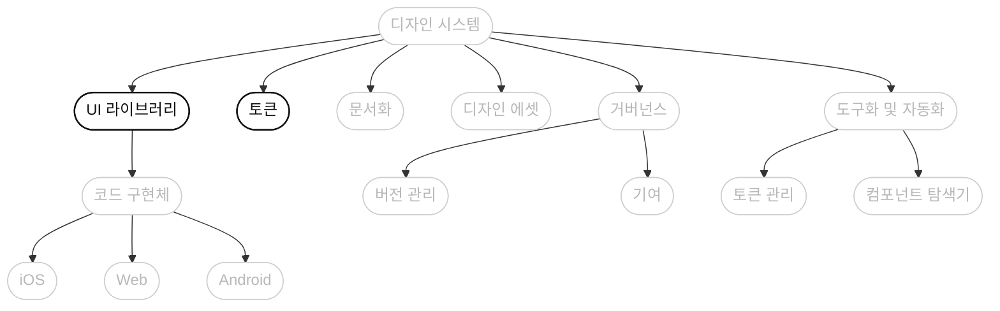
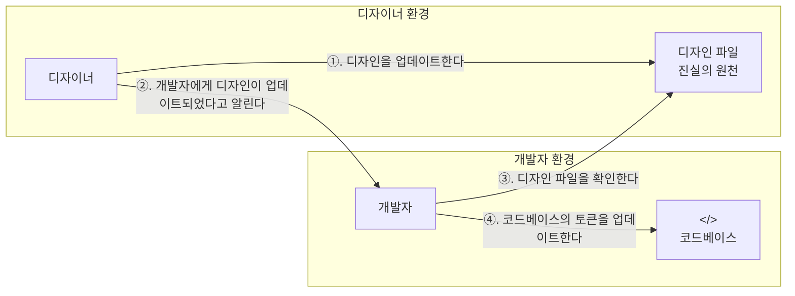
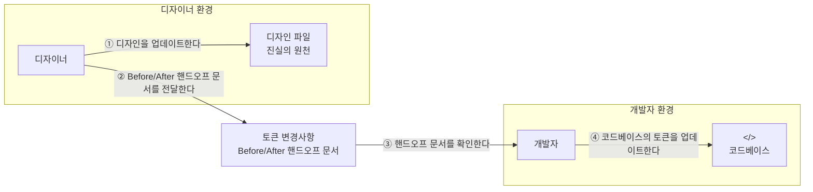
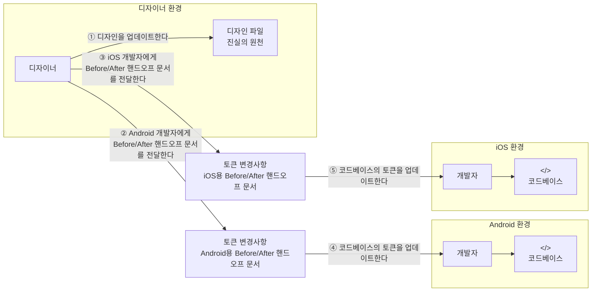
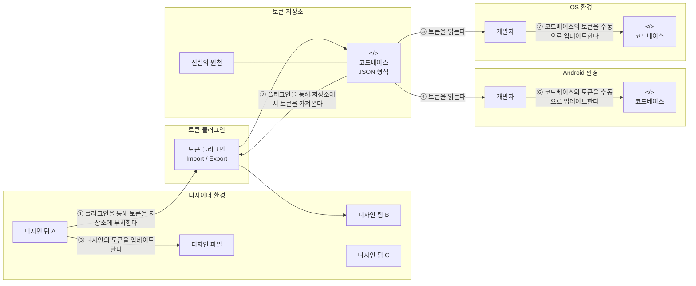
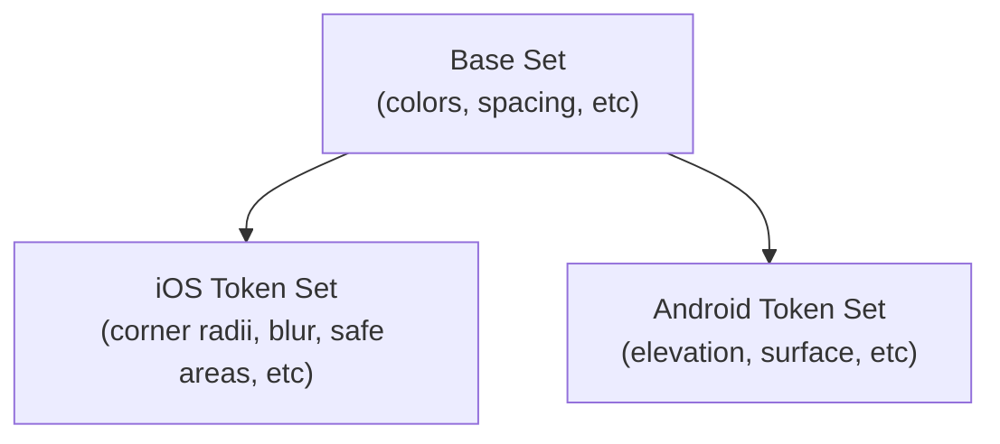
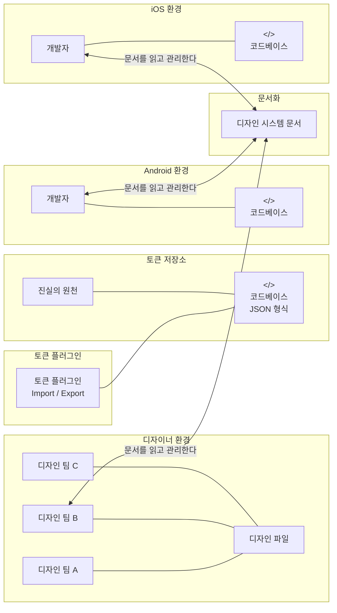
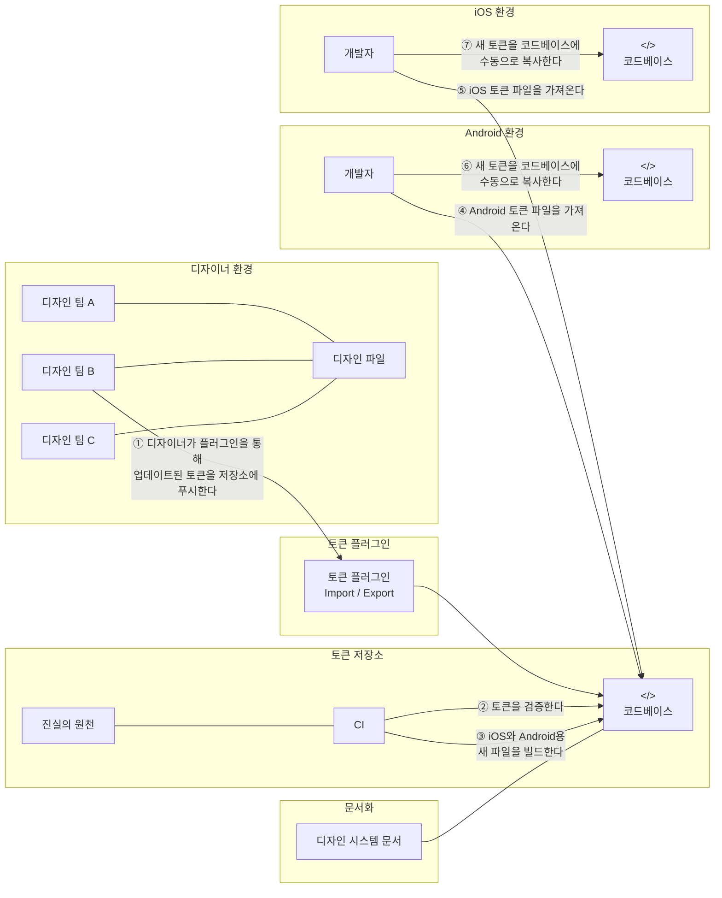
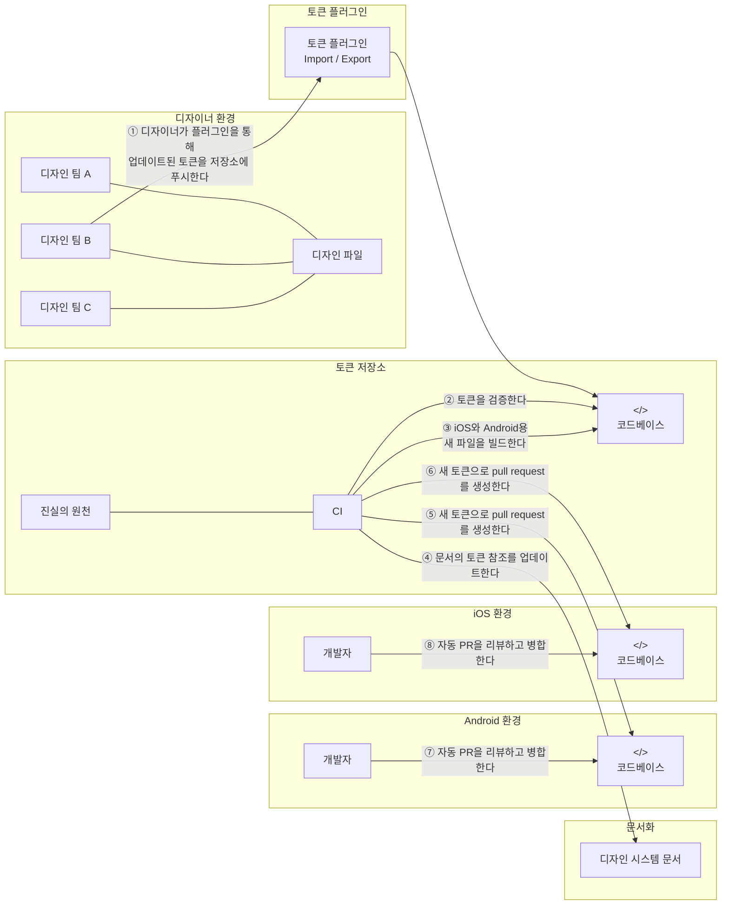

```table-of-contents
```

# 5. From Semantic UI to Design System: Standardizing UI Decisions with Tokens
## Tokens Design System

- Font, Primitive, Semantic Text Style.. 이미 이전 장에서 UI 요소들과 관련하여 너무 많은 이름이 나왔다.
	- 말할 요소가 많아지면서, 의사소통이 오히려 어려워질 수 있다.
- 디자이너와의 대화
	- *Developer*: 우리가 정의한 이 주황 컬러들. 
	- *Designer*: 아 *warning 컬러* 말이죠? *Developer*: 아니 *border 컬러*. 
	- *Designer*: *primary border 컬러*? 
	- *Developer*: 아니 *실제 컬러* `#FCA103`. 
	- *Designer*: 아 *eyedropper*에서 뽑았군요."

- **이를 어떠한 표준 용어로 설명할 수 있으면 아주 좋을 것이다.**
- 보통 이를 **`Token`** 이라고 부른다.
- 토큰은 **디자인을 앱이나 웹사이트 전반에 일관되게 유지하는 데 도움을 주는 명명된 값을 의미**한다.
	- 색상, 간격, 타이포그래피와 같은 핵심 디자인 속성을 담고 있으며, 이를 통해 디자인 시스템 전반에 일관되게 적용할 수 있다.

| 토큰 이름          | 값         |
| -------------- | --------- |
| Primary Color  | `#0057B8` |
| Alert Color    | `#FF5733` |
| Spacing Small  | `8px`     |
| Spacing Medium | `16px`    |
- 디자이너는 피그마에서 토큰을 시각적으로 정의할 수 있다.
	- 모든 버튼이나 배경에 색상을 매번 수동으로 설정하는 대신, 위 표와 같이 이름 있는 스타일을 사용한다.
	- 디자이너가 `Primary Color` 를 업데이트하면, 해당 색상이 적용된 모든 곳에 자동으로 변경사항이 적용된다.

- 요약하면, **토큰은 이름, 구조가 부여된 디자인 결정을 의미**한다.

### Adding tokens
- 사실 우리는 이미 토큰을 사용하고 있다.
- 이미 `Color.primaryBackground`나 `Shadow.large` 같은 이름의 UI 요소를 정의했다.
	- 디자인 결정을 변수로 캡처했으므로, 여태껏 그렇게 부르지 않았더라도 이미 이것은 토큰이다.

- 이전장에서 계속 언급했던 `Primitive`, `Semantic` 개념은 토큰에도 똑같이 적용된다.
	- `Palette.purple` -> `Primitive UI`, `Primitive Token`
	- `Icons.delete` -> `Semantic UI`, `Semantic Token`
		- 어떻게 아이콘이 생겼는지 알려주는 방식이 아니다.
		- 오로지 삭제 동작만을 나타내며, 휴지통에서 X 로 UI가 변경되더라도 그저 토큰 값만 업데이트하면 된다.

### Token vs Design System
- 토큰을 쓴다고 해서 디자인 시스템을 사용한다고 말할 수는 없다.
	- 토큰을 추가하긴 했지만, 여전히 UI 라이브러리의 범주 내에 속한다고 볼 수 있으며 현재는 그저 **개발자의 소유물**일 뿐이다.

- 디자인 시스템과 토큰간의 가장 큰 차이는, 작업 결과물에 대한 소유권을 **개발자, 디자이너가 함께 소유하고 있는 것**이다.
	- 즉, 개발자와 디자이너 모두 토큰에 대한 소유권을 가지고 있어야 한다.

- 디자이너가 토큰이 어떤 값을 나타내고 있는지에 대해서만 정의하는게 아니라, 토큰 이름을 어떻게 붙이고 어떻게 분류하여 그룹화할지도 함께 정의한다는 뜻이다.
	- **더 이상 토큰을 개발자의 판단만으로 결정하지 않는다.**

- 디자인 시스템에서 토큰은 공통 언어가 된다.
	- 양쪽 모두 `Spacing.medium` 이나 `Color.accent` 가 무엇을 의미하는지 서로 합의한다.
	- 디자이너가 값을 수정하거나 새 값을 추가하면, 개발자는 코드 리뷰를 하듯 변경 사항을 검토할 수 있다.

- 우리는 이미 토큰을 사용해왔지만, 목표로 하는 것은 더 구조화되고 협업 친화적인 것이다.
	- 그것이 바로 진정한 디자인 시스템이다.

### Naming Tokens Together
- 토큰 이름을 함께 정하는 것은, 개발자와 디자이너가 같은 언어로 대화할 수 있게 하는 좋은 방법이다.
	- 개발자가 `Card.shadow` 라 부르고 디자이너가 `SurfaceElevation` 이라고 부른다면, 같은 것을 의미하면서도 서로 엇갈린 대화를 할 수 있다.

- 이름 짓기는 항상 같이 하는 것이 좋다.
	- 디자이너는 시각적 요소 뒤에 숨겨진 의도를 가져온다.
	- 개발자는 구조, 코드가 앞으로 어떻게 확장될지 생각한다.

- 토큰의 명명에 정답이 있는 것은 아니다.
	- 목표는 팀 전체가 모두 합의한 의미 있는 이름을 짓는 것이다.
	- 새로운 사람들이 더 빠르게 적응하도록 돕고, 혼란을 줄이며 토큰에 목적성을 부여하는 작업이다.

- 확신이 서지 않으면 다음 기준으로 확인한다.
	- 해당 요소가 **무엇을 의미하는지 설명**하나?
	- 아니면 **어떻게 보이는지만 설명**하나?
	- **좋은 의미의 토큰은 단순한 외형보다는 의도를 설명**한다.

- `<role><type><modifier>` 같은 형식을 기반으로 합의하는 것도 고려할 수 있다.
	- `colorBackgroundHighlighted`
	- `shadowLargeElevated`

- 처음부터 모든 것에 이름을 붙일 필요는 없지만, 디자인 시스템이 성장함에 따라 이름은 계속 함께 맞춰나가야 한다.

### Where and how tokens are defined
- 책을 잘 따라왔다면, 현재 만들거나 사용하고 있는 토큰은 디자이너와 협력하여 정의되었을 것이다.
- 코드에서는 토큰이 UI 라이브러리 안에 존재한다.
- 하지만 디자이너 역시 디자인 파일 안에 동일한 정의를 지니고 있다.

- 이제 다음 단계는 이를 **공식화하는 것**이다.
	- 누가 토큰을 정의하고 보호하는지.
	- 디자인과 코드 중 어떤 것이 기준점인지. (SSOT)
	- 디자인과 개발 사이에서 토큰을 어떻게 동기화할 것인지.

- 이상적으로 토큰은 디자이너, 개발자는 물론 모든 팀원이 접근하고 업데이트할 수 있는 곳에 위치해야 한다.
	- **디자인 도구**
		- Figma나 Sketch처럼 디자이너가 시각 스타일을 정의하고 관리하는 곳.
		- 개발자는 이 값을 직접 참고할 수 있음.
	- **문서화**
		- 합의된 토큰 이름을 참조할 수 있는 기준점.
		- Google 문서, Markdown 형식의 README, 위키 페이지, 호스팅된 스타일 가이드 등이 될 수 있음.
	- **코드**
		- 코드베이스 내에도 위치할 수 있음.
		- 하지만 디자이너가 아무런 마찰없이 해당 값을 변경할 수 있어야 함.
		- 그렇지 않으면 토큰은 다시 "개발자 소유" 가 되어버림.

- **어떤 시스템을 선택하든, 디자이너는 직접 토큰을 언제든 수정할 수 있어야 한다.**



- 코드상에서 토큰은 UI 라이브러리에 존재했지만, 사실 이는 "구현체" 일 뿐이다.
- "**토큰에 대한 정의**"는 보통 디자인 문서에 위치해있기 때문에, UI 라이브러리와 동등한 레벨에 위치하고 있다.
- 즉 "정의" 와 "구현" 에 대한 단절이 존재하는 셈이다.
	- 그렇다면 다음으로는 디자인과 구현 사이에서 **토큰을 어떻게 동기화할 것인지 고민**해보아야 한다.

###  Manually syncing tokens for a single platform
- 핵심 과제는 디자인이 업데이트될 때 개발 역시 모든 변경사항이 반영되어야 한다는 것이다.
- 마찬가지로 개발자가 코드에서 간격을 수정한다면, 그 업데이트가 디자인에 반영된 값과 일치한다고 확신할 수 있어야 한다.

- 가장 단순하고 가벼운 워크플로우는, 역시 수동 업데이트다.
	- 안드로이드, iOS 개발자가 한 명씩 있는 팀에서는 오히려 시작하기에 가장 빠른 방법이다.
	- 대규모 솔루션으로 바로 뛰어들기 전, 작은 팀에서 기초를 이해하고 가는게 나을 수 있다.

### Design as the source of truth, developers sync
- 아주 쉽고 바로 떠오르는 방법은 디자이너가 UI 요소를 업데이트할 때마다 개발자가 알리는 방식이다.



- 이 경우 디자이너는 코드에 대해 전혀 알 필요가 없고, 자기 영역에서 "개발자들이 알아서 잘 반영해주길 바라며" 온전히 맡기면 된다.
- **이 시나리오에서는 디자인 파일이 토큰의 SSOT 가 된다.**
- 개발자들은 코드를 구현할 때 보통 디자인 파일을 파악한 후 작업을 진행하기 때문에, 꽤 실현 가능한 접근처럼 보인다.

- 하지만 **디자인 파일이 어떻게 구성되어야 하는지에 대한 "표준" 이 전혀 존재하지 않는다.** 
	- 즉, 여러 디자이너가 각자 다른 방식으로 디자인 파일을 정리할 수 있다.
	- 이로 인해 **개발자는 디자이너의 파일 정리 상태와 디자이너 개인의 규율에 의존하게 된다.**

- 개발자는 어떤 파일을 사용해야 하는지, 어떤 레이어를 봐야하는지 등 더 많은 것을 질문해야 한다.
	- 또한, 정확히 무엇이 업데이트 되었는지도 수동으로 확인해야 한다.
	- 즉, **올바른 토큰이 무엇인지 개발자 스스로 해석해야 한다.**
- 개발자가 무엇을 변경한다면, 이를 확인시키기 위해 디자이너에게 별도의 빌드를 보여주어야 한다.
	- 어느쪽이든 이 접근 방식은 많은 커뮤니케이션과 반복적인 확인 과정이 들어가야 한다.

- 이런 상황으로 업무를 진행한다면, 디자이너가 도울 수 있는 일은 다음과 같다.
	- 디자인 파일 내에 개발자가 쉽게 찾아 토큰으로 변환 가능한 스타일 목록을 정의한다.
	- 색상 팔레트, 타이포그래피 목록을 담은 별도 디자인 파일이 예로, 이러면 개발자가 토큰으로 변환하기 훨씬 쉬워진다.
- 다만 이렇더라도 무엇이 변경되었는지 비교하기 여전히 어렵다.
	- 이를 극복하기 위해 디자이너는 날짜와 함께 변경 전후를 보여주는 시각적 영역을 만들 수 있다.

### Designer syncs; Code is source of truth
- 디자이너가 디자인 파일에서 토큰을 변경하고, 이것을 직접 코드 내에 적용하는 방법도 있다.
	- 변경 후 PR을 올리면, 개발자가 검토 후 병합하는 방식이다.
- **이 경우 코드가 SSOT가 된다.**
	- 디자인 파일이 일반적으로 토큰을 정의한다는 점을 고려하면, 다소 비정통적 선택이다.
	- 하지만 작은 팀에서는 충분히 작동 가능한 워크플로우다.

- 디자인 파일에 중앙화된 요소들이 있을 수 있어도, 하나의 디자인 토큰을 변경한다고 해서 모든 디자인 파일에 마법처럼 업데이트 되는 것은 아니다.
- 하지만, 코드는 디자인 파일에 비해 좀 더 중앙화되는 경향이 있어 하나의 디자인 요소 코드만 변경하면 알아서 모든 요소에 적용된다.
	- 개발자가 삽질하거나 귀찮아서 연동하지 않은 경우가 아니라면 말이다.

- 이 경우 디자이너가 코드 변경에 대해 두려움을 가질 수 있다.
	- 하지만, 완벽할 필요는 없다.
	- 토큰을 올바르게 업데이트만 했다면, 그 다음 문법 오류는 개발자나 AI 에이전트가 해결할 수 있다.

- 이 방식의 가장 큰 장점은 상황 자체를 매우 단순하게 만든다는 점이다.
	- 그저 코드가 SSOT 가 되고, 디자이너는 그저 토큰을 코드에 넣어두기만 하면 된다.
	- 별도로 "공식 디자인 시스템 문서" 와 같은걸 만들고, 토큰이 변경될 때마다 동기화할 필요가 없다.
	- **즉, 디자이너는 모든 변경사항을 일일이 설명하지 않아도 된다.**

- 단점은 역시 디자이너에게 수동 동기화의 부담을 준다는 것이다.
	- 만약 디자이너가 토큰을 변경한 후 코드에 적용하는 것을 누락한다면, 즉시 동기화가 어긋난다.
	- 또한 디자이너는 코드를 업데이트할 뿐이므로, 업데이트가 뭔가를 깨뜨리는지 확인할 시각적 검증이나 자동 빌드를 받지 못한다.
		- 다만 이 부분은 디자이너가 PR을 올리고 개발자가 리뷰를 하는 방식으로 보완할 수 있다.

### Recognizing the power imbalance between designers and developers
- 디자인 파일, 코드 사이에서 토큰을 동기화 상태로 유지하려면 결국 **협업이 필요**하다.
	- 작은 팀에서는 앞서 언급했던 두 가지 방법 모두 유효하게 작용할 수 있다.

- 하지만, 팀이 커지면 같은 접근 방식이 디자이너와 개발자 사이의 마찰을 만들 수 있다.
	- 디자이너가 디자인을 관리하고, 코드 토큰을 업데이트하고, PR을 올리고 리뷰를 받는 것은 매우 부담스럽다.
	- 개발자가 디자인 파일에서 토큰을 추출하는 것 역시 미묘한 불일치를 초래할 수 있다.
- `margin` 을 조정하거나 토큰 이름을 맞추는 것과 같은 작은 업데이트도 놓치거나 지연될 수 있다.
	- 개발자들이 기능 개발에만 집중하고, 미묘한 시각적 뉘앙스를 잡아내지 못할 수 있기 때문이다.

- 즉, 개발자와 디자이너 모두 과도한 책임으로 인해 좌절할 수 있는 상황인 것이다.
- 하지만, **공동 소유권은 양쪽이 책임을 함께 나눌 때 비로소 작동**한다.

### Using a handoff system
- 지금까지 언급한 접근 방식들은 개발자나 디자이너 어느 한 쪽이 다른 사람의 환경으로 들어가야 한다는 전제를 가지고 있다.
	- **하지만, 조금만 노력하면 모두가 각자의 "세계" 안에 머무르는 방식으로 일할 수 있다.**

- 이를 위해 **디자이너가 개발자를 위해 변경 사항을 명확히 요구하는 `Before and After` 문서를 만들 수 있다.**
	- “`~tertiaryButtonBackground~` hover 상태는 `#4CAF50`였고, 이제는 `#388E3C`입니다.”  
	- “Medium spacing은 이제 12가 아니라 10입니다.”



- 이 방식은 워크플로우를 단순화한다.
	- 디자이너가 약간의 노력만 들이면, 둘 모두 서로의 영역으로 넘어가지 않아도 된다.

- 즉, **디자이너가 토큰 Exporter, 개발자가 토큰 Importer 가 되는 셈**이다.
- 이 접근 방식도 너무 많이 변경사항이 생기는 것이 아니라면 매우 좋은 방법이다.
	- 스프린트마다 한 번, 릴리즈마다 한 번씩 업데이트하는 정도라면 번거롭지 않다.

- 또한 이 시나리오는 어쨌든 디자인이 SSOT 이다.
	- 디자인, 코드가 서로 어긋나면 코드가 디자인을 따라가야 한다.
	- **핸드오프 문서는 SSOT 가 아니라 그저 커뮤니케이션용 도구**다.

- 이 방법의 또 다른 장점은 토큰의 결정이 여전히 공유된다는 점이다.
	- 디자이너가 개발자에게 토큰을 새롭게 만들라고 강요하지 않는다.
	- 그저 `modalOverlayBackground` 와 `navigationBarShadow` 같은 새로운 토큰을 제안하는 것이다.
		- 기존 시스템에 잘 맞게 동작할지는 개발자가 정할 수 있다.

- 핸드오프 기반 워크플로우에서 개발자는 단순히 구현만 하는 사람이 아니라, **디자인 시스템의 일관성과 수명에 기여하는 사람**이다.
- **핸드오프 문서는 명세서가 아닌, 제안서처럼 다뤄져야 한다.**
	- 코드를 확정하기 전, 양쪽이 의미를 맞추는 공유된 공간이다.

### Conclusion
- 디자인 시스템이라는 단어를 들으면 흔히 "대규모" "플러그인" 과 같은 단어를 떠올린다.
- 하지만 이 장에서 언급했듯 단순한 워크플로우로도 꽤 멀리 나아갈 수 있다.
- **디자인 시스템의 목표는 도구를 구축하는 것이 아니다.**

- **여러 팀 사이에 공유된 동기화 상태와 워크플로우를 만들어 구조화된 방식으로 일하도록 돕는 것**이다.
	- UI에 일관성이 생기고, 팀은 확장에 더 잘 대비할 수 있게 된다.

---

# 6. Design System at Scale: Token Workflows Across Platforms and Teams
- 이전 장에서는 iOS, Android 와 같은 단일 플랫폼에서 디자인과 토큰을 동기화하기 위한 수동 워크플로우를 살펴보았다.
- 이번에는 규모를 키워, **여러 플랫폼이 같은 디자인을 결정할 때**를 다룬다.

## Manually syncing tokens across multiple platforms


- 우선 이전 장에서 다뤘었던, 여러 플랫폼에 토큰을 수동으로 동기화하는 방법이다.
	- 디자이너가 모바일 엔지니어에게 변경 사항을 전달해주면, 기반으로 모든 토큰 값을 업데이트한다.
	- 가끔 발생하는 변경에는 매우 유용하다.

- 멀티 플랫폼 상황에서는 디자이너가 동일하거나 비슷한 핸드오프 문서를 여러 팀에게 보낼 수 있다.



- 변경이 잦지 않은 작은 팀에서는 괜찮지만, 금방 번거로워지고 추적하기 어려워진다.
	- 여러 핸드오프 문서를 동기화 상태로 유지하기 위해 필요한 모든 커뮤니케이션 비용이 디자이너에게 쏠린다.
- 핸드오프를 공유하는 방식은 임시 변경 대응에는 좋지만, 확장성이 매우 좋지 않다.
	- 큰 조직에서는 여기저기 오가는 10,000개의 파일 중 하나가 되어 슬랙 메시지, 컨플루언스 페이지 속에서 묻혀버린다.

- 토큰을 중앙화된 장소로 이동시켜 워크플로우를 한 단계 발전시켜야 한다.

## Introducing a token repository
- 디자인 시스템 초기 단계에서는 디자인 파일을 기반으로 개발자가 수동으로 업데이트 하는 방식이 흔하다.
- 하지만 시스템이 커지면 플랫폼 간 토큰이 서로 어긋난다.
	- 이를 **토큰 드리프트**라고 부른다.
	- 토큰 이름이 명확하지 않게 바뀌고, 표준화된 프로세스가 없어 업데이트가 기억에 의존하게 된다.

- 이 지점에서 **"중앙 토큰 저장소"** 가 필수적으로 요구된다.
	- 토큰을 구조화하고, 버전 관리하는 장소를 의미하며, 일반적으로 Git 레파지토리이다.
	- `JSON` 과 같이 플랫폼에 종속되지 않는 형식으로 토큰을 저장한다.
	- **디자인, 개발팀 전체를 아우르는 SSOT 가 된다.**

- 디자인 파일과 달리 토큰 저장소는 다음 기능들을 제공한다.
	- 버전 이력과 추적 가능성
	- 검증과 네이밍 강제
	- 자동화 기회, 예를 들어 iOS, Android, 웹 출력 생성
	- 디자인과 엔지니어링 사이의 더 나은 협업
	- 제품과 플랫폼 전반으로 디자인 시스템을 확장하기 위한 기반

- 토큰 저장소의 도입은 큰 전환점이 된다.
	- 시스템이 시각 중심 수동 방식에서 점점 자동화 기능을 첨부한 방식으로 변하기 때문이다.

### A token repository workflow
- 여러 플랫폼을 지원하기 위해선, **토큰을 플랫폼에 종속되지 않는 공유 형식으로 변환**해야 한다.
- 이 때 가장 일반적인 선택이 `JSON` 이다.
	- 디자인 도구, 토큰 플러그인, 자동화 스크립트가 `JSON` 을 지원한다.
	- 또한 읽기 쉽고 플랫폼 종속적이지 않다.

- 디자이너는 토큰을 디자인 파일에만 두는 대신, 구조화된 `JSON` 형식으로 내보내 저장소에 보관한다.
- 그럼 개발자들은 이 토큰을 가져와 각자 코드 베이스에 업데이트한다.




- **이제 토큰 저장소가 SSOT 가 되었다는 사실에 주목하자.**
	- 여전히 대부분은 수동 접근 방식이다.
	- 하지만 이 가벼운 접근 방식은 복잡한 도구를 요구하지 않으면서도 팀에 구조를 제공한다.

- 일단 토큰 저장소가 마련되면, 검증, 문서화, 자동화를 추가하기가 더 쉬워진다.
	- 작업에 도움을 주는 플러그인으로는 `Style Dictionary`, `Tokens Studio`  가 있다.

- 토큰 저장소와 관련된 주의점은, 디자이너가 토큰을 내보내는 것 외에 토큰을 가져오기도 해야한다는 것이다.
	- **디자이너는 Figma 를 토큰 저장소와 동기화된 상태로 유지해야 한다.**
	- 플러그인을 활용하면 토큰을 Figma 로 다시 가져올 수 있게 해준다.
	- 이를 통해 디자인 도구가 최신 값과 시각적으로 일관된 상태를 유지하도록 보장한다.

- 또 다른 장점은 **버전 관리**다.
	- 토큰이 디자인 도구안에만 있을 땐 변경 사항을 알 수 없다.
	- 하지만 토큰 저장소를 활용하면, `Git` 안에 위치해 있어 모든 변경 사항을 추적할 수 있다.
	- 아직 자동화가 없어도 이것만으로 구조, 안정성, 명확성이 보장된다.

### What token JSON files look like
- 토큰은 일반적으로 값들을 카테고리와 목적별로 묶은 `JSON` 구조에 저장한다.

```json
{
  "color": {
    "background": {
      "primary": "#007AFF",
      "secondary": "#F2F2F7"
    },
    "text": {
      "primary": "#000000",
      "secondary": "#666666"
    }
  },
  "spacing": {
    "small": "8",
    "medium": "16",
    "large": "24"
  },
  "font": {
    "header": {
      "size": "20",
      "weight": "regular"
    },
    "body": {
      "size": "16",
      "weight": "light"
    }
  }
}
```

- 플랫폼별 문법, 타입을 가정하지 않으므로 크로스 플랫폼이다.
- 나중엔 자동화 도구를 통해 해당 `JSON` 을 플랫폼별 출력으로도 변환할 수 있다.
	- 안드로이드 XML, iOS용 Swift 등으로.

### Token aliasing
- `JSON` 파일에서는 `color.background.primary` 같은 시맨틱 토큰 이름을 사용하고, 이를 `#007AFF` 같은 원시 값에 직접 연결한다. 
	- 특히 중앙 JSON 파일을 사용하고 단순하게 유지하려는 경우에는 괜찮은 설정이다.

- 다만 이름에 의미를 더해 별칭을 지정하고 싶다면, 다음과 같이 정의할 수 있다.

```json
{
  "color": {
    "grey": {
      "light": { "value": "#cccccc" }
    },
    "background": {
      "value": "{color.grey.light}"
    }
  }
}
```

- 여기서 `color.background`는 별칭으로 정의되어 있으며, `color.grey.light`를 참조한다.
- **조금 복잡해지지만, 더 많은 유연성을 제공할 수 있다.**
	- 배경엔 밝은 회색을 사용한다는 디자이너의 결정과, 실제 값, 즉 "정확히 어떤 밝은 회색인가?" 를 서로 분리할 수 있기 때문이다.
	- 회색값을 업데이트하고 싶다면, 한 번만 업데이트하면 된다.

- **이 방식은 추후 테마를 위한 기반이 된다.**
	- 한 곳에서 배경을 오버라이딩하면, 이를 참조한 모든 토큰이 함께 적용된다.
	- 시스템이 커질수록 매우 유용해지는 방식으로, 처음은 아니더라도 나중엔 고려해볼만 하다.

## Sharing tokens between platforms
- 토큰의 중앙화는 UI 워크플로우를 확장하기 위한 훌륭한 첫 단계다.
- 그러나 중앙화된 토큰을 `JSON` 형식으로 사용하기 전, 모든 토큰 이름을 맞춰야 한다.

- 안드로이드에서는 `groupSpacing`, iOS에서는 `sectionPadding` 등으로 자신만의 이름을 정의해버리면, 그 토큰들은 그저 각 플랫폼 안에서만 도움을 줄 뿐이다.
- 공유된 토큰명이 없으면 디자인 업데이트를 조율하기 더 어려워진다.
	- 예를 들어, 디자이너가 "더 여유로운 공간감을 주기 위해 `Spacing.large` 를 늘렸어요." 라고 말하면,
	- 각 플랫폼에선 그 개념이 로컬에서 무엇으로 불리는지 일일이 다 찾아야 한다.
	- **그렇게 하더라도 모두가 같은 것을 이야기하고 있는지 명확하지 않다.**
	- **또한, `JSON` 파일에서도 그 이름들을 공유할 수 없다는 것이 매우 치명적이다.**

- 그러니 사전에 네이밍을 반드시 맞춰두어야 한다.

### Disconnect token names from values
- 결국 안드로이드, iOS가 모든 것을 공유할순 없다.
	- 이 상황을 어떻게 타개해야 할까.

- 토큰 이름은 공유된 디자인 의도를 나타낸다.
	- 즉, `Font.headder` 는 "이것이 우리의 메인 헤더 스타일이다." 라고 말해주는 것이다.
	- 하지만 해당 값은 각 플랫폼마다 다를 수 있다.
		- iOS: `size 20`, `weight regular`
		- Android: `size 18`, `weight bold`
	- 토큰 이름을 참조하면, 각 플랫폼을 목적을 맞추면서도 자신에게 맞는 네이티브 값을 사용할 수 있다.

- 너무 좋은 아이디어지만, 한 가지 문제가 있다.
	- `JSON` 파일은 두 플랫폼이 같은 값을 공유하도록 강제한다는 것이다.

```json
{
  // ... 나머지는 생략
  "spacing": {
    "small": "8",
    "medium": "16",
    "large": "24"
  }
}
```

- 안드로이드의 `medium spacing` 이 16이 아니라 20이어야 한다면, 위와 같은 `JSON` 정의로는 표현이 불가하다.

### Platform-specific overrides
- 이 지점에서 플랫폼별 오버라이드와 확장을 고려해야 한다.

```
tokens/
  |- base.json      # 공유 기본값
  |- ios.json       # iOS 전용 값
  |- android.json   # Android 전용 값
```

- 위와 같은 방식으로, 각 플랫폼 별 값을 분리하는 방식을 고려해보자.

```json
{
  "spacing": {
    "medium": { "value": "20" }
  }
}
```

- 위와 같이, `android.json` 안에 값을 정의하여 오버라이드할 수 있다.

- 이러한 구조만으로 공유 토큰을 깔끔하고 **플랫폼 중립적으로 유지**할 수 있다.
- 동시에 각 팀이 자신들의 오버라이드를 독립적으로 관리할 수 있게 해준다.
	- 관심사를 분리하고, 향후 자동화를 위한 기반 또한 마련한다.

### Platform-specific extensions
- 오버라이드 방식을 통해 플랫폼 간 차이를 만들었지만, 여전히 두 플랫폼이 모든 토큰을 공유한다고 가정한다.

- 하지만, 어떤 토큰은 "특정 플랫폼" 에서만 의미있는 경우가 있다.
	- 안드로이드에선 깊이감의 표현을 위해 `Elevation.low` 토큰을 사용할 수 있지만, iOS에선 낯선 개념이다.
	- iOS에서 `Corner.radius.small` 토큰을 원해도, 안드로이드는 `Shape` 를 사용하기에 이 또한 낯선 개념이다.

- 이런 것들을 모두 한 토큰 세트에 넣으면 네임스페이스를 오염시킨다.
- 하지만 플랫폼별 파일을 정의했으니, 토큰도 플랫폼별로 확장할 수 있다.



```json
{
  "spacing": {
    "medium": { "value": "20" }
  },
  "elevation": {
    "low": { "value": "2" },
    "medium": { "value": "8" }
  }
}
```

- 위와 같이 안드로이드 전용 확장인 `elevation` 을 추가하는 방식으로 대응할 수 있다.
	- `base.json` 에 포함되지 않지만, 그래도 상관없다.

- 플랫폼 토큰파일을 통해 단순한 오버라이드뿐 아니라, 확장까지 할 수 있다.
	- 중요한 부분은 통일하되, 확장을 통해 시스템을 유연하게 유지할 수 있다.

## Introducing documentation
- 토큰이 공유 저장소에 들어갔다면, 그 다음 과제는 명확성이다.
	- **이제 모두가 토큰을 이해할 수 있게 만들어야 한다.**
	- `spacing.medium`, `color.sruface` 는 언제 어디에 어떻게 쓰이는가?

- 디자인 결정 뒤에 있는 **"왜"** 를 모두가 이해할 수 있도록 문서화를 도입해보자.



- 그렇다면 문서는 어디에 있어야 할까?
	- 초기 단계에서 문서화가 화려할 필요는 없다.
	- 가장 중요한 것은 찾기 쉬워야 한다는 점이다.

- 보통 다음 방식으로 시작한다.
	- 토큰 내부 마크다운 파일, `Tokens.md`
	- 디자인 시스템 내 링크되는 노션이나 컨플루언스 페이지
	- 공유 Google Doc 혹은 사내 위키

- **중요한 것은 모두가 문서가 어디 있는지 알고, 문서가 최신 상태로 유지되는 것**이다.

- 문서는 디자이너, 개발자 모두 기여할 수 있다.
	- 디자이너는 토큰이 어떻게 동작하고 어떻게 사용되어야 하는지를 바탕으로 초안을 작성한다.
	- 개발자는 세부 사항을 추가하고, 혼란스러운 이름을 언급하거나 플랫폼별 동작을 기록한다.
- **질문을 가장 많이 받거나 혼란을 일으키는 토큰부터 문서화를 시작**한다.

### What to include in token documentation
- 좋은 토큰 문서는 각 토큰의 목적과 사용법을 명확히 설명하는 문서다.
	- 목적은 "라이트 모드의 기본 배경", 사용법은 "오버레이가 아닌 메인 컨텐츠 영역" 처럼 적을 수 있다.

- 시각적 예시는 문서를 훨씬 더 유용하게 만든다.
	- 스크린샷, 목업을 통해 실제 토큰이 실제 맥락에서 어떻게 쓰이는지 보여주는게 좋다.
- 토큰 변경시에는 전후 예시도 포함한다.
	- 실제 UI 예시는 이론적 설명보다 사용패턴을 이해하는데 훨씬 더 도움된다.

- 예시는 다음과 같다.
 `## color.background.primary`
**Value:** #FFFFFF (light mode), #000000 (dark mode)
**Purpose:** Main background for content areas
**Use for:** Screen backgrounds, card backgrounds, modal backdrops
**Don't use for:** Text, borders, or button backgrounds
**Platform notes:** iOS uses this for navigation bars, Android uses surface colors instead

## Lightweight automation
- 토큰을 중앙 저장소에 관리하고, 버전을 관리하며 플랫폼 간 공유하는 단계까지 왔다.
- 이제는 토큰을 사용하는 데 필요한 수동 작업을 줄여보자.

- 다만 자동화 추진 전 한가지 생각해볼 점이 있다.
> **토큰 동기화가 정말 문제로 다가오나?**
- 업데이트는 얼마나 발생하는가? 일부 토큰이 즉시 동기화되지 않으면 얼마나 문제가 되는가?
- iOS와 안드로이드가 완벽히 동기화되지 않는 것이 정말 큰 문제인가?

- 자동화를 고려할 만한 시점은 다음과 같다.
	- 토큰 업데이트가 자주 발생한다. 매주 또는 그 이상
	- 수동 복사가 정기적인 실수나 지연으로 이어진다
	- 여러 플랫폼이 긴밀하게 동기화되어 있어야 한다
	- 토큰 업데이트를 둘러싼 팀 간 조율이 부담스러워진다

- 중요한 것은 실용적으로 접근하는 것이다.
	- 자동화 투자 전, 동기화가 실제로 고통을 주는 지점이 되어야 한다.
	- 토큰을 수동 업데이트하는 것보다 자동화와 복잡성을 유지하는 것이 더 큰 비용이 될 우려가 있다.

### Adding token validation
- 자동화가 필요하다고 판단하더라도 완전한 솔루션으로 시작할 필요는 없다.
	- 플랫폼 간 토큰 파일 복사, `JSON` 코드 수동 변환과 같이 작고 실용적 개선부터 시작하자.

- 첫 단계는 **검증이다**.
	- 빌드 스크립트를 활용하여 중복 이름이나 타입 미스매치와 같은 일반적 문제를 확인한다.
	- CI를 통해 PR 등록 시 자동으로 실행하게끔 구현할 수 있다.
	- 검증만으로도 버그를 줄이고, 커뮤니케이션을 개선하며, 개발자들에게 토큰에 대한 확신을 줄 수 있다.

### Generating platform-specific files
- 두 번째로 변환이다.
	- iOS - `JSON` -> `Swift`
	- Android - `JSON` -> `Kotlin Compose`
	- Web - `JSON` -> `CSS`

```json
{
  "color": {
    "background": {
      "primary": "#007AFF"
    }
  }
}
```
```swift
struct Colors {
    static let backgroundPrimary = UIColor(hex: "#007AFF")
}
```

- 이제 출력물이 휴먼 에러의 위험을 최소화하면서, 일관적이고 반복 가능한 방식으로 생성된다.

### Updated workflow


- 현재까지의 워크플로우는 위와 같다.
	- 검증을 통해 문제가 코드에 도달하기 전 오류를 잡아낸다.
	- 자동 변환을 통해 모든 플랫폼이 안정적으로 토큰 코드를 뽑아낸다.

- 현 워크플로우의 가장 큰 장점은 토큰 시스템 자체에 대해 모두가 신뢰할 수 있게 된다는 것이다.
	- 토큰 파일이 일관되게 검증되고 생성되면 개발자는 그 파일을 당연히 신뢰한다.
	- 디자이너 역시 자신의 변경사항이 여러 플랫폼에 정확하게 반영되는 것을 보며 신뢰도가 올라간다.

- **이 신뢰와 믿음은 다음 단계인 완전한 자동화의 발판이 된다.**

### Manual distribution (For now)
- 아직 완전한 자동화는 아니다.
	- 출력된 `Swift` 파일을 iOS 프로젝트에 복사하는 한계가 남아있다.

- 한계처럼 보이지만, 사실 자동화를 막 시작하는 팀에겐 큰 장점이다.
	- 토큰 업데이트를 언제 적용할지 개발자가 제어할 수 있다.
	- 또한 저장소 간 자동화의 복잡성을 피할 수 있다.

- 팀은 일관된 생성, 검증의 이점을 누리면서도 변경사항을 언제 적용할지에 대한 유연성을 유지할 수 있다.

### Fully integrated automation
- 이제 완전한 자동화를 구축해보자.
	- 이 때는 시스템이 토큰 파일 생성에서 멈추지 않는다.
	- 다운스트림 코드베이스로 업데이트를 계속 푸쉬한다.
	- 즉, 토큰 변경이 디자인에서 프로덕션까지 자동으로 흘러가는 End-to-End 워크플로우가 구축된다.

- 크게 두 가지로 구현 가능하다.
	- **CI가 iOS, Android 또는 웹 저장소에 pull request를 연다.** 
	- **CI가 디자인 토큰 패키지를 배포한다.** 모듈 릴리스처럼 저장되고, 앱 팀이 이를 가져다 사용하는 방식이다.

- 이제 개발자는 파일을 수동으로 복사할 필요가 없어진다.

### Opening pull requests automatically
- 가장 일반적 접근 방식은 CI가 각 플랫폼 저장소에 PR을 열도록 만드는 것이다.

- 누군가 중앙 저장소에서 토큰을 업데이트하면, CI 시스템은 다음을 수행한다.
	1. 플랫폼별 파일을 생성한다.
	2. 각 대상 저장소를 클론한다. 예: iOS, Android, web
	3. 업데이트된 토큰 파일로 새 브랜치를 만든다.
	4. 설명이 포함된 제목과 변경 로그를 넣어 pull request를 연다.
	5. 관련 팀에 리뷰를 요청한다.

- PR 은 대강 다음과 같은 모습이다.
```markdown
# Token Update: v2.4.0

## Changes
- Updated `color.background.secondary` from #F2F2F7 to #F5F5F5
- Added new `spacing.xs` token (4px)
- Removed deprecated `color.legacy.blue`

## Generated Files
- Colors.swift (iOS)
- colors.xml (Android)
- tokens.css (web)

## Review Notes
- Test the background color change in Settings screens
- Verify xs spacing doesn't break compact layouts
```

### Publishing as packages
- 또 다른 접근 방식으로는 앱 팀이 쓸 수 있도록 토큰을 패키지로 배포하는 전략이다.
- CI가 모듈 패키지를 배포하며, `Semantic Versioning` 을 통해 버전을 관리한다.

- 단일 플랫폼에서 여러 앱이 같은 디자인 시스템을 공유해야 하는 경우 훌륭하게 동작한다.
- 디자인 팀과 개발자 팀의 거리가 먼 경우에도 채택 가능하다.

### Documentation as part of the pipeline
- CI가 문서 내의 토큰 목록이나 참조도 업데이트할 수 있다.
	- **즉, 문서가 최신 토큰 버전과 완전히 동기화된 상태를 유지하는 것이다.**

- 문서에는 다음 내용이 포함될 수 있다.
	- 무엇이 왜 바뀌었는지 설명하는 **변경 로그 항목**
	- 더 이상 사용되지 않거나 이름이 바뀌었거나 제거된 토큰 목록인 **지원 중단 및 breaking change**
	- 토큰이 실제로 사용되는 모습을 보여주는 **인터랙티브 예시**


### The complete automated workflow
- 완전 통합 시스템은 다음과 같이 동작한다.



1. **디자이너가 중앙 저장소에서 토큰을 업데이트한다.**
2. **CI 검증이 pull request에서 자동으로 실행된다.**
3. **병합되면**, CI 시스템이 작동하기 시작한다.
    - 플랫폼별 파일을 생성한다. 예: iOS Swift, Android XML, CSS
    - 문서를 자동으로 업데이트한다.
    - 다운스트림 앱 저장소에 pull request를 생성한다.
    - 또는 업데이트된 패키지를 레지스트리에 배포한다.
4. **플랫폼 팀이 생성된 pull request를 리뷰한다.**
5. **승인되면**, 토큰 업데이트가 프로덕션에 반영된다.

- 이정도로 자동화를 구축하면 수동 오류를 제거하고, 조율 부담을 줄이며 잦은 업데이트에서도 신뢰를 지닐 수 있게 된다.
- 모든 플랫폼이 동시에 업데이트를 받기 때문에, 모든 변경사항을 추적하고 리뷰할 수 있게 되면서도 빠르게 반복 작업을 수행할 수 있다.

- 다만 이런 완전 자동화에는 더 많은 초기 설정과 지속적 유지보수가 요구된다.
- 여러 플랫폼과 제품 전반에서 디자인 시스템을 관리하는 팀이라면, 그 트레이드비용이 금방 회수될 것이다.

### Should web and mobile share tokens?
- 모바일 플랫폼들은 공유 토큰의 이점을 얻을만한 공통 기반을 가지고 있다.
	- 네비게이션 패턴이라던가, 터치 상호작용을 처리한다던가, 비교 가능한 화면 제약 안에서 동작한다.

- 웹은 모바일과 브랜드 색상정도는 공유할 수 있지만, 그 이상의 유사성을 보장하긴 힘들다.
	- 모바일은 네비게이션 바, 탭 바나 스와이프 제스처를 사용한다.
	- 웹은 네비게이션 메뉴, 사이드바, 마우스 상호작용을 사용한다.

- 타이포그래피도 다르다.
	- 모바일은 더 크고 터치 친화적인 텍스트를 사용하고, 보통 4개 ~ 8개정도의 텍스트 크기만 필요하다.
	- 웹은 더 작은 텍스트를 사용하며, 긴 형식의 컨텐츠를 위해 복잡한 계층이 요구된다.

- 이런 차이를 살펴볼수록 웹, 모바일은 서로 다른 디자인 문제를 해결한다는 점이 더 명확해진다.
	- 같은 토큰 시스템에 억지로 넣으면, 해결하는 문제보다 더 많은 복잡성을 만들 수 있다.

- 그래서 웹, 모바일이 무엇을 공유할 수 있는지 검토하는게 중요하다.
	- 겹치는 부분이 없다면 그냥 별도의 토큰 세트를 두는게 낫다.

- 중요한 것은 둘이 토큰 세트를 공유하지 않아도, **모든 플랫폼이 같은 토큰 저장소를 공유하는 것이 여전히 가능하다는 것이다.**
	- 플랫폼별로 CI를 다르게 돌리기만 하면 된다.
	- 단, 웹과 모바일이 각자의 토큰 `JSON` 파일을 가지게만 만들면 된다.
