# Deciding When, What, and How to Modularize

- 소규모의 팀이고 기능이 적을 때는 모놀리식 구조로도 잘 돌아간다.
- 인지부하도 적고, 기능을 업데이트할 때도 모든 것이 찾기 쉽다.
- 따로 모듈을 두고, 패키지 매니저를 만들고, 접근 지정자를 지정할 필요가 없다.

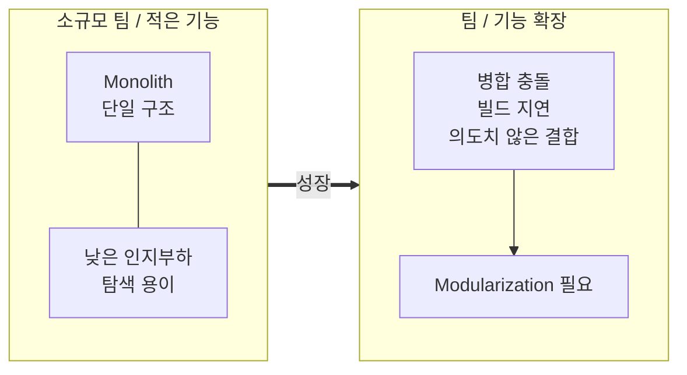

### 도메인 발견 단계에서의 이점

- 개발을 하다보면 우리는 단순히 도메인들이 어떻게 상호작용해야 하는지 배우는 것을 넘어, 초기에 우리가 설정했던 도메인 개념 자체가 과연 맞았는지를 끊임없이 검증하고 수정해 나간다.
- 모놀리스 구조일 때는 모듈 경계를 넘나드는 변경 사항을 조율할 필요없이, 다양한 도메인 개념을 시도해 보고, 전체 접근 방식을 갚아엎는 대규모 리팩토링을 감행하며, 최적의 비즈니스 모델을 찾아낼 수 있다.

### 섣부른 아키텍처 결정 방지

- 모듈화는 문제를 온전히 이해하기도 전에 무엇이 무엇과 묶여야 하는가를 미리 결정하도록 강제한다.
- 모놀리스 환경에서는 문제를 파악하고 수정하기가 훨씬 쉽다.
- 내 코드에 딱 맞는 올바른 모듈 경계를 찾는 가장 좋은 방법은 모놀리스 환경에서 충분히 실험해 보는 것이다.

### 반론: 처음부터 모듈로 시작하는 것이 유효할 때

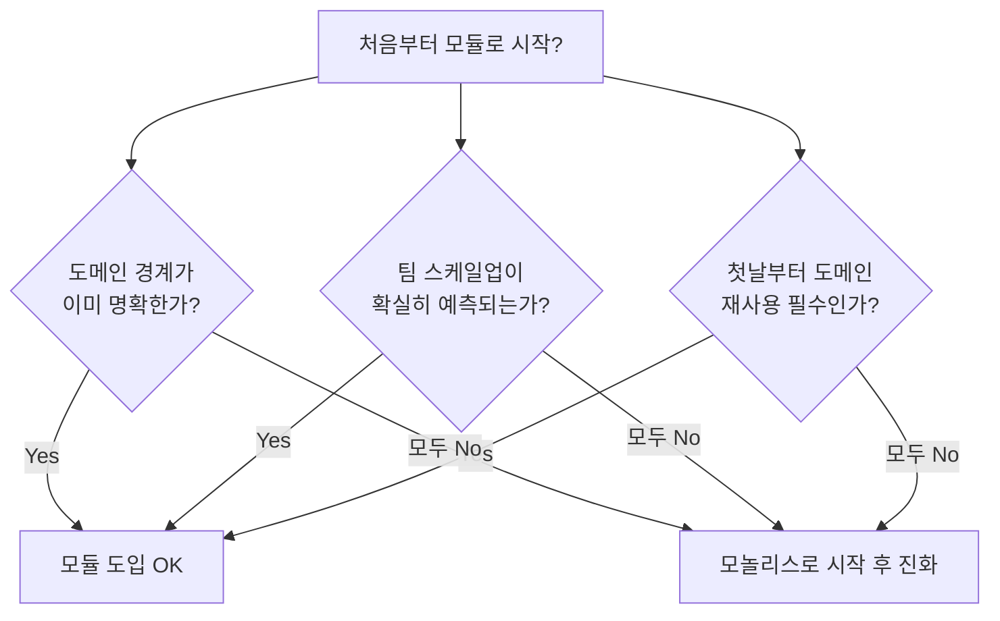

#### 도메인의 경계가 완벽하게 이해되었을 때

- 나누고자 하는 도메인의 경계선이 확실하고, 초반부터 훌륭한 아키텍처 결정을 내릴 수 있는 경험과 데이터가 충분하다면 처음부터 모듈을 도입해도 된다.
- 기존에 운영하던 애플리케이션을 새롭게 만들거나, 핵심 기능이 확실한 서비스를 만들 때 이미 도메인의 경계선이 명확하고, 요구사항도 예측 가능하다.

#### 팀의 스케일업 속도가 정확히 예측될 때

- 팀의 규모가 폭발적으로 커질 거라는 게 예측된다면, 처음부터 모듈형으로 시작하는 것이 소통 지옥을 방지하는 데 도움이 된다.
- 모듈 경계는 분산된 팀들이 서로의 코드를 건드리지 않고 독립적으로 개발할 수 있는 자연스러운 협업 포인트를 제공해준다.

#### 첫날부터 도메인의 재사용이 필수적일 때

- 멀티 앱이나 여러 개의 빌드 타겟을 동시에 지원해야 하는 비즈니스 요구사항이 있다면, 모듈화는 필수적이다.
- 모듈이 의미있는 상황:
    - 도메인이 완벽하게 이해되었을 때
    - 팀 성장이 확실하게 예측될 때
    - 즉각적인 코드 재사용 요구사항이 있을 때

### 팀 확장 통증: 커뮤니케이션과 개발 속도가 늪에 빠지다

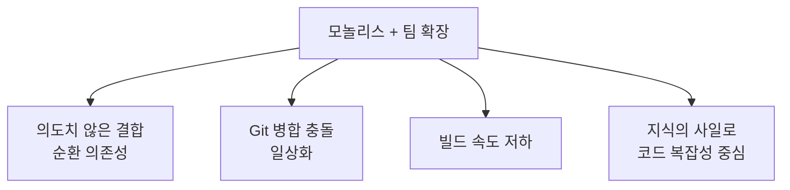

- 팀원들 간의 커뮤니케이션 복잡도는 팀 규모가 커짐에 따라 기하급수적으로 폭발한다.

#### 의도치 않은 결합

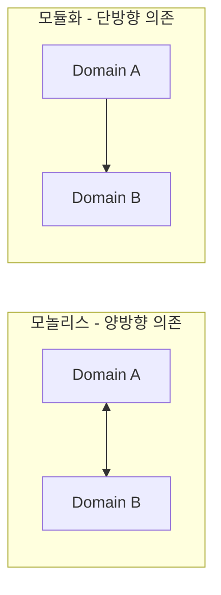

- 도메인 간의 의도치 않은 결합은 처음에는 개발 편의성을 제공해주지만 나중에는 이를 되돌리기 위해 어마어마한 비용을 치러야 하는 거대한 아키텍처적 부채가 되어 돌아온다.
- 계속해서 편의성을 추구하다 보면 서로 다른 도메인이 서로를 의존하는 순환 의존성에 갇히게 된다.
- 의존성이 양방향이 되고 통제 한계를 벗어난다는 점이 문제이다.
- 모듈화를 도입하면 기본적으로 단방향으로 흐르게 강제하기 때문에 시스템적으로 단단해진다.

#### 깃 병합 충돌의 일상화

- 수많은 개발자가 동시에 파일들을 수정하다 보면 깃 충돌이 발생할 확률이 기하급수적으로 높아진다.
- 이러한 충돌은 내가 전혀 모르는 팀 동료가 수정해 둔 복잡한 코드까지 이해해야 해결할 수 있게 한다.
- 모듈화를 하더라도 코드는 공유되지만, 공유 코드를 수정하는 비용이 높아서 이를 꺼리게 되고, 병합 충돌의 횟수가 극적으로 감소한다.

#### 빌드 속도의 저하

- 프로젝트 규모가 커진 모놀리스 앱에서는 코드를 몇 줄 고치고 빌드를 누르더라도 빌드 시간이 오래 걸린다.
- 만약 독립된 모듈로 떼어내어 작업하면, 코드를 고쳤을 때 해당 모듈만 다시 빌드하면 된다.
- 독립된 모듈 안에서는 테스트 코드도 빠르게 실행되므로, 모놀리스에서 테스트 코드를 짤 때의 시간에 따른 저항감을 줄여준다.

#### 지식의 사일로가 의도치 않게 형성됨

- 비즈니스가 커질 때 사일로 자체가 생기는 것 자체는 나쁜 것이 아님
- 하지만 모놀리스 안에서는 사일로가 소유권과 전문성 중심이 아니라, 엉망진창으로 꼬여버린 코드의 무시무시한 복잡성을 중심으로 기괴하게 형성됨
- 한 흐름에 여러 개의 쌩뚱맞은 파일이 섞여 있기 때문에 오직 전임자만이 건드릴 수 있는 코드가 됨

### 모듈로의 전환

#### 우리가 말하는 모듈의 진짜 정의

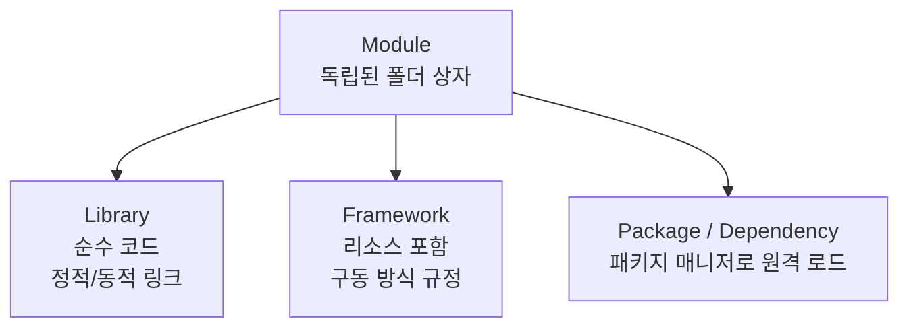

- 모듈은 소스 파일들과 폴더들이 담긴 독립된 하나의 폴더 상자
    - 라이브러리: 순수 코드로만 이루어져 정적/동적으로 링크되는 모듈
    - 프레임워크: 이미지나 다국어 번역 파일 같은 리소스를 포함하거나, Jetpack Compose처럼 아예 구동 방식을 규정하는 거대한 모듈
    - 패키지/의존성: 패키지 매니저를 통해 원격으로 불러오는 모듈

#### 배포 방식의 차이: 로컬 vs 원격

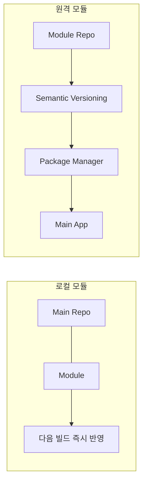

- 로컬 모듈
    - 메인 앱과 동일한 프로젝트 저장소 내에 있음
    - 코드를 고치면 다음 빌드 때 즉시 반영
- 원격 모듈
    - 자체적인 릴리즈 사이클로 시맨틱 버저닝을 가지며 패키지 매니저를 통해 배포
    - 독립 개발이 가능하지만 버전 호환성 관리 필요

### 모듈 추출 방식의 한계

#### 기능 모듈 먼저 파기


- 새 기능을 모듈로 만든다면 메인 앱에 연결하는 순간 새 기능 모듈이 앱 내부에 있는 클래스와 코드를 필요로 한다면
- 앱이 새 기능 모듈을 바라보는 것이 아닌 역으로 새 기능 모듈이 앱을 바라봐야 하므로 순환 의존성이 발생한다.

#### 인터페이스를 통한 억지 우회의 한계

- 순환 의존성을 끊기 위해 인터페이스를 선언해 두고, 메인 앱의 구체 클래스를 주입하는 꼼수를 쓸 수 있음
- 하지만 매번 똑같은 인터페이스를 만들어야 하기 때문에, 확장이 용이하지 않음

### 실용적인 모듈 추출 방식

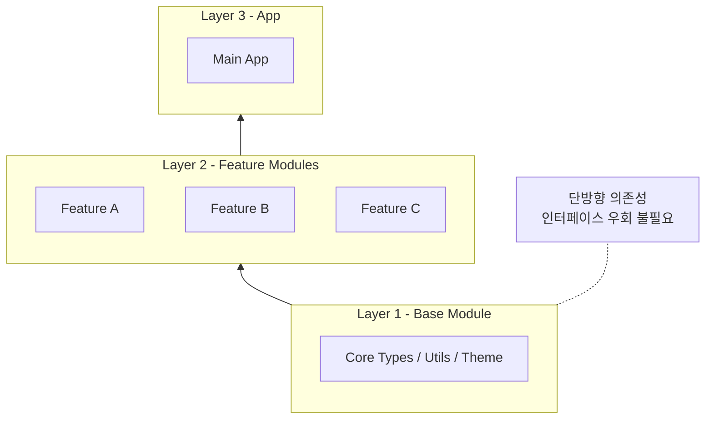

- 가장 좋은 접근법은 바텀업으로 아무것도 의존하지 않는 최하위의 로컬 타입들을 먼저 추출하여 기반 모듈로 분리하는 것
- 가장 밑바닥의 기능 모듈을 바라보게 한다면 인터페이스나 우회 코드 없이 완벽하게 단방향 의존성이 정렬됨

### 정리

#### 처음부터 모듈로 시작하지 않는 이유

- 모놀리스 구조는 서비스의 도메인을 명확히 찾아가는 과정에서 빠른 수정이 가능하게 한다.
- 초기 단계에서 섣부르게 모듈화하면 잘못된 경계선에 코드를 가둬버리게 될 수 있다.

#### 처음부터 모듈로 시작하는 게 정답일 때

- 도메인의 비즈니스 경계선과 요구사항을 명확하게 이해하고 있을 때
- 처음부터 대규모 개발 팀이 동시에 투입되어야 하는 상황일 때
- 복수의 독립된 앱을 동시에 출시해야 할 때

#### 팀과 기능의 성장이 어떻게 모놀리스의 한계를 드러내는가

- 개발자가 많아질수록 병합 충돌과 의도치 않은 코드 결합, 빌드 속도 저하가 증가한다.
- 모듈 경계가 없어 스파게티 코드가 될 수 있다.
- 지식의 장벽이 전문성이 아닌, 건드리기 무서운 코드를 중심으로 기괴하게 형성된다.

#### 왜 기능 모듈부터 쪼개면 망하는가

- 개별 기능 모듈들은 공통으로 사용하는 공유 타입에 강하게 의존한다.
- 기반 모듈부터 추출해내지 않고 기능부터 추출하면, 앱과 모듈이 서로를 참조하는 순환 의존성이 발생한다.
- 우회용 인터페이스를 남발하면, 무의미한 보일러 플레이트 코드가 폭발한다.

#### 기반 모듈부터 시작하라

- 기반이 먼저 잡혀야 다른 기능 모듈들이 순환 참조 없이 의존할 수 있다.
- 굳이 인터페이스 경계선을 만들 필요도 사라진다.

---

# Module Design and Refinement

### 접근 제어의 한계와 모듈의 능력

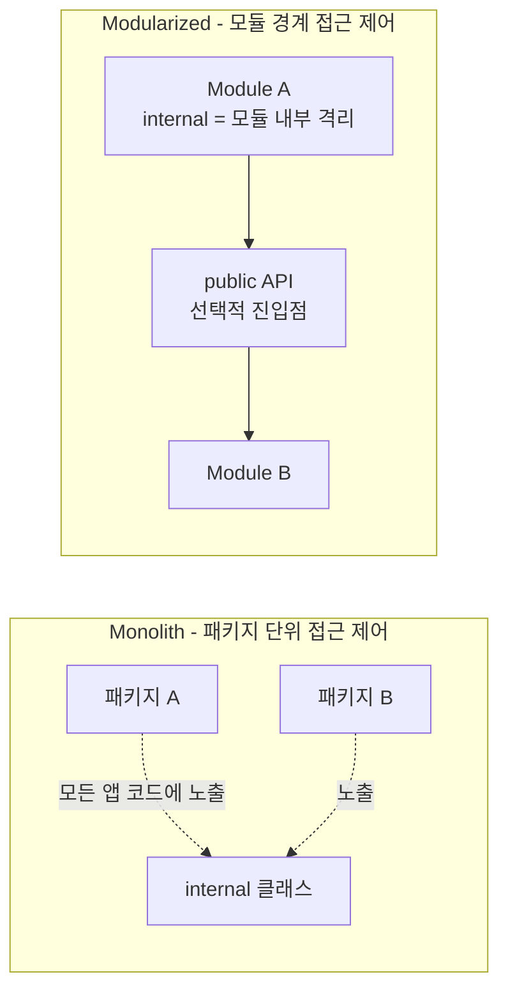

- 모놀리스 구조에서도 패키지를 사용하기 때문에 internal 접근 제어자를 써도 앱 개발자 전체가 내부 구현체에 접근할 수 있다. 이는 의도치 않은 결합을 만든다.
- public으로 노출하는 공개 API 코드의 부피가 작을수록, 미래의 내가 모듈 내부 로직을 고칠 수 있는 자유도가 기하급수적으로 올라간다.
- 모듈화를 하면 internal은 모듈내에서만 격리되며, public을 통해 선택적으로 진입점만 개방할 수 있다.

### 공개 API 다이어트

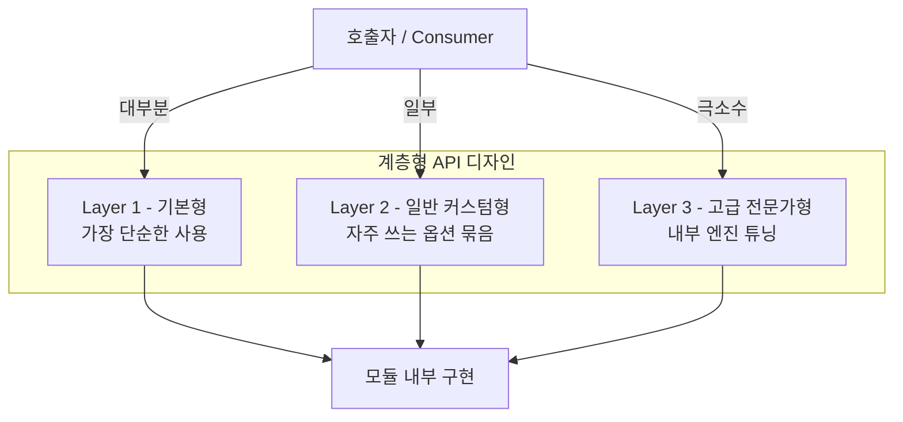

- 모듈의 공개 표면적을 줄이는 가장 좋은 방법은 계층형 API 디자인을 도입하는 것이다.
- 만약 비디오 플레이어 모듈을 만든다고 했을때, 복잡한 내부 설정까지 전부 public으로 노출하면 호출하는 쪽의 코드가 지저분해진다.
- 이를 해결하기 위해 3개의 레이어로 나누어 제공하라:
    - Layer 1: 기본형

        ```kotlin
        // 아무런 세팅 없이 가장 단순하게 호출 가능
        VideoPlayer().play(videoId = "abc123")
        ```

    - Layer 2: 일반 커스텀형

        ```kotlin
        // 자주 바뀌는 일반적인 설정값만 데이터 클래스로 묶어 노출
        val config = VideoConfig(quality = Quality.HD, autoplay = false)
        VideoPlayer(config = config).play(videoId = "abc123")
        ```

    - Layer 3: 고급 전문가형

        ```kotlin
        // 내부 깊숙한 엔진까지 튜닝해야 하는 극소수를 위한 확장 함수나 빌더 패턴 제공
        VideoPlayer()
            .withDecoder(VideoDecoder.Custom(hardwareAccelerated = false))
            .play(videoId = "abc123")
        ```

### 기능 모듈을 성숙하게 만들기

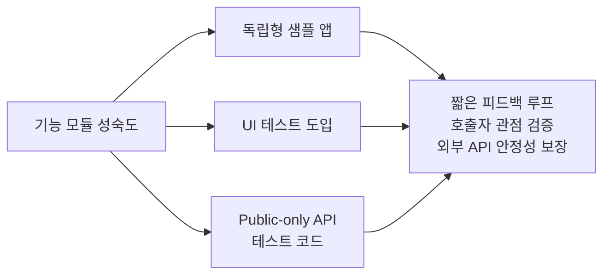

#### 독립형 샘플 앱 추가

- 메인 앱을 빌드하지 않고, 모듈만 단독으로 실행해서 테스트할 수 있는 초경량 샘플 앱을 만들어라
- 에러가 발생하더라도 재현을 위해 복잡한 과정을 거치지 않고 간편하게 검증할 수 있다.
- 짧은 피드백 루프를 통해서 API 디자인의 문제점을 발견하기 쉽다.

#### UI 테스트 도입

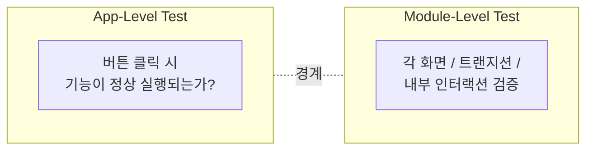

- 샘플 앱을 만들면 UI 테스트를 더 실용적이고 가볍게 만들 수 있다.
- 원하는 흐름을 바로 테스트할 수 있다.
- 앱 레벨 테스트의 임무: 버튼을 눌렀을 때 기능이 정상적으로 실행되는지 검증
- 모듈 레벨 테스트의 임무: 각각의 화면, 트랜지션, 상호작용이 내부에서 잘 이루어지는가 검증

#### Public-only API 로만 테스트 코드 짜보기

- 실제 개발 환경과 동일하게 모듈의 public 코드만 접근한 상태로 테스트 코드를 짜면
- 내부 구현을 테스트하는 덫에서 벗어나, 외부 공개 API 인터페이스가 비즈니스적으로 파괴되었는지를 검증할 수 있음

### 오픈소스 메인테이너처럼 생각하기

- 내가 만든 모듈을 깃허브에 전 세계 개발자들을 위해 공개하는 오픈 소스 프로젝트라고 최면을 걸어라.
- 에러가 발생했을 때 동료가 물어보러 오는 구조라면 실패한 모듈

#### 에러 메시지를 가이드처럼 제공하기

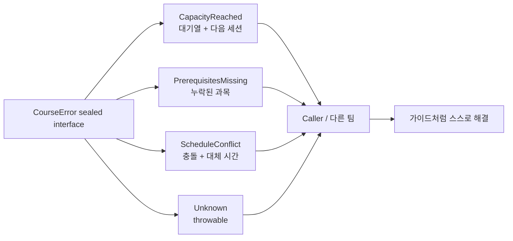

```kotlin
// :feature:course 모듈 내부 코드

public sealed interface CourseError {

    // 케이스 1: 수강 인원이 꽉 찬 경우 (대기열 정보와 다음 세션 날짜 제공)
    public data class CapacityReached(
        val currentStudents: Int,
        val maxStudents: Int,
        val nextSessionDate: String,
        val waitlistId: String
    ) : CourseError

    // 케이스 2: 선수 과목을 이수하지 않은 경우 (누락된 과목 리스트 제공)
    public data class PrerequisitesMissing(
        val missingCourses: List<String>
    ) : CourseError

    // 케이스 3: 기존 시간표와 겹치는 경우 (충돌 난 기존 수업 정보와 추천 대체 시간대 제공)
    public data class ScheduleConflict(
        val conflictingCourseName: String,
        val alternativeTimeSlot: String
    ) : CourseError

    // 케이스 4: 알 수 없는 네트워크 또는 서버 에러
    public data class Unknown(val throwable: Throwable) : CourseError
}
```

- 에러 메시지를 세분화하여 가이드북 역할을 수행하도록 하면 (에러 세분화)
- 다른 팀원들이 나에게 물어보러 오지 않고도 스스로 문제를 파악하고 수정할 수 있게 된다.

### 정리

#### 올바른 모듈 경계 설정

- 단순히 컴파일러 경고를 없애기 위해 public으로 바꾸지 마라.
- 외부로 노출하고 싶은 규칙이 무엇인지 의도적으로 설계해라.
- 공개 API의 부피가 작고 단순할수록, 모듈 내부를 수정할 수 있는 자유도가 높아진다.

#### 공개 API 다이어트

- 이 코드를 가져다 쓸 동료에게 진짜로 필요한 최소한의 데이터가 무엇인지에서부터 설계를 시작하라.
- 임시 방편과 우회 코드가 쌓여 API가 지저분해졌다는 신호를 예민하게 감지해야 한다.
- 일반 유저를 위한 심플한 레이어부터, 특수 목적을 가진 유저를 위한 고급 설정 레이어까지 계층형 API 디자인을 고려하라.

#### 모듈의 속성 및 고도화

- 모듈을 소비하는 독립된 샘플 앱을 구축하면 내 모듈을 가져다 쓸 때 어떤 점이 까다롭고 불편한지 호출자 입장에서 깨닫게 된다.
- 내부 구현체에 접근하지 않고 공개 API 만을 통해 유닛 테스트를 작성하면, 외부 API가 파괴되는 대참사를 막을 수 있다.
- 샘플 앱이 있다면 UI 테스트의 비용이 낮아진다.
- 앱 레벨 테스트는 기능 모듈이 정상적으로 실행되고 종료되는지 검증하고, 기능 모듈에서는 내부 화면의 개별 디테일과 복잡한 인터랙션을 검증하라.
- 내 모듈이 오픈 소스라고 가정하면, 나에게는 너무 당연한 로직이라도 그들에게는 미지의 코드다. 친절한 에러 메시지와 가이드 문서를 만드는 습관을 가지자.
