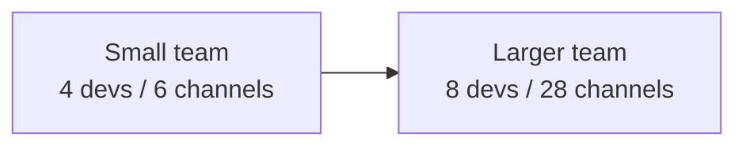
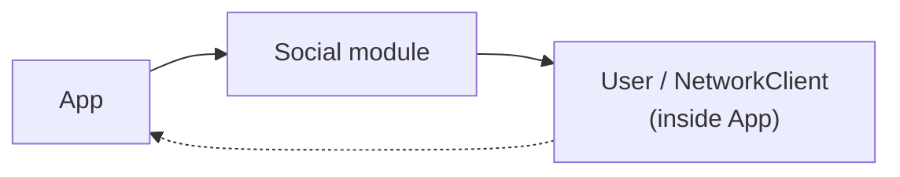
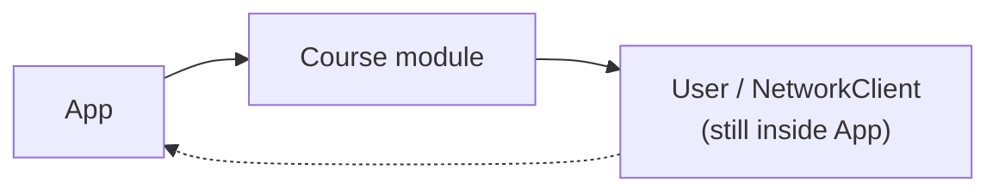
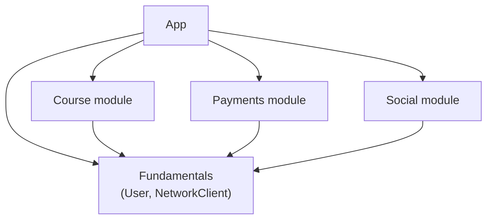
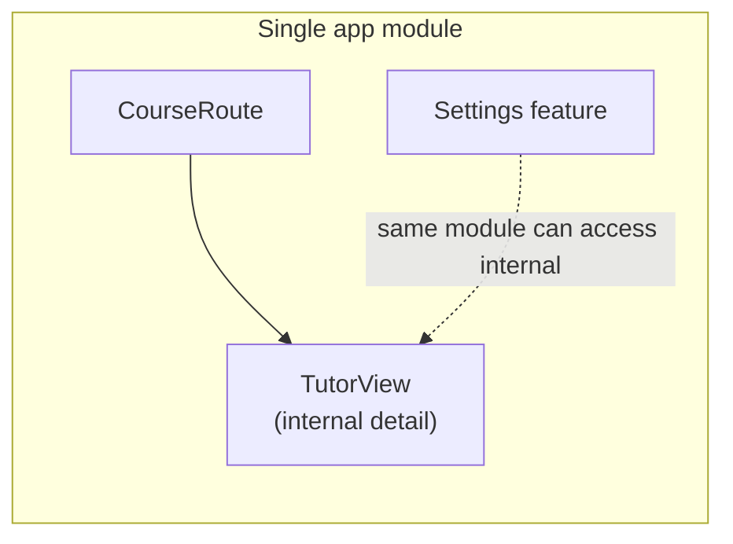

# [WEEK 04] Chapter 7, Chapter 8
📖 Mobile System Design 2. Large-Scale Codebases & Design Systems  

<br>

## 7. Deciding When, What, and How to Modularize
> module은 처음부터 무조건 나누는 구조가 아니라, app과 team이 커지면서 실제 문제가 생길 때 필요한 경계이다.  

### Starting simple: the working monolith

Course, Tutor, Payments, Video, UI Library, Authentication, Network 같은 `domain`은 이미 나뉘어 있을 수 있다.  
하지만 domain이 나뉘어 있다는 것이 곧 **각 domain이 별도 module이라는 뜻은 아니다.**  

초기 app은 `monolith`로 시작할 수 있다.  
> monolith는 앱 전체가 하나의 build target 안에 들어있는 구조다.  

이 방식은 module, package, access level 관리 비용 없이 빠르게 기능을 만들 수 있게 해준다.  

> [!Note]
> module은 여러 형태를 가질 수 있다.  
> 이 장에서는 우선 **별도로 빌드할 수 있는 separate target** 정도로 이해하면 된다. 

---

### Reviewing when a monolith makes sense

작은 team과 적은 feature 수에서는 `monolith`가 충분히 잘 동작한다.  
- app 전체를 머릿속에 담을 수 있다.
- 필요한 code를 쉽게 찾고 어디서든 호출할 수 있다.  

module을 유지하기 위한 package manager, module-specific access level, release 조율도 필요하지 않다.  
이 규모에서는 **단순함** 자체가 장점이다.  

#### Domain discovery benefits

새 app을 만들 때는 domain 자체를 아직 발견하는 중이다.  
초기 PRD는 명확해 보여도 실제 구현 과정에서 domain 관계가 달라질 수 있다.  

**monolith의 장점**
- Course, Payments, User 같은 개념을 쉽게 옮기고 다시 모델링할 수 있다.  
- module boundary가 아직 고정되지 않았기 때문에 business model과 domain API를 실험하기 쉽다.  

#### Avoiding premature architectural decisions

`module`은 문제 영역을 완전히 이해하기 전에 “무엇이 서로 연관되어 있는지”를 먼저 파악하게 만든다.
그 결과 어색한 API나 잦은 module 경계 변경, 혹은 공유 "utility" module에 너무 많은 기능을 집어넣게 된다.  

`monolith`에서는 잘못 나눈 추상화도 class만 옮겨 쉽게 바꿀 수 있다.  
> module 분할, 이동, import 수정을 통한 module 재설계가 필요없다.  

명확한 내부 경계는 유지하되, module 경계 확정은 실제 빌드와 사용을 통해 드러난 뒤로 미룰 수 있다.  

---

### Counterpoint: When starting with modules makes sense

monolith-first가 항상 맞는 것은 아니다.  
처음부터 module로 시작하는 편이 더 나은 상황도 있다.  

| 상황 | 이유 |
|---|---|
| domain boundary가 명확함 | API와 책임이 예측 가능하다 |
| team scaling이 예측됨 | 빠른 인원 증가 전에 coordination point를 만들 수 있다 |
| domain 재사용이 즉시 필요함 | 여러 app이나 target에서 같은 code를 써야 한다 |

#### When domain boundaries are well understood

**도메인 경계가 명확**하다면 처음부터 module을 만들 수 있다.  
ex) 비디오 처리 서비스처럼 core 기능과 API가 분명한 경우 module 경계(`VideoProcessor` module)를 일찍 잡아도 부담이 적다.  

기존 app을 다시 만드는 상황도 여기에 가깝다.  
이미 실제 사용을 거친 컴포넌트는 경계와 상호작용이 검증되어 있기 때문이다.  

#### When team scaling is predictable

**team이 빠르게 커질 것이 확실**하다면 `monolith`의 일시적 단순함보다 조정 비용이 더 커질 수 있다.  
module 경계는 여러 team이 각자의 영역에서 일할 수 있는 조율 지점이 된다.  

특히 time zone이나 조직 경계가 분산된 team에서는 `module`이 협업 단위를 더 명확하게 만든다.  

#### When you need to reuse domains from day one

처음부터 여러 app이나 target에서 **같은 domain을 써야 한다면** `module`이 바로 필요하다.  
ex) Tutor app과 Student app을 따로 출시한다면 Payments module을 공유하는 편이 중복 구현보다 낫다.  

중요한 기준은 “언젠가 필요할 것 같다”가 아니라 “지금 이미 재사용 요구가 있다”는 점이다.  

---

### Team scaling pains: communication and development speed slow down

app과 team이 커지면 communication channel이 급격히 늘어난다.  
4명은 6개의 communication channel을 가지지만, 8명은 28개로 늘어난다.  



communication channel 증가만 문제가 아니다.  
큰 monolith에서는 `의도치 않은 결합`, `merge conflict`, `build time`, `knowledge silo`가 함께 커진다.  

#### Unintentional coupling

`monolith`
- domain 사이를 쉽게 import할 수 있다.  
- 처음에는 합리적인 의존처럼 보여도 시간이 지나면 `양방향 의존성`과 `순환 의존성`로 커질 수 있다.  

`module`
- 의존 관계의 방향을 더 명확하게 드러낸다.  
- Course module이 Video module을 사용하는 것은 자연스럽지만, Video module이 다시 Course module을 알아야 한다면 두 기능이 서로 강하게 얽혀 있다는 신호이다.  
	- module 구조에서는 이런 관계가 `순환 의존성`으로 드러난다.
	- 덕분에 잘못된 의존 방향을 더 빨리 발견하고 구조를 다시 검토할 수 있다.

#### Merge conflicts become frequent

여러 team이 같은 project와 shared layer를 수정하면 `merge conflict` 가능성이 커진다.  
서로 관련 없어 보이는 feature도 같은 domain model이나 network layer를 건드리면 충돌할 수 있다.  

module 경계가 있으면 shared code 변경이 더 명시적인 일이 된다.  
공유 module 변경은 별도 review와 coordination을 요구하므로, feature PR 안에 묻히기 어렵다.  

#### Build times slow to a crawl

`큰 monolith`
- 작은 변경도 광범위한 rebuild를 유발할 수 있다.  
- 중요한 data model 하나를 바꾸면 의존성이 app 전체로 퍼져 build time이 길어진다.  

`module`
- module 단위로 작업하면 변경 범위가 줄어 빌드와 피드백 루프가 빨라질 수 있다.  
- 작은 utility test를 위해 전체 app을 build하지 않아도 되는 점도 품질에 도움이 된다.  

#### Knowledge silos form accidentally, not intentionally

knowledge silo 자체가 항상 나쁜 것은 아니다.  
Networking, Security, Payments처럼 특정 team이 module을 책임지는 것은 의도된 ownership에 가깝다.  

문제는 monolith에서 **복잡하게 얽힌 code 때문에 우연히 생기는 silo**이다.  
특정 사람이 “그 무서운 network code를 아는 사람”이 되는 식이다.  

이런 silo는 전문성보다 **두려움**에 가깝다.  
인증 flow나 video player가 여러 domain과 얽혀 있으면, 실제로는 한두 사람만 안전하게 수정할 수 있는 영역이 된다.  

---

### Transitioning into modules

monolith가 feature release를 어렵게 만들기 시작하면 module로 전환할 시점이다.  
이 전환은 처음 monolith로 시작한 선택이 실패였다는 뜻이 아니다.  

module은 성장한 app의 scaling problem을 해결하기 위한 다음 단계이다.  
전환을 시작하기 전에 module이라는 용어가 무엇을 의미하는지 맞춰야 한다.  

#### What we mean by “module”

module은 독립적으로 개발, test, 유지보수할 수 있는 code 단위이다.  
standalone으로 동작할 수 있고, app이나 다른 module에 import되어 사용된다.  

module은 library, framework, package, dependency처럼 다양한 형태로 불릴 수 있다.  
여기서는 **app이 의존할 수 있는 분리된 code 단위**를 module로 본다.  

#### Distribution differences

| 구분 | 특징 |
|---|---|
| local module | 같은 repository 안에서 app과 함께 개발되고 배포된다 |
| remote module | package manager나 artifact repository를 통해 독립적으로 배포된다 |

대부분의 team은 local module로 시작한다.  
여러 app에서 공유해야 하거나 팀 독립성이 더 중요해질 때 remote distribution을 고려할 수 있다.  

---

### A naive extraction process

monolith에서 module을 만들 때 feature-module을 먼저 만들거나, 기존 feature를 바로 추출하면 `순환 의존성`이 생기기 쉽다.  

#### Starting with feature-modules

새 Social module을 만든다고 가정한다.  
이 module은 `User`와 `NetworkClient` 같은 shared type이 필요하지만, 그 type들이 아직 app 안에 있다.  

`app`은 `Social module`에 의존하고, `Social module`은 다시 app 안의 `shared type`에 의존한다.  
결과적으로 순환 의존성이 생긴다.  



#### Breaking the circular dependency

- Social module 안에 User나 NetworkClient에 대한 `interface`를 만들고
- app이 concrete type을 inject할 수 있다.  

이 방식은 순환 의존성을 끊을 수는 있지만 비용이 크다.  

#### The problem with interfaces

interface로 순환 의존성을 끊을 수는 있지만, module 수가 늘어나면 관리 비용이 커진다.  

| 문제 | 설명 |
|---|---|
| interface 증가 | module마다 `UserInterface`, `NetworkClientInterface` 같은 type이 필요해진다 |
| 중복 | 각 module이 비슷한 interface를 조금씩 다르게 정의할 수 있다 |
| god module 위험 | 공통 interface를 모은 별도 module이 bottleneck이 될 수 있다 |

결국 module을 scale하려고 도입한 방식이 다시 scale 문제를 만든다.  
순환 의존성을 피하기 위해 interface를 계속 추가하는 방식은 장기적으로 유지하기 어렵다.  

#### Extracting existing features

기존 feature를 바로 module로 추출해도 같은 문제가 생길 수 있다.  
Course domain을 Course module로 옮겼는데, Course module이 app 안의 `User`, `NetworkClient`에 의존하면 다시 순환 의존성이 된다.  



핵심은 new feature든 existing feature든 feature-module부터 만들면 shared type 위치가 문제가 된다는 점이다.  

> [!Important]
> 결국 shared type을 먼저 분리해야한다  

---

### A practical extraction process

실용적인 추출 방식은 bottom-up이다.  
feature-module부터 만들지 않고, feature들이 함께 쓰는 낮은 수준의 type을 먼저 분리한다.  

#### extraction order
1. app 안에 흩어진 shared type을 찾는다.  
2. `User`, `NetworkClient` 같은 type을 `Fundamentals` module로 옮긴다.  
3. app과 feature-module은 `Fundamentals`에 의존한다.  
4. 그 다음 new feature-module을 추가하거나 existing feature를 추출한다.  

> [!Note]
> `Fundamentals`
> - app의 domain code에 의존하지 않는 leaf module이어야 한다.  
> - 이 module이 먼저 분리되어 있어야 feature-module이 app 내부 type을 다시 참조하지 않는다.  



#### Introducing a new feature-module

`Fundamentals` module이 먼저 있으면 feature-module을 추가하기 쉬워진다.  
Social module은 app 안의 `User`, `NetworkClient`를 찾지 않고 **`Fundamentals`를 import**하면 된다.  

새 interface를 만들 필요가 줄어든다.  
dependency 방향도 **`feature-module -> Fundamentals`** 로 정리된다.  

#### Extracting an existing feature

기존 Course domain도 같은 방식으로 module로 옮길 수 있다.  
Course module은 `Fundamentals`에 의존하고, app은 Course module을 사용한다.  

핵심은 **feature-module보다 foundational module을 먼저 정의하고 추출**하는 것이다.
> 그 다음 feature-module을 추가하거나 추출하면 순환 의존성 없이 구조를 만들 수 있다.  

---

### Conclusion

#### monolith
- 작은 team과 불확실한 domain에서는 의도적인 선택이 될 수 있다.  
- 빠르게 움직이고 boundary를 실험할 수 있기 때문이다.  
- 하지만 app과 team이 커지면 cognitive complexity가 증가하고, bidirectional dependency와 build time 문제가 커진다.  

#### module
- clean architecture를 위한 장식이 아니라 실제 scaling pain에 대한 대응이다.  
- feature-module부터 뽑는 것보다 foundational code를 먼저 뽑는 편이 전체 추출 과정을 단순하게 만든다.  

---

### What we covered

- `monolith`는 domain discovery와 빠른 iteration에 유리하다.
- `module`을 너무 일찍 만들면 아직 모르는 boundary를 고정하게 된다.
- domain boundary, team scaling, reuse requirement가 명확하면 `module-first`가 적절할 수 있다.
- 큰 monolith는 coupling, merge conflict, build time, accidental silo 문제를 만든다.
- feature-module부터 추출하면 순환 의존성이 생기기 쉽다.
- `foundational module`을 먼저 추출하면 feature-module을 더 단순하게 추가하거나 분리할 수 있다.

<br>

## 8. Module Design and Refinement
> module을 추출한 뒤에는 public API를 줄이고, 접근 제어와 테스트, 샘플 앱을 통해 유지보수 가능한 단위로 다듬어야 한다.  

### Access Control Limitations

module을 추출하면 컴파일 에러를 없애기 위해 타입을 무작정 `public`으로 열기 쉽다.  
하지만 이렇게 하면 외부 코드가 내부 구현에 의존하게 되고, 나중에 수정하기 어려운 public API가 생긴다.  

public API는 향후 호환성을 유지하겠다는 약속이다.  
이 약속의 범위가 좁을수록 향후 유지보수가 훨씬 수월해진다.

#### Limited access control

monolith에서는 feature 내부 구현을 숨기기 어렵다.  
같은 앱 module 안에 Course, Settings, Payments code가 함께 있으면 접근 제한의 경계도 앱 module 전체가 된다.  

Kotlin에서는 기본 접근 제한자가 `public`이다.  
따라서 숨기고 싶은 type이나 function은 `internal` 또는 `private`을 명시해야 한다.  

| 제한자 | Kotlin 기준 의미 |
|---|---|
| `public` | 어디서든 접근 가능 |
| `internal` | 같은 Gradle module 안에서 접근 가능 |
| `private` | 같은 file 또는 class 내부에서 접근 가능 |



`private`을 쓰면 더 강하게 숨길 수 있다.  
하지만 Course 내부의 여러 view를 모두 private으로 감추기 위해 같은 파일에 몰아넣는 방식은 확장하기 어렵다.  

핵심은 `private`을 쓰지 말라는 것이 아니다.  
monolith에서는 `internal`의 범위가 앱 module 전체라서 feature 내부 구현을 충분히 보호하기 어렵다는 점이다.  

#### How modules improve access control

feature를 별도 Gradle module로 분리하면 `internal`의 범위가 **해당 module 내부**로 좁아진다.  
외부 앱이나 다른 feature module은 public으로 열린 entry point만 사용할 수 있다.  

| 구조 | internal 의미 | 외부 접근 |
|---|---|---|
| single app module | 같은 앱 module 전체에서 접근 가능 | 다른 feature가 내부 구현을 사용할 수 있다 |
| feature module | 같은 feature module 내부에서만 접근 가능 | public entry point만 사용할 수 있다 |

```kotlin
// :feature:course

@Composable
fun CourseRoute() {
    CourseScreen()
}

@Composable
internal fun CourseScreen() {
    TutorView()
}

@Composable
private fun TutorView() {
    // same file only
}
```

컴파일러가 경계를 강제하므로 팀의 규칙에만 기대지 않아도 된다.  
누군가 internal 타입을 public으로 바꾸려 하면 PR에 명확히 드러나고, module 담당자가 검토할 수 있다.  

#### APIs are promises

public 타입, 함수, 프로퍼티는 앞으로 계속 지원하겠다는 약속이다.  
public API는
- 많을수록 module 내부 구현을 바꾸기 어려워진다.  
- 작으면 내부 구현을 더 자유롭게 바꿀 수 있다.  

예를 들어 앱이 `paymentFlow.start()`만 호출한다면 내부 flow가 3개 화면이든 40개 화면이든 앱에는 영향을 덜 준다.  

---

### Shrinking the public API

public API는 현재 구현된 모든 것을 드러내는 방식으로 설계하면 안 된다.  
**외부 사용자가 실제로 필요한 것**부터 다시 정리해야 한다.  

Course module을 추출했다면 공개해야 할 기능과 숨겨야 할 구현 세부사항을 구분한다.  

| 공개 후보 | 숨길 대상 |
|---|---|
| course data 조회 | `TutorView` 같은 내부 view |
| progress update | cache manager |
| 필요한 course model | database schema |
| feature entry point | network request builder |

> [!Note]
> module을 갓 추출한 시점은 큰 변경을 감수하고 public API를 줄이기 좋은 시점이다.  

#### Layered API design

`VideoPlayer`처럼 설정이 복잡한 module은 사용 패턴을 보고 API를 층으로 나눌 수 있다.  
대부분의 사용자는 단순한 API를 쓰고, 일부 사용자만 더 세밀한 설정을 쓰게 만드는 방식이다.  

| layer   | 대상         | 예시                             |
| ------- | ---------- | ------------------------------ |
| Layer 1 | 대부분의 기본 사용 | `VideoPlayer().play(videoId)`  |
| Layer 2 | 흔한 설정 변경   | quality, autoplay, timeout 설정  |
| Layer 3 | 고급 사용      | custom decoder, caching option |

`layered API`는 작은 public API와 필요한 유연성 사이의 균형을 만든다.  
복잡한 초기화와 내부 타입은 module 내부에 숨길 수 있다.  

---

### Maturing a feature module

API를 정리한 뒤에는 feature module을 더 쓰기 쉬운 단위로 다듬을 수 있다.  
샘플 앱, UI 테스트, public API 중심 테스트가 대표적인 방법이다.  

#### Adding a sample app

sample app은 module을 독립적으로 실행하고 사용하는 방법을 보여주는 작은 앱이다.  
정상 흐름, 문제 상황, edge case를 빠르게 열어볼 수 있어야 한다.  

Course module sample app이라면 새 course 표시, 거의 완료된 course, tutor announcement, offline refresh failure 같은 상태로 바로 진입할 수 있다.  

> [!Important]
> 재현하기 어려운 상태를 빠르게 확인할 수 있다는 점이 핵심이다.  

#### Benefits

`sample app`은 
1. module을 사용하는 사람의 관점에서 public API를 직접 쓰게 만든다.  
	- 이 과정에서 설정이 복잡한 API, 빠진 편의 함수, 숨은 의존성을 발견할 수 있다.  
2. 온보딩, 다른 프로젝트 통합, 사용 예시 역할을 한다.  

다만 sample app도 유지보수 비용이 있으므로 중요한 feature module에 우선 적용하는 편이 좋다.  

#### Consider UI Tests

sample app이 있으면 **module 단위 UI 테스트를 더 가볍게** 만들 수 있다.  
main app 전체를 build하지 않고 원하는 flow와 state로 바로 진입할 수 있기 때문이다.  

| 테스트 위치 | 확인할 것 |
|---|---|
| app-level test | feature flow가 시작되고 완료되는지 |
| module-level test | 내부 화면, 전환, interaction이 제대로 동작하는지 |

#### Public APIs and unconventional testing

Swift는 test에서 module을 `@testable import`하면 internal code까지 접근할 수 있다.  
반대로 app처럼 일반 import를 사용하면 public API만 테스트하게 된다.  

이 방식은 실제 사용자가 보는 API를 기준으로 깨지는 지점을 잡아준다.  
internal unit test를 대체하는 것이 아니라 public API 안정성을 확인하는 추가 안전망이다.  

> Android에서는 internal code가 test에서 기본적으로 접근 가능한 경우가 많다.  
> 접근을 제한하고 싶다면 별도 test module을 둘 수 있다.

---

### Think like an open-source maintainer

module을 공개 오픈소스 프로젝트처럼 다룬다고 생각하면 챙겨야 할 것이 명확해진다.  
팀 안의 암묵지나 Slack 질문에 의존하지 않아도 사용할 수 있어야 한다.  

오픈소스 maintainer 관점에서 module은 다음을 갖춰야 한다.  

- 사전 맥락 없이 읽을 수 있는 문서
- 실제로 컴파일되고 실행되는 예시
- 바로 동작하는 sensible default
- 문제 해결을 돕는 에러 메시지
- 직관적인 public API

#### Error messages that guide implementers

좋은 에러 메시지는 단순히 실패를 알리는 데서 끝나지 않는다.  
**무엇이 잘못됐고, 구현하는 사람이 무엇을 해야 하는지** 알려준다.  

`constraint violation` 같은 메시지는 내부 사정을 아는 사람에게 물어봐야 이해할 수 있다.  
반면 `capacityReached`, `prerequisitesMissing`, `scheduleConflict`처럼 **구체적인 error는 자체적으로 문서 역할**을 한다.  

> [!Important]
> 이 기준은 내부 module에도 똑같이 적용할 수 있다.  
> 팀원이 module 담당자에게 계속 물어보지 않아도 문제를 이해하고 처리할 수 있어야 한다.  

---

### Conclusion

module을 만드는 일은 파일을 옮기고 import를 고치는 작업으로 끝나지 않는다.  
컴파일 에러는 module이 앱과 연결되는 모든 지점을 보여주는 기회이다.  

이 시점에 public API를 줄이고, sample app을 만들고, public API 중심 테스트를 추가하면 미래 유지보수 비용이 줄어든다.  
module 인터페이스를 설계하는 시간은 중간 규모 이상의 앱에서 특히 큰 효과를 낸다.  

---

### What we covered

- module 추출 직후에는 `무엇을 public으로 열지` 의도적으로 설계해야 한다.
- module에서 `internal`은 module 내부 접근으로 의미가 좁아진다.
- `public API`는 앞으로 유지해야 하는 약속이므로 **작게 유지**해야 한다.
- 외부 사용자가 필요한 API부터 다시 설계하고 내부 구현은 숨겨야 한다.
- layered API는 단순한 기본 사용과 고급 사용을 함께 지원할 수 있다.
- sample app은 API 사용성, edge case, 온보딩에 도움이 된다.
- public API만 사용하는 test는 외부 사용자 관점의 breaking change를 잡아준다.
- 오픈소스 maintainer처럼 생각하면 문서, 예시, 기본값, 에러 메시지 품질이 좋아진다.
