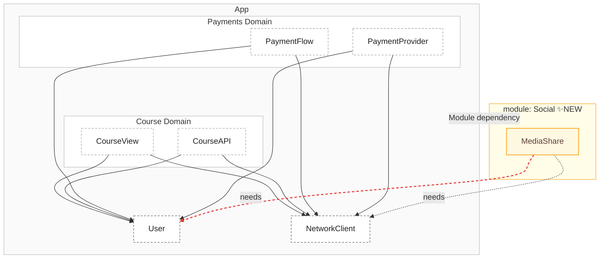
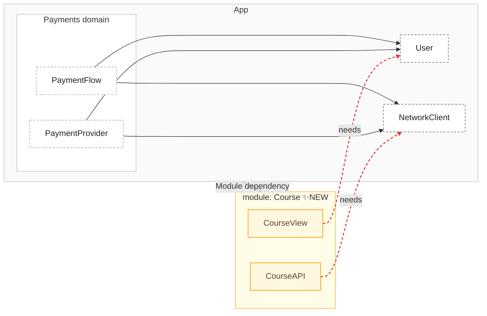
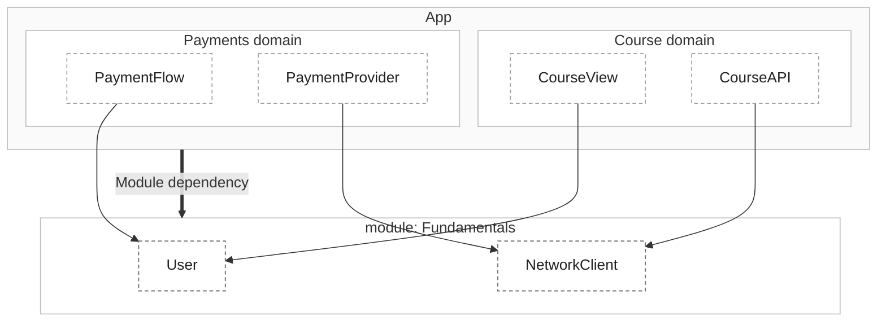

## 7장 [[07. 언제, 무엇을, 어떻게 모듈화할 것인가|언제, 무엇을, 어떻게 모듈화할 것인가]]
## 모놀리

- 일단, 별도로 모듈을 분리하지 않는 모놀리가 꼭 나쁜 것은 아니다.
	- 머릿속에 구조가 잘 들어온다.
	- 언제든 어떤 함수를 호출할 수 있어 개발 속도가 증가한다.
	- `import` 도 당연히, 어디서나 가능하다.
	- 로직이 분산되어 있지 않아 개발자간 소통 비용이 줄어든다.

### 모놀리의 장점
- 좀 더 구체적인 장점은 다음과 같다.

1. 도메인 개념 정립이 쉽다.
	- 기획이 항상 명확하면 좋겠지만, 보통은 흐리게 정립된다.
	- 모놀리에서는 모듈이 어떤 개념을 가져야 하는지 알 필요가 전혀 없다.
	- 직접 구현을 하면서, 도메인 모델에 대한 개념과 모델 사이의 관계 수립을 "진짜 필요에 따라" 진행할 수 있다.

2. 불완전한 아키텍처 생성을 방지한다.
	- 하나의 개념이 지금은 작을 수 있어도, 시간이 흘러 여러 기획이 추가되다 보면 개념이 확장될 수 있다.
	- 모듈러 시스템에서는 모듈이 어떤 개념이 포함되는지, 어떤 도메인과 연관이 있는지 모두 알아야 한다.
	- 모놀리에서는 개발하면서 각 도메인 모델에 대해 역할을 점검할 수 있다.
		- 즉, 여러 방면으로 관계를 수립하며 어떤 아키텍처가 좋은지 여러 번 실험할 수 있다.
	- 결과적으로 더 안정적인 아키텍처가 구축된다.

### 반대로 모듈이 필요한 경우
1. 도메인을 이미 너무 잘 알때
	- 똑같은 앱의 V2 버전을 만들거나, 이전 회사에서 해당 도메인을 경험해본 경우라면 모듈이 오히려 좋다.

2. 팀 인원이 늘어나는 것이 확정적일 때
	- 팀원이 많이 늘어나면 작업량이 많아지고, 이에 따라 정확하지 않은 도메인 개념 관계가 수립될 수 있다.
	- 이 때는 개념에 맞게 다시 수정하는 것이 훨씬 더 큰 비용이므로, 모듈을 통해 처음부터 개념을 잘 구축해두는게 더 좋다.

3. 여러 앱을 동시에 지원해야 할 때
	- 동일한 도메인을 여러 앱에 지원하는, 재사용이 확정적이라면 처음부터 모듈을 만드는게 좋다.

### 모놀리가 힘들어지는 시기
- 앱이 커지면서, 개발자도 많아지고 소통 비용도 증가하고 있다.
- 이 때 모놀리 시스템의 문제가 대두된다.

- 우선, 편의를 위한 의도치 않은 결합이 매우 많아진다.
	- 도메인 간 양방향 의존이 생기게 되면서, 하나가 바뀌면 다른 곳에도 영향이 간다.
	- 모듈러 시스템의 경우 애초에 단방향 의존이 기본이므로 이런 결합 자체가 생기지 않는다.

- 불필요한 `Merge` 충돌도 많아진다.
	- 너무 쉽게 기초적인 기능에 누구나 접근이 가능하기 때문이다.
	- 기초 모듈을 분리한다면 그 때부터는 모두 기반이 되는 로직을 수정하기 위해선 PR을 올리고, 검토를 받는 절차를 요구받게 된다.
		- 이를 피하기 위해 결과적으로 자신의 모듈 내에서 어떻게든 문제를 수정하려 하고, 실제로 수정이 된다.
	- 결과적으로 `Merge` 충돌이 줄어들 것이다.

- 모듈이 매우 비대해지면서, 빌드 속도가 늘어나게 된다.
	- 테스트 역시 힘들다.

## 모듈로의 전환
- 우선 모듈에 대한 정의부터 한다.
	- 모듈은 독립적으로 개발, 테스트, 유지보수 할 수 있는 별도의 코드 조각이다.
	- 단순하게 표현하면 "파일과 다른 폴더가 들어있는 폴더" 라고 할 수 있다.

- 로컬 모듈 / 원격 모듈로도 나눠진다.
	- 로컬 모듈은 레포 안에 있는 모듈을 의미하며, 메인 앱과 함께 개발되고 배포된다.
	- 원격 모듈은 패키지 매니저나 `artifact` 레파지토리로 배포된다.
		- 독립적인 릴리즈 주기를 갖는다.
- 대부분의 경우 로컬 모듈로 시작하고, 여러 앱 간 공유가 단순함보다 가치 있어지는 경우에만 원격 모듈로 이전한다.

### 추출 프로세스
- 그럼 모듈을 만들건데, 기존 기능을 모듈로 옮기는게 우선일까? 새 기능을 모듈로 만드는게 우선일까?
	- 일단은 둘다 아니다.

- 모듈러 앱에서는 피처 모듈부터 시작하는 것이 좋지만, 모놀리 앱에서는 오히려 더 복잡해진다.
- 모놀리 앱에서 피처 모듈부터 만들면, 순환 참조가 발생할 가능성이 크다.
	- 두 도메인이 있다고 가정하고, 둘 모두 어떤 도메인에도 속하지 않는 "공유" 타입에 의존한다고 가정한다.
	- 공유 타입은 일반적으로 `APP` 모듈에 있을 것이다.
	- 이 때 새로운 모듈을 생성하면, `APP` 모듈과 신규 모듈 사이에 순환 참조가 발생한다.



- 위 그림과 같이 신규 모듈이 공유 타입을 필요로 하기 때문이다.

- 이러한 순환 의존성을 깨고 싶다면 인터페이스를 활용한 의존성 주입을 고려해볼 수 있다.
	- 하지만 모듈이 10개가 있다면 인터페이스를 20개 생성해야 한다.
	- 또한 중복도 발생하게 될 것이다.
	- 팀과 코드베이스를 확장하기 위해 모듈을 쓰려는건데, 이는 오히려 확장을 더디게 만든다.

- **그럼 기존 기능을 추출하는건 어떨까?**




- 기존 기능을 추출해도 결국 `APP` 내의 공통 기능에 의존하게 되는 것은 매한가지다.
	- 즉, 순환 참조가 발생한다.

## 실용적인 추출 프로세스
- 더 나은 접근 방식은 `bottom-up` 으로 시작하는 것이다.
	- 즉, 저수준의 타입들을 먼저 추출해 피처 모듈이 의존할 수 있는 기초 모듈에 배치하는 것이다.

- 위 그림에서 봤던 `User`, `NetworkClient` 는 어떤 도메인이나 모듈에 속하지 않는 느슨한 타입들이다.
	- `Foundation` 이라는 모듈을 도입하고 거기에 배치하면 좋다.




- 이제는 순환 참조없이 깔끔한 모듈러 셋업을 갖추게 되었다.
- 덕분에 피처 모듈을 추출하거나 도입하기가 훨씬 쉬워졌다.

- 새로운 피처 모듈을 도입하면, 아주 간단하게 `Foundation` 모듈에 의존시키면 된다.
	- 순환 참조가 없으므로 피처 모듈의 도입이 매우 간단해진다.
	- 인터페이스와 같이 새로운 타입들을 도입하지 않아도 된다!

- 그렇다면 이제 모듈을 추출했으니 모듈을 성숙하게 만들 차례다.

## 8장 [[08. 모듈 디자인과 정제|모듈 디자인과 정제]]
- 모듈을 만들었다면, 이제는 잘 사용할 차례다.
- 신중한 설계는 미래의 유지보수를 안락하게 만들어준다.

## 접근 제어자
- `internal` 키워드를 잘 활용하는 것이 좋다.
- `public` 키워드는 가능한 작게, 집중적으로 유지한다.
	- `public` 은 앞으로도 클라이언트에게 계속 제공한다는 일종의 약속이다.
	- 모듈 내 모든 메소드가 `public` 이라면, 어떤 것을 변경할 때마다 앱 입장에서는 `breaking change` 가 된다.
	- 작은 API는 유지보수에 있어 매우 중요한 것이다.

### Public API 줄이기
- 기법 중 하나로 레이어드 API가 있다.
	- 사용자가 어떤식으로 사용하는지 패턴을 학습하는 것이다.
	- 사용 빈도에 따라 노출할 API를 결정할 수 있다.

```swift
// Listing 8.3: 레이어드 API 설계 — 단순화된 버전과 고급 VideoPlayer 변형

// Layer 1 — 89%의 경우
let player = VideoPlayer()
player.play(videoId: "abc123")

// Layer 2 — 8%의 경우
let config = VideoConfig(
    quality: .adaptive,
    autoplay: false,
    networkTimeout: 45,
    videoId: "abc123"
)
let player = VideoPlayer(config: config)

// Layer 3 — 3%의 경우
let player = VideoPlayer()
    .with(decoder: .custom(codec: .hevc, hardwareAccelerated: false))
    .with(caching: .disabled)
```

- 위와 같이 빈도에 따라 유연성은 유지하면서, API를 작게 유지할 수 있다.

## 피처 모듈 다듬기
- 모듈을 어떻게 개선할 것인지 계획을 세워보아야 한다.

### 샘플 앱 추가하기
- 모듈 기능을 보여주는 앱이다.
	- Happy path
	- error case
	- edge case
	- 와 같은 시나리오 목록을 포함하여 기능을 시현한다.

- 해당 기능은 즉시 실행할 수 있어야 하며, QA, 온보딩 시 유용하게 사용할 수 있다.
	- 실제 일반적인 사용 케이스는 물론, 숨겨진 API를 활용하는 방법을 효과적으로 보여준다.

- 샘플 앱 내에서 UI 테스트 도입도 고려해볼 수 있다.
	- 이로 인해 앱 레벨과 모듈 레벨 테스트를 분리할 수 있다.

- 앱 레벨 테스트 : 버튼을 탭할 때 기능이 올바르게 시작되고 완료되는가?
- 모듈 레벨 테스트 : 모든 개별 화면, 전환, 상호작용이 올바르게 동작하는가?
- 이제 전체 앱을 빌드하지 않고도 모듈 내에서 각자 테스트를 진행할 수 있다.

### Public API와 비관습적인 테스트
- 일반적으로 모듈 테스트 코드를 짤 때, 내부의 메소드가 의도대로 동작하는지에 대해서만 테스트하는 경향이 있다.

- 하지만, 외부 모듈에서 접근하는 것을 가정하여 `Public` API 에 대해서만 테스트하는 코드를 만들어두는 것도 좋다.
	- 이 테스트에서는 `intenral` 키워드의 메소드 자체에 접근할 수 없게 통제하는 것이 좋다.
	- 이 커버리지가 충분하면, `public` API의 `breaking change` 를 알려주는 신뢰 지표가 생긴다.

- 이게 없다면 내부만 테스트하는 함정에 빠지기 쉽고, `public` API가 깨지는 변경사항을 추적하기 어려울 수 있다.

## 오픈소스 메인테이너가 되기
- 건강한 모듈을 유지하기 위한 멘탈 모델이 존재한다.
- 바로 깃허브에 해당 모듈을 공개적으로 발행했다고 상상하는 것이다.
	- 완전히 낯선 사람이 이 모듈에 접근한다고 가정하라.

- 모든 `public` 메소드들에 대해 사용하는 사람이 전문가가 되어야 한다.
- 실제로 좋은 오픈소스 메인테이너는 다음 사항 없이는 모듈을 출시하지 않는다.
	- 사전 지식을 요구하지 않은 명확한 문서
	- 실제로 컴파일되고 실행되는 예시
	- 즉시 작동하는 합리적인 기본값
	- 사용자가 문제를 해결할 수 있도록 돕는 에러 메시지
	- 직관적인 `public` API

- 미래의 자신, 팀원이 사용한다고 생각하고 모듈을 관리하라.