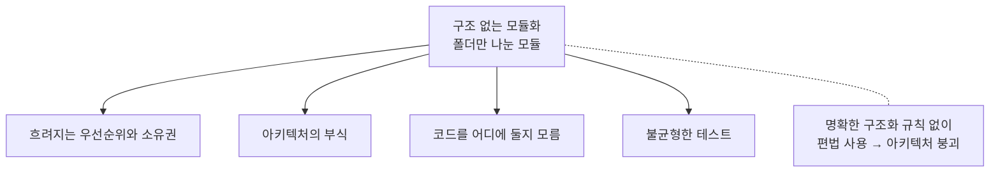
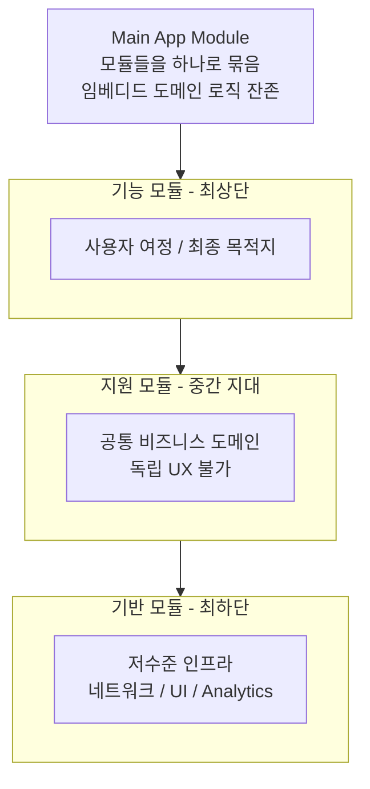
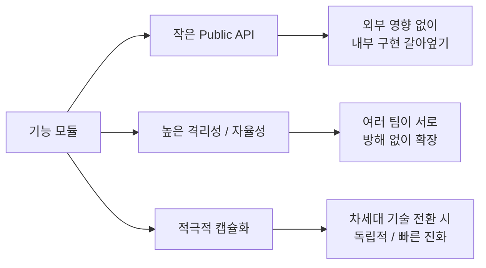
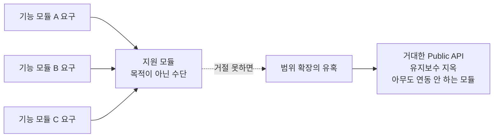
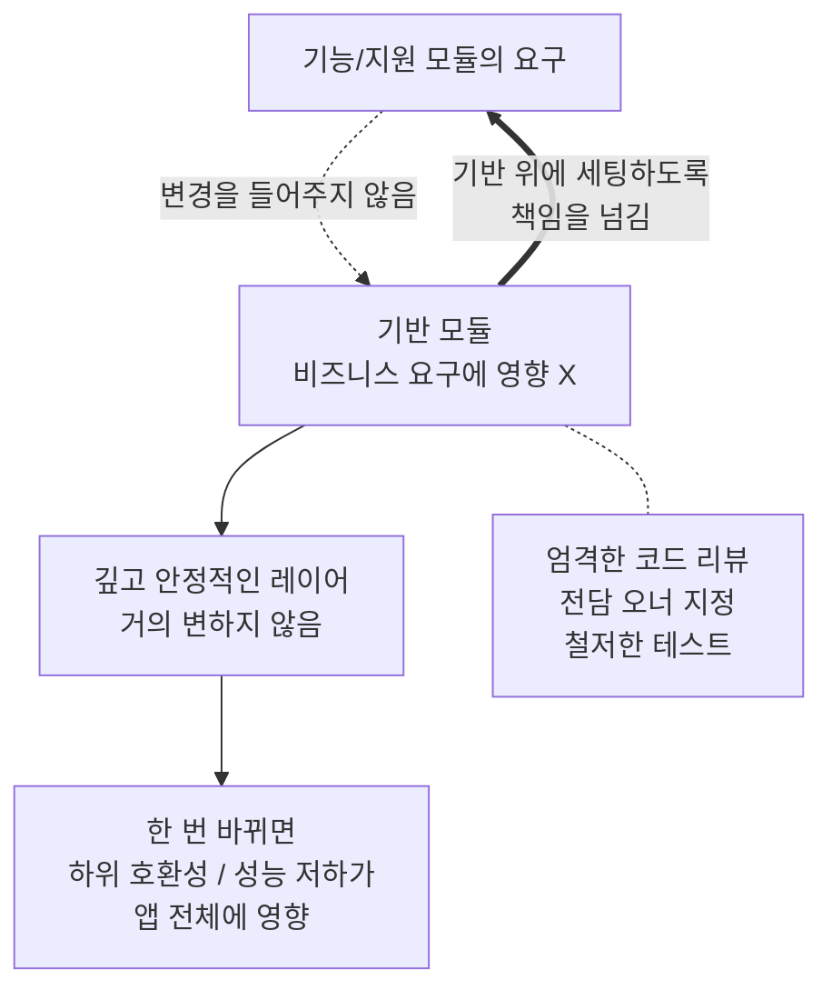
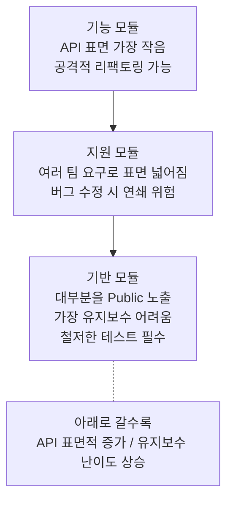
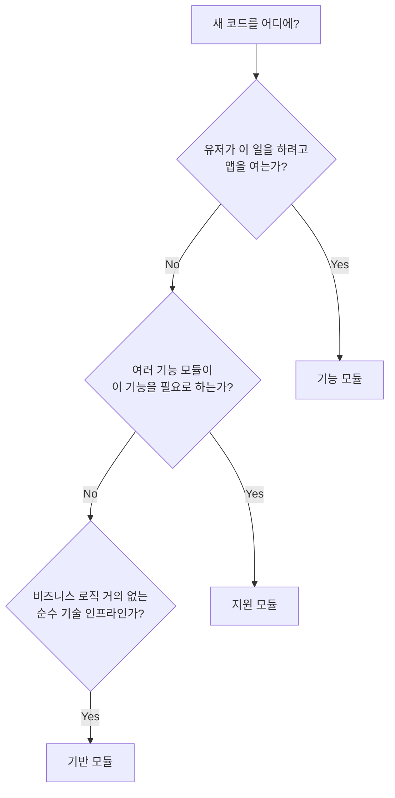
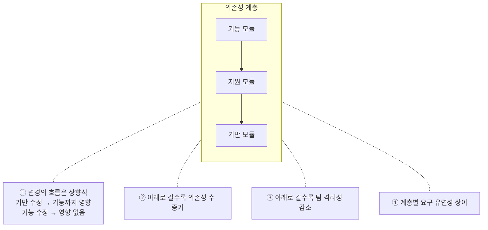
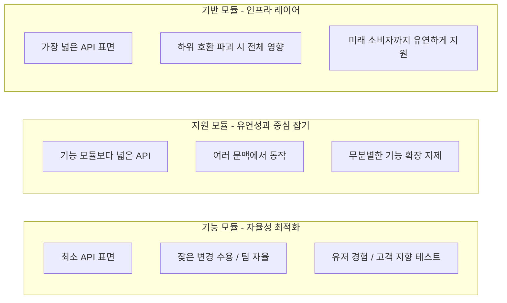

# Structuring Modules

### 구조화되지 않은 모듈의 문제점

- 코드를 단순히 여러 폴더로 이동시키고 '모듈'이라고 부른다고 해서, 강력한 아키텍처가 자동으로 보장되는 건 아니다.

#### 흐려지는 우선순위와 소유권

- 모든 모듈이 다 똑같은 가치와 레벨을 가진 것처럼 보이면, 어떤 모듈을 건드려야 안전하고 어떤 모듈을 건드리면 안 되는지 분간할 수 없게 된다.
- 예를 들어, 여러 모듈이 의존하고 있는 `SharedUtils` 모듈을 수정해야 하는 상황이 발생하면, 의존하고 있는 다른 코드에서 오류가 생기지 않을까 무서워서 건드리지 못하게 된다.

#### 아키텍처의 부식

- 새 기능을 만들 때 다른 모듈을 직접적으로 의존하게 되면 나중에는 서로가 서로를 의존하는 상황이 된다.
- 따라서 경계선이 흐려지고, 새 기능을 추가할 때 어느 모듈에 추가할지 고민하게 된다.

#### 이 코드는 어디에 두어야 하는가?

- 코드 리뷰가 이 코드를 어디다 둬야 하는지에 대한 쓸데없는 토론으로 가득 차게 된다.

#### 불균형한 테스트

- 복잡하게 얽혀 있는 코드는 자연스럽게 테스트 코드를 짜기가 힘들어진다.
- 정작 간단한 부분은 오버 엔지니어링을 하면서, 중요한 부분은 테스트 코드가 빈약해지는 불균형이 발생한다.

#### 명확한 구조와 질서 부여하기

- 모듈화를 진행할 때 명확한 구조화 규칙을 세우지 않고, 편법을 사용하면 아키텍처가 무너진다.

### 3가지 모듈 카테고리 한눈에 보기

- 우리가 만드는 앱의 최상위에는 메인 앱 모듈이 존재하고 모듈들을 하나로 묶어주는 역할을 한다.
- 아직 모듈로 분리되지 않은 도메인 로직이 임베디드되어 있기도 하다.

#### 기능 모듈 (Feature Module)

- 유저가 앱을 켜서 달성하고자 하는 최종 목적지이자 사용자 여정을 담당하는 독립적인 모듈
- 의존성 그래프의 최상단(메인 앱 모듈 바로 하단)에 위치

#### 기반 모듈 (Foundation Module)

- 기능 모듈이 원활하게 작동할 수 있도록 도와주는 저수준 인프라 모듈
- 공통 네트워크 스택, UI 라이브러리, Analytics 라이브러리 등
- 의존성 그래프의 최하단에 위치

#### 서포트 모듈 (Support Module)

- 여러 기능 모듈이 공통으로 필요하지만, 독립적인 유저 경험이 될 수 없는 중간 지대의 핵심 비즈니스 도메인 모듈
- UI가 없는 생체 인증 모듈, A/B 테스팅 모듈 등이 이에 해당
- 의존성 그래프의 중간 영역에 해당

#### 해당 카테고리들이 중요한 이유

- 해당 구조가 잡히지 않으면 팀의 규모가 커질 때 아키텍처가 무너진다.
- 카테고리가 잡히면 모듈의 성격에 따라 엔지니어링 리소스를 투자하는 방식이 달라진다.

### 기능 모듈: 사용자 중심의 자율성

#### 설계 원칙

- 기능 모듈은 유저가 앱을 켜서 달성하고자 하는 기능 단위의 모듈. 다른 모듈에서 재사용될 필요가 없음
- 공용 API를 작게 유지하고, 내부 구현을 마음대로 바꿀 수 있는 자율성을 가짐

#### 자율성과 확장성

- API를 작게 유지하면, 외부에 영향을 주지 않고 모듈 내부를 갈아엎을 수 있음
- 높은 격리성으로 인해 여러 기능 팀이 서로의 작업을 방해하지 않고 확장할 수 있음
- 인프라 모듈의 경우 하나만 바뀌어도 이를 의존하는 모든 모듈의 동작이 깨지지 않음을 확인해야 함

#### 변화를 적극적으로 수용하는 기능 모듈

- 기능 모듈은 아키텍처 변화에 가장 취약함
- SwiftUI나 Compose처럼 다음 세대 기술로 대체되면 전체 플로우를 다시 짜야 함
- 적극적인 캡슐화를 통해 이득을 얻어야 함. 그래야 다음 업데이트가 있을 때, 다른 곳을 망가뜨리지 않고 독립적이고 빠르게 진화할 수 있음

### 지원 모듈: 기능 모듈의 조력자

#### 지원 모듈 vs 기능 모듈

- 지원 모듈은 목적이 아닌, 목적을 이루기 위한 수단을 담음
- 여러 기능 모듈의 요구사항을 충족해야 하기 때문에 범용적이어야 함

#### 통합 과제

- 지원 모듈은 이를 쓰는 기능 모듈의 요구를 계속 들어주게 됨
- 따라서 계속해서 범위를 확장하고 싶은 유혹에 빠지지만, 줏대를 가지고 수많은 요청을 거절할 수 있어야 함
- 만약 그렇지 않다면, 지나치게 범용적이고 거대한 Public API가 만들어져 유지보수 지옥에 빠짐
- 너무나 범용적인 API를 만들어버리면 아무나 건드리지 못하도록 추상화한 결과, 누구도 연동하기 싫어하는 모듈이 됨

### 기반 모듈: 인프라 계층

#### 기반 모듈 vs 지원 모듈

- 기반 모듈은 지원 모듈과 다르게 비즈니스 요구사항에 영향을 받지 않음
- 요구사항을 받을 때 지원 모듈처럼 변경을 들어주는 것이 아닌, 기반 모듈을 토대로 세팅하도록 책임을 지게 함

#### 계획적인 변화

- 기반 모듈은 깊고 안정적인 레이어에 위치하여 거의 변화할 일이 없음
- 자주 안 바뀌는 대신, 한 번 바뀔 때 생기는 하위 호환성과 성능 저하 문제가 앱 전체에 영향을 줌

#### 기반 모듈의 함정

- 모든 팀이 이 모듈을 사용하는데, 새로운 코드를 짤 때 테스트도 없이 은근슬쩍 끼워 넣으면 잡동사니 서랍이 되어버림
- 엄격한 코드 리뷰와 전담 오너 지정이 필수적

#### 익명의 다수 소비자를 위한 빌드

- 기반 모듈은 오늘과 미래의 모두를 만족시켜야 함
- 따라서 범용적인 코드를 작성해서 아직 작성하지 않은 미래의 코드를 지원할 수 있게 설계해야 함

### API 표면 설계

#### 기능 모듈

- 유저 여정의 처음부터 끝까지 독점하므로 독단적으로 설계해도 됨
- 가장 Public API 표면이 작음. 따라서 공격적인 리팩토링 가능

#### 지원 모듈

- 여러 기능 모듈의 요구사항을 받기 때문에 API 표면이 넓어짐
- 여러 팀이 의존하므로 버그를 고치다가 다른 문제가 발생할 위험이 있음

#### 기반 모듈

- 대부분을 Public API로 노출함
- 여러 곳에서 가져다 쓰기 때문에 가장 유지보수하기 어려움. 철저한 테스트 코드 작성이 필요함

### 한 눈에 보는 모듈 분류 가이드

- 유저가 이 일을 하려고 앱을 연다 → 기능 모듈
- 여러 기능 모듈에서 이 기능을 필요로 한다 → 지원 모듈
- 비즈니스 로직이 거의 없는 순수 기술 인프라다 → 기반 모듈

#### 의존성 계층 구조가 만드는 4가지 핵심 패턴

- **변경의 흐름은 상향식이다.**
    - 기반 모듈을 수정하면 기능 모듈까지 영향을 미치지만, 기능 모듈을 수정하면 다른 모듈에 영향을 미치지 않는다.
- **아래로 내려갈수록 의존성 수가 증가한다.**
    - 피쳐 모듈은 오직 최상위 app 모듈을 바라보지만
    - 지원 모듈은 여러 기능 모듈을 지원하고
    - 기반 모듈은 훨씬 많은 모듈을 지원한다.
- **아래로 내려갈수록 팀의 격리성이 감소한다.**
    - 기능팀은 독립적이고 자율적으로 일할 수 있지만, 지원/기반 모듈은 다른 팀과의 조율이 필요하다.
- **계층별로 요구되는 유연성 패턴이 다르다.**
    - 기능 모듈: 특정 유즈케이스에 맞춘 독단적인 구조를 가질 수 있다.
    - 지원 모듈: 구체적인 도메인 지식과 재사용성 사이에 균형을 잡아야 한다.
    - 기반 모듈: 특정 기능에 치우치지 않고 범용성을 최우선으로 가진다.

### 정리

#### 구조 없는 모듈화의 폐해

- 마음대로 고쳐도 되는 안전한 모듈과, 절대 건드리면 안 되는 핵심 인프라 모듈이 구분되지 않음
- 마감이 다가오면 지름길을 택해서 모듈 간의 경계를 무너뜨림
- 모듈의 명확한 목적과 오너십이 없으면 코드를 어디다 넣어야 되는지 시간만 낭비함
- 정작 꼼꼼해야 할 컴포넌트에는 테스트를 작성하기 힘들어, 테스트 코드가 적어짐

#### 세 가지 모듈 카테고리의 역할 정리

- **기능 모듈: 자율성에 최적화**
    - 최소한의 API 표면적으로 잦은 변경을 수용하고 팀이 자율적임
    - 유저 경험과 고객 지향적 테스트에 집중
- **지원 모듈: 유연성과 중심 잡기의 균형**
    - 여러 기능 팀의 요구사항을 받아내야 하므로 API 표면적이 기능 모듈보다 넓어짐
    - 서로 다른 기능 문맥에서도 돌아가야 하지만 무분별한 기능 확장을 자제해야 함
- **기반 모듈: 인프라 레이어**
    - 가장 넓은 API 표면적을 가지고 있음
    - 하위 호환성 파괴나 버그 발생 시 앱 전체에 영향을 미쳐 조심스럽게 관리해야 함
    - 아직 작성되지 않은 미래의 소비자가 어떤 코드를 짜더라도 연동할 수 있도록 유연하게 짜야 함
