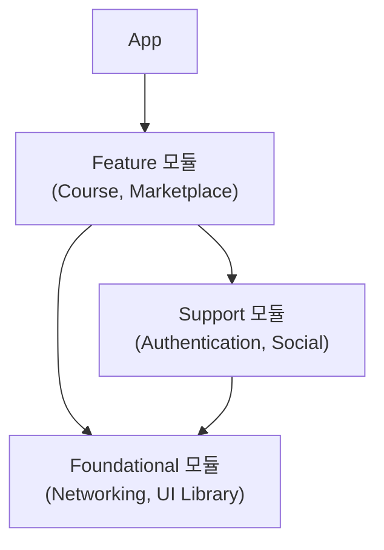
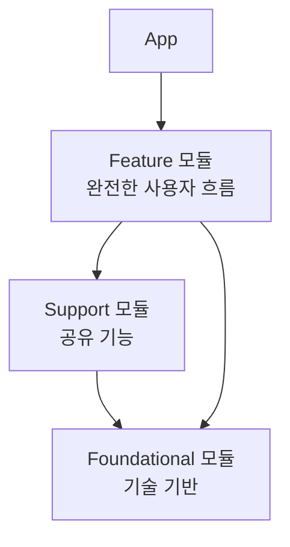

# [WEEK 05] Chapter 9
📖 Mobile System Design 2. Large-Scale Codebases & Design Systems  

 

## 9. Module Categories and System Structure
> 모듈을 나눌 때 중요한 것은 개수가 아니라, 각 모듈이 어떤 책임을 맡는지이다.  

### The problems of unstructured modules

코드를 모듈로 옮기면 처음에는 구조가 좋아 보인다.  
폴더가 정리되고 빌드 타깃도 작아진다.  
하지만 기준 없이 나뉜 모듈은 시간이 지날수록 monolith보다 다루기 어려워질 수 있다.  

#### Blurred priorities

모든 모듈이 비슷해 보이면 어디를 바꿔야 하는지 판단하기 어렵다.  
간단해 보이는 `StringUtils`도 여러 모듈이 의존하고 있다면 작은 수정이 큰 영향으로 이어질 수 있다.  

소유권도 흐려진다.  
여러 팀이 `SharedModels` 같은 모듈에 타입을 계속 넣으면, 누구도 명확히 책임지지 않는 공용 모듈이 된다.  

#### Eroding architecture

처음에는 모듈 구조가 좋아 보여도 마감 기한이 가까워지면 임시 우회가 생긴다.  
필요한 데이터를 얻기 위해 모듈 경계를 우회하거나, 위치가 애매한 타입을 복사해서 넣을 수 있다.  

이런 일이 반복되면 Shopping, Commerce, Payments 같은 **경계가 흐려진다**.  
작은 기능 하나를 추가할 때도 코드를 어디에 둬야 할지 판단하기 어려워진다.  

#### In which “box” does code go?

모듈의 목적이 불분명하면 코드 위치를 정하는 데 시간이 많이 든다.  
코드 리뷰가 “이 코드는 Utils인가 Helpers인가” 같은 논쟁으로 바뀔 수 있다.  

널리 쓰이는 모듈을 여러 사람이 동시에 수정하면 팀 간 충돌도 늘어난다.  

#### Unbalanced testing

테스트도 균형을 잃을 수 있다.  
간단한 버튼 컴포넌트는 과하게 테스트하면서, 모두가 의존하는 authentication 모듈은 복잡하다는 이유로 테스트가 부족할 수 있다.  

결국 단순한 부분은 과하게 설계하고, 중요한 부분은 충분히 검증하지 못하는 상태가 된다.  

#### Adding structure

문제는 모듈화 자체가 아니다.  
문제는 **모듈을 나누고도 각 모듈의 `역할`, `책임`, `변경 기준`을 정하지 않는 것**이다.  

모든 모듈에 같은 기준을 적용할 수는 없다.  
어떤 모듈은 안정성이 중요하고, 어떤 모듈은 재사용성이 중요하며, 어떤 모듈은 빠른 변경이 더 중요하다.  

---

### The Three Categories at a Glance

모듈을 세 가지 분류로 나누면 각 모듈의 역할과 기대치가 더 분명해진다.  
app은 가장 위에서 feature와 모듈을 연결한다.  
아직 추출되지 않은 도메인 코드도 app 안에 남아 있을 수 있다.  

| 분류        | 핵심 설명                           | 의존 관계                                     | 예시                                |
| --------------- | ------------------------------- | ----------------------------------------- | --------------------------------- |
| Feature 모듈      | 사용자가 직접 수행하는 하나의 흐름을 소유한다       | 다른 모듈을 사용하지만, 다른 feature가 직접 의존하는 대상은 아니다 | Course, Marketplace               |
| Support 모듈      | 여러 feature가 함께 쓰는 비즈니스 기능을 제공한다 | 여러 feature가 의존한다                          | Authentication, Social            |
| Foundational 모듈 | 여러 모듈이 의존하는 기술 기반을 제공한다         | 자신은 도메인 전용 로직에 거의 의존하지 않는다    | Networking, UI Library, Analytics |

> [!Note]
> Android에서 흔히 쓰는 `feature`, `domain`, `data`, `core`는 코드 레이어 기준이다.  
> 여기서의 Feature, Support, Foundational은 앱 전체에서의 역할 기준이다.  
> 특히 `data/network`에 있다는 이유만으로 모두 foundational 모듈이 되는 것은 아니다.  

#### Feature modules

> 사용자가 직접 수행하는 하나의 흐름을 소유한다.  
  
Course나 Marketplace처럼 “강의를 본다”, “상품을 구매한다”처럼 이해되는 기능이 여기에 해당한다.  

Feature 모듈을 제거하면 하나의 사용자 흐름이 사라진다.  
하지만 app의 나머지 영역은 계속 동작할 수 있다.  

#### Foundational modules

> 여러 모듈이 의존하는 기술 기반을 제공하는 모듈  

networking stack, UI component library, analytics framework, 공통 utility가 여기에 해당한다.  

비즈니스 로직은 거의 없다.  
analytics나 범용 networking stack은 사용자가 app을 여는 목적이 아니므로 feature 모듈로 보지 않는다.  

> [!Note]
> `Core`, `Base`, `Platform` 모듈이라고 부를 수도 있다

#### Support modules

> 여러 feature가 함께 쓰는 비즈니스 기능을 제공하는 모듈  

Authentication이나 Social처럼 feature를 가능하게 하는 기능이 여기에 가깝다.  
비즈니스 로직과 도메인 복잡도는 있지만, 사용자의 최종 목적은 아니다.  

#### Why these categories matter

분류를 잘못 나누면 app이 커질수록 설계 비용이 커진다.  
Social을 feature 모듈로 볼지 support 모듈로 볼지는 API 설계, 테스트 전략, 팀 작업량에 영향을 준다.  

모듈 분류는 어디에 시간을 더 써야 하는지 알려준다.  
각 분류는 안정성, API, 소유권, 테스트에서 서로 다른 기준을 가진다.  

---

### Feature Modules: User-Facing Autonomy

Feature 모듈은 사용자가 app에서 직접 마주하는 영역이다.  
따라서 UX, 오류 처리, 사용자 관점의 테스트에 더 신경 써야 한다.  

#### Design principles

> Feature 모듈은 범용성보다 해당 사용자 흐름에 맞는 명확한 설계가 중요하다.  

Feature 모듈은 과하게 범용적일 필요가 없다.  
Marketplace는 browsing과 purchasing 흐름을 잘 제공하면 되고,  
Course는 Course 흐름을 잘 제공하면 된다.  

Course 모듈을 여러 상황에 맞게 과하게 설정 가능하게 만들 필요는 없다.  
사용 방식이 분명하다면 좁은 API로 설계하는 편이 낫다.  

#### Autonomy and Scaling

> 작은 공개 API는 내부 변경을 자유롭게 만들고 팀의 독립성을 높인다.  

공개 API가 작으면 모듈 내부를 크게 바꿔도 외부 영향이 작다.  
Course 모듈의 데이터 계층을 다시 만들거나 UI framework를 바꿔도 공개 인터페이스만 안정적이면 app은 영향을 덜 받는다.  

Feature 모듈은 팀이 독립적으로 작업하기 좋은 단위이다.  
각 feature 팀은 서로의 작업을 크게 방해하지 않고 자기 영역을 바꿀 수 있다.  

#### Feature modules embrace change

> 변화가 잦은 영역이므로 내부 구현을 캡슐화해 빠르게 바뀔 수 있어야 한다.  

Feature 모듈은 변화가 자주 일어나는 영역이다.  
디자인 변경, 제품 결정, platform UI 변화는 대부분 feature 팀이 직접 받아들인다.  

그래서 **feature 모듈은 강하게 캡슐화**되어야 한다.  
큰 platform 변화가 와도 각 feature 모듈이 독립적으로 빠르게 바뀔 수 있어야 한다.  

---

### Support Modules: The Enablers Behind Features

Support 모듈은 feature를 가능하게 만드는 모듈이다.  
**여러 feature가 함께 쓰는 기능을 제공**하면서도 **비즈니스 로직과 도메인 지식**을 가진다.  

app이 커질수록 support 모듈은 더 자주 나타난다.  

#### Support vs feature modules

> 사용자가 직접 하려는 일인지, 다른 feature 흐름을 돕는 기능인지로 구분한다.  

Support 모듈은 feature 모듈처럼 보일 수 있어서 구분이 어렵다.  
Social 모듈은 UI가 있는 기능을 가질 수 있지만, 사용자는 “course 완료를 공유한다”라고 생각한다.  

공유 기능은 사용자가 app을 여는 이유라기보다, 다른 feature 흐름을 도와주는 수단에 가깝다.  
Marketplace와 Course가 모두 Social을 사용한다면 Social은 support 모듈에 더 가깝다.  

> [!Note]
> 비즈니스 로직이 많고 여러 feature가 함께 사용한다면 support 모듈일 가능성이 크다.  

#### Integration challenges

> 여러 feature의 요구를 모두 받아들이면 범위와 공개 API가 빠르게 커진다.  

Support 모듈은 여러 feature의 요구를 동시에 받는다.  
Course 팀, Marketplace 팀, Subscriptions 팀이 같은 Social 모듈에 서로 다른 요구를 할 수 있다.  

요청을 모두 받아들이면 범위가 계속 커지고 공개 API도 커진다.  
Support 모듈 담당자는 **어떤 사용 사례를 지원**하고 **어떤 요청은 거절**할지 결정해야 한다.  

너무 범용적인 모듈도 통합하기 어렵다.  
Payments 모듈은 모든 거래를 처리하는 추상 처리기보다, 실제 팀들이 필요한 결제 유형을 명확히 지원하는 쪽이 낫다.  

---

### Foundational Modules: The Infrastructure Layer

Foundational 모듈은 app의 기반이다.  
이 모듈은 feature나 support 모듈보다 변경에 더 신중해야 한다.  
실패가 여러 feature로 퍼질 수 있고, 잘못된 API 결정이 app 전체에 오래 남을 수 있기 때문이다.  

> [!Note]
> 비즈니스 로직은 거의 없고, 여러 모듈이 의존하는 **기술적 기반을 제공**한다.  

#### Foundational vs support modules

> 도메인 전용 비즈니스 로직을 알기 시작하면 foundational보다 support에 가까워진다.  

Foundational 모듈과 support 모듈은 둘 다 여러 곳에서 재사용되기 때문에 경계가 헷갈릴 수 있다.  
가장 큰 차이는 도메인 전용 비즈니스 로직을 갖는지 여부이다.  

**Foundational**
- Networking 모듈이 범용 HTTP request, response parsing, 오류 처리만 제공

**Support에 가까워짐**
- `/api/courses`, `/api/payments` 같은 도메인 전용 endpoint나 보안 규칙 알기 시작

분류는 모듈 안에 무엇을 넣을지 결정하는 기준이 된다.  
Foundational 모듈은 **범용적으로 유지**하고, 도메인 전용 로직은 사용하는 쪽에서 책임지는 편이 맞다.  

#### Change is more planned

> 변경 빈도는 낮지만, 한 번 바뀌면 여러 feature에 영향을 줄 수 있다.  

Foundational 모듈은 feature 모듈보다 더 안정적인 layer에 있다.  
gesture navigation, design trend, onboarding A/B test 같은 변화와는 거리가 멀다.  

대신 플랫폼, 언어, 보안 업데이트나 성능 최적화 같은 변화에 영향을 받는다.  
이런 변화는 사용자 피드백보다 더 계획된 주기로 발생한다.  

변경 빈도가 낮다고 위험이 작은 것은 아니다.  
Analytics나 이미지 로딩 라이브러리의 호환성 변경은 여러 feature에 한 번에 영향을 줄 수 있다.  

#### A warning on foundational modules

> 어디서나 import되기 때문에 검증되지 않은 코드가 모이는 곳이 되기 쉽다.  

Foundational 모듈은 어디서나 import되기 때문에 아무 코드나 모이는 곳이 되기 쉽다.  
`Fundamentals`가 이미 import되어 있다는 이유로 검증되지 않은 코드가 계속 들어올 수 있다.  

Foundational 모듈에 코드를 추가할 때는 feature 코드보다 더 신중하게 리뷰해야 한다.  
전담 담당자가 변경을 평가하고 품질 기준을 유지하는 것이 중요하다.  

#### Building for unknown consumers

> 현재 feature뿐 아니라 미래의 다양한 사용처까지 견딜 수 있어야 한다.  

Foundational 모듈은 현재 feature뿐 아니라 미래의 사용처까지 고려해야 한다.  
그래서 범용적이고 재사용 가능한 코드를 설계하는 역량이 더 중요하다.  

Feature 모듈은 특정 화면과 흐름을 전제로 구체적으로 설계할 수 있다.  
반면 foundational 모듈은 text field, money type, networking layer처럼 다양한 방식으로 쓰일 수 있어야 한다.  

---

### API Surface Design

API surface는 모듈이 외부에 노출하는 모든 것이다.  
- 작으면 변경하기 쉽다.  
- 크면 유연성은 늘지만 안정성 관리 비용도 커진다.  

| 분류              | API surface 경향 | 이유                         |
| --------------- | -------------- | -------------------------- |
| Feature 모듈      | 가장 작음          | 특정 사용자 흐름을 직접 소유한다         |
| Support 모듈      | 중간             | 여러 feature의 사용 사례를 지원해야 한다 |
| Foundational 모듈 | 가장 큼           | 다양한 사용처와 미래 확장을 고려해야 한다    |

#### Feature modules

Feature 모듈은 사용자 흐름을 처음부터 끝까지 소유하므로 사용 방식을 좁게 잡아 설계할 수 있다.  
UI layout, navigation flow, 오류 처리, 비즈니스 규칙 대부분은 internal로 숨길 수 있다.  

보통 app이 직접 사용하는 모듈이기 때문에 변경 위험도 낮다.  
대신 특정 사용 사례에 맞춰져 있으므로 재사용성은 낮을 수 있다.  

#### Support modules

Support 모듈은 여러 feature를 지원해야 하므로 feature 모듈보다 API surface가 넓다.  
Social 모듈은 Marketplace, Course, Chat 같은 feature마다 다른 공유 동작을 지원해야 할 수 있다.  

여러 팀이 의존하므로 변경 위험도 더 크다.  
각 feature flow 안에 들어가기 때문에 화면 전환, 오류 처리, 사용자 맥락을 함부로 가정하기 어렵다.  

#### Foundational modules

Foundational 모듈은 세 분류 중 공개 API가 가장 넓은 편이다.  
UI Library는 여러 view와 component를 공개하고, Utils는 formatter나 extension을 많이 제공할 수 있다.  

아래 layer에 있기 때문에 버그도 넓게 퍼진다.  
`CustomButton`을 바꾸면 모든 view가 혜택을 받을 수 있지만, 버그도 함께 퍼질 수 있다.  

---

### The complete picture

세 분류를 함께 보면 의존성 계층이 보인다.  
위로 갈수록 사용자 기능에 가깝고, 아래로 갈수록 여러 모듈이 의존하는 기반에 가깝다.  

간단한 분류 기준은 다음과 같다.  

| 질문 | 분류 |
|---|---|
| 사용자가 app에서 직접 하려는 일인가? | Feature 모듈 |
| 여러 feature가 함께 필요로 하는 기능인가? | Support 모듈 |
| 비즈니스 로직이 거의 없는 기술 기반인가? | Foundational 모듈 |

변경 영향은 아래에서 위로 퍼지기 쉽다.  
foundational 모듈을 바꾸면 여러 feature에 영향이 갈 수 있지만, feature 모듈 변경은 보통 시스템 전체 영향이 작다.  

의존성 수는 아래로 갈수록 많아진다.  
팀 분리는 위로 갈수록 쉬워지고, 아래로 갈수록 조율과 신중한 절차가 더 필요하다.  

---

### What we covered

- 구조 없이 나뉜 모듈은 우선순위, 소유권, 테스트 균형을 흐리게 만든다.
- `Feature 모듈`
	- 완전한 사용자 흐름을 소유하고 의존성 계층의 위쪽에 있다.
	- 작은 API와 강한 캡슐화로 자율성을 얻는다.
- `Support 모듈`
	- 여러 feature가 함께 쓰는 비즈니스 기능을 제공한다.
	- 유연성과 범위 관리 사이의 균형이 필요하다.
- `Foundational 모듈`
	- 비즈니스 로직이 거의 없는 안정적인 기술 기반이다.
	- 모듈은 가장 신중하게 설계하고 테스트해야 한다.
- 모듈 분류는 API surface, 테스트, 소유권, 팀 작업량을 결정하는 기준이 된다.

---

### Android 레이어와 책 기준 비교

| Android식 모듈/코드                 | Android 레이어 관점    | 책 기준 판단                      | 이유                                                                               |
| ------------------------------ | ----------------- | ---------------------------- | -------------------------------------------------------------------------------- |
| `:feature:course`              | feature           | Feature 모듈                   | 사용자가 직접 수행하는 Course 흐름을 소유한다                                                     |
| `:domain:auth`                 | domain            | Support 모듈 가능                | 로그인 상태, 권한, 세션을 여러 feature가 함께 쓴다                                                |
| `:core:ui`                     | core              | Foundational 모듈              | 여러 화면과 feature가 의존하는 UI 기반이다                                                     |
| `RetrofitClient`, 공통 오류 파서     | data/core network | Foundational 모듈              | 특정 도메인을 모르고 HTTP 통신 기반만 제공한다                                                     |
| 여러 도메인의 서버 API를 한 인터페이스에 모은 코드 | data/network      | 여러 역할이 섞인 API 경계             | `/login`, `/members`, `/trainers`처럼 각 도메인의 API를 직접 알고 있어 순수 foundational로 보기 어렵다 |
| 인증/세션 API                      | data/network      | Support 모듈 성격                | 인증과 세션은 여러 feature가 함께 쓰는 비즈니스 기능이다                                              |
| 특정 도메인 API                     | data/network      | Feature 또는 support 쪽으로 분리 후보 | 특정 사용자 흐름이나 공유 비즈니스 기능에 묶인 API이다                                                 |