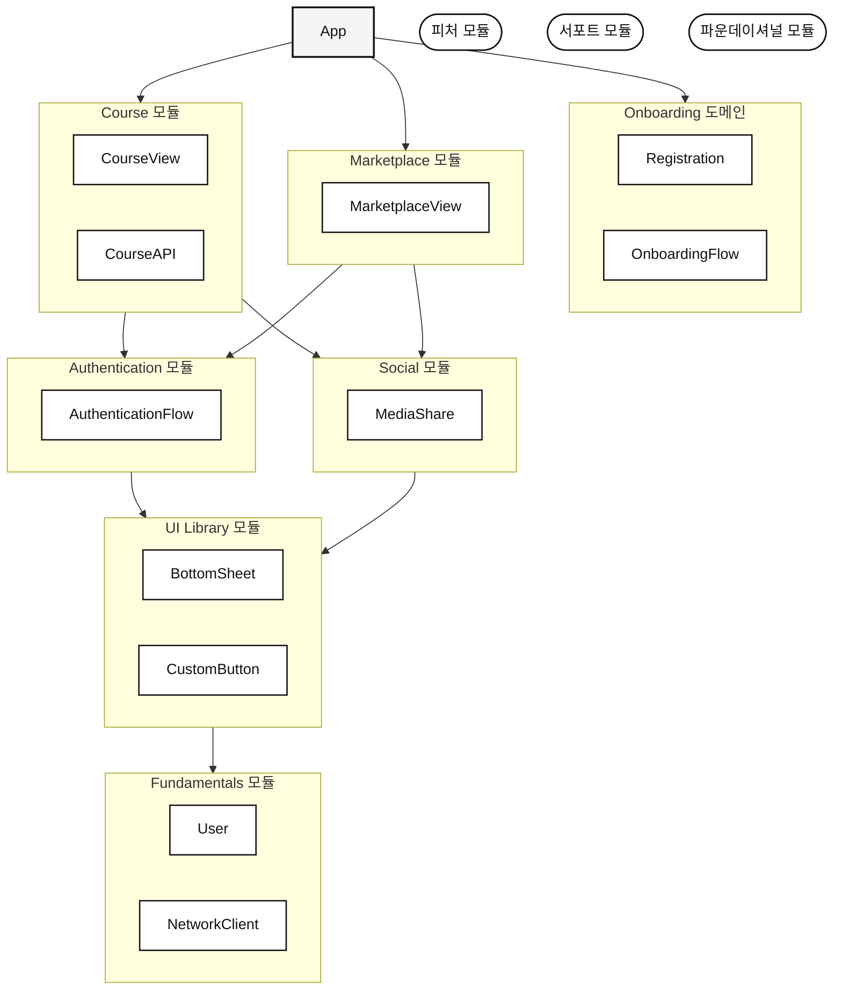
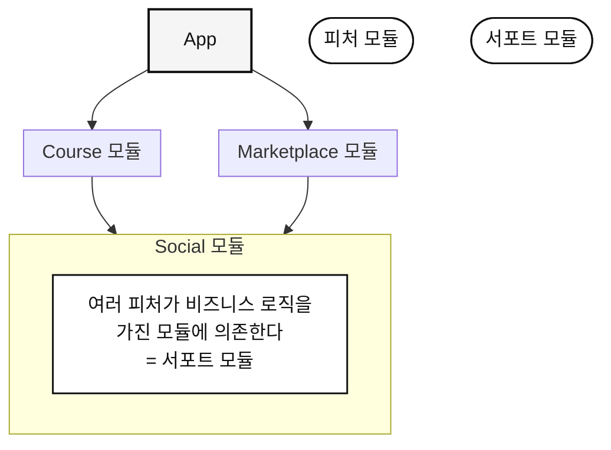
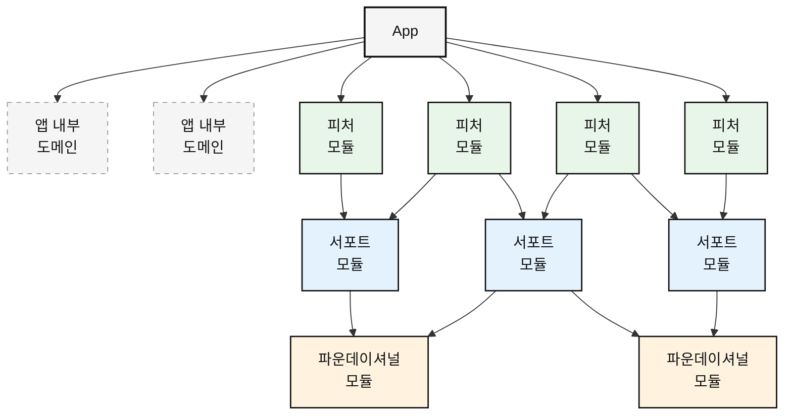

# 9장 모듈 카테고리와 시스템 구조
- 기술 스택, 아키텍처 취향 상관 없이 모든 프로젝트에 적용 가능한 멘탈 모델을 알아본다.
- 개발자와 팀이 모듈화된 환경에서 "제대로" 협업하는 방법을 알아본다.

## 구조없는 모듈의 문제
- 단순히 코드를 폴더에 옮기고, 모듈이라고 불렀다고 해서 강한 아키텍처를 자동으로 보호받는게 아니다.
- 역할없이 모든 모듈을 동등히 여기면 시스템은 결국 무너진다.

### 우선순위가 흐려진다
- 모든 모듈이 똑같으면 어느 것을 안전하게 바꿀 수 있는지 알 수 없다.
	- 한 모듈에 여러 모듈이 의존하면, 그것을 변경하기 두려워진다.

- 한 모듈에 모든 팀에 진입하여 자신들만의 타입을 던져넣으면, 매우 커진다.
	- 아무도 소유하지 않고, 모두가 의존한다.
	- 당연히 지우는 것이 누군가의 기능을 망가뜨릴 수 있으니 두려워진다.

### 아키텍처가 무너진다
- 한 모듈에 어떤 데이터가 필요해서, 제대로된 경로를 거치지 않고 직접 `import` 한다.
- 결과적으로 시간이 흐르니 모두가 한 모듈에 의존하게 된다.
- 처음엔 명확한 경계가 요구사항이 발전하며 흐릿해진다.

### 코드를 어디에 넣지?
- 여러 명이 같은 `Util` 모듈을 건드리며 함께 수정한다.
- 누군가 변경하면 여러 사람이 영향을 받는다.

### 불균형한 테스트
- 간단한 컴포넌트는 꼼꼼하게 테스트하지만, 많은 것이 의존하는 인증 모듈의 경우 "복잡해서" 혹은 "다른사람이 한다" 는 이유로 최소한의 커버리지만 있다.
- **간단한 부분은 과잉 엔지니어링, 핵심 부분은 과소 엔지니어링 한다.**

- 이러한 문제들 때문에 구조없이 모듈러 아키텍처를 하면 안된다는 것이다.
	- 모듈이 어떤게 안정적이어야 하는지, 어떤게 더 제네릭해야 하는지, 어떤게 더 단순해야 하는지 알아보자.

## 세 가지 카테고리 한 번에 보기

### 앱
- 아키텍처 가장 위에는 앱이 있다.
- "모든 것을 볼 수 있고" 피처나 모듈, 기타 요소를 조합한다.
- 모듈로 추출되지 않은 도메인이 있을 수 있다.

### 피처 모듈
- 앱과 사용자에게 필요한 독립적 가치를 제공한다.
- "강의" 라는 피처 모듈은 고객이 강의를 둘러보고 싶기에 만들어진 모듈이다.
- 이에 기반이 되는 결제나 인증에 대해서는 생각하지 않는다.
	- 그것은 단순히 목적을 위한 수단일 뿐이다.

### 파운데이션 모듈
- 의존성 그래프에서 가장 아래에 위치한다.
- 피처 모듈에는 UI 컴포넌트, 네트워킹 등 다른 부분들이 필요하다.
	- 그것을 담당하는게 파운데이션 모듈이다.
	- 모든 것이 의존하는 안정적 기반을 형성한다.

- 스스로는 의존성이 거의 없거나 전혀 없지만, 때때로는 다른 파운데이셔널 모듈에 의존한다.
	- e.g. `UI Library` -> `Fundamentals` 모듈

- 모듈을 최소한 피처와 파운데이셔널 모듈로 소규모와 중규모 앱에서 잘 동작한다.
	- 피처 팀과 코어 팀,.. 요런 방식으로 나눌 수 있다.

### 서포트 모듈
- 앱과 복잡도가 커지면 고려해야 할 모듈이 하나 더 있는데, 그것이 서포트 모듈이다.
- 여러 피처를 필요로 하지만, 그 자체로는 사용자 경험을 완전하게 만들 수 없는 모듈이다.
- `Authentication` 을 예로 들면, 생체 인증이나 핀패드같은 방식으로 사용자를 인증하는 모듈이다.
- 서포트 모듈은 의존성 그래프에서 중간에 위치한다.

### 카테고리가 왜 중요한가
- 단순히 모듈을 잘 분리하면 되는 것이 아닌가? 라고 생각할 수 있다.
	- `Social` 을 피처라 부르든, 서포트라 부르든 중요한가?

- 앱의 규모가 커지면 중요해진다.
	- 각 카테고리는 근본적으로 다른 설계 요구사항이 있기 때문이다.
	- 이것이 팀이 시간을 투자하는 방향을 결정한다.

## 피처 모듈
- 사용자가 앱을 열어 무언가를 하려고 한다면, 그것이 피처 모듈이다.
- UI, 포괄적인 오류 핸들링, 사용자 중심 테스팅을 포함한다.
- 보통은 사용자가 실제로 상호작용 하는 것이다.

### 설계 원칙
- 기본적으로 다른 앱에서 재사용하는 것을 고려하지 않는다.
- `public` API 를 여러 개 만들지 않고, 이 모듈을 사용하는 방법은 "하나 뿐" 이라고 말하는 것이 좋다.

### 자율성과 확장
- `public` API 가 적으면 모듈 내부를 마음껏 수정할 수 있다.
	- 내부에서 무슨 일이 일어나는지 사용자는 신경쓰지 않는다.
- 명확한 경계를 만들어 팀간 소유권을 명확하게 하여 갈등을 줄이고 자율적 작업을 가능케 한다.

### 변화를 받아들인다
- 피처 모듈은 가장 변화가 많이 발생하는 레이어다.
- UI 툴이 업데이트되든, 아키텍처가 업데이트되든 이에 따라 모든 피처가 변경사항을 업데이트해야 한다.
- 피처 모듈은 공격적인 캡슐화를 통해 이러한 상황에서 혜택을 받는다.
- 독립적으로, 빠르게 진화할 수 있다.

## 서포트 모듈
- 여러 피처가 필요로 하는 문제를 해결하고, 비즈니스 로직과 도메인 지식을 담는다.
- 보통 앱이 성장하면서 나타나게 된다.

### 서포트 VS 피처
- 서포트 모듈은 마치 피처 모듈 같지만, 사실은 다른 모듈들에 비해 독특한 설계 과제가 주어진다.
- `Social`  모듈을 예로 들자.
	- 사용자가 강의 진도나 성취를 소셜 미디어에 공유할 수 있게 한다.
	- 뭔가를 공유하고 싶긴 하지만, 학습 앱을 열며 "소셜 공유 기능을 쓰고싶어" 라고 생각하진 않는다.
	- 단순히 "누군가에게 자랑해야지" 라고 생각한다.

- **위 메커니즘은 목표를 달성하는 수단이지, 목표 자체가 아니다.**
	- 서포트 모듈은 다른 모듈이나 앱 자체와 같이 여러 소유자를 섬길 가능성이 높다.
	- 이때문에, 서포트 모듈은 좀 더 "일반적이어야" 한다.

- 어떤 모듈이 비즈니스 로직이 많고, 여러 피처가 사용한다면 서포트 모듈이라는 좋은 징표다.

### 통합 과제
- 서포트 모듈은 피처 모듈에 의해 여러 방향으로 발전할 수 있다.
- `Social` 을 사용하는 팀이 두 개라면, 서로 사용하고자 하는 방향이 다를 수 있다.

- 주의할 점은 요청에 의해 모듈의 범위를 무분별하게 확장하는 것이다.
	- 서포트 모듈의 소유자는 뚝심을 갖고 많은 요청에 `NO` 라고 대답해야 한다.
	- 어떤 것을 지원하고, 어떤 것을 불허할지 어려운 결정을 내려야 한다.
- 명확한 소유권이 없으면 모든 요청을 만족시키려다 비대해진다.

- 해당 모듈의 도메인을 깊이 이해하고, 팀들이 실제로 필요할만한 것들을 파악해야 한다.
	- 너무 경직되지도 않고, 너무 일반적이지도 않은 모듈을 만드는 것이 목표다.
	- 이는 서포트 피처팀의 개발자가 많은 팀의 개발자와 대화해야 함을 의미한다.
	- 여러 사람들과 잘 협력해야 한다.

## 파운데이셔널 모듈
- 비즈니스 로직은 거의 없고, 거의 모든 앱이 사용하는 기술적 인프라를 가진다.
- 피처 모듈, 서포트 모듈보다 더 많은 책임을 가진다.
	- 장애가 발생하면 전체 애플리케이션 범위로 확장될 수 있기 때문이다.

### 파운데이셔널 VS 서포트
- 둘 모두 재사용 가능한 코드를 가지고 있어 헷갈릴 수 있다.
- **가장 큰 차이점은 비즈니스의 개입이다.**
	- 네트워킹 모듈은 처음에 파운데이셔널하게 시작한다.
		- `HTTP` 요청, 응답 파싱 등이 그 예시다.
	- **하지만 `PaymentError`  와 같은 도메인 개념을 알기 시작하면, 그 때부턴 서포트 영역이다.**

- 네트워킹 모듈에 특정 API의 파싱을 추가한다면, 그때부턴 카테고리가 모호해진다.
- 다만 조직 구조가 판단에 영향을 줄 수 있다.
	- 피처 팀과 같은 공간과 목표를 공유한다면, 네트워킹 모듈을 서포트 모듈로 둘 수 있다.
	- 즉, 일부 도메인 지식을 흡수할 수 있다.
	- 반대로 네트워킹팀이 별도 조직에 있고 여러 제품을 지원한다면, 경직되어야만 한다.

### 변화는 더 계획적으로
- 파운데이셔널 모듈은 새 플랫폼 지원, 접근 요구사항 등의 이유로 변화한다.
- 즉, 사용자 피드백이 아닌 플랫폼의 릴리즈 사이클에 의해 변화가 발생한다.
- 파운데이셔널 모듈이 변경되면 모든 영역에 영향이 간다.
	- 그래서 파운데이셔널 모듈은 신중한 API 검토, 철저한 테스트, 보수적 진화가 필요하다.

### 경고
- 어디에나 `import` 되기 때문에, 검증되지 않은 코드가 언제든 주입될 수 있다.
- 파운데이셔널 모듈을 관리하는 사람이 반드시 있어야 하고, 리뷰 프로세스가 있어야 한다.
	- 추가 사항을 신중하게 취급해야 한다.

### 알 수 없는 소비자를 위해
- 파운데이셔널 모듈은 아직 만나지 못한 소비자를 위해 구현된다.
- 오늘, 내일, 내년 언제든 파운데이셔널 모듈을 쓸 수 있다.
- 네트워킹 레이어는 처음엔 간단한 REST  API만 처리하지만, 나중엔 그래프QL과 같은 인증도 처리해야할 수 있다.
- 존재하지 않는 미래를 생각하면서도, 깔끔하고 사용하기 쉬운 인터페이스를 제공해야 한다.

## 전체 그림

- 빠른 분류
	- 사용자가 앱을 열어 사용한다 -> 피처 모듈
	- 여러 피처가 기능이 필요하다 -> 서포트 모듈
	- 비즈니스 로직이 거의 없는 인프라 -> 파운데이셔널 모듈

- **변화는 계층 위쪽으로 흐르며, 절대 아래쪽으로 내려가지 않는다.**
- **계층을 내려갈 수록 의존하는 모듈이 더 많아진다.**
- 이 계층을 이해하면 더 나은 아키텍처 결정을 내릴 수 있다.
	- 파운데이셔널 모듈에 비즈니스 로직을 추가하자고 제안하면, 오버헤드가 나타나는 것을 이유로 거부할 수 있다.

--- 

