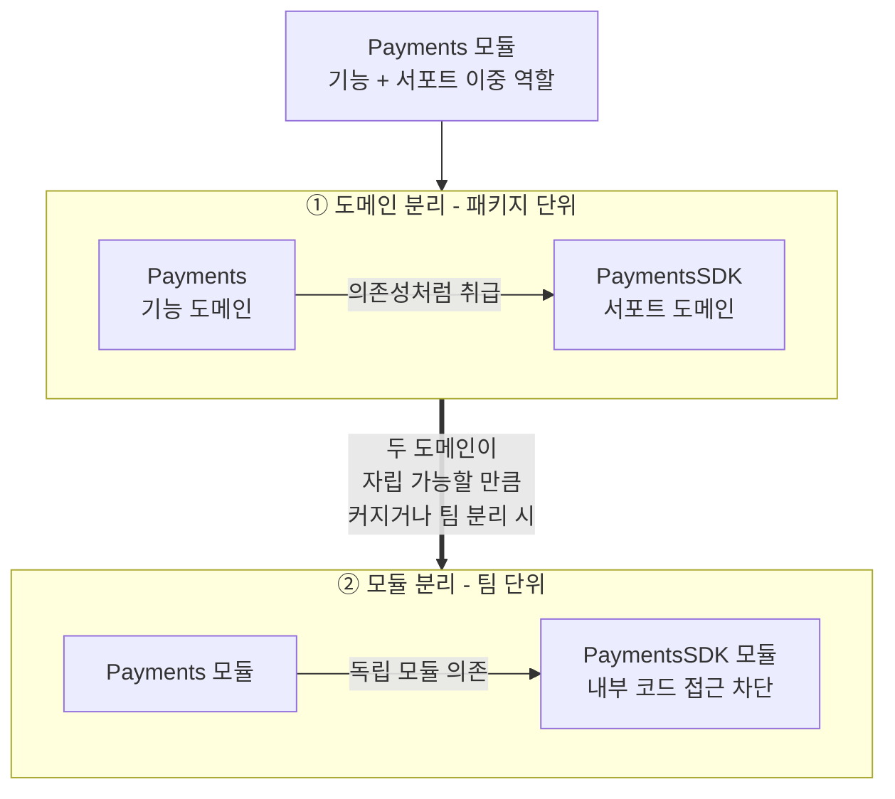
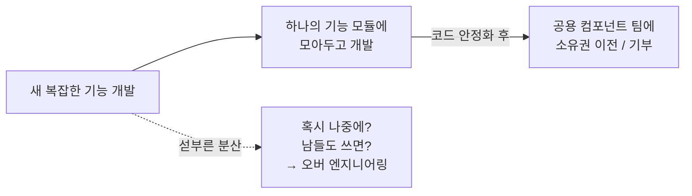
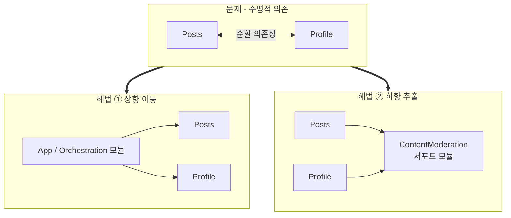
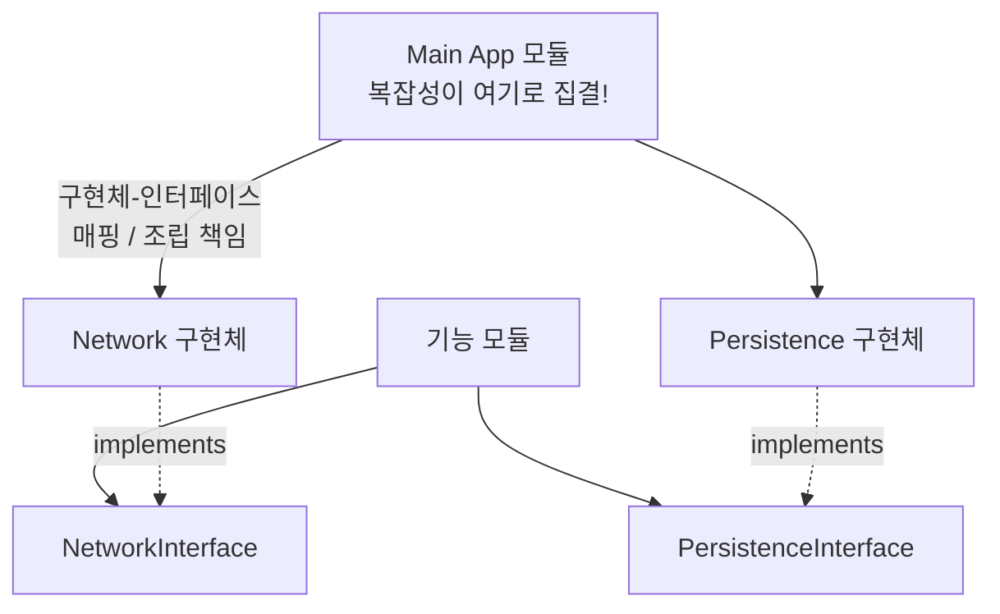
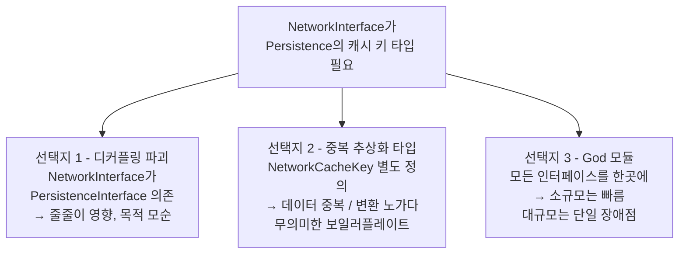
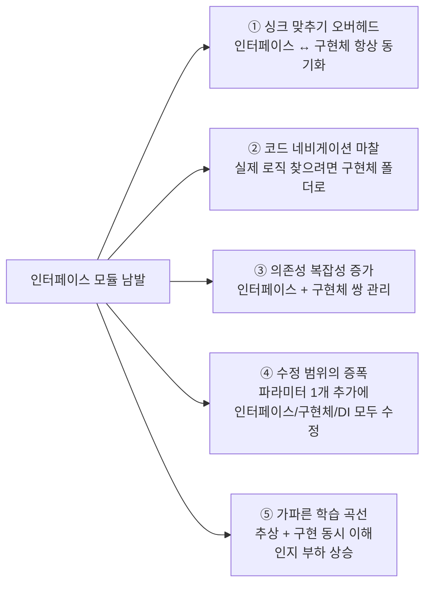
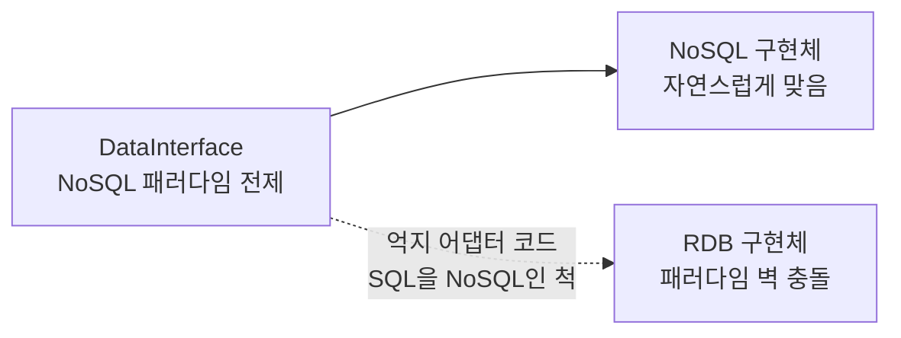
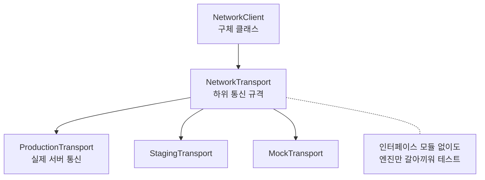
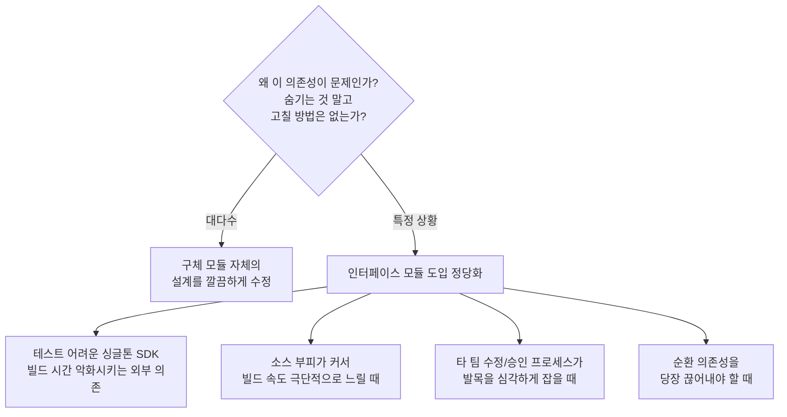

# Modular Architecture in Practice

### 이중 역할 모듈

- 어떤 모듈들은 단 하나의 카테고리에 깔끔하게 딱 맞아떨어지지 않는다.
- 가장 흔한 케이스는 기능 모듈로 작동하면서, 동시에 서포트 인프라 역할도 수행하는 모듈이다.



#### 도메인 분리하기

- 하나의 모듈이 반드시 단 하나의 도메인만 나타내야 한다는 법은 없다.
- 만약 Payments 모듈이 기능 모듈로도, 서포트 모듈로도 작동하고 있었다면
- 그 내부에 살고 있는 결제 도메인을 서포트 도메인, 기능 도메인으로 쪼갤 수 있다.
- 이 경우 상위 Payments 모듈은 PaymentsSDK 모듈을 의존성처럼 취급한다.

#### 모듈로 분리하기

- Payments 모듈이 PaymentsSDK 내부 코드에 접근할 수 없도록 하고
- 두 모듈이 점점 커짐에 따라 각각의 팀이 책임을 져야 하는 상황이 생긴다면 모듈로 분리할 수 있다.
- 해당 방법은 두 모듈이 자립할 수 있을 정도로 의미 있는 기능을 가지고 있을 때 추천한다.

### 복잡한 기능들: 한곳에 모을 것인가, 분산시킬 것인가?



- 복잡한 기능을 만들 때 모듈 코드를 하나의 모듈에 둘지, 아니면 여러 모듈로 분배할지 고민하게 된다.
- 새로 만드는 상황에서는 도메인이 명확하게 정의되기 전까지 하나의 모듈로 두는 것도 좋은 방법이다.
- "혹시 나중에 필요하지 않을까? 남들도 쓰면 좋지 않을까?"라는 가설은 오버 엔지니어링을 야기한다.

#### 개발 속도와 추진력 유지하기

- 규모가 큰 조직에서 새로운 기능을 개발한다면, 우리 팀 모듈 내에 모아두고 개발하는 것이 개발 속도와 추진력을 유지하는 비결이다.
- 만약 새로운 컴포넌트를 개발하는 상황이라면, 정석적으로 UI 라이브러리에 바로 집어넣으려면 미래를 고려한 여러 요구사항을 받게 된다.
- 이때 필요한 컴포넌트를 팀이 개발하는 기능 모듈 내에서 짜놓고, 그 상태에서 안정적이게 되면 이 코드를 공용 컴포넌트 담당 팀에게 기부하는 방식으로 소유권 이전 전략을 취할 수 있다.

### 수평적 의존성 제어하기

- 멀티 모듈 아키텍처에서 가장 까다로운 도전 과제는 동일 계층에 있는 두 모듈이 서로 소통해야 할 때 발생한다.
- 기능 모듈이나 서포트 모듈이 서로를 의존하면 순환 의존성이 발생한다.
- 서로 의존할수록 많은 도메인이 엮여 있어 모듈 추출이 훨씬 어려워진다.



#### 조율 로직을 위로 올려서 의존성을 아래로 흐르게 하기

- 두 하위 모듈을 모두 내려다볼 수 있는 상위 계층에서 조율 로직을 가지는 것이 한 방법이다. (e.g., feature 모듈을 엮는 app 모듈)
- 모듈을 깔끔하게 유지보수 가능하게 만들기 위해 의존성을 아래로 단방향으로 흐르게 해야 한다.

#### 앱 밖으로 조율 로직 밀어내기

- 조율 작업의 규모가 커진다면 app 모듈을 glue code로 더럽히는 대신, 조율 로직만을 전담하는 독립적인 전용 모듈로 밀어내어 분리하고 싶어질 것이다.
- 동일한 비즈니스 로직을 공유하는 여러 앱을 만들거나, 조율 로직이 모두가 수정할 수 있는 공간에 있는 것을 방지하기 위해 분리할 수도 있다.

#### 오케스트레이션 모듈 도입하기

- 동일한 계층에 있는 Posts, Profile 모듈의 통신을 위해 UserHub 모듈을 도입할 수 있다.
- 메인 앱 모듈이 전담하기에는 복잡하지만, 개별 기능 모듈에 넣기에는 적합하지 않은 내용을 해결한다.

#### 오케스트레이션 모듈의 적합한 위치

- 모듈 계층 구조상 오케스트레이션 모듈은 기능 모듈의 바로 윗단계에 자리 잡는다.
- 핵심 비즈니스 도메인 로직을 직접 수행하는 것이 아니라, 하위 모듈들의 소통을 중재하고 조율하는 것이 관심사다.

#### 하향 추출하기

- 앞선 사례에서는 조율 로직을 상향 이동하여 의존성 문제를 해결하였지만, 하향 추출로도 해결할 수 있다.
- Posts 모듈에 콘텐츠 중재를 처리하는 방대한 로직이 있고, 이를 Profile 모듈에서도 사용하고자 한다면 수평적 의존성 문제 때문에 직접 의존할 수 없다.
- 이때 콘텐츠 중재 로직이 특정 기능에 종속되는 것이 아니라 서포트 모듈로서의 자질을 갖추고 있음을 간파할 수 있다.

### 인터페이스 모듈: 추상화의 숨겨진 비용

#### 팀이 인터페이스 모듈의 유혹에 빠지는 이유

- 대부분의 엔지니어들은 기능 모듈이 저수준의 인프라 모듈을 직접 의존하는 구조를 맘에 들어 하지 않는다.
- 결국 팀 간의 자율성을 확보하고 결합도를 분리하겠다는 목표 하에, 인터페이스 모듈을 도입하게 된다.
- 예를 들어 Network 모듈과 Persistence 모듈이 있다면 이를 직접 의존하기보다는 인터페이스 모듈을 두게 된다.

#### 복잡도의 이전



- 위의 접근은 복잡성이 단순히 이동되었음을 간과하였다.
- 당장에 인프라 모듈을 직접 의존하지 않기 위해 인터페이스 모듈이 생겼으며
- 복잡성들이 전부 상향 이동하여 최상위 메인 앱 모듈로 이동했음을 알 수 있다.
- 모듈과 모듈을 연결해 주는 glue code가 상위 레이어로 이동했기 때문에, 구현체와 인터페이스를 서로 매핑하고 조립해 주는 작업은 앱 모듈이 책임지게 된다.

#### Public API 표면의 비대화

- 처음에는 결합을 깔끔하게 유지하기 위해 NetworkInterface 모듈과 PersistenceInterface 모듈이 서로를 모르게 독립적으로 설계한다.
- 실제 구현체인 Network 클래스가 데이터를 디스크에 저장하기 위해 PersistenceInterface 모듈을 바라보는 것은 문제 없다.
- 하지만 시간이 흘러 네트워크 API에 캐시 제어 기능을 추가하기 위해 Persistence 고유의 캐시 키 타입을 인자로 받는다면 어떻게 해야 할까?

```kotlin
// :core:network-interface 내부 코드
interface NetworkInterface {
    // ??? 자리에 도대체 어떤 타입을 적어주어야 할까?
    fun makeRequestWithCache(url: String, cacheKey: ???): Data
}
```



- **선택지 1: 디커플링 파괴하기**
    - NetworkInterface 모듈이 PersistenceInterface 모듈을 의존하게 만든다.
    - 이 경우 저장소 인터페이스가 조금이라도 변경되면 네트워크 인터페이스까지 줄줄이 영향을 받아, 모듈 간의 결합을 깨려던 목적에 모순이 생긴다.
- **선택지 2: 중복 추상화 타입 만들기**
    - 결합을 순수하게 지키기 위해, NetworkInterface 모듈 내부에 동일한 역할을 하는 `NetworkCacheKey`라는 새로운 타입을 정의할 수 있다.
    - 하지만 똑같은 개념의 타입이 사방에 복사되어 데이터 중복과 데이터 변환 노가다가 발생한다.
    - 인터페이스의 순수성을 지키려고 무의미한 보일러플레이트 코드를 작성하게 된다.
- **선택지 3: 인터페이스들을 하나의 God 모듈에 몰아넣기**
    - 복잡하게 모듈을 쪼개지 말고, 모든 인터페이스를 하나의 거대한 모듈에 둘 수 있다.
    - 소규모 팀에서는 소통 오버헤드가 적고 formal한 절차 없이도 빠르게 코드를 수정할 수 있다.
    - 하지만 조직이 커지면 해당 모듈은 모든 기능 모듈이 의존하기 때문에 거대 병목 모듈이나 단일 장애점이 된다.

#### 다른 문제점들



1. **싱크 맞추기 오버헤드**: 인터페이스 모듈과 실제 구현체 모듈의 싱크를 항상 똑같이 유지해야 한다.
2. **코드 네비게이션 마찰**: 기능 모듈은 구현체가 없는 인터페이스만 보기 때문에, 실제 내부 로직을 찾아보려면 구현체 모듈 폴더를 찾아 들어가야 한다.
3. **의존성 복잡성 증가**: 메인 앱이나 기능 샘플 앱을 빌드할 때, 모듈 하나만 의존하던 것을 인터페이스 + 구현체 형태로 쌍으로 의존성을 관리해야 한다.
4. **수정 범위의 증폭**: 단순히 함수에 파라미터를 하나만 추가해도 인터페이스 수정, 구현체 수정, DI 바인딩 코드까지 수정 범위가 퍼져나간다.
5. **가파른 학습 곡선**: 새로 합류한 개발자는 추상 인터페이스 계층과 구현체 계층을 동시에 이해해야 하기 때문에 인지적 부하가 올라간다.

> 인터페이스 모듈은 대개 가상의 미래 문제를 해결하겠다고 도입하지만, 그 대가로 당장 오늘 지불해야 하는 비용이 발생한다. 따라서 해당 비용을 정당화할 만큼 가치 있는지 판단해야 한다.

### 근본적인 코드 교체의 환상: 패러다임의 충돌

- NoSQL 데이터베이스를 쓰는 상황에서 "언젠가 데이터베이스를 바꿀지도 모르니 인터페이스로 추상화하자"고 생각할 수 있다.

```kotlin
// ❌ NoSQL 패러다임에 종속되어 버린 데이터 인터페이스
interface DataInterface {
    fun save(document: Map<String, Any>, collection: String)
    fun find(collection: String, query: Map<String, Any>): List<Map<String, Any>>
}
```



- 하지만 해당 인터페이스는 NoSQL의 패러다임을 고스란히 전제하고 있다.
- 몇 년 뒤, 비즈니스가 바뀌어 이 저장소를 RDB로 교체해야 하는 상황이 오면, 서로 절대 호환될 수 없는 패러다임의 벽을 마주하게 된다.
- 결국 개발자는 SQL 시스템을 가지고 억지로 NoSQL 인터페이스인 척 흉내 내게 만드는 복잡한 어댑터 코드를 짜야 한다.

### 오버헤드 없는 영리한 테스트 전략



- 인터페이스 모듈은 무거운 의존성 없이 유닛 테스트를 기민하게 돌리고, 가짜 객체를 쉽게 주입할 수 있는 명확한 테스트적 이점을 준다.
- 하지만 굳이 인터페이스 모듈을 따로 파지 않고도 훨씬 단순한 접근법으로 테스트 이점을 가져갈 수 있다.
- 공용 네트워크 모듈 내 구체 클래스인 `NetworkClient`가 있고 하위의 통신 규격인 `NetworkTransport`를 바라보게 만든다.
- 테스트를 돌릴 때는 `NetworkTransport` 자리에 실제 서버와 통신하는 `ProductionTransport`를 꼽거나, `StagingTransport`, `MockTransport`를 자유자재로 갈아 끼워 주면 된다.
- 항상 단순함을 최우선으로 최적화해라. 복잡성은 필요성이 증명되었을 때만 추가하라.

#### 문제를 더 일찍 발견하기

- 가상의 미래 문제를 풀겠다고 오늘의 실질적인 비용을 감수하는 것은 어리석은 짓이다.
- 그리고 이러한 추상화가 실제 프로덕션 환경의 버그로부터 보호해 주지 못하는 상황도 있다.
- 개발 단계에서 가짜 구현체를 꼽아놓고 테스트를 돌리면 기능 모듈은 잘 돌아가는 것처럼 보인다.
- 인터페이스 모듈의 환상에 갇혀 있으면, 나중에 실제 구현체를 꼽고 테스트를 할 때 뒤늦게 문제를 발견하게 된다.

### 인터페이스 모듈이 합리적인 상황



- 어떤 모듈이 시스템 전체에 악영향을 미치는 문제적 모듈로 판명되었을 때 적절하다.
- 만약 어떤 회사에서 만든 `ThirdPartyAnalytics` SDK에 의존하고 있고
    - 해당 SDK가 테스트하기 어려운 싱글톤이고
    - 수많은 원격 라이브러리를 의존하여 빌드 시간에 악영향을 끼친다면
    - 인터페이스 모듈을 둬서 차단벽을 둘 수 있다.
- 그 밖에도
    - 특정 모듈의 소스코드 부피가 너무 커서 빌드 속도가 극단적으로 느릴 때
    - 협업하는 다른 파트 팀의 코드 수정 및 승인 프로세스가 너무 느려 우리 팀의 발목을 심각하게 잡을 때
    - 모듈 간의 순환 의존성을 당장 끊어내야 할 때 유용하다.
- 따라서 인터페이스 모듈을 만들 때는 `왜 이 의존성이 문제이지? 인터페이스 뒤로 숨기는 것 말고 고치는 방법은 없을까?`를 물어보는 것이 중요하다.
- 대다수의 경우 인터페이스 모듈을 만드는 것보단 구체 모듈 자체의 설계를 깔끔하게 고치는 것이 정답일 때가 많다.

### 결론

- **이중 역할 모듈의 이해**
    - 하나의 모듈이 독립된 화면과 인프라 역할을 동시에 수행할 수 있다.
    - 두 정체성이 충돌해서 모호해질 때는, 상위 기능 도메인과 하위 SDK 도메인을 패키지로 구분해라.
    - 모듈 분리는 두 도메인 모두 자립할 수 있을 만큼 부피가 커지거나 조직이 분리될 때 감행하는 것이다.
- **여러 모듈에 걸친 복잡한 기능 관리**
    - 신기능을 개발할 때는 초반에 섣불리 여러 모듈에 분배하지 말고 기능 모듈에 모아두다가
    - 코드의 완성도가 올라가고 버그가 사라졌을 때, 다른 모듈로 소유권을 이전하라.
- **수평적 의존성 해소 공식**
    - 같은 레벨의 기능 모듈끼리 소통할 때는 조율 로직을 앱 레이어로 올려라.
    - 같은 레벨 모듈의 특정 기능이나 비즈니스 로직이 필요할 때는, 핵심 로직만 하향 추출하여 독립된 서포트 모듈로 만들어라.
- **인터페이스 모듈의 도입 기준과 숨겨진 비용**
    - 인터페이스 모듈은 복잡성을 없애는 게 아닌 최상위 앱 레이어로 복잡성을 이동시킬 뿐이다.
    - 무분별한 인터페이스 모듈화는 싱크 오버헤드, 코드 탐색 마찰, 수정 범위의 증폭을 유발한다.
    - 단일 모듈 안에서 프로덕션/모킹 엔진을 스위칭할 수 있는 구조를 만들면 아키텍처 오버헤드 없이 테스트 환경을 구축할 수 있다.
    - 발생한 버그를 통합 배포 직전이 아니라, 가장 빠르게 감지해 내는 구조가 실무에 더 유리하다. (모킹이 아닌 구체 클래스를 통한 실 테스트)
- **추상화가 가치를 발휘하는지 평가하기**
    - 다른 패러다임이 아닌 유사한 개념의 다른 구현체를 추상화하라.
    - 실무에서 기반 컴포넌트를 얼마나 자주 교체할지 냉정하게 생각해라.
    - 무조건 단순함을 우선으로 최적화하라. 오버헤드를 정당화할 때만 복잡성을 추가해라.

---

# Conclusion: Building Systems That Last

> 가장 간단하게 시작하고, 필요할 때 점진적으로 개선해라.

### 멘탈 모델 뒤에 숨겨진 철학


- 독립적으로 잘 작동하는 서브 시스템을 먼저 만들고, 그들을 유연하게 조합하여 복잡성을 정복한다.
- 우리가 도메인 API를 극한으로 좁히고 명확하게 디자인한 이유는, 이 작은 시스템들이 거대한 아키텍처를 이루기 때문이다.
- 전통적인 모바일 개발은 끈끈한 결합도, UI 파편화, 깃 머지 충돌과의 전쟁이다.
- 복잡성이 작은 단위로 격리되어 있으면 코드베이스를 이해하기 쉽고, 수정하고, 담당 팀을 교체하는 작업이 가벼워진다.

### 모바일 개발을 넘어서

- 책에서 배운 대부분의 원칙은 플랫폼의 경계를 뛰어넘는다.
- 훌륭한 시스템 설계란 주입식으로 패턴을 달달 외우는 것이 아닌, 문제의 본질을 누구보다 깊은 레벨에서 이해하고, 유연함을 잃지 않은 채 코드를 깎아 나가는 것이다.
