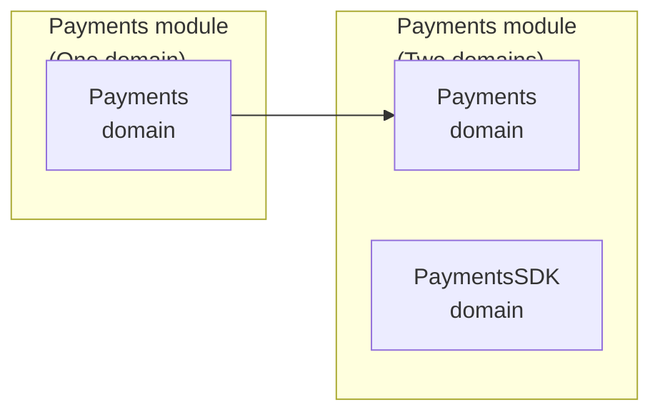
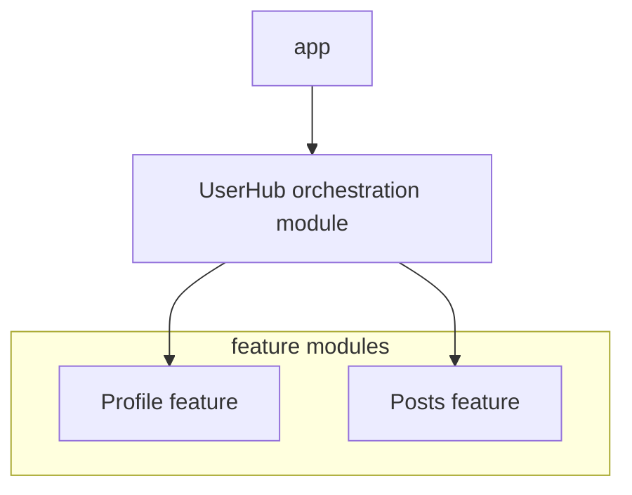
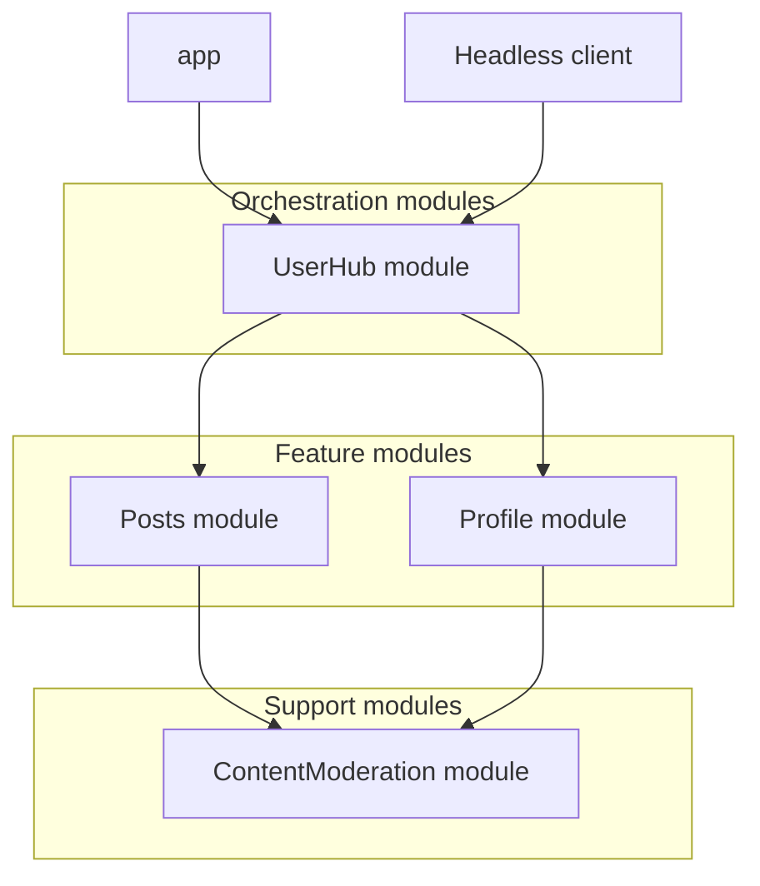
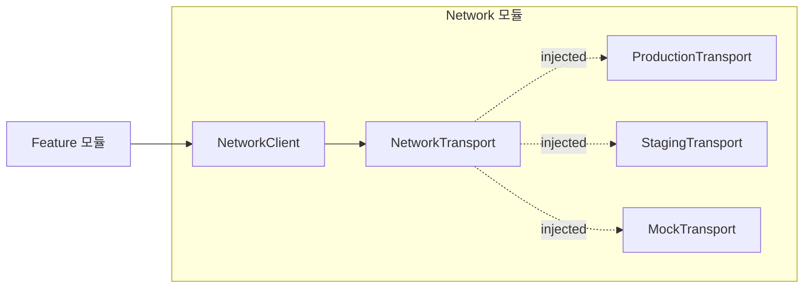

# [WEEK 06] Chapter 10
📖 Mobile System Design 2. Large-Scale Codebases & Design Systems  

<br>

## 10 Modular Architecture in Practice
> 실제 모듈 구조에서는 애매한 역할, 수평 의존성, interface 모듈의 비용을 함께 판단해야 한다.  

### Dual-role modules

어떤 모듈은 하나의 카테고리에 깔끔하게 들어가지 않는다.  
#### Payments 모듈
- 사용자가 직접 결제 화면 열기
- Marketplace에서 course를 구독하는 과정에서 사용

이 경우 Payments는 `feature 모듈`이면서 `support 모듈`이기도 하다.  
역할이 섞이면 설계와 유지보수 기준도 애매해진다.  

#### Splitting domains

> 하나의 모듈 안에서도 `feature domain`과 `support domain`을 나눌 수 있다.  

Payments 전체를 하나의 domain으로 보지 않고, feature 역할과 support 역할을 분리할 수 있다.  

| 역할 | domain | 의미 |
|---|---|---|
| feature | `Payments` | 사용자가 보는 기본 결제 흐름 |
| support | `PaymentsSDK` | 결제를 만들기 위한 핵심 로직과 공개 API |

`Payments`는 `PaymentsSDK`에 의존하지만, `PaymentsSDK`는 `Payments`를 몰라야 한다.  
필요하면 다른 기능도 `PaymentsSDK`를 직접 사용해 자체 결제 flow를 만들 수 있다.  

#### Splitting a module

> domain 분리만으로 부족할 때만 별도 모듈로 나눈다.  

하나의 모듈 안에 여러 domain이 있는 것이 항상 문제는 아니지만, 다음의 경우 별도 모듈로 분리할 수 있다.  
- `Payments`가 `PaymentsSDK`의 내부 코드에 접근하지 못하게 강제하고 싶을 때
- 두 영역이 모두 커지고 팀도 나뉠 때

이때도 몇 개 class를 위해 모듈을 새로 만드는 것은 과하다.  
두 모듈 모두 의미 있는 기능을 담고, 더 강한 경계가 실제로 필요할 때 분리하는 편이 낫다.  



---

### Complex Features: Keep Together or Distribute?

복잡한 feature를 만들 때는 코드를 한 모듈에 둘지, 자연스러운 위치에 나눠 둘지 결정해야 한다.  

**ex) Authentication**
login UI, biometric verification, token management, auth 엔드포인트, keychain storage가 함께 필요할 수 있다.  

복잡한 feature라도 처음부터 여러 모듈로 쪼개지 않는다.  
먼저 한 모듈 안에서 만들고, 구현하면서 domain 경계가 실제로 드러나는지 본다.  

경계가 보이면 바로 분리하기보다 API와 의존 방향을 먼저 정리한다.  
특정 domain이 충분히 커지거나 다른 모듈로 옮기는 편이 자연스러워졌을 때만 분리한다.  

- 시작은 한 모듈
- 구현하면서 domain 경계 확인
- 먼저 API 경계 정리
- 필요가 확인되면 모듈 분리

#### Keeping momentum

> 새 feature가 안정되기 전에는 feature 모듈 안에서 빠르게 만들고, 공유 가치는 나중에 판단한다.  

큰 팀에서 새 `LoginView` component를 만들면서 바로 UI Library에 넣으려 하면 다른 팀의 요구사항과 승인 절차가 붙는다.  

- 초기에는 변경이 많기 때문에 **feature 모듈 안에서 먼저 만들고 안정화**하는 편이 빠르다.  
- 공유 가치가 커지면 그때 다른 모듈에 옮긴다.  
- 필요하면 인증 요청처럼 일부 코드만 Network 모듈에 먼저 둘 수도 있다.  

> [!Note]
> 중요한 것은 나눌지 말지가 아니라 **언제 나눌지**이다.  

---

### Handling Lateral Dependencies

#### lateral dependency

- 같은 계층의 모듈이 서로 직접 의존하는 상황이다.  
- feature 모듈끼리 직접 의존하거나, support 모듈끼리 서로 import하면 **순환 의존성**으로 이어지기 쉽다.  

**ex)**
- `Profile`: 사용자의 post를 보여주고자 함
- `Posts`: 작성자 profile을 보여주고자 함  

같은 app 모듈 안에서는 `Profile`과 `Posts`가 서로의 타입을 참조해도 빌드될 수 있다.  
하지만 둘을 별도 모듈로 나누면 `Profile → Posts → Profile` 형태의 순환 의존성이 드러난다.  

#### Lateral dependencies are more problematic with modules

> 같은 계층의 모듈이 서로 참조하면, 모듈 분리 후 순환 의존성으로 드러나기 쉽다.  

`Posts` → `Profile` → `Posts` 형태로 모듈이 의존하면 순환 의존성이 되어 빌드가 실패한다.  
이 문제를 피하려고 모델 복사, interface 추가, interface 모듈 추가 같은 우회책을 만들기 쉽다.  
하지만 먼저 **coordination logic**을 어디에 둘지 봐야 한다.  

#### Coordination logic moves up; dependencies flow down

> 같은 계층 모듈이 서로 협력해야 한다면, **둘을 모두 볼 수 있는 위쪽**으로 coordination 로직을 올린다.  

서로 다른 feature가 함께 동작해야 한다고 해서 feature끼리 직접 의존하면 안 된다.  
`Profile`이 `Posts`를 알고, `Posts`가 다시 `Profile`을 알게 되면 순환 의존성이 생긴다.  

이럴 때는 두 feature를 모두 볼 수 있는 **더 높은 계층에서 흐름을 조율**한다.  
`Profile`과 `Posts`가 서로를 호출하는 대신, app이나 상위 조율 코드가 두 feature를 호출한다.  

핵심은 의존성 방향이다.  
feature끼리 옆으로 연결하지 않고, 위쪽의 조율 코드가 아래쪽 feature들을 바라보게 만든다.  

#### Pushing coordination logic out of an app

> coordination 로직이 app에 계속 쌓이면, 별도 모듈로 빼는 편이 낫다.  

처음에는 app 레벨에 coordination 로직을 두는 것이 가장 단순하다.  
하지만 여러 feature를 엮는 작업, 상태 처리, 오류 처리, 재사용되는 흐름이 많아지면 **app이 너무 많은 책임**을 갖게 된다.  

이때는 coordination 로직을 app 밖의 별도 모듈로 분리할 수 있다.  
다만 단순한 메서드 호출 몇 개를 옮기기 위해 새 모듈을 만드는 것은 과하다.  

#### Introducing orchestration modules

> orchestration 모듈은 여러 모듈 사이의 복잡한 상호작용만 조율한다.  

orchestration 모듈은 여러 모듈을 직접 구현하지 않고, **여러 모듈을 엮는 흐름만 담당**한다.  

예를 들어 `UserHub`는 `Profile`과 `Posts`의 내부 기능을 대신 구현하지 않는다.  
대신 사용자 화면에 필요한 흐름을 만들기 위해 두 feature를 호출하고 결과를 조합한다.  



이 구조에서는 `Profile`과 `Posts`가 서로를 import하지 않는다.  
`UserHub`가 두 feature를 호출하면서 필요한 화면 흐름을 만든다.  

이렇게 하면 feature끼리 직접 의존하지 않아도 되고, app에 쌓이던 연결 코드도 줄일 수 있다.  

#### Where orchestration modules fit

> orchestration 모듈은 보통 feature 모듈 위에 놓이고, 도메인 로직을 많이 담지 않는다.  

orchestration 모듈은 보통 app과 feature 모듈 사이에 위치한다.  
app보다는 구체적인 흐름을 알고, feature보다는 더 넓은 범위를 조율한다.  

- `app`: 전체 실행 지점과 화면 연결을 담당한다.  
- `orchestration 모듈`: 여러 feature/support 모듈을 엮는 흐름을 담당한다.  
- `feature 모듈`: 자기 feature의 UI와 동작을 담당한다.  
- `support 모듈`: 여러 feature가 공유할 수 있는 기능을 제공한다.  

#### Extracting downward

> 수평 의존성은 공통 기능을 아래 support 모듈로 빼서 해결할 수도 있다.  

모든 수평 의존성을 위로 올려야 하는 것은 아니다.  
두 feature가 같은 기능을 필요로 한다면, 그 기능을 **아래쪽 support 모듈로 분리**하는 편이 낫다.  

예를 들어 `Profile`도 `Posts`의 content moderation 기능이 필요하다고 해서 `Profile`이 `Posts`에 의존하면 feature 간 의존성이 생긴다.  
이 경우 moderation 자체를 별도 support 모듈로 빼고, `Profile`과 `Posts`가 둘 다 그 모듈에 의존하게 만드는 것이 더 자연스럽다.  

- `흐름을 조율`해야 한다면 **위로 올린다**.  
- `공유 기능이 필요`하다면 **아래로 뺀다**.  



---

### Interface Modules: The Hidden Costs of Abstraction

**Interface 모듈**
- 다른 모듈의 의존성이나 구현 세부사항을 숨기기 위해 만든 모듈

Course와 Marketplace가 Network와 Persistence를 직접 사용한다고 가정한다.  
이 직접 의존 구조를 피하려고 interface 모듈을 추가하는 경우가 많다.  

#### Why teams reach for interface modules

> feature가 불안정한 구현체에 직접 묶이지 않게 하려고 interface 모듈을 만든다.  

팀이 interface 모듈을 만드는 이유는 대체로 **의존성 제어**이다.  
feature가 `Network`나 `Persistence` 구현체를 직접 보지 않게 만들고, 구현체가 깨져도 feature 개발은 계속할 수 있기를 기대한다.  

하지만 interface 모듈을 추가했다고 해서 의존성이 완전히 사라지는 것은 아니다.  
구현체를 누군가는 연결해야 하고, 그 연결 책임은 보통 app이나 상위 조립 코드로 이동한다.  

#### The complexity migration

> interface 모듈을 만들면 feature의 직접 의존은 줄지만, 구현체를 연결하는 책임은 app으로 이동한다.  

interface 모듈을 두면 feature는 구현체를 직접 의존하지 않는다.  
대신 app이 interface와 구현체를 연결해야 한다.  

결과적으로 feature의 직접 의존은 줄지만, **app에는 wiring과 조립 코드가 쌓인다**.  
여러 feature가 같은 app 코드를 건드리게 되면 모듈 간 결합을 줄이기 어렵고, 팀 자율성도 낮아진다.  

> [!Important]
> **복잡도가 사라지는 것이 아니라 app 계층으로 이동**한 것이다.  

#### The public API grows larger

> 구현체를 숨기려면 interface도 그만큼 많은 타입과 메서드를 공개해야 한다.  

`Network` 구현체가 디스크 저장을 위해 `PersistenceInterface`를 사용하는 것은 괜찮다.  
문제는 `NetworkInterface` 자체가 persistence 개념을 알아야 하는 순간이다.  

예를 들어 networking API에 cache control을 추가하면서 `cacheKey`를 받아야 한다고 가정한다.  
이때 `cacheKey` 타입을 무엇으로 둘지 결정해야 한다.  

```kotlin
interface NetworkInterface {
    fun makeRequestWithCache(url: String, cacheKey: ???): Data
    fun getCachedResponse(key: ???): Data?
    fun invalidateCache(key: ???)
}
```

| 옵션                     | 의미                        | 새로 생기는 비용                                                                        |
| ---------------------- | ------------------------- | -------------------------------------------------------------------------------- |
| decoupling 깨기          | `PersistenceKey`를 그대로 쓴다  | `NetworkInterface`가 `PersistenceInterface`에 의존하게 되어 모듈 간 의존성이 다시 생긴다             |
| 중복 추상화 만들기             | `NetworkCacheKey`를 새로 만든다 | `PersistenceKey`와 비슷한 개념을 중복하고, `NetworkCacheKey -> PersistenceKey` 변환 코드가 필요해진다 |
| interface를 god 모듈에 모으기 | 모든 interface를 한 모듈에 모은다   | 작은 팀에서는 단순해 보일 수 있지만, 팀이 커지면 모든 모듈이 의존하는 병목이 된다                                  |

핵심은 interface가 구현체를 숨길수록 public API가 작아지는 것이 아니라, 오히려 더 많은 타입과 변환 규칙을 밖으로 끌어낼 수 있다는 점이다.  

> [!Note]
> **god 모듈**
> - 여러 모듈이 공유하는 interface나 타입을 한곳에 몰아넣은 중앙 모듈이다.  
> - 처음에는 의존성이 단순해 보이지만, 규모가 커지면 거의 모든 모듈이 이 모듈에 의존하게 되어 변경 병목과 단일 장애 지점이 되기 쉽다.  

#### Other problems

> interface 모듈은 구조뿐 아니라 개발자가 매일 코드를 읽고 바꾸는 과정에도 비용을 만든다.  

| 문제     | 실제로 생기는 비용                                                        |
| ------ | ----------------------------------------------------------------- |
| 동기화 비용 | 구현체 기능이 바뀌면 interface도 같이 바꿔야 해서 여러 모듈 간 조율이 필요하다                 |
| 탐색 비용  | feature에서는 interface만 보이므로 실제 동작을 보려면 구현 모듈이나 app wiring을 따라가야 한다 |
| 의존성 증가 | app과 sample app이 단일 모듈이 아니라 interface/implementation 쌍에 의존하게 된다   |
| 변경 전파  | parameter 하나를 추가해도 interface, 모든 구현체, app glue 코드까지 바뀔 수 있다       |
| 학습 비용  | 새 개발자는 추상 interface, 실제 구현체, DI wiring 방식을 함께 이해해야 한다             |

이 문제들은 관리할 수 없는 문제는 아니다.  
stable interface, 명확한 ownership, 테스트 중심 workflow가 있는 팀은 이 trade-off를 감당할 수 있다.  

다만 핵심은 interface 모듈이 미래의 가능성을 위해 현재의 확실한 비용을 만든다는 점이다.  
따라서 추상화로 얻는 이점이 오늘 치르는 동기화, 탐색, 변경 비용보다 큰지 따져봐야 한다.  

---

### Swapping Fundamental Code: The Paradigm Problem

근본적인 기술을 언젠가 바꿀 수 있다는 이유로 interface를 만들 때가 있다.  
예를 들어 NoSQL document database를 쓰면서, 나중에 바꿀 수 있게 `DataInterface`로 감싸는 방식이다.  

| 현재 interface가 전제한 것 | 다른 패러다임으로 바꿀 때 생기는 문제 |
|---|---|
| flexible schema | 고정된 column 정의가 필요해진다 |
| document query | 여러 table의 JOIN으로 바뀔 수 있다 |
| nested JSON document | table과 foreign key로 풀어야 한다 |
| document 저장 방식 | transaction과 consistency model을 다시 봐야 한다 |

> [!Note]
> 완전히 다른 패러다임을 interface 하나로 감싸도 실제 교체 비용이 없어지지는 않는다.  
> 따라서 **바뀔 가능성이 낮고**, **바뀌면 사고방식 자체가 달라지는 기술**까지 미리 추상화하려 하면 안 된다.  

- 비슷한 구현체끼리 바꾸기 위한 interface는 의미가 있을 수 있음
- 하지만 패러다임이 다른 기술을 바꾸려면 interface 하나로 해결되지 않음
- 이 경우 data model, query 방식, 비즈니스 로직까지 다시 설계해야 할 가능성이 큼
- 그래서 “언젠가 바꿀 수도 있으니까”라는 이유만으로 foundational code를 interface로 감싸는 건 과할 수 있음

---

### Testing without the overhead

interface 모듈은 테스트에 실제로 도움을 줄 수 있다.  
- 무거운 의존성 없이 unit test를 돌리기
- mock 구현을 주입하기
- feature를 실제 구현체와 분리해서 테스트하기 쉬움

하지만 테스트 이점을 얻기 위해 항상 별도 interface 모듈을 만들 필요는 없고, 더 단순한 구조로도 해결할 수 있다.  

| 구성                    | 역할                     |
| --------------------- | ---------------------- |
| `NetworkClient`       | 실제 network 기능을 담는 구현체  |
| `NetworkTransport`    | 환경별 transport를 주입받는 경계 |
| `ProductionTransport` | 운영 환경                  |
| `StagingTransport`    | staging 환경             |
| `MockTransport`       | 테스트 환경                 |

`NetworkClient`는 `NetworkTransport`에 의존하고, 실행 환경에 따라 transport 구현체를 주입받는다.  
이렇게 하면 별도 interface 모듈 없이도 networking concern을 한 모듈 안에 두고 테스트 가능한 구조를 만들 수 있다.  



이 방식은 production, staging, test 구현을 교체할 수 있게 하면서도 network 관련 ownership을 한 모듈 안에 둔다.  
즉, 테스트 유연성을 얻기 위해 처음부터 모듈 그래프를 복잡하게 만들지 않아도 된다.  

> [!Note]
> 먼저 단순한 구조로 시작하고, 실제 필요가 생겼을 때 복잡도를 추가한다.  

#### Catching problems earlier

> mock으로는 통과해도 실제 구현체와 연결할 때 문제가 드러날 수 있다.  

interface 모듈은 습관적으로 도입되기도 한다.  
“언젠가 networking을 통째로 바꿀 수도 있다” 같은 미래 가능성을 대비하려는 이유가 대표적이다.  

하지만 지금 실제로 쓰는 구현체가 하나뿐이라면, 그 대가로 추가 모듈, indirection, glue 코드를 먼저 치르는 셈이다.  
feature는 mock 구현으로 잘 동작해도, 실제 앱을 실행하면 결국 실제 `Persistence` 구현을 사용한다.  
그 구현에 문제가 있으면 feature도 깨진다.  

차이는 문제가 없어지느냐가 아니라 **언제 발견하느냐**이다.  
interface 모듈을 쓰면 feature 개발 중이 아니라 app을 실행할 때 문제를 발견할 수 있다.  
가능하다면 실제 의존성 문제를 더 이른 시점에 발견하는 편이 낫다.  

---

### When interface modules make sense

interface 모듈을 기본값으로 시작할 필요는 없다.  
다만 의존 대상이 실제로 “문제 있는 모듈”이라면 interface 모듈이 의미가 있다.  

예를 들어 `ThirdPartyAnalytics` SDK가 불안정하고, singleton API라 테스트가 어렵고, 많은 transitive dependency를 끌고 온다고 가정한다.  
이때 `AnalyticsInterface`를 두면 `Course`와 `Marketplace`가 SDK의 많은 의존성을 직접 끌어오지 않아도 된다.  
app은 까다로운 SDK 연결을 맡고, feature는 interface만 바라볼 수 있다.  

| 문제 있는 의존성 | interface 모듈이 주는 효과 |
|---|---|
| 불안정한 third-party SDK | feature가 직접 SDK에 묶이지 않는다 |
| singleton API라 테스트가 어려움 | 테스트 가능한 interface 뒤로 숨긴다 |
| transitive dependency가 많음 | feature의 빌드 부담을 줄인다 |
| 느리게 빌드되는 모듈 | feature 개발 속도를 보호한다 |
| 순환 의존성 | 의존 경계를 끊는 선택지가 될 수 있다 |
| 테스트 이점이 조율 비용보다 큼 | stable interface와 빠른 unit test workflow를 유지할 수 있다 |

> [!Important]
> interface 모듈은 안정적인 모듈보다 문제가 있는 의존성을 감쌀 때 더 유용하다.  
> 안정적인 모듈을 습관적으로 숨기면 비용만 늘어날 수 있다.  

단, 문제 있는 모듈의 공개 API가 매우 크면 그만큼 큰 interface도 유지해야 한다.  
interface 모듈이 필요하다는 사실은 때로 더 근본적인 설계 문제를 알려주는 신호일 수 있다.  
먼저 “이 의존성이 왜 문제이고, interface 뒤에 숨기는 대신 개선할 수는 없는가?”를 확인해야 한다.  

---

### What we covered

> 기본 원칙은 단순한 구조로 시작하고, 실제 필요가 생겼을 때만 복잡도를 추가하는 것이다.

- `dual-role 모듈`은 feature 모듈이면서 support 모듈일 수 있다.
- 역할이 갈라지면 먼저 모듈 안에서 `feature domain`과 `support domain`을 나눈다.
- 별도 모듈 분리는 두 domain이 충분히 커졌거나 더 강한 boundary가 필요할 때 한다.
- 복잡한 feature는 처음부터 여러 모듈에 흩뿌리지 말고, `API separation`을 유지하면서 한곳에서 시작할 수 있다.
- `lateral dependency`는 `coordination logic`을 위로 올리거나, 공유 기능을 support 모듈로 내려서 해결한다.
- `orchestration 모듈`은 app에 두기에는 커지고 feature/support 모듈에 넣기에는 애매한 조율 로직을 맡는다.
- `interface 모듈`
	- 복잡도를 없애지 않고 app wiring 쪽으로 옮길 수 있다.
	- 불안정한 SDK, 느린 빌드, 순환 의존성처럼 실제 문제가 있는 의존성을 감쌀 때 더 의미가 있다.
- 테스트만 필요하다면 별도 interface 모듈보다 같은 모듈 안에서 interface와 concrete implementation을 함께 두는 `hybrid approach`가 더 단순할 수 있다.
