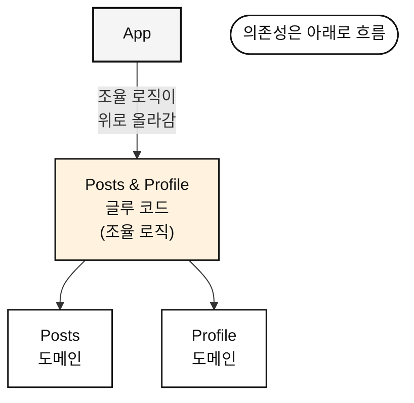
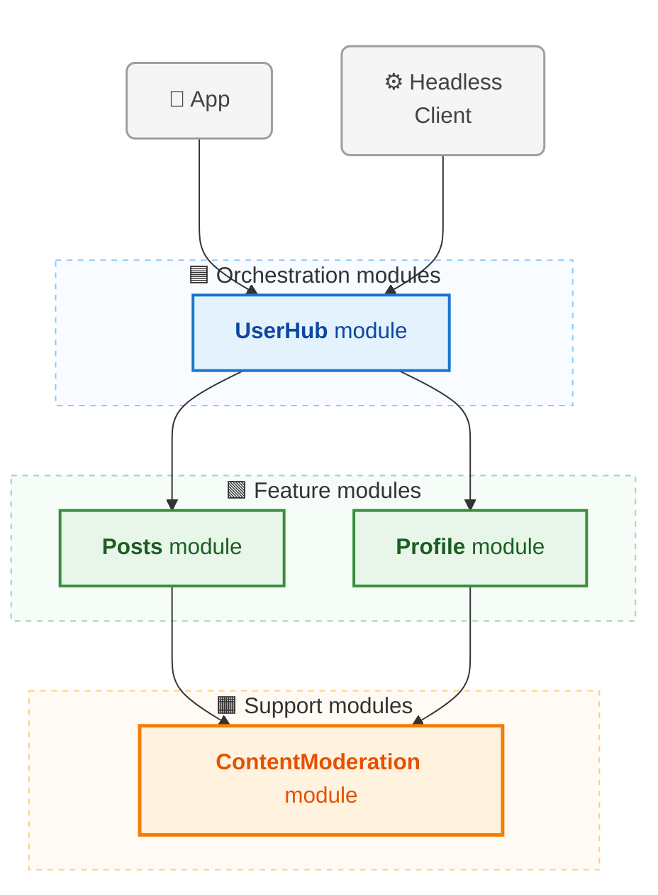
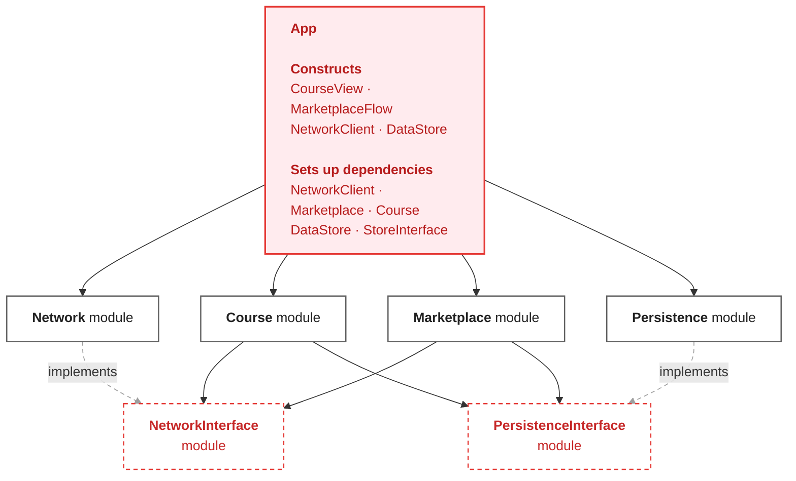

## 10장 [[10. 모듈식 아키텍처 실전|모듈식 아키텍처 실전]]

## 피처이면서 서포트인 모듈
- `Payment` 라는 모듈은 서포트 모듈일까? 피처 모듈일까?
	- 사용자가 "결제한다" 라는 시나리오가 있다면 피처 모듈이다.
	- 강의를 보기위해 "결제" 가 필요한 경우 피처 모듈을 돕는 서포트 모듈이다.

- 헷갈리는게 이상한 것이 아니다, 왜냐하면 정말 두 개의 역할 모두 하기 때문이다.
- 나누기 애매하다면, 도메인 자체를 두 개로 나눠버리는 것도 방법이다.
	- `feature:payment` -> `support:paymentSDK`
	- 피처 모듈의 도메인이 서포트 모듈의 도메인을 의존한다.

- `Payment` 모듈 내 두 개의 도메인을 나눴다.
- 이 상황에서, 원활한 유지보수를 위해 완전히 역할을 분리하고 싶다면 모듈을 분리한다.
	- 중요한 것은 처음부터 분리하는 것이 아니라는 점이다.
	- 정말 필요할 때만 분리한다.
- **도메인만 잘 분리해도, 실존하는 문제의 90%를 해결할 수 있다.**

## 복잡한 모듈, 분리? 통합?
- 일단 기본적으로 모듈은 통합하는 것을 추천한다.
	- '다른 사람에게 유용할 것 같은데?' 라는 추측이 아니라 실제 필요한 결정에 기반하여 추후에 모듈을 추출할 수 있다.
	- 정말 필요하다고 판단되는 경우에만 모듈을 분리한다.

- 큰 팀에서 작업하는 경우, 기능 추가 시 우선 "내 모듈" 안에 위치 시킨다.
	- 새로운 것을 공통 모듈에 반영시키는 것은 생각보다 오랜 시간이 걸린다.
		- 리뷰, 결재, 설계 문서 작성 등..
	- 개발 병목을 줄이기 위해 우선 동작하는대로 "내 모듈" 내에서 개발한다.

## 횡방향 의존을 피하라
- 피처 모듈 작업을 진행할 때 주의할 점은 편한 구현을 위해 **순환 참조를 발생시키는 것**이다.
	- 편하다는 이유로 다른 피처 모듈에 대한 의존성을 가지기 시작하면, 어느새 모듈끼리 의존성을 가지게 된다.
	- 이로 인해 훗날 모듈 분리에 큰 어려움을 겪게 된다.

- 이 경우 조율 로직을 의존성 그래프 기준으로 위로 흐르게 하거나, 아래로 흐르게하는 방향으로 문제를 해결할 수 있다.

### 오케스트레이션 모듈



- 필요하다면, 두 도메인 모두를 위한 `Glue Code` 를 작성하라.
	- 모듈의 의존성 방향이 횡방향이 아닌, 윗방향을 가리키도록 구현하라는 것이다.

- `Glue Code` 의 양이 많아진다면 이 때는 모듈을 분리할 수 있다.
- 이를 **오케스트레이션 모듈**이라고 부른다.
	- 해당 모듈은 모듈간의 인터렉션에'만' 집중한다.
	- 피처 모듈도, 서포트 모듈도 아니다.
	- 오로지 다양한 모듈을 조화롭게 움직이게 하는 역할이다.
	- 단, 정말 복잡한 경우에만 도입을 추천한다.

### 서포트 모듈

- 복잡한 상황에서 의존성을 위로 흐르게 만드는 방법이 있다면, 반대로 아래로 흐르게 하는 방법도 있다.
	- 한 피처의 기능을 다른 피처도 필요로 한다면, 이는 서포트 모듈의 분리 신호다.




- 오케스트레이션 모듈과 다르게, 의존성 방향을 아래로 흐르게 하는 방법이다.

## 인터페이스 모듈
- 위에서 언급한 두 가지 방법들은 결국 모듈간 의존이 발생하게 된다.
- 하지만 모듈들이 서로 전혀 의존하지 않게 만드려면, 결국 인터페이스 모듈이 필요하다.
- 인터페이스의 모듈은 크게 보면 다음 두 가지다.
	- 로직이 완전히 독립되어 파운데이션 모듈에 문제가 생겨도 피처 모듈은 정상 동작한다.
	- 테스트가 매우 쉬워진다.

### 인터페이스 모듈의 복잡성
- 하지만 실제로는 더욱 복잡해진다.
	- 인터페이스가 생기면서, 역할을 맡고 있던 모듈의 구현 코드가 완전히 사라지게 된다.
	- 그 결과, 인터페이스를 "구현"하기 위해 피처 모듈에 구현 코드가 발생한다.



- 피처 모듈에서 실제 구현 코드를 짜야 하니, 그럼 결과적으로 어딘가에서는 구현을 위한 재료가 있어야 한다.
	- 보통은 그게 `APP` 모듈로, `NetworkClient`, `DataStore` 등 아주 많은 재료들을 떠맡게 되면서 매우 비대해진다.

- **인터페이스 모듈은 복잡성을 해결하는 것이 아니라, 복잡성을 재분배하는 것이다.**
- 인터페이스 모듈은 서로 의존성을 가지지 않는다.
	- 이 규칙으로 인해 오히려 선택해야 하는 순간과, 복잡도가 증가한다.

- 네트워크 모듈과 로컬 모듈이 있을 때, 네트워크 통신을 위해 로컬 캐싱키가 필요하다면 어떻게 해야하나?

1. 인터페이스의 디커플링을 깬다.
- 그냥 단순하게 네트워크 모듈이 로컬 모듈을 알면 모든 것이 해결된다.

2. 두 모듈 사이를 잇는 복제 클래스를 구현한다.
```swift
// Inside NetworkInterface module
protocol NetworkCacheKey { // A new type that duplicates PersistenceKey
    let identifier: String
    let namespace: String
}

protocol NetworkInterface {
    // Now uses NetworkCacheKey instead of PersistenceKey
    func makeRequestWithCache(url: String, cacheKey: NetworkCacheKey) -> Data?
    func getCachedResponse(for key: NetworkCacheKey) -> Data?
    func invalidateCache(for keys: NetworkCacheKey) -> Void
}
```

- 디커플링을 유지한다는 이유만으로 아주 많은 클래스가 생기고 복잡도가 발생한다.
- 클래스간 `Mapper` 또한 생성해주어야 한다.

3. 모든 인터페이스를 알고 있는 `GOD` 클래스를 구현한다.
- 당연히 매우 비대해지고, 인터페이스가 추가될 때마다 클래스도 신경써주어야 한다.
- `GOD` 모듈이 변경된다면 다른 모듈에도 심각한 영향을 초래할 수 있다.
	- 그렇다면 모듈을 분리한 것에 의미가 존재하는 것인가?

- 인터페이스 모듈의 또 다른 단점들은 다음과 같다.
	- 인터페이스 변경 시 구현체도 모두 변경된다.
		- 예를 들면 파라미터 하나를 추가하면, 모든 구현체에 영향이 간다.
	- 개발자는 실제 구현 코드를 확인하기 위해 다른 모듈로 이동해야 한다.
	- 복잡도의 증가로 인해 오히려 관리가 더 어려워진다.
	- 의존성 그래프가 매우 복잡해진다.

### 파운데이션 모듈 코드 변경하기
- 인터페이스 모듈의 단점과 관련된 좋은 예시다.
- 종종 Local DB를 구현할 때 `NoSQL` -> `RDB` 로 변경될 수 있으니 인터페이스로 분리하라는 이야기를 많이 듣는다.
	- 하지만, 이와 같은 파운데이션 모듈은 실제로 변경될 일이 사실 거의 없다.

- 변경이 된다고 쳐보자.
	- 변경이 되면 구현 코드도 모두 변경될 것이다.
	- 그럼 파라미터나 함수명도 새로운 설계에 맞게 변경된다.
	- 자연스럽게 인터페이스 자체를 재설계하면서, 이를 의존하는 모듈에도 영향이 간다.

- 이것이 유의미한 분리인지 생각해 볼 필요가 있다.

## 오버헤드 없는 테스팅
- 인터페이스 모듈은 위에서 언급했듯 테스팅에 강점이 있다.
	- 빠른 유닛테스트, 쉬운 모킹, 깔끔한 테스트 격리 등.
	- 하지만, 결국 복잡성을 초래하는 것은 어쩔 수 없다.

- 그렇다면 복잡성을 줄이면서 테스트를 쉽게 하는 방법은 무엇일까?
- 그것은 아주 단순하게도 모듈 내에 테스트용 / 실제 프로덕션용 구현체를 모두 구현하는 것이다.
	- 사용하는 쪽에서는 용도에 맞게 적절하게 생성자에 주입해주면 된다.

```kotlin
// [Network 모듈] 
// 1. 외부에 공개할 인터페이스와 클라이언트 (public)
interface NetworkTransport {
    fun sendRequest()
}

class NetworkClient(private val transport: NetworkTransport) {
    fun execute() { transport.sendRequest() }
}

// 2. 실제 프로덕션용 구현체 (이건 internal로 숨길 수 있음!)
internal class ProductionTransport : NetworkTransport {
    override fun sendRequest() { /* 실제 서버 통신 */ }
}

// 3. 테스트/스테이징용 구현체 (공개하여 피처 모듈의 테스트 등에서 쓰게 함)
class MockTransport : NetworkTransport {
    override fun sendRequest() { /* 가짜 응답 */ }
}

// [Course 모듈]
class CourseView {
    fun load() {
        // ⭕ 접근 가능: public으로 열려있는 인터페이스와 클라이언트
        val transport: NetworkTransport = MockTransport() 
        val client = NetworkClient(transport)
        
        // ❌ 접근 불가능 (컴파일 에러): internal로 숨겨진 실제 구현체
        // val prodTransport = ProductionTransport() 
    }
}
```

- 이렇게 단순하게 모듈을 구성하는 것의 또 다른 장점은, **빠르게 문제를 파악할 수 있다는 점**이다.
- 인터페이스 모듈을 사용하면, 문제가 늦게 발견된다.
	- 파운데이션 모듈이 변경되어 파라미터가 변경되었는데, 인터페이스에서 뭔가 잘 처리했다면 결과적으로 피처 모듈에는 아무 문제가 감지되지 않는다.
	- 이로 인해 컴파일 타임에 문제를 발견하지 못하고, 오히려 런타임에 갑자기 문제가 발생하게 된다.

- 인터페이스 모듈을 사용하지 않고 단순하게 합쳐져 있는 상황이었다면, 파라미터가 변경되었으니 즉시 컴파일 에러로 문제를 잡아낼 수 있었을 것이다.
	- 즉, 오히려 더 빠른 검증이 가능한 것이다.

- 인터페이스 모듈이 분명 추후에는 어떤 상황에 효과를 보일 수 있다.
	- **하지만 우리는 오늘을 살고 있고, 불필요한 복잡성을 감수할 필요는 없다.**

## 인터페이스 모듈이 의미있을 때
- 정말 문제가 있는 모듈이거나, 테스팅 비용이 "명쾌함" 을 넘어서는 경우라면 도입을 고민해볼만 하다.
- 중요한 것은 구현 초기부터 인터페이스 모듈을 생각하지 말라는 것이다.

- 문제가 있는 모듈의 예시로, 외부 SDK를 들 수 있다.
	- SDK 자체가 불안정하거나, 불필요한 메소드들로 인해 빌드 시간을 늦추는 경우다.
	- 이 경우는 필요한 메소드들만 분리하는 식으로 인터페이스 모듈을 만들 수 있다.
	- 하지만, 이 역시 SDK의 메소드가 변경되면 인터페이스, 피처 모두 변경해야 하는 비용이 들긴 한다.

