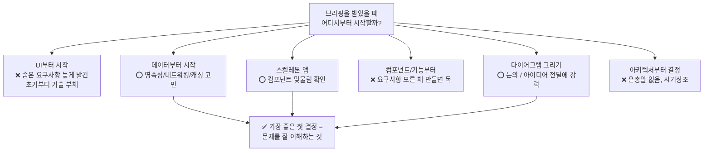
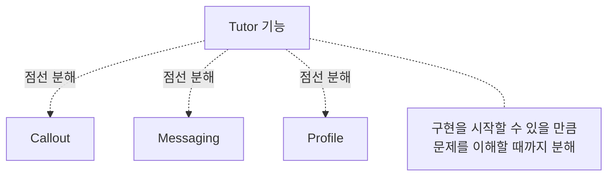
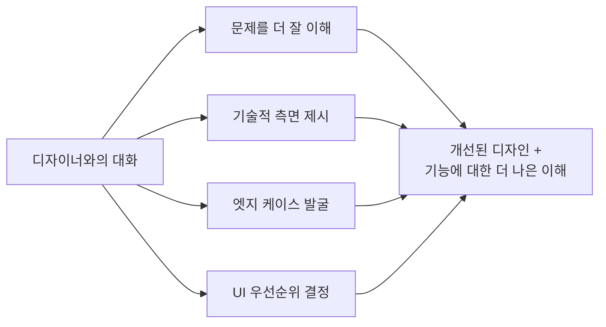
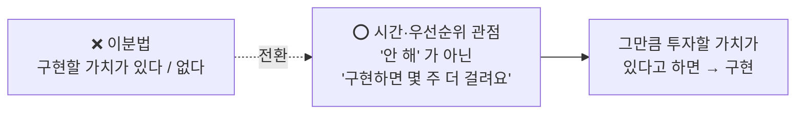
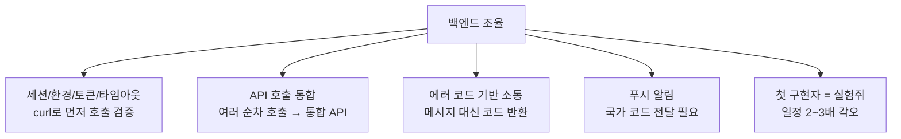
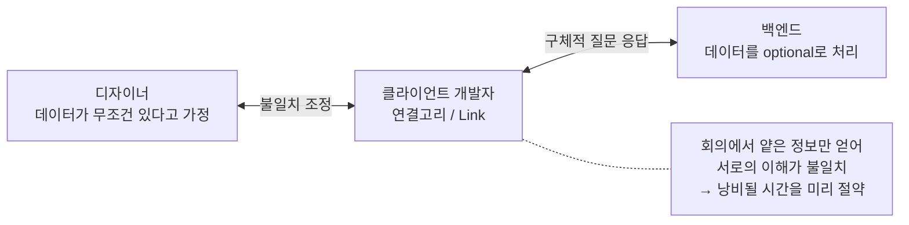

# Turning Briefing into Strong Plan

### 일반적인 접근 방식 평가하기 (Evaluating Common Approaches)

**UI부터 시작하지 마라**

- UI부터 만들면 숨겨진 요구사항을 너무 늦게 발견하게 된다.
- 계획 없이 시작하면 요구사항이 막힐 때마다 가장 쉬운 방법으로 코드를 수정하여 초기 단계부터 빠르게 기술 부채가 쌓인다.

**데이터부터 시작하기?**

- 어떤 데이터가 필요하고 저장되고 전달될지 고려하게 된다.
- 영속성 DB, 네트워킹, 캐싱에 대한 고민을 하게 되어 좋은 선택이다.
- 처음부터 완벽한 앱을 만들려고 시도하지 마라.

**스켈레톤 앱 만들기?**

- UI나 세부적인 디테일에 치중하지 않은 채 대략적인 기능을 만드는 것은 컴포넌트들이 어떻게 서로 맞물려 돌아갈지 확인할 수 있는 좋은 방법 중 하나다.

**컴포넌트나 기능부터 시작?**

- 아직 요구사항을 정확히 모르는 상황에서 완벽한 뷰나 기능을 만드는 건 독이 된다.
- 전체 간의 상호작용을 고려해야 한다.

**다이어그램 그리기?**

- 앞으로 필요할 것들에 대해 생각할 수 있도록 도와준다.
- 팀원 간의 논의에 강력히 추천한다.
- 인터뷰를 보게 될 시 자신의 아이디어를 전달하는 데 도움이 된다.

**아키텍처부터 결정?**

- 이 세상에 모든 문제를 해결해 주는 단 하나의 은총알 같은 아키텍처는 존재하지 않는다.
- 아직 처음 단계에서 아키텍처에 대한 고민은 이르다.
- 앱이 고도화되면 도메인마다 다른 아키텍처를 적용해야 될 수도 있다.

**권장하는 방법**

- 초기 설계 단계에서 자잘한 세부 사항에 매몰되어 길을 잃지 않도록 노력해야 한다.
- 첫 단계에서 가장 좋은 결정은 문제를 잘 이해하는 것이다.

### 큰 그림 스케치하기 (Sketching out a Landscape)

- 완벽하게 파악되지 않은 기능이라도 점선 다이어그램으로 표시하여 분해해라.
    - e.g., Tutor → Callout, Messaging, Profile
- 구현을 시작할 수 있을 정도로 문제를 잘 이해할 수 있다고 느낄 때까지 분해해라.
- 기능 구현 전에 문제를 잘 이해하는 것이 중요하다.

### 숨겨진 요구사항 발굴하기 (Uncovering Secondary Requirements)

- 다음 단계로 UI 구현이 아닌 숨겨진 요구사항과 엣지 케이스를 판별하는 것이 중요하다.
- 숨겨진 요구사항을 발견하는 방법:
    - UI뿐만 아니라 기능을 만들기 위해 필요한 모든 컴포넌트를 파악한다.
    - 다양한 역할과 도메인을 가진 팀원들과 논의를 통해 누락된 요구사항을 파악한다.
    - 설계에 의문점을 가지고, 새로운 요구사항을 통해 설계가 부서질 수 있는 경우를 생각한다.

### 디자이너와 협업하기 (Working with Designers)

**디자이너와 이야기하는 목적**

- 문제를 좀 더 잘 이해하기 위해
- 몇 가지 기술적 측면을 제시하면서 그들도 문제를 제대로 이해하도록 하기 위해
- 엣지 케이스를 찾아내고, UI 컴포넌트의 우선순위를 정하거나, 예외 상황을 발견하기 위해

생산적인 대화는 개선된 디자인과 팀 간에 기능에 대한 더 나은 이해로 이어져야 한다.

**디자인은 규칙이 아닌, 아직 해석되지 않은 소통을 위한 도구다**

- 디자인은 네트워크 지연, 언어 변경, 애니메이션과 같은 내용을 전부 담지 않는다. 디자인은 최종 제품의 추정이다.
- 디자인은 최종 구현을 묘사하기 위한 소통 도구이지, 어떻게 만들어야 할지에 대한 계획이 아니다.
- 가장 안 좋은 콘텐츠가 들어있을 때의 디자인을 상정해라.
- 제품 개발을 가장 비효율적으로 만드는 지름길은, 기획서나 디자인에 포함된 모든 요소를 아무런 반박 없이 절대적으로 수용하고 구현하는 것이다.
- 디자인은 초기 제안이자 밑그림으로, 절대 수정해서는 안 되는 것이 아니다.
- 디자인을 받았을 때 모든 컴포넌트가 동일한 우선순위를 가진다고 생각하지 마라. 역설적으로, "어떻게 하면 이 기능을 만들지 않을 수 있을까?"가 팀 전체에게 더 좋은 결과를 가져다줄 수도 있다.
- 초기 단계부터 주도적으로 요구사항을 벼려나가는 접근법을 취하면, 유저가 원하지 않는 부차적인 기능이 아닌 핵심 기능에 집중할 수 있다.
    - 예시: 요구사항은 "한 사람이 여러 개의 강의를 들을 수 있는 것"이지만, 실제로 한 사람이 여러 강의를 들을 일은 적다. 따라서 이 부분은 우선순위를 낮출 수 있다.

**기존 컴포넌트의 존재를 보장하라**

- 다른 클라이언트 개발자로 하여금 새로 만드는 것이 아닌 기존에 존재하는 것을 사용하도록 해라.
- 만약 기존에 있는 컴포넌트랑 아주 미묘하게 다른 컴포넌트를 디자이너로부터 받았다면, 클라이언트의 코드 라이브러리와 디자인 시안의 동기화 불일치를 근거로, 디자이너에게 이미 존재하는 컴포넌트를 재사용하도록 설득할 수 있다.

**일반적인 UI 질문을 물어봐라**

- 화면의 영역보다 더 많은 콘텐츠가 온다면 어떻게 해야 하나? 스크롤 가능하게? 아니면 요소 사이즈를 바꿔서?
- 데이터가 비어있을 때 화면을 어떻게 표시할지
- 폰트가 커졌을 때나 작은 기기에서의 대응을 어떻게 할지
- 가로 모드를 지원하는지?
- 에러를 어떻게 처리할 것인가? 단순히 alert를 표시할지 아니면 더 자세한 가이드를 제공할지
    - 한 화면에서 2개의 에러가 발생했을 때 각 에러에 대해 처리할지? 아니면 전체 화면에 대한 에러만 제공할지
- 다크모드를 제공하는지?

**기능 관련 질문을 물어봐라**

- UI 질문들을 한 뒤에도 엣지 케이스들에 대한 질문을 하여 정보를 더 얻을 수 있다.
- 기능이 의도와 다르게 동작할 경우를 생각해라.
    - TodoList 아이템을 작성해서 서버에 보내고, 만약 서버 통신에 실패할 시 어떻게 할 것인지? (백그라운드에서 실패할 경우 알림을 보내줄지?)
    - Todo 화면에 대해 상세 화면이 존재하는지?
    - 만약 tutor가 코스를 만들지 않았다면 학생 입장에서는 어떻게 보일지
- 앱을 직접 사용한다고 상상하면 디자이너가 기능에 대해 더 깊게 생각할 만한 질문을 만들 수 있다.

**에러 처리에 대해 이야기하라**

- 개발자와 디자이너가 우선순위를 낮게 두고 있지만, 기능이 작동하게 하는 것보다 중요하다.
- 유저가 에러 처리가 제대로 되어있지 않은 화면을 보면 나쁜 UX를 경험한다.
- 디자이너에게 어떤 에러가 어느 상황에서 발생할지 이해할 수 있도록 해야 한다.

**시간 투자를 결정할 때 이분법적 사고를 갖지 마라**

- 디자인의 일부를 구현할 때 "구현할 만한 가치가 있는/없는"이라는 이분법적 사고에 빠지기 쉽다.
- 먼저 안 된다고 하기보단, 우선순위와 타임라인을 고려하게 하자.
    - "안 해"가 아닌 "구현하면 몇 주는 더 걸릴 것 같아요"
    - 만약 그만큼의 시간을 투자할 가치가 있다고 주장하면 구현하면 된다.

**디자이너에게 피드백을 주어라**

- 디자이너는 디자인을 하고 비교적 늦게 결과물을 통해 피드백을 받는다.
- 모든 사람이 개발에 대해서는 의견을 제시하진 않지만, 디자인에 대해서는 자잘한 의견을 제시할 수 있다. ("이전 색이 좋은 것 같아요", "테두리가 진한 것 같아요")
- UI를 비판할 때는 긍정적인 평가를 섞어서 균형을 맞추자.

**빠른 결과물이 중요하다**

- 디자이너와 대화하면 추가 요구사항들을 찾을 수 있다.
    - 유저가 서버와 통신이 끝나기 전에 나갔다 다시 들어오는 시나리오
    - 100% 서버 네트워킹에 의존하게 할 시 UX 저하를 개선하기 위한 오프라인 모드 지원

### 백엔드 엔지니어와 조율하기 (Aligning with Backend Engineers)

**유저 세션, 환경, 토큰, 타임아웃에 대해 조율하라**

- 유저 세션, 토큰에 대한 내용은 빼먹을 수 없다.
- 따라서 최대한 빠르게 커버하고 API 호출을 할 수 있도록 하자.
    - 스테이징 환경이 없거나, 개발 환경 세팅이 안 되어있는 등의 문제를 알 수 있다.
    - curl 스크립트를 통해서도 API를 먼저 호출해볼 수 있다.
- 클라이언트에 API 통합 시 에러가 발생한다면 curl를 통해 호출해보아서 백엔드 문제인지 아닌지 판별이 가능하다.
- 로그인 후 너무 오래되어 세션이 초기화된 상태에서 API 호출을 하면 어떻게 처리할지, 토큰 만료 및 갱신 메커니즘에 대해 고려하라.

**API 호출 통합에 대해서 조율하라**

- 하나의 화면을 그리기 위해 여러 API를 순차적으로 호출해야 한다면 백엔드 개발자와 협의하여 통합된 API를 만들어라.
- 물론 백엔드 입장에서는 도메인별로 엔드포인트를 순수하고 깔끔하게 유지하는 것이 중요하다.
- API가 늘어나면 만드는 플랫폼의 개수만큼 클라이언트 개발자의 공수가 든다. (iOS, Android, Web 모두 그렇게 해야 함)

**에러에 대해 공통된 이해를 가지자**

- 백엔드가 에러 메시지를 그대로 보내주고 클라이언트가 표시를 하면 다음과 같은 문제점을 가진다.
    - 다국어 지원 불가, 상세한 메시지로 인한 보안 취약점 노출 등
- 에러 코드를 백엔드로부터 반환받고 클라이언트가 어떻게 표시해줄지 결정하자.

**백엔드가 정해둔 사용자 정의 에러 코드를 꼭 따르지 않아도 된다**

- 백엔드에서 이미 에러 코드를 가지고 있고 각각의 의미가 있을 것이다.
- 하지만 클라이언트만의 에러가 있을 것이기 때문에 완전히 맞추는 것은 불가능하다.
- 예를 들어, 데이터 파싱 에러의 경우에는 클라이언트만의 에러다. 따라서 우리만의 에러 정의도 필요하다.

**백엔드의 실험쥐가 될 것이다**

- 백엔드와 소통하는 최접점을 가질 것이기 때문에 클라이언트 개발자는 최고의 테스터이자 실험쥐이다.
- 이슈가 터지면 클라이언트, 서버 모두 검토해야 한다.
- 일정을 짤 때, 이 API를 처음 써보는 사람이 되기 때문에 최소 2~3배의 시간이 더 걸릴 것을 각오해야 한다.

**다른 클라이언트의 코드 구현을 읽어라**

- 다른 클라이언트의 코드 구현을 읽으면서 백엔드 통합 속도를 빠르게 할 수 있다.
- 다른 클라이언트는 비슷한 문제를 어떻게 풀었는지 살펴봐라.
- 다른 플랫폼의 개발자라도 물어보기를 주저하지 마라.

**푸시 알람에 대해서 고려해라**

- UI는 아니더라도 푸시 알람은 UX의 한 부분이다.
- 푸시 메시지는 지역화되어 오지 않기 때문에 백엔드에게 디바이스의 국가 코드를 알려줘야 한다.

**기능에 대한 질문**

- 어떤 필드가 optional인지?
- 데이터를 한 번에 불러올 수 있는지? 조합해야 하는지?
- 어떤 데이터를 많이 불러오는지? 로컬에서 캐싱 처리해도 되는지?

**백엔드와 디자이너를 잇는 역할을 하자**

- 백엔드와 디자이너는 팀 회의에서 얕은 정보만 얻기 때문에 서로의 이해가 불일치할 수 있다.
    - 디자이너는 데이터가 무조건 있는 것을 가정하지만, 백엔드는 optional하게 하는 경우 등
- 따라서 둘은 너에게 구체적인 걸 물어볼 것이다.

## 요약

### 1. 일반적인 접근 방식 (General Approach)

- **코딩 전 문제 이해:** 무턱대고 코드부터 치지 말고 문제를 깊이 파악하라.
- **컴포넌트 구조 그리기:** 정보가 부족하더라도 그래프를 그려보면 전체적인 구조(landscape)를 잡는 데 도움이 된다.
- **불확실성 인정:** 이 단계에서 모든 정답을 알지 못해도 괜찮다.
- **시간 투자 관점:** "이 기능을 구현해야 한다/말아야 한다"는 이분법 대신, "여기에 얼마만큼의 시간을 투자할 가치가 있는가"를 논하라.
- **기존 플랫폼 참고:** 다른 플랫폼(iOS/Android 등)에 이미 있는 기능이라면, 그쪽 개발자에게 코드를 보여달라고 하라.
- **선택적 데이터(Optional data) 합의:** 데이터가 있을 수도, 없을 수도 있는 상황은 데이터 모델과 디자인 모두에 영향을 준다.
- **타임아웃 체크:** 로그인 유지 시간 등 타임아웃이 기능에 미치는 영향을 확인하라.
- **에러 예측 및 부분 에러:** 어떤 에러가 발생할지, 데이터가 일부만 로드되는 '부분 에러'가 가능한지 확인하라. 이는 네트워크 통신과 디자인 모두에 영향을 준다.
- **브리핑의 연결고리:** 여러분은 백엔드와 디자인을 잇는 링크다. 브리핑 단계에서 서로 어긋난 부분(misalignment)을 찾아내어 낭비될 시간을 아껴라.

### 2. 디자인 관련 (Design)

- **소통 도구로서의 디자인:** 디자인은 최종 결과물이 아니라 **의사소통을 위한 도구**일 뿐이다.
- **숨겨진 요구사항 발굴:** 디자인만 봐서는 알 수 없는 기능이나 요구사항을 찾아내라.
- **기존 컴포넌트 재사용:** 이미 만들어진 컴포넌트를 쓸 수 있는지 확인하라.
- **우선순위 조율:** 무엇을 먼저 하고 무엇을 건너뛸지 디자이너와 소통하라.
- **실제 데이터 기반 디자인:** 디자인은 보통 '최선의 상황(Happy path)'만 보여준다. 반드시 **실제 데이터가 들어간 디자인**을 요구하라.
- **디자인 깨트려보기:** 예외 케이스(Edge case)를 찾아내기 위해 디자인의 허점을 찾아보라.
- **친절한 비판:** 디자인을 비평할 때는 **항상 친절하게** 하라.

### 3. 백엔드 관련 (Backend)

- **세션 및 토큰 합의:** 사용자 세션과 토큰 처리 방식을 맞춰라.
- **비 UI 기능 체크:** 알림(Notification)처럼 화면에는 없지만 사용자 경험(UX)에 영향을 주는 기능을 백엔드와 논의하라.
- **첫 번째 구현자의 숙명:** 여러분이 백엔드 API를 처음 사용하는 사람(First implementer)이라면, 본인이 테스터가 될 것도 각오해야 한다. 일정을 넉넉히 잡아라.
- **에러 코드 지향:** 백엔드에서 보내주는 문자열 메시지에 의존하지 말고, **에러 코드**를 사용하는 방향으로 이끌어라.
- **네트워크 호출 통합(Consolidating):** 여러 번 부를 것을 한 번에 부를 수 있게 합쳐서 일을 수월하게 만들어라.
