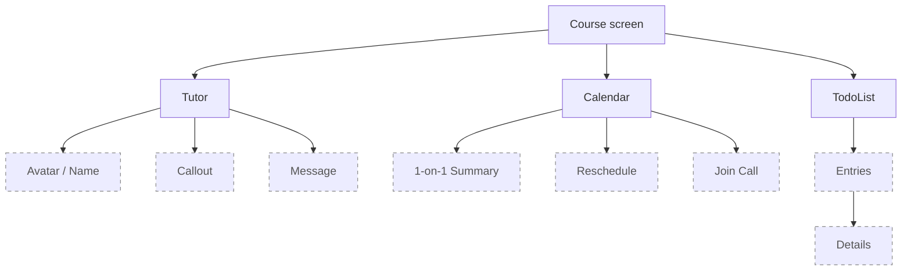
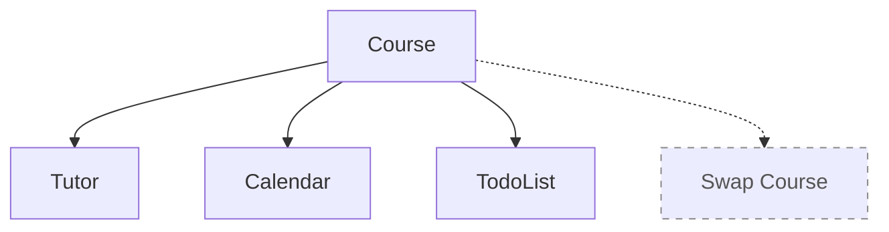
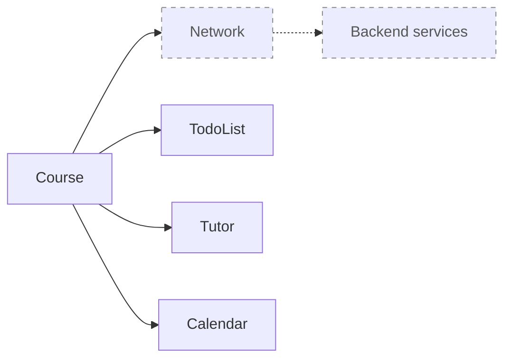
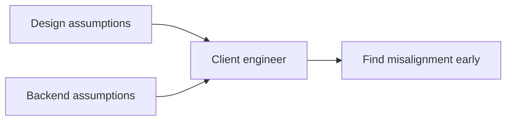

# [WEEK 07] Chapter 2
📖 Mobile System Design 0. From Briefings to System Architecture

 

## 2 Turning a Briefing Into a Strong Plan
> briefing을 받은 뒤 바로 코딩하지 않고, landscape를 그리며 구현에 필요한 domain과 component를 나눠 보고, 빠진 feature와 요구사항을 먼저 찾아낸다.  

### The briefing

#### 학생과 tutor가 새로운 기술을 배우는 app
**tutor**  
- 1:1 call로 학생을 점검
- call 사이에는 숙제나 exercise로 구성된 plan을 전달한다.  

**학생**  
- 메인 화면: 숙제, tutor 정보, tutor에게 연락하는 동선, schedule 정보, 반복 TodoList item
- 하단 tab에는 다른 feature도 있지만, 우선 이 한 화면만으로도 많은 시스템 설계 원칙을 적용할 수 있다.  

#### An initial impression

위 예시 app 디자인은 high fidelity design에 가깝다.  
겉으로는 단순해 보이지만, 실제 구현에 필요한 정보가 아직 많이 비어 있다.  

> [!Note] 
> **high fidelity design**  
> - 최종 제품에 가까운 디자인을 말한다.  
> - 개념적이고 wireframe에 가까운 `low fidelity design`과 대비된다.

초기 화면만 봐도 다음과 같은 질문이 생긴다.  

- TodoList item을 누르면 어떤 detail로 이동하는가
- message나 call 버튼은 같은 navigation stack에 들어가는가, deep link인가, 다른 app을 여는가
- 일정이 없거나 tutor가 TodoList를 추가하지 않으면 화면은 어떻게 보이는가
- daily TodoList item은 누가 reset하는가
- tablet, landscape mode, dark mode, large font size는 지원하는가
- 데이터는 어디서 오고, cache나 local storage는 필요한가
- error handling은 어떻게 할 것인가

이 단계에는 `known unknowns`와 `unknown unknowns`가 함께 있다.  
이미 모르는 것도 있고, 아직 모른다는 사실조차 모르는 것도 남아 있다.  

---

### Evaluating common approaches

구현을 시작하는 방법은 여러 가지이다.  
하지만 이 단계의 목표는 코드를 빨리 늘리는 것이 아니라, **화면 뒤에 어떤 시스템이 필요한지 더 잘 이해하는 데** 있다.  

각 접근은 출발점으로 쓸 수 있다.  
다만 한 접근에 너무 빨리 몰입하면 아직 보이지 않은 요구사항을 놓치기 쉽다.  

| 시작점 | 볼 수 있는 것 | 조심할 점 |
|---|---|---|
| UI | 화면을 빠르게 만들 수 있다 | 화면 뒤의 시스템을 늦게 발견할 수 있다 |
| data | 저장, 전달, 표시해야 할 정보를 떠올릴 수 있다 | 완성도 높은 model 설계에 너무 일찍 빠질 수 있다 |
| app/flow skeleton | 화면과 flow의 연결을 빠르게 볼 수 있다 | 지금 예시처럼 한 화면이 중심이면 과할 수 있다 |
| component/feature | scheduler, TodoList, messaging 같은 단위를 나눠볼 수 있다 | 전체 맥락보다 개별 component 완성도에 집중할 수 있다 |
| diagram | 필요한 조각과 연결을 함께 볼 수 있다 | 필수 단계는 아니지만 팀 합의에 특히 유용하다 |
| architecture | 익숙한 구조로 사고를 시작할 수 있다 | 문제보다 MVVM/MVC/MVP 같은 틀을 먼저 고를 수 있다 |

#### Start with UI?

UI부터 만드는 방식은 개인 프로젝트나 학습용 app에서는 빠르고 재미있는 출발점이다.  
눈에 보이는 결과가 바로 나오기 때문에 구현을 시작했다는 느낌도 강하다.  

하지만 real-world app에서는 UI만 보고 바로 만들기 시작하면 시야가 너무 좁아진다.  
뒤늦게 숨은 feature나 요구사항을 발견하고, 이미 만든 화면 위에 급하게 코드를 덧붙이게 될 수 있다.  

이 단계에서 SwiftUI vs UIKit, Jetpack Compose vs XML 같은 논의로 들어가는 것도 이르다.  
지금 필요한 것은 UI 구현 방식이 아니라, UI가 동작하기 위해 필요한 시스템을 먼저 보는 것이다.  

> [!Note]
> UI를 받았다고 해서 반드시 UI부터 시작해야 하는 것은 아니다.  
> 먼저 UI 뒤에 숨어 있는 시스템을 봐야 한다.  

#### A data-focused approach?

data부터 생각하는 것도 좋은 출발점이다.  
화면에 필요한 정보가 무엇인지 보면, 어떤 값이 저장되고 전달되고 표시되어야 하는지 질문할 수 있기 때문이다.  

- 어떤 field가 optional인지, 어떤 UI variation이 필요한지
- 무엇을 저장하고, 전달하고, 표시해야 하는지
- persistence, networking, caching 같은 기반 기능이 필요한지

다만 이 단계에서 완벽한 type, model, testability를 만들려고 하면 초점이 흐려진다.  
data는 필요한 시스템을 떠올리게 해주는 단서로 쓰는 편이 좋다.  

> [!Note]
> data는 출발점이지, 처음부터 완성된 application을 만들기 위한 목적지가 아니다.  

#### Creating an app-skeleton or flow-skeleton?

app/flow skeleton은 화면과 flow가 어떻게 맞물리는지 빠르게 확인하는 방식이다.  
entry point, navigation bar, tab bar, placeholder screen 정도를 만들면 app의 전체 느낌을 볼 수 있다.  

이 단계에서는 screen과 flow를 추가, 삭제, 수정하는 비용이 낮다.  
그래서 여러 화면이 이어지는 flow를 받았다면 좋은 출발점이 될 수 있다.  

다만 지금 예시는 전체 flow가 아니라 한 화면이 중심이다.  
따라서 skeleton을 크게 만들기보다, 이 화면의 문제 공간을 먼저 읽는 편이 더 적절하다.  

#### Starting by making components or features?

scheduler, TodoList, messaging service 같은 feature 단위부터 생각할 수도 있다.  
button이나 view 같은 `UI component`부터 만들 수도 있다.  

이 접근도 나쁘지 않지만, 아직 전체 요구사항을 모른다는 점이 문제이다.  
component 하나를 잘 만드는 일보다, **그 component들이 전체 화면 안에서 어떻게 함께 동작하는지 보는 일이 먼저**이다.  

이 단계에서는 완성도 높은 TodoList class나 예쁜 view를 만드는 데 시간을 쓰기보다,  
필요한 조각의 윤곽을 잡는 편이 낫다.  

#### Drawing a diagram?

diagram을 그리면 이 feature에 어떤 조각이 필요하고, 서로 어떻게 이어지는지 더 쉽게 볼 수 있다.  
무엇을 먼저 볼지 정할 때도 도움이 되고, 화면 하나만 보다가 **전체 흐름을 놓치는 일**을 줄일 수 있다.  

반드시 해야 하는 단계는 아니지만, real-world app에서는 꽤 실용적이다.  
팀으로 일할 때는 서로 같은 구조를 떠올리고 있는지 맞춰보는 용도로도 쓸 수 있다.  

#### Decide on an architecture?

architecture를 먼저 고르는 것은 이 단계에서는 너무 이르다.  

> [!Note] 
> `architecture`: 비즈니스 코드와 UI 코드를 잇는 구조

아직 한 줄의 코드도 쓰지 않았고, 지금 본 것도 하나의 화면뿐이다.  
하지만 어떤 구조가 맞는지는 문제를 더 이해한 뒤 판단해도 늦지 않다.  

MVVM, MVC, MVP, reactive approach 같은 선택은 익숙함 때문에 먼저 떠오를 수 있다.  
하지만 **익숙한 architecture가 이 app에 맞는 architecture라는 뜻은 아니다**.  

지금은 **app 전체에 쓸 architecture를 하나로 확정하지 않는다**.  
Calendar와 scheduling, offline storage처럼 성격이 다른 domain은 **서로 다른 구조**가 더 잘 맞을 수 있다.  

#### A recommended approach

첫 단계에서 중요한 것은 **문제를 더 잘 이해하는 것**이다.  
지금은 sketching phase이므로, 세부 구현보다 **전체 윤곽과 숨은 요구사항**을 먼저 봐야 한다.  

UI detail, architecture 논쟁, data를 controller에 둘지 viewmodel에 둘지 같은 결정은 뒤로 미룰 수 있다.  
먼저 잘못된 가정과 누락된 feature를 찾아야 한다.  

그 출발점으로 diagram을 그리며 landscape를 만든다.  

---

### Sketching out a landscape

#### landscape
- feature가 동작하기 위해 필요한 domain과 component를 모아둔 그림이다.  
- architecture를 먼저 고르기보다, 필요한 조각을 그리며 구조가 드러나게 한다.  

**1. Feature set**  
처음에는 UI에서 바로 보이는 feature부터 간단한 텍스트로 적는다.  
아직 정확한 동작을 모르기 때문에 **이름은 임시**로 둔다.  

이 화면에서 보이는 주요 feature는 다음과 같다.  

- `TodoList`
  - recurring item
  - item detail
- `Tutor profile`
  - avatar, name
  - dismissible callout
  - tutor에게 연락하는 messaging feature
- `Calendar`
  - 예정된 1-on-1 event 요약
  - reschedule
  - call join
- `Swapping between courses`

 

**2. diagram**  

diagram에서는 분해된 node와 아직 덜 파악된 node를 구분할 수 있다.  
요구사항이 모호한 부분은 `dashed node`처럼 표시해두고, 나중에 더 파악할 대상으로 남겨둔다.  

#### Everything is connected to a course

조금 더 넓게 보면 Tutor, Calendar, TodoList는 모두 `Course`에 연결된다.  
화면 상단에는 course를 바꾸는 동선도 있다.  

`Course`는 Tutor, Calendar, TodoList를 묶는 umbrella domain처럼 볼 수 있다.  
`Swap course`는 필요하다는 사실만 표시하고, 아직 자세히 파악하지 않은 낮은 우선순위 feature로 둔다.  

#### How far do we decompose?

> `decompose`는 구현을 시작할 수 있을 만큼 문제를 이해했는지로 판단한다.  

모든 component를 끝없이 쪼개서 완벽한 graph를 만들 필요는 없다.  

지금 단계의 technical design은 feature와 requirement 사이를 오가며 필요한 component를 찾는 일에 가깝다.  
어떤 부분을 먼저 볼지 정하고, 아직 모호한 component는 나중에 풀 대상으로 남겨둔다.  

너무 깊게 들어가면 아직 중요하지 않은 세부 구현에 시간을 쓰게 된다.  
따라서 집중할 부분과 unknown으로 남길 부분을 구분하는 것이 중요하다.  

---

### Uncovering secondary requirements

UI에 바로 보이는 feature만으로는 충분하지 않다.  
구현 전에는 `edge case`와 `숨은 요구사항`를 찾아야 한다.  

그냥 구현을 시작하면 

- 중요한 세부사항을 늦게 발견하거나
- 나중에 필요 없어진 feature에 시간을 쓸 수 있다.  

**숨겨진 요구사항을 찾는 방법**  

- UI뿐 아니라 feature를 만들기 위해 필요한 component를 생각한다.
- 다양한 역할의 팀원에게 질문해 누락된 기능과 요구사항을 찾는다.
- 디자인이 깨질 수 있는 상황을 상상해 edge case를 드러낸다.

이 과정을 거치면 코드 작성 전에 UI와 backend 모두에 영향을 줄 수 있는 “아직 생각하지 못한 내용”을 발견할 수 있다.  
system design interview에서는 이런 unknown detail을 명확히 말하는 것이 문제를 깊게 이해하고 있음을 보여준다.  

---

### Working with Designers; Getting secondary features

디자이너와의 대화는 디자인을 검수하는 시간이 아니다.  
feature를 더 잘 이해하고, 구현 전에 디자인과 계획을 함께 다듬는 시간이다.  

목표는 세 가지이다.  

- 개발자가 문제를 더 잘 이해한다.
- 디자이너도 기술적인 관점에서 문제를 다시 볼 수 있다.
- 디자인이 깨질 수 있는 edge case와 priority를 함께 찾는다.

디자이너는 함께 제품을 개선하는 협업 파트너이다.  
비판을 위한 비판이 아니라, 더 나은 디자인과 계획을 만들기 위해 대화해야 한다.  

또한 초기 구현의 UI가 처음부터 예쁘지 않을 수 있음을 미리 설명해야 한다.  
먼저 동작하는 구현을 만들고 visual detail을 다듬기까지는 단계가 있으므로, 디자이너와 이 기대치를 맞춰야 한다.  

#### Whether a design is "the law"

디자인은 최종 제품 그 자체가 아니라, 최종 구현을 향해 맞춰가기 위한 의사소통 도구이다.  
모든 기기 크기, platform, dark mode, light mode, font size, animation, language variation, slow network, retry experience를 디자인 file 하나에 모두 담기 어렵다.  

따라서 디자인은 절대적인 법이 아니라 **구현을 시작하기 위한 충분한 합의점**이다.  
디자인에서 벗어나야 하는 경우에는 혼자 판단하지 않고, 디자이너와 함께 다시 맞춰가며 결정해야 한다.  

#### What is “pixel perfect”, really?

`pixel perfect`는 가능한 범위에서 디자인과 최대한 가깝게 구현한다는 뜻에 가깝다.  
색상, border width, 특정 화면 element의 위치는 맞출 수 있다.  

하지만 실제 app은 content와 환경에 따라 계속 달라진다.  
dark mode, right-to-left language, large font size, platform별 shadow rendering은 디자인과 완전히 같을 수 없다.  

따라서 pixel perfect는 절대 기준이 아니라 **현실적인 근사치**에 가깝다.  
디자인에 최대한 가깝게 구현하되, 실제 app에서 생기는 차이는 디자이너와 합의하며 다뤄야 한다.  

#### Designs often encompass best-case scenarios

디자인은 보통 가장 보기 좋은 상태를 담는다.  
stock photo, 적당한 길이의 text, 비어 있지 않은 field가 들어간 완벽한 화면이 많다.  

하지만 실제 데이터는 훨씬 불규칙하다.  
avatar가 없거나, image quality가 낮거나, description이 너무 길거나, 많은 field가 비어 있을 수 있다.  

worst-case scenario 디자인을 요청하면 좋지 않은 content에서도 UI가 유지되는지 확인할 수 있다.  
구현 후에 문제를 만나는 것보다, **디자인 단계에서 깨지는 상황을 먼저 찾는 편**이 낫다.  

#### Not everything has equal priority

디자인에 있는 **모든 요소가 같은 우선순위를 갖는 것은 아니다**.  
디자인은 확정된 명령이 아니라, 무엇을 만들지 제안하는 plan이다.  

예를 들어 여러 course를 동시에 지원하는 기능이 디자인에 보인다고 해서, 첫 release부터 반드시 구현해야 하는 것은 아니다.  
먼저 single course를 지원하고, 이후 multiple course support를 다룰 수 있다.  

디자이너가 몇 시간 만에 navigation bar를 바꿔 표현한 기능도 iOS, Android, backend에서는 며칠이나 몇 주가 걸릴 수 있다.  
중요한 것은 “할지 말지”보다 “첫 release에 어디까지 할지”를 **우선순위**와 **time investment** 기준으로 이야기하는 것이다.  

#### Verify the existence of pre-existing components

디자인을 받으면 비슷한 component가 이미 있는지 다른 client engineer에게 확인해야 한다.  
Slack에서 “이런 component가 이미 있나?”라고 묻는 것만으로도 며칠을 아낄 수 있다.  

이미 있는 component가 디자인과 조금 다르다면 client library와 디자인 사이에 mismatch가 있을 수 있다.  
강한 이유가 없다면 **기존 component에 맞춰 쓰는 편**이 빠를 수 있다.  

새 component가 정말 필요하면 만들 수 있지만, 중복 component를 늘리면 유지보수 비용이 생긴다.  

#### Ask general UI questions

general UI question은 대부분의 UI-based project에서 반복해서 물어볼 수 있는 질문이다.  
디자이너가 아직 고려하지 못한 상황을 찾을 때 쓸 수 있다.  

대표 질문은 다음과 같다.  

- 화면에 정보가 너무 많으면 scroll할 것인가, element를 resize할 것인가
- empty state는 어떻게 보이는가
- 작은 기기에서 large font size를 쓰면 화면이 깨지는가
- 긴 label이나 verbose language를 지원할 수 있는가
- tablet에서는 화면이 너무 비어 보이지 않는가
- landscape mode를 지원하는가
- error는 alert로 띄울 것인가, inline으로 처리할 것인가
- partial error는 가능한가
- dark/night mode를 지원하는가

#### Ask functionality-related questions

`functionality-related question`  

- feature가 실제로 어떻게 동작해야 하는지 파고드는 질문이다.  
- 의도와 다른 상황을 상상하면 화면을 깨뜨릴 수 있는 edge case를 더 일찍 발견할 수 있다.  

TodoList와 Calendar 예시에서는 다음을 물을 수 있다.  

- TodoList item 완료를 서버에 바로 보내는가
- network call이 실패하면 어떤 UI를 보여줄 것인가
- app이 background로 간 뒤 실패하면 silent failure인가, local notification인가
- 모든 TodoList item에 detail screen이 있는가
- unscheduled TodoList item도 가능한가
- tutor가 아직 plan을 만들지 않았으면 학생은 무엇을 보는가
- tutor의 callout message가 너무 길면 잘라낼 것인가, 눌렀을 때 펼칠 것인가
- daily TodoList item은 언제 reset되는가
- reset all을 누르면 warning을 보여줄 것인가
- calendar call과 message는 app 안에서 처리하는가, link로 여는가

이런 질문을 던지면 
1. 문제를 더 깊게 이해하고
2. 화면을 남이 준 명세가 아니라 직접 풀어야 할 문제로 다루게 된다.  

#### Talk about error handling

error handling은 초기에는 낮은 우선순위로 밀리기 쉽다.  
하지만 너무 늦게 생각하면 디자인에 부정적인 영향을 줄 수 있다.  

초기부터 error를 생각하지 않으면 “Something went wrong” 같은 큰 alert로 화면을 막는 fallback UX가 되기 쉽다.  

- blocking alert보다 `toast`나 `inline message`처럼 UI를 덜 막는 방식을 고려해야 한다.  
- 화면 전체가 실패하는지, component별로 부분 실패를 보여줄 수 있는지 디자이너와 함께 확인해야 한다.  

#### Talk about time-investments and start thinking in a less binary fashion

특정 디자인 요소가 구현하기 어렵다고 해서 바로 “안 한다”로 말하면 경직된 개발자처럼 보일 수 있다.  
custom navigation bar처럼 유지보수 비용이 큰 요소도, 회사 입장에서는 브랜드 일관성 때문에 가치가 있을 수 있다.  

대화의 초점은 찬반이 아니라 `time investment`여야 한다.  
“이건 안 하는 게 좋다”보다 “이걸 하려면 몇 주가 더 필요하다”라고 말하면 결정의 결과가 구체적이 된다.  

그러면 팀은 그 추가 시간이 가치 있는지 판단할 수 있다.  

#### Giving feedback to the designer

디자이너에게 피드백을 줄 때는 UI 비판처럼 들리지 않게 조심해야 한다.  
디자인 작업은 많은 사람에게 의견을 받는 과정이고, 누구에게나 자신의 작업이 비판받는 일은 어렵다.  

피드백은 객관적으로 전달하고, 필요한 경우 좋았던 점도 함께 말해 균형을 맞춰야 한다.  

#### Updating the landscape

디자이너와 대화한 뒤 몇 가지 요구사항이 드러난다.  

- app은 phone 전용이며 tablet은 제외한다.
- dark mode는 필요하지만 낮은 priority로 둔다.
- weekly/daily schedule은 auto-reset된다.
- Scheduler는 picker를 연다.
- schedule proposal은 상대방의 동의가 필요하다.
- 첫 version에서는 multiple course를 지원하지 않는다.

모든 디테일을 landscape graph에 넣을 필요는 없다.  
하지만 **구조에 영향을 주는 domain이나 component는 graph에 반영**한다.  

#### A fast app is key

사용자는 app에 빠르게 들어와 TodoList item을 체크하고 바로 나가고 싶어 한다.  
서버에 완전히 의존하면 login, fetch, network call 실패 가능성 때문에 경험이 느려질 수 있다.  

이 요구사항은 offline mode support로 이어진다.  
Course와 TodoList item이 항상 사용 가능하도록 영구 저장소가 필요해진다.  

아직 MySQL, NoSQL, text file 같은 세부 구현을 정할 필요는 없다.  
지금은 `Store`라는 component가 필요하다는 정도만 landscape에 추가하면 된다.  

#### Scheduler

Calendar event는 reschedule뿐 아니라 cancel도 고려해야 한다.  
다만 cancellation은 이 화면의 scope 밖이며, 별도 flow를 시작한다.  

따라서 reschedule과 cancellation을 기록해두되, 지금은 깊게 구현하지 않는다.  
landscape에서는 아직 더 파악해야 하는 dashed component로 둘 수 있다.  

#### Deep Linking

Tutor에게 메세지를 보내거나 Calendar call을 여는 기능은 app의 다른 부분에서 처리된다.  
현재 단계에서는 deep link로 가정할 수 있다.  

필요한 기능이라는 점은 graph에 추가하되, 지금 당장 세부 동작을 모두 정할 필요는 없다.  

---

### Aligning with backend engineers

디자이너와의 대화가 숨은 feature를 드러내는 과정이라면,  
backend engineer와의 대화는 backend와 app client 사이의 `data flow`와 세부 요구사항을 맞추는 과정이다.  

실제 프로젝트에서는 backend 문서가 이미 있을 수 있다.  
그래도 특정 화면을 만들 때 필요한 세부사항은 따로 맞춰야 한다.  

#### Align on user sessions, environments, tokens, and timeouts

backend와 맞출 때는 environment, login token, user session을 반드시 확인해야 한다.  

- staging environment가 있는지
- test account에 필요한 권한이 있는지
- permission approval이 필요한지 미리 알아야 한다.  

가능하면 cURL 같은 command-line tool로 **API call을 먼저 실험**해본다.  
그래야 mobile client에서 문제가 생겼을 때 backend 문제인지 client 문제인지 더 빨리 좁힐 수 있다.  

**timeout**도 확인해야 한다.  
오래 로그인한 뒤 TodoList item을 완료하면 session timeout이 발생하는지, 어떤 error가 오는지 알아야 한다.  
timeout이 요구사항이라면 모든 API call이 그 흐름에 대응해야 하므로 app 처리도 복잡해질 수 있다.  

#### Align on consolidating network calls

화면을 채우기 위해 `하나의 API call`이 필요한지, `여러 API call을 조합`해야 하는지 확인해야 한다.  
여러 call은 backend 입장에서는 쉬울 수 있지만, client에서는 조합 로직이 복잡해진다.  

같은 조합 로직을 iOS, Android, web에서 반복해야 한다면  
**backend에서 한 번에 처리**하는 편이 전체 비용을 줄일 수 있다.  

이 대화는 “client가 귀찮다”가 아니라 time investment와 multi-platform 비용 기준으로 해야 한다.  

#### Be on the same page with errors

backend **error가 어떻게 내려오는지** 맞춰야 한다.  

- generic error만 오는지
- data model별 granular error를 받을 수 있는지 확인해야 한다.  

backend가 사람이 읽을 수 있는 영문 error를 내려줄 수 있지만, 이것을 customer-facing text로 쓰면 안 된다.  
client는 error code를 받아 **각 언어에 맞게 localize**해야 한다.  

따라서 backend error code의 의미를 함께 정리하고, app translation과 연결할 수 있어야 한다.  

#### It’s okay to deviate from backend custom error codes

backend error code와 client error code를 항상 완전히 맞출 수는 없다.  
client에는 backend가 모르는 error가 생길 수 있다.  

예를 들어 backend는 성공 응답을 줬지만 client parsing이 실패할 수 있다.  
network timeout처럼 backend-specific하지 않은 error도 있다.  

따라서 backend error code 위에 client-specific error code가 추가로 필요할 수 있다.  

#### You might be the backend guinea-pig

첫 번째 client로 backend를 연동하면, 새 API의 첫 사용자이자 tester가 된다.  
그래서 integration 시간이 예상보다 길어질 수 있다.  

vague error나 500 error를 만나면 문제가 backend인지 client인지 먼저 좁혀야 한다.  
두 영역을 함께 봐야 하므로 debugging scope가 커지기 때문이다.  

cURL이나 Postman 같은 도구로 mobile client 밖에서 API call을 먼저 확인하면, network call 자체가 동작하는지 검증할 수 있다.  
첫 번째 integrator라면 integration 시간을 두 배나 세 배로 잡는 것이 현실적일 수 있다.  

#### Read code from other client implementations

이미 backend와 통신하는 다른 client가 있다면 그 코드를 확인하는 것이 integration 속도를 높인다.  
Web, Android app, headless client가 비슷한 문제를 어떻게 해결했는지 참고할 수 있다.  

익숙하지 않은 언어라도 전체 흐름을 파악하는 데는 충분하다.  
필요하면 해당 client를 만든 engineer에게 물어보는 것도 자연스러운 일이다.  

#### Consider push notifications

푸시 알림은 UI에는 보이지 않아도 UX의 일부이다.  
tutor의 새 message나 새 schedule을 알려야 할 수 있다.  

push를 위해서는 device를 backend에 등록해야 한다.  
또한 user의 app language를 backend에 전달해 localized push를 보낼 수 있어야 한다.  

이 기능은 특정 화면에만 속하지 않더라도 대부분의 app에서 고려할 가치가 있다.  

#### Feature-specific questions

feature-specific question은 화면에 필요한 data와 backend contract를 구체화한다.  
이 단계에서는 너무 깊게 빠지기보다 큰 그림을 얻는 것이 중요하다.  

대표 질문은 다음과 같다.  

- 어떤 field가 optional인가
- 모든 data를 한 번에 받는가, client가 조합해야 하는가
- TodoList item은 어떻게 submit하는가
- 24시간 reset은 어떤 timezone 기준인가
- JSON, GraphQL, Protocol buffers 중 어떤 format을 쓰는가
- 매번 fetch해야 하는 data와 local cache 가능한 data는 무엇인가

#### Updating the landscape with backend requirements

TodoList element, tutor profile, calendar information은 network call을 통해 가져와야 한다.  
따라서 landscape에 `Network` domain을 추가할 수 있다.  

아직 API 구현 세부사항은 정하지 않는다.  
지금은 client-side Network domain이 backend service와 연결된다는 사실을 명확히 표시하면 된다.  

---

### You are the link between backend and design

client engineer는 backend와 디자인 사이의 불일치를 가장 구체적으로 발견할 수 있는 위치에 있다.  
디자이너와 backend engineer는 각자의 domain에서 세부사항을 정하고, 그 연결은 client 구현 시점에 드러나는 경우가 많다.  

data가 UI에 어떻게 반영되는지 계속 따져봐야 한다.  
특히 optionality는 작아 보이지만 UI와 API 모두에 영향을 준다.  

예를 들어 디자이너는 tutor name이 항상 있다고 생각하지만 backend는 alias나 missing name을 허용할 수 있다.  
또는 backend engineer는 full name이 항상 온다고 생각하지만 실제 product expectation은 다를 수 있다.  

> client engineer는 이런 잘못된 추측을 implementation 단계보다 briefing 단계에서 잡아야 한다.  

---

### Closing thoughts

한 화면만 받아도 고려할 것은 많다.  
조금 더 시간을 들여 생각하면 무엇을 만들어야 하는지 더 입체적으로 이해할 수 있고, component와 domain을 담은 landscape graph를 만들 수 있다.  

개인 프로젝트에는 과할 수 있지만, 보통의 업무 환경에서는 시간을 아끼는 방식이다.  
바로 코딩하지 않는 이유는 구현을 늦추기 위해서가 아니다.  
**잘못된 것을 만든 뒤 대부분을 다시 고치는 일을 줄이기 위해서**이다.  

---

### What we covered

- 코딩 전에 문제를 더 잘 이해해야 한다.
- 제한된 정보만 있어도 graph를 그리면 component landscape를 잡을 수 있다.
- 이 단계에서 모든 답을 알 필요는 없다.
- “할지 말지”보다 time investment 기준으로 이야기해야 한다.
- 다른 platform에 이미 feature가 있다면 해당 개발자와 이야기하고 코드를 살펴볼 수 있다.
- optional data는 data model과 디자인 모두에 영향을 준다.
- timeout이 feature에 영향을 주는지 확인해야 한다.
- 어떤 error를 받을 수 있는지 확인해야 한다.
- partial error가 가능한지 확인해야 한다.
- client engineer는 backend와 디자인 사이를 연결하는 역할이며, briefing 단계에서 불일치를 찾아 시간을 아낄 수 있다.

#### Design

- 디자인은 최종 제품의 완전한 표현이 아니라 의사소통 도구이다.
- 디자인만 봐서는 알 수 없는 숨겨진 요구사항과 기능을 찾아야 한다.
- 이미 쓸 수 있는 component가 있는지 확인해야 한다.
- 디자이너와 priority와 생략 가능한 범위를 함께 정해야 한다.
- 디자인은 보통 best-case scenario를 담으므로 real-world data로도 확인해야 한다.
- 디자인을 깨뜨릴 수 있는 edge case를 상상해 숨겨진 요구사항을 찾는다.
- 디자인 피드백은 친절하고 객관적으로 전달해야 한다.

#### Backend

- user session과 user token을 맞춰야 한다.
- notification처럼 UI는 아니지만 UX에 영향을 주는 non-UI feature도 backend와 맞춰야 한다.
- backend API를 처음 붙이는 client라면 tester 역할도 하게 되므로 일정에 반영해야 한다.
- backend가 내려주는 string error보다 error code를 받아 client에서 localization하는 편이 낫다.
- 여러 network call을 client에서 조합해야 하는지, consolidated network call이 가능한지 확인해야 한다.
