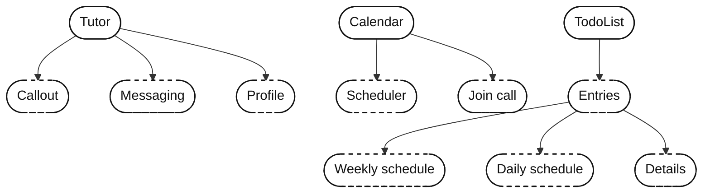
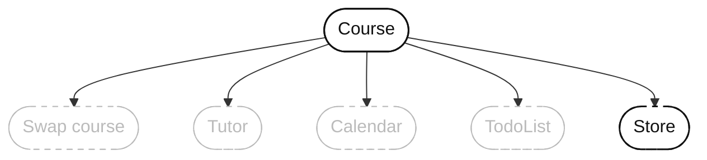
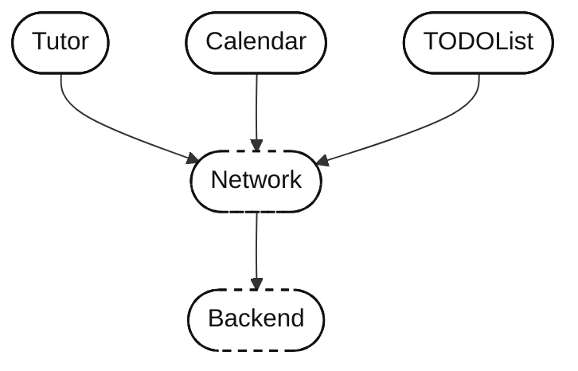

## 시스템 디자인은 왜 중요한가
- 소프트웨어는 비싸다. (지금도?)
	- 구현에 드는 시간을 줄이고, 새 요구와 기능에 발빠르게 대응하는 능력이 중요하다.

- 어떤 변화에도 준비되어 있어야 하고, 아무도 쓰지 않는 기능을 만드느라 시간을 낭비해선 안된다.
- 모바일 시스템 디자인은 커져가는 코드베이스를 관리하면서, **앱을 높은 품질로 빠르게 개발하고 필요한 곳을 고칠 수 있도록 보장**해준다.

## [[02. 브리핑에서 계획으로]]
- 한 달의 코딩은 2주의 계획 시간을 아낀다는 말이 있다.
- 이번 장에서는 요구사항을 처음 받았을 때 접근 방법에 대해 알아본다.
	- 이 장을 마치면, 명세와 디자인을 받는 멘탈 모델을 알게 된다.

### 브리핑
- 최종 페이지에 가까운 디자인을 최초로 받게 되었다.
- 이 때 첫인상을 보면 꽤나 완벽해 보인다.
	- 하지만 목록이 비어져 있거나, 버튼이 어떻게 동작하는지는 완벽하게 알 수 없다.
	- 테블릿 상황, 가로 모드에서의 UI도 미지수다.
	- 우리가 아는 미지수 외에, 우리가 모르는 미지수도 존재할 것이다.

### 브리핑에 대한 접근법 평가
- UI부터 만드는 방식은 매우 쉽지만, 여러 각도에서 브리핑을 둘러보지 못하게 한다.
	- 생각하지 않은채로 "일단 만들기" 시작하게 만든다.
	- 이로 인해, 숨은 요구사항이나 기능을 늦게 발견하게 된다.
	- 일찍부터 기술 부채가 쌓일 가능성이 급증한다.

#### 데이터 중심 접근?
- 필요한 정보와 저장 정보, 주고받는 정보를 먼저 생각한다.
- 이는 좋은 생각이다.
	- 어떤 필드가 `nullable` 한지, 이에 따라 어떤 UI를 숨길 것인지 스스로 질문할 수 있다.

- 데이터를 생각하면 필요한 기반도 함께 생각하게 된다.
	- 이는 영속성, 캐싱, 네트워킹과 같은 것을 의미한다.
- 좋은 출발점이지만, 완벽한 앱 설계를 시작부터 추구해선 안된다.

#### 앱 스켈레톤, 플로우 스켈레톤?
- 네비게이션, 탭바, 스켈레톤 뷰와 같이 앱의 뼈대부터 생각하는 방법이다.
	- UI와 기능에 집중하지 않아, 화면 사이 플로우를 추가하고 제거하는 비용이 저렴하다.
	- 프로그램의 감을 잡기 좋다.
	- 플로우를 통째로 받은 경우 좋은 접근 방법이다.

#### 컴포넌트와 단일 UI 위주로 접근?
- 좋은 방법이지만, 전체 흐름을 바라보기 힘들게 만든다.
- 또한 시야가 좁아져 완벽을 추구하려들기 쉽다.

#### 다이어그램 그리기?
- 다이어그램을 그리면 모든 것이 어떻게 연결되는지, 무엇을 만들지 말아야 하는지 먼저 파악할 수 있다.
- 시스템 전체를 생각할 수 있어 큰 도움이 된다.
- 팀 내에 도입하면, 한 시스템에 대해 모두의 생각을 쉽게 볼 수 있다.

#### 아키텍처?
- 코드를 한 줄도 치지않은 현 시점에서는 너무 이르다.
- 구현하기 전, 어떤 아키텍처가 이미 생각났다면 이는 **편향적 시각을 가졌다는 신호**일 수 있다.
	- 여러 상황에서 여러 아키텍처를 써봐야 한다.
- 아키텍처와 관련하여 은탄환은 없다.
	- 현재의 트렌드와 모범 사례가 존재할 뿐이다.
- 일단 구현하고, 문제가 생기면 그 때 필요한 구조를 도입하면 된다.
	- 앱 내에서 여러 아키텍처가 혼재되어 있는 경우도 흔하다.

#### 추천 접근
- 브리핑을 받았을 때 추천 접근 방법은, 좁은 디테일이 아니라 넓은 스케치부터 시작하는 것이다.
	- 숨겨진 요구사항이 무엇인가?
	- 드러난 문제와 드러나지 않은 문제는 무엇인가?
	- 위 두개를 먼저 파악하는게 우선이다.

- 접근과 관련하여 최선의 결정은 **문제를 이해하는 것**이다.
	- 문제를 이해하면 잘못된 과정이나 빠진 기능을 점검할 수 있다.
	- 다이어그램부터 그리면 이 과정이 좀 더 쉬워진다.

### 랜드스케이프 스케치
- 요구사항 구현에 필요한 도메인, 컴포넌트의 모음을 의미한다.
- UI에 보이는 뻔한 기능을 평문으로 적는 것으로 시작한다.

**기능 목록:**
- 일종의 TodoList
    - TodoList 항목은 반복된다 (주 단위나 일 단위, 어쩌면 다른 주기도?)
    - TodoList 항목은 상세를 열 수 있다 (상세 내용은 미지수)
- 튜터 프로필
    - 아바타와 이름이 있다
    - 튜터에게는 닫을 수 있는 콜아웃이 있다
    - 튜터에게 연락하는 일종의 메시징 기능이 있다
- 일종의 캘린더 기능
    - 예정된 1:1 캘린더 이벤트 요약이 있다
    - 일정 변경 기능
    - 통화 참여 기능
- 코스 전환 : 상단을 보면 사용자가 다른 튜터의 다른 코스를 열 수 있다

- 그리고 평문으로 적은 기능 목록을 다이어그램으로 바꿔본다.

- 생각이 마무리된 도메인이나 컴포넌트는 실선으로 표기한다.
- 생각이 마무리되지 않았거나 요구사항이 아직 막연하다면 점선으로 표기한다.

- 다이어그램을 줌아웃하면 기능들이 모두 하나의 노드를 기점으로 연결되는 것을 확인할 수 있다.
- 우리는 스케치하고 반복하며 요구사항을 배워가는 중이다.
	- **즉, "이만하면 됐다" 수준까지만 다이어그램으로 그린다.**

#### 어디까지 분해하나
- 계속 다이어그램을 그리다보면 거대한 컴포넌트 그래프가 완성된다.
- 일단, 구현이 시작 가능할 정도로 **문제를 이해했다고 느껴질 때까지 분해**한다.
	- 다만 너무 디테일하게 생각하기보단, 추상적으로 컴포넌트들을 그려나간다.
	- **나중에 풀어야 할 문제가 있음을 인정해야 한다.**

### 2차 요구사항 드러내기
- 지금까지는 UI에 집중했다면, 이제는 숨은 요구사항과 엣지 케이스를 찾아야 한다.
	- **"일단 만들기 시작" 하는 순간 나중에 뼈아프게 다가온다.**
	- 추후 알게된 디테일로 인해 몇 주간 생성한 기능을 새로 만들어야 할 수 있다.

- **IDE를 키지 말고, 사람들과 많이 대화해야 한다.**
- 시간을 들여 미지의 요구사항을 파악하는 것이 중요하다.
	- 기능 생성에 필요한 컴포넌트가 무엇인지 파악하라.
	- 무수한 질의응답으로 빠진 요구사항이나 기능이 있는지 파악하라.
	- 디자인에 도전하라. 어떤 상황에서 디자인이 깨질 수 있는지 파악하라.
- **그러면 남들이 미처 생각치 못한 디테일이나 누락된 요소를 발견할 가능성이 크다.**

### 디자이너와 일하기
- 디자이너와 일하는 목적은 세 개다.
	- 우리가 문제를 더 잘 이해하기 위해서다.
	- 그들도 문제를 더 잘 이해시키기 위해서다. (우리가 기술적 관점을 제공해서)
	- 엣지 케이스를 찾고, UI의 우선 순위를 매기기 위해서다.

- 디자이너와의 생산적 대화를 통해 개선된 디자인과 기능을 얻을 수 있다.
	- 더 나은 디자인과 계획을 위해 바짝 붙어서 일한다.

#### 디자인은 "법" 인가?
- 디자인을 100% 따라야 하는 "법"인지, 해석의 여지가 있는 커뮤니케이션 도구인지 헷갈릴 수 있다.
- 일단, **디자인이 모든 변형에 대한 케이스를 담았을 것이라고 가정할 수 없다.**
	- 지원하는 기기의 환경은 너무 다양하고, 이것을 모두 디자인이 정의할 수 없기 때문이다.
- **디자인은 그저 최종 제품의 근사치일 뿐이다.**

#### 픽셀 퍼펙트?
- 픽셀 퍼펙트는 UI와 디자인을 100% 동일하게 만드는 것을 의미한다.
- 하지만 이 역시 달성하기 어려운 과제다.
	- 화면마다 환경이 모두 다르고, 다크모드나 RTL, 접근성 관련 폰트 크기를 모두 고려하기 힘들기 때문이다.

- **픽셀 퍼펙트 역시 대개 근사치다.**
	- 어느 시점부턴 "이 디자인이면 합의 후 출발하기 충분하다" 로 정해야 한다.
	- 디자인이 모든 것의 절대 법일수는 없다.

- 과정의 매끄러움을 위해선 **디자인을 "출발점"으로 세워야 한다.**
	- 개발 중 디자이너와 이야기를 나눠 함께 개선해나가야 한다.
	- 큰 폰트, 작은 폰트 지원, 애니메이션 등 예상치 못한 케이스에 대한 의사결정에 그들이 동의하는지 확인해야 한다.

#### 디자인은 보통 최상의 시나리오를 담는다
- 현실은 무작위하고 지저분해 디자인에 늘 들어맞을 수 없다.
	- 미학적 디자인이 실전에서도 매력적일 것이라고 보장할 수 없다.

- 부실한 컨텐츠를 넣은 최악의 시나리오를 요청하라.
	- 텍스트가 빠져있어도 괜찮은지, 해상도가 형편없이 낮은 상황에서도 디자인이 버티는지 확인하라.
	- **최악의 컨텐츠 시나리오에서도 디자인은 깨지지 않아야 한다.**

- 최상의 시나리오로만 짜여진 디자인이 나중에 문제를 일으키기 전에, 선제적으로 찾아내는 편이 낫다.

#### 모든 것의 우선순위가 같진 않다
- 디자인의 모든 것을 절대적이고 완벽한 진실이라 받아들여 맹목적으로 코드를 구현해선 안된다.
- **디자인을 받았을 때, 기능의 우선순위를 정해야 한다.**
	- 때로는 기능 자체를 만들지 않는게 개발자, 디자이너 모두를 위한 방법이 될 때도 있다.

- 디자이너는 문제를 분기처리 하는 네비게이션 바를 쉽게 넣을 수 있다.
	- 하지만 문제에 따라서 개발 구현에는 며칠, 몇주가 소요될 수 있다.

- **디자인을 받는 순간 사용자가 필요한게 무엇인지 비판적으로 생각하라.**
	- 디자이너와 함께 우선순위를 재평가하는건, 장기적으로 모두에게 이득이다.

#### 기존 컴포넌트가 있는지 확인하라
- 디자인을 받으면 컴포넌트들을 다른 엔지니어들과 함께 확인하라.
	- 이미 사용 가능한 컴포넌트가 있다면, 그것을 사용한다고 설득하라.
- 시간이 남거나 정말 명확한 이유가 있는게 아니라면, 컴포넌트를 재활용하라.
	- 시간을 절약하는 것은 물론, 중복 컴포넌트에 대한 유지보수 비용을 아낄 수 있다.

#### 일반적인 UI 질문 던지기 
- 디자이너가 아직 생각하지 못한 것들을 떠올려보기.
	- 화면에 다 들어가지 않을 만큼 정보가 많으면? 화면을 스크롤 가능하게 만들 것인가, 요소 크기를 조절할 것인가?
	- 화면이 비어 있을 때는 어떻게 보이나? (우리 경우, 튜터가 아직 아무 정보도 채우지 않았다면?)
	- 작은 기기에서 큰 폰트를 생각해 봤나? 화면이 깨지나?
	- 라벨이 길거나 장황한 언어에서는 화면이 어떻게 보이나? 예를 들어 독일어는 텍스트가 더 길다. 들어가긴 하나?
	- 태블릿은 생각해 봤나? 화면이 너무 비어 보이지 않나?
	- 가로 모드를 지원하나?
	- 오류는 어떻게 다루나? 그냥 알림창을 띄우나, 아니면 더 근사한 인라인 방식인가?
	    - 부분 오류는? 예를 들어 튜터 데이터는 로드됐는데 `TodoList` 는 로드가 안 되면, 부분 오류를 보여 줄 것인가, 화면 전체 오류를 던질 것인가?
	- 다크/나이트 모드를 지원하나?

#### 기능 관련 질문 던지기
- 기능이 의도와 다르게 동작할 수 있는 엣지 케이스에 대한 질문을 던진다.
	- 사용자가 `TodoList` 항목을 완료하면, 그 즉시 서버로 보내는 건가? 그렇다면 그 네트워크 호출이 실패하면? 거대한 알림창은 과할 수 있다. 노티피케이션이나 토스트 같은 걸 쓸 수 있을까? 실패하면 todo 항목은 저절로 원래 상태로 돌아가나?
	    - 사용자가 앱을 백그라운드로 보낸 사이 네트워크 호출이 실패하면, 조용히 실패하게 둘 것인가, 앱이 로컬 노티피케이션을 보낼 것인가?
	- 모든 todo 항목에 상세 화면이 있나? 아니면 옵션인가?
	- 모든 todo 항목에 일정이 있나? 마감 없는 미예약 todo 항목도 있을 수 있나?
	- 튜터가 (아직) 계획을 안 만들었으면? 학생에게는 뭐가 보이나?
	- 아직 튜터를 고르지 않았다면 화면은 어떤 모습인가?
	- 튜터의 콜아웃 메시지가 극단적으로 길면? 잘라야 하나, 누르면 펼쳐지나? 몇 줄에서?
	- 일일 `TodoList` 항목은 자동으로 리셋되나? 그 시점은 언제인가? 사용자의 로컬 타임존 자정? 아니면 24시간 뒤 같은 X 시간 이후?
	- "reset all"을 누르면 경고를 받나? 알림창 같은 걸로?
	- 사용자가 튜터의 콜아웃을 닫으면 영영 사라지나? 되살릴 수 있나?
	- 캘린더 이벤트가 준비되기 전에 참여하면? 빈 미팅에 들어갈 수 있나, 오류를 받나?
	- Calendar 통화는 링크인가, 앱 안에서 처리되나?
	- 메시지는 링크인가, 앱 안에서 처리되나?

- 스스로 앱을 사용한다고 생각하면, 실용적 질문이 나온다.
	- 문제에 대해 생각하면 화면 이해도가 올라가는 것은 물론, 문제에 대한 주인 의식이 생긴다.

#### 오류 처리 이야기하기
- 기능 구현이 보통 우선이라, 개발자와 디자이너 모두 경시하기 쉬운 부분이다.
	- 하지만 미리 생각해놓지 않으면, `Alert` 과 같이 UI를 막는 형태로 오류를 출력할 가능성이 커진다.

- 사용자 경험을 위해 UI를 막지 않는 오류로 가는 것이 최선이다.
	- 토스트나, 특별한 인라인 메시지를 가진 뷰가 좋은 예시다.
- 화면별 UI의 실패 지점은 하나일 수 있으나, 인라인 컴포넌트별로 있을 수 있다.

#### 이분법적 사고 대신, 정량 수치로 이야기하라
- 디자이너가 커스텀 네비게이션바를 디자인했다고 가정해본다.
	- 커스텀 네비게이션바는 제대로 만들기 꽤 어렵고, 유지보수는 더 어려울 수 있다.
- 이 때, "구현 가치가 있다" 와 "없다" 로 이분법적 사고에 빠지기 쉽다.
	- 이에 대한 관점이 옳아보여도, 남들에게는 뻣뻣한 개발자로 낙인찍힐 수 있다.

- **성급하게 "안 돼요" 라고 말하는 대신, 대화 초점을 우선순위와 일정으로 옮겨라.**
	- 실제로 이 디자인이 얼마만큼의 구현 시간이 소요되는지 이야기하라.
- 그 지점부턴 팀 차원에서 해당 디자인이 그만한 시간을 들일 가치가 있는지 결정할 수 있다.
	- 애플리케이션 중심 테마를 유지하는 커스텀 스타일이 그만한 가치가 있는 회사도 있다.

- **핵심은, 결과를 정량화하여 결정과 대안을 더 손에 잡히게 만드는 것이다.**

#### 디자이너에게 피드백 주기
- 누구나 피드백을 대범하게 받아들이는 것이 아니다.
- 개발자, 디자이너는 상황 자체도 다르다.
	- 디자이너는 몇 주간 디자인 후, 디자인 회의에서 승인을 받기 위해 일주일을 기다리기도 한다.
	- 몇 번 더 다듬은 후 결과물을 공개하면, 모든 부서 사람들이 한 마디씩 피드백한다.
	- **즉, 전문가와 비전문가 모두에게 비평받는 것이다.**
		- **UI에는 누구나 의견이 있지만, 코드에 의견이 있는 사람은 별로 없다.**

- UI를 비평만 하지 말고, 긍정적 언급으로 피드백의 균형을 맞추고 객관성을 유지하기 위해 노력하라.

#### 랜드스케이프 갱신하기
- 디자이너와 이야기하면, 다음과 같이 여러가지를 배울 수 있다.
	- 앱은 폰 전용이다. 태블릿은 아니다.
	- 다크 모드는 필요하지만 나중 단계에 한다. (낮은 우선순위로 표시)
	- 주간·일간 스케줄은 자동 리셋된다. (앱에서인지 백엔드에서인지, 얼마나 자주인지는 아직 미지수)
	- Scheduler 는 피커를 연다. (디자인은 아직 없다)
	- 일정을 제안하면 상대방이 동의해야 한다. 상대가 동의하지 않은 채 일정이 지나가면 제안된 일정은 삭제된다.
	- 첫 버전에서는 멀티 코스를 지원하지 않기로 합의했다.

- 이때부턴 랜드스케이프 그래프에 들어가지 않을 디테일이 많이 드러난다.

#### 빠른 앱이 핵심이다
- 디자이너가 이런 이야기를 한다.
	- TODO앱을 만든다면, 사용자들은 잽싸게 들어와서 항목을 체크하고 앱을 떠나고 싶어 한다.

- 이런 경우라면, 앱이 서버에 의존해선 안된다.
	- 서버에 의존할 경우 데이터를 가져오고, 오류가 안나길 빌어야 하고, 네트워크 호출이 정상적으로 이루어지길 기도해야 한다.

- **디자이너가 한 이야기가, 우리가 만들어야 할 "무언가", 즉 비기능적 요구사항으로 번역할 수 있다.**
	- 이 경우엔 오프라인 모드 지원일 것이다.

- 저장소가 `NoSQL` 일지, `MySQL` 일지는 아직 중요하지 않다.
	- 디자이너와 고객은 동작하기만 하면 세부사항에 대해선 관심이 없다.
	- 이 단계에서 필요한건 **무엇을 만들것인지에 대한 이해도**지, 세부사항이 아니다.

- 랜드스케이프를 갱신하여 `Store` 라는 로컬 저장소 영역을 추가한다.
	- 물론, 세부사항을 모르니 점선으로 표기한다.

#### 기타 기능
- 캘린더 앱을 만든다면 일정 변경과 취소 기능도 필요할 것이다.
	- 이는 "달력" 화면의 범위 밖에 있는 기능이므로, 새로운 플로우를 별도로 트리거해야한다.
	- 이 경우 랜드스케이프 내에 적어는 두되, 크게 집중할 필요는 없다.
	- 보통 점선으로 표기한다.

- 메시지 보내기, 통화 열기 등 애플리케이션 영역이 아닌 곳에 의존해야 하는 경우도 있다.
	- 이것들을 딥링크라고 가정하고, 그래프에 추가한다.
	- 언젠가 필요하겠지만, 현 단계에서 세부사항을 알 필요는 없으니 점선으로 표시한다.

### 백엔드 엔지니어와 합 맞추기
- 이제는 백엔드 엔지니어와 이야기하여 데이터 흐름과 관련된 2차 요구사항과 디테일을 파악한다.
	- 현실에서는 백엔드 엔지니어가 문서를 주는 경우가 대부분이다.

#### 사용자 세션, 환경, 토큰, 타임아웃 맞추기
- 백엔드 호출에 필요한 정보들은 최대한 빨리 얻어내야 한다.
	- 나중에 부딪힐 문제들을 즉시 배울 수 있다.
	- 스테이징 환경이 없거나, 백엔드에서 만들어준 계정에 필요 권한이 없을 수도 있다.
	- 이런 제약들은 일찍 아는게 낫다.

- 터미널에서 `cURL` 같은 도구로 API 호출을 미리 실험해보는 것도 방법이다.
	- 문제가 백엔드쪽인지, 아닌지 확인할 수 있어 시간이 절약된다.

- 기능 특화 세부사항도 있다.
	- 로그인 화면이 아직 없는데 어떻게 토큰을 획득할 것인가?
- 타임아웃도 중요하다.
	- 오래 로그인 한 상태로 API 호출 시 타임아웃이 트리거되나?
	- 그렇다면 어떤 오류를 내려줄 것인가?
	- 타임아웃 요구사항이 있다면 모든 API 호출이 이 메커니즘과 함께 동작해야 한다.

#### 네트워크 호출 통합 맞추기
- 화면 하나를 채우는 데 API 호출 하나로 될지, 여러 번 호출해야 할지 확인한다.
	- 여러 번 호출은 일반적으로 백엔드에게 쉬운 길이다.

- 화면을 채우는 데 여러 API 호출이 필요하다면, iOS에선 이를 감당할 로직을 만들어야 한다.
	- 백엔드는 보통 "엔드포인트는 순수하고, 시멘틱해야 해요" 라고 이야기한다.
	- (혹은 추가 작업이 싫거나 시간 자체가 없는 사람)

- 커피로 백엔드 개발자를 매수할 수 없다면 대화를 선택하라.
	- Android 앱, 웹에서도 지원해야 한다면 클라이언트 세 개 영역에서 API를 조합해야 한다.
	- 백엔드에서 한 번하자고 프로젝트 오너를 설득하는 것이 가장 효율적이다.

#### 오류에 대해 같은 페이지에 서기
- 단일 엔드포인트에서 모델별로 세분화된 오류를 주는지, "문제가 발생했어요" 오류 하나인지 확인한다.

- 개발자들이 가장 간과하는 점은, **클라이언트에서는 오류 메시지를 다국어 처리해야 한다는 점이다.**
	- 이 때 필요한건 오류 코드다.
	- 오류 코드 뒤의 의미를 백엔드 엔지니어와 맞춰, 각 코드가 어떤 오류를 뜻하고 앱에서 어떻게 번역되는지 목록을 제안할 수 있다.

#### 백엔드 커스텀 오류 코드에서 벗어나도 된다
- 백엔드에서 코드 11은 "DB에서 리스트를 불러올 수 없음", 코드 12는 "블라블라" 로 정의할 수 있다.
- **하지만 이 때 백엔드와 완전히 맞출 필요는 없다.**
	- 그래서 오류 코드를 항상 동기화 상태로 유지하는 것이 불가능한 경우가 있다.

- 백엔드는 오류를 안줬는데 데이터를 파싱하다가 클라이언트 특유의 오류가 날 수 있다.
	- 그러니, 백엔드와 공유되지 않는, 백엔드 코드 위에 얹히는 오류 코드가 여전히 필요하다.

#### 백엔드의 베타테스터일 수 있다
- 백엔드와 통신하는 첫 클라이언트를 만든다면, 과정이 훨씬 느릴 가능성이 크다.
	- 검증되지 않은 새 베타 버전 백엔드를 처음 써보는 고객이 되는 것이다.

- 첫 백엔드 버전은 모호한 메시지의 오류를 받거나, 알 수 없는 `500` 오류를 받을 수도 있다.
	- 어떤 쪽이든, 앞으로 나아가기 위해선 백엔드 개발자의 수정을 훨씬 오래 기다리게 된다.
- 이 때는 연동 중 버그를 만났을 때 어느쪽의 문제인지 쉽게 파악하기 어렵다.
	- `cURL` 이라는 툴을 사용하면, 문제 범위를 좁히고 누구의 문제인지 확정할 수 있다.

- **일정 계획 시, 본인이 첫 연동자라면 연동에 걸리는 시간이 두 배, 세 배 걸릴 것을 감안해야 한다.**

#### 다른 클라이언트 구현체의 코드 읽기
- 가능하다면 백엔드와 통신하는 다른 클라이언트 소스를 살펴보는 것으로 백엔드 연동 속도를 크게 향상시킬 수 있다.
	- 프로그래밍 언어가 낯설어도, 요지만 파악할 수 있으면 충분하다.

#### 푸시 알림 고려하기
- 푸시 알림이 UI 일부는 아니어도, UX의 일부중 하나다.
- **푸시 알림을 동작시키려면 기기를 백엔드에 등록하는 것도 생각**해야 한다.

- 로컬라이징도 감안해야 한다.
	- 기기의 언어를 백엔드에 전송하는 로직을 고려해야 할 수 있다.

#### 기능 특화 질문
- 2차 요구사항을 드러내기 위해 던질 수 있는 질문들을 생각한다.
	- 어떤 필드가 옵셔널인가?
	- 데이터를 한 번에 다 받나, 조립해야 하나?
	- 앱은 `TodoList` 항목을 어떻게 제출하나?
	- 일부 `TodoList` 항목이 24시간마다 리셋된다면, 이걸 어떻게 주고받나? 백엔드가 우리 타임존을 아나? 클라이언트가 보내 주나?
	- 포맷은 뭘 쓰나? JSON, GraphQL, Protocol Buffers, 아니면 다른 것?
	- 고객이 매번 가져가는 데이터는 뭔가? 그렇다면 일부는 로컬에 캐싱할 수 있지 않을까?

- 맥락에 따라 원하는만큼 상세하게 가져갈 수 있다.
- 다만 역시, 아무것도 구현하지 않은 상태이므로 큰 그림만 잡는다.

#### 백엔드 요구사항으로 랜드스케이프 갱신하기
- 화면 내에서 몇 가지는 API 호출이 필요하다는 사실을 알게 되었다.
- 다만 이 단계에서 구현 디테일까지 파악할 필요는 없다.

- `Network` 도메인을 추가하고, 점선으로 표시할 수 있다.

### 당신이 백엔드와 디자인 사이의 연결고리다

- 정기 미팅을 하더라도 클라이언트 작업 중 어긋난 디테일과 오해는 드러나기 마련이다.
	- 디자이너와 백엔드는 팀 미팅에서 일반적 정보만 공유하거나, 각자 사일로에서 일할 수 있다.

- **백엔드 API를 연결하는 클라이언트 개발자가 둘 사이의 연결고리가 되어야 한다.**
	- 주고 받는 데이터를 UI에 어떻게 반영할지 생각해보자.
	- 그리고 그 엣지케이스들을 찾아내려 노력하자.

- **보통은 `nullable` 이슈가 많다.**
	- "이름은 채워져 있을 수도, 아닐 수도 있어요"
	- 하지만 디자이너는 데이터가 항상 있다고 가정하면 UI가 깨질 수 있다.

- 거꾸로, 백엔드 디자이너가 데이터에 대해 잘못된 가정을 할 수 있다.
	- 고객의 이름이 항상 있다고 생각할 수 있지만, 사실은 아니다.
	- 이러한 문제들을 고치기 위해 코드베이스를 수정하고, API 명세가 달라지고, 문서가 갱신된다.

- **이러한 문제를 막기 위해 연결 고리가 되어 잘못된 가정을 드러내야 한다.**
	- 구현 중 문제를 발견하지 말고, 어긋난 사실을 일찍 찾아내라.

### 마치며
- 받은건 화면 하나지만, 고려할게 너무 많아졌다.
	- 시간을 들여 생각하니 무엇을 만들지에 대해 입체적인 그림이 생겼다.
	- 이로 인해 아키텍처의 컴포넌트, 도메인을 표현하는 랜드스케이프 그래프를 획득했다.

- 바로 프로그래밍을 시작하지 않았지만, 시간을 아끼고 올바른 것을 만들 수 있다.
- 먼저 시간을 들여 생각하는 것이, 코드 구현 후 계획이 없어 대부분을 리팩터링하는 것보다 훨씬 낫다.

