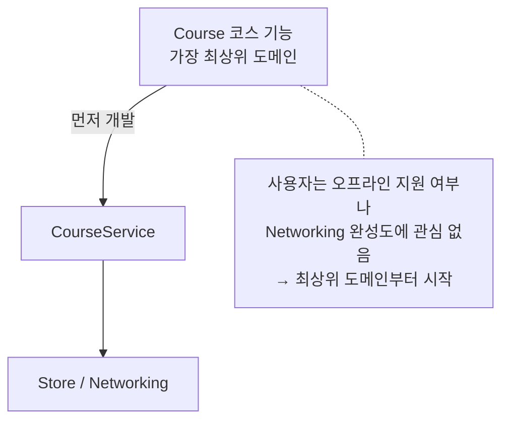
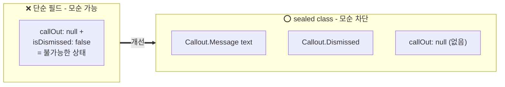
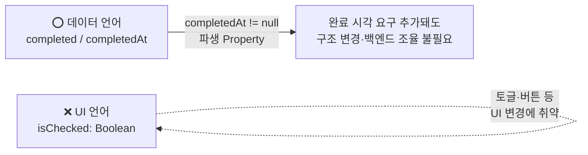

# Holistic-Driven Development: Turning a Plan Into Code

### 무엇을 먼저 개발할 것인가?



- 첫 번째 코드의 시작점은 가장 상위에 있는 도메인이다.
- 우리가 강의 코스 기능을 만들라는 임무를 받으면 이것이 가장 최상위에 있는 도메인이다.
- 사용자에게는 내부적으로 Store가 오프라인을 지원하는지, Networking이 완벽한지가 중요하지 않다.

### 코스 도메인 데이터 모델링

#### 불가능한 상태의 차단

```kotlin
data class Tutor(
    val id: String,
    val displayName: String,

    val callOut: String?,
    val isCallOutDismissed: Boolean
)
```

- Tutor 모델을 교사의 안내 메시지(`callOut: String?`)와 이를 닫았는지 여부(`isCallOutDismissed: Boolean`)를 단순 필드로 선언한다면
- 메시지 내용이 없는데(`callOut`이 null), 화면에서 열려 있는 상태(`isCallOutDismissed`가 false)인 논리적으로 불가능한 상태가 발생할 수 있다.
- enum 클래스 등을 활용하여 데이터 구조 자체의 모순이 없도록 하자.



```kotlin
data class Tutor(
    val id: String,
    val displayName: String,

    val callOut: Callout?
)

sealed class Callout {
    data class Message(val text: String) : Callout()
    object Dismissed : Callout()
}
```

#### UI 언어가 아닌 데이터 언어 사용하기



- 체크박스 UI가 있다고 해서 변수명을 단순히 `isChecked`로 지으면 안 된다.
- 토글의 형태가 됐든 버튼의 형태가 됐든 UI는 언제든 변경될 수 있으므로, `completed`라는 명칭을 사용하면 좀 더 범용적으로 사용할 수 있다.
- 또한, 단순히 완료 여부를 Boolean으로 저장하는 대신, 완료된 시점이 null이 아닐 경우에 대한 파생 Property를 사용하면 나중에 완료된 시간을 보여달라는 기획이 추가되어도 데이터 구조를 변경하거나 백엔드와 조율하지 않아도 된다.

#### 미루는 것은 게으른 것이 아니다

- 미루는 것은 게으른 것이 아니라, 최종 목표를 시야에서 놓치지 않기 위함이다.
- 지금 당장 상세 구현을 하게 된다면 정작 큰 기능의 뼈대를 맞추는 속도가 느려진다.
- placeholder를 통해서 세부 사항은 뒤로 미루고, 빠르게 최소한의 프로토타입을 뽑아내는 것이 중요하다.

### CourseService 정의하기

- 데이터 모델이 정의됐다면 어떻게 공급할지 생각해야 한다.
- 세부 구현 없이 Service를 만든다고 해도 임의의 딜레이를 주어서 비동기적으로 동작하도록 해야 한다.
- 비동기 문제를 염두에 두고 UI를 만들도록 해서, 세부 구현이 끝난 뒤에도 문제가 없도록 하기 위함이다.

### Store 컴포넌트 설계하기

- 마찬가지로 세부적인 구현 사항(저장소를 무엇을 쓸지)들을 미루고, 단순히 HashMap과 같은 인메모리 저장소를 통해 먼저 구현해라.
- 호출자의 입장에서 먼저 설계하고, 안에서 유통기한 지난 데이터는 어떻게 처리할지, 오프라인 데이터와 동기화는 어떻게 할지는 나중에 고민해라.
- 특정 도메인에 종속되는 타입(e.g., `CourseStore`)으로 만들면 네이밍이 좀 더 직관적이겠지만, 코스 정보만 담게 된다.
- 하지만 꼭 도메인에 종속될 필요가 없고, 종속시킬 경우 유연성을 잃기 때문에 독립적인 컴포넌트로 만드는 것도 좋은 선택이다.

### 점진적 개발 흐름 한눈에 보기


## What we covered

### 호출자 우선 컴포넌트 설계

- 내부 구현 상세보다 호출자 입장에서의 API를 먼저 설계하라.
- 좋은 API 설계를 위해서 처음부터 인터페이스를 도입할 필요는 없다. (추상화를 너무 일찍부터 도입하면 족쇄를 차기 때문)

### 튼튼한 아키텍처를 위한 데이터 모델링

- 논리적으로 불가능한 데이터는 피해라.
- 단순 ON/OFF를 위한 Boolean 타입을 택하기보다, 발생 시점의 null 여부를 통해 파생 속성으로 두는 것처럼 더 풍부한 정보를 담는 데이터를 축적하면, 요구사항이 바뀌어도 유연하게 대응할 수 있다.
- `isChecked`와 같은 UI 언어를 배제하고 `isCompleted`와 같은 데이터 언어를 사용해라. 형태가 토글이 되든, 버튼이 되든 데이터 레이어가 흔들리지 않고 대응하기 위해서다.

### 플레이스홀더 주도 개발

- 세부 구현을 미루기 위해 컴파일을 위한 가짜 데이터를 먼저 채워 넣어라.
- 서비스 설계에 있어서 비동기 처리를 위한 가짜 지연을 넣어서, 처음부터 비동기 이슈를 고려하도록 해라.
- 한 컴포넌트를 끝장내지 말고, 플레이스홀더를 한 단계씩 하위 레이어로 밀어 넣으며 점진적으로 개발하라 (Course → CourseService → Store).
- 플레이스홀더를 만들어두면 컴파일이 되므로, 추후 디테일한 구현에 대한 우선도는 낮아진다.

### 의존성 레이어 전체를 아우르는 개발

- 가장 높은 최상위 도메인부터 시작해서 하위 레이어로 파고 들어라.
- 오프라인 동기화, 네트워킹 같은 세부사항은 뒤로 미루고 시스템의 전체 연결 고리를 먼저 설계해라.
- 전체 흐름을 먼저 완성하고 각각의 세부 사항을 완성해라.

### 기반 컴포넌트의 generic 화

- 기반 컴포넌트는 특정 도메인에 종속되지 않도록 비즈니스 로직을 알아서는 안 된다.
- 도메인에 소속된 컴포넌트(e.g., `CourseStore`) 대신 generic을 사용해서 범용적으로 설계하면, 나중에 어떤 것을 담든 큰 변경 없이 재사용할 수 있다.
