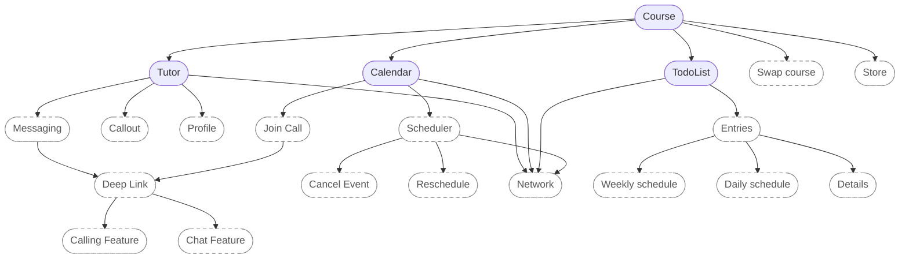
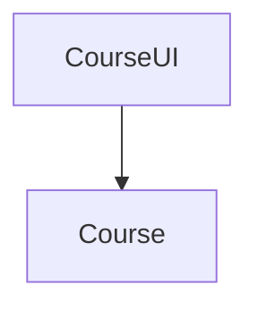
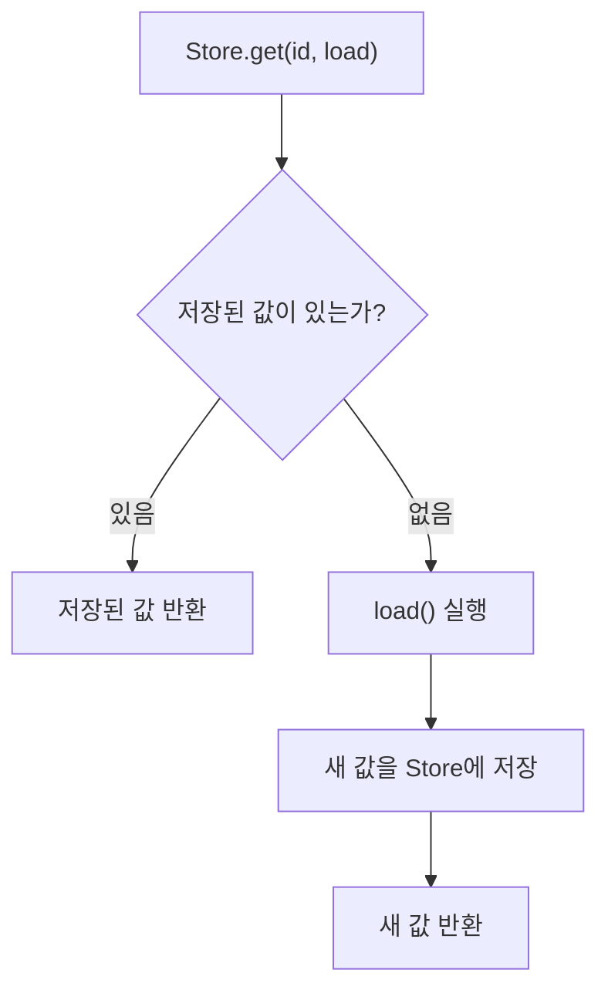
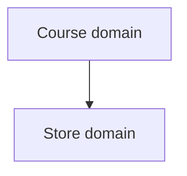
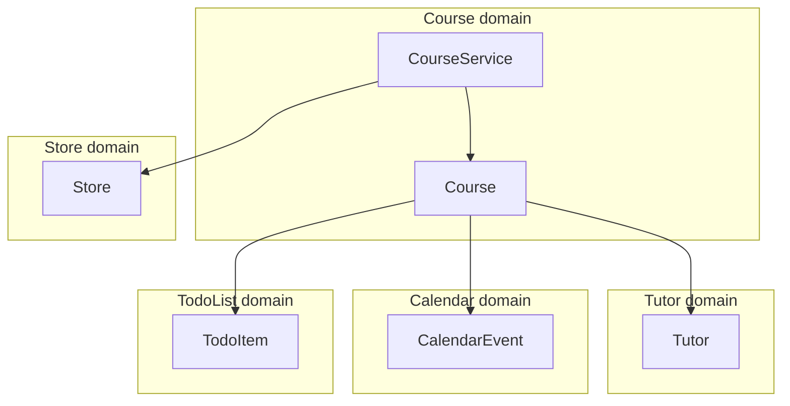

# [WEEK 08] Book 0 Chapter 3
📖 Mobile System Design 0. From Briefings to System Architecture  

<br>

## 3 Holistic-Driven Development: Turning a Plan Into Code
> 여러 domain을 하나씩 완성하기보다 필요한 API를 먼저 연결한다. 전체 구조가 동작하면 세부 구현을 채운다.  

### The relationship between graph nodes and code

전체 landscape를 펼치면 필요한 domain과 관계를 한눈에 볼 수 있다.  



각 node는 하나의 domain을 나타낸다. domain 안에는 여러 type과 구현이 들어갈 수 있다.  

- 실선 node: 윤곽이 잡힌 domain  
- 점선 node: 아직 구체화하지 않은 domain  

`Course` feature를 동작시키는 데 필요한 domain부터 구현한다.  

- `Tutor`, `Calendar`, `TodoList`, `Store`: `Course`의 직접 의존성
- `Networking`: backend 연동에 필요
- `Swap course`: 우선순위가 낮아 제외  

domain의 구현 규모는 처음부터 정해지지 않는다.  
`Networking`도 작은 helper function으로 시작해 큰 library로 발전할 수 있다.  

---

### A quick note about interfaces and APIs
#### 용어 정리

1. `API`는 backend API가 아니라 **type을 사용하는 방법**을 뜻한다.  
	- 예: `courseService.loadCourse()` 같은 class와 structs  

2. `interface`는 UI가 아니라 Swift의 `protocol`이나 Kotlin의 `interface` 같은 type을 뜻한다.  
	- 처음부터 interface를 따로 만들 필요는 없다.  
	- concrete type만으로도 API를 설계할 수 있다.  

---

### What to prioritize

**domain 우선 순위 기준**  

- landscape에서 가장 위에 있는 domain
- 사용자에게 직접 전달해야 하는 feature

이 예시에서는 `Course`가 해당한다.  
완성된 `Calendar`보다 일부만 동작하는 `Course`를 먼저 만든다.  

#### We are deferring UI

`Course`부터 시작하더라도 UI를 먼저 만들 필요는 없다.  
model과 비즈니스 로직을 구현한 뒤 상위 `CourseUI` domain을 연결한다.  



`CourseUI`와 `Course`는 서로 다른 domain이지만 같은 모듈에 들어갈 수도 있다.  

#### The CourseUI domain doesn't care about Course internals

`CourseUI`는 `Course`의 API에만 의존한다.  
`Course` 내부를 바꿔도 API가 같다면 UI는 수정하지 않아도 된다.  

---

### Implementing the Course domain

`Course` domain은 call-site에서 어떻게 사용할지부터 정한다.  
사용 방법을 먼저 정하면 내부 구현에 앞서 API의 이름과 형태를 잡을 수 있다.  

#### Retrieving a course

`Course`를 어떤 API로 가져올지부터 정한다.  
`CourseService.loadCourse(id)`가 model을 반환한다고 가정하고 call-site를 작성한다.  

```kotlin
val course = courseService.loadCourse(UUID.randomUUID())

course.tutor
course.schedule
course.calendarEvent
```

이 코드를 컴파일하려면 두 가지가 필요하다.  

- `Course`, `Tutor`, `TodoItem`, `CalendarEvent` data model
- `loadCourse()`를 가진 `CourseService`

아직 실제 구현은 없다. 컴파일 오류를 확인하며 필요한 model과 service를 채운다.  

#### The Course data model

`Course`는 식별자와 화면에 필요한 세 가지 model을 담는다.  

```kotlin
data class Course(
    val id: UUID,
    val tutor: Tutor,
    var schedule: List<TodoItem>,
    val calendarEvent: CalendarEvent?,
)
```

- `schedule`: 완료 상태를 반영할 수 있도록 변경 가능하게 둔다.
- `calendarEvent`: 1:1 일정이 없을 수 있으므로 nullable로 둔다.

처음부터 모든 type이 준비될 필요는 없다. 필요한 type은 컴파일 오류를 확인하며 하나씩 정의한다.  

#### Using placeholders

> 실제 data가 없어도 placeholder로 전체 흐름을 연결할 수 있다.  

`Course.placeholder`를 반환하도록 만들고 세부 구현은 뒤로 미룬다.  

#### The Tutor data model

`Tutor` model은 기본 정보와 callout 상태를 함께 표현한다.  
`Tutor`는 다음 정보를 담는다.  

- 식별자, 이름, handle
- nullable avatar URL
- nullable callout message
- callout을 닫았는지 나타내는 값

처음에는 callout message와 닫힘 여부를 별도 property로 표현한다.  

#### Solving a modeling problem

`callOut == null`인데 `isCalloutDismissed == false`인 모순된 상태를 만들 수 있다.  
`Callout` type으로 가능한 상태를 제한해 잘못된 조합을 막는다.  

```kotlin
sealed interface Callout {
    data class Message(val text: String) : Callout
    data object Dismissed : Callout
}

data class Tutor(
    val callout: Callout?,
)
```

| 값 | 의미 |
|---|---|
| `null` | callout이 없음 |
| `Callout.Message` | message를 표시함 |
| `Callout.Dismissed` | 사용자가 callout을 닫음 |

#### Modeling TodoItem

`TodoItem`에는 완료 여부만 저장하지 않고 완료 시점까지 남긴다.  

| 선택 | 담을 수 있는 정보 |
|---|---|
| `isChecked` | 완료 여부만 알 수 있음 |
| `fulfillmentDate` | 완료 여부와 완료 시점을 모두 알 수 있음 |

`fulfillmentDate`가 있으면 완료 시점을 기준으로 정렬하거나 묶을 수 있다.  
나중에 완료 시간을 보여줘도 model이나 backend를 바꿀 필요가 없다.  

이름도 UI 표현인 `checked`보다 domain 상태를 나타내는 `completed`가 알맞다.  
체크 표시가 label이나 toggle로 바뀌어도 완료라는 의미는 그대로 유지된다.  

> [!Note]
> 현재 요구사항을 충족하면서 더 많은 정보를 남기는 data를 선택한다.  
> 이름은 UI 표현이 아닌 data modeling 관점에서 정한다.  

#### Creating TodoItem

`fulfillmentDate`만 저장하고 **`completed`는 여기에서 계산**한다.  
따라서 완료 상태를 두 property에 중복해서 저장하지 않는다.  
호출할 때는 `completed`를 Boolean property처럼 사용할 수 있다.  

```kotlin
data class TodoItem(
    val title: String,
    var fulfillmentDate: Instant? = null,
) {
    var completed: Boolean
        get() = fulfillmentDate != null
        set(value) {
            fulfillmentDate = if (value) Instant.now() else null
        }
}
```

#### Modeling a course's schedule

daily와 weekly 분류는 화면에만 필요한 로직이 아니므로 model에 둔다.  

**장점**  

- UI 밖에서도 재사용 가능
- 단위 테스트 가능

call-site는 다음처럼 읽히도록 설계한다.  

```kotlin
course.schedule
course.schedule.daily
course.schedule.weekly
```

Kotlin에서는 `List<TodoItem>`의 extension property로 표현할 수 있다.  
지금은 원래 목록을 반환하는 placeholder만 둔다.  
실제 날짜 필터링보다 `CourseService`를 컴파일하는 일이 우선이다.  

#### Modeling CalendarEvent

`CalendarEvent`는 일정 생성 feature 전체가 아니라 현재 화면에 필요한 읽기 전용 data만 표현한다.  
따라서 일정 시점인 `date`와 nullable `link`만 담는다.  

일정 생성과 참여 flow는 UI를 구현할 때 연결한다.  

#### Deferring == lazy?

구현을 미루는 목적은 일을 피하는 것이 아니라 `Course` feature를 연결하는 목표에 집중하는 것이다.  
지금은 `CourseService`를 사용할 수 있는 상태까지만 만든다.  
UI navigation과 offline sync는 뒤로 미룬다.  

---

### Defining CourseService

`CourseService`는 전체 코드를 컴파일하고 실행할 수 있을 만큼만 구현한다.  
- network 연동과 의존성 주입은 미룬다.  
- testing도 아직 다루지 않는다.  
- 대신 placeholder를 반환한다.  

호출 방식은 실제 연동과 비슷하도록 `suspend`와 인위적인 지연을 사용한다.  

```kotlin
class CourseService {
    suspend fun loadCourse(id: UUID): Course {
        delay(2_000)
        return Course.placeholder
    }
}
```

**인위적인 지연을 넣는 이유**  

- 실제 연동 전에 loading 동작을 확인할 수 있다.
- 즉시 반환되는 placeholder로는 놓치기 쉬운 비동기 문제를 확인할 수 있다.

---

### Designing a Store Component

`Store`는 data를 저장해 `CourseService`가 빠르게 불러오고 offline에서도 사용할 수 있게 한다.  
아직 내부 구조와 의존성은 정해지지 않았다.  
현재는 영구 저장까지 구현하지 않고 memory store로 API를 설계한다.  
복잡한 동기화 문제는 뒤로 미룬다.  

#### Starting from the call-site again

`Store`도 내부 구현보다 `CourseService`에서 어떻게 사용할지 먼저 정한다.  

- `loadCourse()`: `Store`를 먼저 확인하고 값이 없을 때만 `loadFresh()`를 호출한다.  
- `loadFresh()`: 최신 data를 가져온다는 의미만 담는다.  

network 같은 구체적인 source는 이름에 드러내지 않는다.  
외부에는 `loadCourse()`만 보이도록 `loadFresh()`는 private으로 둔다.  

#### The Store implementation

memory store는 식별자를 key로 삼아 generic type `T`를 저장한다.  
`CourseService`에서는 `Store<Course>`로 사용한다.  

```kotlin
class Store<T> {
    private val data = mutableMapOf<UUID, T>()
}
```

#### Designing the get() method signature

`Store`에 값이 있으면 바로 반환하고 없으면 새로 불러와야 한다.  
이를 위해 `get()`은 두 가지를 받는다.  

- 저장된 값을 찾을 식별자
- 값이 없을 때 실행할 비동기 `load` 함수

`load`가 끝날 때까지 기다려야 하므로 `get()`도 비동기로 동작한다.  

```kotlin
suspend fun get(
    id: UUID,
    load: suspend () -> T,
): T
```

Kotlin은 예외를 그대로 전달하므로 Swift의 `throws`나 `rethrows` 표기가 필요하지 않다.  
`Store` 내부가 조금 복잡해지더라도 call-site를 단순하게 만드는 편이 더 중요하다.  

#### Implementing the get() method

`get()`은 저장된 값을 먼저 찾는다.  
값이 없으면 `load()`로 불러온 뒤 저장하고 반환한다.  

```kotlin
suspend fun get(
    id: UUID,
    load: suspend () -> T,
): T {
    return data[id] ?: load().also { freshData ->
        data[id] = freshData
    }
}
```



#### Store is implemented naively on purpose

> 지금은 저장소를 완성하는 것보다 `CourseService`와 `Store`가 API로 연결되는지 확인하는 것이 우선이다.  

따라서 `Store`는 memory에 data를 저장하는 최소 기능만 구현한다.  

**나중에 해결할 문제**  

- 오래된 data의 갱신 시점
- 일부 data만 바뀌었을 때의 update와 동기화 충돌
- local 수정과 remote fetch가 겹칠 때의 race condition
- 여러 data type 지원과 thread safety

이런 문제를 아직 해결하지 않아도 현재 API로 전체 구조를 계속 연결할 수 있다.  

#### Placeholder implementations lower priorities

> placeholder 상태여도 API가 정해지면 이를 사용하는 쪽은 다음 작업을 진행할 수 있다.  

`CourseService`는 `Store`의 내부 구현이 아니라 `get()` API에만 의존한다.  
따라서 실제 저장 기능을 완성하지 않아도 전체 구조를 계속 연결할 수 있으며 `Store` 구현의 우선순위는 낮아진다.  

나중에 offline 기능이 필요 없어지거나 memory store만으로 충분해져도 버리는 작업이 적다.  

---

### Trade-offs when making a component reusable

`Store`는 `Course`보다 아래에 있는 독립 domain이다.  
따라서 `Course` model에 의존하지 않도록 generic으로 만든다.  



| 설계 | 결과 |
|---|---|
| `CourseStore` | 저장 기능이 `Course`에 종속됨 |
| `Store<Course>` | `Store`가 `Course`를 알 필요 없음 |

`Store`를 generic으로 만든 이유는 미래의 재사용 가능성이 아니라 현재의 domain 경계 때문이다.  

---

### The end result

`CourseService`와 data model을 연결하고 memory 기반 `Store`까지 동작하게 만들었다.  
이제 UI에서 `Course` domain을 사용할 수 있다.  



사각형 node는 domain 안에 구현된 type을 나타낸다.  
그림을 통해 각 type의 소속과 연결 관계를 확인할 수 있다.  

#### Testing our implementation

처음 작성한 call-site를 다시 실행해 지금까지 연결한 코드가 컴파일되고 동작하는지 확인한다.  
비동기 `CourseService`가 model을 반환하고 각 data가 정상적으로 출력되면 현재 단계의 목표를 달성한 것이다.  

---

### Conclusion

`Holistic-Driven Development`는 type 하나를 깊게 구현하기보다 **필요한 domain과 type을 먼저 연결**한다.  
일부 구현이 불완전해도 **전체 architecture와 data flow를 먼저 확인**할 수 있다.  

GraphQL처럼 익숙하지 않은 기술이 있어도 API부터 정하면 전체 구조를 설계할 수 있다.  
구체적인 연동 방식은 각 domain을 연결한 뒤 구현한다.  

---

### What we covered

**API-first component design**  

- call-site에서 먼저 사용 방법을 정한다.
- interface가 없어도 concrete type으로 API를 설계할 수 있다.

**Data modeling for robust architecture**  

- 강한 type으로 잘못된 상태를 막는다.
- Boolean보다 풍부한 data를 선택해 이후 변경에 대응한다.
- UI 표현이 property 이름과 model에 섞이지 않게 한다.

**Placeholder-driven development**  

- placeholder로 전체 구조를 먼저 컴파일하고 실행한다.
- 비동기 placeholder에 지연을 넣어 실제 호출과 비슷하게 만든다.
- placeholder를 한 단계씩 하위 domain으로 옮기며 세부 구현을 뒤로 미룬다.
- placeholder로 연결된 부분은 완성 우선순위가 낮아질 수 있다.

**Working holistically through dependency layers**  

- 우선순위가 높은 상위 domain부터 의존성 방향을 따라 내려간다.
- 하위 구현의 완성도보다 domain 간 연결과 전체 data flow를 우선한다.

**Making foundational components generic**  

- foundational component는 특정 상위 domain을 알 필요가 없도록 generic type으로 만든다.
