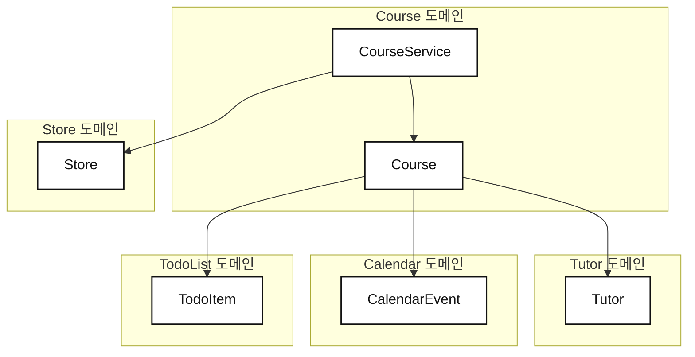

```table-of-contents
```

[[03. 전체론적 개발 - 계획에서 코드로]]

- 이번장에서는 전체론적인 설계 방법에 대해 알아본다.
- 코드를 스케치하는 단계로, 도메인을 정의하고 그들을 연결하여 프로토타입을 정의한다.
- 개별 부분에 집중하는 대신 전체적으로 바라보면, 디테일에 집중하면서도 빠른 속도를 유지할 수 있다.


## 그래프 노드와 코드의 관계
- 그동안 그렸던 랜드스케이프는 매우 복잡할 것이다.
- 당장 구현해야 할, 중요 기능과 그 기능을 구현하기 위한 의존성들만 우선 볼드 처리한다.
	- 나머지 기능들에 대해서는 우선 신경쓰지 않는다.

- 랜드스케이프 안의 노드는 클래스인가? 모듈인가?
	- **우선은 도메인으로 정의한다.**
	- 노드의 기능은 앞으로 엄청나게 커져서 SDK화 될수도, 그저 앱 내에서 사용하는 헬퍼가 될 수 있다.
	- “도메인” 이라고 명시하면, 기능의 크기와 관계없이 그 **정체성을 유지**할 수 있게 된다.

- 도메인 안에는 클래스나 메소드, 인터페이스나 지저분한 임시 방편(?) 등 여러 요소가 포함되어 있어도 된다.

## 인터페이스와 API
- 두 용어는 매우 다양한 뜻으로 해석된다.
- 해당 책에서는, API가 백엔드 API를 의미하지 않는다.
	- `UserService.getUser()` 와 같이 타입이 어떻게 쓰이는지를 정의한다.

- 인터페이스는 코틀린의 `interface` 와 같은 타입을 의미한다.
	- User Interface 가 아니다.
	- 하지만 해당 책에서는 `interface` 를 놀라울정도로 많이 다루지 않는다.
	- 설계도없이 프로젝트를 얼마나 디벨롭시킬 수 있는지 확인할 수 있다.

## 무엇을 우선할까
- **가장 중요한 도메인의 구현을 우선시한다.**
	- 일반적으로 랜드스케이프에서 가장 꼭대기에 있는 노드다.
	- 해당 도메인에서 데이터를 네트워크로 끌어오는지, 로컬에서 끌어오는지는 전혀 중요치않다.

- 해당 도메인의 부가 기능 도메인이 완성된 것보다, **가장 먼저 브리핑받은 최우선 도메인의 구현이 훨씬 중요하다.**

### UI는 미룬다
- 중요한 도메인이라도, UI를 먼저 구현하라는 것이 아니다.
	- 랜드스케이프에서 다룬 것은 정확히 얘기하면 도메인 혹은 비즈니스 로직 레이어다.
	- UI는 추후, 별도 모듈로 분리될 가능성도 존재한다.
	- UI 없이 동작하도록 모듈을 구성하는 것은, 훗날 테스트나 기능 검증 등 이점이 아주 많다.

- 반짝이는 버튼과 화면 전환에 신경쓰기 전에, **내가 맡은 도메인의 정상적인 작동**을 우선시한다.

### UI는 도메인에 대해 신경쓰지 않는다
- UI를 어떻게 짤지는 전혀 고민하지 않았다.
- UI 입장에서는 도메인 내부 코드가 어쩧게 구현되어 있는지 전혀 신경쓰지 않아도 된다.
	- 그저 필요한 데이터를 도메인에 요청할 뿐이다.

## 도메인 구현하기
- 도메인을 Call-site 단에서 어떻게 쓰고싶을지 생각해본다.
	- 이는 사용성 개선에 효과적으로 작용하는 접근 방식이다.
	- 내부가 어떻게 되어있는지보다, 어떻게 쓰는지가 더 중요하기 때문이다.

- 타입의 API가 단단하면 호출부를 고치지 않고 구현을 수정할 수 있다.
	- 호출자 측면에서 설계하면, 메소드 및 클래스 작명에도 도움이 된다.
	- 또한 구현 디테일도 크게 신경쓰지 않고 작업을 이어나갈 수 있다.

### 호출부의 입장에서 설계하기
- 도메인에서 데이터를 불러온다고 가정하고 IDE에 코드를 짜본다.
	- **중요한 것은 이 때 코드는 컴파일되지 않는 점이다.**
	- 빨간줄이 난무해도 우선 호출부의 입장에서 무엇을 불러와야 하는지 생각해본다.

- 호출부 입장에서 설계 후, 그 다음 상세 구현을 시작한다.
	- 이렇게 하면 네트워크, 테스트, 의존성 주입등의 구현 상세에 대한 생각에서 자유로워진다.

- 설계를 어느정도 완료했다면 실제로 컴파일이 되도록 구현에 들어간다.
	- 두 가지를 구현해야 한다.
		- 데이터 모델
		- 데이터를 불러오는 메소드
	- 이들을 구현하면 **최소한의 노력**으로 컴파일할 수 있다.

### 데이터 모델
- 도메인에 대한 데이터 모델을 설계한다.
- 이 과정에서 아직 구현되지 않은 다른 도메인의 필드를 가져야만 하는 경우가 있다.
	- 사실 우리는 랜드스케이프의 맨 꼭대기부터 구현하니, 어쩌면 당연한 것일수 있다.
	- 지금까지 구현했던 것과 마찬가지로, 우선 컴파일되지 않아도 다른 도메인을 우겨넣는다.

- 어떤 필드가 `nullable` 인지, 어떤 필드가 배열이나 리스트가 필요한지 도메인 관점에서 잘 생각한다.
	- 이 단계에서 별도로 `AnyThings` 와 같이 리스트를 담은 클래스를 만들 필요는 없다.

#### Placeholder
- IDE의 빨간줄이 보기 싫다면 임시적으로 클래스의 모든 값을 주입하여 인스턴스를 반환하는 `static placeHolder` 를 구현할 수 있다.

```kotlin
data class Course(
   val id: String,
   val todoList: List<Todo>,
   val event: Event?
) {
   companion object {
     val placeHolder = Course(
        return Course(
           id: UUid.Random()
           todoList: listOf(Todo.placeHodler)
           event: Event.placeHolder,
        )
     )
   }
}

```

- `placeHolder` 는 전체론적 개발 관점으로 접근하는 것이며, 전체 구조를 세우는 동안 디테일한 구현을 미루기 위해 사용한다.


### 모델링 문제 풀기
- 클래스를 설계했는데, 어떤 항목을 보여줄지 말지 결정하는 상황에서 `bool` 필드를 지정할 수 있다.
	- 하지만 보여줘야 할 필드 자체가 `nullable` 하다면? 
	- `true` 인 상황에서 보여주어야 할 필드 자체가 `null` 일 수 있다.

- 이런 상황에서는 `sealed class` 를 활용하여 두 필드 자체를 합치는 것을 고려해볼 수 있다.

```kotlin
sealed class Callout {
   data class Message(value: String)
   data object None
}
```

### 같은 결과를 내더라도 더 풍부하게 표현하기

- `TODO` 라는 아이템을 구현한다고 가정하면, 직관적으로 `isChecked` 라는 필드를 떠올린다.
- 하지만, 대신 `Date` 타입의 `fulfillmentDate` 도 고려해볼 수 있다.
	- 같은 결과를 내지만, 체크한 날의 날짜를 표현한다던가, 정렬이 필요한 경우 **별도 리팩터링 없이** 유연하게 대응할 수 있다.

- 또한 `isChecked` 라는 이름보단 `completed` 라는 이름이 더 적합하다.
	- UI만 보았을 때는 전자의 이름을 떠올릴 수 있지만, 현실 세계의 관점에선 후자가 더 어울린다.
	- UI 측면에서 보았을 때도 부적합하다.
		- 체크박스 대신 토글이나 텍스트로 출력한다고 변경된다면, 도메인 모델 자체가 흔들리게 된다.
	- **UI가 아닌 데이터 모델링 관점에서 생각하라.**
		- 잘못된 추상화가 프로젝트 전체에 퍼지는걸 막아준다.

```kotlin
data class TodoItem(
    val title: String,
    var fulfillmentDate: LocalDate? = null
) {
    // Getter와 Setter를 모두 가지는 계산된 프로퍼티
    var completed: Boolean
        get() = fulfillmentDate != null
        set(value) {
            fulfillmentDate = if (value) LocalDate.now() else null
        }
}
```

- `completed` 와 같이 저장된 값을 활용하는 계산 프로퍼티를 활용하면, 저장 필드를 두 개 만들 필요가 없다.

### 확장(Extension) 이용하기

```kotlin
course.schedule
course.schedule.daily
course.schedule.weekly
```

- 특정 상황에서는 확장 기능을 활용하는 것도 고려해볼 수 있다.
	- 컬렉션 내의 요소가 특정 타입일 때에 대한 확장 프로퍼티를 구현한다.

```kotlin
var List<TodoItem>.weekly: List<TodoItem>
    get() {
        // TODO : 이번 주 할 일 필터링 로직 구현부
        return this
    }
    set(value) {
    }

var List<TodoItem>.daily: List<TodoItem>
    get() {
        // TODO : 오늘 할 일 필터링 로직 구현부
        return this
    }
    set(value) {
    }
```

- 이 단계에서 날짜 필터링을 알 필요는 없다.
	- 중요한건 어떤 요소를 묶기 위한 컬렉션을 얻는 것 뿐이다.
	- 과정 후반에, 전체에 대한 설계를 마쳤다고 생각되면 `placeholder` 를 실제 구현으로 변경한다.

### 미루기 == 게으름?
- 미루는게 게을러 보일 수 있지만, **주요한 목표를 시야에서 잃지 않는게 더 중요하다.**
	- "진짜" 작업을 전부 뒤로 미루는 위험이 있긴 하지만, 초기 구현에는 추진력을 잃지 않는게 중요하다.

- 컴포넌트를 만드는 깊은 구현을 시작해도 물론 괜찮지만, 디테일에 정신을 뺏길 위험이 있다.
	- UI외 다른 기능으로 어떻게 링크할지, 딥링크 엔진을 만들어야 하는가?
	- 혹은 오프라인 동기화 메커니즘을 고민하게 될 수도 있다.

- 지금은 그런 생각을 접어두고, 기능에 대한 도메인 구현을 먼저 마치는게 우선이다.

## `Service` 정의하기
- 데이터 모델이 자리를 잡았다면, 이제 어떻게 가져올지 생각한다.
	- 이후엔 컴파일되는 프로그램이 생기는 것이다.
- 이를 `Service` 라고 칭하며, 마찬가지로 모든게 컴파일 될 정도로만 작게 구현한다.
	- 네트워크 호출, 의존성 주입, 테스트 등에 에너지를 낭비하지 않는다.

```kotlin
class CourseService {
    suspend fun loadCourse(id: UUID): Course {
        // 인위적인 지연
        delay(2000)

        return Course.placeholder // 하드코딩된 값 반환
    }
}
```

- 데이터를 불러오는 메소드를 담은 `Service` 클래스를 정의하는 것부터 시작한다.
	- 진짜 네트워크나 오프라인 저장소에 대한 구현은 미루고 있으므로, `delay` 와 같이 지연을 넣어 실제 사용하는 것처럼 흉내낸다.
		- 이렇게 하면, 진짜 구현이 없더라도 **비동기 처리에 문제가 있는지 조기에 파악**할 수 있다.

```kotlin
val courseService = CourseService()

CoroutineScope(Dispatchers.Main).launch {
    try {
        val course = courseService.loadCourse(UUID.randomUUID())
        println(course)
    } catch (e: Exception) {
        e.printStackTrace()
    }
}
```

- `Service` 를 사용하는 코드를 구현한다.
- **그리고 프로젝트를 빌드하면, 모든게 컴파일되고 실행된다.**
	- 이와 같은 접근 방법으로 다른 부분들도 이어나가면 된다.

## 오프라인 저장소 정의하기
- "어떤 기능은 오프라인에서 동작해야 한다" 는 요구사항이 있다면, 일종의 `Store` 를 구현할 수 있다.
	- 오프라인 지원은 동기화 알고리즘, 백그라운드 동기화, 델타 해소, 버전 충돌 등 생각해야 할게 아주 많은 주제다.
	- 하지만, **전체론적 접근**을 쓰면 당장 구현하기 벅찬 부분은 뒤로 미루고, **앞으로 나아갈 정도만 우선적으로 구현할 수 있다.**

- 메모리 저장소로 시작하는 방법으로 초기 구현을 시작할 수 있다.
	- 이렇게 하면, 복잡한 구현 그 자체보다 **API 설계에 집중**할 수 있다.

### 다시 호출부에서 시작하기
- `Service` 내부를 들여다보면서, `Store`를 어떻게 쓰고 싶은지 설계한다.
	- 기존에는 데이터를 불러올 때 `loadAnything` 이라고 불렀다면, 이제는 최신 데이터를 로드한다는 의미를 담아 `loadFresh` 로 이름을 지정할 수 있다.
	- 그리고 다시 `loadAnything` 을 도입한다.
		- 로컬 저장소에서 데이터를 가져오려 시도하고, 없는 경우 `loadFresh` 를 호출하여 네트워크 호출로 데이터를 로드한다.

```kotlin
class CourseService {
	// Generic 한 Store
    val store = Store<Course>()

    // loadCourse 는 스토어에서 데이터를 가져오려고 시도하고, 
    // 캐시에 없다면(실패하면) loadFresh 메서드를 실행
    suspend fun loadCourse(id: UUID): Course {
        val course = store.get(
            identifier = id,
            load = { loadFresh(id) }
        )
        return course
    }

    private suspend fun loadFresh(id: UUID): Course {
        delay(2000)
        return Course.placeholder
    }
}
```

- `loadFresh` 는 `private` 하게 선언할 수 있다.
	- 새 타입을 설계할 때, `public` 한 API를 적게 유지하는 것은 몸에 익혀둬야 할 좋은 습관이다.
	- 장기적으로 외부 시선에서 바라볼 때 복잡성을 감춰준다.

### 제네릭 메모리 저장소 구현
- 메모리 저장소는 `HashMap` 을 활용해 구현한다.
- 제네릭을 활용하여 어떤 타입의 값이든 앱 내 메모리에 저장할 수 있도록 구현한다.

```kotlin
import java.util.UUID

class Store<T> {
    private val data = mutableMapOf<UUID, T>()

    suspend fun get(identifier: UUID, load: suspend () -> T): T {
        // TODO: 구현부 작성 필요
        TODO("Not yet implemented")
    }
}

```

- `get` 메소드는 위와 같이 구현할 수 있다.
	- 식별을 위해 UUID를 파라미터로 받는다.
	- 데이터 호출에 실패했을 때 대응할 람다 파리미터를 받는다.
- `store` 입장에서 `load` 가 실패하더라도 신경쓸 요소는 아니기 때문에, 별도로 에러를 핸들링하진 않는다.

- 메소드 파라미터가 미학적으로 볼 때 최선은 아닐 수 있다.
	- 하지만, 이 메소드를 호출하는 사람들은 아주 손쉽게 이해하고 사용할 수 있다.

```kotlin
import java.util.UUID

class Store<T> {
    private val data = mutableMapOf<UUID, T>()

    suspend fun get(identifier: UUID, load: suspend () -> T): T {
        // 1. 이미 데이터가 존재하면 반환
        val storedData = data[identifier]
        if (storedData != null) {
            return storedData
        }

        // 2. 데이터가 없으면 비동기 함수(load)를 실행하여 가져온다
        val freshData = load()

        // 3. 가져온 데이터를 저장하고 반환
        data[identifier] = freshData
        return freshData
    }
}

```

- 최종 구현은 대강 위와 같다.

### 순진한 구현?
- 사실 위에서 구현한 `Store` 는 조금만 생각해도 문제가 많다.
	- 데이터가 오래됐다면 어떻게 할것인가?
	- 일부 데이터만 갱신해야 한다면?
	- 데이터는 얼마나 자주, 새로 고쳐야 하나?
	- 동기화가 어긋난다면?
	- 로컬에서 데이터를 수정하는 동안 네트워크에서 데이터를 가져와 레이스 컨디션이 발생하면?
	- 스스로 로컬 데이터를 갱신할 수 있나?
	- 데이터 타입을 여러 개로 섞어야 한다면?
	- thread safety 한가?

- 하지만 이는 의도적으로 순진하게 구현한 것이다.
	- 이 단계에서 이런 세부 구현까지 갈 필요는 없다.
	- **우선 도메인들이 서로 연결되었다는 것이 중요하다.**
	- 앞으로 나아가는 것이 “지금” 우리의 목표다.

- `Service` 입장에서 `Store` 는 이미 완성된 것처럼 보인다.
	- 덕분에 `Store` 를 완벽하게 구현해야 한다는 압박감이 사라진다.
	- 오프라인 모드는 필요할 때 넣으면 된다.
		- 심지어는 필요해지지 않을 수도 있다!

- 중요한건 API들이 어떻게 연결되어 돌아가는지 생각하는 것이다.
	- 리팩터링과 이름 변경은 나중에도 할 수 있다.
	- 지금은 프로그램의 기초를 다지며, **전체가 어떻게 연결되는지 큰 그림을 그려야 한다.**


## 컴포넌트의 재사용과 트레이드오프
- `Store` 를 구현할 때 왜 제네릭을 사용했을까?
- 랜드스케이프 기준으로, `Store` 는 특정 도메인 개념보다 아래 스코프에 위치해 있다.
	- 즉, 특정 도메인에 대해 아무 것도 몰라도 된다는 이야기다.

- 하지만 예를 들어 특정 도메인만을 저장하는 `CourseStore` 를 만들었다고 생각해보자.
	- 이는 어떤 장점도 얻지 못하고 유연성만 잃는 방법이다.
	- `Store` 라는 도메인 개념도 흐려진다.

- **`Store` 는 자신의 도메인 안에 있기 때문에, 독립적 컴포넌트로 만드는 것이 좋다.**

- 제네릭을 사용하면 읽기 어렵다는 의견도 있다.
	- 하지만, 사용자 입장에서는 제네릭 타입을 특정하여 생성할 필요가 없다.
	- 제네릭을 신경써야 하는 것은 `Store` 의 유지보수자다.

- 또한, 세 번 이상 반복되지 않았음에도 컴포넌트로 분리하는 것에 대해 반대하는 사람도 존재한다.
	- 하지만 제네릭 컴포넌트로 시작하고 싶은 경우라면, 분리가 필요하다.
	- **중요한 것은 "나중에 쓸모 있을테니 제네릭으로 만든다" 고 말하는게 아니라는 것**이다.
	- `Store` 가 자신의 도메인을 가지고 있고, `foundational` 컴포넌트의 역할을 하기 때문에 제네릭으로 만드는 것이다.

## 마치며



- 순진한 `Store` 와 `placeholder Service` 를 만들어 컴파일이 될만큼만 구현했지만, 중요한건 어쨌든 **동작한다는 것**이다.

- 우리는 요구사항과 랜드스케이프 그래프를 기반으로 진짜 도메인을 가진 구체 코드로 변경했다.
- 전체론적으로 접근하여, **디테일에 빠지지 않고 아키텍처 전체를 생각하며 코드를 구현**했다.
	- 얼굴을 그릴 때 얼굴 윤곽을 먼저 그리는 것과 동일하다.
	- 면접관들도, 시스템 전체의 상호작용을 어떻게 생각하는지 보고 싶어 한다.
	- 데이터가 어떻게 흐르고, **모든 부분이 완전한 시스템으로 연결**되는지 보고 싶어 한다.

- 가장 좋은 것은 밝혀지지 않은 미지수가 구현을 멈추게 하지 않는다는 점이다.
	- API를 먼저 설계하고, 세부 구현은 나중에 구현하면 된다는 자신감으로 나아갈 수 있기 때문이다.
