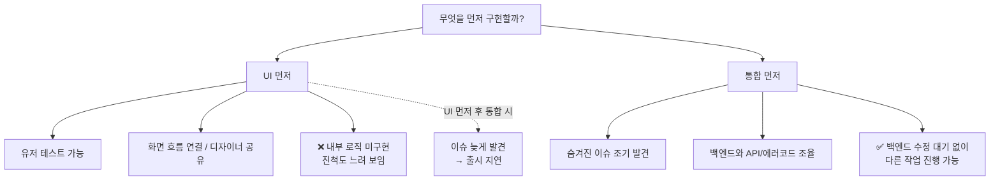
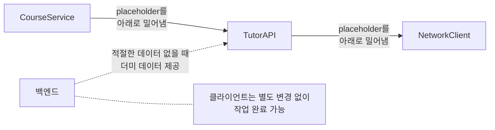
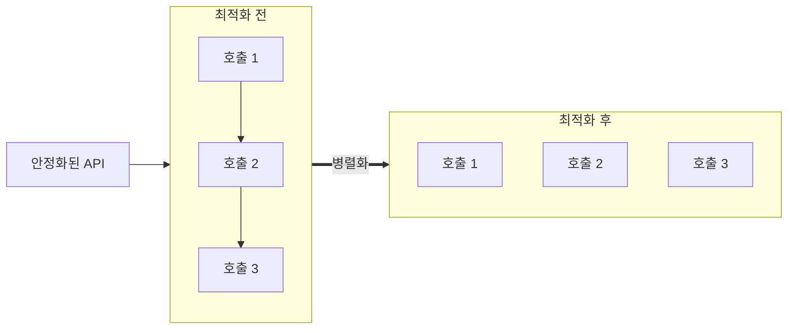
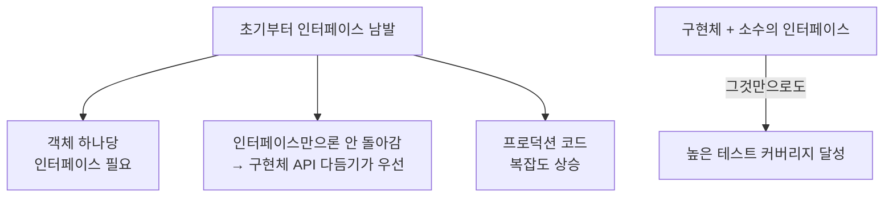
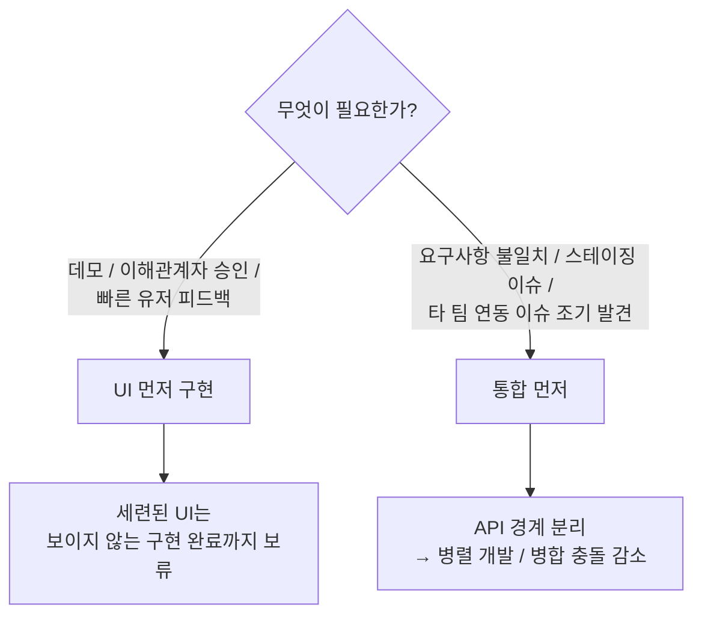

# Holistic-Driven Development: Strategic Decisions and Integration

### UI 우선 vs 다른 구현 우선 (Focusing on UI versus other implementations)

- UI를 먼저 구현하면 유저 테스트를 할 수도 있고, 화면 흐름을 연결할 수 있고, 디자이너에게 보여줄 수도 있다.
    - 하지만 아직 그 안에 있는 내부 로직은 구현되어 있지 않기 때문에, 사람들에게는 UI 이후의 진척도가 느린 것으로 보여질 수 있다.
    - 단순한 placeholder UI를 먼저 구현하고, 디테일이 전부 구현된 세련된 UI를 나중에 만드는 것도 방법이다.
- 깊게 파고드는 것은 전체 시스템을 통합하고 숨겨진 이슈를 찾는 데 효과적이다.
    - 해당 이슈들을 백엔드 개발자와 소통하여 새로운 API를 만들거나, 매칭되지 않은 에러 코드에 대해서 얘기할 수 있다.
    - 백엔드와 통합하면서 예상치 못한 이슈들이 나오기 때문에 먼저 발견하는 것이 더 낫다.
- 만약 UI를 먼저 만들고 백엔드와의 통합을 나중에 진행하면 대부분 출시를 미루게 될 것이다.
    - 이슈들을 뒤늦게 발견하고, 이를 백엔드가 수정하는 동안 딜레이되기 때문이다.
    - 따라서 먼저 통합을 진행해서 이슈들을 일찍 발견하게 되면, 모바일 개발자가 백엔드의 이슈 수정을 기다릴 일 없이 다른 작업을 진행할 수 있다.

### 아래로 내려가며 작업하기 (Working downwards)

- 의존성 그래프의 최상단부터 구현을 시작해서 placeholder를 아래 계층으로 밀어내라. (CourseService → TutorAPI → NetworkClient)
- 백엔드 또한 적절한 데이터가 없을 때 먼저 더미 데이터를 주도록 하면, 클라이언트는 별도의 변경 없이 작업을 완료할 수 있다.

### API 설계 이후 메서드 최적화하기 (Optimizing methods after API design)

- API가 안정화되면 그 안에 있는 내부 구현을 최적화하자.
- e.g., 순차적으로 호출하는 부분을 병렬로 호출해서 최적화한다.

### 홀리스틱 주도 개발 되돌아보기 (Reflecting on Holistic-Driven Development)

- 구현 상세를 모르더라도 개발을 진행할 수 있다.
    - 예를 들어, MySQL 데이터베이스를 구축해야 한다고 했을 때, MySQL에 대해서 잘 모른다고 해도 일단 placeholder로 두고 실제 구현은 미룰 수 있다.
- 만약 구현 중인 컴포넌트가 잘못 설계되었더라도 비교적 적은 비용으로 고칠 수 있다.
- 한 컴포넌트의 구현을 끝내기보다는 모든 컴포넌트를 점진적으로 완성해나가기 때문에
    - 머릿속에 많은 공간을 차지하고(완전히 끝낸 일이 없으니), 일을 할 때 맥락 전환에 대한 비용이 증가한다.
    - 하지만 전체적인 구조에 집중하고 있는 사람이 있으면, 팀원들은 전체 시스템에 대한 이해 없이도 한 컴포넌트를 맡아 집중적으로 구현할 수 있다.
- 만약 OS의 제약과 같이 구현에 있어서 제약사항이 존재한다면, 먼저 구현부터 시작하는 bottom-up 방식을 취하는 것도 방법이다.
- 계속해서 요구사항을 파악하고 구조가 바뀌는 동안에는 테스트 코드 작성을 미루는 것이 좋다.
    - 코드를 리팩토링하는 동시에 테스트 코드도 작성한다면, 진행을 늦출 뿐만 아니라 삭제되는 테스트 코드들도 많기 때문이다.
    - TDD처럼 모든 것을 테스트하기보다는, 테스트가 필요한 특정 영역에 대해서만 테스트하기 위함이다.

#### 초기 설계 단계에서 인터페이스를 먼저 설계하지 않는 이유

- 객체 하나당 인터페이스를 만들어야 한다.
- 인터페이스만으로는 돌아가지 않기 때문에, 구현체의 API를 다듬는 것을 우선해야 한다.
- 단위 테스트를 위해 인터페이스를 남발하면, 프로덕션 코드의 복잡도가 올라간다.
- 구현체들과 몇몇의 인터페이스만으로도 높은 테스트 커버리지에 도달할 수 있다.

## What we covered

### 전략적인 개발 의사결정

- 데모가 필요하거나, 이해관계자의 승인이 필요하거나, 빠른 유저 테스트 피드백이 필요할 때는 UI를 먼저 구현해라.
- 백엔드와의 요구사항 불일치, 스테이징 환경 이슈, 타 팀 간의 연동 이슈를 개발 초기에 일찍 터뜨리려면 먼저 통합을 해라.
- 세련된 UI를 구현하는 것은 보이지 않는 구현을 전부 끝낼 때까지 보류해라.
- API 경계를 나누면 병렬 개발이 가능하고 병합 충돌을 줄일 수 있다.

### 홀리스틱 구현의 심화

- 개발 속도를 유지하기 위해 추상화 레이어를 하나씩, placeholder를 벗겨내라.
- 한 컴포넌트를 완벽하게 구현하기보다는 placeholder를 의존성 계층의 더 깊은 곳으로 밀어내라. (CourseService → Networking → HttpClient)
- API가 안정화되면, 아직 placeholder를 사용하더라도 충분히 끝낸 것으로 보고 다음 단계로 넘어가라.
- 높은 우선순위의 도메인에 집중하기 위해 비즈니스 로직부터 인프라로 내려오면서 작업해라.

### API 설계가 끝나고 최적화해라

- 먼저 안정적인 API를 설계하고 구현을 최적화해라. (순차적으로 하던 것을 병렬로 처리하게 한다든가)
- 노출된 모든 요소가 미래의 유지보수 부채이기 때문에 API 표면을 작게 유지해라.
- 소비자 코드에 영향을 미치지 않도록 구현을 격리하기 위해 API 경계를 사용해라.

### 홀리스틱 개발의 트레이드오프를 관리해라

- 전체적인 아키텍처에 대한 비전을 확보하기 위해 문맥 전환과 심리적 오버헤드를 받아들여라.
- 코드 구조가 빠르게 변하는 동안은 테스트 코드를 작성하는 것을 미뤄라.
- 덜 중요한 컴포넌트들에 인식되는 중요도를 낮추기 위해 placeholder를 사용해라.
- 전체적인 접근법을 사용하면 처음에는 그 무엇도 끝나지 않지만, 전체적인 아키텍처를 누군가 보고 있는 한 동료들이 특정 컴포넌트에만 집중해서 작업할 수 있다.
