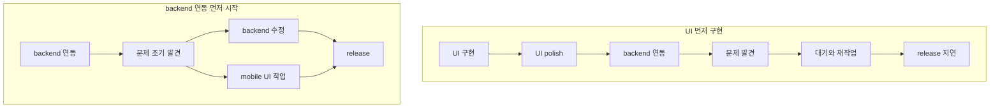
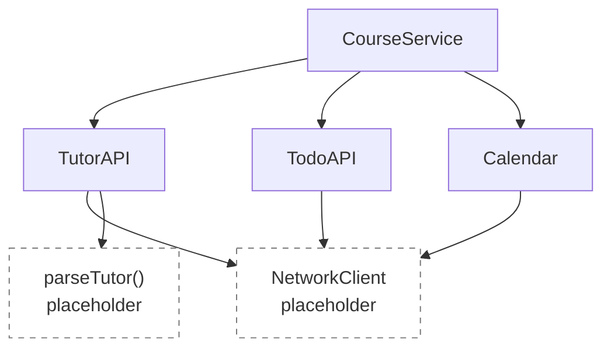

# [WEEK 09] Book 0 Chapter 4
📖 Mobile System Design 0. From Briefings to System Architecture  

<br>

## 4. Holistic-Driven Development: Strategic Decisions and Integration
> 눈에 보이는 완성도보다 실제 연동을 우선한다.  
> API를 유지한 채 placeholder를 아래 계층으로 옮기며 구현을 구체화한다.  

### Focusing on UI versus other implementations

초기 구조를 만든 뒤에는 두 방향 중 하나를 선택할 수 있다.  

| 방향         | 목표                                           |
| ---------- | -------------------------------------------- |
| UI 연결      | `Course`를 화면에 연결해 사용 가능한 모습을 빠르게 만든다.        |
| backend 연동 | `CourseService`의 placeholder를 실제 연동 코드로 바꾼다. |

두 방향 모두 장단점이 있다. 현재 목표와 문제를 늦게 발견했을 때의 위험을 기준으로 선택한다.  

#### Focusing on UI

UI를 먼저 만들면 빠르게 보여줄 결과가 생긴다. 사용자 테스트와 디자인 검토도 일찍 시작할 수 있다.  

반면 화면만 완성되면 전체 기능이 거의 끝난 것처럼 보일 수 있다.  
이후에 남은 network와 data 작업은 겉으로 드러나지 않아 진행 속도가 느려진 것처럼 보이기도 한다.  

UI에 집중해야 한다면 실제 data에 연결된 최소 화면부터 만든다. animation과 시각적인 완성도는 전체 연결이 끝난 뒤 다듬는다.  

#### Going deeper

backend 연동을 시작하면 문서와 실제 환경 사이의 차이가 드러난다.  

- 문서와 다른 response field 또는 error code
- 디자인과 다르게 처리된 optional field
- 최신 상태가 아닌 staging 환경
- 누락된 endpoint나 인증 정보

이런 문제는 늦게 발견할수록 다른 작업까지 다시 진행해야 한다.  
따라서 연동을 앞당기면 관련 팀도 더 일찍 대응할 수 있다.  

#### Prioritize backend integration

1. UI를 완성한 뒤 backend 연동을 시작  
	- 문제 확인과 수정이 순서대로 이어진다. 기다림과 재작업이 늘어나 release가 늦어질 수 있다.  
2. backend 연동을 먼저 시작  
	- mobile과 backend가 잘못된 가정을 일찍 확인한다.  
	- backend가 수정하는 동안 mobile은 UI 작업을 이어갈 수 있다.  



---

### Working downwards

`CourseService`에 있던 placeholder를 실제 domain API 호출로 바꾼다. 세부 구현은 하위 type의 placeholder로 옮기며 한 계층씩 내려간다.  

#### Finishing CourseService

`CourseService`는 세 domain API에서 필요한 data를 가져와 `Course`를 만든다.  

- `TutorAPI`: Tutor
- `TodoAPI`: schedule
- `Calendar`: calendar event

세 type이 아직 placeholder를 반환하더라도 `CourseService`는 올바른 API를 사용한다.  
따라서 현재 단계에서는 충분히 구현된 것으로 볼 수 있다.  

> placeholder를 없애는 것이 아니라 다음 dependency로 내려보낸다.  

#### Defining new types

세 type에는 필요한 method만 정의한다. 실제 network 연동 대신 delay와 placeholder data를 반환해 전체 코드를 다시 컴파일한다.  

모든 type을 한 번에 완성하지 않아도 상위 domain은 다음 작업으로 넘어갈 수 있다.  

#### Continuing the process

domain별 API 아래에 `NetworkClient`를 추가한다. `NetworkClient`는 network 요청만 맡고 비즈니스 로직은 알지 않는다.  

`TutorAPI`는 raw data를 받아 `Tutor`로 parsing한다. 실제 parsing과 network 요청은 다시 placeholder로 남긴다.  



#### End result

현재 실제 호출 구조를 갖춘 domain은 다음과 같다.  

- `Course`
- `Tutor`
- `Calendar`
- `TodoList`

`Store`와 `Networking`의 세부 구현은 아직 남아 있다.  

backend 연동까지 마친 뒤에는 model test를 보강하거나 UI를 구현할 수 있다. dependency injection과 testing은 다음 단계에서 다룬다.  

#### The backend should also use placeholders

backend도 준비된 data가 없다면 고정 JSON을 반환하는 endpoint부터 제공할 수 있다. app은 fake data라도 실제 API 호출을 먼저 연결한다.  

이후 backend가 live data로 교체해도 request와 response 계약이 같다면 app 코드는 바뀌지 않는다.  
app과 backend 사이에서도 세부 구현보다 연결을 먼저 만들 수 있다.  

---

### Optimizing methods after API design

API를 먼저 정하면 호출부를 건드리지 않고 함수 내부를 개선할 수 있다.  

`CourseService`의 세 요청은 서로 독립적이다. 동시에 실행하고 모두 끝난 뒤 `Course`를 만든다.  

```kotlin
suspend fun loadFresh(id: UUID): Course = coroutineScope {
    val tutor = async { tutorApi.loadTutor(id) }
    val schedule = async { todoApi.loadSchedule(id) }
    val event = async { calendar.loadEvent(id) }

    Course(
        id = id,
        tutor = tutor.await(),
        schedule = schedule.await(),
        calendarEvent = event.await(),
    )
}
```

외부에서는 같은 API를 사용한다. 동작하는 구조를 먼저 만든 뒤 성능과 내부 구현을 개선한다.  

---

### Reflecting on Holistic-Driven Development

실제 I/O가 없어도 domain과 API가 연결되면 프로그램을 실행할 수 있다.  
경계가 분명해져 구조를 바꾸거나 팀에 작업을 나누기도 쉬워진다.  

#### Holistic-Driven Development brings confidence to move forward

구현 방법을 모르는 기술이 있어도 API와 placeholder부터 만들 수 있다. 필요한 내용을 익힌 뒤 함수 내부를 실제 구현으로 교체한다.  

낯선 기술 때문에 전체 개발이 멈추지 않는다는 점이 장점이다.  

#### Lightweight restructuring

독립된 component는 다른 domain으로 옮기기 쉽다. 예를 들어 `Store`를 `CourseService`에서 빼고 `TodoList`나 `NetworkClient` 아래로 이동할 수 있다.  

초기 구현에 많은 시간을 쓰지 않았으므로 잘못된 판단을 수정하는 비용도 작다.  

#### Context switching and delegation

여러 component를 조금씩 구현하면 미완성 상태가 오래 유지된다. 개발자가 계속 맥락을 바꿔야 한다는 부담도 생긴다.  

팀에서는 이 방식을 작업 분담에 활용할 수 있다.  
전체 구조를 관리하는 사람이 API 경계를 잡으면 각 개발자는 하나의 영역에 집중할 수 있다.  

예를 들어 `Store`, `TodoList`, `CourseUI`를 나눠 맡을 수 있다.  

#### Top-down versus bottom-up

| 방식 | 적합한 상황 |
|---|---|
| top-down | 사용자에게 필요한 상위 domain부터 의존성을 따라 구현할 때 |
| bottom-up | 앱의 전제가 되는 핵심 기술이 실제로 가능한지 먼저 확인해야 할 때 |

예를 들어 앱이 항상 background에서 동작해야 한다면 다른 domain보다 OS 제한부터 검증해야 한다.  
핵심 전제가 불확실할 때는 bottom-up이 더 안전하다.  

#### We delay writing tests

구조를 찾는 단계에서는 type을 옮기고 이름을 바꾸거나 코드를 삭제하는 일이 잦다.  
이때 test까지 함께 고치면 탐색 속도가 느려질 수 있다.  

전체 구조가 잡히면 의존성과 test 범위를 정하기 쉬워진다. test를 위해 모든 type에 interface를 추가하는 것도 피할 수 있다.  

#### Why we don't design with interfaces instead

interface를 정의해도 실행 가능한 concrete type은 필요하다.  
실제로 구현을 교체하거나 다형성이 필요한지 확인하기 전에는 concrete type부터 만든다.  

모든 type에 대응하는 interface를 만들면 type 수가 늘고 method를 찾기 어려워진다. 이름만 다른 mirror interface가 생기는 문제도 있다.  

testability만을 이유로 interface를 미리 만들지 않는다. 필요한 지점이 드러났을 때 추가한다.  

---

### What we covered

#### Strategic development decisions  
- 빠른 시연이 필요하면 UI를 선택한다. 
- backend 연동의 위험이 크다면 연동을 우선한다.  

#### Deepening holistic implementation
- API를 유지하며 placeholder를 한 계층씩 아래로 옮긴다.  

#### Optimizing after API design
- 호출부를 바꾸지 않고 내부 동작을 병렬 처리처럼 개선한다. 
- 외부에 공개하는 API는 작게 유지한다.  

#### Managing trade-offs
- domain별로 작업을 나눈다. 
- 구조가 안정된 뒤 test와 interface 도입 시점을 정한다.  
