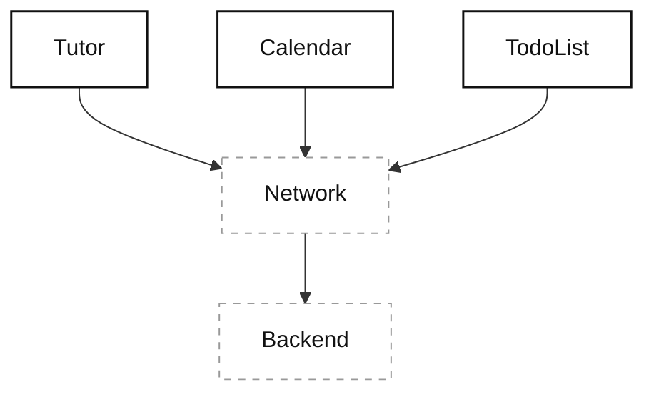
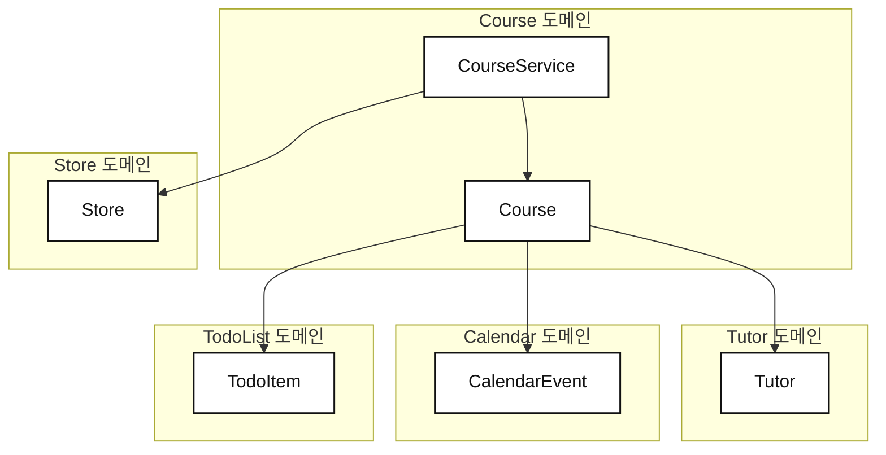
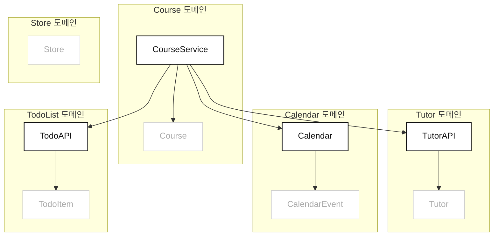
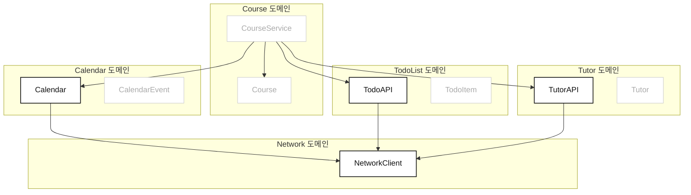

- 지난 장에서 프로토타입을 만들었으니, 이제는 **다음으로 무엇을 만들 것인가**에 집중해야 한다.
	1. UI를 다듬는다.
	2. 백엔드 API를 연결한다.
- 두 가지 모두 장점과 단점이 있다.
	- 두 방법으로 상세 구현을 시작하며 자세한 장단점을 알아본다.

- 끝에가서는 실제로 네트워크 연결이 오가는 실제 구현에 매우 가까워질 것이다.
	- 그때는 구현을 멈추고, 테스트와 의존성 주입으로 넘어갈 것이다.

- 마지막으로 전체론적 접근의 트레이드오프를 알아본다.
	- 은탄환은 없고, 전체론적 접근도 단점이 있다.
	- 언제 잘통하고 언제 그렇지 않은지 이해하여 효과적인 적용을 도모한다.

---

## UI에 집중할 것인가, 다른 구현에 집중할 것인가

- `Service` 를 실제로 구현하여 복집한 백엔드 연결을 해치울 수 있다.
- 혹은 UI를 구현하여 사용자 상호작용을 처리하고, 사람들이 실제로 보고 만질 수 있는 요소를 만들 수 있다.
- 두 가지 길 모두 타당한 이유가 있다.
	- 각 방향이 어떤 장단점이 있는지 파악해본다.

### UI에 집중하기
- 처음에는 뼈대뿐이라 화면에 레이블과 단순한 버튼 몇 개가 전부겠지만, UI와 데이터가 어떻게 함께 동작할지 알아내는 구체적인 방법이다.

- UI 루트에는 매력적인 요소들이 아주 많다.
	1. 보여줄 것이 빨리 생긴다.
	2. 디자이너와 함께 이하며 디테일에 집중하기 좋다.
	3. 사용자 테스트를 돌릴 수 있다.
	4. UI를 반복 개선하고 UI를 네비게이션 플로우에 연결하는 것까지 생각해볼 수 있다.
	5. 우습게 보이지만 심리적으로 무언가 "진전" 되고 있다는 느낌을 준다.
	6. 제품 데모 영상, 즉 마케팅에도 활용할 수 있다.

- 데이터, 파싱 등 UI 표면보다 하위 레이어의 작업들은 눈에 잘 띄지 않는다.
	- 심리적 측면에서 바라보아도 UI부터 시작하면 앱이 꽤 이른 시점에 완성된 것처럼 느껴질 수 있다.

- 하지만 오히려 이로 인해 **왜곡된  그림**이 생길 수 있다.
	- 처음에는 아주 빨라보였는데, 나중엔 느린 개발자처럼 보일 수 있다.
	- 이 길로 간다면 완성된 UI와 보이지 않는 작업들을 안고 가야한다.
	- UI 구현 후, 보이지 않는 작업을 수행할 때 다른 사람들에게 더 많이 설명해야 할 각오를 해야한다.

- 또 다른 위험은 **UI를 구현하다가 그것이 끝난 후에야 네트워크 구현을 시작하고, 팀 안에 심각한 문제가 있다는걸 꽤 늦게 깨닫게 된다는 것**이다.
	- 반면 전체 통합을 더 일찍 시작하면 필요할 때 빠르게 문제를 파악할 수 있다.
	- 다른 일을 하는동안 팀 동료들이 중요한 수정을 하게 만들 수 있고, 결과적으로 시간을 아낄 수 있게 된다.

### 더 깊이 들어가기
- 또 다른 선택지는 전체론적 개발 접근을 이어가며 더 깊이 내려가는 것이다.
	- 현재 도메인 외에 다른 도메인에서 쓰는 API 구현 코드를 작성함을 의미한다.




- 깊이 들어가는 것은 시스템 통합에 집중하고 숨은 문제를 해결하는 좋은 선택지다.
	- 백엔드와의 모든 통신을 파악하고, 백엔드 엔지니어와 의논하여 어긋난 코드나 문서를 파악할 수 있다.
	- 혹은 서드파티 분석 라이브러리의 로그인 토큰에 돈을 내야하는 것을 알게 될 수도 있다.

- 통합 문제는 어떤 상황에서든 발생할 수 있다.
	- 백엔드에서 필드를 잘못 구현했을 수도 있고, 디자이너 의도와 다른 필드를 `nullable` 하게 만들었을 수도 있다.
	- **방치하면, 그대로 UI에 반영된다.**

- 알림에 대한 대대적인 논의를 촉발시킬 수도 있다.
	- 기기의 정보나 토큰을 백엔드에 제출할 새 API 엔드포인트가 필요하다고 이야기할 수 있다.
	- 아니면 알림이 애초에 필요하지 않다거나.

- **무엇이 됐든, 백엔드와 통합하는 순간 현실적인 문제가 들이닥친다.**
	- 예상밖의 문제와 마주칠것을 각오하라.
	- 이런 문제는 최대한 일찍 찾아내는 것이 좋다.


### 백엔드 통합을 우선하라
- UI를 먼저 만들어 다듬고, 백엔드 통합을 시작한다고 상상해보자.
	- 십중팔구 배포가 늦어진다.

![[Mobile system design - UI부터 배포하여 속도가 느려질 때.png]]


![[Mobile system design - 백엔드 통합부터 개발할 때.png]]

- 가능한 빠르게 통합부터 시작하면, 클라이언트와 백엔드 개발자 모두 어디에 잘못된 가정이 있는지 배우게 된다.
	- **그리고, 잘못된 가정을 수정하는 동안 백엔드가 끝나길 기다리지 않고, UI부터 구현할 수 있다.**
	- 또한 백엔드의 잘못된 "가정"에 기대어 작업하지 않았기 때문에, 수정에 대해 추가 작업을 해야 할 필요도 거의 없다.

- 이제 클라이언트, 백엔드 개발자 모두 병렬로 일할 수 있고, 배포 날짜도 미뤄지지 않는다.

## 아래로 내려가며 작업하기
- 백엔드 통합에 가까워지기 위해, 모델 로직에 집중한다.




- 도메인 모델을 반환하는 `Serivce` 를 이전에 정의했다.
	- 하지만 현재는 네트워크 호출없이 `placeHolder` 를 통해 도메인 모델을 반환하는 상태다.
	- 덕분에 시스템의 여러 부분을 설계했지만, 이제는 실제로 구현해야 할 때다.

### `Service` 구현 마무리
- 하나의 도메인 모델을 완성하기 위해, 다른 도메인 모델의 데이터를 조합해야 할 수 있다.
	- 즉, 각 도메인마다 데이터를 로드할 타입이 어떤 형태로든 필요하다.



- `Service` 에서 필요한 데이터를 모두 로드하기 위해, 새로운 타입들에 의존한다고 가정한다.
	- 현재로서는 `TutorAPI`, `TodoAPI`, `Calendar` 가 이에 속한다.

```kotlin
import java.util.UUID

class CourseService {

    // 데이터 로드를 위한 인스턴스 프로퍼티,
    // 참고 : 해당 타입들이 아직 정의되어 있지 않다면 컴파일 에러가 발생합니다.
    private val tutorAPI = TutorAPI()
    private val todoAPI = TodoAPI()
    private val calendar = Calendar()

    /**
     * 지정된 ID의 최신 Course 데이터를 비동기적으로 로드합니다.
     */
    suspend fun loadFresh(id: UUID): Course {
        // Before : 임시 플레이스홀더 처리
        // delay(2000)
        // return Course.placeholder

        // After : 새로운 로딩 메소드 호출
        val tutor = tutorAPI.loadTutor(courseId = id)
        val schedule = todoAPI.loadSchedule(courseId = id)
        val calendarEvent = calendar.loadEvent(courseId = id)

        return Course(
            id = id,
            tutor = tutor,
            schedule = schedule,
            calendarEvent = calendarEvent
        )
    }
}
```

- 이번에도 새로운 세 가지 타입에 대해 컴파일 에러가 발생할 것이다.
	- 이전에 했던 것과 동일하게 각 타입에서 `Placeholder` 를 반환하도록 정의하면 된다.

- 중요한 점은 `Service` 에서는 `Placeholder` 를 모두 걷어냈으니 **`Service` 는 완성되었다는 것**이다.
	- 새로운 세 가지 타입이 실제로 네트워크 호출을 하지 않더라도, `Service` 자체는 이제 완벽하다.
	- `Service` 입장에서 세 타입이 실제로 데이터를 로드하는지는 전혀 중요하지 않다.

### 새 타입 정의하기
- 세 가지 타입을 완성하기엔 아직 파악하지 못한 부분이 너무 많으니, 동일하게 `Placeholder` 구현을 사용한다.

```kotlin
class TutorAPI {
    suspend fun loadTutor(courseId: UUID): Tutor {
        delay(2000) 
        return Tutor.placeholder
    }
}

class TodoAPI {
    suspend fun loadSchedule(courseId: UUID): List<TodoItem> {
        delay(2000) 
        // TodoItem placeholder 10개로 구성된 리스트 생성 및 반환
        return List(10) { TodoItem.placeholder }
    }
}

class Calendar {
    suspend fun loadEvent(courseId: UUID): CalendarEvent {
        delay(2000) 
        return CalendarEvent.placeholder
    }
}
```

- 모든 것이 컴파일되니, `Service` 는 당분간 다시 보지 않아도 된다.
- **모든 도메인, 구현이 끝날 때까지 이 과정을 계속 이어나간다.**

### 과정 이어가기
- 이제 이 전체론적 접근이 어떻게 굴러가는지 감이 잡혔을 것이다.
	- 이 상태에서 한 번만 더 깊이 들어가, 네트워크 호출과 백엔드 통합에 좀 더 가까워지자.

- 세 가지 새 타입은, 단순하게 네트워크 요청을 설정하고 데이터를 파싱하는 역할을 맡을 것이다.
	- (`Repository` 와 비슷한 역할이라고 보면 될 것 같다.?)
- 실제로 네트워크 호출을 처리하는 것은 `NetworkClient` 에서 처리한다.




- 먼저 이 그림의 `TutorAPI` 에 집중한다.
	- `NetworkClient` 에 대한 의존성을 도입하고, 요청 전송에 사용한다.
	- `parseTutor()` 를 통해 데이터를 파싱한다.

```kotlin
import java.util.UUID

class TutorAPI {
    // 새로 도입된 NetworkClient
    val networkClient = NetworkClient()

    suspend fun loadTutor(courseId: UUID): Tutor {
        // 네트워크 클라이언트를 사용하여 데이터 요청
        val data = networkClient.request(endpoint = "/api/courses/$courseId/tutor")
        // 데이터 파싱 및 Tutor 객체 생성
        return parseTutor(data)
    }

    private fun parseTutor(data: ByteArray): Tutor {
        // Placeholder : 여기에 실제 JSON 파싱 로직 구현
        // 아직 실제 파싱 로직이 없으므로, 지금은 하드코딩된 튜터 반환
        return Tutor.placeholder
    }
}
```

- `Placeholder` 가 `TutorAPI` 의 내부 메소드인 `parseTutor` 로 옮겨간 것에 주목하자.
- 이 단계에서 `loadTutor` 는 끝났다고 볼 수 있다.
	- 요청을 어떻게 만들고, 어떻게 파싱할지 걱정하는 대신, 문제를 파싱 하나로 줄여놓았다.
	- 그리고 이번에도 코드는 컴파일되지 않는다.

```kotlin
import kotlinx.coroutines.delay

class NetworkClient {

    suspend fun request(endpoint: String): ByteArray {
        // 임시 구현, 네트워크 요청 시뮬레이션
        delay(2000)

        // 지금은 빈 데이터를 반환합니다. 실제 구현에서는 네트워크 요청을 수행합니다.
        return ByteArray(0)
    }
}
```

- 컴파일러가 동작하게 만들기 위해선 `NetworkClient` 를 정의해야 한다.
	- 마찬가지로 `Placeholder` 로 구현한다.

### 최종 결과
- 하루만에 계층 구조의 꽤 깊은 곳까지 구현하는데 성공했다.
- 이 다음부터는 제대로 된 백엔드 통합이 될 때까지, `Placeholder` 를 계속 걷어내면 된다.
- 궁극적으로는 `NetworkClient` 위에서 실제로 네트워크 연결까지 진행하는 애플리케이션에 도달할 것이다.
	- `NetworkClient` 와 관련하여 더 복잡한 주제는 의존성 주입과 테스트로, 이는 다음 장에서 다룬다.

- 백엔드 통합을 끝낸 후에는 테스트를 추가하여 모델 레이어를 발전시키거나, UI에 집중한다.

### 백엔드도 Placeholder 를 써야 한다
- 백엔드가 아직 제대로 된 응답을 주지 못한다해도, 최소한의 `Placeholder` 응답을 제공하게 하자.
	- 고정된 JSON 파일만 돌려주는 엔드포인트라도 좋다.

- 가짜 데이터라도, 최소한 백엔드에서 오는 API 호출 통합은 시작할 수 있다.
	- JSON에서 라이브 데이터로 바뀌어도, 우리 앱은 변경사항이 없을 것이다.

- **이렇게 하면 백엔드 통합을 훨씬 일찍 시작할 수 있다.**
	- 이 접근 역시 전체론적으로 일하는 방식과 맞아 떨어진다.

## API 설계 뒤 메소드 최적화하기
- API를 제대로 설계했을 때 좋은 점은, 다른곳에 영향을 주지 않고 함수 내부를 자유롭게 반복 개선할 수 있다는 것이다.

```kotlin
import java.util.UUID
import kotlinx.coroutines.async
import kotlinx.coroutines.coroutineScope

class CourseService { 

    suspend fun loadFresh(id: UUID): Course = coroutineScope {
        // 'async'에 의해 아래 데이터 가져오기 작업이 모두 병렬로 실행됨
        val tutor = async { tutorAPI.loadTutor(courseId = id) }
        val schedule = async { todoAPI.loadSchedule(courseId = id) }
        val calendarEvent = async { calendar.loadEvent(courseId = id) }

        // 동기화 지점 : 이제 Course 시점에서 await하며,
        // 상단의 3개 병렬 호출이 모두 완료되면 도달함
        Course(
            id = id,
            tutor = tutor.await(),
            schedule = schedule.await(),
            calendarEvent = calendarEvent.await()
        )
    }
}
```

- 예를 들면 위와 같이 직렬로 데이터를 불러오던 로직을 병렬로 불러오도록 수정할 수 있다.
- 요점은, 구현 디테일에 너무 집중하기 전에 어떻게 연결되는지 집중하라는 것이다.
	- 이렇게, 언제든 개선할 수 있다는 것을 잊지 말자.

## 전체론적 개발 돌아보기
- 현재 프로그램은 실제 서버에서 데이터를 가져오지 않고, 로컬 저장소도 쓰지 않지만 잘 돌아간다.
	- 단순하지만 무엇을 만들어야 하는지 파악했고, 구현도 어느정도 해냈으며 팀원들과 일을 쉽게 나눌 수 있다.
	- 벌써 누군가에게 UI를 우리의 컴포넌트에 연결하도록 할 수 있다.
	- 도메인도 강력하게 분리되어 언제든 내부 코드를 마음대로 수정할 수 있는 유연성도 생겼다.

- **전체론적 접근은 아이디어와 스펙을 실제 코드로 바꾸는 데 효과적이다.**
	- 설계와 스케치가 많이 수정되는 만큼, `Placeholder` 로 먼저 일하는 것에 더 무게를 둔다.

- 가장 큰 이점은 시간을 크게 희생하지 않고 빠르게 리팩터링할 수 있다는 것이다.
- 더 큰 이점은 **중요한 작업을 할 때 병목없이 꾸준히 집중할 수 있게 해준다는 것**이다.

- 이 접근을 쓰면 매 단계가 끝날 떄마다 **"지금 가장 중요한게 뭐지?"** 를 점검하고 다음 일에 집중할 수 있다.
	- 즉, 코드베이스 곳곳을 넘나들며 일할 수 있다.
	- 대체적으로 미지수가 많거나 새 코드를 다룰 때 훌륭한 접근이다.

### 앞으로 나아갈 자신감을 준다 (장점)
- 구현 디테일을 몰라도 앞으로 나아갈 수 있다.
	- `MySQL` 로 DB를 구현해야 하는 상황에서, 이를 잘 몰라도 `Placeholder` 구현으로 API를 정의할 수 있다.
	- 그리고 나중에 진짜 구현을 할 때 느긋하게 `MySQL` 을 공부하면 된다.
	- 인터페이스를 약간 손보고, 앱은 거의 바뀌지 않는다.

### 가벼운 구조 조정 (장점)
- 도메인과 컴포넌트 계층으로 사고하기에, 컴포넌트를 이리저리 옮기는 일이 아주 쉽다.
	- `Service` 가 특정 도메인을 몰라야 한다는 것을 깨달았다면, 그저 분리하기만 하면 그만이다.
	- **구현에 시간을 많이 쓰지 않았으니 결정을 뒤엎는 일도 쉽다.**

### 컨텍스트 스위칭과 위임 (단점)
- 이 전체론적 방법의 단점은, **한 컴포넌트를 온전히 끝내는 대신 모든 컴포넌트를 조금씩 건드린다는 점**이다.
	- 이때문에 모든 컴포넌트가 **미완성, 미해결 상태**로 훨씬 오래 머문다.
	- 아무것도 매듭지어지지 않아 머릿속 공간이 더 어지러워질 수 있다.
	- 핵심적인 로직 하나에 깊이 파고들어 머릿속에서 정리를 마친 뒤, 잊어버리고 다음 스텝으로 넘어가고 싶은 사람들에겐 힘들 수 있다.

- 하지만 팀 환경에선 이를 장점으로 바꿀 수 있다.
	- 전체 랜드스케이프를 구성하는 리드 엔지니어라면, 작은 도메인이나 컴포넌트의 구현을 팀원들에게 분배시킬 수 있다.
	- **그 사람들은 그 도메인 구현에만 집중하면 되니, 시스템 전체를 알 필요가 없어진다.**
	- 팀 리드는 각 부분이 작업되는 동안에도 서로 연결되어 있음을 보장할 수 있다.

- **전체론적 접근은 팀 환경에서 훨씬 빨라질 수 있고, 확장도 된다.**
	- 엔지니어들이 자기 일을 하기 위해 큰 애플리케이션의 전체 스펙을 알 필요가 없다.
	- 대부분의 엔지니어는 자신이 맡은 도메인에만 집중한다.

### top-down vs bottom-up
- 전체론적 개발 접근은 top-down 접근 방식이다.
	- 랜드스케이프 꼭대기에서 시작하여 동작할 때까지 아래로 내려간다.

- 하지만 핵심 기술에 의존하여 프로그램을 구현해야 하는 경우, 바닥에서 시작하는 것이 더 나을 수 있다.
	- 백그라운드에서 상시 실행되는 앱이라고 가정하고 계획을 세웠다고 가정하자.
		- 하지만 OS가 허락하지 않는다면?
	- 이 경우는 다른 도메인들을 구현하기 전, 우회할 방법을 먼저 찾아두는 것이 좋다.

### 테스트 작성을 미룬다
- TDD에서도 각 단계에서 앞으로 나아갈 만큼의 코드만 작성한다.
	- 하지만 우리와 다른 점은, 그 코드에 대한 테스트를 곧바로 작성한다는 점이다.

- **우리는 필요한 부분을 끊임없이 찾아내고, 옮기고, 이름을 바꾸고, 지운다.**
	- 그렇기 때문에 테스트 코드를 작성하지 않는 것이다.
	- 테스트 코드까지 리팩터링한다면, 속도가 급격히 저하된다.
	- 때로는 지우기도 하는데, 금방 지울 테스트를 작성하는건 시간 낭비다.

- 테스트하지 않는 또 다른 이유는, **특정 영역을 테스트하는 것에 집중할 예정**이기 때문이다.
	- 모든 것을 테스트하는 것은, 모든 것을 인터페이스 투성이로 만들 위험이 있다.
	- 논쟁적 주제지만, 테스트 장들에서 다루게 될 내용이다.

### 왜 인터페이스로 설계하지 않는가
- 인터페이스를 쓰더라도, 구체적인 구현이 여전히 필요하기 때문이다.
	- 인터페이스 타입만 정의하면, 돌아가는 프로그램을 구현할 수 없다.
	- **인터페이스 타입은 필요해지면 자연스럽게 생기는 것이지, 미리 만드는 것이 아니다.**

- `Swift` 에는 프로토콜 지향 프로그래밍이라는 기능이 있다.
	- 인터페이스에 메소드를 얹고, 그 프로그램을 중심으로 설계할 수 있다.
	- 하지만 코드베이스를 이해하는 난이도가 극적으로 올라가고, 구체 타입은 여전히 필요하다.

- 모든 타입을 두 번 구현해야 하고, 메소드는 인터페이스 위에 살게 되는데 초반에는 딱히 이점이 없다.
	- 메소드를 찾기 어려워지고, 어떤 구현체가 어떤 인터페이스 구현을 오버라이딩하는지 추론하기 어려워진다.
	- 분명 좋은 기법이지만, 작고 신선한 코드베이스에선 좋지 않다.

- 인터페이스를 쓰는 주된 이유는 코드를 다형적으로 만들어 갈아 끼울 수 있게 하는 것이다.
	- 하지만 현재로서는 다형성을 추구할 필요가 없다.
	- 실제 애플리케이션에서 사람들은 "거울" 인터페이스의 이름을 짓느라 애를 먹는다.
		- `CourseService`
		- `CourseServiceImpl`
	- 이는 코드 스멜의 신호다.

- "인터페이스를 쓰면 훨씬 테스트가 쉬워지잖아요!!!!"
	- **테스트를 위해 모든 타입에 인터페이스가 필요하다는 생각이 바로 코드 스멜이다.**
	- 이는 테스트만을 위해 프로덕션 코드베이스를 더 구멍투성이로 만드는 일이다.
	- 테스트 장들에서 더 깊이 다루며, 더 적은 인터페이스 타입으로 높은 테스트 커버리지를 얻는 법을 보게 될 것이다.

---

**이 장에서 다룬 내용:**

**전략적 개발 결정**

- 빠른 데모, 이해관계자 설득, 사용자 테스트 피드백이 필요할 때는 UI 우선을 택하라.
- 백엔드 어긋남, 스테이징 환경 문제, 팀 조율 문제를 일찍 드러내려면 통합 우선을 택하라.
- 진행 상황에 대한 잘못된 인상을 주지 않으려면, 보이지 않는 작업이 모두 끝날 때까지 다듬어진 UI 를 미뤄라.
- API 경계로 팀 작업을 나눠 병렬 개발을 가능하게 하고 머지 충돌을 줄여라.

**전체론적 구현 심화**

- 추진력을 유지하기 위해 플레이스홀더를 한 번에 한 추상화 층씩 체계적으로 교체하라.
- 개별 컴포넌트를 완전히 구현하는 대신, 플레이스홀더를 의존성 계층의 더 깊은 곳으로 밀어 넣어라.
- 구현이 플레이스홀더를 쓰더라도 API 가 안정적이면 컴포넌트를 "충분히 끝났다"고 간주하라.
- 최우선 도메인에 집중을 유지하기 위해 비즈니스 로직에서 인프라 쪽으로 내려가며 일하라.

**API 설계 뒤의 최적화**

- 안정적인 API 를 먼저 설계하고, 그다음 호출부에 영향을 주지 않으면서 구현을 최적화하라.
- API 표면은 작게 유지하려 노력하라. 노출된 요소 하나하나가 유지보수 약속이다.
- API 경계를 활용해 구현 변경이 소비자 코드로 번지지 않게 격리하라.

**전체론적 개발의 트레이드오프 관리**

- 컨텍스트 스위칭과 정신적 부담을 아키텍처 비전을 유지하는 비용으로 받아들여라.
- 코드 구조가 유동적이고 빠르게 바뀌는 동안에는 테스트 작성을 미뤄라.
- 플레이스홀더 구현으로 중요하지 않은 컴포넌트의 체감 우선순위를 낮춰라.
- 전체론적 접근에서는 처음부터 완성되는 타입이 없지만, 누군가 아키텍처를 조망하고 있다면 동료들은 특정 컴포넌트에 집중할 수 있다.