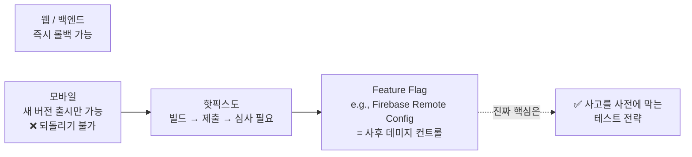
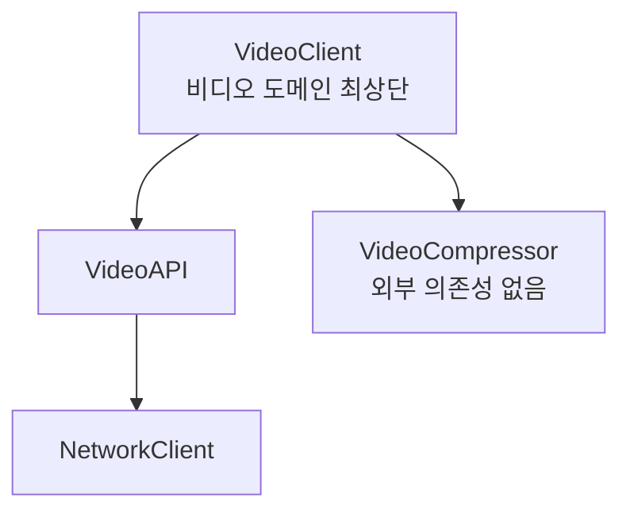
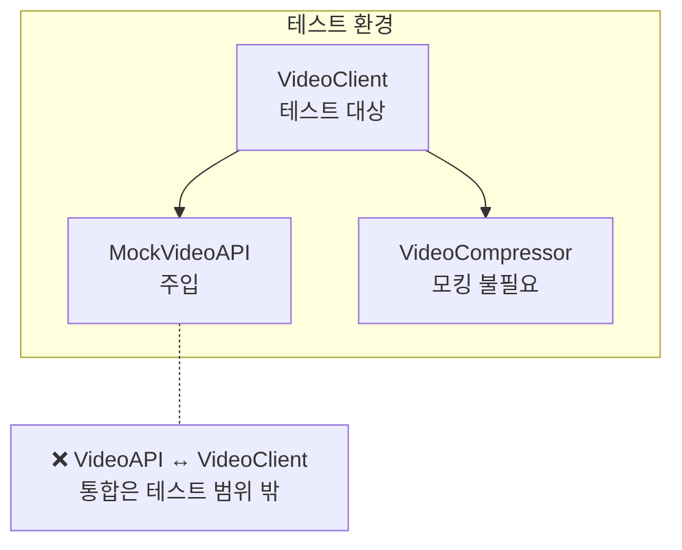
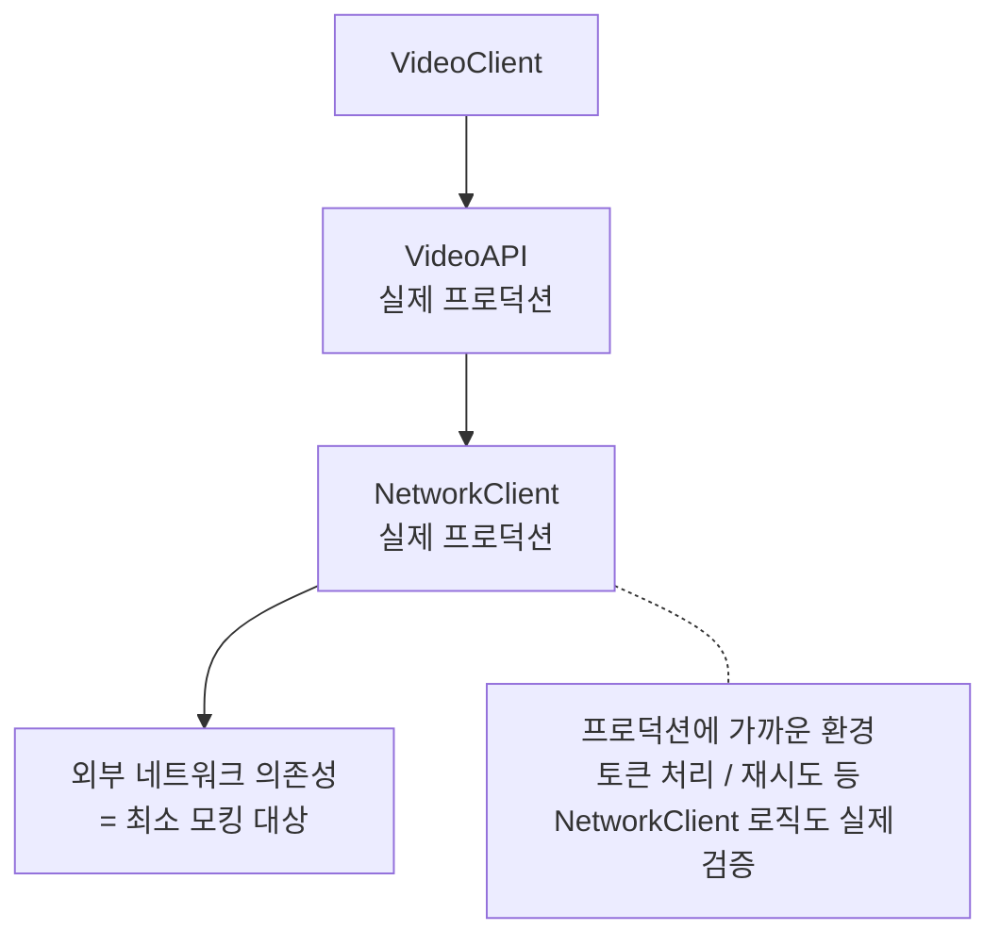
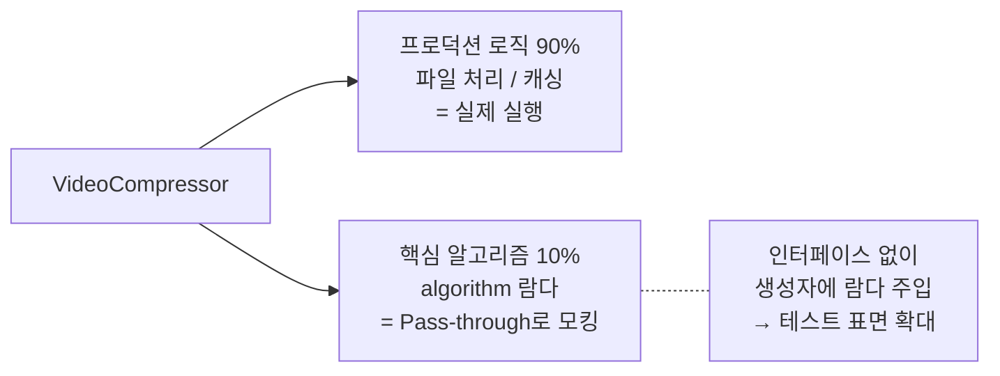
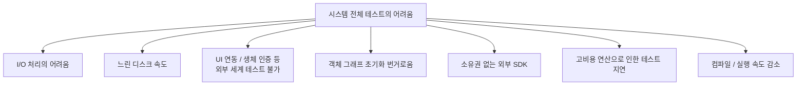
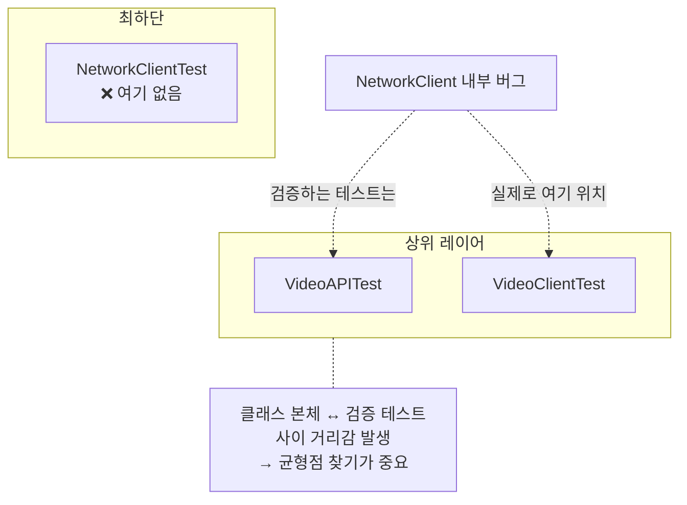
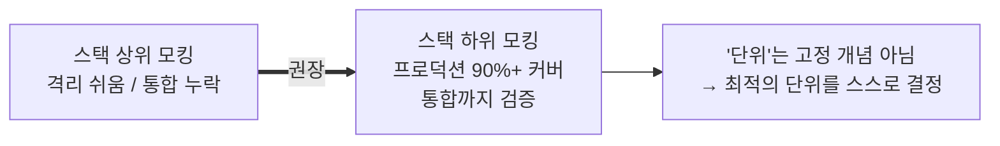

# Testing Strategy for Mobile

### 덜 세분화하여 테스트하기 (Testing less granularly)

- 최대한 적게 모킹하고 가능한 큰 코드 표면을 테스트해라.
- 테스트만을 위해 존재했던 인터페이스를 방지하고, 실제로 잘 맞물려 돌아가는지 시스템 관점에서 테스트할 수 있다.

### 데미지 컨트롤과 데미지 방지 (Damage control and damage prevention)



- 웹이나 백엔드와 달리 모바일은 항상 새로운 버전을 출시하는 것밖에 못한다. 되돌리는 옵션은 없다.
- 새로운 버전을 올릴 때 많은 검수 과정을 거치고, 최신 버전을 사용자에게 점진적으로 배포하는 것이 아쉽게도 가장 베스트 시나리오다.

#### 데미지 컨트롤 (Damage control)

- 릴리즈 버전에 버그를 수정해서 핫픽스를 내보낸다고 한들, 빌드하고 제출하고 심사까지 하는 과정을 거친다.
- 이를 방지하는 옵션으로 기능을 점진적으로 배포하는 Feature flag를 사용할 수 있다. (e.g., Firebase Remote Config)
- 진짜 핵심은 사고 발생 후 피해를 줄이는 Feature flag가 아닌, 사고 자체를 사전에 막는 테스트 전략이다.

### 스택 상위에서 모킹하기 (Mocking higher in the stack)

- 격리된 유닛 테스트로 테스트하는 방법도, 시스템 전반을 테스트하는 방법도 있다.
- 학생들이 그들의 진행 사항을 tutor에게 보여주기 위해 비디오를 업로드하는 상황을 예로 두 가지 방법을 비교해보자.

#### 의존성 계층 정의하기 (Defining the dependency hierarchy)



- 비디오 도메인의 가장 최상단에 VideoClient를 두고, VideoAPI와 VideoCompressor에 의존한다.
- VideoAPI는 다시 NetworkClient에 의존하는 상황이다.

#### VideoClient 격리 및 모킹 도입 (Isolating VideoClient, Introducing mocks)



- VideoClient를 NetworkClient에 의존하지 않고 테스트하기 위해 VideoAPI를 모킹할 수 있다.
- 하지만 VideoAPI를 모킹하려면 MockVideoAPI를 만들고, 이에 대한 인터페이스를 만들어 NetworkClient가 의존하게 만들어야 한다.
- 테스트 환경에서는 MockVideoAPI를 만들고 VideoClient에 주입한다.
- 이렇게 단위 테스트를 진행하면 테스트하고자 하는 대상만 격리해서 테스트하기 쉽다.
- 완벽한 격리를 위해서는 VideoCompressor도 모킹해야 하지만, VideoCompressor가 의존하는 외부 의존성이 없기 때문에 꼭 모킹할 필요는 없다.

#### 스택 상위 모킹의 단점 (Downsides of mocking higher in the stack)

- 상위 계층의 컴포넌트를 모킹하게 되면, 해당 컴포넌트와 다른 컴포넌트의 통합이 테스트 범위에 포함되지 않는다.
- 따라서 VideoAPI를 모킹하면 VideoAPI와 VideoClient의 통합은 테스트 범위에 포함되지 않는다.
- 처음에는 격리된 테스트만으로 버그를 잘 방지할 수 있지만, 나중에는 통합 영역에서의 버그가 새어나오게 된다.
- 해당 결합부의 안정성을 확보하기 위해, 수동 테스트나 통합 테스트라는 비효율적인 대체 수단에 의존하게 된다.

### 스택 하위에서 모킹하기 (Mocking lower in the stack)



- 가장 낮은 계층의 컴포넌트인 NetworkClient를 모킹해보자.
- 이전과 달리 VideoClient가 VideoAPI에 의존하고, 좀 더 프로덕션에 가까운 환경으로 테스트할 수 있다.
- 여전히 VideoAPI의 유닛 테스트를 진행할 때는 NetworkClient를 모킹해서, 유닛 테스트만으로는 발견 못 하는 버그가 있을 수 있다.

#### 모킹할 가장 작은 표면 찾기 (Finding the smallest surface to mock out)

- NetworkClient는 네트워크 호출을 담당하지만, 그 이상으로 토큰 처리·재시도 등 네트워크 전처리 비즈니스 로직을 담고 있다.
- 따라서 NetworkClient 코드 전체를 모킹하는 것이 아닌, 실제 네트워크 호출을 위한 외부 의존성만 모킹하여 VideoAPI도 실제 프로덕션 NetworkClient를 바라보게 할 수 있다.

#### 트레이드오프 (Trade-offs)

- 네트워크 호출을 담당하는 클래스의 모든 메서드를 인터페이스화해야 한다.
    - 안드로이드의 경우 MockWebServer를 쓰면 완화 가능하다.
- 최상위 VideoClient를 세팅하기 위한 보일러 플레이트 코드가 늘어난다.

### 비싼 연산 모킹하기 (Mocking expensive operations)

- 시간이 오래 걸리는 무거운 연산은 람다로 모킹할 수 있다.
- 실제 VideoCompressor의 압축 연산을 돌리면 그만큼 시간이 들게 된다.

```kotlin
// 추상 인터페이스 파일 없이, 람다 타입 ((ByteArray) -> ByteArray)으로 직접 주입받음
class VideoCompressor(
    private val algorithm: (ByteArray) -> ByteArray
) {
    fun compress(file: File): File {
        // 90%의 진짜 프로덕션 파일 처리/캐싱 로직 실행
        val rawBytes = file.readBytes()
        val compressedBytes = algorithm(rawBytes) // 10%의 핵심 알고리즘만 실행
        return saveToFile(compressedBytes)
    }
}

val testCompressor = VideoCompressor { rawBytes ->
    rawBytes // 데이터 변환 없이 0.001초 만에 그대로 반환하는 Pass-through 람다!
}
```

- 가장 시간이 많이 드는 압축을 람다를 통해 모킹해서 좀 더 가볍게 만들 수 있다.



#### 클로저를 의존성으로 받기 (Accepting a closure as a dependency)

- 람다를 주입하기 위해 인터페이스가 필요 없다. 생성자에 필요한 람다를 주입시켜라.

#### 결과 (The result)

- 가장 작은 부분을 모킹함으로써 테스트 표면을 늘릴 수 있다.
- 균형을 맞추기 위해, 몇몇 테스트에는 프로덕션에 쓰이는 알고리즘을 넣어서 테스트할 수 있다.

### 시스템 전체 테스트를 더 매끄럽게 (Making a system-wide testing smoother)

- 유닛 테스트 대신 보다 큰 시스템 전체 테스트를 작성할 수 있다.
- 유닛 테스트에 아주 작은 단위만을 격리해서 테스트하는 것이 표준이라 여겨지고, 프로덕션 의존성 객체와 함께 테스트를 돌리는 것이 나쁘게 여겨지곤 한다.
- 하지만 진짜 프로덕션 코드를 최대한 가동하는 방식은, 실제 앱이 제대로 동작할 것이라는 더 강력한 품질을 보장한다.



#### 보일러 플레이트 다루기 (Dealing with boilerplate)

- 시스템 전체 테스트를 적용하면 객체를 생성할 때 수반되는 보일러 플레이트 코드가 늘어난다.
- VideoClient를 초기화하려면 NetworkClient에 네트워크 의존성 객체를 주입하고, 압축 알고리즘을 VideoCompressor에 주입한 뒤, 그것들을 엮어서 VideoAPI와 VideoClient를 만들어야 한다.

#### 프로덕션 코드의 보일러 플레이트 줄이기 (Reducing boilerplate in production code)

- 실제 프로덕션 코드에서는 기본값을 제공하여 보일러 플레이트 코드를 줄일 수 있다.

```kotlin
class VideoClient(
    private val videoApi: VideoApi = VideoApi(),
    private val videoCompressor: VideoCompressor = VideoCompressor()
) {
    // ...
}
```

- 하지만 암묵적으로 프로덕션 객체에 의존하여, Mock 객체를 주입하고자 할 때 빼먹는 부분이 생길 수 있다.

#### 테스트의 보일러 플레이트 줄이기 (Reducing boilerplate in tests)

- 프로덕션용 기본값을 사용하게 되면, 테스트 코드 안에서는 매번 Mock 객체를 만들어야 한다.

```kotlin
// ⭕ testFixtures 모듈 또는 테스트 디렉토리에 파두는 중앙집중식 팩토리
object TestVideoClientFactory {
    fun create(
        mockTransport: NetworkTransport = MockTransport(), // 기본 가짜 Transport
        mockAlgorithm: (ByteArray) -> ByteArray = { it }   // 기본 Pass-through 람다
    ): VideoClient {
        val networkClient = NetworkClient(mockTransport)
        val videoApi = VideoApi(networkClient)
        val videoCompressor = VideoCompressor(mockAlgorithm)
        return VideoClient(videoApi, videoCompressor)
    }
}
```

- 테스트 전용 공간에 팩토리나 디폴트값을 중앙집중식으로 정의해두면 이 문제를 해결할 수 있다.

#### 느리게 도는 테스트 다루기 (Dealing with slower-running tests)

- 비록 개수는 적고 실행 속도는 느릴지언정, 전체 시스템이 의도한 대로 돌아간다는 보장을 받는 것이 훨씬 가치 있다.
- 속도를 떨어뜨리는 원인을 찾아서 모킹하고, 실제 구현 타입이 들어가는 핵심 테스트를 최소 1개 이상 유지하는 방안도 있다.
- 오히려 유닛 테스트에서 많은 부분을 커버하기 때문에 별도의 통합 테스트나 수동 테스트의 비율이 줄어들 수 있다.
- 모킹을 통한 가벼운 테스트들은 수시로 돌리되, 실제 프로덕션 객체를 사용하는 코드는 주기적으로 돌리는 방안을 택할 수 있다.

#### 테스트에서 파일 시스템 사용 고려하기 (Consider using file systems in your tests)

- 가짜 메모리 저장소 대신 파일 시스템을 사용해서 이득을 얻을 수도 있다.
- 예를 들어, OS 플랫폼이나 운영체제 버전에 따라 어떤 기기는 파일 경로 끝에 자동으로 `/`를 붙여주지만, 어떤 기기는 슬래시를 붙여주지 않을 수도 있다.
- 이 부분은 모킹이 아닌 실제 I/O로 테스트해야 발견할 수 있는 부분이다.

#### 테스트 불가능한 코드 다루기 (Dealing with untestable code)

- 애초에 유닛 테스트를 손쉽게 실행할 수 없는 레거시 코드나 지저분한 코드베이스를 다뤄야 할 수도 있다.
- 이때도 최소한의 추상 인터페이스를 활용해, 일부분을 모킹하면서 테스트하거나 테스트 가능하도록 조금씩 코드를 변경해나가는 방법이 있다.
- 적어도 신규 기능을 만들 때는 테스트 가능하게 짤 수 있는 주도권이 있기 때문에, 시스템 전체 테스트 접근법을 도입하면 좋다.

#### 테스트와 코드 사이의 거리 (Distance between tests and code)



- NetworkClient 내부의 버그를 수정했을 때, 이를 잡아내는 유닛 테스트 코드는 정작 NetworkClientTest가 아니라 상위의 VideoAPI나 VideoClient 파트의 테스트 파일 안에 위치한다.
- 따라서 클래스 본체와 클래스의 버그를 검증하는 테스트 코드 사이의 거리감이 발생한다.
- 아무리 상위 레이어에서 시스템 테스트를 정교하게 짜도, 하부 깊은 곳의 미세한 버그를 다 잡을 수는 없다.
- 시스템 전체 테스트와 단일 격리 테스트의 균형점을 찾는 것이 중요하다.

### 그런데, '단위(unit)'란 무엇인가? (What is a unit, anyway?)

- 단위라는 개념은 명확하지 않다.
- 단순히 작고 순수한 함수를 단위라고 해도, 해당 함수가 다른 함수를 호출할 수도 있다.
- 단위를 생각하는 가장 영리한 방법은 "버그가 발생하지 않도록 검증해야 하는 부분"을 생각하는 것이다.

## What we covered



- 모바일 환경에서는 이미 배포된 버그를 즉각 수정하거나 데미지를 통제하는 것이 훨씬 제한적이고 어렵다.
- 언제나 즉각적인 핫픽스 배포가 불가능하므로, 출시 전에 버그를 방지하는 시스템이 중요하다.
- 격리된 작은 단위만을 테스트하면, 실제 컴포넌트들이 잘 맞물려 돌아가는지 알 수 없다.
- 작은 단위를 개별 테스트하는 것보다, 전체 코드베이스를 하나의 시스템으로 보고 테스트하는 것이 더 강력한 품질을 보장한다.

### 스택 하위에서 모킹하기 (Mocking lower in the stack)

- 가장 낮은 스택에서 모킹을 수행함으로써 프로덕션 코드의 90% 이상을 테스트 범위에 둘 수 있다.
- 스택의 상위 계층에서 테스트함으로써 하위에 위치한 컴포넌트까지 간접적으로 검증할 수 있다.
- 추상 인터페이스 파일 오버헤드를 줄이고 더 정교한 제어를 위해, 람다를 사용할 수 있다.
- 단위라는 개념은 정해져 있지 않고, 가장 잘 작동하는 최적의 단위를 결정하면 된다.

### 시스템 전체 테스트의 단점 (Downsides of system-wide testing)

- 시스템 전체 테스트는 객체 그래프 생성 코드가 길어져 보일러 플레이트 코드가 늘어난다. → 기본 파라미터, 속성값으로 줄일 수 있다.
- 시스템 전체 테스트는 테스트가 도는 시간이 길고 컴파일이 느려진다. → 느린 테스트는 주기적으로 돌리거나 빠른 테스트와 분리 운영해야 한다.
- 시스템 전체 테스트는 더 높은 추상화 단계에서 일어나므로, 실제 버그가 존재하는 최하단 코드와 이를 검증하는 테스트 코드 사이에 거리감이 발생한다.
- Third-party SDK나 엉망인 레거시 코드는 시스템 테스트가 불가능하므로, 일부만 모킹하거나 조금씩 코드를 수정해나가야 한다.
