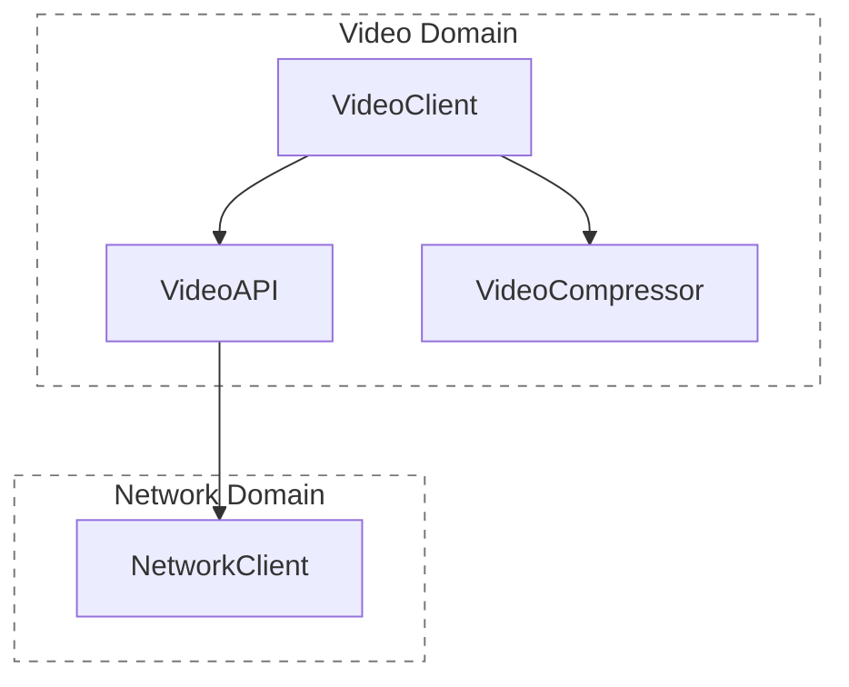
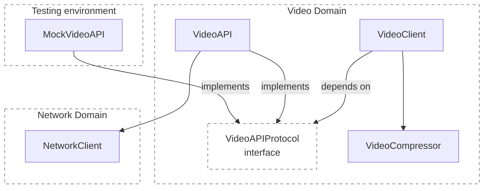
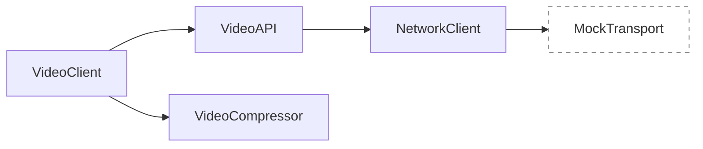

# [WEEK 10] Book 0 Chapter 5
📖 Mobile System Design 0. From Briefings to System Architecture  

<br>

## 5. System-Wide Testing: Delivering Higher Quality Apps
> 외부 I/O와 느린 연산만 대체하고, 나머지 코드는 실제 구현으로 함께 test한다.  
> 목표는 적은 test로 merge 전 동작을 더 넓게 검증하는 것이다.  

### Testing less granularly

작은 클래스를 하나씩 완전히 격리하기보다, mock을 최소화하고 더 큰 코드 흐름을 함께 test한다.  

- mock을 줄이면 실제 구현을 더 넓게 test할 수 있고, interface와 mock 수도 줄어든다.
- merge 전에 여러 타입이 함께 동작하는지 확인할 수 있다.
- 작은 단위 테스트와 통합 테스트 사이의 균형을 찾는 방식이다.

---

### Damage control and damage prevention

모바일 앱은 이미 배포한 버전을 빠르게 되돌리기 어렵다. 여러 팀의 변경도 하나의 release에 함께 담긴다. 그래서 merge 전에 문제를 막는 일이 중요하다.  

#### Damage control

1.  staged rollout
	- 단계적 배포: 일부 사용자부터 단계적으로 천천히 배포한다.
	- 문제가 생겼을 때 배포 범위를 줄인다.
2. feature flag
	- 이미 배포된 앱 안에서 문제가 있는 특정 기능을 원격으로 끌 수 있게 한다.
	- 다만 앱이 flag를 받기 전에 crash하면 막을 수 없고, flag가 잘 관리되지 않으면 대응 수단도 약해진다.

---

### Mocking higher in the stack

`VideoClient`만 따로 test하는 방식과 system-wide test를 비교한다.  
먼저 `VideoClient`를 다른 구현에서 분리해 test하는 일반적인 방식부터 살펴본다.  
system-wide test는 실제 코드 흐름을 더 넓게 test해 release 전에 문제를 잡는 방식이다.  

#### Defining the dependency hierarchy

`VideoClient`는 영상 압축과 업로드를 조합한다.  
업로드는 `VideoAPI`가 맡고, 실제 요청은 `NetworkClient`가 보낸다.  



#### Isolating VideoClient

`VideoClient`만 test하려면 실제 서버 요청은 막아야 한다.  
그래서 직접 사용하는 `VideoAPI`를 mock으로 바꾼다. 그러면 `NetworkClient`까지 만들지 않고 `VideoClient`를 test할 수 있다.  

#### Introducing mocks

`VideoClient`가 실제 `VideoAPI`와 `MockVideoAPI`를 모두 받을 수 있으려면 공통 interface가 필요하다.  
`VideoAPIProtocol`에 업로드 method를 정의하고, 실제 구현과 mock 구현이 이를 따르게 만든다.  



`VideoClient`는 interface만 알고, 실행 환경에 따라 실제 `VideoAPI` 또는 `MockVideoAPI`를 받는다.  
이렇게 비슷한 구현을 둘로 만들면 이름을 짓고 관리하는 비용도 함께 늘어난다.  

#### Setting up a testing environment

test에서는 `MockVideoAPI`를 넣고 업로드 method가 호출됐는지만 확인한다.  
`VideoCompressor`는 외부 I/O가 없는 내부 의존성이므로 mock하지 않는다.  

#### Downsides of mocking higher in the stack

이 방식은 `VideoAPI` 대신 `MockVideoAPI`를 사용한다.  
따라서 `VideoClient`와 실제 `VideoAPI`가 함께 동작하는지는 test하지 못한다.  

각 클래스를 따로 test해도 호출을 두 번 보내거나, 업로드가 끝나기 전에 성공 상태를 반환하는 문제는 놓칠 수 있다.  
결국 수동 확인이나 별도 통합 테스트가 필요해지고, 문제를 늦게 발견할 수 있다.  

> [!Note] **Mocking higher in the stack**  
> - **장점**: 검증 범위를 작게 잡을 수 있어 test를 빠르게 만들고 실행할 수 있다.  
> - **단점**: 대체한 지점 아래의 실제 연결은 검증하지 못한다. interface와 mock 구현을 함께 관리해야 한다.  

---

### Mocking lower in the stack

상위 기능은 실제 구현으로 두고, 외부와 맞닿은 가장 아래 지점만 mock한다.  

#### Finding the smallest surface to mock out

`NetworkClient` 전체가 아니라 **실제 요청을 보내는 transport만 mock**으로 바꾼다.  

인증, 재시도, 요청 구성처럼 `NetworkClient`가 맡은 로직은 test에서도 실제로 실행된다.  



#### Setting up the NetworkClient dependency

`NetworkClient`는 `NetworkTransport`를 받는다. 운영 환경에는 실제 transport를, test에는 `MockTransport`를 넣는다.  

`VideoClient`와 `VideoAPI`는 별도 interface를 만들지 않고 실제 타입을 그대로 사용한다.  

#### Setting up VideoClient for testing

test에서도 `VideoClient`, `VideoAPI`, `NetworkClient`를 실제로 조립한다.  
가장 아래 transport만 mock으로 바꾸므로, 운영 환경과 거의 같은 흐름을 test할 수 있다.  

> Android에서는 HTTP client 전체를 mock하지 않고, 요청을 보내는 경계만 대체해 repository와 API 구현을 함께 test할 수 있다.

#### Trade-offs

- 낮은 계층의 interface는 플랫폼 API에서 쓰는 메서드를 다시 정의해야 할 수 있다.
- 전체 의존성을 조립해야 하므로 test 초기화 코드가 늘어난다.

> [!Note] **Mocking lower in the stack**  
> - **장점**: 외부 I/O를 제외한 실제 구현을 함께 test한다. 구현 사이의 연결 문제를 더 일찍 발견할 수 있다.  
> - **단점**: test를 준비하는 코드가 많아진다. 외부 I/O 경계를 대체하기 위한 interface도 필요할 수 있다.  

---

### Mocking expensive operations

네트워크 외에도 실행 시간이 긴 연산은 test 속도를 위해 대체할 수 있다.  

영상 압축처럼 **비용이 큰 작업은 일부 test에서만 실제로 실행**한다. 나머지 test에서는 압축 알고리즘만 가벼운 구현으로 바꾼다.  

#### Accepting a closure as a dependency

입력과 출력이 분명한 함수 하나는 interface 대신 함수 타입으로 주입할 수 있다.  

```kotlin
class VideoCompressor(
    private val algorithm: (ByteArray) -> ByteArray,
) {
    fun compress(data: ByteArray): ByteArray = algorithm(data)
}

val testCompressor = VideoCompressor { data -> data }
```

test에서는 입력을 그대로 반환하는 가벼운 함수를 넣는다. 운영 환경에서는 실제 압축 함수를 넣는다.  

#### The result

대부분의 test는 **가벼운 연산으로 빠르게 실행**한다. 일부 test만 실제 압축 알고리즘을 사용해 전체 동작을 확인한다.  

---

### Making system-wide testing smoother

`system-wide test`는 실제 구현을 많이 포함하는 만큼 준비할 코드와 실행 시간이 늘어난다.  
이 비용을 줄이되 검증 범위는 유지하는 방법을 다룬다.  

#### Dealing with boilerplate

> [!Note] boilerplate  
> - test할 기능 자체가 아니라, 그 기능을 실행할 수 있도록 의존성을 만들고 연결하는 반복 코드이다.  

`VideoClient`의 업로드 동작을 test하려면 다음 객체를 먼저 조립해야 한다.  
이 조립 코드가 boilerplate이다.  

```text
MockTransport -> NetworkClient -> VideoAPI -> VideoClient
Mock compression algorithm -----------------> VideoCompressor -> VideoClient
```

검증 대상은 `VideoClient`이지만 실제 구현을 함께 test하려면 그 아래 의존성도 준비해야 한다.  

#### Reducing boilerplate in production code

생성자에 운영 환경용 기본값을 두면 일반 실행에서는 의존성을 하나씩 전달하지 않아도 된다.  

- **장점**
	- 운영 코드의 초기화가 짧아진다
	- 필요한 경우에만 의존성을 교체하면 된다.
- **주의점**
	- test에서 기본값을 쓰면 실제 네트워크나 느린 연산이 실행될 수 있다.
	- test용 대체 구현을 빠뜨리지 않도록 팀의 규칙이 필요하다.

#### Reducing boilerplate in tests

test용 기본 객체나 factory를 한곳에 두면 조립 코드를 반복하지 않아도 된다.  
기본 구성은 공통으로 쓰고 각 test는 확인하려는 값만 바꾼다.  

- **장점**
	- test마다 같은 초기화 코드를 쓰지 않는다.
	- test가 의도에 집중하기 쉬워진다.
- **주의점**
	- 기본 구성이 너무 많은 상황을 숨기면 의존성 구조를 파악하기 어려워진다.
	- 기본값이 실제 test 환경에 맞는지 계속 관리해야 한다.

#### Dealing with slower-running tests

실제 구현을 더 많이 함께 실행하면 test는 느려질 수 있다.  
여러 구현을 함께 검증하는 test 몇 개만으로도 연결 문제를 개발 초기에 찾을 수 있고 수동 확인도 줄어든다.  

| 구분 | 구성 | 목적 |
| --- | --- | --- |
| 빠른 test 묶음 | 느리거나 다루기 어려운 부분을 대체한다. | 일상 개발 중 빠르게 확인한다. |
| 무거운 test 묶음 | 실제 구현을 더 많이 포함한다. | 전체 흐름이 함께 동작하는지 확인한다. |

실제 구현을 많이 포함한 test는 실행 시간이 길다.  
매 코드 변경마다 실행하지 않고 야간 CI에서 별도로 실행할 수 있다.  

#### Consider using file systems in your tests

- **메모리 저장소로 대체**
	- 빠르고 정리하기 쉽다.
	- 경로 처리, 저장 오류, 디스크 상태에서 생기는 문제는 놓칠 수 있다.
- **실제 파일 시스템 사용**
	- 운영 환경과 가까운 동작을 확인한다.
	- 실행 시간과 정리 비용이 든다.

파일 저장이 핵심 기능이라면 실제 파일 시스템을 사용하는 test의 비용을 감수할 가치가 있다.  

#### Dealing with untestable code

레거시 코드나 외부 SDK처럼 바꾸기 어려운 코드는 system-wide test에 그대로 넣기 어렵다.  

- 필요한 부분만 좁게 mock한다.
- 수정할 수 있다면 test하기 어려운 부분을 분리한다.
- 새 기능은 처음부터 test 가능한 구조로 만든다.

#### Distance between tests and code

상위 동작을 test하면 하위 구현도 간접으로 검증된다.  

- **장점**
	- 적은 test로 여러 구현의 연결을 확인한다.
	- 사용자가 겪는 흐름에 가까운 문제를 잡는다.
- **한계**
	- 하위 구현을 수정했을 때 관련 test를 찾기 어려울 수 있다.
	- 하위 구현의 특정 버그는 별도 작은 단위 test가 더 명확할 수 있다.  

system-wide test만으로 모든 문제를 해결할 수는 없다. 필요한 곳에는 작은 단위 test를 함께 둔다.  

---

### What is a unit, anyway?

unit의 크기는 정해져 있지 않다.  
함수, 클래스, domain, app 모두 맥락에 따라 하나의 unit이 될 수 있다.  

격리 여부를 엄격하게 따지기보다 배포 전에 버그를 막으려면 어디까지 함께 test해야 하는지 정하는 일이 중요하다.  

---

### What we covered

- 모바일 앱은 배포한 버전을 되돌리기 어려워 release 전 예방이 중요하다.
- 상위에서 mock하면 초기화는 간단하지만 실제 연결을 놓칠 수 있다.
- 외부 I/O와 느린 연산만 낮은 계층에서 대체하면 더 넓은 코드를 함께 검증할 수 있다.
- system-wide test의 비용은 초기화, 실행 시간, test와 코드 사이의 거리로 관리한다.
