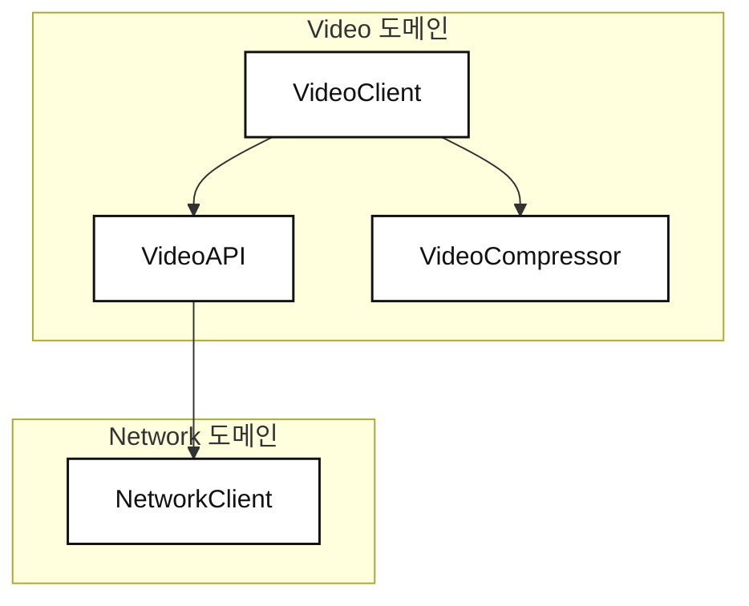
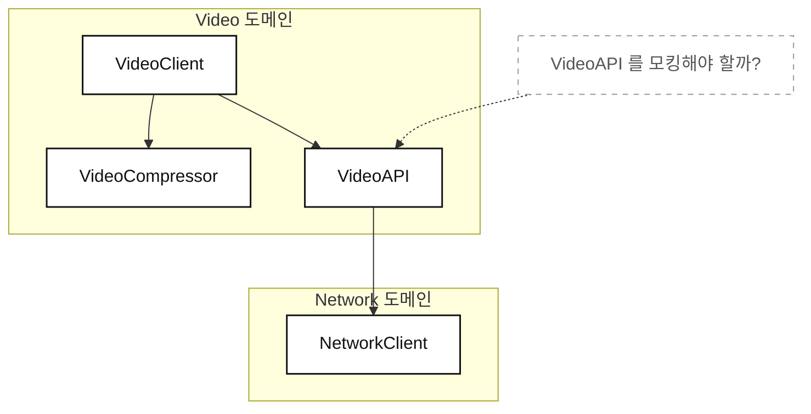
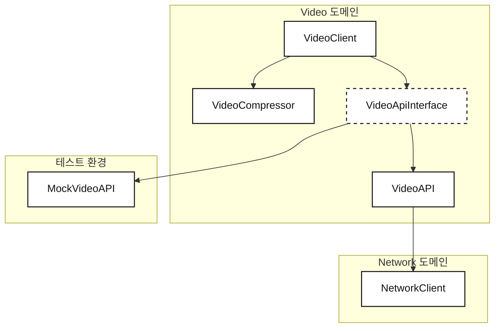
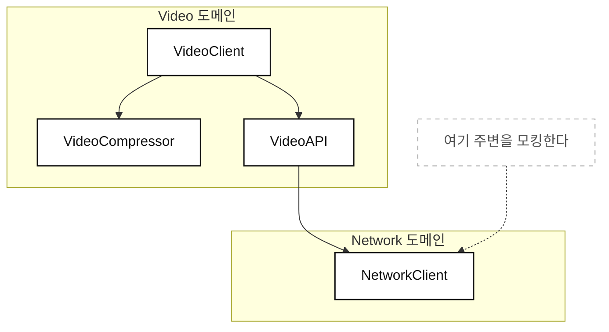
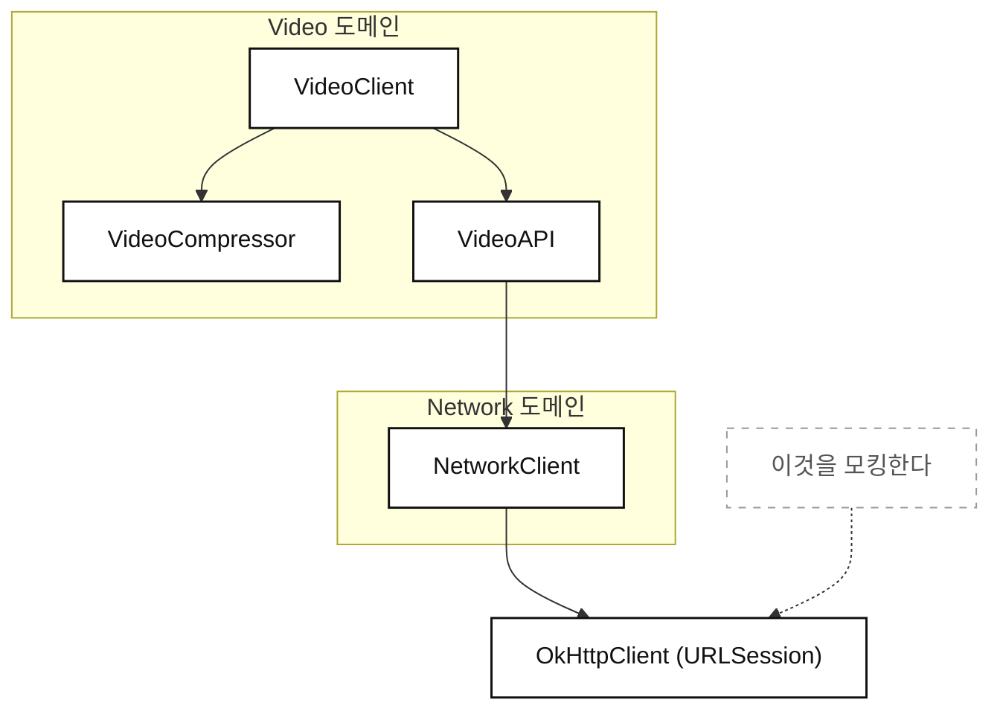
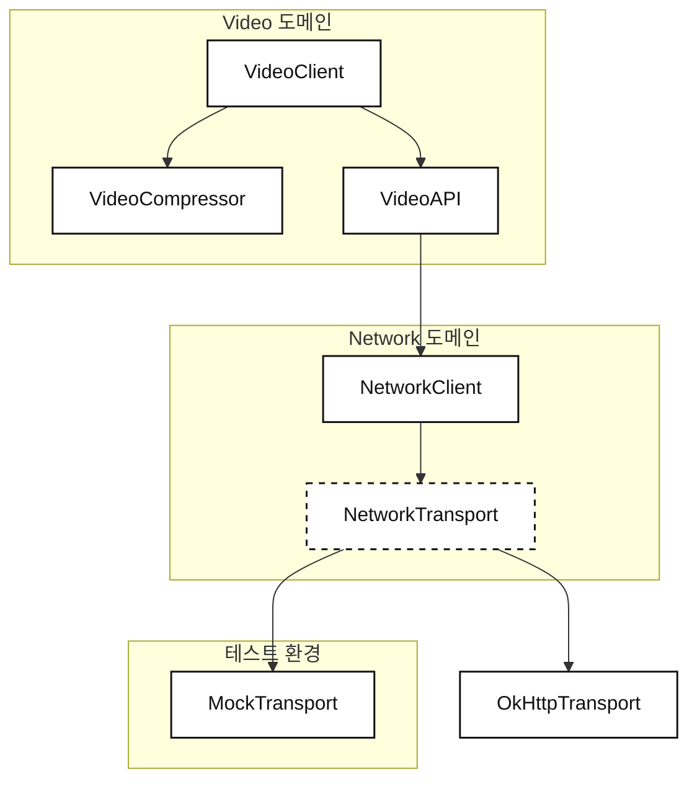
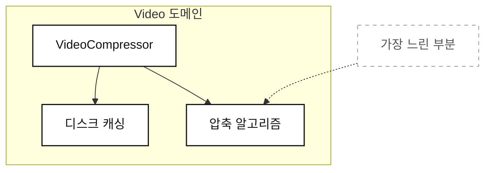

```table-of-contents
```

## 5장 [[05. 시스템 전반 테스트|시스템 전반 테스트]]

> 시계가 시간을 잘 알려주는지 확인하면 되는데, 왜 톱니바퀴 하나하나를 테스트하는가?

- 이전 장에서는 "왜 아직 테스트하지 않는가" 를 다뤘다.
	- 스케치 단계에서 급격히 바뀔 코드를 테스트하는건 낭비이기 때문이었다.
	- 이제는 어느정도 동작하는 시스템이 자리를 잡았으니, 테스트를 논할 차례다.

- 테스트는 의견이 크게 갈리는 분야이며, 한 장으로 "최고의 테스트 방법" 을 정의할 수 없다.
	- 여기서도 은탄환은 없다.
	- 다만 모바일 환경에서 실전 검증된, 다소 **비관습적인** 접근을 다룬다.

- 테스트 방법은 수동 테스트, 유닛 테스트, UI 테스트, 통합 테스트 등 아주 많다.
	- 이 장에서는 개발 단계와 가장 닮아있는 **유닛 테스트**에 집중한다.

## 덜 잘게 테스트하기
- 업계에서는 인터페이스, `Mock`, `Stub` 을 많이 써서 코드를 테스트 가능하게 만들라는 이야기를 자주 듣는다.
- 하지만 이 책에서는 정반대의 접근을 취한다.
	- **가능한 한 적게 모킹하면서, 가능한 한 넓은 코드 표면을 테스트한다.**

- 이렇게 하면 테스트 작성 시간이 줄어들면서도, 코드의 무결성은 그대로 지킬 수 있다.
- 이는 아주 작은 단위가 아니라 코드를 하나의 시스템으로 테스트하는, 소위 **시스템 테스트**에 가깝다.
	- 유닛 테스트와 통합 테스트 사이의 미묘한 균형 지점이다.

- 최종 목표는 **코드를 머지하기 "전에"** 시스템이 전체로서 잘 동작한다는 품질 보증을 확보하는 것이다.
- 부수 효과로 인터페이스가 줄어들어, 코드베이스를 추론하기가 눈에 띄게 쉬워진다.

## 대미지 컨트롤과 대미지 예방
- 유닛 테스트로 뛰어들기 전, 모바일 앱의 릴리즈 과정이 테스트 방식에 어떤 영향을 주는지 먼저 본다.

- 웹, 백엔드 엔지니어와 달리 우리에겐 **빠른 롤백과 하루 여러 번의 자동 배포라는 사치가 없다.**
	- 사람들의 앱을 "업데이트 취소" 할 수 없다.
	- **우리는 앞으로만 갈 수 있다.**

- 세분화된 릴리즈도 불가능하다.
	- 웹은 `/profile` 엔드포인트 뒤의 기능 하나만 갱신할 수 있다.
	- 하지만 우리는 **모든 팀의 모든 기능이 담긴 빌드 하나**를 통째로 제출한다.

- 릴리즈 과정 자체도 무겁다.
	- 프로덕션 빌드 생성, 수많은 체크와 테스트, 문자열 로컬라이징, 마케팅팀의 스토어 설명 요청 등.
	- 어떤 회사는 일주일간 빌드를 검증하며 핫픽스를 브랜치에 얹는다.
	- iOS는 심지어 심사에서 거절당하면 처음부터 다시 제출해야 한다.

- 릴리즈 준비가 끝나도 단계적 롤아웃으로 천천히 내보내며 크래시 수를 예의주시한다.
- **그리고 슬프게도, 이게 최상의 시나리오다.**

### 대미지 컨트롤
- 큰 앱에서는 릴리즈를 막는 버그가 어느 방향에서든 날아온다.
	- 우리 팀이 온보딩 플로우를 릴리즈하려는데, 다른 팀이 결제 화면을 깨뜨릴 수 있다.
	- 릴리즈가 멈추고, 우리의 근사한 기능도 함께 늦어진다.

- 릴리즈 후 중대 버그가 발견되면 이제 **대미지 컨트롤 모드**다.
	- 늦지 않았다면 단계적 롤아웃을 멈출 수 있다.
	- 하지만 **모바일에서 핫픽스는 진짜 '핫' 하지 않다.**
		- 새 빌드를 만들어야 하고, iOS는 신속 심사까지 거쳐야 한다.
		- 최소 하루는 쉽게 잡아먹는다.

- 통제력을 얻는 방법 중 하나는 `Feature Flag` 다.
	- 백엔드가 제어하는 플래그 뒤에 코드 경로나 기능을 두어, 사고 발생 시 원격으로 꺼버릴 수 있다.
	- 강력히 권장되지만 완벽한 계획은 아니다.
		- 플래그가 늘 잘 관리되는 것도 아니고, **앱이 플래그를 가져오기 전에 크래시할 수도 있다.**

- 강한 릴리즈 프로세스와 대미지 컨트롤은 필수다.
- **하지만 동전의 반대편에는 대미지 "예방" 이 있다.**
	- 라이브로 나가기 전에 품질을 지키는 방법이며, 이것이 이 장의 목표다.

## 스택의 높은 곳에서 모킹하기
- 학생이 자기 진도를 업로드해 튜터에게 보여줄 수 있는 `VideoClient` 기능을 만든다고 가정한다.
	- 기타를 배우는 학생이 연주 영상을 올려 분석을 요청한다.
	- 스페인어를 배우는 학생이 발음이 어려운 문구를 영상으로 올려 도움을 청한다.
	- 1:1 통화를 기다리지 않고 **비동기로 도움을 받는 것**이 핵심이다.

- `VideoClient` 는 디스크 미디어 읽기, 비트레이트 변환, 부분 업로드 재개, 백그라운드 업로드 등 복잡한 로직을 요구한다.

### 의존성 계층 정의하기



- 맨 위에 `VideoClient` 가 있고, `VideoAPI` 와 `VideoCompressor` 에 의존한다.
- `VideoAPI` 는 업로드를 담당하므로, 이전 장에서 도입한 `NetworkClient` 를 사용한다.

```kotlin
val videoClient = VideoClient()

// VideoClient 는 upload() 호출 시 내부적으로 압축과 업로드를 알아서 처리한다
val result = videoClient.upload(videoData = myVideoData)
```

- 사용자는 그저 인스턴스를 만들고 데이터를 넘기기만 하면 된다.

### VideoClient 격리하기
- `VideoClient` 를 유닛 테스트한다고 하자.
	- 유닛 테스트에서 프로덕션 서버로의 네트워크 호출은 원치 않으므로, 모킹으로 걷어내야 한다.
- 테스트 대상이 `VideoClient` 이므로, 바로 **한 층 아래**에 `Mock` 을 넣는다.



- 개발자들이 흔히 택하는 접근이다.
	- 편리하고, `VideoClient` 를 격리된 유닛으로 빠르게 초기화할 수 있기 때문이다.
- 하지만 이 접근에는 **대가가 따른다.**

### Mock 도입하기
- 테스트 중엔 `VideoAPI` 를 `MockVideoAPI` 로 갈아끼운다.
	- 그러려면 우선 인터페이스가 필요하다.



- **여기서 벌써 단점 하나가 뚜렷해진다.**
	- `VideoAPI` 를 거울처럼 비추다보니 인터페이스 작명이 어려워진다.
	- 결국 게으르게 `Interface`(Swift 에서는 `Protocol`) 접미사를 붙이게 된다.
	- 타입 이름 짓기도 힘든데, **비슷한 아이디어에 이름을 두 개 지어야 한다.**
	- (3장에서 언급했던 `CourseService` / `CourseServiceImpl` 코드 스멜과 정확히 같은 이야기다.)

```kotlin
// 인터페이스를 별도로 정의한다.
interface VideoApiInterface {
    suspend fun uploadVideo(data: ByteArray)
}

class VideoClient(
    // videoAPI 는 생성자를 통해 주입받아 보관한다.
    private val videoAPI: VideoApiInterface,
) {
    // videoCompressor 는 갈아끼울 일이 없으므로 여기서 직접 생성한다.
    private val videoCompressor = VideoCompressor()

    suspend fun upload(videoData: ByteArray) {
        // ... 구현 생략
    }
}
```

- `VideoCompressor` 를 `VideoClient` 내부에서 직접 생성하는 점에 주목한다.
	- 여기는 아무것도 갈아끼우지 않기 때문이다.

```kotlin
// 프로덕션에서 실제로 영상을 업로드할 "진짜" VideoAPI
class VideoAPI : VideoApiInterface {

    // 실제 네트워크 호출을 수행하기 위한 API
    private val api = API()

    override suspend fun uploadVideo(data: ByteArray) {
        // uploadVideo 는 내부적으로 api 를 사용해 실제 네트워크 호출을 한다.
        val result = api.upload(data)
        // ... 이하 구현 생략
    }
}
```

```kotlin
// 프로덕션 환경에서의 구성
val videoAPI = VideoAPI()
val videoClient = VideoClient(videoAPI = videoAPI)
```

### 테스트 환경 구성하기
- 테스트 환경에서는 동일한 인터페이스를 따르는 `MockVideoAPI` 를 도입한다.
	- `VideoAPI` 와 달리 `NetworkClient` 에 의존하지 않고, 업로드도 하지 않는다.
	- **그저 메소드가 호출됐는지만 확인한다.**

```kotlin
class MockVideoAPI : VideoApiInterface {

    // 특정 메소드가 실제로 트리거되었는지 검증하기 위한 플래그
    var didUploadVideo = false

    override suspend fun uploadVideo(data: ByteArray) {
        didUploadVideo = true
        // ... 이하 구현 생략
    }
}
```

```kotlin
// 테스트 환경에서의 구성
val mockVideoAPI = MockVideoAPI()
val videoClient = VideoClient(videoAPI = mockVideoAPI)
```

- 이 방식의 이점은 명확하다.
	- 테스트 대상 클래스를 인스턴스화하기 쉽다.
	- 셋업 코드가 아주 작다. `Mock` 하나만 만들면 끝이다.

- 다만 `VideoClient` 는 여전히 `VideoCompressor` 에 의존한다.
	- 즉, **"완전히 격리" 되었다고 이름 붙이는 것부터가 회색 지대다.**
	- `VideoCompressor` 는 함수 하나, 메소드 하나, 중첩 타입이었을 수도 있다.
	- 형식적으로 별도의 클래스일 뿐인데, 그 때문에 의존성으로 넘겨야 할 것처럼 느껴진다.

- 외부 의존성이 필요없으므로, `VideoCompressor` 는 **내재적(intrinsic) 의존성**으로 보고 모킹하지 않아도 된다.

### 스택 높은 곳에서 모킹할 때의 단점
- 방금 우리는 `VideoClient` 바로 한 층 아래에 인터페이스를 도입했다.
- 하지만 여기엔 값비싼 대가가 따른다.

- **`VideoAPI` 와 `VideoClient` 사이의 통합이 테스트 스위트에서 완전히 빠져있다.**
	- `VideoClient` 는 테스트 중 `VideoAPI` 에 의존하지 않는다.
	- 즉, **언제나 완벽하게 통제된 네트워킹 환경만 갖게 된다.**

- 각 클래스가 따로따로 잘 테스트되어 있어도 미묘한 버그는 스며든다.
	- `VideoClient` 가 업로드 메소드를 두 번 호출할 수도 있다.
	- 잘못된 스레드에서 반환할 수도 있다.
	- 업로드가 끝나기 전에 성공 상태를 반환할 수도 있다.
		- 큰 파일을 재개 가능한 청크로 쪼개 올리다보면 꽤 쉽게 마주치는 시나리오다.

- 이런 버그는 처음엔 안 생긴다.
	- 개발자로서 새 기능이 잘 동작하는지 우리가 직접 확인하기 때문이다.
	- **하지만 유지보수가 이어지는 동안 버그는 훨씬 쉽게 스며든다.**
	- 유닛 테스트가 이를 잡고있지 않으니 위험은 계속 커진다.

- 결국 통합에 자신을 가지려면 다른 수단에 기대게 된다.
	1. 릴리즈 때마다 수동으로 확인한다.
	2. 내부 빌드를 돌리고 사람들이 버그를 잡아주길 바란다.
	3. 실제 네트워크 호출을 하는 통합 테스트를 별도로 작성한다.

- **고작 두 클래스가 잘 맞물리는지 확인하는데 추가 작업이 이렇게 많이 든다.**
- 테스트가 릴리즈 직전의 수동 확인 쪽으로 밀려나는데, 이는 서두에서 다뤘듯 모바일 개발에 해롭다.

## 스택의 낮은 곳에서 모킹하기
- 이번엔 시스템 전반 접근을 사용한다.
	- 스택에서 **가능한 한 높이** 모킹하는 대신, **가능한 한 낮게** 모킹한다.
- 현재 스택에서 모킹으로 걷어낼 수 있는 가장 낮은 클래스는 `NetworkClient` 다.



- `NetworkClient` 를 모킹하면 `VideoClient` 는 테스트 중에도 **진짜 `VideoAPI` 에 의존**하게 된다.
	- 즉, 유닛 테스트가 실제 프로덕션에 내보내는 것과 훨씬 닮아진다.

- 다만 `VideoAPI` 는 여전히 `NetworkClient` 의 `Mock` 변형에 의존한다.
	- 그래서 그 사이의 버그는 여전히 남아있을 수 있다.
	- **그렇다면 클래스 전체를 모킹하는 것이 정말 맞을까?**

### 모킹할 최소 표면 찾기
- 되돌아가서, **왜** `NetworkClient` 를 모킹하고 싶었는지 생각한다.
	- 답은 단 하나, **유닛 테스트 중에 실제 서버로 네트워크 호출을 하지 않기 위해서**다.

- 그런데 `NetworkClient` 는 네트워크 호출만 하는게 아니다.
	- 클래스의 대부분은 토큰 관리, 재시도 메커니즘, 검증, 요청 구성 등 **네트워킹 특유의 코드**다.
	- **실제 네트워크 호출을 하는 부분은 나머지 10% 정도에 불과하다.**

- 그러니 통째로 모킹하는 대신, **네트워크 의존성만 모킹해 걷어낸다.**
	- iOS는 `URLSession`, 안드로이드라면 `OkHttpClient` 정도가 이에 해당한다.
	- 이를 `NetworkClient` 의 외부 의존성으로 만들어 갈아끼울 수 있게 한다.



- 즉 이전보다 훨씬 깊게, `VideoClient` 기준으로 **세 층 아래에서** 모킹하게 된다.

### NetworkClient 의존성 구성하기
- `NetworkClient` 가 인터페이스를 주입받도록 만든다.
	- 이전과 달리 이 인터페이스는 스택의 훨씬 깊은 곳에 위치한다.
	- 이름은 `NetworkTransport` 로 짓는다.



```kotlin
// 새로운 인터페이스를 도입한다.
interface NetworkTransport {
    suspend fun data(request: Request): Response
}

// NetworkClient 는 이 인터페이스에만 의존한다.
class NetworkClient(
    private val transport: NetworkTransport,
) {
    // ... 이하 생략
}
```

- Swift 에서는 익스텐션만으로 `URLSession` 이 프로토콜을 따르도록 만들 수 있다.
	- `extension URLSession: NetworkTransport {}` 한 줄이면 끝이다.
- **하지만 코틀린에는 "기존 클래스에 인터페이스를 나중에 얹는" 기능이 없다.**
	- 확장 함수는 인터페이스 구현을 대신해주지 않는다.
	- 그러므로 얇은 어댑터 클래스를 하나 만들어야 한다.

```kotlin
// 코틀린에서는 OkHttpClient 를 감싸는 얇은 어댑터를 만들어 인터페이스를 만족시킨다.
class OkHttpTransport(
    private val client: OkHttpClient = OkHttpClient(),
) : NetworkTransport {

    override suspend fun data(request: Request): Response {
        return client.newCall(request).execute()
    }
}
```

- 다음으로, `VideoAPI` 가 `NetworkClient` 를 외부에서 주입받도록 변경한다.

```kotlin
class VideoAPI(
    // 이제 이 클래스는 NetworkClient 를 외부에서 주입받는다.
    private val networkClient: NetworkClient,
) {
    // ... 이하 생략
}
```

- 마지막으로 `VideoClient` 가 인터페이스가 아니라 **평범한 `VideoAPI` 구체 타입**을 받도록 한다.

```kotlin
class VideoClient(
    // Before : private val videoAPI: VideoApiInterface
    // After  : 인터페이스가 사라지고 구체 타입을 그대로 받는다.
    private val videoAPI: VideoAPI,
) {
    // ... 이하 생략
}
```

```kotlin
// 프로덕션(혹은 스테이징) 구성
val transport = OkHttpTransport()
val networkClient = NetworkClient(transport = transport)
val videoAPI = VideoAPI(networkClient = networkClient)
val videoClient = VideoClient(videoAPI = videoAPI)
```

### 테스트용 VideoClient 구성하기
- 테스트에서는 `OkHttpTransport` 대신 `MockTransport` 를 넘긴다.
	- 마찬가지로 `NetworkTransport` 를 구현한다.

```kotlin
class MockTransport : NetworkTransport {
    // ... 구현 생략
}

// 테스트를 위한 VideoClient 구성
val mockTransport = MockTransport()
val networkClient = NetworkClient(transport = mockTransport)
val videoAPI = VideoAPI(networkClient = networkClient)
val videoClient = VideoClient(videoAPI = videoAPI)
```

- 그 결과 `VideoAPI` 와 `VideoClient` 의 유닛 테스트에서 **진짜 `NetworkClient` 를 사용**할 수 있게 되었다.
- 그뿐만 아니라 `NetworkClient` 도 여전히 **90% 는 프로덕션 코드 그대로**다.
	- 모킹으로 걷어낸건 나머지 10%, HTTP 엔진 하나뿐이다.

### 트레이드오프
- 성가신 트레이드오프가 하나 있다.
	- 인터페이스가 우리가 쓰려는 HTTP 엔진의 메소드를 **그대로 다시 비춰야 한다**는 점이다.
	- `NetworkClient` 는 인터페이스에만 의존하므로, 엔진의 원래 메소드에 더는 닿을 수 없다.

- (이 문장이 처음에 잘 안 읽혀서 직접 풀어봤다.)
	- 원래 `NetworkClient` 는 `OkHttpClient` 를 직접 들고 있었으니, 그 안의 메소드를 **아무거나 꺼내 쓸 수 있었다.**
	- 그런데 이제는 `NetworkTransport` 라는 좁은 문틈으로만 엔진을 본다.
	- **문틈에 뚫어놓지 않은 기능은 존재하지 않는 것과 같다.**

- 즉 나중에 타임아웃 조정, 요청 취소, 스트리밍 업로드, 쿠키 처리같은게 필요해지면 그 때마다 다음을 전부 건드려야 한다.
	1. `NetworkTransport` 에 메소드를 추가한다.
	2. `OkHttpTransport` 에 구현을 추가한다.
	3. `MockTransport` 에도 (쓰지 않더라도) 구현을 추가한다.
- 이 짓을 반복하다보면 `NetworkTransport` 는 결국 **`OkHttpClient` 의 축소 복사판**이 된다.
	- **그리고 이건 이 장 앞부분에서 저자가 그렇게 욕했던 `VideoApiInterface` 와 정확히 같은 종류의 거울 인터페이스다.**

- 그럼 결국 똑같은 짓을 한 것 아닌가? 싶지만, 그래도 아래에서 하는 편이 낫다고 본다.
	- 위에서 모킹하면 **도메인이 늘어날 때마다** 거울이 하나씩 늘어난다. (`VideoAPI`, `TutorAPI`, `TodoAPI`, ...)
	- 아래에서 모킹하면 거울은 **앱 전체에 딱 하나**고, 그 아래로는 더 내려갈 곳도 없다.
	- **즉 거울 N개를 거울 1개로 바꾸는 거래**라고 이해하면 납득이 된다.
	- 게다가 이 거울은 우리가 실제로 쓰는 메소드만 비추면 되므로, 보통 두세 개 선에서 끝난다.

- iOS의 경우 `URLSession` 이 `URLProtocol` 형태로 자체 모킹 수단을 제공하여 이를 회피할 수 있다.
	- 안드로이드도 `OkHttp` 의 `MockWebServer` 나 `Interceptor` 를 활용하면 인터페이스 도입 자체를 피할 수 있다.
	- 다만 **모든 솔루션이 자체 모킹 능력을 갖춘 것은 아니므로**, 여기서는 플랫폼 중립적으로 남겨둔다.

- "자체 모킹 수단" 이 왜 인터페이스를 없애주는지도 정리해둔다.
	- 핵심은 **엔진이 이미 자기 안에 갈아끼울 구멍(seam)을 뚫어놨다**는 것이다.
	- 우리가 인터페이스로 구멍을 뚫을 필요가 없으니, `NetworkClient` 는 `OkHttpClient` 를 그냥 직접 들고 있으면 된다.

- 다만 안드로이드의 두 방법은 성격이 꽤 다르다.
	- `Interceptor` : `OkHttp` 체인 중간에 끼어들어 **네트워크를 타기 직전에 가짜 응답으로 가로챈다.**
		- `URLProtocol` 과 가장 비슷한 방식이다.
	- `MockWebServer` : 로컬에 **진짜 HTTP 서버를 띄우고**, 클라이언트가 `127.0.0.1` 로 진짜 요청을 보낸다.
		- 가로채는게 아니라 상대편을 가짜로 바꾸는 것이다.

- 개인적으로는 이 장의 철학에 **`MockWebServer` 가 제일 잘 맞는다**고 생각한다.
	- 모킹 표면이 사실상 0이다. `OkHttp` 스택 전체가 진짜 코드로 돌기 때문이다.
	- 헤더 직렬화, 인터셉터 체인, 커넥션 풀, 타임아웃까지 전부 실제 경로를 탄다.
	- 저자가 말한 **"90%는 프로덕션 코드"** 를 거의 100%까지 끌어올리는 셈이다.
	- 단점이라면 소켓을 쓰니 인터페이스 `Mock` 보다는 느리고, `baseUrl` 만큼은 어차피 갈아끼울 수 있어야 한다.
		- 즉 **인터페이스가 사라질 뿐, 주입 자체가 사라지는건 아니다.**

- 또 하나의 대가는 **셋업 코드가 늘어난다는 것**이다.
	- `VideoClient` 하나를 구성하는데 이제 네 줄이 필요하다.
	- 이 보일러플레이트가 개발자들이 이 접근을 꺼리게 만드는 주 원인이다.

- 그런데 진짜 아픈 지점은 "네 줄" 그 자체가 아니라고 본다.
	- 문제는 이 네 줄이 **전이적(transitive)** 이라는 점이다.
	- `VideoClient` 하나를 테스트하려고 **그 아래 그래프 전체를 알고 있어야 한다.**
	- 파라미터가 늘어나면 그 클래스를 쓰는 테스트가 아니라 **앱 전체의 셋업 코드가 같이 깨진다.**

- 그래서 이 접근은 **"테스트를 위해 조립 책임을 어딘가로 밀어내는 것"** 을 전제로 한다.
	- 바로 다음 절의 기본값이 1차 대응이고,
	- 결국 이게 **의존성 주입 장(7~9장)이 존재하는 이유**로 이어진다.
	- (이 장 혼자 읽으면 "그래서 이 보일러플레이트 어쩌라고?" 로 끝나는데, 뒤에서 회수되는 떡밥이라고 보면 될 것 같다.)

## 비싼 연산 모킹하기
- 모킹의 이유가 네트워킹만 있는 것은 아니다.
- 그리고 인터페이스 대신 **클로저(람다)로도 모킹할 수 있다.**

- 비디오 압축은 시간이 아주 오래 걸린다.
	- 시스템 전반 테스트를 쓰면 `VideoClient` 는 항상 진짜 `VideoCompressor` 에 의존한다.
	- **하지만 모든 테스트에서 실제로 비디오를 압축하는 것은 말이 안된다.**
	- 그러지 않으면 테스트 실행 시간이 몇 분에서 몇 시간으로 튈 수 있다.



- `VideoCompressor` 역시 여러 일을 한다.
	- 큰 파일을 다루기 위한 디스크 캐싱, 멀티스레딩 등.
	- 하지만 그게 가장 느린 부분이 아니다.
	- **가장 느린 부분은 바이트를 새로운 바이트로 바꾸는 압축 알고리즘 그 자체다.**

- 그러니 그 알고리즘이 **나머지를 전부 그대로 둔 채 갈아끼울 수 있는 가장 작은 컴포넌트**다.
- 비디오 압축은 결국 데이터가 들어가서 데이터가 나오는 문제이므로, 함수 타입으로 표현할 수 있다.

```kotlin
// 원시 데이터를 받아 원시 데이터를 반환하는 함수 타입
val compressionAlgorithm: (ByteArray) -> ByteArray
```

```kotlin
// 프로덕션용 알고리즘
val compressionAlgorithm: (ByteArray) -> ByteArray = { data ->
    // 데이터에 대해 비싼 연산을 수행한다.
    // 시연을 위해 실제 알고리즘은 생략한다.
    val compressedData = compress(data)
    compressedData
}

// 알고리즘을 주입하여 VideoCompressor 를 생성한다.
val videoCompressor = VideoCompressor(algorithm = compressionAlgorithm)
```

```kotlin
// 테스트용 Mock 알고리즘. 들어온 데이터를 아무 처리 없이 그대로 반환한다.
val mockCompressionAlgorithm: (ByteArray) -> ByteArray = { data -> data }
val videoCompressor = VideoCompressor(algorithm = mockCompressionAlgorithm)
```

### 클로저를 의존성으로 받기
- 함수 하나만 갈아끼우면 되는 상황이므로, **인터페이스를 정의할 필요가 전혀 없다.**

```kotlin
class VideoCompressor(
    // 알고리즘을 프로퍼티로 보관하며, 생성자를 통해 주입받는다.
    private val algorithm: (ByteArray) -> ByteArray,
) {
    // 비디오를 압축할 때 데이터를 넘긴다.
    fun compress(videoData: ByteArray): ByteArray {
        // 진짜든 Mock 이든, 주입받은 알고리즘에 데이터를 통과시켜 결과를 반환한다.
        // 이 코드에 표현되지 않은 것 : 디스크 캐싱과 멀티스레딩
        val compressedData = algorithm(videoData)
        return compressedData
    }

    // ... 나머지는 시연을 위해 생략
}
```

- Swift 에서는 클로저를 저장할 때 `@escaping` 표기가 필요하다.
	- 클로저가 저장되어 메모리에 참조를 유지한다는 표시다.
	- **코틀린은 함수 타입이 그냥 객체이므로 별도의 표기가 필요 없다.**

### 결과
- `VideoClient` 하나를 테스트하는 것으로, **도메인 전체의 90% 를 테스트**하게 되었다.
	- 그것도 아주 조금만 모킹하면서 말이다.
- 코드를 머지하기 **전에** 더 많은 안전 보장을 얻을 수 있게 되었다.

- 균형을 위해, **"프로덕션" 알고리즘은 몇 개의 테스트에서만 쓰도록 선택**할 수 있다.
	- 모든 것이 의도대로 동작하는지는 그 몇 개로 검증하고,
	- 나머지 테스트 스위트에는 가벼운 알고리즘을 쓰면 스위트가 훨씬 빨리 돈다.

## 시스템 전반 테스트를 더 매끄럽게
- 이제 이 접근의 단점들을 생각해본다.

- 작은 단위만 격리해 테스트하는 것이 업계 표준이라 믿을 수 있다.
	- 어쨌든 이름부터가 "유닛" 테스트니까.
	- 유닛을 **진짜 의존성과 함께** 테스트하는건 나쁜 생각처럼 느껴질 수 있다.

- 하지만 이점을 다시 따져보자.
	- **개발 단계에서, 유닛 테스트의 형태로 더 많은 품질 보증을 얻는다.**
	- 평범한 CI 구성이라면 팀의 누군가가 머지하기 전에 이 테스트가 **항상** 돈다.
	- 누군가 수동 확인을 잊더라도, **유닛 테스트가 안전망으로 남는다.**

- 유닛테스트 중 겪게 되는 문제점들은 다음과 같다.
	1. 네트워킹, 파일 저장 같은 I/O 를 제대로 테스트하기 어렵다.
	2. 테스트 중 실제 디스크를 쓰면 느리다.
	3. UI, 생체 인증, 백그라운드 전환 등 바깥세상은 유닛 테스트가 어렵거나 불가능하다.
	4. 모든 걸 초기화해야 하므로 테스트 셋업이 손이 많이 간다.
	5. 벤더 SDK 같이 우리 소유가 아닌 폐쇄 소스는 테스트 자체가 불가능할 수 있다.
	6. 비디오 인코딩, 이미지 처리같은 비싼 연산이 테스트 스위트를 늦춘다.
	7. `Mock` 대신 프로덕션 코드로 테스트하면 컴파일과 실행이 더 느려진다.

### 보일러플레이트 다루기

```kotlin
// 테스트용 알고리즘을 준비한다.
val mockCompressionAlgorithm: (ByteArray) -> ByteArray = { data -> data }
val videoCompressor = VideoCompressor(algorithm = mockCompressionAlgorithm)

// Mock Transport 를 준비한다.
val mockTransport = MockTransport()
val networkClient = NetworkClient(transport = mockTransport)
val videoAPI = VideoAPI(networkClient = networkClient)

// 모든 의존성이 만들어진 뒤에야 비로소 VideoClient 를 초기화할 수 있다.
val videoClient = VideoClient(
    videoAPI = videoAPI,
    videoCompressor = videoCompressor,
)
```

- `VideoClient` 하나 만드는데 초기화 전 다섯 줄이 더 필요하다.
	- 그것도 앱 전체의 아주 작은 일부일 뿐이다.
- **하나를 테스트하려고 잔뜩 격식을 차려야 한다는 반감은 정당한 지적이다.**
	- 다만 약간의 작업으로 이 노력을 줄일 수 있다.

### 프로덕션 코드의 보일러플레이트 줄이기
- 가장 단순한 해법은 **기본값을 제공하는 것**이다.
	- 코틀린은 생성자 기본 파라미터를 지원하므로 그대로 적용 가능하다.

```kotlin
class NetworkClient(
    private val transport: NetworkTransport = OkHttpTransport(),
) {
    // ... 이하 생략
}

class VideoAPI(
    // 이제 기본 NetworkClient 인스턴스를 제공한다.
    private val networkClient: NetworkClient = NetworkClient(),
) {
    // ... 이하 생략
}

class VideoCompressor(
    // 기본값으로 고압축 알고리즘을 사용한다.
    private val algorithm: (ByteArray) -> ByteArray = Algorithm.highCompression,
) {
    // ... 이하 생략
}

class VideoClient(
    // videoAPI, videoCompressor 모두 기본값을 갖게 되었다.
    private val videoAPI: VideoAPI = VideoAPI(),
    private val videoCompressor: VideoCompressor = VideoCompressor(),
) {
    // ... 이하 생략
}
```

```kotlin
// 마침내 파라미터 없이 한 줄로 구성할 수 있게 되었다.
val videoClient = VideoClient()
```

- 다만 단점이 하나 있다.
	- **프로덕션 코드가 "암묵적" 이 된다는 점이다.**
	- 의존성을 모르는 채 테스트에서 그냥 `VideoClient()` 를 만들면, 암묵적으로 **프로덕션 서버와 통신**하게 된다.
	- 혹은 여러 클래스 중 하나에 `Mock` 주입을 빠뜨려서, 테스트 스위트에서 실제 네트워크 호출이 나갈 수도 있다.

- **즉, 이 접근은 팀의 어느정도 경각심을 필요로 한다.**
	- 환경이 허락한다면 이 기본 생성자를 **프로덕션 코드에서만** 제공하는 것도 방법이다.

### 테스트의 보일러플레이트 줄이기
- 위에서 만든 기본값은 전부 **프로덕션용**이므로, 테스트에는 여전히 보일러플레이트가 남는다.
- 테스트에서도 비슷한 접근을 쓰거나, 팩토리를 통해 재사용 가능한 기본값을 정의할 수 있다.

- Swift 는 타입 익스텐션에 `static` 프로퍼티를 더해 해결한다.
	- 코틀린이라면 `companion object` 를 쓰거나, 테스트 소스셋의 확장 프로퍼티로 정의할 수 있다.

```kotlin
// 테스트 소스셋에 기본 구현들을 모아둔다.
val NetworkClient.Companion.default: NetworkClient
    get() = NetworkClient(transport = MockTransport())

val VideoAPI.Companion.default: VideoAPI
    get() = VideoAPI(networkClient = NetworkClient.default)

val VideoCompressor.Companion.default: VideoCompressor
    get() = VideoCompressor(algorithm = Algorithm.simple)

val VideoClient.Companion.default: VideoClient
    get() = VideoClient(
        videoAPI = VideoAPI.default,
        videoCompressor = VideoCompressor.default,
    )
```

```kotlin
// 테스트 환경에서의 초기화는 이제 이 한 줄이면 된다.
val videoClient = VideoClient.default
```

- 단, 코틀린에서 `Companion` 확장 프로퍼티를 쓰려면 각 클래스가 **빈 `companion object` 라도 선언**하고 있어야 한다.
	- 그게 싫다면 그냥 `TestFixtures.videoClient` 같은 팩토리 오브젝트를 하나 두는 편이 깔끔하다.

- 이 자체를 보일러플레이트로 볼 수도 있다.
- **하지만 모든 기본값을 담은 중앙화된 위치가 있으면, 나머지 테스트 스위트에서 훨씬 많은 보일러플레이트를 걷어낼 수 있다.**

### 느려지는 테스트 다루기
- 모든 컴포넌트가 함께 도니 테스트가 느려진다는 반대가 있다.
	- `VideoClient` 만 격리하는 것과, 그 밑의 서른 개 남짓한 클래스와 함께 도는 것을 상상해보라.

- 하지만 관점을 뒤집어보자.
	- **머지 후에야 문제를 발견하는 빠른 테스트 다수**와,
	- **더 느리더라도 시스템 전체가 의도대로 동작한다는 확신을 주는 적은 수의 테스트.**
	- 후자는 충분히 고려할 가치가 있다.

- 절충안도 있다.
	- 느리거나 어려운 부분은 기본으로 모킹하되, **모든 것이 진짜 타입으로 도는 테스트를 하나 남겨두는 것**이다.
	- 속도와 안전을 둘 다 얻는다.

- 테스트가 느려져도, **릴리즈 프로세스 전체는 오히려 더 빨라질 수 있다.**
	- 수동 테스트에 그만큼 기대지 않아도 된다.
	- 이미 시스템 전반 테스트가 커버하니 통합 테스트에도 덜 기댄다.
	- `VideoClient` 하나를 테스트하면 `VideoAPI`, `NetworkClient`, `VideoCompressor` 를 **간접적으로 테스트**하므로 작성 시간도 아낀다.

- 또 다른 접근은 **느린 스위트를 주기적으로만 돌리는 것**이다.
	- 일상 개발에는 가벼운 "퀵 Mock" 스위트를 두고,
	- 야간 CI 잡이 "무거운" 스위트를 돌려 추가 점검을 하게 한다.

### 테스트에서 파일 시스템 사용을 고려하라
- 개발자들은 테스트 중 파일 시스템 사용을 꺼려 메모리 저장소로 모킹하곤 한다.
	- 디스크는 덜 신뢰할만하고, 가득 찰 수 있고, 오류를 내고, 느리고, 청소도 해야하니 일리는 있다.

- 하지만 그 가치를 생각해보라.
	- 로컬 디스크 캐싱 라이브러리를 만든다면, **어떤 플랫폼은 경로 끝에 `/` 를 자동으로 붙이고 어떤 플랫폼은 안 붙인다**는걸 알아둬야 한다.
	- 이런 것들이 "늘 잘 돌던" 코드가 갑자기 폴더 관련 버그를 뿜게 만든다.

- **테스트가 느려질 것이라고 지레짐작하지 마라.**
	- 설령 느려져도, 코드가 동작한다는 보증은 그 값을 치를 만하다.

### 테스트 불가능한 코드 다루기
- 어떤 클래스들은 애초에 유닛 테스트되도록 **설계되지 않았다.**
	- 이 책은 기분 좋은 그린필드 프로젝트를 다루지만, 현실은 다르다.
	- 상태와 I/O 에 잔뜩 기댄 지저분한 코드, 레거시에 의존하는 코드, 모든게 모든것에 의존하는 스파게티.

- 그런 상황에서는 시스템 전반 접근을 늘 택할 수는 없다.
	- 대신 **더 적은 인터페이스로 조각조각 외과적으로 모킹**하기로 결정할 수 있다.
	- 아니면 고통을 감수하고 어려운 컴포넌트를 테스트 가능하게 만들거나.

- **새 기능을 만들 때는 설계 재량이 훨씬 많다.**
	- 그럴 때 이 접근을 고려해보고, 자신에게 맞는지 확인하라.

### 테스트와 코드 사이의 거리
- `VideoClient` 를 테스트하면 나머지를 간접적으로 테스트하게 된다.
	- 그런데 `NetworkClient` 의 버그를 고친다면, 그 버그를 잡는 테스트는 **`VideoAPI` 쪽 테스트에 갱신된다.**

- 이러면 `NetworkClient` 가 테스트되지 않는 것처럼 **"보이는" 거리**가 생긴다.
	- 실제로는 간접적으로 테스트되고 있지만 말이다.

- 그 결과 클래스와 관련된 테스트가 그 클래스 근처에 있지 않게 된다.
	- 간접 의존이 생기고, **이식성을 해칠 수 있다.**
	- `VideoClient` 는 빼고 `NetworkClient` 만 모듈로 추출하고 싶다면, `NetworkClient` 는 관련 테스트 일부를 잃게 된다.

- 또한 버그를 고치려면 깊이 파고드는걸 피할 수 없는 경우도 있다.
	- 위쪽 타입을 테스트하는 것으로 모든걸 해결할 수는 없다.
	- **때로는 정말로 깊이 들어가 유닛을 격리해 테스트해야 한다.**
	- 시스템 전반 접근 역시 은탄환이 아니다.

## 그런데 유닛이 대체 뭔가?
- 코드를 격리해 테스트하지 않는다면, "유닛" 테스트라는 취지 자체를 거스르는 것 아닌가?

- **그런데 그 "유닛" 은 대체 누가 정의하나?**
	- *"이 코드는 유닛이다. 하지만 다른 클래스의 메소드를 부르면 유닛이 아니다."* 라고 말해주는 비밀 위원회라도 있는가?

- 명확할 때도 있다.
	- 작디작은 순수 함수 하나. 그건 유닛이라 부를 만하다.
- 하지만 그 함수가 다른 함수들을 부른다면? 이것도 여전히 유닛인가?
	- 그 함수들을 클래스에 넣고 메소드라 부른다면, 그 클래스도 "유닛" 으로 볼 수 있다.
	- **모든 것을 다 하는 갓 클래스를 만들어놓고 그것도 유닛이라 부를 수 있다.**
		- 뚱뚱한 유닛이겠지만, 여전히 유닛 하나다.

- 즉, **유닛의 정의는 그것이 쓰이는 맥락에 달려있다.**
	- 앱의 관점에서 `Course` 는 컴포넌트 하나이자 유닛 하나다.
	- 하지만 `Course` 의 관점에서는 `CourseService` 나 `TodoList` 가 유닛 하나다.

- 소프트웨어는 결국 **조합(composition)** 위에 세워진다.
	- 프로그램을 해체하면 어셈블리, 0과 1, 논리 게이트, 궁극적으로는 전기 펄스까지 내려가는 함수들의 계층 구조가 보인다.
	- 우리는 임의의 층위에서 무언가가 유닛이라고, 혹은 아니라고 스스로를 설득할 수 있다.

- **결론은 이것이다.**
	- **"유닛" 테스트에 맹목적으로 집착하지 말고, 유닛을 정의하는 임의의 선을 긋지 말자.**
	- **대신 버그를 내보내지 않기 위해 무엇을 테스트해야 하는지 생각하자. 그게 전부다.**

---

**이 장에서 다룬 내용:**

**대미지 예방**

- 모바일 환경에서는 릴리즈와 대미지 컨트롤이 훨씬 제한적이고 어렵다.
- 항상 빠르게 릴리즈할 수 없기 때문에, 모바일에서는 대미지 **예방**이 큰 역할을 한다.
- 작은 유닛을 격리해 테스트하는데는 위험이 따른다. 머지 후까지 그것들이 얼마나 잘 맞물리는지 알 수 없다.
- 코드베이스를 작은 단위가 아닌 시스템으로 테스트하면 더 많은 품질 보증을 얻는다.

**스택의 낮은 곳에서 모킹하기**

- 스택의 더 깊은 곳에서 모킹하여 코드를 시스템으로 테스트한다.
- 스택의 높은 곳을 테스트함으로써 낮은 층의 컴포넌트를 간접적으로 테스트할 수 있다.
- 더 세밀한 제어가 필요하면 인터페이스 대신 클로저(람다)를 쓸 수 있다.
- "유닛" 은 형식적으로 정의되어 있지 않다. 자신에게 맞는 유닛을 스스로 정하면 된다.

**시스템 전반 테스트의 단점**

- 보일러플레이트가 늘어난다. 기본 파라미터와 기본 프로퍼티로 최소화할 수 있다.
- 테스트 스위트와 컴파일 시간이 늘어난다. 느린 테스트는 주기적으로 또는 따로 돌릴 수 있다.
- 더 높은 추상화에서 일어나므로, "실제로" 테스트하는 코드와 테스트 코드 사이에 거리가 생긴다.
- 폐쇄 소스처럼 이 접근에 맞지 않아 결국 유닛 수준에서 모킹해야 하는 코드도 있다.
