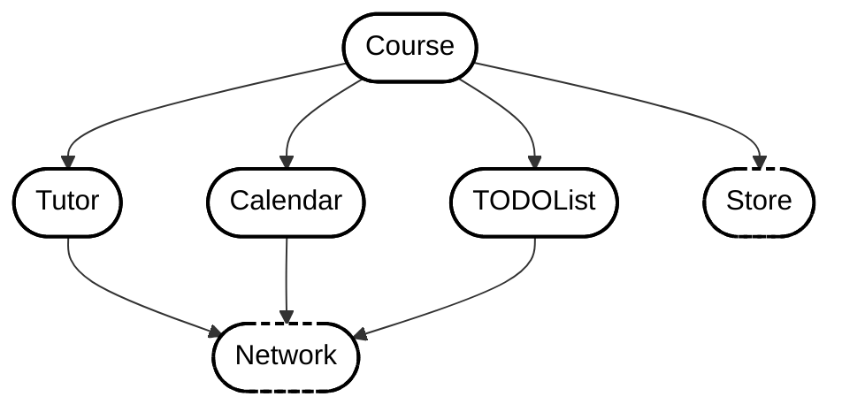
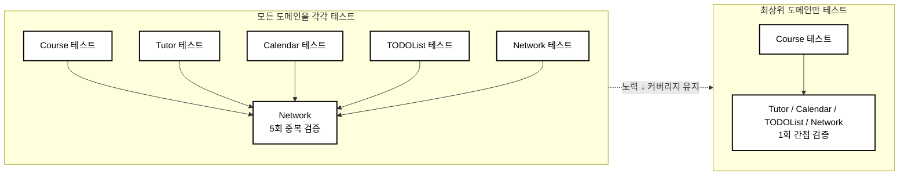
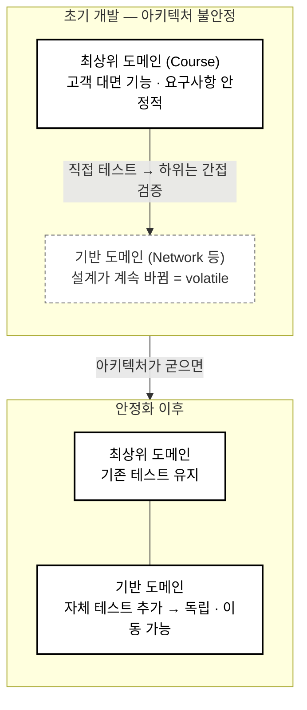
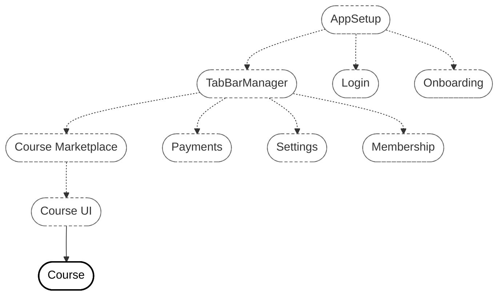
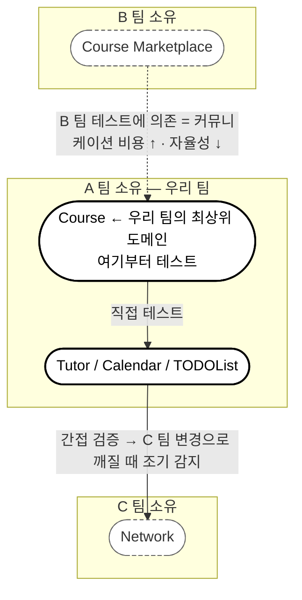
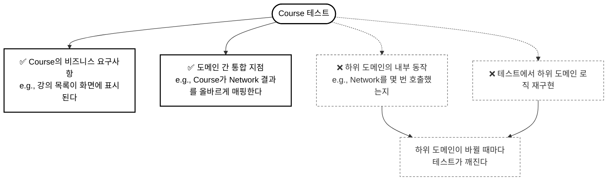

# Cross-Domain Testing: Testing More With Less Effort

### 중복된 테스트 표면 피하기 (Avoiding a redundant testing surface)

- 이전 챕터의 테스트 전략을 그대로 유지한다면 가장 아래 계층인 Network에서 네트워킹 관련된 최소 부분만 mocking할 것이다.
- 만약 우리가 모든 도메인에 대해서 테스트 코드를 작성하면 Network는 5번, 중간 컴포넌트들은 2번 이상 테스트될 것이다.
- 이는 효율적이지 않기 때문에 가장 최상위 도메인인 Course를 테스트함으로써 다른 도메인도 간접적으로 테스트하는 것이 효율적이다.

### 가장 중요한 도메인은 최상단에 있다 (The most important domain lives up top)

- 가장 최상위에 존재하는 도메인(Course)이 가장 중요한 도메인이다.
- Course는 Todo를 관리하고, Tutor 데이터를 관리하는 등 필요한 모든 로직을 가지고 있다.
- 다른 도메인을 테스트하지 않아야 한다는 것은 아니지만, 가장 먼저 테스트할 것을 찾을 때 최상위 도메인을 고르는 것이 최선의 선택이다.

### 변동성이 큰 코드를 경계하라 (Be aware of volatile code)

- 초기 개발 때는 요구사항이 제대로 정립되어 있지 않기 때문에 최상위 기능보다 Network와 같은 하위 레이어가 변하는 경향이 있다.
- 모킹을 남발하지 않고 상위 도메인을 직접 테스트하면 하위 도메인은 간접적으로 테스트된다.
- 초기에 하위 도메인 테스트를 촘촘히 짜두면, 설계가 바뀔 때마다 테스트도 계속 고쳐야 해서 이는 병목 구간이 된다.
- 시간이 지나면 하위 레이어도 테스트 코드가 필요하지만, 처음에는 최상위 도메인에 우선순위를 두는 것이 좋다.

### 클래스도 도메인과 같은 방식으로 생각하라 (Reason about classes the same way as you do with domains)

- 클래스 수준에서도 public 메서드를 테스트함으로써 간접적으로 private 메서드를 테스트해야 한다.
- private 메서드를 테스트하지 않음으로써 두 가지 이점을 얻을 수 있다.
    - 이미 간접적으로 테스트되기 때문에, private 메서드가 동작함을 보장하기 위해 더 적은 테스트를 작성해도 된다.
    - private 메서드가 변경될 때마다 테스트 코드를 변경하지 않아도 된다.

### 기반 도메인은 그다음 우선순위로 테스트하라 (Test the foundational domains as the next priority)

- 시간이 지남에 따라, 이상적으로는 모든 도메인이 테스트되어야 한다.
    - 도메인 혼자서도 자립자족할 수 있고, 나중에 모듈이나 라이브러리로 추출하기도 쉬워진다.
- 위에서부터 테스트할지 밑에서부터 테스트할지 고려해라.
- 이는 조직의 성격에 따라 달라지는데, 만약 SDK를 제공하는 회사라면 public API를 테스트하는 것이 중요할 것이며,
- 여러 팀 간에 많은 모듈을 가지고 있다면 상위, 하위 도메인 모두 테스트함으로써 안정성을 보장하는 것이 중요하다.

### 하위 도메인을 나중에 테스트할 때의 트레이드오프 (Trade-offs when testing lower domains later)

- 상위 도메인을 통해서만 하위 도메인을 간접 테스트하면 결합도 문제를 발생시킨다.
    - 현재 Course를 통해서 Network를 간접 테스트하는 상황에서, 만약 Course가 오프라인만 지원하게 된다면 간접 테스트 또한 사라진다.
- 하위 도메인에 자체 테스트가 작성되어 있다면, 이를 기능이나 폴더, 새로운 모듈로 분리해낼 수 있다. 또한 특정 기능에 의존하지 않고 독립적으로 진화할 수 있다.
- 단위 테스트를 만들지 말라는 것이 아니다. 타이밍의 문제이다. 처음에는 하위 도메인에 대한 테스트가 우선순위가 아니다.

### 더 큰 앱에서의 도메인 (Domains in a larger app)

- 실제 앱은 예시로 둔 의존성 그래프보다 훨씬 복잡하다.
- 실제로는 Course가 최상위 도메인이 아닐 수 있다. 다른 팀이 Course Marketplace 도메인을 가진다면 해당 도메인을 테스트함으로써 (Course를 mocking 하지 않는다면) Course도 간접적으로 테스트된다.
- 하지만, 다른 팀이 간접적으로 테스트하는 것에 의존하면 커뮤니케이션 비용이 늘어나고 팀의 자율성이 훼손된다.
- 추천 방안은 팀이 책임지고 있는 가장 최상위 도메인을 먼저 테스트하는 것이다.

#### 우리가 "최상위" 도메인에서 일할 때 (When we are working in the "highest" domain)

- 만약 최상위 도메인을 관리하고 있는 팀이라면 각 팀이 각자의 도메인을 책임지고 있는 상황이라도
- 최상위 도메인을 테스트함으로써 하위 도메인도 간접적으로 테스트해야 한다.
    - e.g., Network 팀의 업데이트로 Course가 깨질 경우, 상위 도메인의 테스트로 이를 조기에 감지할 수 있다.

#### 도메인은 자기 자신의 기능에만 책임을 진다 (Domains are only responsible for their own functionality)

- 하위 도메인을 활용해 상위 도메인을 테스트할 때, 하위 도메인의 내부 동작까지 상위 도메인이 검증하는 중복을 경계해야 한다.
    - e.g., Course가 데이터를 네트워크로부터 2번 로드하는지 테스트
- 하위 도메인의 내부까지 상위 도메인이 검증하면 하위 도메인이 변경될 때 테스트가 깨지게 된다.
- 도메인은 자기 자신의 비즈니스 요구사항만 테스트한다. 다른 도메인의 내부 동작까지 테스트하는 것은 그 도메인의 책임이 아니다.

### 정리 (What we covered)

#### 최대 효율을 위한 테스트 전략 (Testing strategy for maximum efficiency)

- 하위 도메인까지 간접적으로 테스트하기 위해 최상위 도메인을 테스트하라
- 가장 적은 노력으로 많은 커버리지를 가지는 도메인을 테스트하는 데 집중하라
- 아키텍처가 안정화될 때까지 기반 코드는 테스트 작성을 미뤄라
- 많은 도메인을 피상적으로 테스트하기보다는 하나의 도메인을 철저하게 테스트하라

#### 도메인 책임과 경계 (Domain responsibility and boundaries)

- 하위 도메인의 내부가 아닌 테스트하고자 하는 도메인의 요구사항과 기능만 테스트하라
- 하위 도메인이 자신의 책임을 다할 것임을 신뢰하라. 버그는 다른 도메인에서 임시방편으로 수정하지 말고 원인 제공처에서 수정하라
- 테스트에서 하위 도메인 로직을 재구현하기보다 도메인 간의 통합 지점에 집중하라
- 다른 팀이 자신들의 도메인을 업데이트할 때마다 깨지는 변경 대응용 테스트를 피하라

#### 테스트 범위와 메서드 선택 (Testing scope and method selection)

- private 메서드를 간접적으로 테스트하기 위해 public/internal 메서드를 테스트하라
- 불필요한 모킹을 피하고 현실적인 통합 커버리지를 확보하기 위해 시스템 전반의 테스트를 활용하라
- 실패했을 때 가장 치명적인 도메인의 테스트를 우선시하라
- 팀 역학 관계를 고려하여, 다른 팀이 소유한 도메인이 아닌, 팀의 가장 상위 도메인을 테스트하라

#### 초기 개발에서의 변동성 관리 (Managing volatility in early development)

- 초기 개발 중에는 기능보다 기반 코드가 더 많이 변경된다는 점을 인지하라
- 실험적인 아키텍처 구성 요소를 테스트하기 전에 안정적이고 고객과 직면하는 기능을 먼저 테스트하라
- 버려지거나 대대적으로 리팩토링될 가능성이 높은 코드에 대한 과도한 테스트를 피하라
- 철저한 테스트와 개발 속도 사이에서 균형을 잡아라

#### 팀과 도메인을 넘어선 테스트 확장 (Scaling testing across teams and domains)

- 팀 경계 간의 통합 문제를 감지하기 위한 안전망으로 상위 레벨 테스트를 활용하라
- 내 코드를 테스트하는 것과 통합 테스트를 다른 팀에 의존하는 것을 구분하라
- 언젠가는 자체 테스트 코드를 추가하여 기반 도메인은 독립적이고 이동 가능하게 만들어라
- 각 도메인이 자체 테스트를 가지는 것을 장기 계획으로 세우되, 처음에는 전략적으로 우선순위를 정하라
