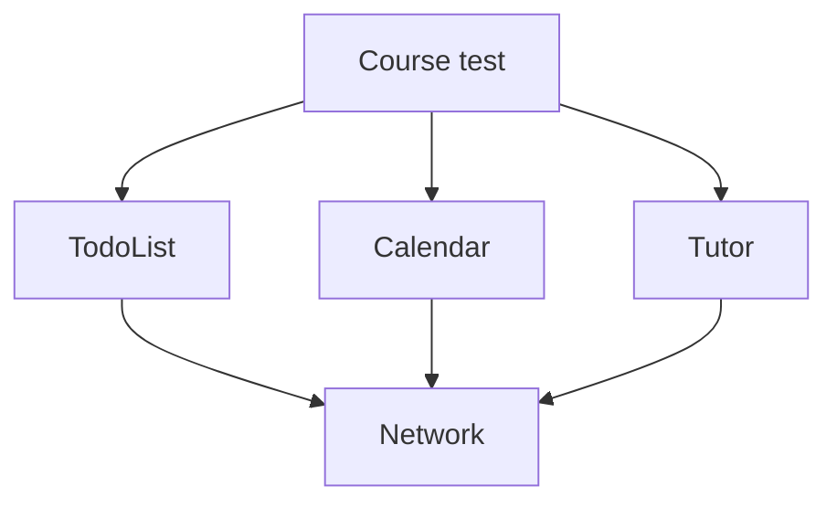
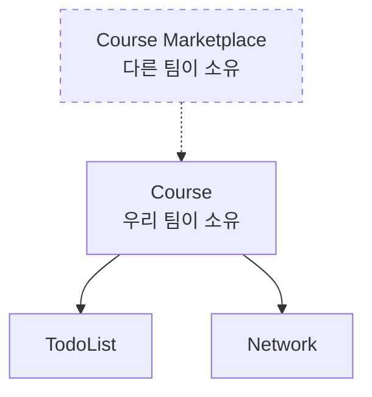

# [WEEK 11] Book 0 Chapter 6
📖 Mobile System Design 0. From Briefings to System Architecture  

 

## 6. Cross-Domain Testing: Testing More With Less Effort
> 모든 domain을 같은 깊이로 test하기보다 팀이 맡은 가장 높은 domain부터 검증한다. 그러면 적은 test로 더 넓은 동작을 확인할 수 있다.

### Avoiding a redundant testing surface

system-wide test에서는 하위 domain을 mock하지 않고 실제 코드로 연결한다. 네트워크 호출처럼 외부와 맞닿은 부분만 대체한다.  

이 구조에서 모든 domain을 따로 test하면 같은 하위 코드가 반복해서 검증된다. 예를 들어 `Network`는 자신의 test에서 한 번 검증된다. `Course`와 `TodoList`와 `Calendar`와 `Tutor`의 test에서도 간접적으로 다시 검증된다.  

| 대상 | 직접 test | 상위 domain을 통한 검증 |
| --- | --- | --- |
| `Network` | 1회 | `Course` / `TodoList` / `Calendar` / `Tutor`에서 간접 검증 |
| `TodoList` | 자체 test | `Course`에서 간접 검증 |

따라서 새 기능을 전달하는 초기 단계에서는 가장 높은 `Course`부터 test하는 편이 효율적이다. `Course`를 test하면 하위 domain의 연결도 함께 확인할 수 있다.

---

### The most important domain lives up top

현재 개발 단계에서 가장 먼저 test할 대상은 팀이 맡은 가장 높은 domain이다. `Course`는 UI가 필요로 하는 비즈니스 동작을 모은다. todo 처리와 tutor 데이터 조회 그리고 일정 관리와 offline storage가 여기에 포함된다.  

상위 domain을 test하면 UI가 사용하는 흐름을 확인하면서 하위 domain도 함께 검증할 수 있다. 내부 구현이 어떻게 생겼는지는 유지보수 범위의 문제이다. 먼저 외부에 드러난 동작이 요구사항대로 작동하는지 확인한다.  

UI도 더 높은 위치에 있지만 UI test는 별도의 제약과 비용이 있다. 그래서 여기서 말하는 우선순위는 UI를 무시한다는 뜻이 아니다. 주어진 범위에서 가장 높은 domain을 먼저 test한다는 뜻이다.  

---

### Be aware of volatile code

무엇이 자주 바뀌는지는 개발 단계에 따라 달라진다.

#### 일반적인 상황
- feature와 UI가 사용자 요구에 따라 자주 바뀐다.
- foundational code는 비교적 안정적이다.

#### 초기 개발 단계
- architecture와 foundational domain이 자주 바뀐다.
- 하위 test를 너무 일찍 만들면 계속 수정해야 한다.

현재처럼 architecture가 자리 잡기 전이라면 상위 feature를 먼저 test한다. 시간이 지나 구조가 안정되면 하위 domain의 직접 test를 추가한다.  

---

### Reason about classes the same way as you do with domains

domain뿐 아니라 class도 같은 방식으로 판단할 수 있다. 외부에서 접근할 수 있는 public 또는 internal method를 test하면 private method는 그 과정에서 함께 검증된다.  

private method마다 test를 만들 필요는 없다. 내부 구현을 바꿀 때마다 test를 고쳐야 하는 `change test`가 생기기 때문이다. 공개된 API의 동작을 유지하는 데 집중하면 내부 method의 개수나 구조는 자유롭게 바꿀 수 있다.  

---

### Test the foundational domains as the next priority

초기에는 상위 domain을 먼저 test하지만 장기적으로는 모든 domain이 자신의 test를 가져야 한다. 각 domain이 스스로 검증되면 다른 domain의 test에 의존하지 않고 독립적으로 움직일 수 있다.  

이런 test는 domain을 library나 framework 또는 module이나 package로 옮길 때 함께 이동한다. 결과적으로 domain의 독립성과 이식성이 높아진다.  

어떤 domain을 먼저 test할지는 팀의 상황에도 달려 있다. SDK를 만드는 팀이라면 public API가 우선이다. 여러 팀이 여러 module을 맡고 있다면 상위와 하위 domain을 모두 검증하는 방식이 더 적절할 수 있다.  

---

### Trade-offs when testing lower domains later

하위 domain의 test를 미루면 상위 domain의 사용 방식이 바뀔 때 검증이 사라질 수 있다. `Course`가 더 이상 네트워크를 사용하지 않게 되면 `Network`와 API를 간접적으로 검증하던 test도 사라지는 식이다.  

하위 domain에 직접 test를 두면 이런 변경과 관계없이 domain을 보호할 수 있다. domain을 다른 feature나 module로 옮길 때도 test가 함께 남아 독립적으로 유지된다.  

따라서 하위 domain test는 필요하지만 항상 가장 먼저 만들 필요는 없다. 초기 feature를 전달한 뒤 architecture가 안정되는 시점에 추가한다.  

---

### Domains in a larger app

실제 app은 `Course`만 있는 graph가 아니다. `Onboarding`과 `Login`이 함께 있고 `TabBarManager`나 `Course Marketplace`처럼 `Course`보다 높은 domain도 있을 수 있다.  

다른 팀이 소유한 더 높은 domain을 test하면 우리 domain을 간접적으로 검증할 수 있다. 하지만 그 방식에만 의존하면 팀 간 소통 비용이 생기고 우리 팀의 자율성도 낮아진다.  

우선 팀이 책임지는 가장 높은 domain을 직접 test한다. 다른 팀의 상위 domain test는 이후 app 전체의 integration을 확인하는 safety net으로 활용한다.  

#### When we are working in the "highest" domain

우리 팀이 `Course`를 담당하고 `Network`와 `TodoList`와 `Calendar`를 다른 팀이 담당한다고 가정한다. 각 팀은 자신의 domain을 직접 test해야 한다. `Course` 팀은 이 domain들이 함께 연결되는 흐름을 test해야 한다.  

각 domain이 따로는 잘 작동해도 함께 사용될 때 문제가 생길 수 있다. 하위 domain의 동작이 바뀌어 상위 기능이 깨지는 경우도 있다. 이때 상위 test는 integration 문제를 알려주는 safety net이 된다.  

문제의 원인이 하위 domain에 있다면 수정도 그 domain에서 해야 한다. 상위 domain에 workaround를 쌓아 해결하면 책임이 흐려지고 구조가 더 복잡해진다.  

#### Domains are only responsible for their own functionality

각 domain은 자신의 요구사항과 기능을 test한다. 하위 domain의 내부 구현은 그 domain이 책임진다.  

`Store`가 디스크 저장을 담당한다고 가정한다. `Course`는 `Store`가 실제로 디스크에 쓰는지까지 test하지 않는다.  

`Course`가 확인할 대상은 자신의 요구사항이다. 예를 들어 course를 네트워크에서 두 번 불러오지 않는지 확인한다.  

`Store`가 메모리 cache에서 local database로 바뀌어도 `Course`의 요구사항이 같다면 `Course` test는 바뀌지 않아야 한다. 다른 domain의 내부 구현을 test하면 변경 때마다 상위 test를 고치는 `change test`가 생긴다.  

> **Android/Compose 적용**  
> feature의 상위 use case나 ViewModel은 repository의 저장 방식보다 feature의 요구사항을 test한다. repository가 실제로 Room에 저장하는지는 repository test가 맡는다.  

---

### Conclusion

가장 높은 domain부터 test하면 짧은 시간에 넓은 범위를 검증할 수 있다.  

장기적으로는 하위 domain도 직접 test해야 한다. 그래야 한 domain의 품질을 다른 domain의 test에만 맡기지 않고 독립적인 module로 옮길 수 있다.  

---

### What we covered

- 팀이 책임지는 가장 높은 domain부터 test한다.
- 적은 test로 넓은 범위를 검증할 수 있는 domain을 우선한다.
- 초기에는 변경 가능성이 큰 foundational code의 직접 test를 늦출 수 있다.
- 각 domain은 자신의 요구사항과 기능을 test한다.
- 하위 domain의 내부 구현을 상위 domain test에 다시 담지 않는다.
- 시간이 지나면 각 domain이 독립적인 test를 갖도록 확장한다.
