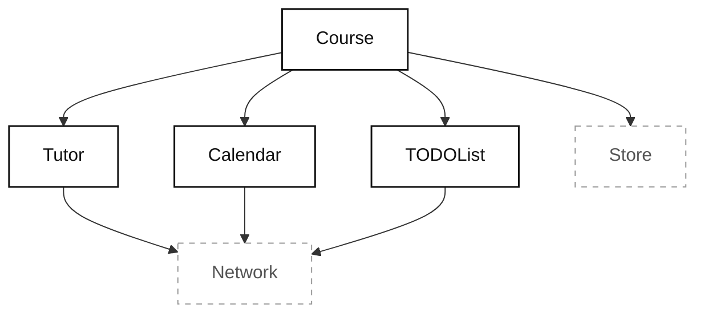
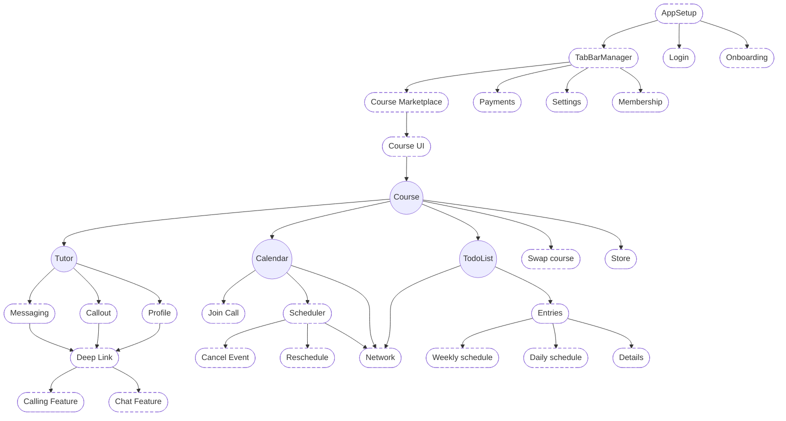

- 압박을 받거나 기한이 촉박한 개발자는 테스트를 짜지 않는 것을 선호한다.
	- 하지만 테스트를 짜지 않는 것은 불안정한 앱을 초래한다.
	- 수동 테스트를 요구하고 최악의 경우 고객이 문제점을 먼저 발견할 수 있다.

- 반대로 `private` 함수까지 테스트해야 한다고 주장하는 개발자도 있다.
	- 이는 팀의 속도를 저해시키고, 추진력을 저하시킨다.

- 도입한 컴포넌트와 도메인을 보면 무엇을 먼저 테스트해야 하는지 혼동이 올 수 있다.
- 일단 첫 번째 목표는 **반복과 변경이 지속되는 초기 환경에서도 변경되거나 삭제되지 않는 테스트를 유지하는 것**이다.
- **테스트를 클래스 수준에서 보는 대신, 한 발 떨어져서 도메인 수준에서 구축해보자.**
	- 그럼 테스트 작성의 시간을 줄일 수 있다.

---

## 중복 테스트 피하기
- 지난 장에서 가장 높은 도메인을 테스트하면 하위 도메인까지 간접적으로 테스트할 수 있다는 것을 배웠다.
	- 이를 활용하면 중복 테스트를 피할 수 있다.

- `Network` 는 최하위 도메인으로, 자신에 대한 테스트는 하나만 있을 수 있다.
	- 하지만 실질적으로는 상위 도메인에 의해 총 네 번이나 호출되며, 이는 간접적으로 테스트된다.

- 그렇다면 현 시점에서 모든 도메인에 대해 테스트할 필요가 있을까?
	- 랜드스케이프에서 최상위 도메인인 `Course` 만 테스트하면, 간접적으로 모든 도메인을 테스트할 수 있다.
	- 테스트가 실패하면 하위 도메인에서 문제가 생겼다는 것을 파악할 수 있다.

- 이는 하나의 도메인 테스트로 모든 것을 테스트할 수 있는 시스템 전반 테스트를 채택하여 얻을 수 있는 혜택이다.
- 언젠간 하위 도메인들에 대한 테스트도 필요해질 수 있다.
	- 하지만 지금은 코드를 새롭게 작성하는 중이다.
	- 빠른 속도를 유지하기 위해 이러한 방식으로 테스트를 진행한다.

## 가장 중요한 도메인은 꼭대기에 산다
- 이전 챕터에서 이미 가장 상위 도메인을 테스트하면 모든 것이 테스트되는 것을 알게 되었다.
- 최상위 도메인은 이미 필요한 기능들 대부분이 구현되어 있는 상태고, 유닛 테스트가 가능한 상태다.
	- 다른 도메인 입장에선 최상위 도메인 내부가 어떻게 구현되어 있는지 전혀 알 필요가 없다.

- **테스트에서 가장 먼저 집중하기 좋은 것은** 최상위 도메인이다.
- 무엇을 먼저 테스트할지 고민될 때마다 스택에서 가장 높은 도메인을 고려해보자.
	- 최상위 도메인을 테스트하면 간접적으로 모든 기능을 테스트할 수 있다.

## 변덕스러운 코드를 의식하라
- 코드를 지나치게 `stub`, 모킹하지 않는다면 최상위 도메인을 직접 테스트하는 것으로 하위 도메인을 충분히 테스트하게 된다.
- 개발 초기 단계에선 코드가 더 변덕스럽다.
	- 아직 디테일을 파악하고 있고, 코드를 많이 뜯어고치는 중이기 때문이다.

- 일반적으로 그래프 하부의 도메인, 즉 기반 코드들은 최상위 도메인에 비해 변화에 덜 노출된다.
	- `Network` 와 같이 네트워크 요청을 담고 있는 코드들은 변화 가능성이 가장 낮다.
	- UI층에 가까운 비즈니스 로직들은 더 자주 바뀐다.

- **그러나 새로운 것을 만들 땐 오히려 하위 도메인들이 변화에 더 노출된다.**
	- 아키텍처는 비즈니스 로직과 달리 개발자들의 온전한 발명품이다.
	- 아키텍처를 성숙하게 만들고 있는 과정이기에, 오히려 기반 로직들이 더 변덕스러울 것이다.

- 첫 버전을 만드는 과정에선 오히려 UI가 더 고정되어 있을 가능성이 높다.
	- 실제 배포가 진행된 후에야 UI가 도메인보다 훨씬 자주 갱신될 것으로 예상하라.
	- UI를 남에게 보여주는 순간, 기능에 대해 새롭고 더 나은 아이디어가 생겨난다.
	- 공개 배포 후엔 팀이 사용자의 피드백과 데이터를 모으고 다시 더 많은 UI와 기능 변경이 촉발된다.

- 고로 초기 단계에선 최상위 도메인을 테스트하는 편이 낫다.
	- 하위 도메인을 테스트하면 변경 위험이 더 크고, 테스트를 버리면서 시간을 버릴 가능성이 크기 때문이다.
	- 물론 시간이 지나면 하위 도메인도 테스트하긴 해아한다.

## 클래스도 도메인과 같은 방식으로 추론하라
- 최상위 도메인을 테스트함으로써 하위 도메인을 간접 테스트한다.
- 클래스 수준 관점에서도 동일하게, **"`public` 메소드를 테스트함으로써 `private` 메소드를 간접적으로 테스트"** 할 수 있다.
	- `public` API가 제대로 동작한다면, 내부의 `private` 메소드가 어떻게 구성되어 있는지 알 필요가 없다.

- `private` 메소드를 테스트하지 않으면 다음 이점들을 누릴 수 있다.
	1. `private` 메소드가 동작하는지 확인하려고 테스트를 쓸 필요가 없다. 간접적으로 테스트되기에.
	2. `private` 메소드 하나를 바꿨다고 테스트를 갱신해야 하는 "변경 테스트" 가 필요 없어진다.

- `internal` 과 `public` 메소드를 테스트함으로써, 산더미같은 테스트 코드를 고쳐야하는 후폭풍없이 편안하게 클래스 내부를 고칠 수 있다.
- 그저, `public` API를 테스트하여 안정적으로 유지되는 것만 보장하면 안전하다.

## 다음 우선 순위는 기반 도메인 테스트
- 어떤 도메인을 먼저 테스트할지 영리하게 골라야 한다.
	- 계속 다뤘듯이 랜드스케이프의 최상위 도메인 테스트에 집중하면, 더 적은 코드로 더 많이 테스트할 수 있다.

- 시간이 지나면 이상적으론 모든 도메인이 테스트가 된 상태여야 한다.
	- 도메인이 더 자급자족하게 되면서, 라이브러리나 모듈로 추출하기도 쉬워진다.

- 일상 업무에서 어떤 도메인을 테스트하는게 최선일지 생각해보라.
	- 높은 도메인이 기반 도메인을 간접 테스트해주는 것으로 무엇을 커버할 수 있는가?

- 조직과 여력에도 좌우된다.
	- SDK를 출시하는 팀이라면 `public` API 가 가장 중요한 테스트 대상이다.
	- 그러나 두 팀에 걸쳐 모듈 열 개를 소유한다면, 높은 도메인과 낮은 도메인 모두 테스트하여 안정성을 보장해야 한다.

## 하위 도메인을 나중에 테스트할 때의 트레이드오프
- 최상위 도메인을 통해 기반 도메인들을 간접 테스트하는 것에도 트레이드오프는 존재한다.
	- `Network` 를 호출하다가 갑자기 로컬 데이터를 사용하는 것으로 전환되면, 그 순간 `Network` 에 대한 간접 테스트가 사라진다.
	- `Network` 를 호출하는 다른 기능들이 간접적으로 잘 테스트하길 빌어야 한다.

- 반면 `Network` 에 딸린 테스트가 존재한다면, 언제든 완전한 모듈로 전환할 수 있다.
	- 네트워킹 레이어를 성숙하게 만들고, 독립적이며 언제든 다른 앱으로 이식 가능하게 만든다.

- 유닛 테스트를 더하는 것은 절대 나쁜게 아니다.
	- **다만, 순서를 의식하라는 것이다.**
	- 초기 단계에선 최우선이 아닐 수 있더라도, 머지않아 반드시 제공해야 한다.

## 더 큰 앱에서의 도메인

- 현재 책에서는 위와 같이 미니사이즈의 랜드스케이프를 가지고 있다.
	- 하지만 더 큰 앱에서는 `Course` 상위에 아주 많은 도메인이 존재할 것이다.
	- 즉, 훨씬 더 큰 그래프가 그려진다는 것이다.

- 이 경우 이론적으로는 `Course` 위의 도메인을 테스트할 수 있다.
	- 그럼 `Course` 를 간접적으로 테스트하게 되니, 직접 테스트할 시간을 아낄 수 있을 것이다.

- 충분히 사용할 수 있는 전술이지만, 위로 나아갈수록 팀의 이해관계가 끼어들게 된다.
	- **즉, 우리 코드의 테스트를 다른 팀에 의존하게 되는 것이다.**
	- 소통 비용이 증가하고 팀 자율성이 사라지는 문제이므로 좋은 접근이라고 할 순 없다.

- **권장하는 것은 우리 팀이 책임지고 있는 가장 높은 도메인을 먼저 테스트하는 것이다.**
	- 시간이 지나면 다른 팀들의 통합 테스트가 `Course` 의 동작을 한 번 더 검증해줄 것이다.
	- 그러나 `Course` 를 책임지는 것은 우리팀이기에, 테스트 역시 `Course` 중심으로 짜는 것이 바람직하다.

### 우리가 "가장 높은" 도메인에서 일할 때
- 우리가 가장 높은 도메인을 다루는 팀이라면, 어쨌든 하위 도메인에 대한 테스트는 각 팀에게 맡길 수밖에 없다.
	- **하지만 최상위 도메인에 대한 책임은 여전히 우리에게 있다.**

- 각 팀이 자기 도메인을 테스트하더라도, 최상위 도메인을 테스트하여 하위 도메인을 간접 테스트하는건 여전히 가치있다.
	- 모든 도메인이 만나는 **통합 지점**을 테스트할 수 있기 때문이다.
	- 각 도메인이 따로는 훌륭하게 동작해도, 통합 지점에선 그렇지 않을 수 있다.

- **버그는 언제, 어디서든 틈새로 빠져나갈 수 있다.**
	- `Network` 가 미묘하게 동작을 변경한 후, 상위 도메인인 `Course` 에서 오류가 나는 것이 그 예다.
	- 최상위 도메인을 테스트하고 있다면 이런 미묘한 변화들을 감지해 버그로부터 우리를 지킬 수 있다.
	- 시스템 전반 테스트에선 상위 도메인의 테스트가 하부 도메인들의 안전망 역할을 할 수 있다.

### 도메인은 자기 기능에만 책임이 있다
- 하위 도메인을 활용하여 상위 도메인을 테스트할 때 위험 중 하나는, **하위 도메인이 이미 테스트하고 있는 것을 상위 도메인에서 똑같이 테스트하는 것이다.**
	- 중복 테스트와 흐릿한 책임 소재를 끌어안게 된다.

- **상위 도메인의 소유자들은 하위 도메인들이 맡은 바 일을 잘 하고 있을 것이라고 믿어야 한다.**
	- 예를 들면 하위 도메인이 데이터를 불러올 때 네트워크 호출인지, 로컬 데이터 호출인지, 불필요하게 두 번 세 번 호출하고 있는지는 알 필요가 없다는 것이다.
	- **오로지 자기 자신의 기능과 요구사항만 테스트하면 된다.**

- 당연히 하위 도메인에서 네트워크 호출에서 로컬 DB 를 통해 데이터를 불러온다고 하더라도 상위 도메인에 영향이 가선 안된다.
	- 그렇지 않으면 하위 도메인에 변경이 발생할 때마다 상위 도메인의 테스트를 고쳐야할 것이다.

- **도메인은 자기 자신의 요구사항을 테스트한다.**
	- 다른 도메인의 내부를 테스트하는 것은 그 도메인의 책임이 아니다.

## 마치며
- 올바른 도메인에 집중하여 더 적은 노력으로 더 많이 테스트하는 법을 배웠다.
	- 최상위 도메인을 테스트하여 하위 도메인들을 간접 테스트한다.
	- 이 접근은 가장 짧은 시간에 가장 많은 테스트 커버리지를 부여한다.

- 그러나 시간이 지나면 그 하부 도메인들도 각자 테스트되길 원하게 된다.
	- 각 도메인이 자신의 테스트를 갖게 되면 도메인 간의 테스트 의존성이 줄어들게 된다.
	- 또한 도메인을 별도 모듈화하는 것도 쉬워져 이식성이 좋아진다.

- 어느 접근을 선호하든 어떤 도메인을 우선적으로 테스트할지 생각해보자.
	- 특히 시간에 쫓기면서도 탄탄한 품질 보증이 필요하다면 더더욱 잘 생각해보아야 한다.
