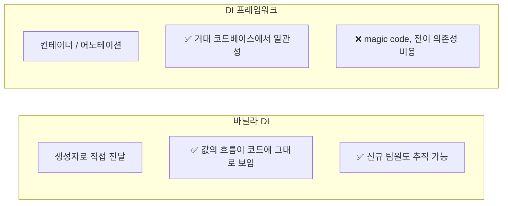
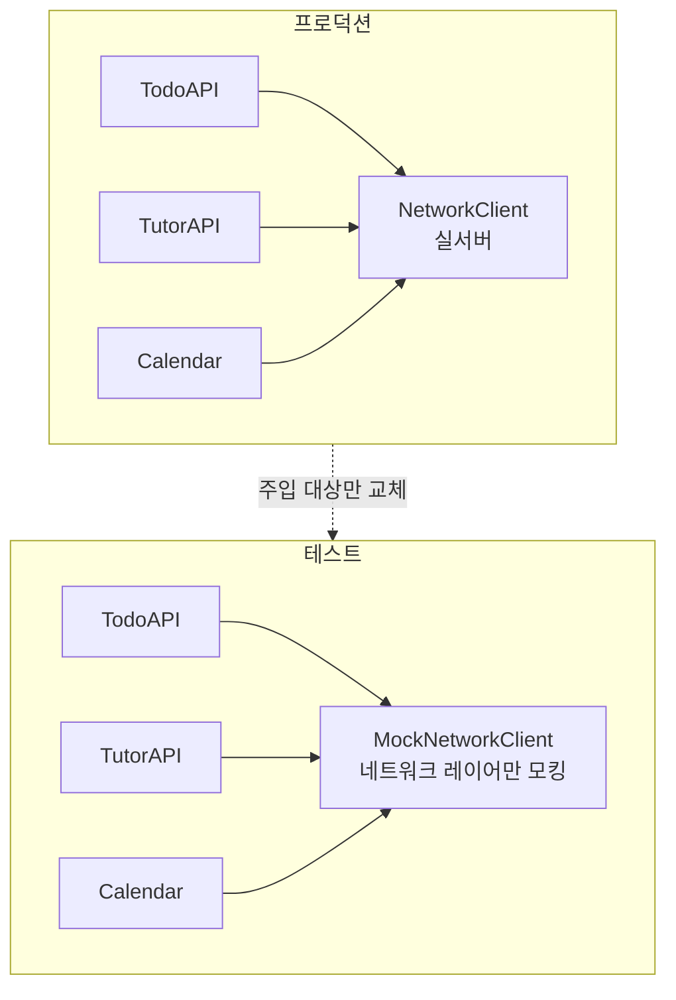
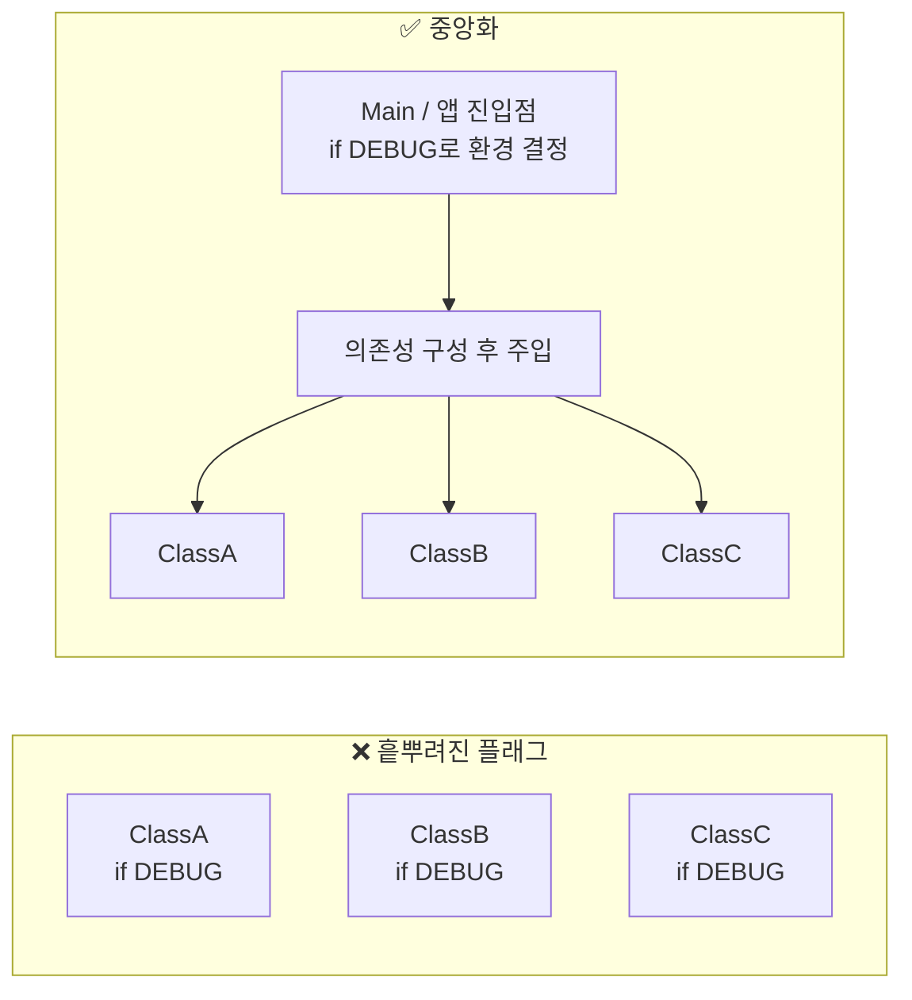
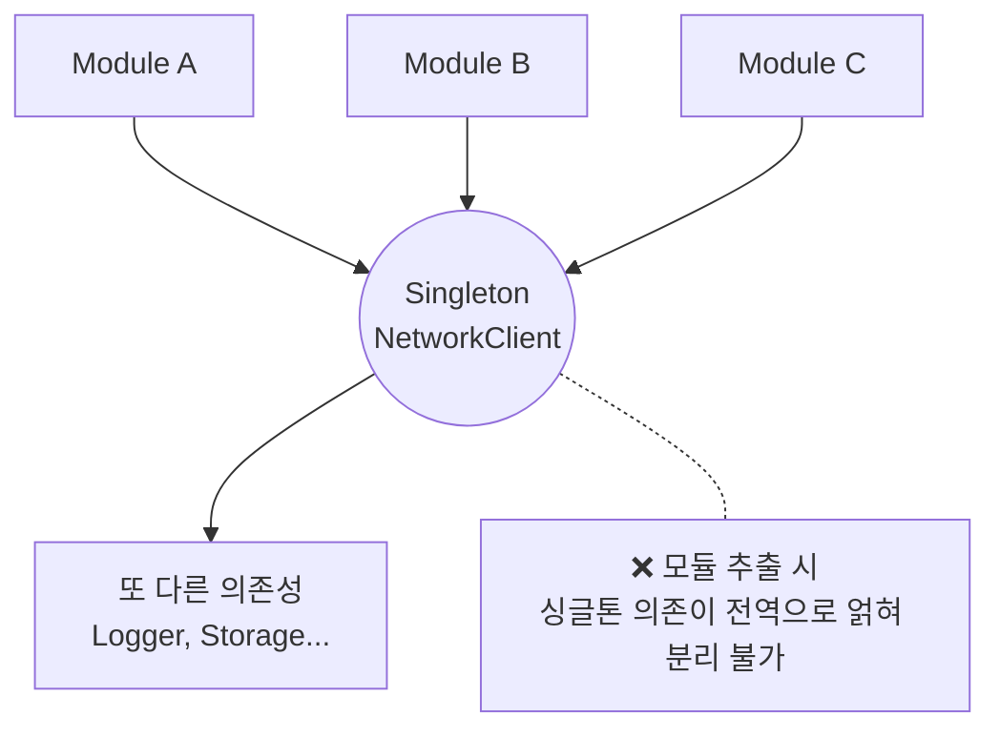
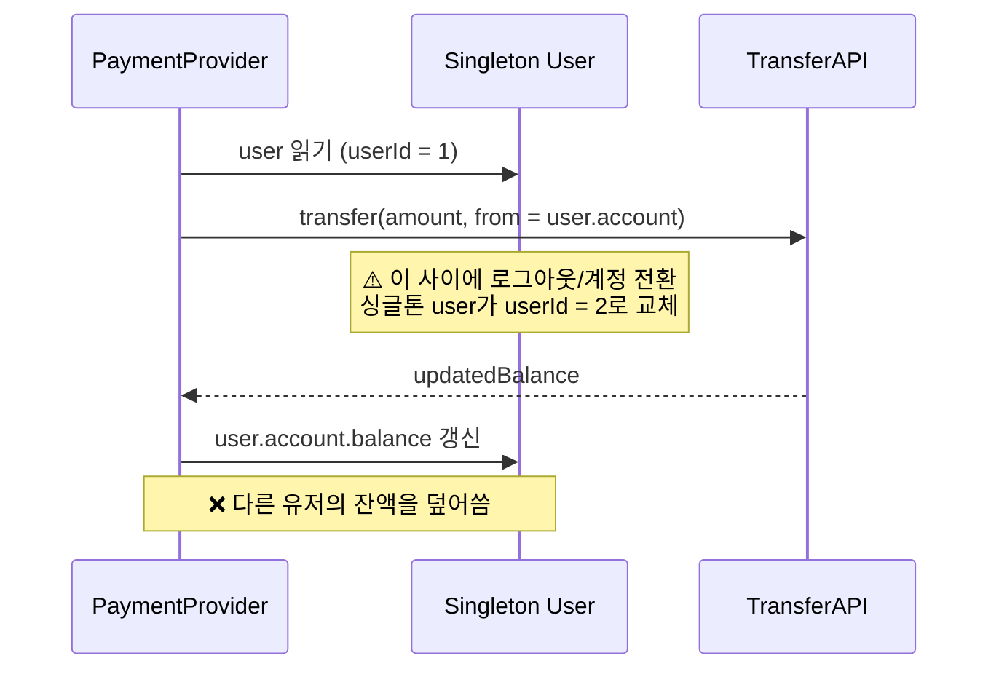
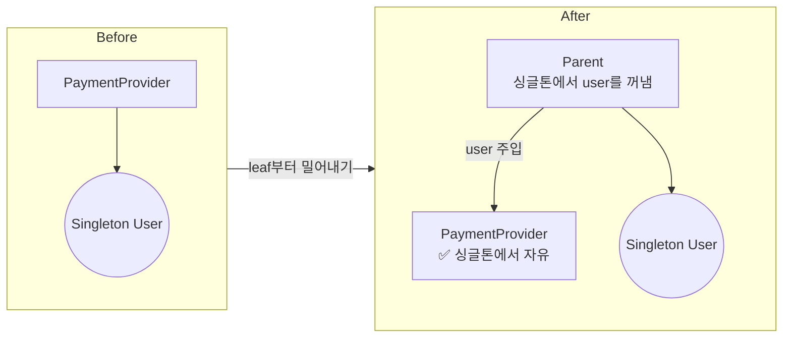
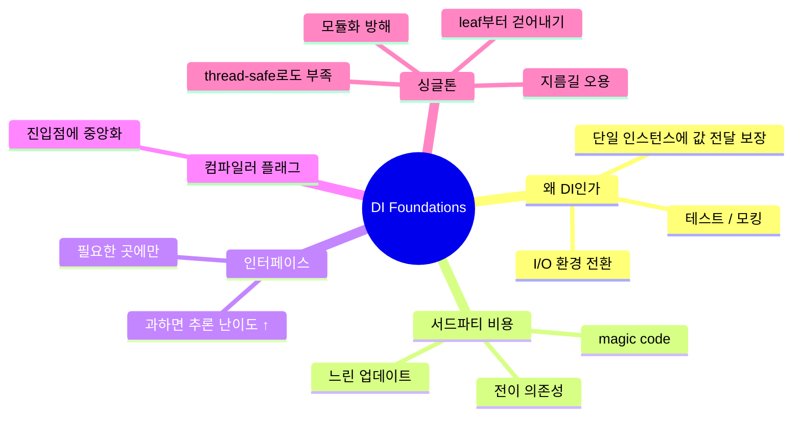

# 의존성 주입의 기초 (Dependency Injection Foundations)

### 바닐라 코드 vs 서드파티 프레임워크 (Vanilla code versus third-party frameworks)



- DI 프레임워크를 쓰지 않으면 값이 어떻게 전달되는지 코드만 보고 추적할 수 있어, 처음 합류한 팀원도 파악하기 쉽다.
- 거대한 코드베이스를 다루거나 팀의 DI 솔루션을 하나로 통일해야 한다면 프레임워크 도입을 고려할 만하다.

#### 서드파티 솔루션의 비용 (The cost of third-party solutions)

- 단순히 트렌디하다는 이유로 프레임워크를 도입해 복잡성을 올려서는 안 된다.
- 도입 전 체크리스트
    - 새 OS / 플랫폼 업데이트를 따라가고 있는가?
    - 열려 있는 이슈 중 심각한 것이 있는가?
    - 여러 사람이 유지보수에 참여하고 있는가?
- 서드파티가 또 다른 서드파티에 의존하는 **전이 의존성(transitive dependency)** 이슈도 확인해야 한다.
    - e.g., 전이 의존성 라이브러리가 아직 최신 언어 버전을 지원하지 않아, 앱 전체 업데이트가 그 라이브러리를 기다려야 하는 상황

### 애초에 DI가 왜 필요한가 (Why we need dependency injection in the first place)

- Holistic-Driven Development에서 다룬 `CourseService`를 떠올려보자. DI 없이 구현하면 필요한 프로퍼티를 전부 클래스 내부에서 직접 생성하는 형태가 된다.
- 이렇게 하면 동작은 하지만, **여러 환경(프로덕션 / 스테이징 / 테스트)** 을 지원할 수 없다. 환경 전환을 위해 DI가 필요하다.

### 테스트와 모킹 (Testing and mocking)



- 테스트는 DI를 도입하는 가장 큰 이유다. 테스트 중에 프로덕션 서버에 연결되길 원하지 않기 때문이다.
- System-wide Testing 사례에서도 TodoAPI, TutorAPI, Calendar가 프로덕션 서버를 쓰지 않도록 **네트워크 통신 부분만** 모킹했다.
- 이를 통해 서로 다른 서버에 연결하는 등 환경을 쉽게 바꿀 수 있다.

#### DI, 테스트, 그리고 인터페이스 (Dependency injection, testing, and interfaces)

- 테스트를 위해 인터페이스를 도입하면 그에 따른 비용이 따른다.
- 환경마다 구현체를 바꾸려 하면 인터페이스 개수가 늘어나며 복잡도가 상승한다.
- 따라서 **필요한 곳에만 부분적으로** 인터페이스를 도입하는 것을 권한다.

#### 인터페이스의 목적은 한눈에 드러나지 않는다 (The purpose of an interface isn't instantly clear)

- 타인이 작성한 인터페이스는 처음 봤을 때 어떤 목적으로 만든 것인지 알기 어렵다. — 테스트? 다형성? SOLID 준수?
- 실제 런타임에 바인딩되는 구현 로직을 찾으려면 한 단계 더 탐색해야 한다.
- 추상화 레이어가 여러 겹이면 버그를 찾는 시간도 길어진다.
- 정말 필요한 상황이 아니라면 구체 타입을 사용해, 실제 실행되는 코드 로직을 바로 파악할 수 있게 하는 편이 좋다.

### 컴파일러 플래그와 환경 (Compiler flags and environments)



- DI를 통해 프로덕션이 아닌 다른 서버 환경으로 쉽게 전환할 수 있다.
- DI 없이도 단순한 컴파일러 플래그(e.g., `BuildConfig.DEBUG`)만으로 환경을 바꿀 수는 있다.
- 하지만 필요할 때마다 필요한 곳에 플래그를 선언하면 코드베이스가 지저분해지고, 어떤 환경에서 동작하는지 코드로 추론하기 어려워진다.
- 이러한 컴파일러 플래그는 **한 곳에 모으는 것**이 더 좋은 방안이다.

### 싱글톤, "인스턴스가 하나뿐이라면?" (Singletons, or "What if there's only one instance of something?")

- DI를 쓰는 또 다른 이유는 클래스 인스턴스가 불필요하게 새로 생성되는 것을 막기 위해서다.
- 각각의 클래스가 `NetworkClient` 인스턴스를 새로 만든다면, 결국 모두 같은 서버에 연결되고 같은 문제를 각자 다뤄야 한다.
- 싱글톤을 쓰면 DI가 간단해지지만, 버그와 부작용도 함께 따라온다.

#### 싱글톤 설정하기 (Setting up a singleton)

- `NetworkClient`를 싱글톤으로 만들어두면, 사용하는 클래스는 DI 없이 직접 가져다 쓰기만 하면 된다.
- 필요에 따라 환경 세팅 메서드만 한 번 호출해주면 끝이다.
- 가장 편리한 방법이지만, 동시에 **오용되는 가장 큰 이유** 중 하나다.

#### 싱글톤은 지름길로 오용된다 (Singletons are often abused as shortcuts)

- 클래스 수준에서 보면 싱글톤은 "어떤 값이 전달되었는지"를 감춘다.
- 다만 큰 규모의 앱에서는 싱글톤이 없더라도 의존성 정보가 컨테이너에 있어, 전달된 값을 명확히 보기 어려운 것은 마찬가지다.
- "인스턴스가 하나뿐이니 싱글톤이 낫다"는 주장은 **영원히 하나일 것이라는 착각**이다. 기술 부채가 쌓여 나중에 큰 문제가 된다.
- 조금의 노력만 들이면 싱글톤의 위험을 피하면서 DI 솔루션을 도입할 수 있다.

#### 미래의 문제를 미리 푼다는 것 (Solving problems for the future)

- 보통 미래의 문제를 미리 고려하는 것은 오버 엔지니어링이지만, 싱글톤 문제는 다르다.
- 싱글톤을 "주입 가능한 여러 인스턴스"로 바꾸는 작업은 **애플리케이션 전체**에 영향을 준다.
- 기존 싱글톤을 제거하고 DI를 소급 적용한 뒤, 문서화하고 팀이 익숙해지기까지 많은 비용이 든다.

#### 싱글톤은 모듈화를 방해한다 (Singletons hinder modularization)



- 모듈화를 시도할 때 싱글톤은 앱 전역에서 참조되고 있어 분리가 쉽지 않다.
- 싱글톤을 전부 제거하더라도, 그 객체가 또 다른 의존성을 가지고 있다면 문제는 더 복잡해진다.

#### 모듈 간에는 값을 전달하라 (Passing values across modules instead)

| 방법 | 설명 | 평가 |
| --- | --- | --- |
| 싱글톤을 별도 모듈로 분리 | 다른 모듈들이 그 모듈에 의존 | 가장 쉽지만 깔끔하지 않음 |
| 하위 계층으로 이동 | `NetworkClient` 같은 하위 계층으로 옮김 | 중간 |
| 값 전달 | 상위 계층이 필요한 값만 하위로 전달 | ✅ 가장 좋음 |

#### 싱글톤, 스레드 안전성, 전역 상태 (Singletons, thread safety, and global state)

- 적절한 동기화 메커니즘이 없으면 여러 스레드가 동시에 인스턴스를 수정해 **race condition**을 유발한다.
- 유저 간 송금 메서드 안에서 비동기 호출을 한다면, 그 사이에 전역 상태가 다르게 바뀔 수 있다.
- 사용자가 늘고 앱 규모가 커질수록 버그의 원인이 된다.

#### 스레드 안전한 싱글톤만으로는 부족하다 (A thread-safe singleton is not enough)



- 동기화 메커니즘으로 싱글톤 자체를 thread-safe 하게 만들 수는 있지만, 그것만으로는 충분하지 않다.
- 두 클래스가 동시에 유저의 성과 이름을 바꾼다면, A 연산의 성과 B 연산의 이름이 섞이는 데이터 무결성 문제는 막을 수 있다.
- 하지만 결제 시나리오로 가면, **거래가 진행되는 동안 유저 자체가 언제든 교체**될 수 있다.
- 즉 `User`를 thread-safe 하게 만들면 데이터 무결성은 지킬 수 있어도, **결제라는 맥락에서는 여전히 안전하지 않다.**

#### 싱글톤 의존성 제거하기 (Removing a singleton dependency)

- 앞선 결제 시나리오는 몇 가지 접근으로 해결할 수 있다.
    - 결제 시작 시점의 `userId`와 종료 시점의 `userId`가 일치하는지 검증한다.
    - 아예 `User` 자체를 파라미터로 넘겨서 멀티스레딩·동기화 문제를 회피한다.

```kotlin
class PaymentProvider(
    private val transferAPI: TransferAPI
) {
    /**
     * Transfer money to an account
     *
     * @param amount Amount in cents
     * @param user The user to transfer money from
     * @param targetAccount The target account to transfer to
     */
    suspend fun transferMoney(amount: Int, from: User, to: Account) {
        // 넘겨받은 유저의 계좌에서 이체 실행
        val updatedBalance = transferAPI.transfer(
            amount = amount,
            from = from.account,
            to = to
        )
        // 동일한 유저의 계좌 잔액 업데이트
        from.account.balance = updatedBalance
    }

    // ... snip
}
```

- 싱글톤 `user`에 무슨 일이 생기든, 이 메서드는 **로컬 범위의 유저**만 갱신한다.
- 싱글톤을 점진적으로 걷어내는 방법은 하위 클래스에서 바깥쪽으로 밀어내는 것이다.



1. `PaymentProvider`에서 싱글톤을 직접 참조하던 코드를 지우고 파라미터로 주입받게 한다.
2. 해당 클래스의 부모가 싱글톤 유저를 꺼내어 전달하도록 한다.
3. 싱글톤은 여전히 존재하지만, **`PaymentProvider`만큼은 싱글톤에서 자유로워졌다.**

#### 싱글톤이 적합한 경우 (Use cases for singletons)

- 싱글톤은 **오직 하나의 객체만 생성되도록 보장해야 할 때** 좋은 방안이다.
- 캐싱, 파일 스토리지, 로거가 대표적인 예시다.

#### 값을 전달하면 보상이 따른다 (Passing values pays off)

- 특정 상황에서 싱글톤이 유용하더라도, 확실한 이점이 있는 곳에서만 주의 깊게 사용해야 한다.
- 값을 넘기는 방식만으로도 멀티스레딩 문제를 상당 부분 해결할 수 있다.

---

## 정리 (What we covered)



- 앱에서 DI가 쓰이는 주요 목적은 **테스트, I/O, 하나의 인스턴스에 값 전달 보장**이다.
- 의존성을 전달하는 가장 따분해 보이는 방법이, 동료가 이해하기엔 가장 빠른 방법일 수 있다.
- 서드파티 솔루션에는 magic code나 업데이트가 더딘 프레임워크에 의존해야 하는 비용이 따른다.
- 서드파티 솔루션이 또 다른 서드파티에 의존할 때, 그중 하나라도 업데이트가 늦으면 코드베이스 전체에 악영향을 준다.
- 테스트나 의존성 전달만을 위해 인터페이스를 남발하면 코드베이스를 이해하기 어렵게 만든다.

### 컴파일러 플래그 (Compiler flags)

- 코드베이스를 쉽게 추론할 수 있도록 컴파일러 플래그를 **중앙화**하라.
- `Main`과 같은 앱의 시작점이 의존성을 설정하기에 적절한 곳이다.

### 싱글톤 (Singletons)

- 싱글톤은 DI를 깊게 고민하지 않아도 되기에, 의존성을 전달하는 가장 쉬운 방법처럼 여겨지곤 한다.
- 개발자들은 종종 싱글톤을 **지름길**로 오용한다. 도입과 사용이 쉽고, DI에 대한 고민을 미룰 수 있기 때문이다.
- 싱글톤을 스레드에 안전하게 만들어도 충분하지 않다. **싱글톤을 사용하는 코드** 쪽의 스레드 안전성을 위해 여전히 동기화 메커니즘이 필요하다.
- 싱글톤은 모듈화를 방해한다. 모듈로 추출하려면 먼저 모든 싱글톤 의존성을 걷어내야 하고, 결국 뒤늦게 또 다른 DI 솔루션을 도입해야 할 수도 있다.
- 어떤 객체의 인스턴스가 지금 하나뿐이라는 이유만으로 무작정 싱글톤 패턴을 쓰지 마라.
- 하나의 인스턴스라고 해서 **언제나 하나일 거라는 보장은 없다.** 나중에 다중 인스턴스를 지원하도록 교체하는 데는 많은 시간이 든다.
- 싱글톤은 **인스턴스를 하나로 강제해야 할 때** 빛을 발한다. 공유 데이터베이스 인스턴스나 로컬 디스크 파일 쓰기가 대표적이며, 보호 메커니즘이 적용된 하나의 창구로 모이도록 보장해 준다.
- 코드베이스에서 싱글톤을 걷어내는 가장 쉬운 방법은, 위계 구조의 가장 아래 **leaf class부터** 싱글톤을 값으로 전달받도록 개조하고, 의존성 트리를 따라 한 단계씩 상위 계층으로 올라가는 것이다.
