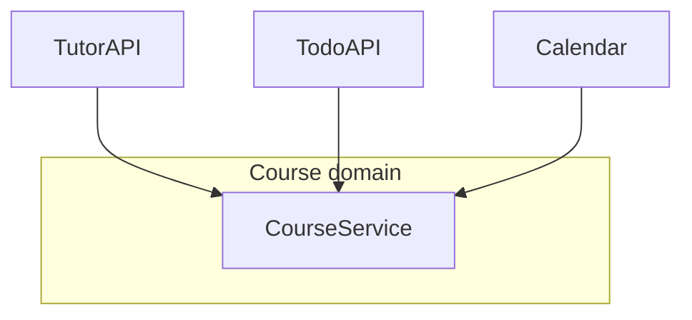
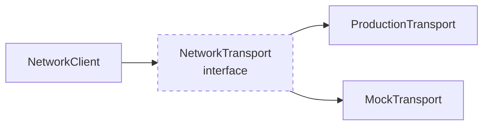
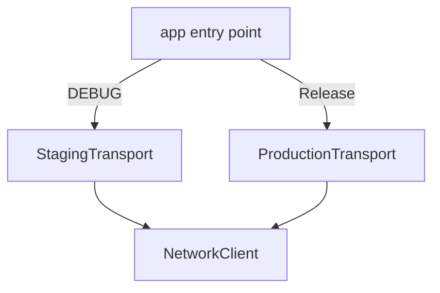
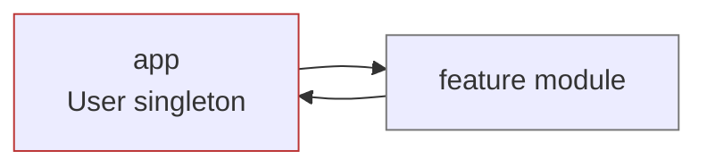
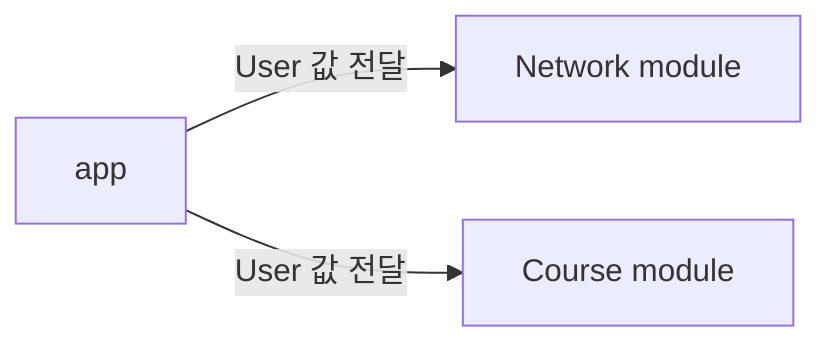

# [WEEK 12] Book 0 Chapter 7
📖 Mobile System Design 0. From Briefings to System Architecture  

 

## 7. Dependency Injection Foundations
> Dependency injection은 거창한 framework보다 필요한 값을 전달하는 일에서 시작한다. test와 환경 전환에는 유용하지만 interface와 singleton을 무조건 늘리면 코드의 이해와 모듈화를 어렵게 만들 수 있다.

### Vanilla code versus third-party frameworks

#### 의존성을 필요한 곳에 직접 전달  
- dependency 흐름이 코드에 드러난다. (값을 어디서 만들고 어디로 전달하는지)  
- 새로운 팀원이 이해하기 쉽다.  
> 가장 단순한 DI  

#### 복잡한 framework
- ex)  custom container나 compile-time code generation
- 별도 규칙을 배워야 한다.
- 문서화와 유지보수 비용이 생긴다.

---

### The cost of third-party solutions

third-party framework를 도입할 때는 구현 속도만 보지 않는다. 다음 비용까지 함께 확인한다.  

- library를 꾸준히 유지보수하는 팀이 있는가
- 새로운 OS와 platform 업데이트를 따라가는가
- 심각한 open issue가 남아 있는가
- app의 build size를 늘리는가
- transitive dependency가 추가되는가

직접 사용하는 library가 안정적이어도 그 안의 dependency가 늦게 업데이트되면 app의 업데이트도 늦어질 수 있다. 편리함이 장기적인 유지보수 비용보다 큰지 판단한 뒤 도입한다.  

---

### Why we need dependency injection in the first place

간단한 code에서는 각 type이 필요한 객체를 직접 만들어도 문제가 크지 않다. 초기 `CourseService`는 `TutorAPI`와 `TodoAPI`와 `Calendar`를 내부에서 직접 생성한다.  

DI가 필요한 대표적인 이유는 세 가지이다.  

- test에서 실제 구현을 다른 구현으로 바꾸기 위해 사용한다.
- staging과 production처럼 실행 환경을 바꾸기 위해 사용한다.
- 여러 객체가 공유하는 인스턴스를 필요한 곳에 전달하기 위해 사용한다.

처음부터 모든 dependency를 주입해야 한다는 뜻은 아니다. 필요한 이유가 생겼을 때 값을 외부에서 전달할 수 있는 구조로 바꾼다.  

---

### Testing and mocking

test에서는 production server에 연결하면 안 된다. 그렇다고 network를 사용하는 모든 type을 mock으로 바꿀 필요도 없다.  

가장 바깥의 network 연결만 주입할 수 있게 만들면 그 위의 실제 code는 그대로 실행할 수 있다. `NetworkClient`가 `NetworkTransport`를 받도록 만들고 실제 transport와 test용 `MockTransport`를 교체한다.  

이 구조에서는 `NetworkClient` 위의 실제 구현도 함께 test할 수 있다. 대상은 `TodoAPI`와 `Calendar`와 `TutorAPI`와 `Course`이다. 같은 방식으로 staging과 production server도 바꿀 수 있다.  

#### Dependency injection, testing, and interfaces

interface를 추가하면
- 구현을 교체할 수 있다.
- interface와 mock을 함께 관리해야 한다.
- 실제 구현 대신 interface를 거치는 코드가 늘어난다.
- production code에 불필요하게 복잡도가 늘어날 수 있다.

interface는 필요한 경계에만 둔다. test 가능성을 높이는 이점과 codebase가 복잡해지는 비용을 함께 본다.  

#### The purpose of an interface isn't instantly clear

interface를 보면 왜 만들었는지 바로 알기 어려울 수 있다. test를 위한 것인지 다른 구현을 지원하기 위한 것인지 확인해야 한다.  

interface type만 보고는 실제로 어떤 구현이 실행되는지도 바로 알 수 없다. editor의 navigation도 concrete type이 아니라 interface 정의로 이동한다. 구현을 찾으려면 다시 사용처와 구현 목록을 확인해야 한다.  

이런 구조는 decoupling에는 도움이 되지만 debugging과 유지보수에는 비용이 된다. interface를 없앨 수 없는 경우도 있지만 특별한 이유 없이 추가하지 않는 것이 좋다.  

---

### Compiler flags and environments

DI를 사용하면 staging과 production처럼 환경에 따라 다른 구현을 전달할 수 있다. 반대로 `NetworkClient` 내부에 compiler flag를 넣어 환경을 직접 선택하게 만들 수도 있다.  

#### compiler flag의 문제
- 여러 type에 flag가 흩어진다.
- 환경별 동작을 추적하기 어렵다.

#### flag 정리 방법
- app 진입점에서 환경을 선택한다.
- 나머지 type은 실행 환경을 알지 못하게 만든다.  

OS version이나 platform 차이처럼 모든 flag를 한곳에 모을 수 없는 경우도 있다. 그래도 환경 선택에 관한 flag는 가능한 한 진입점에 모은다.  

---

### Singletons, or "What if there's only one instance of something?"

여러 type이 같은 `NetworkClient`나 `User`를 사용한다면 객체를 여러 번 만들 이유가 적다. logout이나 user 변경 때 여러 instance를 갱신해야 하는 문제도 생긴다.  

그래서 하나의 instance를 보장하는 singleton을 사용하고 싶어진다. singleton은 DI를 간단하게 보이게 하지만 전역 상태와 모듈화 문제를 만들 수 있다.  

#### Setting up a singleton

singleton은 static property로 공유 instance를 제공한다. 사용하는 type은 별도의 dependency를 받지 않고 그 instance에 직접 접근한다.  

환경에 따라 transport만 바꾸면 staging과 production을 전환할 수 있어 설정이 간단하다. 이 편리함이 singleton을 쉽게 선택하게 만드는 이유이다.  

#### Singletons are often abused as shortcuts

singleton은 도입과 사용이 쉽다. 복잡한 DI 흐름을 해석하지 않아도 되므로 어떤 경우에는 code가 더 읽기 쉬워 보일 수 있다.  

문제는 지금 instance가 하나라는 사실이 앞으로도 유지된다고 보장할 수 없다는 점이다. singleton에 의존하는 code가 많아질수록 나중에 구조를 바꾸기 어려워진다. 편리함을 먼저 얻는 대신 technical debt를 처음부터 쌓을 수 있다.  

#### Solving problems for the future

#### 일반적인 원칙
- 아직 필요하지 않은 미래 요구사항을 미리 설계하지 않는다. 
- 사용자가 나중에 다른 역할을 가질 것이라고 해서 지금부터 모든 모델을 통합할 필요는 없다.  

#### singleton의 예외
- singleton은 나중에 여러 instance가 필요해지면 DI로 바꾸기 어렵다.
- 따라서 singleton을 선택할 때 이후 변경 비용도 고려해야 한다.

처음부터 값을 전달하면 약간의 수고만으로 이런 변경 비용을 줄일 수 있다.  

#### Singletons hinder modularization

app 안에 있는 `User` singleton을 여러 module이 직접 참조한다고 가정한다. app은 module을 만들고 값을 전달하지만 module은 다시 app의 singleton을 참조하게 된다. dependency 방향이 양쪽으로 연결된다.  

이 상태에서 module을 분리하면 module이 app의 singleton을 볼 수 없어 compile되지 않는다. module을 추출하려면 먼저 singleton을 참조하는 모든 code를 찾아 연결을 끊어야 한다.  

#### Passing values across modules instead

singleton을 별도 module로 옮기면 여러 singleton이 모인 junk drawer module이 될 수 있다. 하위 module로 옮기면 그 module을 필요 이상으로 많은 code가 의존하게 된다.  

app이 필요한 feature에 값을 전달하면 dependency 방향을 한쪽으로 유지할 수 있다. feature 내부에서는 전달받은 값을 필요한 type에 넘긴다. 이렇게 하면 module을 옮기거나 분리하기도 쉬워진다.  

#### Singletons, thread safety, and global state

singleton의 전역 상태는 비동기 작업과 함께 사용할 때 위험하다. 

#### 비동기 작업
1. 작업 시작
2. 작업이 끝나기 전에 user가 바뀜
3. **singleton이 새 user를 가리킴**
4. 이전 작업의 결과가 새 user에게 반영

그러면 처음 작업을 시작한 user가 아니라 나중에 로그인한 user의 balance를 갱신하는 문제가 생긴다. 문제는 호출이 비동기로 실행되는 동안 전역 상태가 바뀔 수 있다는 데 있다.  

#### A thread-safe singleton is not enough

singleton 내부의 동시 접근을 잠그면 데이터 자체가 깨지는 문제는 줄일 수 있다. 하지만 작업이 진행되는 동안 singleton의 대상이 바뀌는 문제까지 해결하지는 못한다.  

객체 내부의 thread safety와 그 객체를 사용하는 작업 전체의 safety는 다른 문제이다. 전역 상태를 안전하게 보호하는 것만으로는 transaction의 대상이 계속 같은지 보장할 수 없다.  

#### Removing a singleton dependency

singleton을 한 번에 모두 없애기 어렵다면 leaf type부터 값을 받도록 바꿀 수 있다. method가 필요한 `User`를 직접 parameter로 받으면 실행 중 singleton이 바뀌어도 처음 전달받은 user를 계속 사용한다.  

처음에는 상위 type이 singleton에서 값을 꺼내 전달할 수 있다. 이후 같은 작업을 dependency tree의 위쪽으로 반복하면 singleton 사용 범위를 점차 줄일 수 있다.  

third-party framework처럼 singleton을 피할 수 없는 경우에도 app 진입점에만 남기는 방향으로 정리할 수 있다.  

#### Use cases for singletons

singleton을 항상 피해야 하는 것은 아니다. 다음처럼 실제로 하나의 자원을 공유해야 한다면 singleton이 적절할 수 있다.  

- disk cache처럼 하나의 상태를 공유해야 하는 경우
- phone의 단일 disk처럼 instance를 여러 개 만들어도 같은 자원을 사용하는 경우
- 여러 instance가 만들어져도 같은 위치에 기록하는 logging

이런 경우에는 singleton을 숨기기보다 하나의 instance만 사용한다는 제약을 명시적으로 드러내는 편이 낫다.  

#### Passing values pays off

값을 전달하는 방식은 singleton보다 초기 설정이 번거롭다. 대신 전역 상태가 바뀌면서 생기는 문제를 줄이고 나중에 여러 instance를 지원하기도 쉽다.  

초기에 조금 더 작성하는 비용으로 장기적인 debugging과 구조 변경 비용을 줄일 수 있다. singleton은 분명한 이점이 있을 때만 신중하게 사용한다.  

---

### What we covered

- DI는 필요한 값을 전달하는 방식에서 시작한다.
- 직접 전달하는 방식은 dependency 흐름을 파악하기 쉽다.
- third-party framework는 학습과 유지보수 그리고 transitive dependency 비용을 만든다.
- interface는 필요한 경계에만 둔다.
- compiler flag와 환경 설정은 app 진입점에 모으는 편이 좋다.
- singleton은 편리하지만 전역 상태와 모듈화 문제를 만들 수 있다.
- singleton을 제거할 때는 leaf type부터 값을 전달하는 방식으로 바꿀 수 있다.
- 하나의 자원을 강제로 공유해야 할 때는 singleton을 명시적으로 사용할 수 있다.
