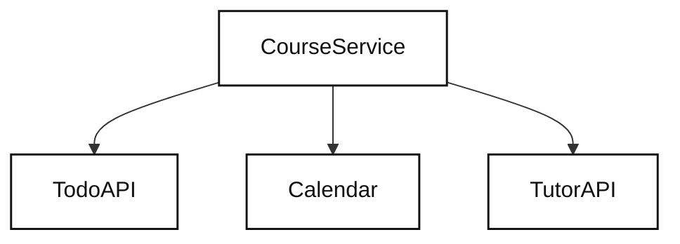
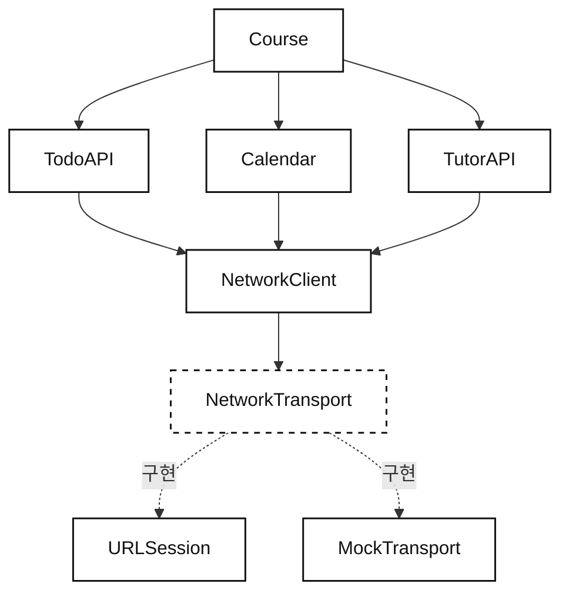
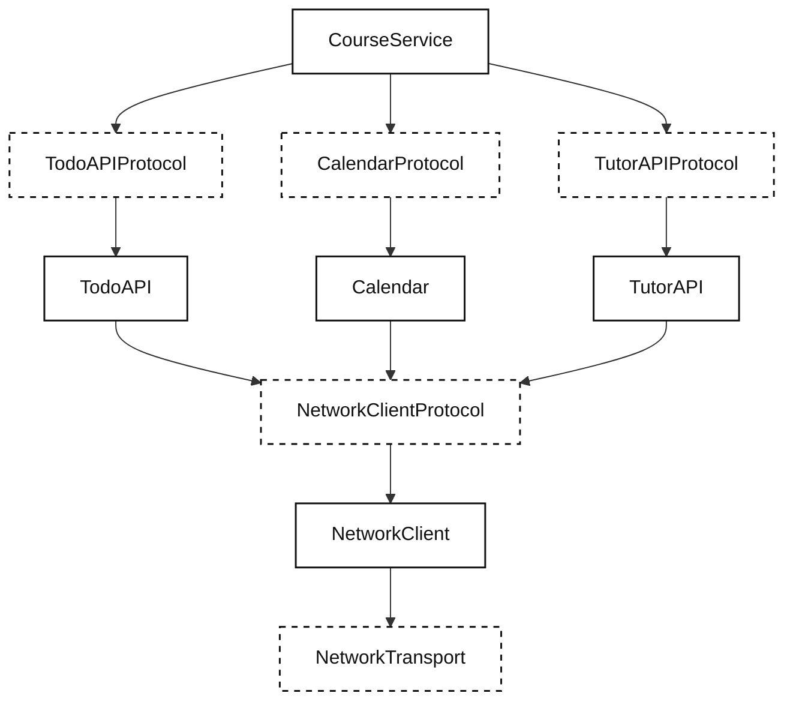
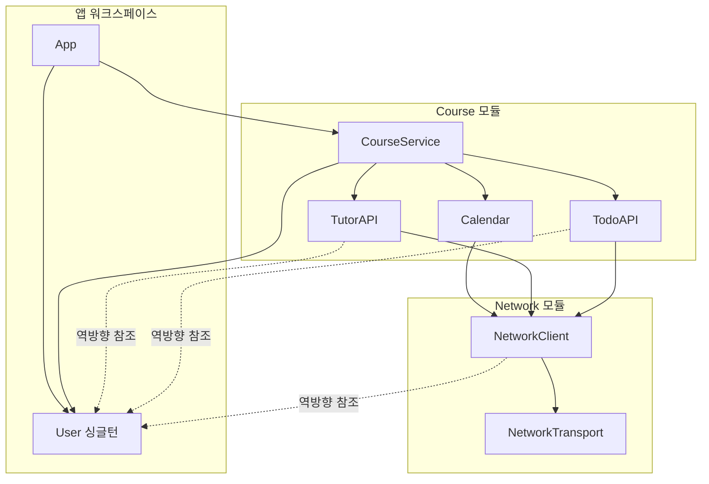

## 의존성 주입
- 의존성 주입은 다른말로 “값 넘겨주기” 다.
	- 시간이 흐르며 대단히 복잡해보이고 어려운 개념같이 표현되었지만 생각보다는 아주 단순한 개념이다.

- 테스트 때 Mock 을 주입해주는 용도나 여러 인스턴스가 사용하는 컴포넌트를 아래로 내려줘야 할 때 사용 가능하다.

- 서드파티 라이브러리를 사용하지 않고도 코드베이스의 규모와 상관없이 의존성 주입을 구현할 수 있다.
	- 책에서 다루는 접근을 배우면 다른 언어에서도 활용할 수 있다.

- 구현 시작 전 이 장에서는 기초를 다룬다.
	- 의존성 역할과 왜 필요한지 다룬다.
	- 몇 가지 흔한 패턴과 안티 패턴도 다룬다.
	- 모바일 맥락에 맞는 싱글톤 패턴의 득실에 대해서도 다룬다.

---


## 바닐라 코드 vs 서드파티 라이브러리
- 처음 회사에 들어온 사람이 가장 쉽게 코드에 적응할 수 있게 하려면, 코드가 **명료**해야 한다.
	- 단순 값넘기기 바닐라 코드가 아닌 서드파티에 의존하게 되면, 명료성이 저하된다.
- 단순 **값 넘기기**에서 멀어지는 순간 비용이 급증한다.
	- 테스트 코드, 문서 작성, 라이브러리 유지보수 등..
	- 신입은 비교적 기본 개념을 이해하기 위해 낡은 문서를 읽어야 할 수 있다.


### 서드파티 솔루션의 비용
- 처음부터 서드파티 솔루션을 사용하면 확실히 속도는 보장된다.
- 하지만, 다음 내용들을 생각하며 서드파티 솔루션을 사용해야 한다.
	1. 서드파티 솔루션의 유지보수자는 몇 명인가?
		- 한 명뿐이라면 그 사람없이는 더 이상 업데이트 되지 않을 것이고 우리 앱에도 영향을 끼친다.
	2. 새로운 OS나 플랫폼 업데이트를 빠르게 대응하고 있는가?
	3. 심각한 미해결 이슈는 없는가?
	4. 연결 시 앱 크기를 얼마나 키우는가?
	5. 서드파티 솔루션이 의존하는 또 다른 서드파티 솔루션이 있는가?
		- 의존성 전이에 의해 다른 서드파티 솔루션이 OS 대응을 하지 않으면, 우리가 사용하는 솔루션에도 영향을 끼친다.
		- 이는 개발 속도를 느리게 만드는 요인이다.


- 마음에 드는 서드파티 솔루션이 있다면 사용해도 좋지만, **숨겨진 비용**에 대해서는 깊이 생각해보고 사용해야 한다.
- **서드파티 프레임워크는 그 자체가 이미 의존성이다.**

### 의존성 주입, 왜 필요한가?




``
```kotlin
class CourseService {

    // CourseService가 자체적으로 의존성을 인스턴스화함
    private val tutorAPI = TutorAPI()
    private val todoAPI = TodoAPI()
    private val calendar = Calendar.getInstance() // Java/Kotlin의 standard Calendar 사용 시

    init {
        // 생성자로 전달받는 매개변수가 없음
    }

    // ... 생략
}
```

- 지금까지 책에서는 의존성 주입이 필요없는 아주 단순한 코드들만 다뤘다.
- `CourseService` 는 자신이 필요한 의존성을 직접 생성하여 사용한다.
- 하지만 테스트와 여러 환경의 지원을 위해 DI가 필요한 순간이 꼭 온다.

## 테스트와 모킹
- 테스트는 사람들이 코드를 주입하고 싶어히는 가장 큰 이유 중 하나다.
	- API 연결 테스트를 할 때, 테스트 코드가 실제 서버와 연결되는 것을 원치 않는다.




- 앞장에서 이야기했듯 네트워크가 연결되는 시점을 인터페이스를 통해 분리하면, 서버 환경을 마음대로 주입할 수 있다.
- 또한 시스템 전체 개발 관점에서 보았을 때도 네트워크 연결만 모킹하면 상위 도메인을 모두 테스트할 수 있다.

### 의존성 주입, 테스트, 그리고 인터페이스
- 세 가지 요소는 의존성 주입에 있어 늘 함께 묶여진다.
- 하지만 의존성 주입과 테스트를 위해 인터페이스를 추가하는 것이 위험을 초래하기도 한다.

- 테스트를 위해 인터페이스를 주입한다면, 이는 코드베이스와 전혀 상관없는 인터페이스다.
	- 즉, 오로지 테스트만을 위해 설계되었다는 이야기다.




- 가끔은 상관없지만, 시간이 지남에 따라 복잡성을 유도하는 인터페이스를 추가하게 되면서 다이어그램은 위와 같이 매우 복잡해진다.
- **모든 의존성을 인터페이스로 주입해선 안된다.**
	- 필요한 순간에만 인터페이스 주입이 필요하다.

### 인터페이스의 목적은 곧바로 드러나지 않는다
- 다른 사람이 도입한 인터페이스를 처음 마주하면, 목적이 무엇인지 한 번에 파악하기 어렵다.
	- 테스트용인가? 혹은 다형성을 위해선가?

- 디버깅 측면에서 인터페이스를 사용하게 되면 다음과 같은 단점이 있다.
	- 실제 런타임에서 주입되는 구현체가 무엇인지 한 번에 파악하기 어렵다.
	- 구동을 시키고 디버깅 툴을 살펴보면서 무엇이 주입되었는지 파악해야 한다.
	- 아니면 코드 레벨에서 주입하는 시점을 직접 찾아야 한다.

- 인터페이스를 통해 타입 사이의 직접적인 의존성을 해제하는 것이 무조건 좋다고 이야기하는 사람들이 있다.
	- 그러나 실제로 디버깅을 한다면, 인터페이스 사이를 왔다갔다 하는 것보다, 명확한 클래스를 몇 번 보는 것이 훨씬 수월하다.

- 물론 테스트가 정말 필요할 때 인터페이스의 도입은 당연히 필요하다.
	- 하지만 아무 생각없이 의존성이라는 이유만으로 인터페이스를 주입하는 것은 피해야 한다.
	- 적은 인터페이스를 유지하는 것이 디버깅에 유리하다.

## 컴파일러 플래그와 환경
- DI가 필요한 또 다른 이유는 환경을 갈아끼우는 능력이 탁월해서다.
	- 디버그, 스테이징, 릴리즈 등 여러 환경을 언제든 갈아끼울 수 있다.

- 인터페이스의 주입을 피하고 싶다면 다음과 같이 작성할 수도 있다.

```kotlin
// Inside the Networking domain

object NetworkConfig {
    val serverURL: String = if (BuildConfig.DEBUG) {
        "https://staging.myawesomestartup.com/dev"
    } else {
        "https://www.myawesomestartup.com/"
    }
}
````

- `BulldConfig.DEBUG` 와 같은 컴파일러 플래그를 활용해 환경별로 필요한 값을 주입할 수 있다.
- 그러나, 환경에 따라 변경되어야 하는 값이 많아진다면 이러한 컴파일러 플래그는 프로젝트 전체에 넓게 퍼지게 된다.
	- 많은 타입이 환경에 따라 달라진다면, 코드베이스를 추론하기가 매우 어려워진다.

- 더 나은 목표는 컴파일러 플래그를 한 곳에 모으는 것이다.
	- 그럼 특정 환경별로 다르게 동작하는 로직들을 한 번에 확인할 수 있다.
	- 이는 다음 장에서 자세히 다룬다.

## 싱글톤
- 의존성 주입이 필요할 수 있는 세 번째 이유는 **클래스 인스턴스의 재생성을 피하고 싶을 때**이다.
	- 로그아웃을 하고 싶을 때 `NetworkClient` 가 여러 개라면, 모든 인스턴스에 로그아웃 호출을 보내야 한다.

- 이렇게 인스턴스가 하나일 때 싱글톤 패턴을 활용하면 어떨까?
	- 싱글톤 자체는 DI를 훨씬 더 단순하게 만들어준다.
	- 하지만, 단점이 더 많다.

- 언제 싱글톤을 써도 되고, 쓰면 안되는지 정확하게 알아보고, 대안은 무엇이 있는지 알아보자.

### 싱글톤 구성하기
- 싱글톤을 구현하면 어떤 모습이 될지 살펴본다.
	- 싱글톤으로 코드를 구성하는 것은 매우 편하다.

```kotlin
class NetworkClient private constructor() {
    companion object {
        // 다른 타입에서 사용할 정적 프로퍼티를 정의한다
        val shared = NetworkClient()

        // 전송 방식을 교체 가능하게 만든다
        var transport: NetworkTransport = ProductionTransport()
        // ... 생략
    }
}
```

- 우선 `static` 프로퍼티를 제공하는 것부터 시작한다.

```kotlin
class TutorAPI {
    val networkClient = NetworkClient.shared
    // ... 생략
}

class TodoAPI {
    val networkClient = NetworkClient.shared
    // ... 생략
}

class CalendarService {
    val networkClient = NetworkClient.shared
    // ... 생략
}
```

- 사용하는 측은 `shared` 프로퍼티를 통해 `NetworkClient` 에 직접적으로 의존한다.

```kotlin
class CourseService {

    // CourseService는 이제 예전처럼 NetworkClient를 알 필요가 없다
    val tutorAPI = TutorAPI()
    val todoAPI = TodoAPI()
    val calendar = CalendarService()

    // 생성자에 아무것도 전달하지 않는다
    // (별도 init 블록 없이 프로퍼티 초기화만으로 충분하다)

    // ... 생략
}
```

- 결과적으로 `CourseService` 에는 아무것도 주입하지 않아도 된다.

```kotlin
fun setupEnvironment() {
    // 환경에 따라 NetworkClient의 transport를 구성한다
    NetworkClient.transport = if (BuildConfig.DEBUG) {
        StagingTransport()
    } else {
        ProductionTransport()
    }
}
```

- 환경을 설정하는 위치에서는 사용할 `Transport` 만 정의해주면 된다.
	- 앱 어딘가에 위 메소드를 선언하여 빌드 설정에 따라 알맞은 네트워크를 구성할 수 있다.

- 싱글톤 구현은 아주 편리하고, 이에 따라 아주 많이 남용하게 된다.
	- 그러나 이는 많은 문제를 일으킨다.

### 싱글톤은 지름길로 남용된다
- 개발을 하다보면, 싱글톤이 의존성을 숨긴다는 이야기를 듣는다.
	- 왜냐하면, 어떤 인스턴스가 넘겨지는지 볼 수 없기 때문이다.
	- 클래스 레벨에서는 무엇이 전달되는지 클래스를 보지 않는 한 알 수 없기 때문에 맞는 말이다.

- 그러나 앱 큐모가 커지면, 싱글톤을 쓰지 않아도 사정은 크게 다르지 않다.
	- 결국 사람들은 의존성을 컨테이너에 담거나, 별도 타입으로 묶어서 전달한다.
	- 그럼 그 컨테이너나 타입 안에 무엇이 들어있는지는 마찬가지로 한 눈에 보이지 않는다.
	- 거기에 인터페이스까지 늘어나면, 구현 코드까지 숨겨져 더욱 문제는 심각해진다.

- 그래서, 싱글톤이 오히려 코드를 더 쉽게 이해하게 만들어 준다고 생각한다.
	- 풀어야 할 복잡한 의존성 주입 그래프가 없으니 말이다.

- 분명 싱글톤은 편하고 도입하기도 쉽지만, 프로그램이 커지고 성숙해질수록 큰 골칫거리로 돌아온다.
	- "인스턴스가 하나만 있으면 되니 싱글톤도 괜찮다!"
	- 라고 말할 수 있지만, **인스턴스가 하나뿐이라는 조건이 영원히 유지될까?**

### 미래를 위해 문제를 푼다
- 프로그래밍에서는 대체로 문제를 "미래를 위해" 풀어선 안된다.
	- 영영 필요없을지도 모르는 기능을 "나중에 필요할까봐" 미리 구현하는 것은 형편없는 투자이자 오버엔지니어링으로 가는 가장 확실한 길이다.

- 그러나 이 사고 흐름이 싱글톤엔 적용되지 않는다.
	- 싱글톤에선 미래를 미리 생각해야 할 필요가 있다.
	- 언젠가 싱글톤을 다시 평범한 DI 가능 타입으로 되돌려야 한다면, 많은 비용을 투자해야 한다.
	- 이미 꽤 성숙해진 코드베이스에 의존성 주입을 천천히 도입하기는 꽤 어렵기 때문이다.

- 큰 애플리케이션에서 쓰이는 `User` 싱글톤이 있다고 가정해보자.
	- 3년 뒤, 팀이 다중 사용자 지원을 결정한다면?
	- 싱글톤을 모든 곳에서 제거하거나, 억지로 싱글톤을 유지해 코드베이스를 유지보수하기 어렵게 만들거나, 둘 중 하나를 택해야 한다.
	- 처음부터 `User` 를 인자로 넘겨주고 있었다면 이 문제는 쉽게 해결됐을 것이다.

### 싱글톤은 모듈화를 방해한다
- 프로젝트가 커지면, 코드를 라이브러리나 모듈로 쪼개자고 결정할 수 있다.
	- 하지만 싱글톤은 모듈 쪼개기를 쉽게 허락해주지 않는다.

- `User` 싱글톤을 코드베이스 전체에 뿌려놨다면, 많은 클래스들이 `User` 에 대한 의존성을 해제해야 한다.




- 하지만 위 그림처럼 싱글톤이 결합되어 있는 경우 앱과 모듈 사이에 양방향 의존성이 생기게 된다.
	- 모듈 내에서 `User` 가 쓰이는 위치를 모두 찾아 연결을 해제해야 한다.
	- 싱글톤이 다른 싱글톤에 의존한다면 문제는 더욱 심각해진다.
	- 큰 앱에서 싱글톤을 해제하려면 어떠한 비용이 들지 감도 안온다.

### 모듈 사이로 값 넘겨주기
- 빠르고 지저분한 해법은 싱글톤을 모듈 하나로 옮겨 앱과 다른 모듈이 모두 접근할 수 있게 하는 것이다.
	- 하지만, 싱글톤으로 가득찬 "잡동사니" 모듈을 끌어안게 된다.

- 또 다른 해법은 `User` 싱글톤을 더 낮은 모듈 (`NetworkClient`) 로 옮겨버리는 것이다.
	- 그럼 `User` 에 의존하는 모든 코드와 모듈이 `NetworkClient` 모듈에 의존하게 된다.

- 어느쪽이든 이상적이지 않은 해법이고, 스스로를 구석에 몰아넣는 방법들이다.
	- 강하고 계획된 설계로 만들어진 해법이 아니라, 그저 싱글톤을 뒤처리하려는 대응일 뿐이다.

- 그저 더 나은 해법은 기능들이 의존성 주입을 지원하게 하는 것이다.
	- 그럼 클래스들에 `User` 를 넘겨주게 되고, 의존성 그래프는 단방향이 된다.

### 싱글톤과 thread-safety, 전역 상태
- 적절한 동기화 메커니즘이 없다면, 여러 스레드가 동시에 인스턴스에 접근해 값을 변경할 수 있다.

```kotlin
class PaymentProvider(
    private val transferAPI: TransferAPI
) {
    /**
     * 계좌로 돈을 송금한다
     *
     * @param amount 센트 단위 금액
     * @param targetAccount 송금 대상 계좌
     */
    suspend fun transferMoney(amount: Int, targetAccount: Account) {
        // 결제를 시작하고 끝날 때까지 기다린다
        val updatedBalance = transferAPI.transfer(
            amount = amount,
            from = User.shared.account,
            to = targetAccount
        )
        // 송금이 끝나면 사용자의 잔액을 갱신한다
        User.shared.account.balance = updatedBalance // 위험!
    }
    // ... 생략
}
```

- 위 코드를 보면 본문은 두 줄뿐이지만 벌써 치명적인 버그가 존재한다.
	- `transferAPI` 의 `transfer`  를 호출하는 순간 비동기 메소드가 호출된다.
	- 이론적으로는 이 때 `User` 가 로그아웃 될 수도 있다.

- 대부분 아무일도 없겠지만, 송금을 완료한 직후 재빨리 로그아웃하고 다른 사용자로 로그인하면 엉뚱한 사용자의 잔액이 갱신된다.
	- 가능성이 낮은 시나리오여도, 나중에는 `TransferAPI` 가 결제를 큐에 쌓도록 수정될 수 있다.
	- 배치로 처리하여 작업이 조금 늦게 수행된다면, 이 버그의 실현 가능성은 꽤 커진다.

- 모든 문제가 처음엔 문제가 아니어도, 시간이 지나며 커진 코드베이스로 인해 싱글톤은 조용한 살인자가 될 수 있다.

