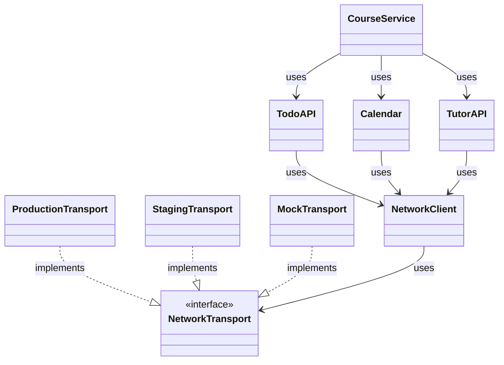
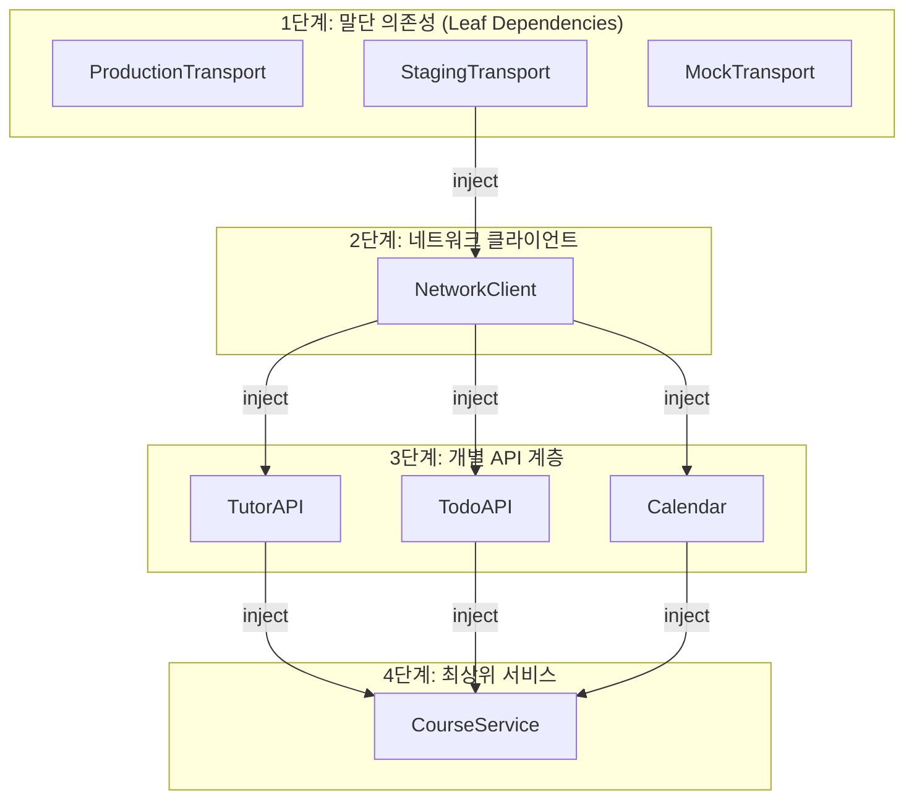
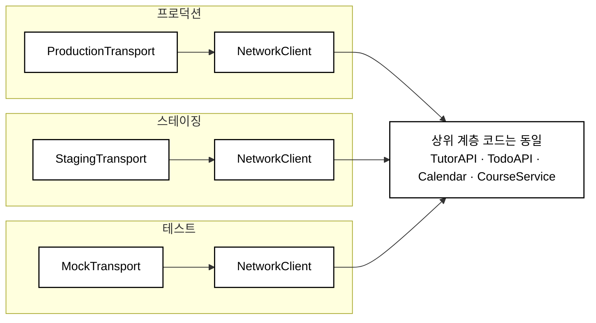
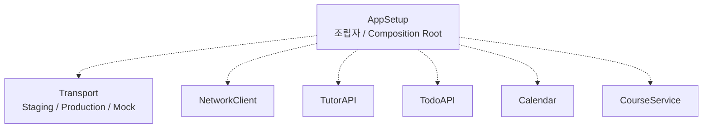
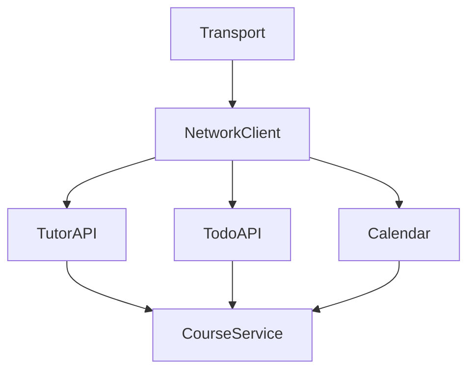
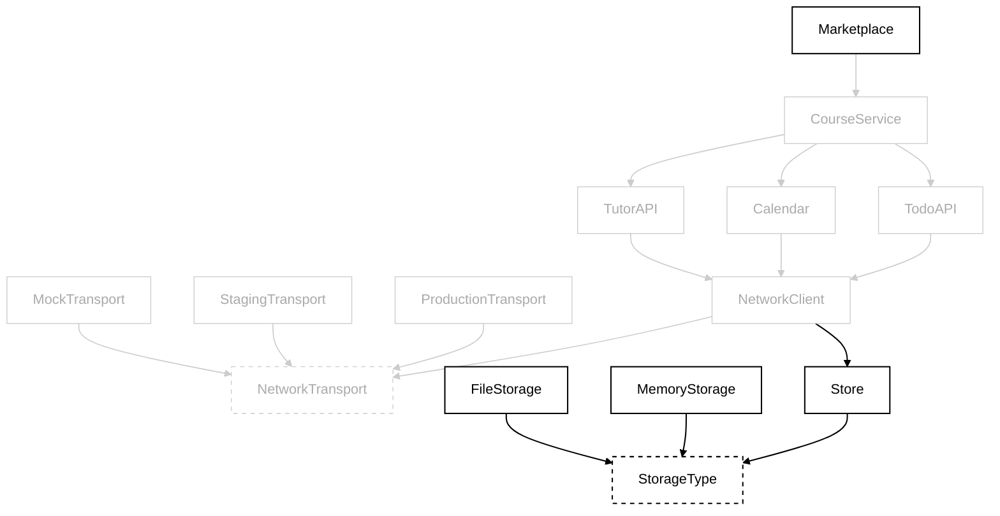
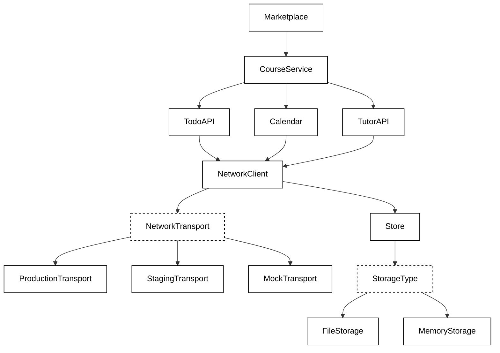
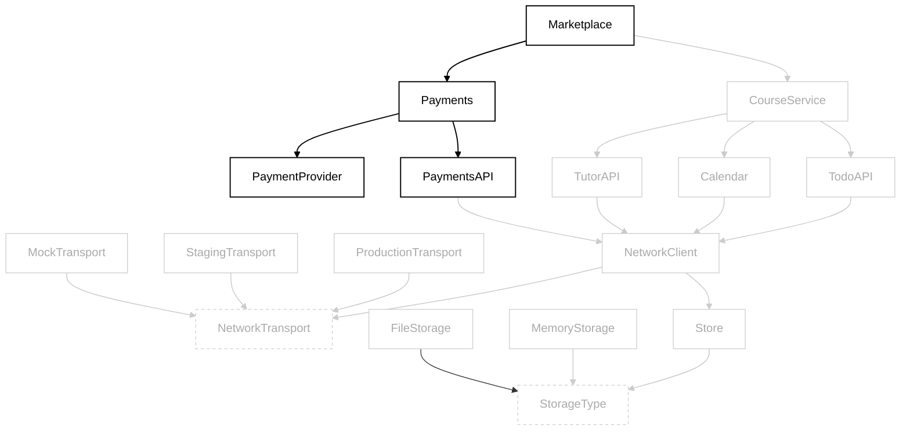
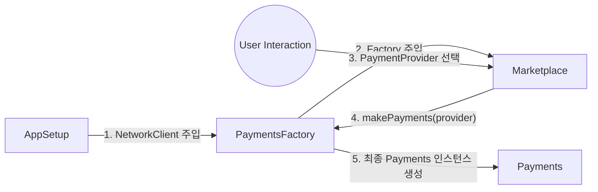
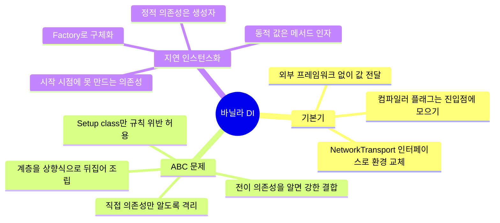

# 바닐라 코드로 의존성 주입하기 (Dependency Injection Without a Framework)

### 순진한 해결책 (A naive solution)

```kotlin
class CourseService(
    networkClient: NetworkClient
) {
    private val tutorAPI: TutorAPI = TutorAPI(networkClient)
    private val todoAPI: TodoAPI = TodoAPI(networkClient)
    private val calendar: Calendar = Calendar(networkClient)
}
```

- 가장 간단한 방법은 필요한 의존성(`NetworkClient`)을 파라미터로 넘기는 것이다.
- 하지만 **의존성을 설정하는 일이 과연 `CourseService`의 책임인지**는 고민해봐야 한다.

### 깊게 중첩된 의존성: ABC 문제 (Deeply nested dependencies: the ABC problem)


- **A가 B를 의존하고 B가 C를 의존하지만, A는 C를 몰라야 한다** — 이것이 ABC 문제다.
- `CourseService`가 `TodoAPI`를 의존하는 상황이라면 `CourseService` → `TodoAPI` → `NetworkClient`의 관계가 위와 같다.
- 각 타입이 자신의 **전이 의존성(transitive dependency)** 까지 알게 되는 상황을 피해야 한다.
- 이 접근을 계속 유지하면 모든 의존성이 필요한 곳까지 꼬리를 물고 전달되어 코드베이스가 얽히게 된다.
- 해결책은 **각 타입이 실제로 사용하는 직접 의존성만 알도록 보장**하는 것이다.

### 계층 구조를 안팎으로 뒤집기 (Flipping the hierarchy inside out)



- 계층 구조를 안팎으로 뒤집음으로써 ABC 문제를 피할 수 있다.
- `NetworkClient`는 `NetworkTransport` 인터페이스에만 의존하므로, **어떤 트랜스포트가 실제로 들어오는지 알 필요가 없다.**



- 이 그래프를 위아래로 뒤집으면 **실제 코드 구현 순서와 완벽하게 맞아떨어진다.**

#### 코드로 계층 구조 세우기 (Setting up the hierarchy in code)

- 그래프 최상단인 말단 의존성은 다른 것에 의존하지 않으므로 가장 먼저 구현할 수 있다.
- `ProductionTransport` / `StagingTransport` → `NetworkClient` → `TutorAPI` / `TodoAPI` / `Calendar` → `CourseService` 순서.

```kotlin
object AppSetup {
    fun setupCourseService(): CourseService {
        val transport = StagingTransport()
        val networkClient = NetworkClient(transport = transport)

        val tutorAPI = TutorAPI(networkClient = networkClient)
        val todoAPI = TodoAPI(networkClient = networkClient)
        val calendar = Calendar(networkClient = networkClient)

        // 직접 의존성만을 주입하여 CourseService를 초기화
        return CourseService(
            tutorAPI = tutorAPI,
            todoAPI = todoAPI,
            calendar = calendar
        )
    }
}
```

- 최종적으로 `CourseService`는 `NetworkClient`를 **모르는 상태로** 직접 의존성만으로 초기화된다.

### 테스트 환경 (The testing environment)



- 테스트를 수행할 때도 `NetworkClient`에 `ProductionTransport` 대신 `MockTransport`를 전달하기만 하면 **동일한 로직이 그대로 적용된다.**

### 애플리케이션 바깥 경계의 컴파일러 플래그 (Compiler flags on the outer edge of your application)

- 코드베이스 여기저기에 컴파일러 플래그를 흩뿌려 두면 흐름 파악이 매우 어려워지므로, **한 곳으로 모으는 것**이 좋다.

```kotlin
object AppSetup {
    fun setupCourseService(): CourseService {
        val transport = if (BuildConfig.DEBUG) {
            StagingTransport()
        } else {
            ProductionTransport()
        }
        val networkClient = NetworkClient(transport = transport)

        val tutorAPI = TutorAPI(networkClient = networkClient)
        val todoAPI = TodoAPI(networkClient = networkClient)
        val calendar = Calendar(networkClient = networkClient)

        // 직접 의존성만을 주입하여 CourseService를 초기화
        return CourseService(
            tutorAPI = tutorAPI,
            todoAPI = todoAPI,
            calendar = calendar
        )
    }
}
```

### 비결 (The secret sauce)

- ABC 문제를 피하는 해답은, **타입을 생성하는 주체가 모든 의존성에 접근할 수 있는 권한을 가지는 것**이다.
- 애플리케이션 시작 시점에는 아직 아무런 계층 구조가 형성되어 있지 않으므로, 모든 의존성에 자유롭게 접근할 수 있다.



- 조립이 끝나고 각 객체에 **필요한 의존성만** 전달하면, 다음과 같은 계층화된 의존성 구조가 완성된다.



- 비결의 두 번째 요소는 **모든 타입을 상향식(bottom-up)으로 연결**했다는 점이다. 가장 하위 요소부터 만들어 올라간다.

#### ABC 규칙 깨뜨리기 (Breaking the ABC rule)

- 사실 의존성을 조립하고 설정하는 클래스 자체는 ABC 규칙을 **위반한다.**
- 예를 들어 `AppSetup`은 `NetworkClient`를 직접 사용하지 않으면서도 이를 생성하고 조립한다.
- 이런 조립 지점은 필연적으로 ABC 규칙을 깨뜨린다. 목표는 위반을 없애는 것이 아니라 **위반이 일어나는 장소를 최소한으로 한정하고 격리**하는 것이다.

### 앱 키우기 (Growing the app)

- 유저가 강사의 강의를 찾아볼 수 있는 **Marketplace** 기능을 도입한다고 가정하자.
- 유저는 강의를 검색하고, 별점과 가격을 비교하며, 구독하고 결제할 수 있다.

#### 클래스를 추가해 그래프 확장하기 (Extending the graph with more classes)



- 최상단에 `Marketplace`가, 하단에는 `Store` / `StorageType` 계층이 새로 추가되었다.

#### 그래프 뒤집기 (Flipping the graph)

- ABC 문제를 피하기 위해, `Marketplace`가 `TutorAPI`나 `NetworkClient` 같은 **전이 의존성을 모르도록** 할 것이다.



- 이전과 같이 **가장 밑단부터** 구현해 나간다. 그래프를 뒤집으면 실제 작업할 코드의 순서와 일치한다.

#### 코드로 본 더 큰 ABC 문제 (A larger ABC problem in code)

```kotlin
object AppSetup {

    // setupCourseService() -> setupMarketplace()로 변경
    fun setupMarketplace(): Marketplace {
        // 새로 분리된 setupNetworkClient() 호출
        val networkClient = setupNetworkClient()

        val tutorAPI = TutorAPI(networkClient = networkClient)
        val todoAPI = TodoAPI(networkClient = networkClient)
        val calendar = Calendar(networkClient = networkClient)

        val courseService = CourseService(
            tutorAPI = tutorAPI,
            todoAPI = todoAPI,
            calendar = calendar
        )

        // NEW: courseService를 주입하여 Marketplace 생성
        return Marketplace(courseService = courseService)
    }

    // NetworkClient 설정을 별도 함수로 분리
    fun setupNetworkClient(): NetworkClient {
        // 가장 하위 요소인 MemoryStorage 초기화
        val storage = MemoryStorage()

        // Store<ByteArray> 초기화 (Swift의 Data 대응)
        val store = Store<ByteArray>(storageType = storage)

        // 환경에 따른 Transport 분기 처리 (Android BuildConfig 활용)
        val transport: NetworkTransport = if (BuildConfig.DEBUG) {
            StagingTransport()
        } else {
            ProductionTransport()
        }

        // Store와 Transport를 주입하여 NetworkClient 생성
        return NetworkClient(
            transport = transport,
            store = store
        )
    }

    // ... snip
}
```

- 이 설정을 사용하면 앞으로 의존성이 얼마나 추가되든 **동일한 원칙을 적용해 지속적으로 확장**할 수 있다.
- 다만 **모든 객체를 앱 시작 시점에 미리 인스턴스화한다**는 단점이 있다.
- 실제로는 앱이 막 시작된 시점에 특정 의존성(세션, 토큰 등)이 아직 준비되지 않아 **생성 자체가 불가능한** 경우도 많다.

### 의존성을 아직 쓸 수 없을 때 (When dependencies aren't available)

- 앞선 시나리오와 달리, 앱 시작 시점에 만들 수 없는 객체도 존재한다.
- 이를 **지연 초기화(lazy instantiation)** 로 해결해보자.

#### 결제 플로우 (A payment flow)

- 유저가 마켓플레이스로 이동해 강사를 고르고 강의를 결제하는 흐름을 만든다고 상상해보자.



- 이전과 달리 **어떤 `PaymentsAPI`와 `PaymentProvider`를 쓸지 시작 시점에 알 수 없어** `Payments` 인스턴스를 미리 만들 수 없다.
- 설령 `PaymentProvider`가 준비되어 있더라도, `Marketplace` 스스로는 `Payments`를 만들 수 없다.
    - `PaymentsAPI`를 생성하려면 `NetworkClient`가 필요한데, `Marketplace`는 `NetworkClient`에 접근할 수 없기 때문이다.
- 단순한 해결책은 `Marketplace`에 `NetworkClient`를 넘겨주고 나중에 초기화하는 것이지만, 이는 `Marketplace`가 전이 의존성을 알게 되어 **다시 ABC 문제를 유발한다.**

#### 선택적 의존성 (Optional dependencies)

- 유저가 하나의 payment provider에 종속되어 있다면, `Payments`가 필요한 `PaymentProvider`를 자체적으로 가질 수 있어 값으로 전달할 필요가 없다.
- 그럼에도 **앱 시작 시점에 `Payments`를 초기화하는 것은 자원 낭비**다.
- 이를 해결하기 위해 `Marketplace`가 **필요할 때만** `Payments`를 만들게 할 수 있다.

### 지연 의존성 (Lazy dependencies)

- 일반적인 의존성과 달리, 지연 의존성은 **의존성 인스턴스를 반환하는 함수**의 형태를 띤다.
- 하지만 익명 함수를 코드베이스에서 다루는 것은 번거롭기 때문에, 더 직관적으로 이해할 수 있도록 `PaymentsFactory`라는 클래스로 구체화할 수 있다.



#### 코드로 팩토리 표현하기 (Expressing a factory in code)

```kotlin
class PaymentsFactory(
    private val networkClient: NetworkClient
) {
    fun makePayments(provider: PaymentProvider): Payments {
        // 사전에 주입된 networkClient와 런타임에 전달된 provider를 결합하여 생성
        return Payments(
            networkClient = networkClient,
            provider = provider
        )
    }
}
```

| 구분 | 전달 위치 | 예시 |
| --- | --- | --- |
| 의존성 설정 시점에 준비 가능한 것 | 팩토리의 **생성자 인자** | `NetworkClient` |
| 런타임에 결정되는 동적 데이터 | 팩토리 **메서드 매개변수** | `PaymentProvider` |

#### 팩토리 사용하기 (Using the factory)

```kotlin
class Marketplace(
    private val courseService: CourseService,
    private val paymentsFactory: PaymentsFactory
) {
    companion object {
        // 기본 결제 제공자 목록
        val paymentProviders: List<PaymentProvider> = listOf(
            PaymentProvider.CreditCard,
            PaymentProvider.PayPal,
            PaymentProvider.InAppPurchases
        )
    }

    // 사용자가 선택한 결제 수단으로 결제 인스턴스 생성 요청
    fun makePayments(selectedProvider: PaymentProvider): Payments {
        return paymentsFactory.makePayments(provider = selectedProvider)
    }

    // 코루틴(suspend)을 활용한 비동기 코스 조회
    suspend fun fetchCourses(): List<Course> {
        return courseService.fetchCourses(limit = 50, offset = 0)
    }
}
```

```kotlin
object AppSetup {

    fun setupMarketplace(): Marketplace {
        val networkClient = setupNetworkClient()

        val tutorAPI = TutorAPI(networkClient = networkClient)
        val todoAPI = TodoAPI(networkClient = networkClient)
        val calendar = Calendar(networkClient = networkClient)

        val courseService = CourseService(
            tutorAPI = tutorAPI,
            todoAPI = todoAPI,
            calendar = calendar
        )

        // networkClient를 주입하여 팩토리 인스턴스 생성
        val paymentsFactory = PaymentsFactory(networkClient = networkClient)

        // Marketplace에 CourseService와 PaymentsFactory를 주입
        return Marketplace(
            courseService = courseService,
            paymentsFactory = paymentsFactory
        )
    }

    private fun setupNetworkClient(): NetworkClient {
        val storage = MemoryStorage()
        val store = Store<ByteArray>(storageType = storage)
        val transport: NetworkTransport = if (BuildConfig.DEBUG) {
            StagingTransport()
        } else {
            ProductionTransport()
        }

        return NetworkClient(
            transport = transport,
            store = store
        )
    }
}
```

- 팩토리 메서드를 도입하면 `setupMarketplace`에서 `PaymentsFactory`를 사용하도록 바꾸면 된다.
- **`Payments` 인스턴스를 생성하지 말고, `PaymentsFactory` 인스턴스를 만들어 `Marketplace`에 넘겨라.**

---

## 정리 (What we covered)



- 외부 프레임워크 없이 **순수한 바닐라 코드로 의존성을 주입**하는 방법을 다뤘다.
- 화려한 방식보다 **값을 직접 전달하는 방식**이 코드 이해에 더 유리하다.
- 더 나은 코드 구조화를 위해 **컴파일러 플래그를 애플리케이션 진입점에 모은다.**
- 프로덕션 / 스테이징 / 테스트 환경을 자유롭게 교체하기 위해 `NetworkTransport` 같은 인터페이스를 사용한다.

### ABC 문제 (The ABC problem)

- 타입이 **자신의 전이 의존성까지 알고 있을 때** 발생하는 문제다.
- 전이 의존성은 강한 결합을 유발하고 유지보수를 어렵게 만든다.
- ABC 문제를 해결한다는 것은 **각 타입이 직접 의존성만 알도록 격리**하는 것을 의미한다.
- 객체 초기화 과정에서 **의존성 계층 구조를 상향식으로 뒤집어** 해결한다.
- Setup class는 ABC 규칙을 위반하지만, 그 대가로 **다른 모든 코드가 규칙을 지킬 수 있게** 해준다.

### 지연 인스턴스화와 팩토리 (Lazy instantiation and factories)

- 앱 초기화 시점에 아직 사용할 수 없는 의존성을 다루기 위해 **팩토리**를 사용한다.
- 런타임 데이터가 필요한 의존성을 처리할 때 팩토리가 유용하다.
- 앱 시작 시점에 준비 가능한 의존성은 **팩토리 생성자**를 통해 미리 주입한다.
- 런타임에 결정되는 동적 값은 **팩토리 메서드의 인자**로 전달한다.
- 이를 통해 올바른 의존성 주입 원칙을 유지하면서 **불필요한 사전 생성을 막을 수 있다.**
