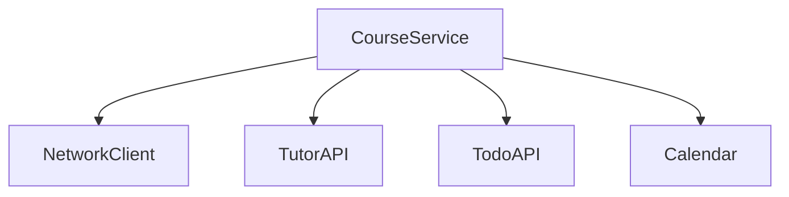
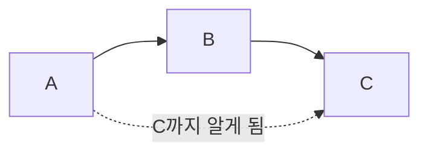
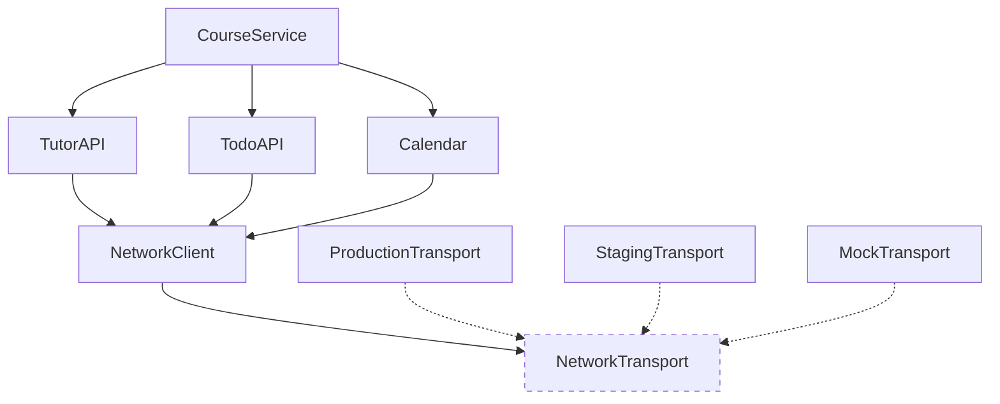
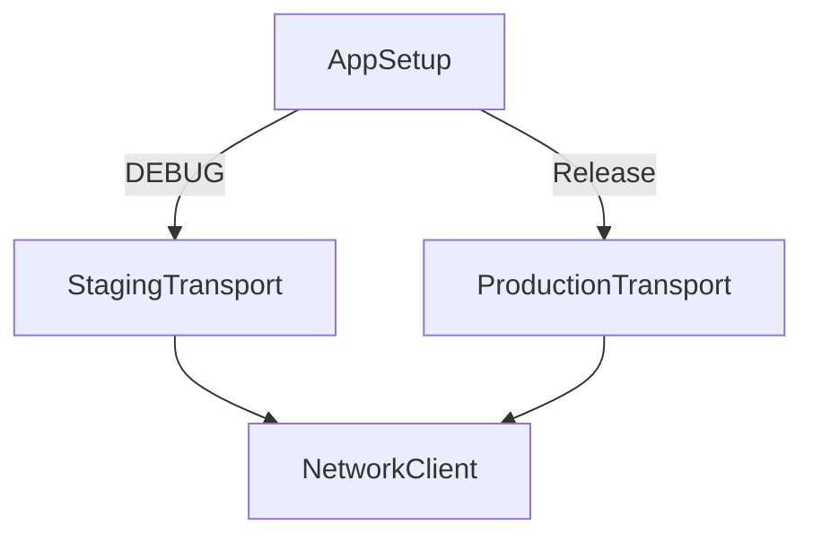
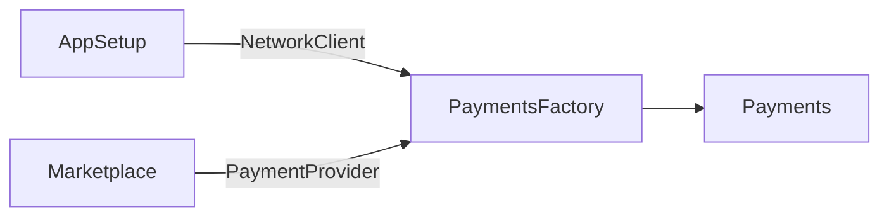

# [WEEK 13] Book 0 Chapter 8
📖 Mobile System Design 0. From Briefings to System Architecture  

<br>

## 8. Sane Dependency Injection Without Fancy Frameworks
> dependency injection은 필요한 값을 직접 전달하는 방식에서 시작한다. 각 type은 직접 사용하는 dependency만 알고 앱의 조립 지점에서 전체 구조를 연결한다.

### A naive solution

`CourseService`에 `NetworkClient`를 전달하면 `CourseService`가 `TutorAPI`와 `TodoAPI`와 `Calendar`를 만들 수 있다. 환경에 맞는 `NetworkClient`만 넘기면 되므로 처음에는 단순하다.  

하지만 `CourseService`는 `NetworkClient`를 직접 사용하지 않는다. 하위 API를 만들 때만 필요하므로 `NetworkClient`는 `CourseService`의 전이 dependency가 된다.  



---

### Deeply nested dependencies: the ABC problem

A가 B를 사용하고 B가 C를 사용하는데 A까지 C를 알아야 하는 상황을 `ABC problem`이라고 한다.  

`TodoAPI`가 `NetworkClient`를 사용한다면 `CourseService`는 `TodoAPI`만 알면 된다. `CourseService`에 `NetworkClient`까지 전달하면 전이 dependency가 상위 type으로 새어 나온다.  

전이 dependency가 늘어날수록 상위 type의 생성자와 초기화 코드가 함께 바뀐다. 하위 구현을 교체할 때 직접 사용하지 않는 type까지 수정하게 되므로 코드가 강하게 얽힌다.  

각 type은 직접 사용하는 dependency만 알아야 한다. dependency를 만들고 연결하는 책임은 별도의 setup 지점에 둔다.  



---

### Flipping the hierarchy inside out

ABC problem을 피하려면 dependency hierarchy를 초기화하는 순서를 뒤집는다. 가장 아래 dependency부터 만들고 이를 사용하는 상위 type을 나중에 만든다.  

`NetworkClient`는 `NetworkTransport`만 알게 한다. 실제 환경에서는 `ProductionTransport`나 `StagingTransport`를 주입하고 test에서는 `MockTransport`를 주입한다. `NetworkClient`는 구체적인 transport를 알 필요가 없다.  



이제 각 type은 직접 dependency만 받는다. 전이 dependency는 상위 type에 노출되지 않는다.  

#### Setting up the hierarchy in code

dependency가 없는 구체 type부터 만든다. `CourseService`는 모든 dependency가 준비된 뒤 가장 마지막에 생성한다.  

```text
ProductionTransport 또는 StagingTransport
        ↓
NetworkClient
        ↓
TutorAPI / TodoAPI / Calendar
        ↓
CourseService
```

`AppSetup`처럼 앱의 진입점에 가까운 곳에서 전체 hierarchy를 조립한다.  

#### Updating CourseService

`CourseService`는 `NetworkClient`를 직접 사용하지 않는다. 따라서 `TutorAPI`와 `TodoAPI`와 `Calendar`만 직접 전달받도록 바꾼다.  

이제 `CourseService`는 자신의 동작에 필요한 type만 안다. `NetworkClient` 변경이 `CourseService`까지 번지지 않는다.  

> **Android 적용**  
> Android에서는 `AppSetup`을 `AppContainer`처럼 구성할 수 있다. 조립 코드는 app 진입점에 두고 feature에는 직접 필요한 dependency만 전달한다.

---

### The testing environment

test 환경에서는 `ProductionTransport` 대신 서버에 연결하지 않는 `MockTransport`를 `NetworkClient`에 넣는다. 나머지 객체는 운영 환경과 같은 방식으로 조립한다.  

따라서 실제 코드 흐름은 유지하면서 네트워크 연결만 바꿔 test할 수 있다. 환경이 달라도 각 type의 동작은 같게 유지된다.  

---

### Compiler flags on the outer edge of your application

staging과 production을 build별로 선택해야 한다면 compiler flag를 사용할 수 있다. flag를 여러 type에 흩뿌리면 환경별 동작을 따라가기 어려워진다.  

환경 선택은 app을 시작하고 dependency를 조립하는 `AppSetup`에 모은다. `AppSetup`에서 `StagingTransport`와 `ProductionTransport` 중 하나를 선택하면 나머지 type은 환경을 알 필요가 없다.  



모든 compiler flag를 한곳에 모을 수 있는 것은 아니다. 특정 OS version이나 platform에 필요한 flag는 해당 코드에 남을 수 있다. 그래도 환경 선택 flag는 가능한 한 `AppSetup`처럼 app의 바깥쪽에 둔다.  

---

### The secret sauce

dependency를 조립하는 type은 전체 dependency에 접근할 수 있어야 한다. `AppSetup`은 처음에는 모든 type을 볼 수 있는 평평한 구조에서 시작한다.  

여기서 가장 아래 dependency부터 연결하면 각 type이 직접 dependency만 갖는 hierarchy가 만들어진다.  

- 조립 지점은 전체 dependency에 접근한다.
- dependency는 아래에서 위로 연결한다.

#### Breaking the ABC rule

`AppSetup`은 직접 사용하지 않는 `NetworkClient`도 만들 수 있다. 전체 구조를 조립하는 책임이 있기 때문에 이 지점에서는 ABC rule을 의도적으로 깨는 셈이다.  

이런 setup 지점을 앱 전체에 만들면 dependency 흐름을 파악하기 어려워진다. hierarchy를 조립할 위치를 정하고 그곳에 책임을 모아야 한다.  

---

### Growing the app

`Marketplace`는 사용자가 tutor의 course를 찾고 구매하는 feature이다. 여기서는 UI보다 `Marketplace`의 dependency를 어떻게 구성할지에 집중한다.  

#### Extending the graph with more classes

`Marketplace`는 course를 조회하고 결제하는 `CourseService`의 상위 type이 된다.  

네트워크 데이터를 cache하기 위해 `NetworkClient`에 `Store`를 다시 연결한다. `Store`는 `StorageType`을 통해 `MemoryStorage`나 `FileStorage`를 사용할 수 있다.  

`MemoryStorage`는 test에 사용할 수 있고 `FileStorage`는 실제 저장에 사용할 수 있다. 공통 cache 구조는 앱 전체의 offline 동작으로 확장할 여지도 만든다.  

#### Flipping the graph

새로운 type이 추가되어도 가장 깊은 dependency부터 만들고 위쪽 type을 차례로 연결하는 순서는 같다. `StorageType` 구현부터 `Store`와 `NetworkClient`를 만들고 마지막에 `Marketplace`를 생성한다.  

`Marketplace`는 `TutorAPI`나 `NetworkClient`를 직접 알지 않는다. `CourseService`처럼 직접 사용하는 dependency만 받는다. 그래프를 뒤집어도 dependency 관계 자체가 바뀌는 것은 아니다.  

#### A larger ABC problem in code

dependency가 많아지면 setup method를 역할별로 나눌 수 있다. `setupNetworkClient()`가 storage와 transport와 `NetworkClient`를 만들고 `setupMarketplace()`가 feature를 완성한다.  

```text
setupMarketplace()
    ├─ setupNetworkClient()
    ├─ TutorAPI / TodoAPI / Calendar
    ├─ CourseService
    └─ Marketplace
```

이렇게 해도 전이 dependency는 각 type에 새어 나오지 않는다. 사용한 interface도 `NetworkTransport`와 `StorageType` 정도로 제한된다. 따라서 mock보다 실제로 배포할 code를 더 많이 test하게 된다.  

다만 모든 dependency를 app 시작 시 만드는 eager initialization이 된다. 처음부터 만들 수 없거나 바로 필요하지 않은 dependency에는 다른 방식이 필요하다.  

---

### When dependencies aren't available

`Marketplace`를 만들 때 `AppSetup`이 모든 direct dependency와 transitive dependency를 알 수 있다면 type을 app 시작 시 완성할 수 있다. 하지만 실행 시점에야 알 수 있는 값이 있으면 이 방식만으로는 type을 만들 수 없다.  

#### A payment flow

사용자가 결제 수단을 고른 뒤에야 `PaymentProvider`를 알 수 있다고 가정한다. `Payments`는 `NetworkClient`와 `PaymentProvider`를 모두 필요로 한다.  

`AppSetup`은 `NetworkClient`를 알고 있지만 사용자의 선택은 모른다. `Marketplace`는 선택된 `PaymentProvider`를 알 수 있지만 `NetworkClient`까지 알아서는 안 된다.  

`NetworkClient`를 `Marketplace`에 넘기면 `Marketplace`가 나중에 `Payments`를 만들 수는 있다. 대신 전이 dependency를 알게 되어 ABC problem이 다시 생긴다.  

#### Optional dependencies

어떤 dependency는 특정 기능을 사용할 때만 필요하다. 결제 기능을 사용하지 않는다면 `Payments`를 app 시작 시 만들 이유가 없다. 미리 만들면 자원과 startup time이 낭비된다.  

이런 dependency는 optional dependency로 볼 수 있다. 필요한 순간에 만들면 되지만 `Marketplace`에 `NetworkClient`를 전달하면 같은 문제가 다시 생긴다.  

---

### Lazy dependencies

lazy dependency는 객체 자체가 아니라 나중에 객체를 만들어 반환하는 함수이다. 익명 함수 대신 `PaymentsFactory`라는 type으로 감싸면 역할을 분명하게 표현할 수 있다.  

`Marketplace`는 `Payments`가 아니라 `PaymentsFactory`를 받는다. 결제 수단이 정해진 뒤 factory method를 호출해 `Payments`를 만든다.  



#### Expressing a factory in code

`PaymentsFactory`는 초기화할 때 `NetworkClient`를 받는다. `makePayments(provider:)`는 실행 중 전달받은 `PaymentProvider`와 저장해 둔 `NetworkClient`로 새로운 `Payments`를 만든다.  

factory를 설계할 때는 값을 알 수 있는 시점을 나눈다.  

- 초기화할 때 알 수 있는 값은 factory initializer로 받는다.
- 실행 중에 알 수 있는 값은 factory method의 argument로 받는다.

#### Using the factory

`Marketplace`는 `CourseService`와 `PaymentsFactory`라는 직접 dependency만 가진다. 사용자가 결제 수단을 고르면 factory에 전달해 `Payments`를 만든다.  

`AppSetup`은 `NetworkClient`를 factory에 넣고 `Marketplace`에는 factory만 전달한다. 따라서 `Marketplace`는 `NetworkClient`를 알지 않아도 된다.  

---

### Conclusion

DI는 별도 framework 없이 필요한 값을 직접 전달하는 방식으로 구현할 수 있다.  

각 type이 직접 dependency만 알고 setup 지점에서 아래부터 연결하면 ABC problem을 피할 수 있다. 전체 dependency를 알고 연결하는 책임은 AppSetup에 둔다.  

app 시작 때 알 수 없는 dependency나 선택적으로 필요한 dependency는 factory로 나중에 만들 수 있다. compiler flag도 app 진입점에 모으면 환경별 분기를 한곳에서 관리할 수 있다.  

이 방식은 singleton보다 코드가 길 수 있다. 대신 dependency 흐름이 코드에 드러나므로 앱의 동작을 따라가기 쉽다.  

---

### What we covered

- framework 없이 필요한 값을 직접 전달하는 DI
- 각 type이 직접 dependency만 알도록 만드는 ABC problem 해결
- setup 지점에서 dependency를 아래부터 위로 연결하는 방법
- `NetworkTransport`로 production과 staging과 test 구현을 교체하는 방법
- compiler flag를 app 진입점에 모으는 방식
- 실행 중 준비되거나 선택되는 dependency를 factory로 늦게 만드는 방법
