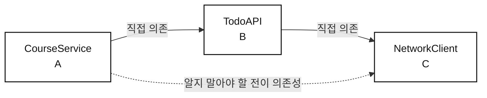
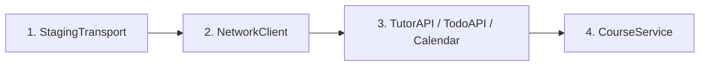
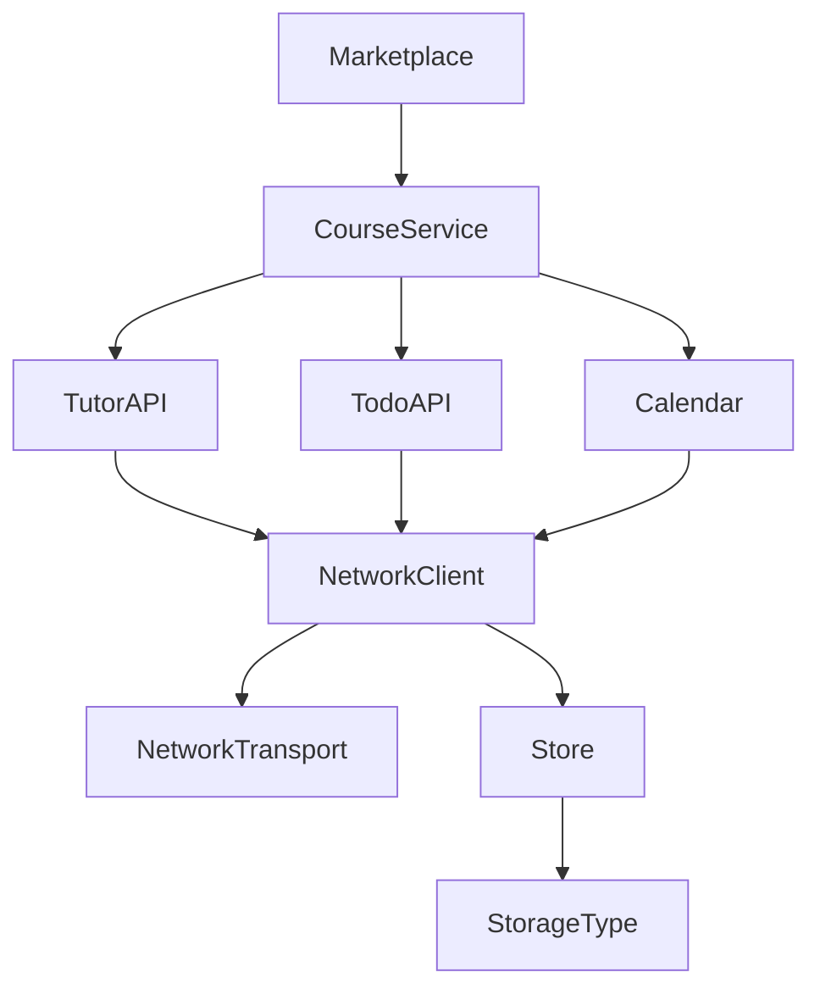
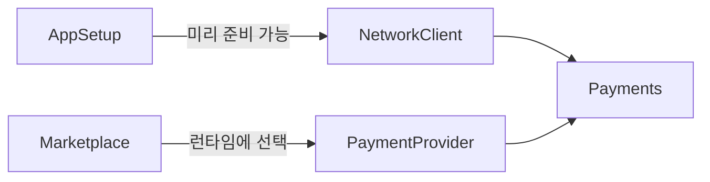

```table-of-contents
```

## 8장 [[08. 제정신을 지키는 의존성 주입|제정신을 지키는 의존성 주입]]

> 훌륭한 의존성 설정은 지루하게 느껴진다. 그게 제대로 돌아가고 있다는 증거다.

- 앞선 [[스터디 정리 11|의존성 주입의 기초]] 에서는 의존성 주입이 필요한 이유와 싱글턴의 문제를 살펴봤다.
    - 이번 장에서는 실제 `Course` 피처에 의존성 주입을 적용한다.
    - 화려한 프레임워크 대신 값을 직접 넘기는 방식으로 문제를 하나씩 해결한다.

- 핵심은 **각 타입이 자신이 직접 사용하는 의존성만 알게 만드는 것**이다.
    - 의존성의 의존성까지 알기 시작하면 코드 전체가 함께 바뀐다.
    - 이를 `ABC 문제` 라고 부른다.

- 모든 의존성을 앱 시작 시점에 만들 수 있는 것도 아니다.
    - 사용자가 실행 중에 선택해야 알 수 있는 값이 있다.
    - 아예 쓰이지 않을 수도 있는 의존성을 미리 만드는 것도 낭비다.
    - 이런 경우에는 `Factory` 로 생성을 미룬다.

---

## 순진한 해법

- 가장 단순한 방법은 `NetworkClient` 를 `CourseService` 에 넘기는 것이다.
    - `CourseService` 는 받은 `NetworkClient` 로 `TutorAPI`, `TodoAPI`, `Calendar` 를 직접 만든다.
    - 프로덕션, 스테이징 및 테스트용 `NetworkClient` 를 쉽게 갈아 끼울 수 있다.

```kotlin
class CourseService(
    networkClient: NetworkClient,
) {
    private val tutorAPI = TutorAPI(networkClient)
    private val todoAPI = TodoAPI(networkClient)
    private val calendar = CalendarService(networkClient)
}
```

- 코드는 단순하지만 책임이 어긋난다.
    - `CourseService` 는 실제 동작에서 `NetworkClient` 를 직접 쓰지 않는다.
    - 오직 자기 의존성을 만들기 위해서만 `NetworkClient` 를 받는다.
    - 결국 `CourseService` 가 자기 역할과 무관한 설정 책임까지 떠안는다.

- 여기서 질문해야 한다.
    - **의존성을 조립하는 일이 정말 `CourseService` 의 책임인가?**

## 깊게 중첩된 의존성 : ABC 문제

- `ABC 문제` 는 다음 관계에서 생긴다.
    - A는 B에 의존한다.
    - B는 C에 의존한다.
    - A는 C를 직접 쓰지 않지만, B를 만들기 위해 C까지 알아야 한다.



- `CourseService` 입장에서 `NetworkClient` 는 **전이 의존성**이다.
    - 직접 의존성인 `TodoAPI` 의 의존성일 뿐이다.
    - `CourseService` 가 실제로 호출하거나 상태를 사용하는 대상은 아니다.

- 전이 의존성을 알게 되면 변경이 위쪽 타입까지 전파된다.
    - `TutorAPI` 가 `User` 를 추가로 요구하면 `CourseService` 생성자도 함께 바뀐다.
    - `NetworkClient` 를 다른 저장소 SDK로 교체해도 `CourseService` 가 영향을 받는다.
    - 의존성 하나를 추가하거나 제거할 때 수많은 클래스가 같이 수정될 수 있다.

- 이런 구조가 곳곳에 생기면 타입의 독립성이 떨어진다.
    - 타입을 다른 피처나 모듈로 옮기기 어려워진다.
    - 의존성 흐름을 추론하기 어려워진다.
    - 작은 변경도 넓은 범위의 수정으로 번진다.

- 해결 원칙은 단순하다.
    - **각 타입은 자신의 직접 의존성만 알아야 한다.**

## 의존성 계층 뒤집기

- `ABC 문제` 를 풀려면 의존성 그래프를 거꾸로 바라본다.
    - 가장 깊은 잎 의존성부터 만든다.
    - 이미 만든 객체를 바로 위 타입에 주입한다.
    - 최상위 타입은 마지막에 만든다.



- 의존성 관계 자체가 바뀌는 것은 아니다.
    - 그래프를 뒤집어 그리면 **초기화 순서**가 선명하게 보인다.
    - 아무 의존성도 받지 않는 타입부터 시작할 수 있다.

### 앱 진입점에서 조립하기

- 조립 책임은 `AppSetup` 같은 별도 타입에 둔다.
    - 앱을 부트스트랩하는 `Main` 근처가 자연스러운 위치다.
    - `AppSetup` 은 전체 그래프를 알고 객체를 순서대로 만든다.

```kotlin
object AppSetup {
    fun setupCourseService(): CourseService {
        val transport = StagingTransport()
        val networkClient = NetworkClient(transport)

        val tutorAPI = TutorAPI(networkClient)
        val todoAPI = TodoAPI(networkClient)
        val calendar = CalendarService(networkClient)

        return CourseService(
            tutorAPI = tutorAPI,
            todoAPI = todoAPI,
            calendar = calendar,
        )
    }
}
```

- 조립 순서는 의존성 그래프의 아래에서 위로 올라간다.
    1. 아무 의존성도 없는 `StagingTransport` 를 만든다.
    2. `StagingTransport` 를 받아 `NetworkClient` 를 만든다.
    3. `NetworkClient` 를 받아 API 타입들을 만든다.
    4. API 타입들을 받아 `CourseService` 를 만든다.

### CourseService는 직접 의존성만 받는다

- `CourseService` 는 더 이상 `NetworkClient` 를 받지 않는다.
    - 필요한 객체를 직접 만들지도 않는다.
    - 이미 완성된 직접 의존성만 생성자로 받는다.

```kotlin
class CourseService(
    private val tutorAPI: TutorAPI,
    private val todoAPI: TodoAPI,
    private val calendar: CalendarService,
)
```

- 이제 하위 구현이 바뀌어도 `CourseService` 는 영향을 받지 않는다.
    - `TutorAPI` 에 새 의존성이 생겨도 `AppSetup` 만 수정한다.
    - `NetworkClient` 구현을 교체해도 `CourseService` 는 그대로다.
    - `CourseService` 는 자기 동작에 필요한 타입만 알게 된다.

## 테스트 환경 구성하기

- 테스트도 프로덕션과 같은 순서로 의존성을 조립한다.
    - 차이는 가장 바깥의 `Transport` 구현뿐이다.
    - 실제 서버 대신 `MockTransport` 를 넣는다.

```kotlin
fun makeCourseService(): CourseService {
    val transport = MockTransport()
    val networkClient = NetworkClient(transport)

    return CourseService(
        tutorAPI = TutorAPI(networkClient),
        todoAPI = TodoAPI(networkClient),
        calendar = CalendarService(networkClient),
    )
}
```

- 보일러플레이트가 늘어나는 것처럼 보일 수 있다.
    - 그래서 싱글턴이나 DI 프레임워크 같은 지름길을 찾게 된다.
    - 하지만 이 코드는 명시적이라 흐름을 바로 추적할 수 있다.
    - 테스트에서도 목으로 도배된 코드 대신 실제 구현을 더 넓게 검증할 수 있다.

- 환경마다 같은 타입을 사용한다는 점도 중요하다.
    - 프로덕션과 테스트에서 `CourseService` 의 동작은 같다.
    - 경계에 있는 `Transport` 만 다르다.
    - 환경 분기가 비즈니스 코드 안으로 퍼지지 않는다.

## 빌드 환경 분기는 앱 바깥 가장자리에 둔다

- 디버그와 릴리스 환경을 나누기 위해 빌드 플래그가 필요할 수 있다.
    - 문제는 플래그가 코드베이스 전체에 흩어질 때 생긴다.
    - 환경별 동작을 한눈에 파악하기 어려워진다.

- 플래그는 `AppSetup` 처럼 앱의 가장 바깥쪽에 모은다.
    - 환경에 따라 `Transport` 만 선택한다.
    - 그 아래의 조립 코드는 어떤 환경에서도 같다.

```kotlin
object AppSetup {
    fun setupCourseService(): CourseService {
        val transport: NetworkTransport = if (BuildConfig.DEBUG) {
            StagingTransport()
        } else {
            ProductionTransport()
        }

        val networkClient = NetworkClient(transport)

        return CourseService(
            tutorAPI = TutorAPI(networkClient),
            todoAPI = TodoAPI(networkClient),
            calendar = CalendarService(networkClient),
        )
    }
}
```

- 이 구조에서는 네트워크 경계만 환경을 안다.
    - `CourseService`, API 및 저장소는 디버그인지 릴리스인지 몰라도 된다.
    - 환경 설정을 찾으려는 동료도 `AppSetup` 한 곳만 보면 된다.

- 모든 빌드 분기를 한곳에 둘 수 있는 것은 아니다.
    - OS 버전이나 플랫폼에 따라 구현 자체가 달라지는 코드는 해당 경계에 남을 수 있다.
    - 그래도 가능한 환경 분기는 앱 루트로 모으는 편이 낫다.

## 이 방식의 비법

- 핵심은 `AppSetup` 이 의존성 전체에 접근할 수 있다는 점이다.
    - 앱이 시작되기 전에는 아직 객체 계층이 만들어지지 않았다.
    - `AppSetup` 입장에서는 모든 타입이 평평하게 놓여 있다.
    - 그래서 필요한 객체를 하나씩 만들고 연결할 수 있다.

- 두 번째 핵심은 아래에서 위로 조립한다는 점이다.
    - 가장 깊은 의존성부터 만든다.
    - 이미 준비된 객체를 다음 타입에 넘긴다.
    - 최종 타입은 직접 의존성만 받는다.

### AppSetup은 의도적으로 ABC 규칙을 깬다

- `AppSetup` 은 직접 사용하지 않는 `NetworkClient` 까지 알고 만든다.
    - 엄밀히 말하면 `AppSetup` 도 `ABC 규칙` 을 깬다.
    - 하지만 이 책임을 한곳에 모았기 때문에 다른 타입은 규칙을 지킬 수 있다.

- 목표는 규칙 위반을 완전히 없애는 것이 아니다.
    - 의존성 그래프를 조립하는 위치로 위반을 제한한다.
    - 앱 여기저기서 각 타입이 전이 의존성을 아는 상황을 막는다.

> `AppSetup` 이 모든 의존성을 알기 때문에, 나머지 타입은 직접 의존성만 알 수 있다.

## 앱이 커질 때

- `Marketplace` 피처가 추가됐다고 가정한다.
    - `Marketplace` 는 코스를 검색하고 결제하는 최상위 기능이다.
    - 내부에서는 `CourseService` 를 사용한다.

- 네트워크 캐시도 추가한다.
    - `NetworkClient` 는 `Store` 에 의존한다.
    - `Store` 는 `StorageType` 인터페이스에 의존한다.
    - 실제 구현으로 `MemoryStorage` 와 `FileStorage` 를 선택할 수 있다.



- 그래프가 커져도 원칙은 같다.
    - 가장 깊은 `StorageType` 구현부터 만든다.
    - `Store`, `NetworkClient`, API 및 `CourseService` 순서로 올라간다.
    - 마지막으로 `Marketplace` 를 만든다.

### 조립 메서드 나누기

- 의존성 트리가 커지면 설정 메서드를 의미 있는 단위로 나눈다.
    - `setupNetworkClient()` 는 저장소, 전송 계층 및 네트워크 클라이언트를 조립한다.
    - `setupMarketplace()` 는 네트워크 클라이언트 위의 피처 계층을 조립한다.

```kotlin
object AppSetup {
    fun setupMarketplace(): Marketplace {
        val networkClient = setupNetworkClient()

        val courseService = CourseService(
            tutorAPI = TutorAPI(networkClient),
            todoAPI = TodoAPI(networkClient),
            calendar = CalendarService(networkClient),
        )

        return Marketplace(courseService)
    }

    private fun setupNetworkClient(): NetworkClient {
        val storage = MemoryStorage()
        val store = Store<ByteArray>(storage)

        val transport: NetworkTransport = if (BuildConfig.DEBUG) {
            StagingTransport()
        } else {
            ProductionTransport()
        }

        return NetworkClient(
            transport = transport,
            store = store,
        )
    }
}
```

- 의존성이 늘었어도 전이 의존성이 위쪽으로 새지 않는다.
    - `Marketplace` 는 `TutorAPI`, `NetworkClient` 및 `StorageType` 을 모른다.
    - `CourseService` 는 저장 방식이나 전송 환경을 모른다.
    - 각 타입은 자기 역할에 필요한 의존성만 받는다.

- 인터페이스 수도 필요 이상으로 늘리지 않는다.
    - 예제에서는 교체 지점인 `NetworkTransport` 와 `StorageType` 만 인터페이스다.
    - 실제 출시 코드를 더 넓게 테스트하려는 방향과도 맞는다.

## 의존성을 아직 만들 수 없을 때

- 지금까지는 `AppSetup` 이 모든 의존성을 시작 시점에 만들 수 있었다.
    - 실제 앱에서는 런타임이 되어야 알 수 있는 값도 있다.
    - 앱이 시작될 때 미리 만들 수 없는 객체가 생긴다.

### 결제 플로우

- `Marketplace` 에서 사용자가 결제 수단을 선택한다고 가정한다.
    - `Payments` 는 `NetworkClient` 와 `PaymentProvider` 가 모두 필요하다.
    - `NetworkClient` 는 앱 시작 시점에 준비할 수 있다.
    - `PaymentProvider` 는 사용자가 신용카드, PayPal 등을 선택한 뒤에야 알 수 있다.

- 어느 쪽도 `Payments` 를 완성할 수 없다.
    - `AppSetup` 은 `NetworkClient` 는 알지만 사용자의 선택을 모른다.
    - `Marketplace` 는 사용자의 선택은 알지만 전이 의존성인 `NetworkClient` 를 모른다.



- 빠른 해법은 `NetworkClient` 를 `Marketplace` 에 넘기는 것이다.
    - 사용자가 결제 수단을 고른 뒤 `Marketplace` 가 `Payments` 를 만들 수 있다.
    - 하지만 `Marketplace` 가 전이 의존성을 알게 되어 `ABC 문제` 가 되살아난다.

### 선택적 의존성

- 시작 시점에 만들 수 있어도 미리 만들고 싶지 않은 의존성이 있다.
    - 사용자가 코스를 구독하지 않으면 결제 기능은 끝까지 쓰이지 않을 수 있다.
    - 무거운 객체를 미리 만들면 메모리와 시작 시간을 낭비한다.

- 이런 객체는 선택적 의존성으로 볼 수 있다.
    - 앱 수명 동안 필요할 수도 있고 필요하지 않을 수도 있다.
    - 실제로 필요해지는 순간에 만드는 편이 낫다.

- 런타임 의존성과 선택적 의존성은 모두 **지연 생성**으로 해결할 수 있다.

## 지연 의존성과 Factory

- 일반 의존성은 완성된 객체를 넘긴다.
    - 지연 의존성은 **필요할 때 객체를 만들어 반환하는 함수**를 넘긴다.

- 익명 함수로도 구현할 수 있지만 의도가 흐려질 수 있다.
    - 생성 책임을 `PaymentsFactory` 라는 타입으로 표현하면 역할이 선명해진다.
    - `Marketplace` 는 완성된 `Payments` 대신 `PaymentsFactory` 를 받는다.

### 준비된 값과 나중에 알게 될 값 나누기

- `PaymentsFactory` 는 두 시점의 의존성을 합친다.
    - 앱 시작 시 준비할 수 있는 `NetworkClient` 는 생성자로 받는다.
    - 런타임에 결정되는 `PaymentProvider` 는 팩토리 메서드의 인자로 받는다.

```kotlin
class PaymentsFactory(
    private val networkClient: NetworkClient,
) {
    fun makePayments(provider: PaymentProvider): Payments {
        return Payments(
            networkClient = networkClient,
            provider = provider,
        )
    }
}
```

- `Factory` 를 설계할 때는 두 질문을 던진다.
    1. 의존성 그래프를 조립할 때 이미 준비할 수 있는 값은 무엇인가?
        - 팩토리 생성자로 받는다.
    2. 실행 중 특정 순간에만 알 수 있는 값은 무엇인가?
        - 팩토리 메서드의 인자로 받는다.

- 이 구조에서는 `Marketplace` 가 `NetworkClient` 를 알 필요가 없다.
    - 사용자가 선택한 `PaymentProvider` 만 팩토리에 넘긴다.
    - 팩토리가 미리 받은 `NetworkClient` 와 합쳐 `Payments` 를 만든다.

### Marketplace에서 Factory 사용하기

```kotlin
class Marketplace(
    private val courseService: CourseService,
    private val paymentsFactory: PaymentsFactory,
) {
    fun makePayments(selectedProvider: PaymentProvider): Payments {
        return paymentsFactory.makePayments(selectedProvider)
    }
}
```

- `Marketplace` 의 직접 의존성은 `CourseService` 와 `PaymentsFactory` 다.
    - 결제 기능이 필요한 순간에만 `Payments` 를 만든다.
    - 네트워크 계층이나 저장소 같은 깊은 의존성은 알지 못한다.

- 마지막으로 `AppSetup` 에서 팩토리를 조립한다.
    - 이미 준비된 `NetworkClient` 를 `PaymentsFactory` 에 넣는다.
    - 완성된 팩토리를 `Marketplace` 에 넘긴다.

```kotlin
fun setupMarketplace(): Marketplace {
    val networkClient = setupNetworkClient()

    val courseService = CourseService(
        tutorAPI = TutorAPI(networkClient),
        todoAPI = TodoAPI(networkClient),
        calendar = CalendarService(networkClient),
    )

    val paymentsFactory = PaymentsFactory(networkClient)

    return Marketplace(
        courseService = courseService,
        paymentsFactory = paymentsFactory,
    )
}
```

- `Factory` 가 해결하는 문제는 두 가지다.
    - 앱 시작 시 없는 런타임 의존성을 나중에 받을 수 있다.
    - 쓰이지 않을 수도 있는 객체를 미리 만들지 않아도 된다.

- 동시에 의존성 규칙도 지킨다.
    - `Marketplace` 는 전이 의존성을 모른다.
    - 생성 책임은 `PaymentsFactory` 에 모인다.
    - 앱 전체의 조립 흐름은 여전히 `AppSetup` 에서 확인할 수 있다.

---

## 정리

- 의존성 주입은 프레임워크 없이도 단순한 값 전달로 충분히 구현할 수 있다.
    - 명시적인 코드는 다소 길어도 추론하기 쉽다.
    - 마법 같은 자동 연결보다 생성 경로를 바로 따라갈 수 있다.

- `ABC 문제` 는 타입이 자신의 전이 의존성을 알 때 생긴다.
    - 전이 의존성은 결합을 높이고 변경 범위를 넓힌다.
    - 각 타입은 직접 사용하는 의존성만 알아야 한다.

- 의존성 그래프는 가장 깊은 타입부터 위로 올라가며 조립한다.
    - `AppSetup` 이 전체 그래프를 알고 연결한다.
    - `AppSetup` 한 곳이 `ABC 규칙` 을 깨는 대신 나머지 타입은 규칙을 지킨다.

- 환경별 차이는 앱의 바깥 가장자리에 모은다.
    - 프로덕션, 스테이징 및 테스트 환경은 경계 구현만 바꾼다.
    - 비즈니스 코드는 환경과 무관하게 같은 방식으로 동작한다.

- 시작할 때 준비할 수 없는 의존성은 `Factory` 로 생성을 미룬다.
    - 미리 준비할 수 있는 값은 팩토리 생성자로 받는다.
    - 런타임에 결정되는 값은 팩토리 메서드로 받는다.
    - 선택적 의존성도 실제로 필요할 때만 만들 수 있다.

> 좋은 의존성 주입은 특별해 보이지 않는다. 객체를 올바른 순서로 만들고, 필요한 곳에 값을 넘겨줄 뿐이다.

#Android #Kotlin
