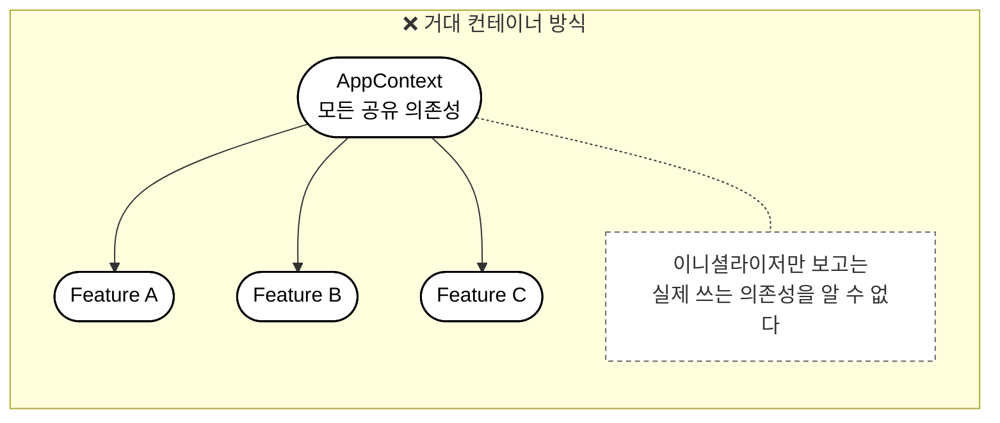
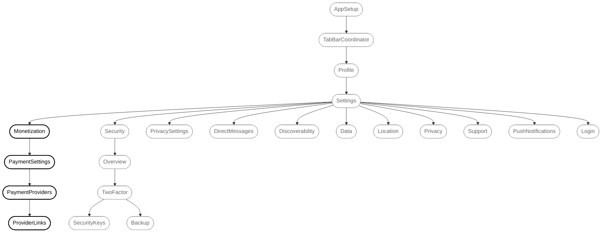
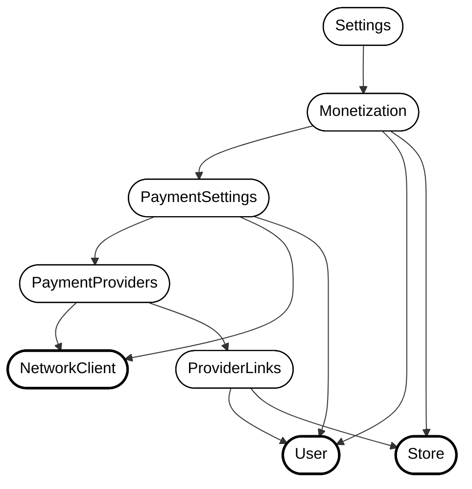
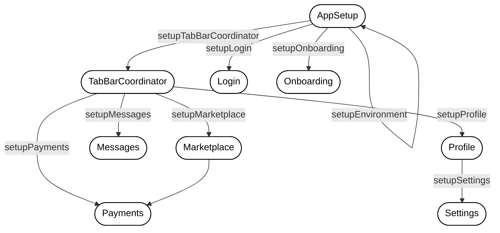
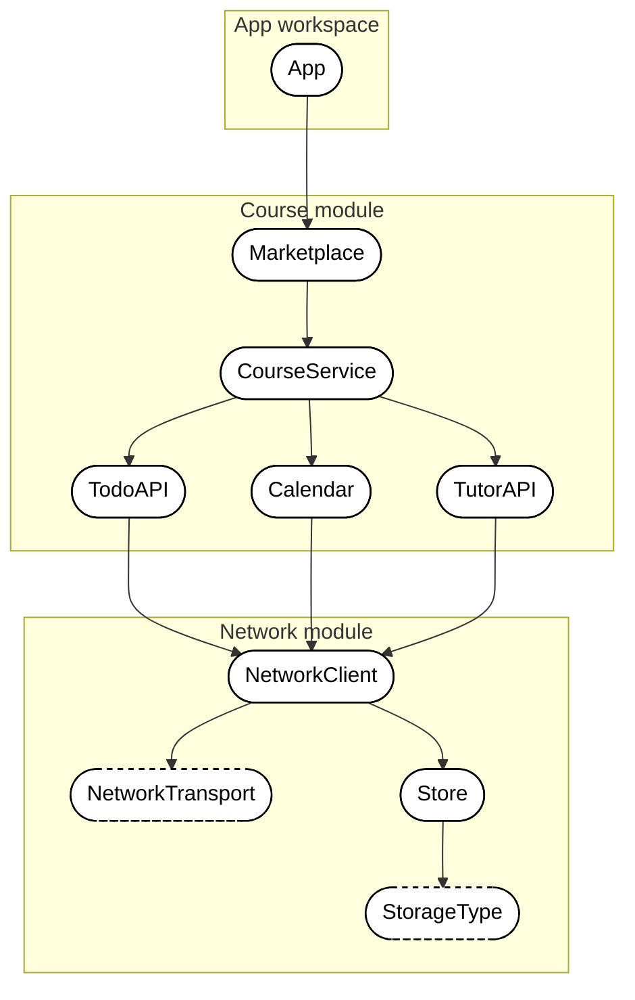
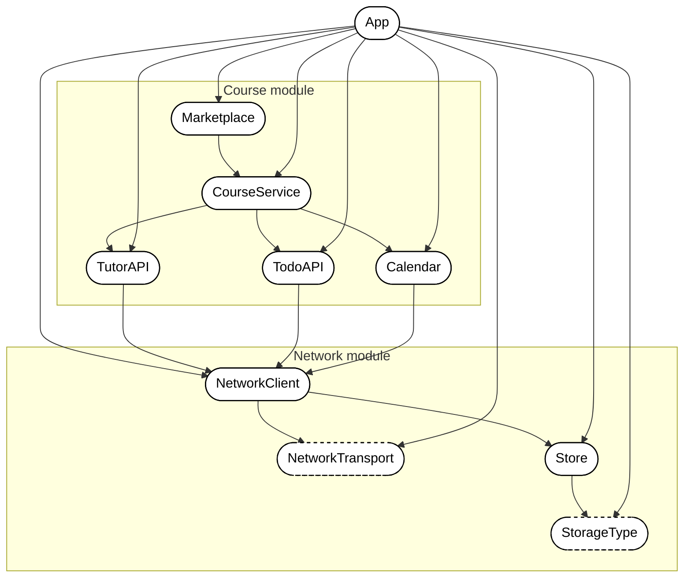
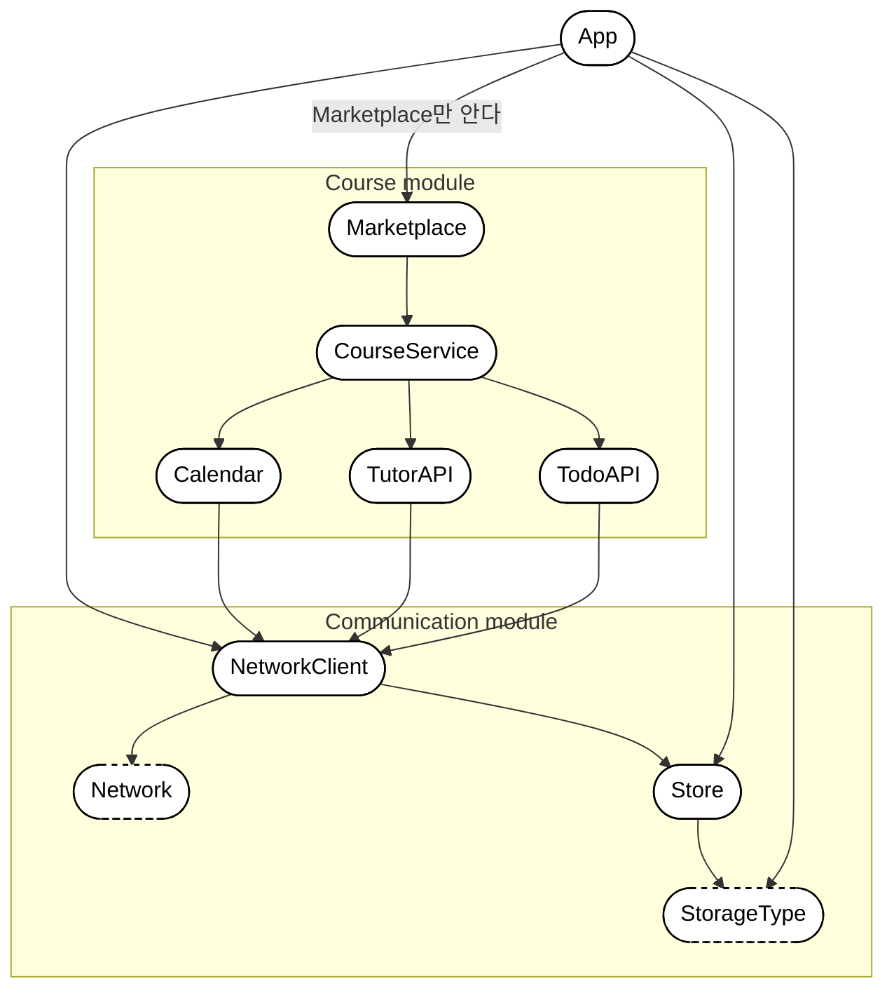
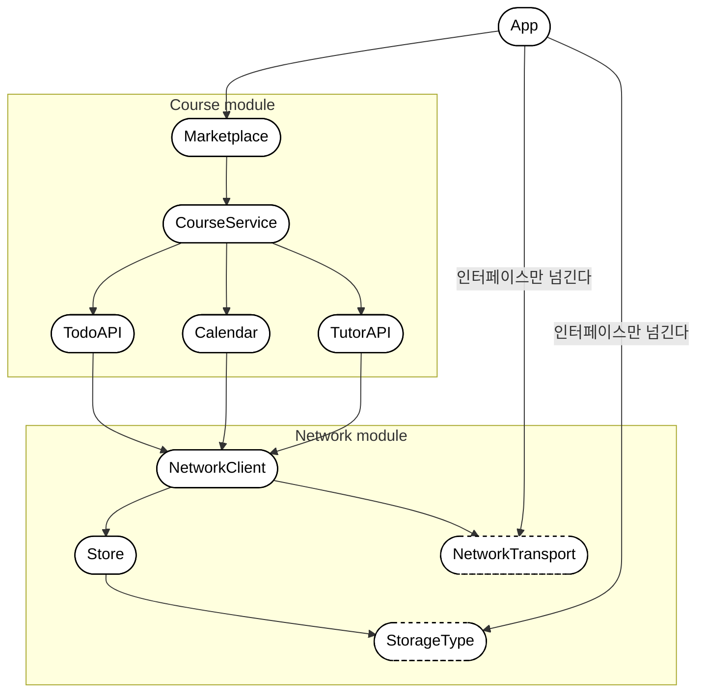
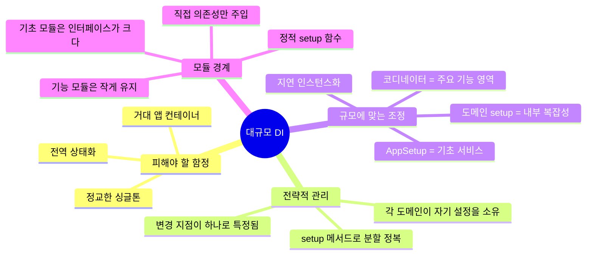

# 더 큰 규모에서의 의존성 주입 (Dependency Injection on a Larger Scale)

> 전이 의존성은 사돈 같다. 여기 있길 바라지 않았는데 어째서인지 어디에나 나타난다.

**이 챕터에서 다루는 것**

- 정적 setup 메서드로 복잡한 의존성 트리를 관리 가능한 덩어리로 쪼개는 법
- 의존성 조정을 단순화하기 위해 ABC 규칙을 **전략적으로** 깨는 시점
- 단일 기능에서 애플리케이션 전체로 의존성 설정을 계층적으로 확장하는 법
- 공개 인터페이스를 깔끔하게 유지하면서 모듈 경계를 넘어 의존성을 관리하는 법

---

코드베이스가 커지면 의존성이 복잡해진다. 사람들이 "값 전달하기(passing values around)"라고 부르던 것을 "의존성 주입(Dependency Injection)"이라고 부르기 시작하는 시점이 대개 그때다.

- 앱이 일정 규모에 도달하거나 큰 팀과 보조를 맞춰야 하면 형식화된 의존성 처리 방식을 찾게 된다.
- 그렇지 않으면 수많은 파일을 고치거나, 지름길(싱글톤)로 의존성을 전달하게 되기 때문이다.
- 하지만 **약간의 팀 합의만으로도 꽤 멀리 갈 수 있고**, 모든 흔한 문제가 고집스러운 서드파티 프레임워크를 요구하지는 않는다.
- 앞 챕터에서 단일 기능이라는 작은 범위의 ABC 문제는 풀었지만, 코드베이스가 커지면 다시 복잡해진다.

## 흔한 접근법 검토하기 (Considering a common approach)

우리 해법을 적용하기 전에, 흔히 쓰이는 대안인 **`AppContext` 컨테이너**를 먼저 보자.



- 공유되는 의존성들을 담은 클래스(또는 구조체)를 만들고, 팀은 이 컨테이너를 거의 모든 곳에 넘긴다.
- **장점**: 초기화 인자로 단 하나만 넘기면 되니 다른 이니셜라이저들이 작아진다. 새 의존성이 생겨도 컨테이너만 고치면 되고, 팩토리를 만들거나 의존성을 엮어 넘길 필요가 없다.

**트레이드오프**

- 거의 **모든** 중요한 의존성을 거의 **모든** 타입에 간접적으로 넘기게 된다.
- 이니셜라이저를 봐도 그 타입이 실제로 쓰는 의존성이 무엇인지 즉시 알 수 없다.
- "정상적인" DI를 적용하는 대신 컨테이너에 새 의존성을 툭툭 얹기가 너무 쉬워져서, 시간이 지나면 컨테이너가 **거대해진다.**
- 커지면 한계에 부딪히고, 사람들이 거대 컨테이너를 다루려고 창의력을 발휘하게 된다.
    - 계층 깊이에 따라 더 작은 컨테이너로 쪼갠다 → 유효한 전략
    - 컨테이너가 인터페이스를 준수하게 해 프로퍼티의 부분집합만 다루게 한다 → **적은 프로퍼티를 다루는 것처럼 보일 뿐, 모두가 여전히 거대한 컨테이너를 넘기고 있다.** 카펫 밑에 쓸어 넣었을 뿐이다.
- 거대 컨테이너가 **병목**이 된다. 앱 전체가 거기 의존하니 회사의 **모든** 팀이 거기 의존한다.
- 순수주의 관점에서는 **돌려쓰는 싱글톤에 가깝고**, 지름길로 볼 수 있다.
- 결국 무결성을 지키기 위한 **스레드 안전 메커니즘**이 필요해진다. 본질적으로 큰 클래스로 포장된 전역 상태이기 때문이다.

> 대안으로 우리는 애정을 담아 **"그냥 값 전달하기"** 라고 부를 접근을 계속 이어간다. *"서비스 로케이터를 이용한 제어 역전 기반 의존성 주입"* 만큼 그럴듯하진 않지만, 일은 해낸다.

## 큰 트리 쪼개기 (Breaking up larger trees)

의존성 트리가 커졌을 때의 해답은 더 많은 팩토리나 복잡한 프레임워크가 아니다. **분할 정복**이다.

손을 벗어난 전형적인 Settings 계층 구조를 보자.



- 트리 전체를 한 번에 풀지 말고 **관리 가능한 덩어리로 쪼갠다.**
- `Monetization`이 **자연스러운 경계**에 있다. 자체 설정 로직을 가질 만큼 복잡하지만, 무슨 일이 일어나는지 놓칠 만큼 깊지는 않다.

Monetization 서브도메인의 의존성 그래프를 확대해 보면 다음과 같다. (화면(Screen)은 이중 테두리로 표시)



- 맨 위에서 전부 엮는 대신, **`Monetization`이 자기 서브트리 조립을 책임지게** 한다.
- 먼저 **말단 의존성(leaf dependencies)** 을 찾는다 → `User`, `NetworkClient`, `Store` (위 그림의 굵은 테두리)
- 그다음 이 말단 의존성들을 커스텀 `setup` 메서드에 넘겨 `Monetization`의 전체 트리를 세운다.

> `NetworkClient` 자체도 의존성이 있다. 하지만 이 단계에서는 **이미 생성되었다고 가정**하므로, 여기서 `NetworkClient`의 의존성은 신경 쓰지 않아도 된다.

`setup()`은 Monetization의 **인스턴스**에 묶이지 않으므로 정적 함수를 쓴다.

```kotlin
class Monetization(
    private val user: User,
    private val store: Store,
    private val paymentSettings: PaymentSettings
) {
    companion object {
        fun setup(
            user: User,
            networkClient: NetworkClient,
            store: Store
        ): Monetization {
            // 서브트리를 상향식(bottom-up)으로 조립한다
            val providerLinks = ProviderLinks(
                user = user,
                store = store
            )

            val paymentProviders = PaymentProviders(
                networkClient = networkClient,
                providerLinks = providerLinks
            )

            val paymentSettings = PaymentSettings(
                networkClient = networkClient,
                user = user,
                paymentProviders = paymentProviders
            )

            return Monetization(
                user = user,
                store = store,
                paymentSettings = paymentSettings
            )
        }
    }
}
```

> **Swift → Kotlin 변환 노트**
> Swift는 `extension Monetization { static func setup(...) }` 으로 원본 타입 **밖에서** 정적 메서드를 덧붙였다. Kotlin에는 확장 프로퍼티/함수는 있어도 **정적 멤버를 외부에서 추가하는 기능은 없다.** 그래서 `companion object` 안에 넣는 것이 정석이다.
> 굳이 클래스 선언 밖에 두고 싶다면 `fun Monetization.Companion.setup(...)` 확장 함수를 쓸 수 있지만, 그러려면 클래스에 빈 `companion object`가 미리 선언되어 있어야 한다.

- 지난 챕터와 정확히 같은 접근이다. 지금은 애플리케이션 더 깊은 곳의 **서브트리**에 집중하고 있을 뿐이다.
- 여기서 **`setup` 메서드는 ABC 규칙을 깬다.** `Monetization`이 `NetworkClient`를 직접 쓰지 않을지도 모르는데 `setup`은 그것을 안다.
- 하지만 이건 **의도적**이다. DI를 **예측 가능한 한 곳**에 집중시키는 것이다.

### Settings가 의존성 허브가 된다 (Settings becomes a dependency hub)

- 한 발 물러서서 보면 `Settings` 클래스가 훨씬 단순해진다.
- 자기 서브트리를 설정하는 법을 알 필요가 없다. **각 도메인이 스스로 설정한다.**
- `Settings`가 할 일은 `User`, `Store`, `NetworkClient` 같은 **기초 타입만 넘기는 것**이다.

```kotlin
class Settings(
    private val user: User,
    private val store: Store,
    private val networkClient: NetworkClient
) {

    fun openMonetization(): Monetization {
        return Monetization.setup(
            user = user,
            store = store,
            networkClient = networkClient
        )
    }

    // 다른 설정 섹션들도 비슷한 메서드를 가진다
    fun openSecurity(): Security {
        return Security.setup(user = user, store = store)
    }

    fun openPrivacy(): Privacy {
        return Privacy.setup(user = user, networkClient = networkClient)
    }
}
```

- 이제 `Monetization`, `Security`, `Privacy` 도메인을 **추출하거나 옮기는 것**, 심지어 **각자의 모듈로 분리하는 것**도 비교적 쉬워졌다.

### 이 접근이 통하는 이유 (Why this approach works)

- **소유권이 명확해진다.** `Monetization`이 자기 서브트리 조립을 책임지면, 어디를 봐야 할지 정확히 알 수 있다. 열 개의 setup 메서드 중 어느 것이 관여하는지 추측할 필요가 없다.
- **복잡성이 관리 가능해진다.** 스무 개 넘는 의존성을 담은 거대한 setup 메서드 하나와 씨름하는 대신, 도메인마다 초점이 잡힌 setup 메서드를 다룬다. 각 메서드는 단일하고 명확한 목적과 한정된 관심사를 가진다.
- **변경이 쉬워진다.** Monetization 설정에 새 의존성을 추가하려면 정확히 한 메서드, `Monetization.setup()`만 건드리면 된다. 새 의존성을 어디로 꿰어 넣어야 할지 setup 코드 계층을 뒤질 필요가 없다.

### 전체 그림 (The complete picture)

더 멀리서 보면 `AppSetup`이 `Settings`를 어떻게 설정하는지 볼 수 있다. 놀랄 만큼 단순해진다.

```kotlin
object AppSetup {

    fun setupSettings(): Settings {
        val user = User.current

        val storageType = MemoryStorage()
        val store = Store(storageType = storageType)

        // 지난 챕터의 setupNetworkClient()를 사용한다
        val networkClient = setupNetworkClient()

        return Settings(
            user = user,
            store = store,
            networkClient = networkClient
        )
    }

    // ... snip
}
```

- 이게 전부다. 복잡성은 여전히 존재하지만, **정리되었고 담겨 있다.**

### setup 경계를 언제 만들 것인가 (When to create setup boundaries)

*"setup 메서드를 어디에 둘 것인가?"*

| 신호 | 설명 |
| --- | --- |
| **내부 의존성 3개 초과** | 관계가 자체 조정 로직을 가질 만큼 복잡하다는 신호 |
| **도메인 경계** | 결제·보안·사용자 관리처럼 응집된 도메인이면 그 도메인이 자기 설정을 소유. DDD 원칙과도 일치 |
| **반복** | 같은 기초 의존성 묶음을 setup 코드 전반에서 반복해 넘기고 있다면 추출 대상 |
| **다른 클래스에 미치는 영향** | setup 로직 때문에 다른 클래스가 자기 도메인 밖 관심사를 알아야 한다면, setup 메서드가 그 복잡성을 담아낸다 |

- 다만 **사소한 것마다 setup 메서드를 만들려는 충동은 억제하라.** 의존성 하나둘짜리 단순한 클래스에는 자체 setup 메서드가 필요 없다.
- 또한 **어떤 곳은 ABC 규칙을 깨야 한다는 것을 받아들이고**, 그런 장소를 예측 가능하고 잘 담긴 곳으로 만들어라.
- 복잡성을 클래스 전반에 흩뿌리는 대신 setup 메서드에 집중시키면, DI의 이점을 유지하면서 코드가 커져도 관리 가능하게 유지할 수 있다.

## 앱 전체에 걸친 의존성 (Dependencies across an entire app)

- 앱을 **setup 책임의 계층 구조**로 생각할 수 있다.
- `Monetization`이 결제 서브트리의 설정을 소유했듯, 다른 의존성 허브들이 각자 도메인의 설정을 소유한다.
- 예를 들어 각 탭을 설정하는 `TabBarCoordinator`, 자기 의존성 트리를 세우는 `Payments` 도메인이 있을 수 있다.



앱에는 자연스러운 **조정 레벨**이 있다.

- **AppSetup** — 기초 서비스 담당 (스토리지, 네트워킹, 인증)
- **기능 코디네이터** — 주요 앱 영역 담당 (로그인 이후 기능을 관리하는 `TabBarCoordinator` 등)
- **도메인 setup 메서드** — 특정 복잡성 담당 (`Marketplace.setup()`, `Settings` 하위 도메인 등)

### 허브를 통한 지연 인스턴스화 (Lazy instantiation through hubs)

- 이 패턴의 중요한 장점은 **자연스러운 지연 인스턴스화**다.
- 의존성 허브는 관리하는 기능들을 미리 전부 만들 필요가 없다. 사용자가 앱을 탐색함에 따라 **필요할 때 생성**하면 된다.

```kotlin
class TabBarCoordinator(
    private val user: User,
    private val store: Store,
    private val networkClient: NetworkClient
) {

    // 필요할 때만 settings를 생성한다
    fun setupSettings(): Settings {
        return Settings(
            user = user,
            store = store,
            networkClient = networkClient
        )
    }

    // 필요할 때만 marketplace를 생성한다
    fun setupMarketplace(): Marketplace {
        return Marketplace(
            user = user,
            store = store,
            networkClient = networkClient
        )
    }
}
```

- **비싸거나 드물게 쓰이는 기능이 실제로 필요할 때만 생성되면서도**, 올바른 의존성 주입의 이점은 그대로 유지된다.

## 이 접근의 단점 (Downsides of our approach)

- 우리 설정의 이점은 **조상 클래스가 전이 의존성에 맞춰 갱신될 필요가 없다**는 것이다. `NetworkClient`가 바뀌어도 `CourseService`는 전혀 바뀌지 않는다.
- 하지만 setup 위치처럼 **ABC 규칙을 깨는 곳들은 전이 의존성에 맞춰 갱신되어야 한다.**
    - `Settings`에 새 의존성을 추가하면, `Settings`의 setup 메서드를 담고 있는 `AppSetup`**도** 함께 고쳐야 한다.
- 이 문제는 앱의 모든 setup 위치에 해당한다. 하지만 **DI를 단순하게 유지하고 나머지 모든 곳을 "순수"하게 유지하기 위해 치를 만한 좋은 트레이드오프**다.

### 지름길보다 장황하다 (More verbose than shortcuts)

- 싱글톤이나 서비스 로케이터에 비해 **더 명시적인 코드**를 요구한다. setup 메서드를 더 많이 쓰고 파라미터를 더 많이 넘긴다.
- 이 장황함이 의존성을 명시적이고 예측 가능하게 만들지만, "마법" 같은 해법에 비하면 무겁게 느껴질 수 있다.
- 그것이 트레이드오프다. 다른 개발자가 **새 프레임워크나 서드파티 솔루션, 유행하는 패턴을 배우지 않고도** 의존성이 어떻게 전달되는지 볼 수 있다. 언어와 플랫폼을 가로질러 통하는, 시대를 타지 않는 방식이다.

### setup 메서드 찾기 (Setup method discovery)

- 앱이 커지면 특정 기능에 맞는 setup 메서드를 **찾는 일** 자체가 어려워질 수 있다.
- 적절한 조직화나 문서화가 없으면 엔지니어들이 특정 의존성이 어디서 구성되는지 찾느라 헤맨다.
- **좋은 네이밍 컨벤션과 명확한 소유권**이 이를 완화한다.

## 모듈형 앱에서 의존성 전달하기 (Passing dependencies across a modular app)

- 개발자들은 큰 앱을 격리된 기능을 담은 여러 모듈로 쪼개는 경향이 있다.
- 모듈 간 의존성을 다룰 때는 새롭고 중요한 요소가 등장한다 → **공개 인터페이스(public interface)**
- 공개 인터페이스를 작게 유지하는 법, 두 모듈 사이 또는 앱과 모듈 사이의 **강한 결합을 줄이는 법**을 고려해야 한다.

> **모듈에서 많은 타입을 노출할수록 모듈과 그 사용처 사이의 강한 결합 가능성이 커진다.** 그러면 모듈을 안정적으로 유지하거나 부분을 독립적으로 옮기기 어려워진다.

### 모듈형 앱 (A modular app)

- `Marketplace`, `CourseService`, 관련 도메인을 담은 **`Course` 모듈**
- `NetworkClient`, `NetworkTransport` 같은 네트워킹 기능은 **`Network` 모듈** — `Course`뿐 아니라 많은 기능을 지원할 수 있는 기초 코드이므로 독립 모듈로 존재할 만하다.
- **`Course` 모듈은 `Network` 모듈의 `NetworkClient`에 의존한다.**



```kotlin
// 이 코드는 app 모듈에 있다
// app은 이제 Course, Network 모듈에 의존한다
import com.example.course.Marketplace
import com.example.network.MemoryStorage

object AppSetup {

    fun setupMarketplace(): Marketplace {
        // 나머지는 전부 이전과 동일하다
        val storage = MemoryStorage()

        // ... 이전과 같으므로 생략

        val marketplace = Marketplace(courseService = courseService)
        return marketplace
    }

    // ... 나머지 생략
}
```

> **Swift → Kotlin 변환 노트**
> Swift의 `import Course` / `import Network`는 **모듈 단위 임포트**다. Kotlin/Gradle에는 대응물이 없다. 모듈 의존성은 코드가 아니라 **빌드 스크립트**에 선언한다.
> ```kotlin
> // app/build.gradle.kts
> dependencies {
>     implementation(project(":course"))
>     implementation(project(":network"))
> }
> ```
> 그리고 코드에서는 **패키지 단위 임포트**를 한다. 뒤에 나올 `public` / `internal` 논의에서 이 차이가 중요해진다.

### 거미줄 속의 거미 (A spider in the web)

- 앞서 ABC 문제를 풀기 위해 `Marketplace`를 **상향식으로** 만들었다. `Store`와 `NetworkTransport`를 먼저 초기화하고 나머지를 만들었다.
- 그런데 이 모듈형 구성에서는 문제가 생긴다.
- `setupMarketplace()`가 다루는 **모든** 타입이 이제 모듈 안에 산다. 그런데 **앱이 모든 의존성을 설정하므로, 모든 의존성이 `public`이어야 하고 앱에 노출된다.**
    - `Course` 모듈: `TutorAPI`, `TodoAPI`, `Calendar`, `CourseService`, `Marketplace` 전부 public
    - `Network` 모듈: 내부의 모든 타입도 public
- 그래서 **앱이 거미줄 속의 거미가 된다. 모든 것을 알고 있다.**



이 강한 결합은 **두 가지 이유**로 발생한다.

1. 타입을 **너무 많이 노출**하고 있다.
2. 앱이 **모든** 의존성을 설정할 책임을 진다.

- 타입이 자신의 전이 의존성을 **모르도록** 열심히 노력했다. 그런데 역설적이게도 이것이 **모듈 수준에서 강한 결합을 만들어냈다.**
- 이 문제를 풀려면 **앱이 모듈의 전이적(더 깊은) 타입을 모르게** 해야 한다.

## 모듈 간 강한 결합 줄이기 (Reducing tight coupling between modules)

- `setupMarketplace()` 전체를 `Course` 모듈로 그냥 옮길 수 있다면 좋겠지만, 그렇게는 안 된다. **앱이 네트워크와 스토리지를 결정**하고 따라서 그것들을 주입해야 하기 때문이다.
- 하지만 앱이 `Course` 모듈 **내부의** 의존성을 모르도록 설정할 수는 있다.
- 먼저 **`Course` 모듈 아래에 있는 가장 높은 의존성**을 찾는다 → 그래프상 `NetworkClient`가 `Course` 모듈 계층의 바닥에 가장 가깝다.
- `NetworkClient`는 `Course` 모듈의 **직접 의존성**이므로, 앱이 `NetworkClient` 인스턴스를 `Course` 모듈에 넘기게 한다.
- 그러면 앱은 `Course` 모듈 내부의 모든 의존성을 알 필요가 **없어진다.**

### 코드로 해법 표현하기 (Expressing a solution in code)

```kotlin
// 이 코드는 app 모듈에 있다
import com.example.course.Marketplace
import com.example.network.NetworkClient

object AppSetup {

    fun setupMarketplace(): Marketplace {
        val networkClient = setupNetworkClient()

        // Before: Marketplace에 courseService를 넘겼다
        // val marketplace = Marketplace(courseService = courseService)

        // NEW: 이제 Marketplace에 networkClient 인스턴스만 넘긴다
        return Marketplace(networkClient = networkClient)
    }

    fun setupNetworkClient(): NetworkClient {
        // ... 나머지 생략
    }
}
```

### ABC 문제가 다시 나타난다 (The ABC problem appears again)

앱에서 `NetworkClient`를 `Marketplace`에 넘기므로 이니셜라이저를 고쳐야 한다. 하지만 이것이 **순진한 해법**임을 알 수 있다.

```kotlin
// 이 코드는 Course 모듈 안에 있다
package com.example.course

import com.example.network.NetworkClient

// Marketplace는 이제 public이다 (Kotlin의 기본값)
class Marketplace(networkClient: NetworkClient) {

    private val courseService: CourseService

    // 이니셜라이저도 public이라서 앱이 사용할 수 있다
    init {
        // 순진한 해법! 전이 의존성을 그대로 넘기고 있다
        val tutorAPI = TutorAPI(networkClient = networkClient)
        val todoAPI = TodoAPI(networkClient = networkClient)
        val calendar = Calendar(networkClient = networkClient)

        // NetworkClient를 사용해 CourseService 인스턴스를 초기화할 수 있다
        this.courseService = CourseService(
            tutorAPI = tutorAPI,
            todoAPI = todoAPI,
            calendar = calendar
        )
    }

    // ... 나머지 생략
}
```

- 그런데 이런, **ABC 문제를 다시 만들었다.**
- `NetworkClient`를 `Marketplace` 이니셜라이저에 넘기는데, `Marketplace`는 그것을 **직접 쓰지 않는다.**
- `Marketplace`가 전이 의존성을 알게 되어 ABC 규칙을 깼다.

### 모듈 경계를 넘는 ABC 문제 해결하기 (Solving the ABC problem across module bounds)

처리 방법이 몇 가지 있다.

- **하나는 이 트레이드오프를 받아들이는 것.** `Marketplace`가 자기 전이 의존성을 아는 대가로 더 작은 공개 인터페이스를 얻는다. 공개 인터페이스를 작게 유지하는 편이 더 중요하다고 선언할 수 있다.
- 하지만 더 깔끔하게 정리할 수 있다. **책임**을 생각해 보면 된다.

> *의존성을 설정하는 것이 정말 `Marketplace`의 책임인가?*

- `Marketplace`의 이니셜라이저에서 설정하는 대신, `Course` 모듈에 **setup 함수**를 제공한다. 이 함수는 `Marketplace` **바깥**에 살 수 있다.
- 클래스 인스턴스의 상태가 필요 없으므로 **정적 함수**를 쓴다. 이 함수가 setup 함수 또는 팩토리 역할을 한다.
- 정적 함수는 어디에나 둘 수 있으니 **네임스페이스**에 붙인다.

```kotlin
// 이 코드는 Course 모듈 안에 있다
package com.example.course

import com.example.network.NetworkClient

object Course {

    // 정적 함수다
    fun setupMarketplace(networkClient: NetworkClient): Marketplace {
        // 이전처럼 CourseService의 의존성들을 인스턴스화할 수 있다
        val tutorAPI = TutorAPI(networkClient = networkClient)
        val todoAPI = TodoAPI(networkClient = networkClient)
        val calendar = Calendar(networkClient = networkClient)

        // 그리고 그 타입들을 CourseService에 넘긴다
        val courseService = CourseService(
            tutorAPI = tutorAPI,
            todoAPI = todoAPI,
            calendar = calendar
        )

        // CourseService로 Marketplace를 초기화한다
        return Marketplace(courseService = courseService)
    }
}
```

> **Swift → Kotlin 변환 노트**
> Swift에서 네임스페이스로 `enum`을 쓰는 이유는 **케이스가 없는 enum은 인스턴스를 만들 수 없기 때문**이다. (빈 `struct`는 `Course()`로 만들 수 있어서 부적절하다.)
> Kotlin에는 `object` 선언이 있어 이 트릭이 필요 없다. 더 나아가 Kotlin에서는 **최상위 함수**를 그냥 쓰는 편이 더 관용적이다.
> ```kotlin
> package com.example.course
> fun setupMarketplace(networkClient: NetworkClient): Marketplace { ... }
> ```
> 이러면 패키지 자체가 네임스페이스 역할을 한다. 다만 `Course.setupMarketplace(...)`라는 호출부의 명시성을 원한다면 `object`가 낫다.

- **`Marketplace` 생성을 인스턴스로부터 분리했다.** 이로써 `Marketplace` 자신은 `NetworkClient`를 모르게 된다.
- 정적 함수이므로 **옮기기가 매우 쉽다.** 발견 가능성(discoverability)을 위해 `Marketplace` 자체에 둘 수도 있다. 단 이번에도 **정적 함수로 유지**해서 인스턴스가 `NetworkClient`를 모르도록 보장한다.

```kotlin
// 이 코드는 Course 모듈 안에 있다
package com.example.course

import com.example.network.NetworkClient

class Marketplace internal constructor(
    private val courseService: CourseService
) {

    companion object {
        // 인스턴스 메서드가 아니다.
        // Marketplace 인스턴스는 NetworkClient를 *모른다*
        fun setupMarketplace(networkClient: NetworkClient): Marketplace {
            val tutorAPI = TutorAPI(networkClient = networkClient)
            val todoAPI = TodoAPI(networkClient = networkClient)
            val calendar = Calendar(networkClient = networkClient)

            val courseService = CourseService(
                tutorAPI = tutorAPI,
                todoAPI = todoAPI,
                calendar = calendar
            )
            return Marketplace(courseService = courseService)
        }
    }

    // ... 나머지 생략
}
```

> **Swift → Kotlin 변환 노트 ⚠️ 중요**
> Swift는 **접근 제어자의 기본값이 `internal`**(모듈 내부)이라, 원문의 `Marketplace(courseService:)` 이니셜라이저는 별도 표기 없이도 **이미 모듈 외부에 감춰져 있다.**
> Kotlin은 **기본값이 `public`**이므로, 같은 효과를 내려면 `internal constructor`를 **명시해야 한다.**
>
> 이건 단순한 문법 차이가 아니라 이 장의 논지와 직결된다. `internal constructor`를 붙이면 앱은 `Marketplace.setupMarketplace(networkClient)`로만 생성할 수 있고 `Marketplace(courseService)`로는 만들 수 없다. 즉 **`CourseService`를 public으로 노출하지 않아도 된다.**
> 반대로 이걸 빠뜨리면 "`Marketplace`만 public으로 만든다"는 이 절의 성과가 **통째로 사라진다.**
> Kotlin의 `internal`은 Gradle 모듈 단위로 동작하므로 Swift의 module-internal과 거의 정확히 대응한다.

마지막으로 앱이 팩토리 함수를 쓰도록 고친다.

```kotlin
// 이 코드는 app 모듈에 있다

// 기존...
return Marketplace(networkClient = networkClient)

// ...가 이렇게 바뀐다
return Marketplace.setupMarketplace(networkClient = networkClient)

// 또는 대안으로...
return Course.setupMarketplace(networkClient = networkClient)
```

- 이제 **모듈이 자기 의존성 설정을 스스로 책임지므로**, 모듈의 이식성이 높아지고 **어떤 위치에서든** 설정하기 쉬워진다.

### 더 깔끔해진 그래프 (A cleaner graph)

- 앱은 이제 `Course` 모듈에서 **`Marketplace`만** 알고 있다.
- `Marketplace`는 `Course` 도메인 안에서 public으로 만들어야 하는 **유일한 타입**이다.
- 그 결과 **앱과 `Course` 모듈 사이의 강한 결합이 사라진다.**



- 강한 결합이 줄어드니 코드베이스를 다루기 쉬워지고 유연성이 커진다.
- 이 모듈을 앱 워크스페이스 **밖으로 빼내 자체 저장소로 옮기는 것**도 이제 훨씬 쉽다.
- 다만 **앱은 여전히 `NetworkClient` 모듈 내부의 모든 타입을 알고 있다.**

## 기초 모듈의 강한 결합 줄이기 (Reducing tight coupling for foundational modules)

- 실무에서 `NetworkClient`, `Store` 같은 **기초 모듈의 타입이 public인 것은 흔한 일**이다.
- 그렇지만 앱과 `Network` 모듈 사이의 강한 결합을 **더** 줄일 수도 있다. **계층에서 가장 낮은 타입만 넘김으로써** 달성한다.
- 이것은 강한 결합을 상당히 정리해 준다. 다만 **공개 인터페이스를 작게 유지해 주지는 않는다.**
- 앱이 `MemoryStorage` 같은 `StorageType`과, 환경에 따라 `ProductionTransport` / `StagingTransport` 같은 `NetworkTransport`를 넘긴다. 그러면 **`Course` 모듈이 전체 의존성 트리를 세운다.**

```kotlin
// 이 코드는 app 모듈에 있다
import com.example.course.Marketplace
import com.example.network.MemoryStorage
import com.example.network.NetworkTransport
import com.example.network.ProductionTransport
import com.example.network.StagingTransport

object AppSetup {

    fun setupMarketplace(): Marketplace {
        val transport: NetworkTransport = if (BuildConfig.DEBUG) {
            StagingTransport()
        } else {
            ProductionTransport()
        }

        // 이제 storage와 transport를 넘긴다
        return Marketplace.setupMarketplace(
            storageType = MemoryStorage(),
            transport = transport
        )
    }

    // ... 나머지 생략
}
```

> **Swift → Kotlin 변환 노트**
> Swift의 `#if DEBUG` / `#else` / `#endif`는 **컴파일 타임 조건부 컴파일**이라, 릴리스 빌드에는 `StagingTransport()` 코드 자체가 바이너리에 포함되지 않는다.
> Kotlin/JVM에는 전처리기가 없어 `BuildConfig.DEBUG`(런타임 상수)로 대체한다. 다만 `BuildConfig.DEBUG`는 `static final boolean`이라 **R8/ProGuard가 릴리스 빌드에서 죽은 가지를 제거**하므로 실질적으로 유사한 결과를 얻는다.
>
> 더 엄밀한 컴파일 타임 분리를 원한다면 Android의 **소스셋**을 쓰는 것이 정석이다. `src/debug/`와 `src/release/`에 같은 시그니처의 `provideTransport()`를 각각 두면 반대편 코드는 아예 컴파일되지 않는다. 이전 챕터의 *"컴파일러 플래그를 진입점에 모아라"* 의 Android식 구현이다.

나머지 코드는 `Course` 모듈 안의 `setupMarketplace(storageType, transport)` 함수로 옮겨간다.

```kotlin
// 이 코드는 Course 모듈 안에 있다
package com.example.course

import com.example.network.NetworkClient
import com.example.network.NetworkTransport
import com.example.network.StorageType
import com.example.network.Store

class Marketplace internal constructor(
    private val courseService: CourseService
) {

    companion object {
        // setupMarketplace 함수는 이제 NetworkClient 대신
        // NetworkTransport와 StorageType 인터페이스를 받는다
        fun setupMarketplace(
            storageType: StorageType,
            transport: NetworkTransport
        ): Marketplace {
            // 그러면 Store를 초기화하고 이전처럼 진행할 수 있다
            val store = Store<ByteArray>(storageType = storageType)

            // 넘겨받은 transport로 NetworkClient를 설정한다
            val networkClient = NetworkClient(
                transport = transport,
                store = store
            )

            val tutorAPI = TutorAPI(networkClient = networkClient)
            val todoAPI = TodoAPI(networkClient = networkClient)
            val calendar = Calendar(networkClient = networkClient)

            val courseService = CourseService(
                tutorAPI = tutorAPI,
                todoAPI = todoAPI,
                calendar = calendar
            )
            return Marketplace(courseService = courseService)
        }
    }

    // ... 나머지 생략
}
```

> **Swift → Kotlin 변환 노트**
> 원문의 `Store<Data>`에서 Swift의 `Data`는 바이트 버퍼 타입이다. Kotlin/JVM에서는 `ByteArray`가 가장 가까운 대응이다.

그래프를 보면 의존성이 상당히 정리되었다.



- setup 코드 대부분이 `Course` 모듈로 옮겨갔다. **강한 결합은 상당히 줄었다. 하지만 공개 인터페이스는 줄이지 못했다.**
- `NetworkClient`, `Store`, `NetworkTransport`, `StorageType`은 `Course` 모듈이 사용하므로 **여전히 public이어야 한다.**

### 기초 모듈 vs 기능 모듈

| | 기초 모듈 (Network) | 기능 모듈 (Course) |
| --- | --- | --- |
| 추상화 수준 | 낮음 (스택 아래쪽) | 높음 |
| 담고 있는 것 | 빌딩 블록 · 프리미티브 | 특화되고 의견이 강한 하나의 완결된 플로우 |
| 공개 인터페이스 | 작게 유지하기 **어렵다** | 작게 유지하기 **쉽다** |
| 이번 사례 결과 | 4개 타입 public | `Marketplace` 1개만 public |

- 기초 모듈은 다른 기능들을 지원하기 위해 public이어야 하는 타입이 많으므로 공개 인터페이스가 커지기 마련이다. **그리고 그것은 받아들일 만하다.**
- 반면 `Course` 모듈은 수많은 다른 기능을 위한 빌딩 블록이 아니다. 그래서 공개 인터페이스가 작게 유지될 수 있다.

## 결론 (Conclusion)

화려한 기교 없이 얼마나 멀리 왔는지 잠시 음미해 보자.

- 직접 만든 커스텀 라이브러리도, **서드파티 프레임워크도** 쓰지 않았다.
- **싱글톤**에 기대지 않았다.
- **서비스 로케이터, 관점 지향 프로그래밍, 영리한 서브클래스 오버라이드** 같은 복잡한 방법도 쓰지 않았다.
- 프로퍼티 래퍼, 스위즐링, `@EnvironmentObject` 의존처럼 **Swift · iOS · SwiftUI · UIKit 고유의 기능조차** 쓰지 않았다.

> **우리는 그저 아주 따분한 방식으로 값을 전달했을 뿐이다.**

- 따분함은 회사의 온갖 종류의 엔지니어가 코드를 이해하기 쉽게 만든다. **이것은 큰 승리다.**
- 모든 의존성이 setup 메서드에 통합되어 있다는 것의 이점은 **새 의존성을 어디에 추가해야 할지 명확하다**는 점이다.

> **TIP:** 우리 접근은 Swift 고유도, iOS 고유도 아니므로 이 "따분한" 기법을 **아주 다양한 언어와 플랫폼에 적용할 수 있다!**
> → *이 책이 Swift로 쓰였는데도 이 챕터 전체를 Kotlin으로 옮길 수 있었던 이유가 바로 이것이다.*

### 트레이드오프 (Trade-offs)

- 단점은 계층 구조가 정말 복잡해지면 **의존성 하나를 엮어 넣는 데 더 많은 작업이 들 수 있다**는 것이다.
- 이건 "값 전달하기" 접근에만 있는 문제는 아니다. 다만 **의존성을 어디서 찾을 수 있고 어떻게 추가하는지가 명확해야 한다.** **좋은 문서화가 큰 도움이 된다.**
- 그렇지 않으면 시간 압박이나 다른 어려움 때문에 팀원들이 ABC 규칙을 깨거나 싱글톤을 도입한다.
- **ABC 규칙을 깨는 것이 세상의 끝은 아니다.** 여전히 의존성을 전달하고 있으니까. 다행히 ABC 문제를 피하도록 리팩터링하는 일은, **프로퍼티가 빠졌다고 알려주는 컴파일러** 덕분에 꽤 직관적일 수 있다.

---

## 정리 (What we covered)



### 의존성 복잡성의 함정 피하기

- 거대한 앱 컨테이너는 이니셜라이저를 작게 유지해 주니 매력적으로 보이지만, **숨은 병목과 강한 결합**을 만든다
- 모든 기능이 거대 컨테이너에 의존하면, 본질적으로 **정교한 싱글톤**을 만든 것이다
- 복잡성을 감추는 대신, 쪼개서 **자연스럽게 속하는 곳으로 책임을 분산**하라
- 앱 컨테이너는 성숙해지면 동기화 메커니즘이 필요해지고, 그럴수록 **전역 상태에 가까워진다**

### 전략적 의존성 관리

- setup 메서드로 복잡한 의존성 트리를 관리 가능한 덩어리로 쪼개라
- **각 도메인이 자기 내부 의존성의 설정을 소유하게 하라**
    - 이것이 명확한 소유권 경계를 만들고 변경을 예측 가능하게 한다
- 새 의존성을 추가해야 할 때, **어디로 가서 무엇을 건드릴지 정확히 알 수 있다**

### 규모에 맞는 조정

- 각 레벨이 자신의 **직접 관심사에만** 집중하는 계층 구조로 의존성 설정을 설계하라
- 메인 setup 메서드는 기초 서비스를, 의존성 허브는 주요 기능 설정을, 도메인은 자기 내부 복잡성을 담당한다
- 이 패턴은 자연스럽게 확장되며, **비싼 기능은 필요할 때만 생성되는 지연 인스턴스화를 지원한다**
- **핵심 위치에서 ABC 규칙을 전략적으로 깨되, 예측 가능한 곳으로 제한하라**

### 모듈 경계와 공개 인터페이스

- 모듈을 넘나들 때는, **모듈이 자기 내부 의존성 설정을 스스로 처리하게 함으로써** 공개 인터페이스를 최소화하라
- 모듈에 기초 의존성을 넘기고 **정적 setup 함수**를 사용하면, 결합도를 낮게 유지하면서 ABC 문제를 피할 수 있다
- **기초 모듈은 기능 모듈보다 공개 인터페이스가 자연히 크다. 그리고 그것은 받아들일 만하다**
- 기능 모듈은 더 많은 가정을 담고 다른 기능의 빌딩 블록 역할이 덜하므로, 공개 인터페이스를 더 작게 유지할 수 있다
- 기초 모듈과 그 사용처 사이의 강한 결합을 최소화하려면, **스택에서 가장 낮은 요소들을 public으로** 만들면 된다

---

## 부록: Swift → Kotlin 변환 요약

| Swift | Kotlin | 비고 |
| --- | --- | --- |
| `extension Type { static func }` | `companion object { fun }` | Kotlin은 정적 멤버를 외부에서 추가할 수 없다 |
| `enum Course { }` (네임스페이스) | `object Course { }` 또는 최상위 함수 | Swift의 케이스 없는 enum 트릭이 불필요 |
| `import Course` (모듈) | Gradle `implementation(project(":course"))` | 코드가 아닌 빌드 스크립트에 선언 |
| 기본 접근 제어 = `internal` | 기본 = `public`, `internal` 명시 필요 | ⚠️ **결론이 뒤집히는 지점** |
| `#if DEBUG` | `BuildConfig.DEBUG` 또는 소스셋 분리 | 전자는 R8이 제거, 후자가 진짜 컴파일 타임 분리 |
| `Data` | `ByteArray` | 바이트 버퍼 |
| `let x = Type(a: a)` | `val x = Type(a = a)` | named argument는 Kotlin에도 있어 거의 1:1 |

가장 주의할 항목은 **접근 제어 기본값**이다. "모듈 경계를 넘는 ABC 문제 해결하기" 절의 요지가 *"`Marketplace`만 public으로 만들고 `CourseService`는 감춘다"* 인데, Kotlin에서 `class Marketplace(private val courseService: CourseService)`로 그대로 옮기면 **생성자가 public이라 `CourseService`도 public이 되어야 하고, 이 장의 성과가 통째로 사라진다.** `internal constructor`가 반드시 필요하다.

## 부록: Hilt로 옮긴다면

이 챕터의 수동 조립을 Hilt에 대응시키면 다음과 같다. 원리는 동일하고, **누가 조립 코드를 쓰느냐**만 다르다.

| 이 챕터의 바닐라 DI | Hilt |
| --- | --- |
| `AppSetup` | `@HiltAndroidApp` + 생성된 `SingletonComponent` |
| `Monetization.setup()` 등 도메인 setup | 도메인별 `@Module` + `@Provides` |
| `TabBarCoordinator`의 지연 생성 | `Provider<T>` / `dagger.Lazy<T>` |
| `Marketplace.setupMarketplace(networkClient)` | `@AssistedInject` + `@AssistedFactory` |
| `BuildConfig.DEBUG` 분기 | `debug` / `release` 소스셋별 모듈 |
| `internal constructor`로 공개 인터페이스 축소 | 동일하게 `internal` + `@Module`만 public |

핵심은 Hilt를 써도 **ABC 규칙과 모듈 공개 인터페이스 설계는 여전히 개발자의 몫**이라는 점이다. Hilt는 그래프의 위상 정렬을 자동화할 뿐, "어떤 타입을 public으로 노출할 것인가"는 자동으로 풀어주지 않는다.
