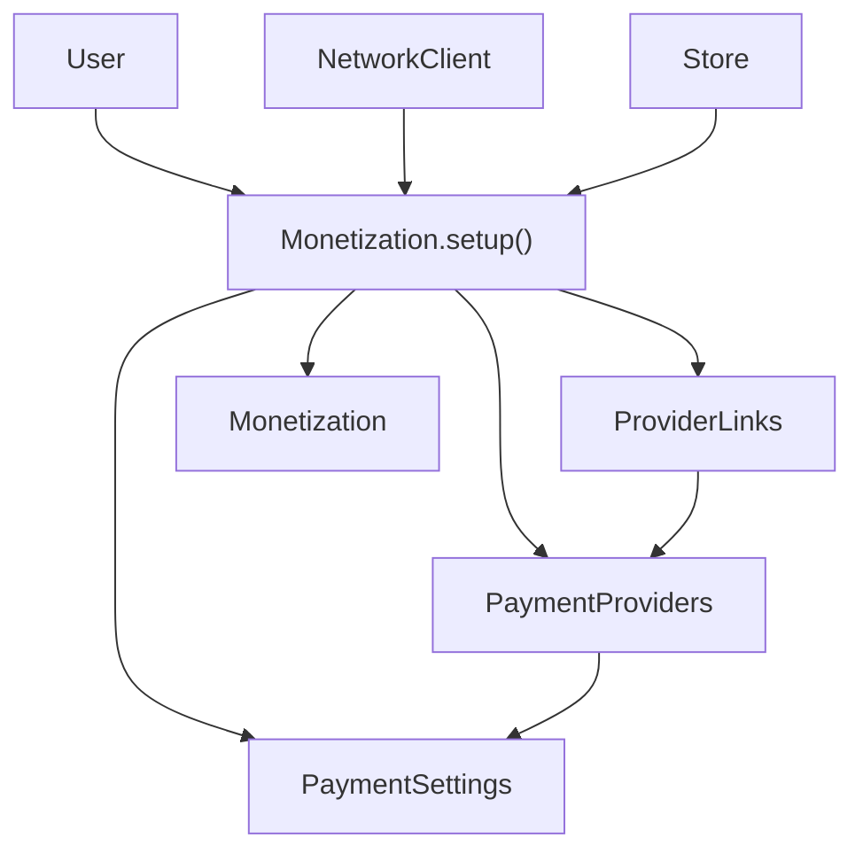
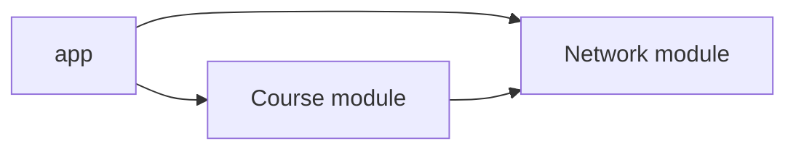
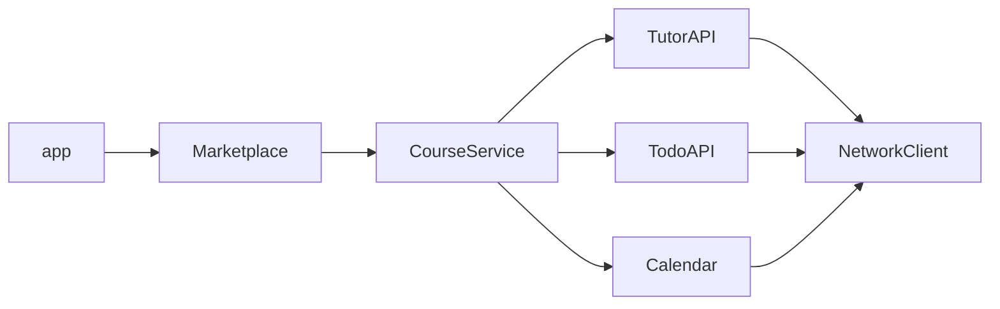

# [WEEK 14] Book 0 Chapter 9
📖 Mobile System Design 0. From Briefings to System Architecture  

<br>

## 9. Dependency Injection on a Larger Scale
> dependency tree가 커지면 하나의 거대한 setup에 모든 연결을 몰아넣지 않는다. 각 domain과 feature가 자신의 subtree를 조립하게 만들어 dependency를 관리한다.

### Considering a common approach

많은 dependency를 `AppContext` 같은 container에 모아 여러 type에 전달하는 방식이다. initializer에는 container 하나만 전달하면 되므로 시작하기는 쉽다.  

**장점**

- dependency를 추가할 때 container만 수정하면 된다.
- 각 initializer에 많은 parameter를 전달하지 않아도 된다.

**문제**

- type이 실제로 사용하는 dependency가 initializer에 드러나지 않는다.
- container에 dependency를 계속 추가하면서 크기가 커진다.
- app 전체가 container에 의존하는 병목이 생길 수 있다.
- interface로 일부 property만 감춰도 거대한 container를 전달하는 문제는 남는다.

거대한 container는 dependency를 전달하는 singleton에 가깝다. 전역 상태를 감싸므로 thread safety를 위한 동기화도 필요해질 수 있다.  

---

### Breaking up larger trees

큰 dependency tree는 더 복잡한 framework로 해결하지 않는다. 관리할 수 있는 작은 subtree로 나눈다.  

`Settings`에서는 복잡도가 높은 `Monetization`을 하나의 경계로 삼는다. `Monetization.setup()`에 `User`와 `NetworkClient`와 `Store`를 전달하고 내부 subtree를 조립한다.  



`Monetization.setup()`은 `Monetization`이 직접 사용하지 않는 dependency까지 알 수 있다. 이 지점에서 ABC rule을 깨는 대신 복잡한 연결을 한곳에 모은다.  

---

### Settings becomes a dependency hub

`Settings`는 하위 domain의 내부 dependency를 직접 만들지 않는다. `User`와 `Store`와 `NetworkClient`를 받아 각 domain의 setup method에 전달한다.  

```text
Settings
 ├─ Monetization.setup(user, store, networkClient)
 ├─ Security.setup(user, store)
 └─ Privacy.setup(user, networkClient)
```

`Settings`는 각 domain의 내부 hierarchy를 알 필요가 없다. 하위 domain의 setup 책임도 각 domain에 남는다.  

---

### Why this approach works

각 subtree의 조립 책임이 domain 안에 있으므로 변경 지점을 찾기 쉽다.  

- setup method마다 담당 domain이 정해진다.
- 하나의 method가 다루는 dependency 범위가 작아진다.
- 새 dependency를 추가할 때 해당 domain의 setup method만 수정하면 된다.

---

### The complete picture

`AppSetup`은 `User`와 `Store`와 `NetworkClient` 같은 foundational dependency를 만든다. 이후 `Settings`에 직접 전달한다.  

`Settings` 아래의 복잡한 연결은 각 domain의 setup method가 담당한다. 복잡도가 사라지는 것은 아니지만 책임별로 나뉘어 관리된다.  

---

### When to create setup boundaries

다음과 같은 상황이면 subtree를 별도 setup method로 나눈다.  

- 내부 dependency가 3개 이상이라 관계가 복잡해질 때
- payments나 security처럼 응집된 domain을 나타낼 때
- 같은 foundational dependency를 여러 곳에 반복해서 전달할 때
- 다른 type이 자신의 domain 밖의 책임까지 알게 될 때

dependency가 한두 개인 단순한 type까지 setup method로 감쌀 필요는 없다. 모든 type에 경계를 만들기보다 복잡도가 실제로 생긴 곳에 둔다.  

---

### Dependencies across an entire app

app 전체도 setup 책임을 계층으로 나눌 수 있다. 각 계층은 자신이 맡은 영역의 dependency를 조립한다.  

| setup level | 담당 영역 |
| --- | --- |
| `AppSetup` | storage와 networking과 authentication 같은 foundational service |
| feature coordinator | `TabBarCoordinator`가 관리하는 주요 feature |
| domain setup | `Marketplace.setup()`이나 `Settings` 하위 domain |

이 구조에서는 모든 dependency를 하나의 method에 넣지 않는다. 각 hub가 자신의 subtree를 관리한다.  

---

### Lazy instantiation through hubs

dependency hub는 관리하는 feature를 app 시작 시 모두 만들 필요가 없다. 사용자가 해당 feature로 이동할 때 setup method를 호출해 필요한 subtree만 만든다.  

비용이 크거나 자주 사용하지 않는 feature를 늦게 만들면서도 dependency는 명시적으로 전달할 수 있다.  

---

### Downsides of our approach

일반 type은 직접 dependency만 알지만 setup 지점은 더 많은 dependency를 알아야 한다.  

예를 들어 `Settings`에 새 dependency를 추가하면 `Settings`를 만드는 `AppSetup`도 수정해야 한다. setup 지점에 변경이 모이는 것은 이 방식의 비용이다.  

대신 복잡한 dependency가 일반 type 전체로 퍼지는 문제는 줄어든다.  

---

### More verbose than shortcuts

singleton이나 service locator보다 setup method와 parameter가 많아진다.  

그 대신 dependency가 코드에 드러난다. 별도 framework나 팀만의 규칙을 익히지 않아도 흐름을 따라갈 수 있다.  

---

### Setup method discovery

app이 커지면 특정 feature의 dependency를 어느 setup method에서 만드는지 찾기 어려워질 수 있다. 명확한 이름과 ownership과 문서가 필요하다.  

---

### Passing dependencies across a modular app

모듈 간 dependency를 전달할 때는 모듈의 public interface 크기도 함께 관리해야 한다.  

app이 모듈 내부 type을 직접 만들면 해당 type을 public으로 공개해야 한다. 그러면 app이 모듈의 내부 구조를 많이 알게 되고 모듈과 app의 결합도가 커진다.  

---

### A modular app

`Course` 모듈에는 `Marketplace`와 `CourseService`를 둔다. 네트워크 기능은 여러 feature가 사용할 수 있으므로 `Network` 모듈로 분리한다.  



app은 두 모듈을 import하고 dependency를 조립한다. 모듈을 나누어도 dependency를 연결하는 방식 자체는 달라지지 않는다.  

---

### A spider in the web

모든 dependency를 app에서 직접 만들면 app이 모듈 내부의 type을 전부 알아야 한다.  

- `Course` 모듈의 `TutorAPI`와 `TodoAPI`와 `Calendar`와 `CourseService`와 `Marketplace`가 public이 된다.
- `Network` 모듈의 내부 type도 app에서 생성하기 위해 public이 된다.
- app이 모든 모듈의 전이 dependency를 아는 거대한 연결점이 된다.

모듈 수준에서 결합도가 커지는 이유는 public type이 많아지고 app이 모든 dependency 조립을 맡기 때문이다.  

---

### Reducing tight coupling between modules

모듈 아래에서 가장 높은 dependency만 app이 전달하고 나머지 연결은 모듈이 맡긴다. `Course` 모듈에는 `NetworkClient`만 전달하고 내부 API와 `CourseService`는 모듈 안에서 조립한다.  

이렇게 하면 app은 `Course` 모듈의 모든 내부 type을 알 필요가 없다.  

---

### Expressing a solution in code

app은 `NetworkClient`만 전달해 `Course` 모듈의 `Marketplace`를 만들 수 있다.  

```kotlin
return Course.setupMarketplace(networkClient)
```

setup function은 `Course` 모듈 안에서 `TutorAPI`와 `TodoAPI`와 `Calendar`와 `CourseService`를 만든다. 모듈의 내부 연결을 app 밖으로 노출하지 않는 방식이다.  

---

### The ABC problem appears again

`Marketplace`의 initializer에 `NetworkClient`를 넣으면 app이 알아야 할 type은 줄어든다. 하지만 `Marketplace`는 직접 사용하지 않는 `NetworkClient`를 다시 알게 된다.  

모듈의 public interface를 줄이는 대신 모듈 내부 type이 전이 dependency를 아는 문제가 생긴다. app 수준에서 줄인 결합도가 모듈 내부로 옮겨간 셈이다.  

---

### Solving the ABC problem across module bounds

dependency 조립은 `Marketplace` instance의 책임이 아니다. `Course` 모듈의 static setup function이나 factory가 내부 type을 연결하도록 둔다.  

```kotlin
object Course {
    fun setupMarketplace(networkClient: NetworkClient): Marketplace {
        val tutorApi = TutorAPI(networkClient)
        val todoApi = TodoAPI(networkClient)
        val calendar = Calendar(networkClient)
        val courseService = CourseService(tutorApi, todoApi, calendar)
        return Marketplace(courseService)
    }
}
```

app은 `Course.setupMarketplace(networkClient)`만 호출한다. `Marketplace` instance는 `NetworkClient`를 알지 않는다.  

---

### A cleaner graph

이제 app이 알아야 하는 `Course` 모듈의 type은 `Marketplace` 하나로 줄어든다. 내부 dependency는 모듈이 조립하므로 모듈을 다른 repository로 옮기기도 쉬워진다.  



---

### Reducing tight coupling for foundational modules

foundational 모듈은 여러 feature가 사용하는 building block을 담는다. 그래서 feature 모듈보다 public interface를 작게 유지하기 어렵다.  

app이 `NetworkClient` 대신 `StorageType`과 `NetworkTransport` 같은 낮은 계층의 type만 전달하게 만들면 app과 `Network` 모듈의 결합도는 더 줄일 수 있다. 대신 `Course` 모듈이 더 많은 내부 type을 알아야 한다.  

| 모듈 | public interface의 경향 |
| --- | --- |
| feature 모듈 | 구체적인 flow를 제공하므로 작게 유지하기 쉬움 |
| foundational 모듈 | 여러 feature가 사용할 building block을 제공하므로 커지기 쉬움 |

public interface가 foundational 모듈에서 더 큰 것은 여러 feature를 지원하기 위한 자연스러운 결과이다.  

---

### Conclusion

- 큰 dependency tree는 하나의 거대한 container나 framework로 숨기지 않는다. 
- setup 책임을 `AppSetup`과 feature coordinator와 domain으로 나눈다.  
- 모듈 내부 dependency는 모듈이 조립한다. app에는 모듈을 시작하는 데 필요한 경계만 공개한다.  

#### Trade-offs

명시적으로 값을 전달하면 singleton보다 코드가 길어지고 setup method를 찾아야 한다. 복잡한 hierarchy에 dependency를 추가하는 작업도 늘어난다.  

대신 dependency 흐름이 드러난다. setup 위치를 문서화하면 변경 범위를 예측할 수 있고 compiler가 누락된 연결을 알려줄 수 있다.  

---

### What we covered

**거대한 container의 문제**

- initializer는 단순해지지만 실제 dependency가 숨는다.
- container가 커지면 app 전체의 병목이 되고 전역 상태처럼 동작한다.

**setup 책임 나누기**

- 큰 dependency tree를 domain별 subtree로 나눈다.
- 각 domain이 자신의 내부 dependency를 조립한다.
- `AppSetup`과 각 dependency hub가 자신이 맡은 subtree를 조립한다.

**app 규모에서의 dependency 관리**

- setup 책임을 `AppSetup`과 feature coordinator와 domain으로 나눈다.
- dependency hub는 feature를 필요한 시점에 생성할 수 있다.
- 복잡한 dependency를 어디서 만들지 알 수 있도록 이름과 ownership을 명확히 한다.

**모듈 경계와 public interface**

- 모듈 내부 dependency는 모듈이 조립해 app이 아는 type을 줄인다.
- foundational 모듈은 여러 feature가 사용하는 building block을 담으므로 public interface가 커질 수 있다.
- feature 모듈은 구체적인 기능을 제공하므로 public interface를 작게 유지하기 쉽다.
