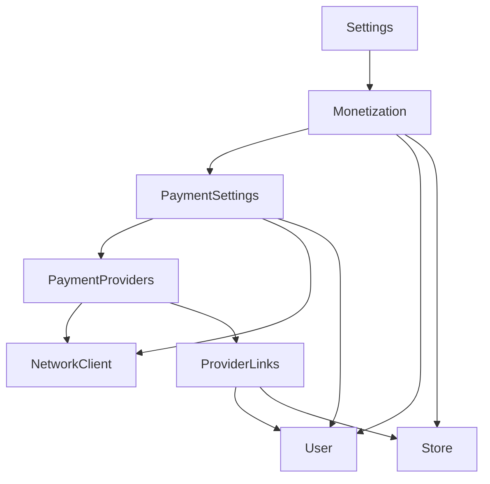
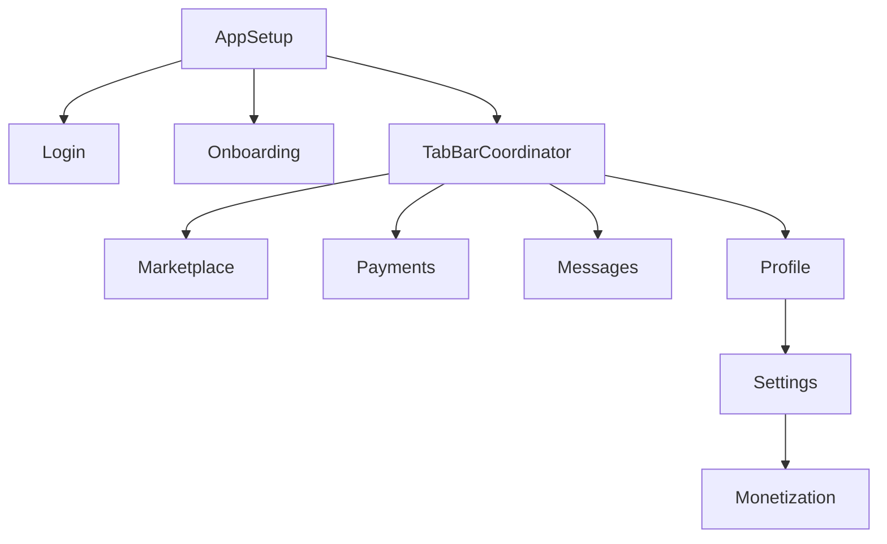
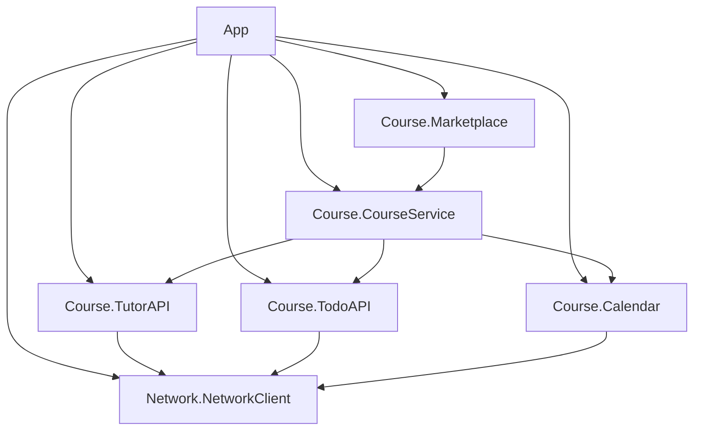
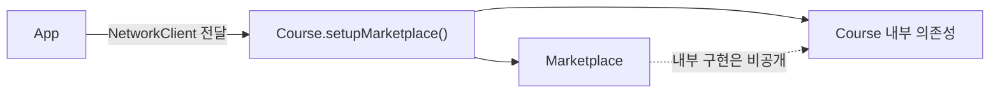

```table-of-contents
```

## 9장 [[09. 더 큰 규모의 의존성 주입|더 큰 규모의 의존성 주입]]

> 큰 의존성 트리를 한곳에서 해결하려 하지 말고, 각 도메인이 자기 서브트리를 조립하게 만든다.

- 앞선 [[08. 제정신을 지키는 의존성 주입|제정신을 지키는 의존성 주입]] 에서는 의존성 그래프를 아래에서 위로 조립했다.
    - 각 타입은 자신이 직접 쓰는 의존성만 받았다.
    - `AppSetup` 같은 조립 위치만 의도적으로 `ABC 규칙` 을 깼다.

- 앱이 커지면 하나의 조립 메서드도 다시 복잡해진다.
    - 의존성이 수십 개로 늘어난다.
    - 피처마다 내부 트리를 만드는 순서가 달라진다.
    - 모듈 경계를 넘을 때는 공개해야 하는 타입까지 함께 늘어난다.

- 해결 원칙은 이전 장과 같다.
    - 값을 직접 넘긴다.
    - 의존성 트리를 자연스러운 도메인 경계로 나눈다.
    - 각 도메인이 자기 내부 의존성 설정을 맡는다.
    - 앱은 모듈이 실제로 요구하는 가장 바깥 의존성만 넘긴다.

---

## 거대한 AppContext가 만드는 문제

- 앱 전체에서 공유할 의존성을 `AppContext` 하나에 모으는 방식은 편해 보인다.
    - 생성자마다 매개변수를 여러 개 적지 않아도 된다.
    - 새 의존성이 생기면 컨테이너에 프로퍼티 하나만 추가하면 된다.
    - 팀 누구나 같은 컨테이너에서 필요한 값을 꺼낼 수 있다.

```kotlin
class AppContext(
    val user: User,
    val store: Store,
    val networkClient: NetworkClient,
    val analytics: Analytics,
    val paymentService: PaymentService,
)

class Settings(
    private val context: AppContext,
)
```

- 하지만 작은 생성자 뒤에 실제 의존성이 숨는다.
    - `Settings` 가 무엇을 사용하는지 생성자만 보고 알 수 없다.
    - 필요하지 않은 의존성까지 간접적으로 모두 전달된다.
    - 새 의존성을 올리기 쉬워서 컨테이너는 계속 비대해진다.

- 인터페이스로 컨테이너의 일부만 보이게 해도 본질은 같다.
    - 타입마다 작은 인터페이스를 받아도 실제 객체는 거대한 컨테이너다.
    - 앱 대부분이 같은 객체에 기대므로 변경 병목도 사라지지 않는다.
    - 복잡성을 없앤 것이 아니라 양탄자 밑에 숨긴 셈이다.

- 공유 상태가 섞이면 문제는 더 커진다.
    - 컨테이너가 사실상 전역 상태가 된다.
    - 여러 스레드가 값을 바꾸면 잠금이나 동기화 장치도 필요해진다.
    - 결국 이름만 다른 싱글턴처럼 동작할 수 있다.

> 이니셜라이저가 짧다는 이유만으로 의존성이 단순해진 것은 아니다.

## 큰 의존성 트리 쪼개기

- 의존성 트리가 커졌을 때 필요한 것은 더 복잡한 프레임워크가 아니다.
    - 큰 트리를 한 번에 조립하지 않는다.
    - 응집된 서브트리를 찾아 설정 책임을 넘긴다.

- `Settings` 아래에 결제 설정을 담당하는 `Monetization` 도메인이 있다고 가정한다.
    - 내부에는 `PaymentSettings`, `PaymentProviders` 및 `ProviderLinks` 가 있다.
    - 여러 타입이 `User`, `Store` 및 `NetworkClient` 를 함께 사용한다.



- `Settings` 가 이 트리 전체를 알게 만들면 책임이 너무 커진다.
    - 결제 도메인의 내부 구현까지 알아야 한다.
    - 내부 타입이 바뀔 때마다 `Settings` 도 수정해야 한다.

- 대신 `Monetization` 이 자기 서브트리를 조립한다.
    - 먼저 트리의 잎에 있는 `User`, `Store` 및 `NetworkClient` 를 찾는다.
    - 이 세 의존성을 `setup()` 에 넘긴다.
    - `setup()` 은 내부 객체를 아래에서 위로 만든다.

```kotlin
class Monetization private constructor(
    private val user: User,
    private val store: Store,
    private val paymentSettings: PaymentSettings,
) {
    companion object {
        fun setup(
            user: User,
            networkClient: NetworkClient,
            store: Store,
        ): Monetization {
            val providerLinks = ProviderLinks(
                user = user,
                store = store,
            )

            val paymentProviders = PaymentProviders(
                networkClient = networkClient,
                providerLinks = providerLinks,
            )

            val paymentSettings = PaymentSettings(
                networkClient = networkClient,
                user = user,
                paymentProviders = paymentProviders,
            )

            return Monetization(
                user = user,
                store = store,
                paymentSettings = paymentSettings,
            )
        }
    }
}
```

- `setup()` 은 인스턴스 상태를 사용하지 않으므로 정적 함수로 둔다.
    - 조립 전에는 `Monetization` 인스턴스가 존재하지 않는다.
    - 생성 책임과 실제 피처 동작을 구분할 수 있다.

- 이 메서드는 의도적으로 `ABC 규칙` 을 깬다.
    - `Monetization` 인스턴스는 `NetworkClient` 를 직접 쓰지 않을 수 있다.
    - 하지만 정적 `setup()` 은 내부 서브트리를 조립하기 위해 이를 안다.
    - 규칙 위반을 예측 가능한 조립 위치에 가둔 것이다.

## Settings는 의존성 허브다

- 각 도메인이 자기 설정을 맡으면 `Settings` 는 의존성 허브가 된다.
    - 기반 의존성을 보관한다.
    - 사용자가 특정 설정 화면을 열 때 알맞은 도메인의 `setup()` 을 호출한다.
    - 각 도메인의 내부 계층은 알지 않는다.

```kotlin
class Settings(
    private val user: User,
    private val store: Store,
    private val networkClient: NetworkClient,
) {
    fun openMonetization(): Monetization {
        return Monetization.setup(
            user = user,
            store = store,
            networkClient = networkClient,
        )
    }

    fun openSecurity(): Security {
        return Security.setup(
            user = user,
            store = store,
        )
    }

    fun openPrivacy(): Privacy {
        return Privacy.setup(
            user = user,
            networkClient = networkClient,
        )
    }
}
```

- 소유권이 분명해진다.
    - 결제 설정을 바꾸려면 `Monetization.setup()` 을 보면 된다.
    - 보안 설정을 바꾸려면 `Security.setup()` 을 보면 된다.
    - 하나의 거대한 설정 메서드에서 관련 코드를 찾을 필요가 없다.

- 도메인을 옮기기도 쉬워진다.
    - `Monetization` 의 내부 타입과 조립 코드가 한 경계에 모여 있다.
    - 나중에 별도 모듈로 추출해도 외부에서 알아야 할 내용이 적다.

### 설정 경계를 만드는 신호

- 내부 의존성이 셋을 넘으면 설정 메서드를 고려한다.
    - 숫자 자체가 절대 규칙은 아니다.
    - 관계를 한눈에 파악하기 어려워졌다는 신호로 사용한다.

- 결제, 보안 및 사용자 관리처럼 응집된 도메인 경계가 보이면 설정 책임을 넘긴다.
    - 도메인이 자기 내부 타입과 생성 순서를 가장 잘 안다.
    - 외부 타입이 내부 구현을 알지 않게 만든다.

- 같은 기반 의존성 묶음을 여러 곳에 반복해서 넘기는 상황도 신호다.
    - 반복되는 조립 순서를 하나의 `setup()` 으로 모을 수 있다.
    - 변경 위치도 함께 줄어든다.

- 반대로 의존성이 한두 개인 단순한 타입에는 별도 설정 메서드가 필요 없다.
    - 모든 생성자를 팩토리로 감싸면 탐색할 코드만 늘어난다.
    - 복잡성이 실제로 생긴 경계에서만 나눈다.

## 앱 전체로 설정 책임 확장하기

- 같은 구조를 앱 전체에 계층으로 적용할 수 있다.
    - `AppSetup` 은 저장소, 네트워크 및 인증 같은 기반 서비스를 만든다.
    - `TabBarCoordinator` 는 로그인 이후 주요 피처를 만든다.
    - 각 피처는 자기 도메인 안의 세부 의존성을 만든다.



- 각 수준은 바로 아래의 직접 관심사만 안다.
    - `AppSetup` 은 `Monetization` 내부 타입을 모른다.
    - `TabBarCoordinator` 는 `Settings` 의 결제 제공자 구성을 모른다.
    - `Monetization` 은 앱의 로그인이나 탭 구성을 모른다.

### 허브에서 지연 생성하기

- 의존성 허브는 모든 피처를 앱 시작 시 미리 만들 필요가 없다.
    - 사용자가 해당 화면을 열 때 조립할 수 있다.
    - 비싸거나 거의 쓰이지 않는 피처의 생성을 미룰 수 있다.

```kotlin
class TabBarCoordinator(
    private val user: User,
    private val store: Store,
    private val networkClient: NetworkClient,
) {
    fun setupSettings(): Settings {
        return Settings(
            user = user,
            store = store,
            networkClient = networkClient,
        )
    }

    fun setupMarketplace(): Marketplace {
        return Marketplace.setup(
            user = user,
            store = store,
            networkClient = networkClient,
        )
    }
}
```

- 별도의 지연 주입 프레임워크가 없어도 된다.
    - 허브가 기반 의존성을 들고 있다.
    - 사용자 동작이 일어난 순간 설정 함수를 호출한다.
    - 생성 시점이 코드에 그대로 드러난다.

## 명시적인 설정의 트레이드오프

- 장점은 대부분의 타입이 전이 의존성 변화에서 벗어난다는 것이다.
    - `NetworkClient` 의 생성 방식이 바뀌어도 `CourseService` 는 그대로일 수 있다.
    - 직접 의존성의 인터페이스가 유지되면 상위 피처는 영향을 받지 않는다.

- 대신 설정 위치는 함께 수정해야 한다.
    - `Settings` 에 새 직접 의존성이 생기면 이를 만드는 `AppSetup` 도 바뀐다.
    - 조립 책임을 맡은 코드는 전이 의존성을 알기 때문이다.

- 싱글턴이나 서비스 로케이터보다 코드가 장황하다.
    - 설정 메서드와 생성자 인자가 늘어난다.
    - 하지만 어떤 값이 어디서 만들어지고 전달되는지 바로 추적할 수 있다.
    - 새 프레임워크의 규칙을 학습하지 않아도 된다.

- 앱이 커지면 알맞은 설정 메서드를 찾기 어려울 수 있다.
    - `setupSettings()`, `setupMarketplace()` 처럼 이름을 일관되게 쓴다.
    - 설정 책임을 도메인 소유자 가까이에 둔다.
    - 어떤 도메인이 어떤 서브트리를 소유하는지 문서로 남긴다.

## 모듈 경계에서 생기는 거미줄

- 앱을 `Course` 와 `Network` 모듈로 나누면 공개 인터페이스가 새로운 제약이 된다.
    - 앱이 모듈 내부 객체를 모두 만들려면 그 타입을 모두 볼 수 있어야 한다.
    - `TutorAPI`, `TodoAPI`, `Calendar`, `CourseService` 및 `Marketplace` 를 전부 `public` 으로 열게 된다.
    - `NetworkClient` 내부 타입도 같은 이유로 노출된다.



- 앱은 거미줄 한가운데 있는 거미가 된다.
    - 모든 모듈의 내부 타입과 생성 순서를 안다.
    - 모듈 내부 구현을 바꾸면 앱의 조립 코드도 함께 바뀐다.
    - 모듈을 다른 앱이나 저장소로 옮기기 어려워진다.

- 강한 결합은 두 이유로 생긴다.
    1. 모듈이 너무 많은 타입을 공개한다.
    2. 앱이 모든 모듈의 내부 의존성까지 설정한다.

> 타입의 `ABC 문제` 를 피했지만, 같은 문제가 앱과 모듈 사이에서 다시 생긴 셈이다.

## 모듈이 자기 내부 의존성을 설정하게 만들기

- 앱이 `Course` 모듈 내부 타입을 모르게 해야 한다.
    - 앱은 외부에서 정해야 하는 기반 의존성만 넘긴다.
    - `Course` 모듈이 나머지 내부 트리를 조립한다.

- 먼저 `Course` 모듈의 가장 가까운 외부 의존성을 찾는다.
    - 예제에서는 `NetworkClient` 다.
    - 앱은 완성된 `NetworkClient` 하나만 `Course` 모듈에 넘긴다.

### 피처 인스턴스에 설정 책임을 넣지 않는다

- 순진하게 `Marketplace` 생성자에서 내부 타입을 만들 수 있다.

```kotlin
class Marketplace(
    networkClient: NetworkClient,
) {
    private val courseService: CourseService

    init {
        val tutorAPI = TutorAPI(networkClient)
        val todoAPI = TodoAPI(networkClient)
        val calendar = CalendarService(networkClient)

        courseService = CourseService(
            tutorAPI = tutorAPI,
            todoAPI = todoAPI,
            calendar = calendar,
        )
    }
}
```

- 공개 타입은 줄었지만 `ABC 문제` 가 돌아온다.
    - `Marketplace` 는 실제 동작에서 `NetworkClient` 를 직접 쓰지 않는다.
    - 자기 의존성을 만들기 위해 전이 의존성을 받는다.
    - 생성자와 피처 책임이 섞인다.

### 정적 설정 함수로 분리하기

- 조립은 인스턴스 상태가 필요 없는 별도 정적 함수로 옮긴다.
    - `Course` 네임스페이스에 둘 수 있다.
    - 찾기 쉽게 `Marketplace` 의 `companion object` 에 둘 수도 있다.
    - 어느 쪽이든 실제 `Marketplace` 인스턴스는 `NetworkClient` 를 모른다.

```kotlin
class Marketplace private constructor(
    private val courseService: CourseService,
) {
    companion object {
        fun setupMarketplace(
            networkClient: NetworkClient,
        ): Marketplace {
            val tutorAPI = TutorAPI(networkClient)
            val todoAPI = TodoAPI(networkClient)
            val calendar = CalendarService(networkClient)

            val courseService = CourseService(
                tutorAPI = tutorAPI,
                todoAPI = todoAPI,
                calendar = calendar,
            )

            return Marketplace(courseService)
        }
    }
}
```

- 앱의 코드는 작아진다.

```kotlin
object AppSetup {
    fun setupMarketplace(): Marketplace {
        val networkClient = setupNetworkClient()
        return Marketplace.setupMarketplace(networkClient)
    }
}
```

- `Course` 모듈에서 외부에 공개할 피처 타입은 `Marketplace` 하나면 된다.
    - `TutorAPI`, `TodoAPI`, `CalendarService` 및 `CourseService` 는 모듈 내부에 숨길 수 있다.
    - 앱은 `Course` 의 내부 생성 순서를 모른다.
    - 모듈이 자기 의존성 설정을 소유한다.



## 기반 모듈은 공개 인터페이스가 더 크다

- 결합을 더 줄이려면 앱이 `NetworkClient` 대신 가장 낮은 잎 의존성을 넘길 수도 있다.
    - 저장 방식인 `StorageType` 을 넘긴다.
    - 환경별 전송 방식인 `NetworkTransport` 를 넘긴다.
    - `Course` 모듈이 `Store` 와 `NetworkClient` 까지 직접 조립한다.

```kotlin
fun setupMarketplace(
    storageType: StorageType,
    transport: NetworkTransport,
): Marketplace {
    val store = Store<ByteArray>(storageType)
    val networkClient = NetworkClient(
        transport = transport,
        store = store,
    )

    val courseService = CourseService(
        tutorAPI = TutorAPI(networkClient),
        todoAPI = TodoAPI(networkClient),
        calendar = CalendarService(networkClient),
    )

    return Marketplace(courseService)
}
```

- 앱은 환경에 맞는 잎 의존성만 선택한다.

```kotlin
fun setupMarketplace(): Marketplace {
    val transport: NetworkTransport = if (BuildConfig.DEBUG) {
        StagingTransport()
    } else {
        ProductionTransport()
    }

    return Marketplace.setupMarketplace(
        storageType = MemoryStorage(),
        transport = transport,
    )
}
```

- 다만 `Network` 모듈의 공개 인터페이스까지 작아지는 것은 아니다.
    - `StorageType` 과 `NetworkTransport` 는 앱과 `Course` 모듈에서 접근할 수 있어야 한다.
    - `Store` 와 `NetworkClient` 도 다른 피처의 빌딩 블록이라 공개될 가능성이 높다.

- 기반 모듈과 피처 모듈은 역할이 다르다.
    - `Network` 같은 기반 모듈은 여러 피처가 조합할 낮은 수준의 부품을 제공한다.
    - 그래서 자연스럽게 공개 타입이 많다.
    - `Course` 같은 피처 모듈은 완성된 사용자 흐름을 제공하므로 진입점 하나만 공개하기 쉽다.

- 공개 인터페이스를 무조건 최소화하는 것이 목표는 아니다.
    - 모듈 역할에 맞는 타입만 공개해야 한다.
    - 기반 모듈의 부품은 재사용을 위해 열고, 피처 모듈의 세부 구현은 감춘다.

---

## 정리

- 거대한 `AppContext` 는 의존성을 줄이지 않고 숨긴다.
    - 타입이 무엇을 쓰는지 알기 어려워진다.
    - 앱 전체가 같은 컨테이너에 결합한다.
    - 공유 상태가 섞이면 전역 상태와 같은 문제가 생긴다.

- 큰 의존성 트리는 도메인별 서브트리로 나눈다.
    - 각 도메인의 정적 `setup()` 이 내부 트리를 조립한다.
    - 상위 허브는 기반 의존성만 전달한다.
    - 규칙을 깨는 위치를 설정 메서드로 제한한다.

- 앱 전체의 설정도 계층으로 구성한다.
    - `AppSetup` 은 기반 서비스를 맡는다.
    - 코디네이터는 주요 피처를 맡는다.
    - 피처는 자기 내부 도메인을 맡는다.
    - 허브는 필요한 순간에 피처를 만들 수 있다.

- 모듈 경계에서는 공개 인터페이스까지 함께 살펴야 한다.
    - 앱이 모듈 내부 타입을 모두 조립하면 너무 많은 타입이 공개된다.
    - 모듈이 자기 내부 의존성을 설정하게 만들어 강한 결합을 줄인다.
    - 앱은 외부에서 결정해야 하는 기반 의존성만 넘긴다.

- 피처 모듈과 기반 모듈의 공개 범위는 같을 수 없다.
    - 피처 모듈은 완성된 진입점만 공개하기 쉽다.
    - 기반 모듈은 다른 피처가 조합할 부품을 제공하므로 공개 타입이 더 많다.

> 더 큰 규모의 의존성 주입도 결국 값 넘겨주기다. 차이는 누가 어느 범위의 값을 조립할지 명확히 나누는 데 있다.

#Android #Kotlin
