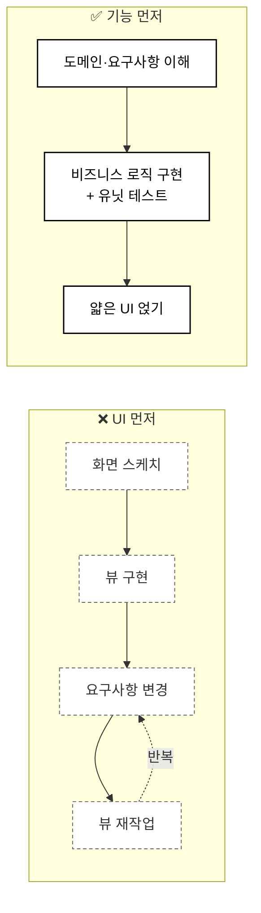
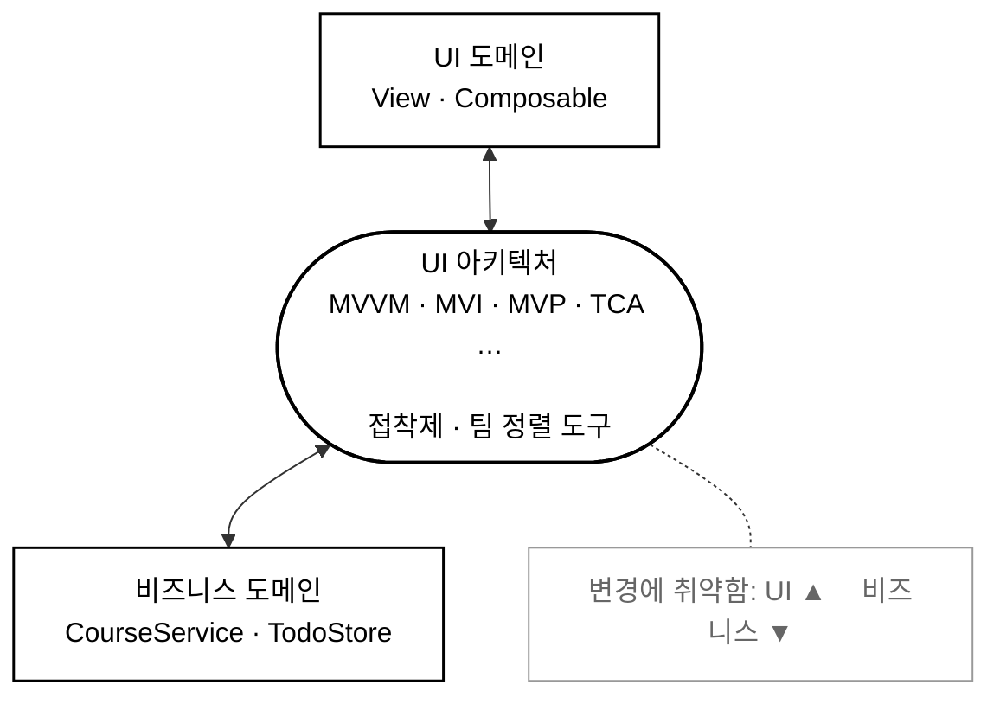
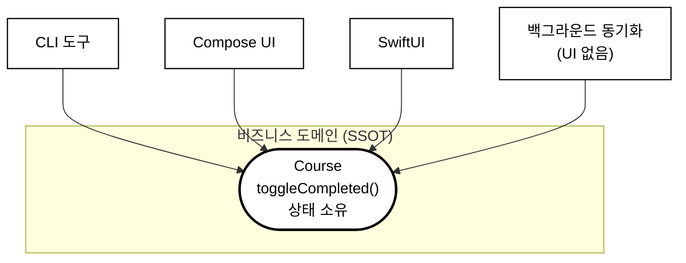
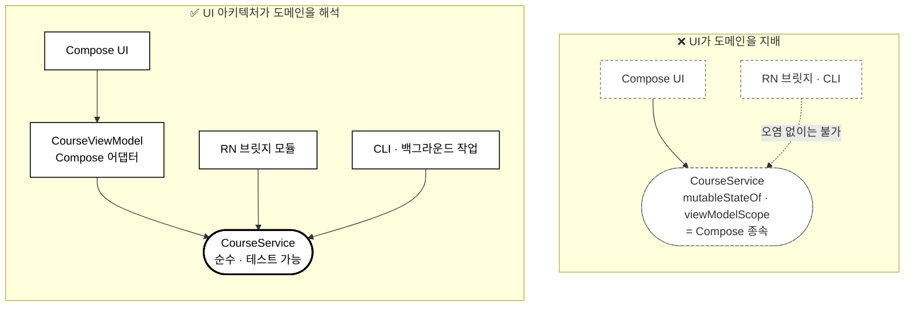
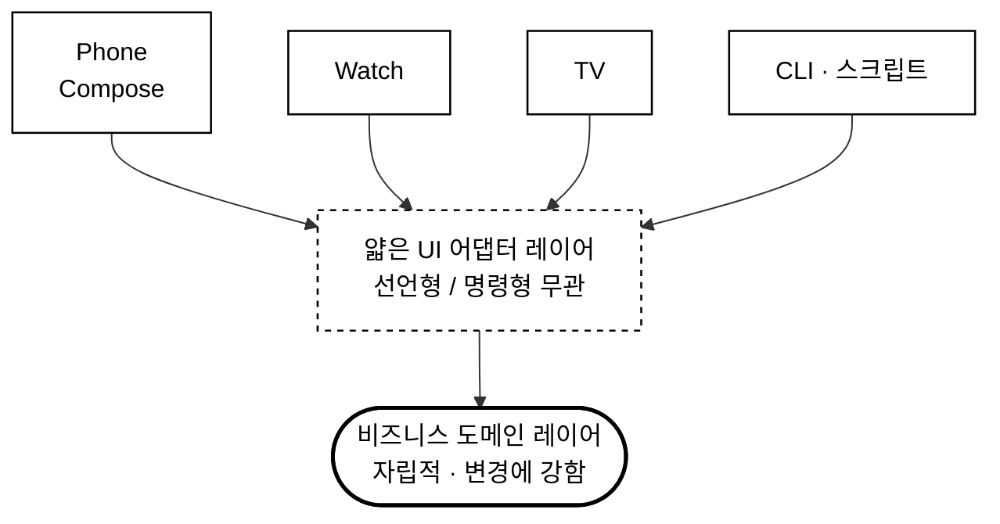

# UI 개발의 원칙 (Principles for UI Development)

> UI는 유행처럼 지나가고, 비즈니스 로직은 남는다.

**이 챕터에서 다루는 것**

- UI 구현을 의도적으로 미뤄서 요구사항과 도메인 이해에 먼저 투자하는 법
- UI 아키텍처를 "정답"이 아니라 **팀 정렬 도구**로 바라보는 관점
- 기능을 **CLI 도구**로 상상해서 비즈니스 로직의 위치를 결정하는 법
- UI 아키텍처가 비즈니스 도메인의 아키텍처를 지배하지 못하게 막는 법

---

## UI 원칙 1: UI 구현을 미뤄라 (Defer implementing the UI)

규모가 큰 앱에서 요구사항이 명확해지기 전에 UI부터 구현하는 것은 시간 낭비가 되기 쉽다. 초기 단계에서는 **요구사항과 도메인을 더 깊이 이해하는 데** 시간을 쓰는 편이 낫다.



기능에 집중해서 **UI 없이도 동작하게** 만들면 다음 이점을 얻는다.

- 기능과 요구사항 자체를 더 잘 이해하게 된다
- UI 거품 밖으로 나와, 디자이너뿐 아니라 **백엔드 엔지니어와 팀 전체와의 협업**에 집중할 수 있다
  - 무엇을 먼저 개발할지, 서버 통신에서 에러가 터졌을 때 어떻게 처리할지 같은 논의가 앞당겨진다
- 비즈니스 로직이 자연스럽게 UI로부터 분리되고, 따라서 **유닛 테스트가 가능해진다**
- 추후 코드를 독립된 모듈로 분리하기로 결정할 때 이미 준비된 상태가 된다
- 기능이 특정 UI 플랫폼에 종속되지 않아 **멀티 플랫폼 구현이 용이하다**

## UI 원칙 2: UI 아키텍처는 오고 간다 (UI architectures come and go)

개발에 착수하면 우리는 어떤 UI 프레임워크를 고를지, 어떤 아키텍처를 도입할지부터 고민하기 시작한다. 하지만 **대중적인 UI 아키텍처와 프레임워크는 모두 다 괜찮다.** 제각기 다른 방식으로 똑같은 문제를 풀고 있을 뿐이다.

따라서 중요한 것은 **단순하게 유지하는 것**이다. 간단한 기능을 위해 거창한 아키텍처를 쓸 필요가 없다.

### UI 아키텍처를 정렬 도구로 여기기 (Consider UI architectures as alignment tools)

UI 아키텍처의 진짜 목적은 **비즈니스 도메인과 UI 도메인을 이어주는 접착제** 역할이다.



UI 아키텍처를 바라보는 건강한 시각은 **팀 내부의 합의와 기준을 맞추기 위한 도구**로 인식하는 것이다. 반대로 유행하는 서드파티 프레임워크를 도입할 때는 숨겨진 비용이 뒤따른다.

- 프레임워크 자체가 훨씬 자주 변경된다
- 신규 팀원의 온보딩 시간이 늘어난다

### "완벽한" UI 아키텍처는 없다 (There is no "perfect" UI architecture)

UI 아키텍처의 문제는 다음 상황에서 발생할 확률이 높다.

- 작고 간단한 앱에 복잡한 아키텍처를 사용한다
- UI 도메인과 레이어를 너무 강하게 결합해서 재사용과 컴포넌트 분리가 어렵다
- 최신 아키텍처를 배우는 데만 매몰되어 **고객에게 가치를 제공한다는 본질을 왜곡한다**
- 다른 코드베이스에 자기가 선호하는 UI 아키텍처를 적용하느라 오히려 이해하기 어려운 코드를 만든다

즉, **팀이 잘못된 아키텍처를 골랐기 때문에 문제가 터지는 경우는 거의 없다.** 문제는 대개 적용 방식에서 나온다.

### UI 아키텍처와 유행 (UI architectures and trends)

- 유행하는 아키텍처는 언제나 존재하며, 잘못된 아키텍처를 선택했을까 봐 전전긍긍할 필요는 없다
- 오래된 코드베이스라면 **구형 아키텍처와 최신 아키텍처가 뒤섞여 있는 모습**을 당연하게 받아들여야 한다
- 비즈니스 로직을 UI 도메인 밖으로 최대한 밀어내기만 하면, 앱의 핵심 로직은 특정 UI와 과도하게 결합되지 않는다

### 아키텍처는 시간에 걸쳐 형성된다 (Architectures can be formed over time)

실제 제품에서 아키텍처는 **기능이나 도메인별로 제각기 다를 가능성이 높고, 이는 자연스럽다.** 단 한 가지 공통점이 있다면 **비즈니스 레이어는 UI 레이어에 비해 변경에 덜 취약하다**는 점이다.

## UI 원칙 3: 기능을 커맨드라인 도구로 상상하라 (Imagine your feature as a command-line tool)

실제 작업에서는 마감에 쫓겨 편법을 쓰게 되고, UI에 비즈니스 로직을 섞게 된다. 그러면 **어떤 뷰가 어떤 비즈니스 로직을 알고 있는지** 파악하기 어려워진다.

그래서 기능을 만들 때 *"이 기능이 CLI 도구로도 작동해야 한다면?"* 을 함께 고려하는 것이 좋다. UI 없이도 기능과 상태가 안정적이어야 하므로, 로직을 어디에 둘지 판단하는 데 도움이 되고 결합도가 자연히 낮아진다.

### 커맨드라인에서의 기능 (A feature on the command line)

TODO 아이템의 완료 여부를 토글하는 기능을 만든다고 가정해보자.

- 보통은 선언형 뷰나 ViewModel에 그 로직을 두겠지만, 이는 최선이 아니다
- **CLI 도구만 가지고 있다고 가정하면** 그 로직을 ViewModel이나 선언형 뷰에 넣을지 고민할 필요가 없어진다
  - 그렇게 두면 CLI는 필요한 기능을 잃게 되기 때문이다
  - 따라서 **비즈니스 도메인 중 하나가 상태를 관리하도록** 해야 한다
- 예를 들어 `Course`가 상태를 저장하도록 하면, 이것이 **SSOT(Single Source of Truth)** 가 되어 UI 프레임워크·아키텍처·플랫폼이 바뀌어도 유연하게 대응할 수 있다



### 비즈니스 로직을 떼어내서 얻는 유연함 (Flexibility by disconnecting the business logic)

**CLI도 함께 지원해야 한다고 가정하는 순간, 비즈니스 로직은 UI로부터 완전히 분리될 수밖에 없다.**

- 다양한 UI 패러다임을 지원하기 훨씬 수월해진다
- 앱이 백그라운드로 내려갔을 때 데이터를 동기화하는 작업처럼 **UI가 아예 없는 작업**도, UI 의존성이 전혀 없는 비즈니스 로직 덕분에 훨씬 쉽게 처리할 수 있다

### 두꺼운 비즈니스 도메인, 얇은 UI 도메인 (Fat business domain, lean UI domain)

CLI 툴처럼 상상하는 것은 **UI가 전혀 없는 상태에서도 기능 전체가 독립적으로 작동하도록 강제**한다.

이런 관점을 조기 최적화라고 반문할 수도 있다. 하지만 일상적인 업무에서 우리는 UI 도메인에 비즈니스 로직을 누수시키는 실수를 너무 쉽게 저지른다. **사소한 누수가 모이면 코드베이스가 오염된다.**

UI는 항상 빠르게 변하고, 비즈니스 로직은 그에 비해 잘 변하지 않는다. 그래서 앱을 **UI 없는 독립적인 시스템**으로 바라보는 관점이 도움이 된다.

## UI 원칙 4: UI가 비즈니스 도메인의 아키텍처를 결정하지 않는다 (The UI does not dictate architectures in business domains)

UI 아키텍처를 정의할 때, **UI가 코어 로직의 아키텍처까지 정의하게 되는 함정**에 빠질 수 있다. 하지만 UI 레이어는 가장 얇은 레이어여야 하고, 비즈니스 도메인 레이어는 **최대한 많은 플랫폼과 타겟을 지원할 수 있어야** 한다.

### React Native로 브릿지하기 (Bridging to React Native)

React Native처럼 멀티플랫폼을 지원하는 프레임워크에서 네이티브 함수를 호출하려면 브릿지가 필요하다. 하지만 이를 위해 **비즈니스 도메인(예: `CourseService`)에 UI 프레임워크 관련 코드를 추가한다면 순수성이 깨진다.**

### Compose 지원하기 (Supporting Compose)

Compose를 적용하려고 UI 상태(`State`)를 비즈니스 도메인 코드에 직접 넣을 수도 있다.

```kotlin
// Compose UI만을 위해 StateFlow, mutableStateOf, CoroutineScope 등을
// 순수 도메인 로직(CourseService)에 직접 집어넣은 경우
class CourseService(
    private val networkClient: NetworkClient
) {
    // Compose UI에 바인딩하려고 도메인 클래스 안에 UI 상태를 직접 들고 있음
    var isLoading by mutableStateOf(false)
        private set

    var courses by mutableStateOf<List<Course>>(emptyList())
        private set

    suspend fun fetchCourses(): List<Course> {
        isLoading = true
        return try {
            val result = networkClient.request("/courses")
            courses = result
            result
        } catch (e: Exception) {
            courses = emptyList()
            throw e
        } finally {
            isLoading = false
        }
    }
}
```

동작은 하지만, 이는 **도메인 순수성에 위반된다.** 이제 `CourseService`는 Compose 없이는 존재할 수 없다.

### 대안 (An alternative approach)

비즈니스 로직의 순수성은 그대로 가져가되, **얇은 어댑터 계층**을 만드는 것이 대안이다.

```kotlin
// Jetpack Compose 전용 어댑터 역할
class CourseViewModel(
    private val courseService: CourseService
) : ViewModel() {

    var uiState by mutableStateOf(CourseUiState())
        private set

    fun loadCourses() {
        viewModelScope.launch {
            uiState = uiState.copy(isLoading = true)
            try {
                val result = courseService.fetchCourses()
                uiState = uiState.copy(courses = result, isLoading = false)
            } catch (e: Exception) {
                uiState = uiState.copy(courses = emptyList(), isLoading = false)
            }
        }
    }
}

data class CourseUiState(
    val courses: List<Course> = emptyList(),
    val isLoading: Boolean = false
)
```



오버엔지니어링이라고 느낄 수 있다. 하지만 비즈니스 도메인을 **테스트 가능하고 여러 타겟에 적용할 수 있게** 만드는 것은 그만한 값을 한다.

## 다양한 제품과 아키텍처 지원하기 (Supporting a variety of products and architectures)

비즈니스 로직을 UI 레이어로부터 완전히 분리해내면, **코어 기능 위에 얇은 UI 레이어만 얹는 구조**가 된다.



시계 앱이나 TV 앱으로 확장하더라도 **비즈니스 도메인 레이어가 자립하기 때문에**, 선언형 UI를 쓰든 명령형 UI를 쓰든 문제가 되지 않는다.

---

## 정리 (What we covered)

### UI 원칙 1: UI 구현을 미뤄라

- UI 구현을 최대한 미루고 처음부터 비즈니스 로직 분리에 집중하면 여러 이점을 얻는다
- 요구사항 이해, 팀 전체와의 협업, 유닛 테스트 가능성, 모듈 분리 준비, 멀티 플랫폼 대응이 함께 따라온다

### UI 원칙 2: UI 아키텍처는 오고 간다

- UI 아키텍처의 유행은 빠르게 지나가므로, **UI 도메인을 최대한 가볍게 유지**하는 것이 좋다. 다음 아키텍처 변화에 대응하기 위해서다
- 대부분의 UI 아키텍처는 각자 해결하려는 문제에 최적화되어 있다. **팀원 간의 코드를 예측 가능하고 유지보수하기 쉽게 만드는 정렬 도구**로 생각하라
- 잘못된 아키텍처를 골라서 문제가 터지는 일은 거의 없다. 문제는 적용 방식에서 나온다

### UI 원칙 3: 기능을 CLI 툴처럼 생각하라

- 그러면 비즈니스 로직을 UI로부터 분리하고, 어디에 둘지 유추하기 더 쉬워진다
- 상태는 비즈니스 도메인이 SSOT로서 소유하게 하라

### UI 원칙 4: UI가 비즈니스 도메인을 결정하게 하지 마라

- UI 아키텍처가 비즈니스 도메인의 아키텍처를 결정하도록 방치하지 말고, **UI 아키텍처가 비즈니스 도메인을 해석하도록** 하라
- 언젠가 다른 UI 아키텍처를 지원해야 할 수 있다
- 다른 플랫폼·아키텍처·UI 패러다임을 도입하려고 **비즈니스 로직에 UI 관련 코드를 섞지 마라**
- UI 레이어를 비즈니스 로직 위에 얹는 얇은 레이어로 생각하면, 새로운 아키텍처·프레임워크·패러다임을 적용하기 용이하다
