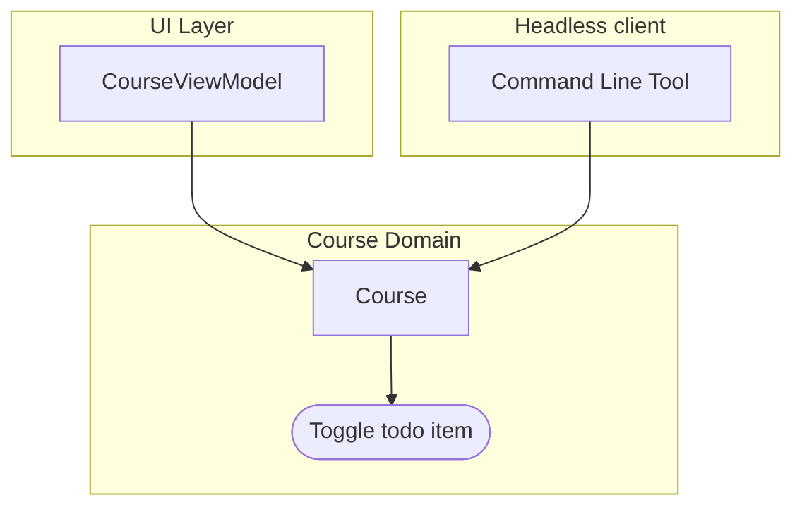
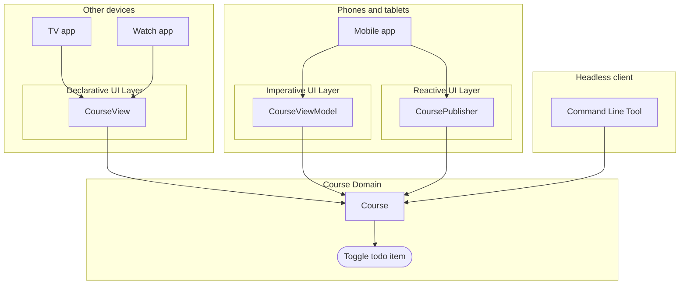

# [WEEK 15] Book 1 Chapter 1
📖 Mobile System Design 1. UI Frameworks, Architectures, and Supporting Multiple Products  

 

## 1. UI Frameworks, Architectures, and Supporting Multiple Products
> UI보다 비즈니스 로직을 먼저 완성하면 특정 UI framework나 architecture에 덜 묶인다.   
>
> **핵심 문장**  
> 가장 좋은 UI architecture는 비즈니스 로직을 잃지 않고도 버릴 수 있어야 한다.  
> **The best UI architecture is the one you can throw away without losing your business logic.**

### UI Principle 1: Defer implementing the UI

큰 앱에서는 UI 구현보다 요구사항과 domain을 먼저 이해하는 편이 낫다. 요구사항이 아직 분명하지 않다면 UI부터 만드는 일이 다시 작업하는 결과로 이어질 수 있다.  

UI 구현을 뒤로 미루면 처음부터 UI framework와 architecture를 결정하지 않아도 된다. 비즈니스 로직이 UI 밖에서 만들어지므로 관심사가 자연스럽게 분리된다.  

**얻는 효과**

- 기능과 비기능 요구사항을 더 깊이 이해할 수 있다.
- 디자이너뿐 아니라 전체 팀과 우선순위와 오류 처리를 맞출 수 있다.
- 작성한 코드를 unit test하기 쉽다.
- 낮은 계층의 모듈로 나누거나 여러 platform을 지원하기 쉬워진다.

작은 앱은 UI를 바로 만들어도 괜찮다. 핵심은 **재사용을 미리 설계하는 것이 아니라 UI 구현의 우선순위를 조정**하는 데 있다.  

---

### UI Principle 2: UI architectures come and go

UI framework와 architecture는 platform과 작업 방식에 영향을 준다. 하지만 대부분의 선택지는 비슷한 문제를 서로 다른 방식으로 해결한다.  

따라서 단순한 해결책으로 충분하다면 **복잡한 architecture를 먼저 도입할 필요가 없다**. 필요한 문제가 생겼을 때 더 큰 구조를 선택하면 된다.  

#### Consider UI architectures as alignment tools

UI architecture는 `business domain`과 `UI`를 연결하는 역할을 한다. 무엇이 가장 우수한지보다 **팀이 같은 방식으로 코드를 이해하고 유지할 수 있는지가 더 중요**하다.  

third-party framework는 새로운 방식을 배우는 데 도움이 된다. 다만 변경 주기가 빠르고 팀의 onboarding 비용을 높일 수 있다. 유행이 지나면 migration도 필요하다.  

#### There is no "perfect" UI architecture

UI 문제의 원인이 잘못된 architecture인 경우는 많지 않다. 다음과 같은 선택이 더 큰 문제를 만들 수 있다.  

- 작은 앱에 복잡한 architecture를 적용하는 경우
- business domain과 UI domain을 섞는 경우
- 최신 architecture를 따라가느라 제품 작업이 늦어지는 경우
- 다른 codebase에 익숙한 architecture를 그대로 가져오는 경우

업데이트와 test가 어려울 때는 architecture만 의심하지 않아야 한다. 문서와 예시가 부족했을 수 있고, 교육과 onboarding이 충분하지 않았거나 code review 문화가 원인일 수도 있다.  

#### UI Architectures and trends

어떤 architecture를 선택했는지보다 business logic을 최대한 UI domain 밖에 두는 것이 더 중요하다. 그러면 UI가 바뀌어도 핵심 기능은 특정 architecture에 묶이지 않는다.  

오래된 codebase에서는 여러 architecture가 섞여 있을 수 있다. business logic을 UI와 분리해 두면 새로운 paradigm이나 platform을 도입할 때 핵심 로직을 크게 바꾸지 않아도 된다.  

#### Architectures can be formed over time

feature와 domain마다 서로 다른 architecture를 사용할 수 있다. 더 큰 app에서는 이들을 연결하는 architecture가 따로 생길 수도 있다.  

시간이 지나며 여러 architecture가 섞이는 것은 자연스럽다. business layer는 UI layer보다 변화가 적으므로 business logic을 UI와 분리하는 기준을 유지하는 것이 중요하다.  

---

### UI Principle 3: Imagine your feature as a command-line tool

기능을 command-line tool로도 사용할 수 있다고 가정하면 UI에 들어가야 할 코드와 business logic을 구분하기 쉬워진다.  

이는 실제로 command-line tool을 배포하자는 뜻이 아니다. UI 없이도 기능과 상태가 동작하도록 설계해 business logic을 UI에서 분리하자는 의미이다.  

#### A feature on the command line

Todo item을 완료 상태로 바꾸는 기능을 UI의 view나 viewmodel에 넣기 쉽다. 하지만 command-line tool에서도 같은 기능이 필요하다고 생각하면 이 로직은 UI에 있을 수 없다.  

예를 들어 다음 흐름은 UI 없이도 기능을 사용할 수 있어야 한다는 점을 보여준다.  

1. user ID로 구독한 course를 조회한다.
2. course ID로 todo item을 조회한다.
3. todo item ID로 완료 상태를 변경한다.

상태와 동작은 **`Course` domain**이 맡는다. 
`Course`가 상태의 single source of truth가 되면 phone과 tablet과 watch와 다른 UI framework에서 같은 기능을 사용할 수 있다.  

#### Flexibility by disconnecting the business logic

business logic을 UI와 분리하면 UIKit과 SwiftUI처럼 UI paradigm이 달라도 같은 기능을 사용할 수 있다. background에서 상태를 동기화하는 기능을 추가할 때도 UI dependency가 없어 구현하기 쉽다.  

#### Fat business domain, lean UI domain

기능 전체가 UI 없이 동작하도록 만들고 UI는 얇게 유지한다. 
business logic의 일부를 UI에 남겨두면 UI가 바뀔 때 로직을 복사하거나 상태를 다시 맞춰야 한다.  

UI는 platform과 제품의 변화에 따라 자주 바뀐다. business logic을 독립적으로 두면 새로운 UI framework와 product를 지원할 때 변경 범위를 줄일 수 있다.  

---

### UI Principle 4: The UI does not dictate architectures in business domains

UI framework의 요구사항이 business domain의 구조를 결정하게 두면 안 된다.
예를 들어 SwiftUI를 위해 business model 전체를 observable하게 만들거나 React Native를 위해 Objective-C 타입을 넣으면 business logic이 특정 UI에 종속된다.  

business domain은 UI 없이도 동작하는 구조로 둔다. UI에 필요한 framework-specific 코드는 얇은 adapter에 모으는 방향이 더 유연하다.  

#### Bridging to React Native

React Native와 연결하려면 Swift 코드에 `objc`와 `NSObject` 같은 Objective-C 호환 요구사항이 들어갈 수 있다. `RCTPromiseResolveBlock` 같은 React Native 타입도 business logic에 추가될 수 있다.  

그러면 `CourseService`가 기능 자체와 관계없는 framework 요구사항까지 책임지게 된다. command-line tool처럼 다른 환경에서는 필요하지 않은 코드이다.  

#### Supporting SwiftUI

SwiftUI의 reactive 방식에 맞추려고 `CourseService`를 `ObservableObject`로 만들고 `@Published` property나 publisher를 추가할 수 있다.  

이 방식은 다음 비용을 만든다.  

- business domain이 UI framework인 Combine에 의존한다.
- UI에 필요하지 않은 상태까지 observable하게 만든다.
- test가 reactive stream과 timing을 처리해야 한다.
- service가 `isLoading`과 `courses` 같은 UI 상태까지 관리하게 된다.

`@Observable`은 일부 복잡도를 줄이지만 여전히 UI 요구사항이 business logic의 설계를 결정한다는 문제는 남는다.  

> [!Note]
> `@Observable`은 iOS와 SwiftUI에서 객체의 상태 변화를 관찰하기 위한 Swift 매크로이다. Compose의 `State`나 `StateFlow`와 비슷한 목적을 가지지만 같은 API는 아니다.  
> 여기서 중요한 점은 `@Observable`의 사용법이 아니라 `CourseService`가 UI 상태까지 관리하게 된다는 데 있다.  

#### An alternative approach

`CourseService`는 순수한 business logic만 유지한다. SwiftUI와 React Native에 필요한 상태 관리와 bridge 코드는 각각 작은 adapter가 담당한다.  

이 구조에서는 UI가 business domain의 consumer가 된다. 단순한 단일 platform 앱이라면 framework 요구사항을 business layer에 넣어도 되지만 규모가 커지거나 확장 가능성이 있다면 adapter를 두는 편이 유리하다.  

---

### Supporting a variety of products and architectures

business logic을 UI에서 분리하면 하나의 core domain 위에 여러 제품과 UI architecture를 얹을 수 있다. UI는 core 기능을 사용하는 얇은 layer가 된다.  

`Course` domain을 phone과 tablet과 watch와 TV에서 사용할 수 있다. 각 제품은 서로 다른 UI architecture를 선택해도 된다. command-line tool은 network 연결을 확인하거나 integration test를 실행하는 데 사용할 수 있다.  

당장은 제품에 맞는 UI architecture를 선택해야 한다. 다만 UI architecture를 core logic을 감싸는 얇은 layer로 두면 이후 변화에 대응하기 쉽다.  

---

### What we covered

- UI 구현을 뒤로 미루면 요구사항을 더 깊이 이해하고 business logic을 UI와 분리할 수 있다.
- UI architecture는 영원한 정답이 아니라 팀의 alignment를 돕는 도구이다.
- 기능을 command-line tool로도 사용할 수 있다고 생각하면 business logic을 UI 밖에 두기 쉽다.
- UI framework의 요구사항이 business domain의 architecture를 결정하지 않도록 한다.
- fat business domain과 lean UI domain을 유지하면 여러 product와 UI architecture를 지원하기 쉽다.
