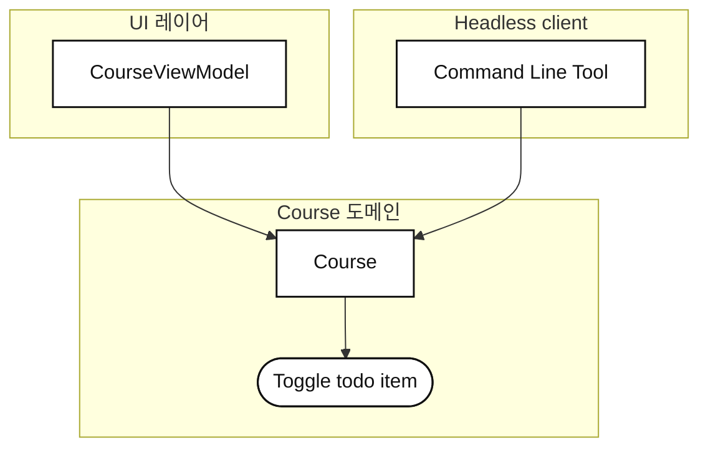
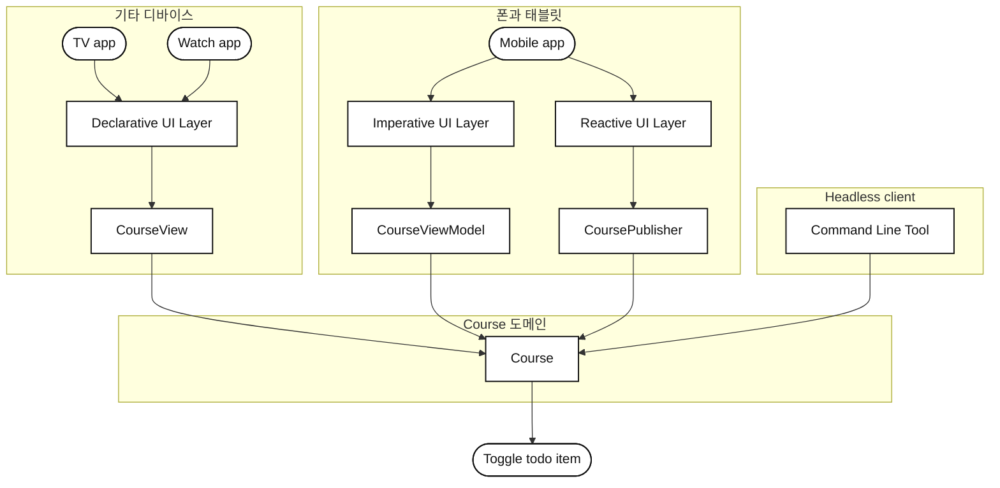

## 1장 [[10. Projects/Mobile System Design/StudyVault/UI-01-UI-Frameworks/01. UI 프레임워크|UI 프레임워크]]
- 이번 장에서는 UI를 마지막으로 미루는 것이 왜 좋은지에 대해서 다룬다.
- 또한 "어떤 UI 프레임워크와 아키텍처를 써야 하지?" 에 대한 질문에 대해서도 짚어본다.

### UI 원칙 1 : UI 구현을 미뤄라
- 앱, 피처 개발 초기 단계엔 요구사항과 도메인을 이해하는 데 시간을 쓰는 편이 낫다.
- UI를 미루면 처음에 UI를 어떻게 만들지에 대해선 사소한 문제로 변한다.
	- 명령형/선언형 프로그래밍 중 무엇을 선택하는지, 아키텍처를 무엇을 썼는지도 중요치 않다.

- 피처 자체에 온전히 집중해서 UI없이 동작하게 만들면, 다음 이점을 누릴 수 있다.
	- 기능 요구사항을 제대로 이해할 수 있다.
	- UI 버블 밖으로 나와, 팀 전체와의 협업에 더 집중할 수 있다.
	- 자동적으로 비즈니스 로직이 UI 레이어에 존재하지 않게 된다. 즉, 관심사의 분리가 이뤄진다.
	- 비즈니스 로직이 분리되어 있어 작성한 모든 코드에 대해 쉽게 단위 테스트를 구현할 수 있다.
	- 특정 타겟 플랫폼에 의존하지 않으므로 언제든 플랫폼을 넓힐 수 있다.

- **UI 구현을 뒤로 미룸으로써 "유연성" 을 얻을 수 있다.**
	- 비즈니스 로직과 UI 로직이 완전히 분리되어 있는 상태이기 때문이다.

### UI 원칙 2 : UI 아키텍처는 자주 바뀐다
- UI 프레임워크는 우리가 어떻게 일하고 코드를 구성할지 방식을 좌우할 수 있어 미리 정해두는 경우가 많다.
- 하지만 아키텍처에 대해서는 갑론을박이 꽤 많다.
	- 선택지는 산더미처럼 많고, 취향이 아주 많이 갈린다.
	- `MVC`, `MVVM`, `MVI` 등등, 그 중 무엇을 고르든 상관없다.
	- **결국 인기 있는 UI 아키텍처와 프레임워크는 무엇을 써도 괜찮고, 비슷한 문제를 각자의 방식으로 풀 뿐이다.**

- 다만 문제의 사이즈를 잘 고려하여 단순하게 구성하는 것이 좋다.
	- 화려한 아키텍처는 단순한 해법으로 충분치 않은 경우에만 반영한다.

#### UI 아키텍처를 정렬 도구로 생각하라
- UI 아키텍처를 보다 효율적으로 바라보는 방법은, **팀 내 커뮤니케이션 정렬 도구로 바라보는 것**이다.
	- 코드를 더 예측 가능하고 이해하기 쉽게 만들어 팀이 가치를 전달하는 데 더 집중할 수 있게 한다.

- 유행하는 서드파티 아키텍처는 새 기법을 배우고 시야를 넓히기 좋으므로, 탐구할만한 가치는 있다.
	- 하지만, 서드파티를 팀에 들일 때는 숨은 비용에 대해 항상 고려해야 한다.
	- 아주 자주 변경되므로, 이에 따라 팀의 싱크를 맞추는 것 **역시 큰 비용**이다.
	- 마음에 들면 써도 좋지만, 단순한 바닐라 코드를 쓸 때의 이점도 고려해보아야 한다.
	- 참고로 퍼스트파티의 변화만으로 이미 마이그레이션 할 일은 꽤 많다.
		- (새 프로그래밍 언어 / 새 OS / Apple 과 Google 이 출시한 새 UI 프레임워크 등)

#### 완벽한 UI 아키텍처는 없다
- UI 레이어에서 발생한 문제가 "잘못된 아키텍처" 를 채택해서 발생했을 가능성은 드물다.
- 보통 다음 상황에서 문제가 생긴다.
	1. 작고 단순한 앱에 복잡한 아키텍처를 사용한다.
	2. 비즈니스 도메인과 UI 도메인을 뒤섞어 UI 레이어가 비즈니스 로직에 강하게 결합된다.
	3. 최신 아키텍처로 무작정 갈아타면서, 팀 전체거 새로운 패러다임을 배워야 한다.
	4. 자신이 선호하는 아키텍처를 다른 코드베이스에 억지로 이식하여 팀 전체가 뒤엉킨 코드베이스를 떠맡는다.

- **우리가 겪는 문제는 UI 아키텍처와 아무 상관이 없을 수 있다.**
	- 문서가 없거나, 예제가 없거나, 교육이 부족하거나, 코드 리뷰 문화가 빈약한 것이 원인일 수 있다.
	- 최소한 **우리의 아키텍처는 당분간 꽤 잘 작동할 것**이다.

#### UI 아키텍처와 트렌드
- 잘못된 아키텍처를 골랐더라도, **결국 유행하는 아키텍처는 언제나 새롭게 나타난다.**
	- 최고의 아키텍처는 지금 무엇이 유행하느냐로 귀결되곤 한다.
	- 하지만 오래된 코드베이스를 보면 아키텍처가 여러 개 섞여있을 것이다.
	- 고로 다양한 아키텍처를 이해해야 하는 처지가 되고 만다.

- 그러나 비즈니스 로직을 UI 도메인 밖에 뒀다면, UI 아키텍처를 뭘 사용하든 그렇게 중요하지 않다.
	- 새 패러다임을 지원하든, 새 플랫폼을 지원하든 한결 다루기 쉬워진다.

#### 아키텍처는 시간이 지나며 형성될 수 있다
- 아키텍처는 피처/도메인마다 다를 가능성이 크다.
	- 시간이 지나며 진화한 앱이 피처마다 서로 다른 아키텍처는 정상이고, 아주 흔한 모습이기도 하다.

### UI 원칙 3 : CLI 로 상상해보기
- 탁상공론적으로 비즈니스 로직을 뷰에서 분리하는건 아주 당연해보이지만, 사실 일하다 보면 경계가 흐릿해지기 쉽다.
	- 결국 시간이 지나면 비즈니스 로직이 UI와 섞이게 될 가능성이 크다.

- 피처를 만들 땐 주기적으로 스스로에게 이렇게 물어보자.
	- **"이 피처, CLI로도 동작해야 한다면 어떻게 만들어야 할까?"**
		- 이 사고방식은 로직을 어디에 둘지 추론하는데 도움이 되고, UI 에 대한 결정을 미룰 수 있게 해준다.
		- **즉, 모든 기능과 상태를 UI 없이 어떻게 사용할 수 있을지 고민하게 해준다.**

#### CLI 위에서의 기능 동작
- `TODO` 를 완료 -> 미완료로 토글하는 기능이 있다고 가정해보자.
	- UI 상호작용이 일어나고, 상태 변화가 눈에 보이는 곳은 `ViewModel` 이니, 해당 로직을 거기에 구현할 수도 있다.

- 하지만 CLI 에서도 동작해야 한다고 가정하면, 최선이 아니라는 것을 깨달을 수 있다.
	- 특정 비즈니스 로직이 `ViewModel` 에 위치해있다면, CLI 자체를 만들 수가 없다.
	- 비즈니스 도메인 중 하나가 상태를 책임지게 해야만, 기능이 정상적으로 동작한다.

- "상태" 를 비즈니스 도메인에 저장하면, 그 도메인이 SSOT 가 된다는 장점이 있다.
	- 또한, 이제 어떤 UI 프레임워크든 이 도메인은 정상적으로 작동한다.

- CLI를 지원하는 것만으로, 우리는 이미 도메인 로직을 완전히 분리할 수 있게 되었다.

#### 비즈니스 로직의 분리로 인해 얻는 유연성
- 비즈니스 로직을 분리하면 애플리케이션이 어떤 프레임워크에서 작동하는지 알 필요가 없어진다.
	- 즉, 다양한 UI 패러다임을 지원하기 매우 쉬워진다.
	- 앱이 백그라운드에 있는 동안 상태를 동기화하는 로직도 구현하기가 매우 쉬워진다.

#### 두꺼운 비즈니스 도메인, 얇은 UI 도메인
- 앱을 CLI 관점으로 생각하면, 피처 전체가 UI 없이 독립적으로 동작하는지 확인할 수 있다.
	- `ViewModel` 에 비즈니스 로직을 슬쩍 넣는 문제를 완벽히 해결할 수 있다.

- UI 레이어는 항상 큰 변화를 겪지만, 비즈니스 로직은 대부분 그대로 남는다.
	- 비즈니스 로직 일부를 UI 레이어에 남겨둔다면, 프레임워크의 변화나 백그라운드 동기화 상태같은 시나리오를 구현하기 매우 고통스러웠을 것이다.
	- 고로, UI는 비즈니스 로직에서 최대한 분리해두는 것이 좋다.

## UI 원칙 4 : UI가 비즈니스 도메인의 아키텍처를 좌우해선 안된다
- UI 아키텍처나 프레임워크로, 아래 레이어인 비즈니스 도메인을 건드리고 싶은 경우가 있다.
	- 비즈니스 모델에 `mutableStateOf` 를 넣는다던가.
	- React Native 지원을 위해 `@ReactMethod`, `Promise` 같은 전용 타입을 도메인 모델에 넣는다던가.

- 이로 인해 **UI 프레임워크의 요구사항이 비즈니스 로직의 형태를 결정하는 문제가 발생**한다.
	- 하지만 비즈니스 레이어를 두꺼운 레이어로, UI를 얇은 레이어로 생각하면 다양한 제품과 타깃을 지원할 수 있다.

- 이런 생각을 하다보면 `Flow` 나 `StateFlow` 를 비즈니스 레이어에 사용하면 안될까? 라는 의문이 생길 수 있다.
	- 두 스트림이 비즈니스 레이어에 존재한다고 해서 잘못된 것은 아니다.
	- 다운로드 진행률과 같이 도메인 자체가 시간에 따라 변화하는 값을 표현해야 한다면 `Flow` 는 자연스러운 선택이다.
	- 핵심은, **상태와 스트림이 비즈니스 도메인 때문에 존재하는지, UI 프레임워크때문에 존재하는지 판단하는 것**이다.

- UI를 특별한 존재로 생각하지 마라.
	- UI 역시 우리의 비즈니스 도메인을 사용하는 또 하나의 클라이언트, 또 하나의 소비라자고 생각하라.
	- 그렇게 바라보면 UI 하위 레이어를 특정 UI 프레임워크에 최적화시킬 이유가 사라진다.
	- **비즈니스 도메인에 가장 잘 맞는 아키텍처가 무엇인지 생각**하라.

## 다양한 제품과 아키텍처 지원하기
- 비즈니스 로직을 UI 레이어 외부로 확실하게 위치시키면, 결국 코어 기능 위에 얇은 UI 레이어가 얹힌 구조가 된다.
	- 그럼 어떤 변화가 다가오더라도 언제든 준비된 상태가 된다.

- 단기적으로는 어떤 아키텍처를 쓸지 선택하는 것이 매우 중요하게 느껴질 수 있다.
	- **하지만, UI 아키텍처는 그저 코어 로직을 둘러싼 가벼운 레이어일 뿐이다.**
- 장기적으로 보면 오늘 작업한 UI 아키텍처는 사실 애플리케이션에서 큰 역할을 맡을 필요가 없다.
	- 앱 안에는 다양한 UI 아키텍처가 공존할 수 있다.
