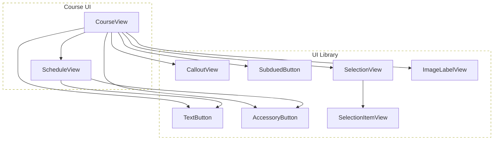

# [WEEK 16] Book 1 Chapter 2
📖 Mobile System Design 1. UI Frameworks, Architectures, and Supporting Multiple Products  

 

## 2. Delivering Reusable Views: The Art of Decomposing a Design
> 화면을 작은 view로 나눌 때는 현재 feature에서 어떻게 쓰는지보다 view 자체의 역할을 기준으로 이름을 짓는다.  
> 그 결과 재사용 가능한 view는 UI library에 두고 feature에만 필요한 구조는 가까이에 남길 수 있다.  

### UI Principle 5: Name a view after what it is, not how you use it

view는 feature를 지원하지만 feature를 알 필요는 없다. `TutorView`처럼 현재 쓰임새를 type 이름에 넣으면 비슷한 view가 늘어나고 feature에 맞춘 설정이 계속 추가될 수 있다.  

#### Making a reusable view

튜터 정보를 보여 주는 UI는 이미지와 두 줄의 텍스트로 구성된다. 이를 `TutorView`라고 부르면 학생 profile이나 video error처럼 같은 구조가 필요한 곳에서 이름이 어색해진다.  

`ProfileView`도 사용처를 드러낸다는 점에서는 같은 한계가 있다. view가 무엇으로 이루어졌는지에 맞춰 `ImageLabelView`처럼 이름을 정하면 특정 feature에 묶이지 않는다.  

#### Type name versus instance name

| 구분 | 이름의 기준 | 예시 |
| --- | --- | --- |
| type name | view의 구조와 역할 | `ImageLabelView` |
| instance name | 현재 화면에서의 쓰임새 | `tutorView`, `profileView` |

type 이름을 범용적으로 짓는다고 언어의 generic type을 써야 하는 것은 아니다. 이름만 현재 사용처와 분리해도 UI library에 둘 수 있는 여지가 생긴다.  

#### Expressing reusable views in code

`ImageLabelView`에는 `image`, `title`, `subtitle`처럼 범용적인 입력을 전달한다. 호출부의 instance 이름은 `tutorView`로 두어 화면 맥락을 충분히 드러낼 수 있다.  

새 기능을 미리 지원하도록 view를 바꾸는 것이 아니다. 현재 구조를 더 정확하게 표현하는 이름을 붙이는 일이다.  

#### View primitives

`ImageLabelView`처럼 **feature를 모르고 단순한 UI를 만드는 view**를 `view primitive`라고 한다. 복잡한 화면은 이런 작은 building block을 조합해 만든다.  

view primitive는 UI library에 두고 `CourseView` 같은 feature view가 이를 사용하게 할 수 있다.  

#### The road of becoming too specific

`TutorView`에 이름, 가입일, 표시 variant를 계속 추가하면 view가 tutor model과 사용처를 점점 더 많이 알게 된다. 나중에는 `Tutor` model 자체를 전달받아 설정하는 결합으로 이어질 수 있다.  

반대로 `ImageLabelView`처럼 단순한 입력만 받으면 UI library가 feature model을 직접 받는 실수를 더 쉽게 발견할 수 있다.  

---

### Introducing abstractions without introducing new types

feature 안에서는 `TutorView`라는 표현이 더 읽기 쉬울 수 있다. 이때 새 view type을 만들지 않고 factory나 initializer로 `ImageLabelView`를 감싸면 범용 type과 feature별 사용성을 함께 유지할 수 있다.  

#### Abstractions via aliasing

`typealias TutorView = ImageLabelView`는 같은 type에 feature 문맥의 이름을 붙이는 방법이다. UI library에는 `ImageLabelView`를 유지하고 Course feature 안에서만 `TutorView`를 사용할 수 있다.  

#### Making an extension

extension이나 factory는 `avatar`, `displayName`, `handle`처럼 feature에 맞는 입력을 받아 내부에서 `image`, `title`, `subtitle`로 바꾼다. 이런 코드는 UI library가 아니라 Course feature에 둔다.  

> [!Note]
> Kotlin도 `typealias`와 factory function으로 같은 목적을 달성할 수 있다. 범용 view의 API는 유지하면서 feature에서 읽기 쉬운 생성 방법을 제공하는 방식이다.  

---

### Creating the other view primitives

화면의 나머지 요소도 같은 기준으로 나눈다. 작은 view의 이름과 입력을 사용처에서 분리하면 UI library가 점차 쌓인다.  

여러 course를 지원하는 UI는 이미 범위 밖으로 정했으므로 이 단계에서 새 요구사항으로 확장하지 않는다.  

---

### UI Principle 6: Don't name a view after its styling

view의 외형은 바뀔 수 있다. 이름에는 현재 모양이 아니라 사용자가 받는 기능이나 UI의 의미를 담는다.  

튜터의 말풍선은 특정 사람이 보내는 message가 아니라 내용을 강조해 보여 주는 `CalloutView`로 볼 수 있다. 그러면 안내와 알림처럼 다른 맥락에도 사용할 수 있다.  

#### Alternative names

`SpeechBubble`은 말풍선 모양이 바뀌는 순간 이름이 맞지 않는다. `CalloutView`는 말풍선이 아이콘과 label 조합으로 바뀌어도 역할을 유지한다.  

---

### UI Principle 7: Favor composition over smart views

feature에 필요한 차이를 하나의 큰 configurable view에 넣기보다 작은 view를 조합한다. 각 view가 맡는 일이 줄어들어 사용 방법과 변경 범위가 더 분명해진다.  

#### Breaking apart the view

`ScheduleView`는 Course feature에만 필요한 구조이므로 feature 가까이에 둔다. 다만 내부의 버튼은 `AccessoryButton`, `TextButton`처럼 재사용 가능한 view primitive로 구성한다.  

`DetailButton`이나 `SmallButton`처럼 현재 위치나 크기를 이름에 넣지 않는다. 버튼의 역할과 중요도를 기준으로 이름을 정한다.  

#### Decomposing the todo list

todo 목록의 UI는 선택과 toggle이라는 공통 동작을 제공한다. 이 부분은 `SelectionView`와 `SelectionItemView`로 나누어 다른 목록에도 사용할 수 있게 한다.  

#### Domain naming versus view naming

`TodoList`는 주간 일정과 reset 같은 domain API를 가진다. 이는 선택 UI보다 높은 추상화이므로 `SelectionView`를 사용하더라도 domain의 이름을 UI 이름으로 바꾸지 않는다.  

#### Handling inconsistent UI

제목이나 section label, reset 버튼이 화면마다 다르다고 모든 경우를 처리하는 view를 만들 필요는 없다. 빈 제목이나 불필요한 설정값으로 동작을 우회하게 되면 view는 오히려 쓰기 어려워진다.  

#### Breaking a view down into smaller views

`SelectionView`는 선택 항목을 표시하고 toggle만 처리한다. 제목과 reset 버튼처럼 화면 조합에 따라 달라지는 요소는 바깥 view가 맡는다.  

#### Avoid delivering for hypothetical scenarios

단일 선택과 다중 선택을 모두 지원할 가능성만으로 radio button과 관련 API를 먼저 만들지 않는다. 실제 요구사항은 다중 선택뿐이므로 현재 필요한 동작만 제공한다.  

나중에 중복이 생기면 그때 공통 부분을 추출할 수 있다. 미리 복잡하게 만드는 비용보다 늦게 조정하는 비용이 더 작을 수 있다.  

#### Button views

message 동작은 `TextButton`으로 표현한다. 덜 중요한 동작은 외형이 아닌 UI 우선순위를 나타내는 `SubduedButton`으로 표현한다.  

테두리 모양을 기준으로 `BorderButton`이라고 부르기보다 `SubduedButton` 또는 `TertiaryButton`처럼 역할을 나타내는 이름을 쓰면 디자인이 바뀌어도 API의 의미를 유지할 수 있다.  

---

### The end result

`CourseView`와 `ScheduleView`는 Course UI에 남는다. 나머지 작은 view는 feature를 모르므로 UI library에서 재사용할 수 있다.  

#### The views we defined

| 위치 | view |
| --- | --- |
| UI Library | `ImageLabelView`, `CalloutView`, `AccessoryButton`, `TextButton`, `SelectionView`, `SelectionItemView`, `SubduedButton` |
| Course UI | `CourseView`, `ScheduleView` |

---

### Conclusion

재사용 가능한 view는 미래를 예측해서 만드는 결과가 아니다. 현재 화면을 정확한 이름의 작은 view로 나누면 feature를 모르는 view가 자연스럽게 생긴다.  

이런 view는 UI library에 두고 feature에만 필요한 복잡성은 feature 가까이에 유지한다.  

---

### What we covered

- type 이름은 view가 무엇인지 나타내고 instance 이름은 현재 사용처를 나타낸다.
- 외형보다 UI 역할과 중요도를 기준으로 view 이름을 정한다.
- feature에만 필요한 view는 local로 두고 재사용 가능한 작은 view는 UI library로 옮긴다.
- 복잡한 smart view보다 단순한 view를 조합한다.
- 가정된 미래 요구사항을 위해 API와 variant를 미리 만들지 않는다.
