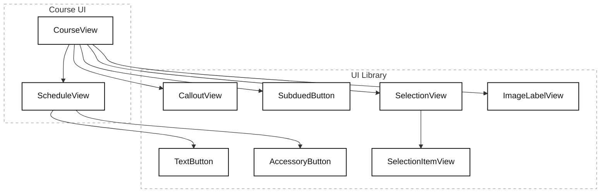

## 2장 [[10. Projects/Mobile System Design/StudyVault/UI-02-Reusable-Views/02. 재사용 가능한 뷰|재사용 가능한 뷰]]
- 이 장의 목표는 화면 하나를 전달하는 데 그치지 않고, 나아가 건강한 UI 라이브러리까지 구축하는 방법을 익히는 것이다.
- 화면을 분해하며 뷰 네이밍과 추상화에 극도로 깐깐하게 굴 것이다.
	- 네이밍은 특히 중요하며, 이름을 고민하다 보면 뷰의 역할과 계층에 대해 고민하게 된다.

- **뷰를 만드는건 쉬울지 몰라도, "올바른" 뷰를 만드는 건 어려울 수 있다.**

### UI 원칙 5 : 뷰 이름은 어떻게 쓰이는지가 아니라, 무엇인지를 따라서 지어라
- **대부분의 뷰는, 피처 도메인을 알 필요가 전혀 없다.**
	- 뷰는 피처를 지원하나, 피처를 알아야 할 필요는 없는 경우가 더 많다.
- 흔한 실수는 뷰에 너무 구체적인 이름을 짓는 것이다.
	- 그렇게 하면 덜 재사용 가능한 뷰 라이브러리와, 비슷하지만 살짝 다른 뷰들의 증가로 끝나게 된다.
	- 이런 사고방식으로 인해 "똑똑한" 뷰가 탄생할 수 있고, 이로 인해 더 복잡도가 늘어나게 된다.

#### 재사용 가능한 뷰 만들기
![[스크린샷 2026-09-16 at 12.36.31.png]]
- 튜터의 사진, 이름, 멘션이 있는 뷰를 만든다면 무엇이라고 부를 것인가?
- `TutorView`, `MentorView` 라고 생각했다면, 그건 재사용 가능한 뷰가 아니다.
	- 다른 사용자들에게도 일종의 프로필이 필요하다면, 이것을 재사용할 수 있을까?

- `TutorView` 대신 선택 가능한 선택지는 다음과 같다.
	1. `ProfileView` 처럼 더 범용적인 이름으로 뷰의 이름을 바꾼다.
	2. 뷰를 복제해서 `TutorView` 와 `ProfileView` 같은 타입을 둘 다 갖는다.
	3. 오버라이드로 뷰를 서브클래싱한다. 슈퍼클래스를 `ProfileView`, 서브클래스를 `TutorView` 라 부른다.
	4. 사용자와 튜터를 *둘 다* 지원하도록 뷰를 설정 가능하게 확장한다.
	5. 뷰 이름에서 "어떻게 보이는지"를 걷어낸다.

- 5번이 꽤 괜찮은 선택지로, 같은 뷰에도 다른 이름을 부여해 추상화를 진행할 수 있다.

#### 타입 이름 VS 인스턴스 이름
- `TutorView` 는 너무 구체적이다.
	- `ProfileView` 도 조금 낫긴 하지만, 여전히 "프로필용" 이라는 것을 흘리기에 너무 구체적이다.

- 가장 이상적인 것은 "어떻게 쓰이는지" 전혀 유추할 수 없는 이름을 짓는 것이 가장 좋다.
	- 그럼 **어떤 상황에서도 쓸 수 있게 된다.**
	- "무엇인지" 를 보여주는 이름이 중요하고, 결국 범용적인 이름을 생각해야 한다.
	- `ImageLabelView` 는 어떨까?

- `ImageLabelView` 는 용도와 완전히 분리되었기에, 언제든 재사용 가능한 뷰가 된다.
	- 뷰를 구체적으로 만들수록 특정 피처에만 쓰일 확률이 높아진다.
	- 뷰를 범용적으로 만들수록 UI 라이브러리에 위치해 더 많은 피처에 쓰일 확률이 높아진다.

#### 재사용 가능한 뷰를 코드로 표현하기
- 코드에서는 타입명이 아니라, 인스턴스의 이름으로 `TutorView` 와 같은 구체적 이름을 부여할 수 있다.

```kotlin
// DO NOT
val tutorView = TutorView(
	avatar: avatar,
	displayName: "Caleb Davis",
	handle: "@CalebGuitar"
)

// DO
val tutorView = ImageLabelView(
	image: avatar,
	title: "Caleb Davis",
	subtitle: "@CalebGuitar"
)
```

- 매개변수에 집중하자.
	- `TutorView` 에는 `avatar` 와 같은 구체적인 용어를 넘긴다.
	- 하지만 `ImageLabelView` 에는 더 범용적인 `image`,` title` 과 같은 매개변수를 넘긴다.
	- **뷰는 여전히 같지만, 모든 것에 더 범용적인 이름을 부여하는 것이다.**

#### View Primitive
- 우리는 뷰를 여러 화면에서 사용하고 있지만, 뷰의 타입은 자신이 어떻게 쓰이는지 알지 못하고, 애초에 신경조차 쓰지 않는다.
	- `ImageLabelView` 는 자신을 쓰는 피처가 무엇인지 모르는 "멍청한 뷰" 다.

- 멍청한 뷰라고 부르는 대신, `View Primitive` 로 분류해보자.
	- `String` / `Array` 와 같은 기본 타입으로 더 복잡한 모델을 만들 수 있듯, `View Primitive` 로도 더 복잡한 뷰를 만들 수 있다.

```kotlin
val tutorView = ImageLabelView(
    image = avatar,
    title = "Caleb Davis",
    subtitle = "@CalebGuitar"
)

val profileView = ImageLabelView(
    image = photo,
    title = "User Name",
    subtitle = "Bio"
)

val videoPreview = ImageLabelView(
    image = videoIcon,
    title = "Guitar introduction",
    subtitle = null
)

val errorView = ImageLabelView(
    image = alertIcon,
    title = "Oops, something went wrong",
    subtitle = "Try again later"
)
```

- 이름이 단순하니 위와 같이 다양한 유즈케이스에서 사용되는 것을 볼 수 있다.
- **원한다면 해당 뷰는 UI 라이브러리에 위치할 수도 있다.**

### 점점 더 구체적으로 변해가는 길
- 만약 `TutorView` 라는 이름과 함께 `displayName`, `handle` 과 같이 도메인 특화적인 파라미터를 유지했다면, 더 많은 시나리오를 확장하는 것이 어려워질 수 있었다.
	- 뷰를 좀 더 정교하게 만들기 위해 `firstName`, `lastName` 을 추가해야 한다면 뷰의 변형이 요구된다.
	- 그럼 뷰의 독립성이 훼손되고, 점점 더 **도메인 특화 뷰**로 자리잡게 된다.
	- **최악의 경우, `Tutor` 라는 도메인 모델 자체를 직접 뷰로 넘겨 구현하도록 변경될 수 있다!**

- 하지만 `IamgeLabelView` 로 유지하면, 파라미터가 자연스럽게 범용적인 이름으로 세팅된다.
	- 단 한 가지의 유즈케이스가 아니라, 더 범용적인 유즈케이스에서 언제든 사용할 수 있는 것이다.
	- 디커플링도 명시적으로 유지된다.
		- UI 라이브러리 내의 뷰에 `Tutor` 같은 도메인 모델을 넘기려고 하면 자연스럽게 모두가 수상함을 느낄 것이다.

- 작은 뷰에서는 크지 않을 수 있다.
	- 하지만 시간이 지나며 사람들은 자신의 상황에 맞게 뷰를 확장하고, 타입을 과하게 구체적으로 만든다.
	- **즉, 갈수록 강한 결합이 만들어지며 재사용성을 해치게 된다.**

### 새 타입을 도입하지 않고 추상화 도입하기
- `TutorView` 와 같은 구체 타입을 도입하지 않고도, 팩토리나 커스텀 생성자를 활용해 도메인 시나리오에 맞는 특별한 뷰를 생성할 수 있다.
	- `makeTutorView` 와 같은 팩토리 메소드를 만들고, 내부에서는 `ImageLabelView` 를 활용해 생성하는 것이 그 예다.
	- 해당 메소드는 도메인에 맞는 `displayName` `handle` 파라미터를 요구한다.

```kotlin
// 도메인에 맞는 뷰
val tutorView: ImageLabelView = CourseUI.makeTutorView(
	avatar: avatar,
	displayName: displayName,
	handle: handle,
)

object CourseUI {
    fun makeTutorView(
        avatar: Image,
        displayName: String,
        handle: String
    ): ImageLabelView {
        return ImageLabelView(
            image = avatar,
            title = displayName,
            subtitle = handle
        )
    }
}
```

- 새로운 타입을 도입하지 않고, `Course` 피처에 맞는 추상화를 얻게 되었다.

#### Alias 를 이용한 추상화
- 타입에 `Alias` 를 활용하는 방법으로도 추상화를 표현할 수 있다.

```kotlin
typealias TutorView = ImageLabelView

object CourseUI {
    fun makeTutorView(
        avatar: Image, 
        displayName: String, 
        handle: String
    ): TutorView {
        return TutorView(
            image = avatar, 
            title = displayName, 
            subtitle = handle
        )
    }
}
```

#### Extension 만들기
- `Extension` 을 활용하는 방법 역시 활용 가능하다.

```kotlin
fun TutorView(avatar: Image, displayName: String, handle: String): TutorView {
    return ImageLabelView(
        image = avatar,
        title = displayName,
        subtitle = handle
    )
}

val tutorView: TutorView = TutorView(
    avatar = image,
    displayName = "Caleb Guitar",
    handle = "@calebguitar"
)

// 반환 타입은 여전히 ImageLabelView와 동일
val view: ImageLabelView = TutorView(
    avatar = image,
    displayName = "Caleb Guitar",
    handle = "@calebguitar"
)
```

- `ImageLabelView` 를 사용하면서도 피처 내에서는 `TutorView`  로 활용할 수 있어 효율적이다.
- UI 라이브러리를 관리하는 팀이 따로 있다면, 이러한 `Extension` 을 활용하여 필요한 도메인에 배치할 수 있다.

### UI 원칙 6 : UI를 따라서 뷰의 이름을 짓지 마라
- 일종의 말풍선 뷰를 구현해보자.
![[스크린샷 2026-09-16 at 20.14.35.png]]
- 앞서 배웠듯, 튜터만 메시지를 보낼 수 있다고 암시하는 `TutorMessage` 라는 명칭은 사용하지 않는다.
	- 응원이라는 뜻을 나타내는 `Shoutout` 역시 적합하지 않다.
	- 다시 말하지만, "어떻게 쓰이는지" 는 뷰가 신경쓰지 않는다.

- 위 예시에서는 `callout` 이라는 표현이 범용적으로 쓰일 수 있는 표현이므로, `CalloutView` 라고 짓는다.
	- `Tutor`, `Course` 를 전혀 모르는 재사용 가능한 뷰가 또 하나 생긴 셈이다.

- **오른쪽 위 X 버튼은 어디에 있어야 할까?**
	- 사용하는 쪽에서 얹기? `CalloutView` 의 일부?
	- 이는 미묘한 결정이므로 어느 쪽이든 괜찮다.
		- **잘못 결정해도** 큰 지연을 일으키지 않는다.

- 마지막으로 화살표는 왼쪽 위에 고정되어 있다.
	- 만드는 시점부터 화살표가 더 많은 모서리를 지원하게 하거나, 아예 없는 버전도 지원할 수 있다.
	- 하지만 **웬만하면 뷰는 필요할 때만 설정 가능하게 만들기를 권장한다.**
	- `Tutor` 들이 `callout` 을 사용하지 않게 되면, 그냥 기능 자체를 지워버릴 수 있다.
	- 필요 이상으로 뷰를 재사용 가능하게 만드는 데 시간을 낭비하지 말라.

#### 또 다른 대안의 이름
- `SpeechBubble` 이라는 표현도 받아들일 수 있다.
	- 하지만, `callout` 보다는 나쁜 표현이다.
	- 정말 단순하게, `Tutor` 라는 도메인 입장에서는 해당 메시지가 말풍선에 담기든, 툴팁에 담기든 전혀 중요하지 않기 때문이다.

- **UI 스타일링과 이름을 분리하라.**
	- `SpeechBubble` 은 개발자에게 하여금 시각적 말풍선을 얻게 된다고 속삭인다.
	- **하지만, `Callout` 은 말풍선이든, 다른 무엇이든 어떤 스타일링을 유연하게 가질 수 있다.**

- `Callout` 이 좀 더 범용적이므로 미래에 좀 더 안전하다.
	- 미래에 디자이너가 말풍선 스타일을 느낌표 아이콘과 레이블로 교체한다면?
		- 이 땐 그냥 내부 코드만 다시 변경해주면 된다.
	- `SpeechBubble` 을 썼다면, 스타일링과 다르게 되므로 거짓된 이름이 된다.
		- 대응을 위해 리팩터링 하거나, `deprecated` 처리 해야 한다.

- 작은 뷰 하나만 다룰 땐 크지 않을 수 있어도, 규모가 커지면 문제가 된다.

### UI 원칙 7 : 똑똑한 뷰 대신, 조합을 선택하라
![[스크린샷 2026-09-16 at 20.22.01.png]]
- 위 뷰는 여러 레이블과 여러 버튼이 혼재하고 있다.
- 앞선 뷰들은 그저 더 나은 이름을 지어주는 것만으로 재사용 가능했었다.
- 하지만, 이 `ScheduleView` 는 너무나도 피처에 특화되어 있기 때문에 재사용이 사실상 불가능하다.
	- 범용적으로 이름을 짓는다 해도, 다른 누군가가 필요로 할 가능성은 매우 낮다.

- 즉, 재사용 가능한 뷰 자체가 필요하지 않은 상황이므로 `ScheduleView` 와 같이 더 구체적으로 이름을 유지해도 된다.

- 하지만, **뷰를 쪼개는 것 정도** 는 할 수 있다.
	- 조각으로 쪼개진 뷰들은 더 범용적이므로, UI 라이브러리에 위치시킬 수 있을 것이다.

#### 뷰 쪼개기
- "join call" 버튼은 `DetailButton` 이 될수도 있지만, 앞서 우리가 배웠듯 특정 유즈케이스에 묶이지 않게 `AccessoryButton` 이라고 이름지을 수 있다.
- "reschedule" 버튼도 `SmallButton` 대신 `TextButton` 이라고 명명할 수 있다.
- 두 버튼은 UI 라이브러리에 위치시킬 수 있게 됐다.

#### TODO-List 분해하기
![[스크린샷 2026-09-16 at 20.25.32.png]]
- 이 리스트는 사용자가 선택을 할 수 있는 종류의 리스트다.
	- 즉, `TodoListView` 보다 더 범용적으로 쓸 수 있다.
	- 뷰가 "무엇인지" 에 대한 이름에 더 걸맞도록 선택의 관점에서 `SelectionView` 라고 이름지을 수 있다.
	- 사용자가 하나 이상의 항목을 선택할 수 있는 뷰인 것이다.

- 나아가 하나의 `Row` 내에 있는 토글 버튼, 레이블, 화살표를 담은 `SelectionItemView`  도 만들 수 있다.
	- `SelectionView` 내에는 0개 이상의 `SelectionItemView` 가 있고, 항목 리스트를 표시하고 토글을 처리할 수 있다.
	- 이런식으로 계속 쪼개나가는 것이다.
	- 그리고 당연히, 두 뷰는 "무엇을" 나타내는지 표현했으므로 UI 라이브러리로 이전시킬 수 있다.

![[스크린샷 2026-09-16 at 20.34.14.png]]
- 위의 뷰롤 봤을 때 `BorderButton` 을 떠올렸는가?
	- 이는 외형을 흘리게 되고, 미래 업데이트에서 테두리가 지워질 수 있다.

- 기능 관점에서 바라보면 이는 일종의 덜 중요한, 절제된 (`subdued`) 버튼이다.
	- `SubduedButton` 이라고 이름짓는다.
	- 테두리가 있든, 밑줄 버튼으로 업데이트하든 언제나 절제된 버튼으로 기능한다.
	- 대안으로 `TeriartyButton` 도 생각해볼 수 있다.

#### 도메인 네이밍 VS 뷰 네이밍
- `SelectionView` 라면 `TodoList` 도메인은 왜 `Selection` 과 같은 이름으로 명명하지 않았는가?
	- `Selection` 도메인이라는 이름을 선택했다면, 다양한 선택 메커니즘을 지원할 수 있을 것이다.
	- 하지만, 우리의 경우 `TodoList` 는 단순하게 선택만 하는게 아니다.
		- API를 호출하고, `Todo` 를 초기화하고, 주간 `Todo` 가 있고 예약된 `Todo` 가 있다.
	- 즉, `TodoList` 는 `Seleciton` 보다 더 위쪽 레이어에 위치한다.
		- `TodoList` 라는 도메인 목표를 이루기 위해 `SelectionView` 를 사용할 수도 있지만, 또 다른 방법을 활용할 수 있다.

#### 미래를 생각해 너무 일찍 만들지 마라
- `SelectionView` 는 현재 다중 선택을 허용한다.
	- 그게 지금 먼저 제공해야 할 기능이고, 다른 사람도 쓸 수 있기 때문이다.
	- 다만 기능을 더 하고 싶다면 단일 선택 메커니즘을 지원할 수도 있다.
	- 하지만, 이 뷰의 유일한 사용자는 우리이고, 다른 누군가의 요구사항은 필요하지 않으므로 기능을 당장 제공해야 할 필요는 없다.

- 우리는 **먼 미래를 생각해 개발하지 않는다. 그건 오버엔지니어링일 뿐이다.**

### 최종 결과



- 원칙들을 적용해 화면을 구현했을 뿐인데, 이미 UI 라이브러리에서 사용할 수 있는 뷰들이 아주 많이 생겼다.
- "멍청한", `View Primitive` 는 서로 다른 피처들을 언제나 넘나들며 사용할 수 있다.
	- 중요한 점은 우리가 "혹시 몰라서" 재사용 가능하게 만든 게 아니라는 것이다.
		- 그저 이름을 짓고, 분해하는 방식으로만 재사용할 수 있도록 만들었다.
