# [WEEK 17] Book 1 Chapter 3
📖 Mobile System Design 1. UI Frameworks, Architectures, and Supporting Multiple Products  

 

## 3. Reasoning About Views, Components, Screens, and Bindings
> `view primitive`는 단순한 UI를 그리고 `view component`는 UI 동작과 binding을 맡되 feature의 business logic은 모른다. `feature view`는 특정 기능의 business logic을 UI와 연결한다.  
> 이 구분을 기준으로 view의 재사용 범위와 business logic을 UI에 연결할 위치를 정한다.  

### UI Principle 8: View components contain logic and/or bindings

- `view primitive`: 버튼과 label처럼 logic이 없거나 거의 없는 단순한 view
- `view component`: data를 표시하거나 사용자 입력을 처리하는 UI logic과 binding을 가진다  (**상태와 동작 처리**)

`SelectionView`는 선택 항목을 보관하고 toggle 결과를 반영하므로 view component이다. 단순히 다른 view를 배치하는 수준을 넘어 **상태와 동작을 처리**한다.  

#### Distinguishing view primitives from view components

| 분류             | 역할                                | 예시                             |
| -------------- | --------------------------------- | ------------------------------ |
| view primitive | 단순한 UI building block             | `TextButton`, `ImageLabelView` |
| view component | UI logic 또는 data binding을 가진 view | `SelectionView`                |

`view component`는 `view primitive`보다 한 단계 높은 추상화이다. 
component가 primitive를 사용하며 **primitive가 component를 알아서는 안 된다.**  

이 구분은 folder 구조를 강제하지 않는다. view를 어디에 두고 어떤 data를 받아야 하는지 판단하기 위한 기준이다.  

---

### UI Principle 9: View components remain unaware of business logic

`SelectionView`는 `TodoItem`을 표시할 수 있지만 Course feature를 알아서는 안 된다. 
선택에 필요한 정보만 `SelectionElement` interface로 받으면 component는 feature model에 직접 의존하지 않는다.  

component는 UI에 필요한 data와 동작만 알고 business logic은 바깥에서 연결한다.  

---

### Is making a reusable component worth it?

`TodoListView`를 Course 안에 두면 구현은 더 단순하다. 하지만 목록을 선택하는 UI를 다른 feature에서도 쓴다면 `SelectionView`와 `SelectionElement`를 만드는 편이 더 유연하다.  

재사용 component가 항상 정답은 아니다. **추가 abstraction이 현재 문제보다 더 큰 비용을 만들지 판단**해야 한다.  

---

### Deciding when to make reusable components

재사용을 먼저 고려할 때는 실제 사용 가능성만 보지 않는다. **구현 시간과 복잡도 증가 위험**도 함께 본다.  

#### A heuristic for making reusable components

`SelectionElement`처럼 작은 interface를 추가하고 core 구현을 거의 바꾸지 않아도 된다면 투자 비용이 낮다. 이 경우에는 재사용 component를 먼저 만들어도 위험이 작다.  

반대로 복잡한 API와 여러 variant가 필요하다면 실제 요구사항이 생길 때까지 feature 안에 두는 편이 낫다.  

---

### UI Principle 10: Features can have local components

`ScheduleView`는 logic이 거의 없는 view primitive이지만 Course feature에 가까이 둔다. 
다른 feature에서 쓸 가능성이 낮기 때문이다.  

다만 Course를 직접 알지 않도록 만들면 나중에 다른 화면에서 필요해졌을 때 UI library로 옮기기 쉽다. local에 둔다는 것은 feature model과 결합한다는 뜻이 아니다.  

---

### UI Principle 11: Feature views are connected to business logic

`CourseView`는 Course feature를 보여 주고 business logic과 연결된다. 이처럼 특정 feature의 data와 동작을 아는 UI를 feature view로 분류한다.  

feature view는 view primitive와 view component보다 높은 추상화에 있다. 다른 feature에서 그대로 재사용하는 대상은 아니다.  

---

### Connecting views to data

`CourseView`는 사용한 subview뿐 아니라 `Course` model도 안다. UI와 business logic이 만나는 지점이므로 feature view에 속한다.  

아래 구조는 `CourseView`가 `Course` model을 binding하고 UI library의 view를 조합하는 모습을 보여 준다.  

```mermaid
flowchart TB
    subgraph CourseDomain["Course domain"]
        direction TB

        subgraph CourseUI["Course UI"]
            direction TB
            CourseView["CourseView"]
            ScheduleView["ScheduleView"]
            CourseView --> ScheduleView
        end

        subgraph CourseModels["Course models & logic"]
            direction TB
            CourseService["CourseService"]
            CourseModel["Course model"]
            Marketplace["Marketplace"]
            TutorAPI["TutorAPI"]
            Calendar["Calendar"]
            TodoAPI["TodoAPI"]
            CourseService --> CourseModel
            CourseService --> Marketplace
            CourseService --> TutorAPI
            CourseService --> Calendar
            CourseService --> TodoAPI
        end
    end

    subgraph UILibrary["UI Library"]
        direction TB
        SelectionView["SelectionView"]
        TextButton["TextButton"]
        SelectionItemView["SelectionItemView"]
        AccessoryButton["AccessoryButton"]
        CalloutView["CalloutView"]
        SubduedButton["SubduedButton"]
        ImageLabelView["ImageLabelView"]
        SelectionView --> SelectionItemView
    end

    CourseView --> CourseModel
    CourseView --> SelectionView
    CourseView --> TextButton
    CourseView --> AccessoryButton
    CourseView --> CalloutView
    CourseView --> SubduedButton
    CourseView --> ImageLabelView

    style CourseDomain stroke-dasharray: 5 5,fill:#fff
    style CourseUI stroke-dasharray: 5 5,fill:#fff
    style CourseModels stroke-dasharray: 5 5,fill:#fff
    style UILibrary stroke-dasharray: 5 5,fill:#fff
```

`CourseView`가 `CourseService`에서 model을 받는 구체적인 방식은 아직 정하지 않았다. 먼저 feature view가 model을 UI에 연결한다는 역할을 분명히 한다.  

---

### Bindings can come in many forms

view와 business logic을 연결하는 방법에는 viewmodel과 controller, declarative binding, closure, publisher, coordinator 등이 있다. 

하나의 pattern을 정답으로 두기보다 **현재 UI에 필요한 연결 방식**을 고른다.  

#### The classic viewmodel

`CourseViewModel`을 두면 
- `CourseView`는 viewmodel에 의존하고 
- viewmodel이 `Course`와 `CourseService`에 연결된다. 
- view에서 logic을 분리하고 viewmodel을 unit test할 수 있다.  

view가 model을 직접 알지 않게 되지만 feature view라는 성격이 사라지는 것은 아니다. business logic으로 가는 경로에 viewmodel이 하나 추가될 뿐이다.  

#### A separation of concerns

viewmodel을 두면 `CourseView`와 model을 한 단계 분리할 수 있다. test에서는 viewmodel이 hard-coded `Course`를 제공하도록 바꿀 수도 있다.  

하지만 이 예시의 `CourseView`는 이미 가볍다. business logic은 model layer에 있고 재사용 view도 UI library에 분리되어 있으므로 얕은 `CourseViewModel`은 얻는 것보다 indirection을 더 많이 만든다.  

#### Deciding if you need more layers of indirection

viewmodel처럼 새로운 layer는 해결하는 문제가 늘리는 복잡도보다 클 때 도입한다. data 변환과 상태 관리처럼 많은 일을 한다면 layer의 가치가 있다.  

반대로 전달만 하는 viewmodel은 code를 따라가는 단계만 하나 늘린다.  

#### When viewmodels make sense

다음 상황에서는 viewmodel이나 비슷한 type이 역할을 가질 수 있다.  

- 재사용 view가 business logic을 전혀 알지 않게 해야 할 때
- view가 커져서 UI 관련 상태와 변환을 분리해야 할 때
- third-party SDK data를 화면에 맞는 형태로 바꿔야 할 때

> [!Note]
> Android의 ViewModel은 lifecycle을 인식하고 구성 변경 뒤에도 state를 유지할 수 있다. 
> Android에서는 이런 플랫폼 요구사항도 ViewModel을 선택하는 근거가 된다.  

#### Imperative considerations

UIKit의 view controller처럼 lifecycle과 view 설정을 함께 맡는 type은 business logic까지 모이기 쉽다. 
화면 회전과 font size, foreground 전환처럼 처리할 일이 많아질수록 controller가 커진다.  

viewmodel은 이 복잡도를 줄이는 한 방법이다. 다만 view 관련 code를 controller 밖으로 꺼내는 방법도 있다.  

#### Making imperative code leaner

별도의 view를 만들고 controller가 이를 사용하게 하면 controller가 view를 직접 조립할 필요가 없다. controller는 lifecycle 변화에 반응하고 business logic을 view에 binding하는 역할에 집중한다.  

이 구조에서는 `CourseViewController`가 feature view가 된다. 분리된 `CourseView`는 business logic을 모르므로 view component로 낮아지고 더 단순해진다.  

---

### UI Principle 12: Feature views aren't always full-screen

phone에서 전체 화면을 쓰는 `CourseView`도 tablet의 master-detail layout에서는 일부 영역만 차지할 수 있다. map view도 같은 UI가 상황에 따라 전체 화면 또는 일부 영역에 나타날 수 있다.  

따라서 **화면을 얼마나 채우는지가 feature view의 기준은 아니다.**  

#### Not every screen is necessarily a feature

전체 화면 alert처럼 **business logic이 거의 없는 UI는 view primitive**일 수 있다. 
photo picker처럼 full-screen이지만 feature를 모르는 UI는 view component가 될 수 있다.  

코드에서는 screen이라는 크기 기준의 표현보다 **기능과 business logic의 연결을 기준으로 view를 분류**한다. 다만 디자이너와의 대화에서는 full-screen UI를 screen이라고 부를 수 있다.  

---

### Conclusion

declarative UI와 imperative UI는 구현 방식이 다르다. 하지만 view가 무엇을 알고 어떤 역할을 맡아야 하는지 판단하는 기준은 같다.  

view primitive와 component, feature view의 경계를 먼저 정하면 각 UI pattern을 필요한 범위에서 선택할 수 있다.  

---

### What we covered

- view primitive는 단순한 UI building block이며 feature를 모른다.
- view component는 UI logic이나 binding을 가지지만 business logic에 의존하지 않는다.
- feature view는 특정 feature의 business logic을 UI와 연결한다.
- 재사용 component는 구현 비용과 복잡도 위험이 낮을 때 먼저 만든다.
- viewmodel은 분명한 문제를 해결할 때만 추가한다.
- feature view와 screen은 같은 말이 아니다. full-screen UI도 primitive나 component일 수 있다.
