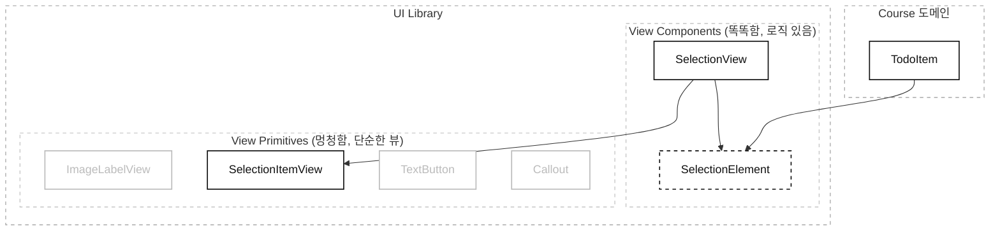
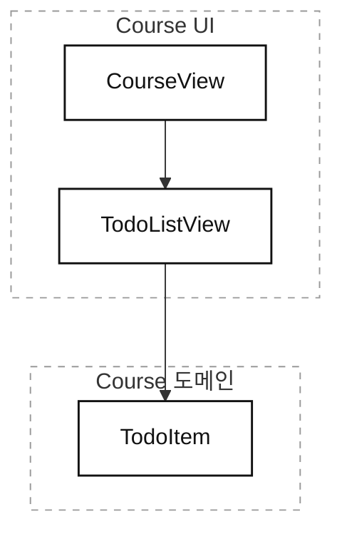
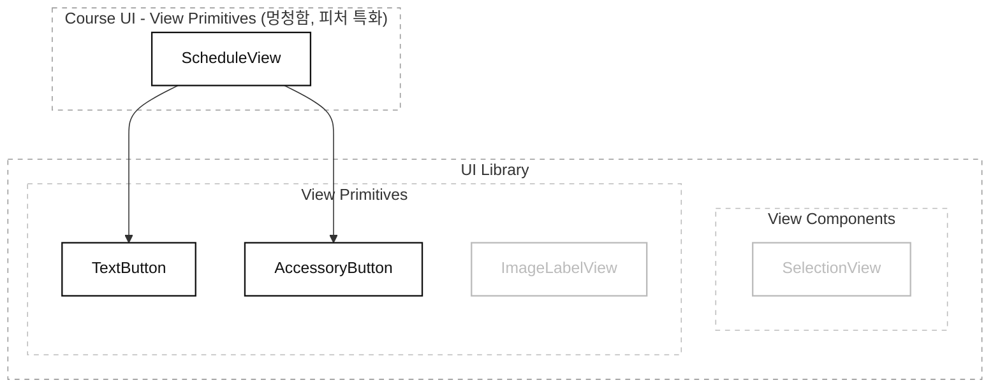
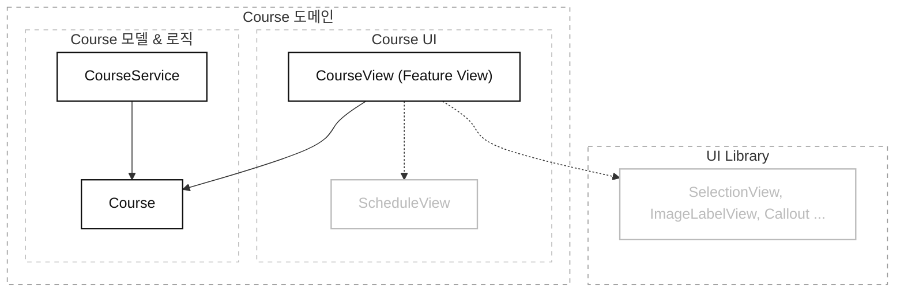
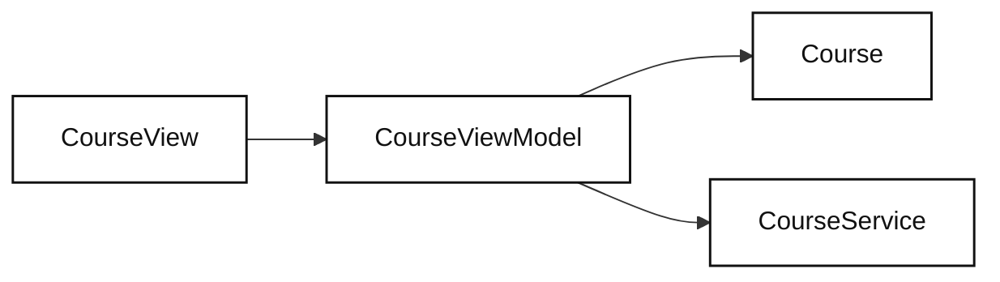
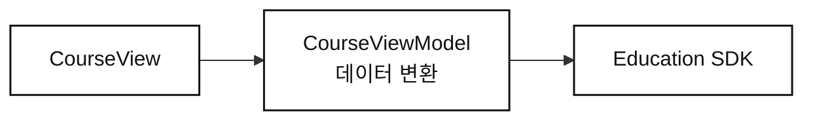
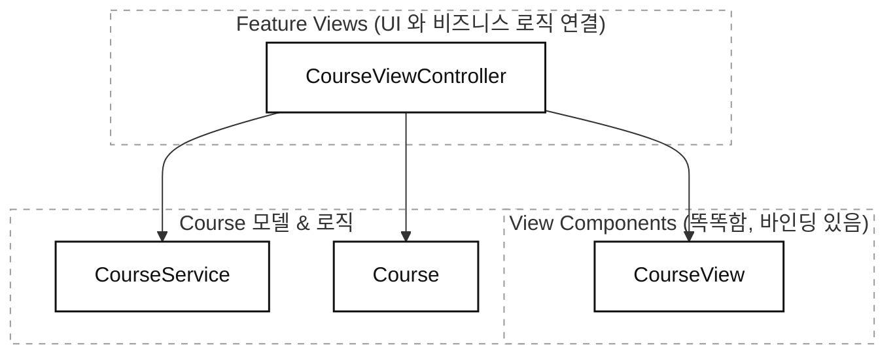

```table-of-contents
```

## 3장 [[10. Projects/Mobile System Design/StudyVault/UI-03-Views-Components-Screens/03. 뷰, 컴포넌트, 스크린|뷰, 컴포넌트, 스크린]]

> 컴포넌트가 먼저인가, 뷰가 먼저인가?

- 2장에서 만든 뷰 대부분은 데이터와 로직이 거의 없는 "멍청한" `View Primitive` 였다.
- 하지만 고객에게 보이는 피처는 결국 `Course`, `Tutor` 같은 모델에 연결되어야 동작한다.
	- **즉, 뷰와 비즈니스 로직을 둘 다 아는 코드 조각이 필요하다.**
	- 뷰를 데이터와 사용자 입력에 연결하는 것을 **바인딩**이라 부른다.

- MVC 의 컨트롤러든, MVVM 이든, 선언형 프레임워크의 상태 처리든 결국 하는 일은 같다.
	- 사용자 입력을 받고, 데이터 변화에 반응하고, 뷰가 최신 데이터를 보여주게 만드는 것이다.

- 이번 장에서는 뷰를 세 가지로 분류하고, 로직과 바인딩을 어디에 둘지 고민한다.
	- 뷰를 언제 재사용 가능하게 만들지, 뷰모델은 언제 필요한지, "스크린" 이란 무엇인지도 짚어본다.
	- 다이어그램 위주의 장이고, 실제 구현은 다음 장에서 한다.

### UI 원칙 8 : 뷰 컴포넌트는 로직이나 바인딩을 담는다
- 이 책에서 `View Primitive` 는 버튼, 레이블, 스위치처럼 더 복잡한 뷰를 만드는 기본 빌딩 블록이다.
- 여기서 한 단계 올라가, 데이터 바인딩을 이해하거나 로직을 캡슐화하는 뷰를 `View Component` 라고 부른다.
	- 그래서 "똑똑한" 뷰다.
	- "컴포넌트" 는 플랫폼마다 뜻이 다르다. React Native 는 대부분의 뷰를 `Component` 라 부른다.
	- 이 책에서는 **데이터와 로직을 가진 뷰**를 컴포넌트로 정의한다.

- 사실 2장의 `SelectionView` 가 이미 뷰 컴포넌트였다.
	- 요소 리스트를 관리하고, 어떤 요소가 토글됐는지 추적하고, 액세서리 버튼을 탭하면 변경을 전파한다.
	- 상태, 로직, 데이터가 있어야 동작하므로 단순한 버튼, 레이블보다 정교하다.

#### 프리미티브와 컴포넌트 구별하기



- 뷰 컴포넌트는 뷰 프리미티브보다 한 추상화 계층 위에 있다.
	- **컴포넌트는 프리미티브를 쓸 수 있지만, 그 반대는 안 된다.**
- 내비게이션 바, 컬러 피커, 날짜 피커, 세그먼티드 컨트롤, 슬라이더, 텍스트 필드 등이 뷰 컴포넌트의 예다.
	- OS 가 제공하는 것도 있지만, 직접 만들어 보충해야 할 때가 많다.

- 로직이 더 많아도, **컴포넌트는 프리미티브처럼 자신이 쓰이는 피처를 모른다.**
	- 그래서 UI 라이브러리에 살 수 있고, 이론상 수백 개의 피처에서 쓸 수 있다.

- 이 분류는 머릿속에서 추론을 돕기 위한 것이지, 당장 폴더를 나누자는 게 아니다.
	- 다만 컴포넌트, 피처, 스크린, 디자인 시스템이 쌓이면 "이 뷰는 어디에 속하지?", "이 뷰는 데이터 모델과 어떻게 이어지지?" 같은 질문에 답하기 어려워진다.
	- 뷰의 역할이 흐릿하면 특정 피처와 강하게 결합되기 쉽다.
	- 그럼 UI 라이브러리를 만들기도, 코드를 다른 피처나 모듈로 옮기기도 어려워진다.

### UI 원칙 9 : 뷰 컴포넌트는 비즈니스 로직을 모른다
- `SelectionView` 는 양방향 바인딩을 다룬다.
	- `Course` 가 투두 항목을 넘겨주면 `SelectionView` 가 보여준다.
	- 사용자가 항목을 탭하면 `SelectionView` 의 상태가 바뀌고, 그 변경이 다시 `Course` 모델을 업데이트해야 한다.

- 즉, `Course` 피처의 데이터는 필요하지만 `Course` 피처를 알아서는 안 된다.
	- 여기서 `SelectionView` 가 코스를 알게 만들어버릴 위험이 생긴다.
	- UI 라이브러리로 옮긴 순간, 비즈니스 로직을 모른다는 사실은 명시적인 약속이 되었다.

- 해법은 단순하다. **인터페이스를 하나 도입하면 된다.**
	- UI 라이브러리에 `SelectionElement` 인터페이스를 두고, `TodoItem` 이 이를 구현하게 만든다.
	- 그럼 `SelectionView` 는 `Course` 를 모르면서도 `TodoItem` 과 일할 수 있다.

```kotlin
// UI 라이브러리 : Course 를 전혀 모른다
interface SelectionElement {
    val id: UUID
    val title: String
    val completed: Boolean
}

@Composable
fun <T : SelectionElement> SelectionView(
    elements: List<T>,
    onToggle: (T) -> Unit,
) { /* ... */ }

// Course 도메인 : 인터페이스를 구현하기만 한다
data class TodoItem(
    override val id: UUID,
    override val title: String,
    override val completed: Boolean,
) : SelectionElement
```

- 사용자가 요소를 탭했을 때 `Course` 모델에 반영하는 바인딩은 여전히 풀어야 한다.
	- 클로저나 SwiftUI 의 `@Binding` 같은 기법을 쓸 수 있고, 다음 장에서 코드로 다룬다.
	- Kotlin 은 Swift 의 `extension` 처럼 기존 타입에 인터페이스를 나중에 붙일 수 없다.
		- 도메인 모델이 UI 라이브러리를 의존하는 게 싫다면, UI 레이어에서 감싸거나 매핑하는 방법을 고려해볼 수 있다.

### 재사용 가능한 컴포넌트, 만들 가치가 있을까?
- `SelectionView` 를 재사용 가능하게 만드느라 인터페이스까지 도입했다.
	- `Course` 가 이걸 쓰는 **유일한** 피처이니, 오버엔지니어링이라고 말할 수도 있다.
	- `TodoItem` 을 직접 쓰는 `TodoListView` 를 만드는 편이 당장은 더 쉽다.



- 이 대안에서 `TodoListView` 는 UI 라이브러리와 아무 연이 없고, 비즈니스 로직까지 담는다.
	- `TodoItem` 을 직접 다루니 코드는 더 단순하다.
	- **하지만 그만큼 융통성을 많이 포기했다.**
- 책에서는 계속 `SelectionView` 를 쓴다. 그럼 이 선택을 어떻게 정당화할 수 있을까?

#### 재사용 가능한 컴포넌트를 만들 시점 정하기
- "다른 피처도 이 컴포넌트가 필요할까?" 처럼 재사용 **확률**로 판단하고 싶어진다.
	- 하지만 우리는 미래를 잘 예측하지 못한다.
	- 예측을 잘했다면 모든 소프트웨어 프로젝트가 순탄하게 끝났을 것이다.

- 경험칙은 이렇다.
	- **가정 시나리오를 위해 컴포넌트를 재사용 가능하게 만들지 않는 쪽으로 기울어라.**
	- **재사용이 필요해지면, 그때 재사용 가능하게 만들어라.**

- 그렇다고 미리 만드는 게 **절대** 안 된다는 뜻은 아니다.
	- 목표는 위험 최소화다.
	- 재사용 가능하게 만든 컴포넌트를 다른 피처가 끝내 쓰지 않더라도, 피해가 거의 없으면 된다.

#### 위험 기반 휴리스틱
- 판단 기준은 **확률이 아니라 투자**다. 두 축으로 본다.
	- 재사용 가능하게 만드는 데 드는 **시간 투자**
	- 그로 인해 늘어나는 **복잡성**

- 시간을 많이 들였는데 아무도 안 쓰면, 선행 투자만큼 시간을 낭비한 것이다.
- 시간은 적게 들였어도 컴포넌트가 눈에 띄게 복잡해졌다면, 이유 없이 복잡한 컴포넌트를 떠안게 된다.
- **시간 투자도 적고 복잡성도 낮게 유지된다면, 해볼 만한 투자다.**

| 시간 투자 / 복잡성 | 단일 유즈케이스인데 재사용 가능하게? |
| --- | --- |
| 둘 다 낮음 | Yes |
| 어느 정도 있음 | No |
| 많이 듦 | Definitely not |

- `SelectionView` 는 다른 곳에서도 쓰일 것 같지만, 그 예측 자체가 함정이다.
	- 선택 UI 는 정말 흔하지만, 그래도 틀릴 수 있다.
	- 대신 투자를 따지면, 프로퍼티 두세 개짜리 인터페이스 하나가 늘 뿐이고 뷰의 핵심 구현은 그대로다.
	- **투자도 복잡성도 낮으니, 처음부터 재사용 가능하게 만들 가치가 있다.**

- 2장에서 뷰들을 곧장 UI 라이브러리에 둔 이유도 같다.
	- 이름만 바꿨을 뿐, 추가 노력이 거의 0이었다.
	- 가정 시나리오를 위해 복잡성을 미리 늘리지 않았다.

### UI 원칙 10 : 피처는 지역 컴포넌트를 가질 수 있다
- 튜터와의 1대1 통화 일정을 보여주는 `ScheduleView` 를 보자.
	- 버튼 콜백 두 개와 레이블 몇 개뿐이라 로직이 거의 없다. 즉, `View Primitive` 다.
	- 하지만 다른 프리미티브와 달리 **UI 라이브러리가 아니라 `Course` 피처 폴더에 둔다.**
	- `Course` 피처의 세부 사항과 밀접하게 묶여 있어, 다른 피처가 필요로 할 가능성이 낮기 때문이다.



- 하지만 "다른 피처가 안 쓸 것이다" 역시 예측일 뿐이다.
	- 그래서 `ScheduleView` 도 **`Course` 피처를 모르게** 만든다.
	- 예측이 틀려 다른 화면에서 필요해지면, 그냥 UI 라이브러리로 옮기면 된다.

```kotlin
// Course 피처 폴더에 있지만, Course 를 모른다
@Composable
fun ScheduleView(
    date: LocalDateTime?,
    onJoinCall: () -> Unit,
    onReschedule: () -> Unit,
) { /* ... */ }
```

- **위치는 피처 안에 두되, 독립성은 유지한다.**

### UI 원칙 11 : 피처 뷰는 비즈니스 로직에 연결된다
- 프리미티브, 컴포넌트 말고도 비즈니스 로직으로 피처를 지원하는 뷰가 있다. 이를 `Feature View` 로 분류한다.
	- `CourseView` 가 그 예다. 브리핑의 Course 화면 그 자체다.
	- 자신이 쓰는 뷰들뿐 아니라 연관된 비즈니스 로직까지 안다.
	- **즉, UI 와 비즈니스 로직이 만나는 자리다.**



- `CourseView` 는 `Course` 모델을 **안다.**
	- 지금까지 만든 어떤 뷰보다 구체적이고, `Course` 피처 안에서만 쓸 수 있어 재사용성은 낮다.
	- `CourseService` 에서 `Course` 를 어떻게 받을지는 아직 정하지 않았다.
	- 중요한 건, `CourseView` 가 `Course` 모델을 자기 뷰와 서브뷰에 **바인딩**하는 방식으로 동작한다는 점이다.

- 왜 "스크린" 이 아니라 "피처 뷰" 라고 부르는지는 원칙 12 에서 다룬다.

### 바인딩은 여러 모습으로 온다
- `CourseView` 를 `Course` 에 잇는 방법은 수없이 많다.
	- 뷰모델, 컨트롤러, 선언형 바인딩, 상태 핸들러, 클로저, 퍼블리셔, 코디네이터 등등.
- 어떤 방식을 고르는 순간, 어떤 패턴이 "최고" 인지를 둘러싼 논쟁이 시작된다.
	- **UI 아키텍처 논쟁의 상당 부분은 결국 "바인딩" 을 중심으로 돈다.**
	- 그리고 우리는 지금 아키텍처가 멀쩡한데도 갈아타느라 바쁘곤 하다.

#### 고전적인 뷰모델
- `CourseView` 의 로직을 `CourseViewModel` 로 뽑아내는 흔한 접근이다.
	- `CourseView` 에서 로직이 빠지고, `CourseViewModel` 은 단위 테스트가 가능해진다.



- 그래도 `CourseView` 는 여전히 `Course` 로 가는 경로를 가진다. 한 홉이 늘었을 뿐이다.
	- 간접적으로라도 비즈니스 로직에 의존하므로, 여전히 **피처 뷰**다.

- 뷰모델 덕분에 `CourseView` 와 `Course` 사이의 강한 결합은 사라진다.
	- `CourseView` 를 건드리지 않고 `CourseViewModel` 구현을 바꿀 수 있다.
	- 예를 들어 테스트용 하드코딩된 `Course` 를 반환해도 `CourseView` 는 모른다.

- **하지만 우리 상황에서는 얻는 게 거의 없다.**
	- 이미 로직과 복잡성 대부분을 모델 레이어로 밀어냈고, 재사용 가능한 뷰는 UI 라이브러리로 뺐다.
	- `CourseView` 는 이미 가볍고, 비즈니스 로직 대부분은 이미 단위 테스트가 가능하다.
	- 이 상태에서 `CourseViewModel` 을 만들면 아주 얕은 추상화가 된다. 가치는 거의 없고 간접 계층만 늘어난다.

- 선언형 세계에서는 별도 뷰모델이 없으면 `CourseView` 자체를 뷰모델로 보는 사람도 있다.
	- 비즈니스 로직을 UI 에 잇는 역할을 하기 때문이다.

#### 간접 계층이 더 필요한지 판단하기
- **간접 계층은 만들어내는 문제보다 풀어주는 문제가 많을 때 도입한다.**
	- 뷰모델이 무거운 일을 많이 해준다면 도입할 명분이 있다.
	- 날씬해서 해주는 게 적다면, 복잡성과 간접성만 더할 뿐이다.
- 그래서 `CourseView` 에는 뷰모델을 두지 않는다.

#### 뷰모델이 말이 되는 경우
- 재사용 가능한 뷰를 비즈니스 로직에 연결할 때
	- 뷰가 비즈니스 로직과 완전히 분리된 채로 남을 수 있다.
- 큰 뷰를 작게 유지하고 싶을 때
- 플랫폼이 뷰모델을 강하게 요구할 때
	- **Android 에서는 뷰모델이 기본 선택이 될 수 있다.**
	- 라이프사이클을 인지하고, 화면 회전 같은 구성 변경에서 상태를 보존해주기 때문이다.
- 비즈니스 로직의 데이터가 UI 에서 쓰기에 인체공학적이지 않을 때

- 마지막 경우의 예로, 깔끔한 `Course` / `CourseService` 대신 서드파티 Education SDK 가 데이터를 준다고 해보자.
	- 이 SDK 는 코스에 대해 아무것도 모른다.
	- `CourseViewModel` 이 데이터 변환을 맡으면, `CourseView` 는 가볍게, SDK 를 모르는 상태로 유지된다.



- 이건 `CourseView` 전용 해법이다.
	- 여러 곳에서 필요하다면 변환 코드를 모델 레이어로 밀어내면 된다.

#### 명령형 코드를 날씬하게 만들기
- 명령형 코드에서는 뷰 관련 코드가 거대해지기 쉽다.
	- iOS UIKit 의 뷰컨트롤러는 뷰를 담으면서 라이프사이클(회전, 글꼴 크기, 백그라운드/포그라운드 전환)까지 인지한다.
	- 화면의 중심점이다 보니 비즈니스 로직까지 들어가고, 관리하지 않으면 수천 줄이 된다.
	- Android 로 치면 `Activity` / `Fragment` 가 비대해지는 것과 비슷한 이야기다.

- 그래서 보통은 비즈니스 로직을 뷰모델 같은 중재자로 **모두** 옮겨 뷰컨트롤러를 줄인다.
- 하지만 **타입과 패턴을 더하는 대신, 뷰를 들어내는** 방법도 있다.
	- 뷰 설정을 별도 파일의 뷰로 추출하고, 뷰컨트롤러는 그 뷰에 **의존**만 하게 만든다.
	- 비즈니스 로직은 이미 두툼하게 UI 밖에 있으니, 뷰컨트롤러가 모델에 직접 의존해도 된다.
	- 뷰컨트롤러의 역할은 **비즈니스 로직을 뷰에 이어 붙이고, 라이프사이클 변화에 반응하는 것**으로 좁혀진다.
	- 결과적으로 뷰컨트롤러는 날씬해지고, 뷰모델은 필요 없어진다.



- 이제 피처 뷰는 `CourseViewController` 다.
	- `CourseView` 는 **피처 뷰에서 뷰 컴포넌트로 강등**된다. 여전히 똑똑하지만, 비즈니스 로직은 몰라도 된다.
	- **뷰의 강등은 대부분 좋은 일이다.** 더 단순해지고, 필요할 때 재사용하기도 쉬워진다.

- 책의 나머지는 SwiftUI 같은 선언형 UI 를 중심으로 진행한다.

### UI 원칙 12 : 피처 뷰가 항상 풀스크린인 건 아니다
- 그럼 피처 뷰를 왜 "스크린" 이라고 부르지 않을까? **스크린이란 대체 무엇일까?**
	- 보통 스크린은 기기 화면의 모든 픽셀을 쓰는 UI 를 말한다.
	- `Course` 피처도 화면 전체를 차지하니 스크린이라 부를 만하다.

- 하지만 이 정의는 뷰가 풀스크린이 아니게 되는 순간 깨진다.
	- 태블릿의 마스터-디테일 레이아웃에서는 폰의 스크린 두 개가 합쳐져 하나의 스크린이 된다.
		- 왼쪽에 코스 리스트, 오른쪽에 `CourseView` 가 있다면, `CourseView` 는 더 이상 스크린이 아니다.
	- 지도 뷰는 어떤 맥락에선 화면 전체를, 다른 맥락에선 화면의 50% 만 차지할 수 있다.
		- 시각적으로 똑같은데도, 후자에서는 "스크린" 이 아니게 된다.

#### 모든 스크린이 피처인 건 아니다
- 그럼 "스크린 = 피처" 일까? 그것도 항상 맞진 않다.
	- 제목과 버튼 하나뿐인 풀스크린 알림 뷰는 화면 전체를 쓰지만 기능은 최소다. **뷰 프리미티브**다.
	- 풀스크린 포토 피커는 자신이 쓰이는 피처를 전혀 모른다. 여러 피처에서 쓰는 **뷰 컴포넌트**다.

- **"스크린" 은 뷰의 기능과 분리된 용어이고, 스크린이 항상 비즈니스 로직에 묶여 있는 것도 아니다.**
	- 그래서 화면 크기가 아니라 **기능**으로 뷰를 분류한다.
	- 비즈니스 로직을 가진 뷰를 **피처 뷰**라 부르는 이유다. 풀스크린이든 아니든 중요하지 않다.

- 코드베이스를 추론할 때는 "스크린" 과 "뷰" 를 섞어 쓰지 않도록 한다.
	- 다만 디자이너나 팀원과 이야기할 때는 "스크린", "컴포넌트", "피처" 같은 말을 쓰는 게 소통에 이롭다.

### 정리

| 분류 | 로직 / 바인딩 | 피처를 아는가 | 주로 사는 곳 | 예시 |
| --- | --- | --- | --- | --- |
| View Primitive | 없거나 최소 | 모른다 | UI 라이브러리, 또는 피처 폴더 | `TextButton`, `ScheduleView`, 풀스크린 알림 |
| View Component | 있다 ("똑똑함") | 모른다 | UI 라이브러리 | `SelectionView`, 날짜 피커, 포토 피커 |
| Feature View | 있다 | 안다 | 피처 | `CourseView`, `CourseViewController` |

- 뷰가 어디에 살지는 재사용 가능성으로 정하되, **피처를 모르게 만드는 건 위치와 상관없이 지킨다.**
- 뷰모델 같은 간접 계층은 **풀어주는 문제가 만들어내는 문제보다 많을 때만** 도입한다.
- 재사용성은 확률이 아니라 **시간 투자와 복잡성**으로 판단한다.
- 스크린은 화면 크기의 개념이고, 뷰의 분류는 **기능**으로 한다.
