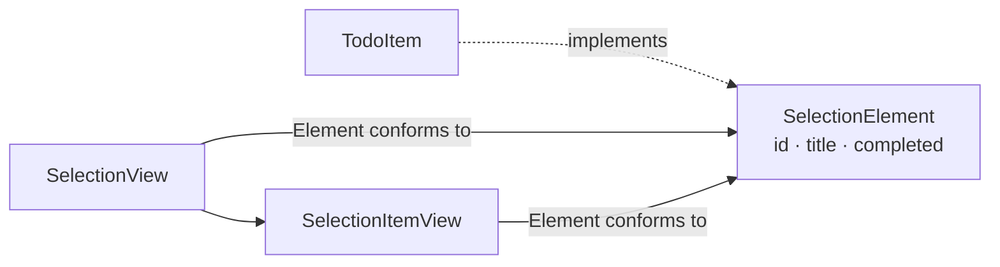

# [WEEK 18] Book 1 Chapter 4
📖 Mobile System Design 1. UI Frameworks, Architectures, and Supporting Multiple Products  

 

## 4. Pragmatically Implementing UI
> UI와 데이터를 연결해 기능이 동작하는 화면을 먼저 만들고, 실제 흐름을 확인한 뒤 세부 디자인을 다듬는다.  

### Beginning the implementation

구현 대상은 앞서 나눈 **subview를 조합한 `CourseView`** 이다. 
이번에는 tab bar나 navigation bar 같은 화면 주변 UI인 chrome은 다루지 않는다.  

---

### Considering various approaches

`CourseView`와 subview를 어떤 순서로 구현할지에 따라 속도와 결합 위험이 달라진다.  

#### 1. A top-down approach

먼저 `CourseView`를 만들고 **필요한 부분을 subview로 분리**한다. 
- 선언형 UI에서는 코드를 옮겨 view를 추출하기 쉽다. 
- 명령형 UI에서는 큰 view에서 분리하기 어려우므로 구현 전에 subview 이름과 경계를 정해두는 편이 낫다.  

subview를 아직 분리하지 않은 상태에서는 `SelectionView`가 `TodoItem`을 직접 알게 되는 등 UI와 business logic이 쉽게 결합될 수 있다.  

#### 2. A bottom-up approach

먼저 `view primitive`와 `component`를 구현한 뒤 이를 사용하는 `CourseView`를 만든다. 

**장점**
- 미리 API 경계를 만들면 작은 UI가 Course data에 직접 의존하는 일을 막기 좋다. 
- 여러 명이 나눠 작업할 때도 각 view의 입력과 역할을 맞출 수 있다.  

**단점**
- subview의 세부 구현에 시간을 써서 핵심 화면을 완성하는 일이 늦어질 수 있다.  

#### 3. A holistic approach

필요한 subview와 API를 먼저 정하되 **구현은 placeholder**로 둔다. 
1. placeholder를 연결해 `CourseView`를 먼저 완성한 다음 
2. 하위 view를 실제 구현으로 바꿔간다.  

이 방식은 **전체 구조를 먼저 연결하면서 상위 화면에 집중**할 수 있다.  

#### 4. A mixed approach

여기서는 **subview 구조를 미리** 만들고 **실제 디자인과 비슷한 placeholder**로 `CourseView`를 구성한다. 
색상은 적용하되 정확한 margin, font, spacing, icon은 뒤로 미룬다.  

화면을 먼저 동작하게 만들면 
- view 조합과 data 연결, app 안에서의 기능을 확인할 수 있다. 
- 세부 모양을 다듬느라 pixel-perfect 구현에 빠지는 일을 줄인다.  

| 접근 방식 | 먼저 하는 일 | 주의할 점 |
| --- | --- | --- |
| Top-down | `CourseView`를 만든 뒤 subview 추출 | 분리 전 UI와 business logic이 결합될 수 있음 |
| Bottom-up | subview와 API를 먼저 구현 | 세부 구현에 집중해 상위 화면이 늦어질 수 있음 |
| Holistic | subview를 placeholder로 연결해 상위 화면 구현 | 하위 구현은 이후 단계에서 채워야 함 |
| Mixed | 디자인과 비슷한 placeholder로 화면을 먼저 동작시킴 | 시각적 완성도는 뒤에 보완해야 함 |

---

### How we'll load the data

`CourseView`가 직접 course를 불러오게 하지 않고 전달받은 `Course`를 먼저 표시한다. 
어디서 data를 가져오는지보다 화면이 `Course` model과 제대로 동작하는지부터 확인한다.  

avatar는 network에서 불러오지 않고 임시로 지정한다. 이 단계에서는 화면 구현의 흐름을 위해 network loading을 미룬다.  

todo 목록의 sorting과 filtering은 이 장에서 구현하지 않는다. 화면을 만들 때는 해당 model logic이 이미 완성된 것으로 전제한다.  

---

### A SwiftUI crash course

SwiftUI의 layout view와 state 연결 방식을 이해하는 데 필요한 요소만 살펴본다.  

| SwiftUI | 역할 | Compose에서 가까운 개념 |
| --- | --- | --- |
| `ScrollView` | 화면을 넘겨 보는 영역 | `verticalScroll` 또는 `LazyColumn` |
| `VStack` / `HStack` | 세로 / 가로 배치 | `Column` / `Row` |
| `ZStack` | view를 겹쳐 배치 | `Box` |
| `Group` | layout을 추가하지 않고 view를 묶음 | 직접 대응하는 wrapper는 없음 |
| `Spacer` / `Padding` / `Divider` | 빈 공간, 여백, 구분선 | `Spacer`, `Modifier.padding`, `HorizontalDivider` |
| `@State` | view가 소유하는 상태 | `remember { mutableStateOf(...) }` |
| `@Binding` | 바깥에서 소유한 값을 읽고 수정하는 연결 | state와 변경 callback을 함께 전달하는 방식 |

`@Binding`과 Compose state는 문법이 같지는 않다. Compose에서는 보통 상태와 변경 callback을 함께 전달해 상위 상태를 갱신한다.  

---

### Starting with CourseView

`CourseView`는 `Course`를 전달받아 화면을 그린다. 전달받은 model을 수정하면 소유한 상위 view에도 변경이 반영된다.  

data loading을 함께 구현하지 않고도 실제 `Course`를 기준으로 화면을 먼저 만들 수 있다.  

---

### Simplifying view code

`body`가 화면의 큰 구성을 보여주도록 tutor 정보 영역을 `tutorView`라는 private property로 분리한다. 
세부 UI는 필요할 때 안쪽 구현을 확인하면 된다.  

간단한 부분은 local property로 둘 수 있다. binding이 많아지거나 구현이 복잡해지면 별도의 private view type으로 나눌 수 있지만 type과 namespace가 늘어나는 비용도 고려한다.  

---

### Implementing SelectionView

`SelectionView`는 `TodoItem`을 직접 참조하지 않는다. 
- `SelectionElement`는 읽기 전용 `id`와 `title`, 수정 가능한 완료 상태를 정의
- `TodoItem`은 위 계약을 구현
- `SelectionView`는 항목 목록을 받아 row를 만들고 accessory button의 동작을 전달한다.  

#### Defining SelectionView

항목 배열은 binding으로 전달한다. 사용자가 항목 상태를 바꾸면 상위 view가 가진 원본 data도 갱신된다. accessory button을 눌렀을 때 실행할 동작은 별도 action으로 받는다.  

#### Compile-time versus runtime

Swift에서는 protocol type을 배열에 바로 쓰는 대신 `SelectionElement`를 따르는 `Element` generic을 선언한다. compiler가 실제 element type을 compile time에 알 수 있어야 `SelectionView`가 이를 안전하게 다룰 수 있다.  

재사용 component를 만드는 대가로 generic 문법이 추가된다. 
핵심은 `SelectionView`가 특정 model 대신 `SelectionElement` 계약을 따르는 여러 type을 받을 수 있다는 점이다.  

#### Implementing SelectionItemView

각 row도 `SelectionElement`를 따르는 element 하나를 binding으로 받는다. 
완료 여부를 바꾸면 변경이 `SelectionView`와 `Course`까지 전달되어 UI가 갱신된다. 
accessory button은 전달받은 action을 실행한다.  

---

### Implementing the todo list

todo 목록에는 제목과 section label, 전체 reset button이 필요하다. 
이 요소들은 `SelectionView`에 넣지 않고 `CourseView` 안에서 두 개의 `SelectionView`와 조합한다.  

`SelectionView`는 선택 가능한 항목 목록만 담당한다. 
주간과 일간 목록의 구성은 상위 view가 결정한다.  

---

### Implementing view primitives

Course에 가까이 둔 `ScheduleView`는 date가 있으면 일정 정보를 보여주고 없으면 빈 상태를 표시한다. optional date로 두 상태를 구분한다.  

date가 있는 화면을 그리는 `filledView`에는 값이 확인된 date를 전달한다. 그러면 내부에서 optional 여부를 다시 처리하지 않아도 된다.  

#### View primitives in the UI Library

UI library의 primitive는 작은 view를 조합해 구현한다. 예를 들어 `ThumbDescriptionView`는 image와 두 text를 배치하고 `CalloutView`는 message 위에 close button을 겹친다.  

---

### Looking at our progress

화면은 pixel-perfect하지 않아도 동작한다. data와 subview가 연결된 상태를 먼저 만들면 실제 type으로 기능을 확인하면서 이후 작업을 이어갈 수 있다.  

---

### Preparing for navigation

`joinCall`, `openScheduler`, `openMessageInbox`, `openDetails` 같은 action은 아직 navigation을 구현하지 않는다. 대신 실행하면 function 이름과 file, line을 console에 출력하는 placeholder를 둔다.  

나중에 각 action을 연결할 위치를 찾기 쉬워지고 화면 구현도 계속 진행할 수 있다.  

---

### Conclusion

`CourseView`는 data와 subview를 연결해 기능을 확인할 수 있는 상태가 되었다. 
margin과 font 같은 styling은 낮은 우선순위로 두어 구현 흐름을 유지한다.  

동작하는 화면이 있으면 backend integration을 시험하고 실제 사용 흐름을 확인할 수 있다. 
pixel-perfect UI부터 만들면 이런 검증이 늦어진다.  

기능 수준의 완성에는 접근성, RTL, dark mode, dynamic font size, 여러 화면 크기 대응도 남아 있다. course loading과 navigation action의 실제 구현도 이후에 채워야 한다.  

---

### What we covered

- Top-down은 상위 view를 빠르게 만들고 필요한 subview를 추출하는 방식이다.
- Bottom-up은 subview API 경계를 먼저 만들어 결합을 막지만 세부 구현에 빠질 수 있다.
- Holistic은 placeholder로 subview를 연결해 전체 기능을 먼저 동작시킨다.
- 선언형과 명령형 UI 모두 같은 설계 기준을 적용할 수 있다.
- 재사용 component는 interface와 binding을 통해 특정 feature model에서 분리할 수 있다.
- 먼저 기능을 연결하고 세부 styling은 뒤에 다듬으면 실제 integration을 더 일찍 검증할 수 있다.
- 화면의 큰 구성을 먼저 드러내고 local view를 적절히 추출하면 `CourseView`를 읽기 쉽다.
